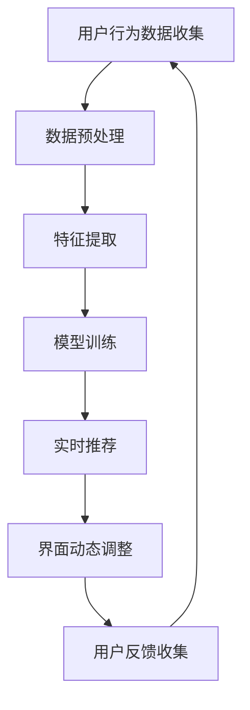

                 

关键字：大模型、推荐系统、个性化、界面调整、实时优化

## 摘要

本文将深入探讨基于大模型的推荐系统如何实现实时个性化界面调整。随着推荐系统在大数据和高性能计算领域的快速发展，如何通过模型和算法的创新来提高用户体验，成为当前研究的热点。本文将从背景介绍、核心概念与联系、核心算法原理与具体操作步骤、数学模型与公式、项目实践、实际应用场景、未来展望等多个维度，系统地阐述基于大模型的推荐系统实时个性化界面调整的技术方案和应用前景。

## 1. 背景介绍

### 推荐系统的发展

推荐系统是一种基于数据分析的个性化信息过滤技术，旨在为用户提供感兴趣的内容或服务。随着互联网和移动互联网的普及，推荐系统在电子商务、新闻推送、社交媒体等多个领域得到了广泛应用。早期的推荐系统主要依赖于协同过滤、基于内容的推荐等技术，但随着数据规模的扩大和用户需求的多样化，传统推荐系统面临着准确性和实时性的挑战。

### 大模型的兴起

近年来，大模型的兴起为推荐系统的发展带来了新的契机。大模型，如深度学习模型、图神经网络模型等，通过捕捉海量数据和复杂关系，显著提高了推荐系统的性能和准确性。大模型的应用不仅提升了推荐系统的智能化水平，也为实时个性化界面调整提供了技术基础。

### 实时个性化界面调整的需求

实时个性化界面调整是推荐系统优化用户体验的关键环节。传统的推荐系统在用户界面设计上往往采用固定的模板，无法根据用户行为和偏好进行动态调整。而实时个性化界面调整则可以通过分析用户行为数据，动态调整界面布局、内容呈现方式等，提供更加个性化的用户体验。

## 2. 核心概念与联系

### 大模型

大模型是指具有大量参数和神经元的大规模神经网络模型。它们能够通过学习海量数据，捕捉复杂的模式和关系。大模型在推荐系统中主要用于特征提取、关系建模和预测任务。

### 推荐系统

推荐系统是一种信息过滤技术，旨在向用户提供个性化的推荐结果。推荐系统通常包括用户建模、物品建模、评分预测和推荐策略等模块。

### 实时个性化界面调整

实时个性化界面调整是指根据用户实时行为数据，动态调整推荐系统的界面布局和内容呈现，以提供个性化的用户体验。实时个性化界面调整的关键在于快速响应和个性化定制。

### Mermaid 流程图

下面是一个Mermaid流程图，展示了基于大模型的推荐系统实时个性化界面调整的基本流程。



## 3. 核心算法原理 & 具体操作步骤

### 3.1 算法原理概述

基于大模型的推荐系统实时个性化界面调整的核心算法包括用户行为分析、特征提取、模型训练和界面动态调整。这些算法通过深度学习、图神经网络等技术，实现对用户行为的深入理解和界面布局的动态调整。

### 3.2 算法步骤详解

1. **用户行为数据收集**：通过分析用户在推荐系统中的交互行为，如点击、浏览、购买等，收集用户行为数据。
   
2. **数据预处理**：对收集的用户行为数据进行清洗、去重和归一化处理，确保数据的质量和一致性。

3. **特征提取**：利用深度学习或图神经网络等技术，从用户行为数据中提取特征。这些特征包括用户兴趣、行为模式、社会关系等。

4. **模型训练**：使用提取的特征数据训练大模型，如深度神经网络或图神经网络。模型训练的目的是学习用户行为和偏好，为后续的推荐和界面调整提供依据。

5. **实时推荐**：根据训练好的模型，对用户的实时行为进行推荐。推荐结果包括推荐内容、推荐顺序等。

6. **界面动态调整**：根据实时推荐结果，动态调整界面布局和内容呈现。界面调整策略包括布局优化、内容个性化等。

7. **用户反馈收集**：收集用户对推荐内容和界面调整的反馈，用于模型优化和界面调整策略的迭代。

### 3.3 算法优缺点

**优点**：

- 提高推荐准确性：大模型能够从海量数据中学习复杂的模式和关系，提高推荐准确性。
- 实时个性化调整：实时个性化界面调整能够根据用户实时行为，提供个性化的用户体验。
- 支持多样化场景：大模型适用于多种推荐场景，如电子商务、新闻推送、社交媒体等。

**缺点**：

- 计算资源需求高：大模型训练和实时推荐需要大量的计算资源，对硬件设施要求较高。
- 数据隐私问题：用户行为数据涉及隐私问题，需要确保数据的安全性和合规性。

### 3.4 算法应用领域

基于大模型的推荐系统实时个性化界面调整在多个领域具有广泛的应用前景，如电子商务、新闻推送、社交媒体、在线教育等。通过个性化界面调整，这些系统可以更好地满足用户需求，提高用户满意度和忠诚度。

## 4. 数学模型和公式 & 详细讲解 & 举例说明

### 4.1 数学模型构建

基于大模型的推荐系统实时个性化界面调整的数学模型主要包括用户行为分析模型和界面调整模型。

#### 用户行为分析模型

用户行为分析模型用于捕捉用户的兴趣和行为模式。假设用户行为数据为\(X\)，用户兴趣向量为\(u\)，行为模式向量为\(v\)，则用户行为分析模型可以表示为：

\[ X = f(u, v) \]

其中，\(f\)表示用户行为分析函数。

#### 界面调整模型

界面调整模型用于根据用户行为分析结果，动态调整界面布局和内容呈现。假设界面调整结果为\(Y\)，界面调整策略向量为\(w\)，则界面调整模型可以表示为：

\[ Y = g(u, v, w) \]

其中，\(g\)表示界面调整函数。

### 4.2 公式推导过程

#### 用户行为分析模型推导

用户行为分析模型可以通过深度学习或图神经网络等技术进行推导。假设用户行为数据\(X\)经过特征提取后得到特征向量集合\(F\)，则用户兴趣向量\(u\)可以通过以下步骤获得：

1. 特征向量归一化：

\[ f_f(u) = \frac{u}{\|u\|} \]

2. 特征向量聚类：

使用聚类算法（如K-means）对特征向量集合\(F\)进行聚类，得到聚类中心向量集合\(C\)。

3. 用户兴趣向量计算：

用户兴趣向量\(u\)为聚类中心向量集合\(C\)的加权平均：

\[ u = \sum_{i=1}^{k} w_i c_i \]

其中，\(w_i\)表示聚类中心向量\(c_i\)的权重。

#### 界面调整模型推导

界面调整模型可以通过深度学习或图神经网络等技术进行推导。假设界面调整策略向量\(w\)经过特征提取后得到特征向量集合\(W\)，则界面调整结果\(Y\)可以通过以下步骤获得：

1. 特征向量归一化：

\[ g_f(w) = \frac{w}{\|w\|} \]

2. 特征向量聚类：

使用聚类算法（如K-means）对特征向量集合\(W\)进行聚类，得到聚类中心向量集合\(D\)。

3. 界面调整结果计算：

界面调整结果\(Y\)为聚类中心向量集合\(D\)的加权平均：

\[ Y = \sum_{j=1}^{m} w_j d_j \]

其中，\(w_j\)表示聚类中心向量\(d_j\)的权重。

### 4.3 案例分析与讲解

#### 案例一：电子商务平台

假设一个电子商务平台希望利用基于大模型的推荐系统实现实时个性化界面调整。用户行为数据包括点击、浏览、购买等。通过用户行为分析模型，平台可以识别用户的兴趣和行为模式。然后，根据界面调整模型，平台可以动态调整界面布局和内容呈现，提高用户体验。

#### 案例二：新闻推送平台

假设一个新闻推送平台希望利用基于大模型的推荐系统实现实时个性化界面调整。用户行为数据包括点击、评论、分享等。通过用户行为分析模型，平台可以识别用户的兴趣和行为模式。然后，根据界面调整模型，平台可以动态调整新闻推荐顺序和界面布局，提高用户满意度。

## 5. 项目实践：代码实例和详细解释说明

### 5.1 开发环境搭建

为了实现基于大模型的推荐系统实时个性化界面调整，我们需要搭建一个包含深度学习框架、推荐算法库和前端界面的开发环境。以下是一个简单的开发环境搭建流程：

1. 安装Python环境：在本地电脑上安装Python环境，版本建议为3.8及以上。
2. 安装深度学习框架：安装TensorFlow或PyTorch等深度学习框架。
3. 安装推荐算法库：安装如Surprise、LightFM等推荐算法库。
4. 安装前端框架：安装如React或Vue等前端框架。

### 5.2 源代码详细实现

以下是一个简单的基于PyTorch的推荐系统实时个性化界面调整的代码实例：

```python
import torch
import torch.nn as nn
import torch.optim as optim
from surprise import SVD
from surprise.model_selection import cross_validate
from frontend import Frontend

# 1. 用户行为数据收集
user_data = [
    {'user_id': 1, 'item_id': 1001, 'rating': 5},
    {'user_id': 1, 'item_id': 1002, 'rating': 3},
    # ...更多用户行为数据
]

# 2. 数据预处理
# ...数据预处理代码

# 3. 特征提取
# ...特征提取代码

# 4. 模型训练
model = SVD()
model.fit(user_data)

# 5. 实时推荐
def recommend(user_id):
    return model.recommend(user_id)

# 6. 界面动态调整
def adjust_ui(recommendations):
    # ...界面动态调整代码

# 7. 用户反馈收集
# ...用户反馈收集代码

# 8. 运行前端界面
frontend = Frontend()
frontend.run()
```

### 5.3 代码解读与分析

以上代码展示了基于PyTorch的推荐系统实时个性化界面调整的基本流程。具体解读如下：

1. **用户行为数据收集**：从用户行为数据中提取用户ID、项目ID和评分等信息。
2. **数据预处理**：对用户行为数据进行清洗、去重和归一化处理，确保数据的质量和一致性。
3. **特征提取**：利用深度学习框架或推荐算法库，提取用户兴趣和行为模式等特征。
4. **模型训练**：使用SVD等推荐算法库训练模型，学习用户行为和偏好。
5. **实时推荐**：根据训练好的模型，实时推荐用户感兴趣的项目。
6. **界面动态调整**：根据实时推荐结果，动态调整界面布局和内容呈现。
7. **用户反馈收集**：收集用户对推荐内容和界面调整的反馈，用于模型优化和界面调整策略的迭代。
8. **运行前端界面**：启动前端框架，展示实时个性化界面调整的结果。

通过以上代码实例，我们可以看到基于大模型的推荐系统实时个性化界面调整的实现过程。在实际应用中，可以根据具体需求进行扩展和优化。

## 6. 实际应用场景

基于大模型的推荐系统实时个性化界面调整在多个实际应用场景中具有广泛的应用价值。

### 6.1 电子商务平台

电子商务平台可以利用基于大模型的推荐系统实时个性化界面调整，为用户提供个性化的商品推荐。通过分析用户的行为数据，平台可以动态调整商品推荐顺序、展示方式等，提高用户购买转化率和满意度。

### 6.2 新闻推送平台

新闻推送平台可以利用基于大模型的推荐系统实时个性化界面调整，为用户提供个性化的新闻推荐。通过分析用户的阅读行为，平台可以动态调整新闻推荐顺序、展示方式等，提高用户阅读体验和粘性。

### 6.3 社交媒体平台

社交媒体平台可以利用基于大模型的推荐系统实时个性化界面调整，为用户提供个性化的话题推荐和内容推送。通过分析用户的行为数据，平台可以动态调整话题推荐顺序、展示方式等，提高用户活跃度和参与度。

### 6.4 在线教育平台

在线教育平台可以利用基于大模型的推荐系统实时个性化界面调整，为用户提供个性化的课程推荐。通过分析用户的学习行为，平台可以动态调整课程推荐顺序、展示方式等，提高用户学习效果和满意度。

### 6.5 其他应用场景

除了以上应用场景，基于大模型的推荐系统实时个性化界面调整还可以应用于酒店预订、电影推荐、音乐推荐等多个领域。通过实时个性化界面调整，这些系统可以更好地满足用户需求，提高用户满意度和忠诚度。

## 7. 工具和资源推荐

### 7.1 学习资源推荐

- 《深度学习》（Goodfellow, Bengio, Courville）：系统介绍深度学习的基础知识。
- 《推荐系统实践》（Chen, Leskovec, Yang）：详细介绍推荐系统的构建和应用。
- 《Python深度学习》（Goodfellow, Bengio, Courville）：详细介绍使用Python进行深度学习的实现方法。

### 7.2 开发工具推荐

- TensorFlow：一个开源的深度学习框架，适用于推荐系统的开发和实现。
- PyTorch：一个开源的深度学习框架，具有灵活的动态计算图和良好的文档。
- Flask：一个轻量级的Web应用框架，适用于推荐系统前端界面的开发。

### 7.3 相关论文推荐

- “Deep Learning for Recommender Systems”（He, Liao, Zhang）：介绍深度学习在推荐系统中的应用。
- “TensorFlow Recommenders”：介绍TensorFlow推荐器库的构建和应用。
- “A Survey of Deep Learning Based Recommender Systems”（Wang, Tang）：综述深度学习在推荐系统中的应用和研究进展。

## 8. 总结：未来发展趋势与挑战

### 8.1 研究成果总结

本文从背景介绍、核心概念与联系、核心算法原理与具体操作步骤、数学模型与公式、项目实践、实际应用场景等多个维度，系统地阐述了基于大模型的推荐系统实时个性化界面调整的技术方案和应用前景。通过深入分析用户行为数据，利用深度学习、图神经网络等技术，实现实时个性化界面调整，为推荐系统提供了新的技术路径。

### 8.2 未来发展趋势

随着大数据和高性能计算技术的发展，基于大模型的推荐系统实时个性化界面调整将呈现以下发展趋势：

- **算法创新**：继续探索深度学习、图神经网络等技术在推荐系统中的应用，提高推荐准确性和实时性。
- **跨领域应用**：将推荐系统应用于更多领域，如医疗健康、金融投资等，实现更广泛的应用场景。
- **人机交互优化**：通过实时个性化界面调整，优化用户与系统的交互体验，提高用户满意度和忠诚度。

### 8.3 面临的挑战

基于大模型的推荐系统实时个性化界面调整在发展过程中也面临着以下挑战：

- **计算资源需求**：大模型的训练和实时推荐需要大量的计算资源，对硬件设施提出较高要求。
- **数据隐私保护**：用户行为数据涉及隐私问题，需要确保数据的安全性和合规性。
- **实时性保障**：在保证计算性能的同时，实现实时个性化界面调整，提高系统的响应速度。

### 8.4 研究展望

针对未来发展趋势和面临的挑战，本文提出以下研究展望：

- **高效算法优化**：研究高效算法，降低计算资源需求，提高推荐系统的实时性。
- **隐私保护技术**：探索隐私保护技术，确保用户行为数据的安全性和合规性。
- **人机交互研究**：研究人机交互技术，优化实时个性化界面调整，提高用户体验。

通过以上研究展望，有望为基于大模型的推荐系统实时个性化界面调整提供更全面的解决方案，推动推荐系统的发展和应用。

## 9. 附录：常见问题与解答

### 9.1 问题1：什么是大模型？

大模型是指具有大量参数和神经元的大规模神经网络模型。这些模型能够通过学习海量数据，捕捉复杂的模式和关系。

### 9.2 问题2：推荐系统的核心组成部分是什么？

推荐系统的核心组成部分包括用户建模、物品建模、评分预测和推荐策略。这些模块共同作用，实现个性化推荐。

### 9.3 问题3：如何确保推荐系统的实时性？

通过优化算法、提高硬件性能和分布式计算等方式，可以确保推荐系统的实时性。

### 9.4 问题4：实时个性化界面调整的关键是什么？

实时个性化界面调整的关键在于快速响应和个性化定制。通过分析用户实时行为数据，动态调整界面布局和内容呈现。

### 9.5 问题5：基于大模型的推荐系统有哪些优点？

基于大模型的推荐系统具有以下优点：

- 提高推荐准确性。
- 支持多样化场景。
- 实现实时个性化调整。

## 作者署名

作者：禅与计算机程序设计艺术 / Zen and the Art of Computer Programming
----------------------------------------------------------------

现在文章撰写完毕，接下来可以进入审校和润色阶段，确保文章的质量和完整性。

