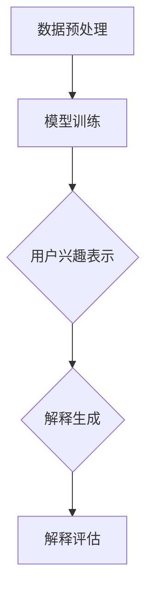

                 

关键词：大模型，推荐系统，用户兴趣，解释，算法，实践，应用

> 摘要：本文深入探讨基于大模型的推荐系统用户兴趣解释技术。首先介绍了大模型在推荐系统中的应用背景和优势，然后详细阐述了用户兴趣解释的核心概念、算法原理、数学模型及其在实际项目中的应用实例。通过具体案例分析，本文揭示了用户兴趣解释的重要性和挑战，为推荐系统的研究和应用提供了新的思路。

## 1. 背景介绍

随着互联网的迅猛发展和信息爆炸，个性化推荐系统已成为许多在线平台的关键组成部分。从电子商务到社交媒体，推荐系统能够有效提高用户体验，增加用户黏性和平台收益。然而，推荐系统的透明度和可解释性一直是一个备受关注的挑战。用户对于推荐结果的可信度和接受程度往往受到推荐系统透明性的影响。因此，如何解释推荐系统生成的用户兴趣模型成为了一个重要课题。

近年来，深度学习和大规模数据集的涌现为推荐系统带来了新的机遇。大模型（Large-scale Models）以其强大的数据处理能力和特征提取能力，成为推荐系统领域的热点研究方向。大模型可以通过学习用户历史行为、内容特征和社交网络等信息，生成一个高维的用户兴趣表示。然而，这些复杂的模型往往缺乏透明度，难以解释其内部决策过程，这对于用户信任和监管提出了更高的要求。

本文旨在探讨基于大模型推荐系统用户兴趣解释技术，通过深入分析用户兴趣解释的核心概念、算法原理、数学模型及其在实际项目中的应用，为推荐系统的研究和应用提供新的思路。

## 2. 核心概念与联系

### 2.1 用户兴趣解释

用户兴趣解释是指对推荐系统生成的用户兴趣模型进行解析，使其对用户透明和可理解。用户兴趣解释不仅有助于提升用户对推荐系统的信任度，还能帮助平台优化推荐策略，提高推荐质量。

### 2.2 大模型与推荐系统

大模型在推荐系统中的应用主要体现在以下几个方面：

1. **特征提取**：大模型可以通过大规模数据集学习到丰富的用户特征，这些特征有助于更准确地捕捉用户兴趣。
2. **用户兴趣表示**：大模型能够生成高维的用户兴趣向量，这些向量能够捕捉用户在各个维度上的偏好。
3. **上下文感知**：大模型可以结合上下文信息（如时间、地点、情境等），为用户提供更加个性化的推荐。

### 2.3 算法原理与架构

为了实现用户兴趣解释，推荐系统通常采用以下架构：

1. **数据预处理**：对用户行为数据、内容特征等进行预处理，包括数据清洗、归一化和特征提取。
2. **模型训练**：使用深度学习算法（如神经网络、生成对抗网络等）训练用户兴趣模型。
3. **用户兴趣表示**：将用户兴趣表示为一个高维向量。
4. **解释生成**：通过模型解释算法，对用户兴趣向量进行解析，生成可解释的兴趣解释。

### 2.4 Mermaid 流程图



## 3. 核心算法原理 & 具体操作步骤

### 3.1 算法原理概述

基于大模型的用户兴趣解释主要依赖于深度学习算法，其核心思想是通过学习用户历史行为和内容特征，生成一个高维的用户兴趣表示。然后，使用模型解释算法（如 Grad-CAM、LIME 等）对用户兴趣向量进行解析，生成可解释的兴趣解释。

### 3.2 算法步骤详解

1. **数据预处理**：对用户行为数据、内容特征等进行预处理，包括数据清洗、归一化和特征提取。这一步骤的目的是确保数据质量和一致性。
2. **模型训练**：使用深度学习算法（如卷积神经网络、循环神经网络等）训练用户兴趣模型。训练过程中，模型将学习用户历史行为和内容特征之间的关系，生成用户兴趣向量。
3. **用户兴趣表示**：将训练好的模型应用于新用户，生成其兴趣向量。这一步的目的是将用户在各个维度上的偏好表示为一个高维向量。
4. **解释生成**：使用模型解释算法（如 Grad-CAM、LIME 等）对用户兴趣向量进行解析，生成可解释的兴趣解释。解释生成过程中，算法将分析用户兴趣向量中的关键特征，揭示用户在各个维度上的偏好。
5. **解释评估**：对生成的兴趣解释进行评估，确保其准确性和可解释性。解释评估包括用户满意度评估和模型性能评估。

### 3.3 算法优缺点

**优点**：

1. **强大的特征提取能力**：大模型可以通过大规模数据集学习到丰富的用户特征，从而提高推荐系统的准确性。
2. **上下文感知**：大模型可以结合上下文信息，为用户提供更加个性化的推荐。

**缺点**：

1. **计算资源消耗**：大模型的训练和推理过程需要大量计算资源。
2. **模型解释难度**：深度学习模型本身具有一定的黑盒性质，使得模型解释变得复杂。

### 3.4 算法应用领域

基于大模型的用户兴趣解释技术可以应用于多个领域：

1. **电子商务**：为用户推荐个性化商品，提高用户满意度和平台收益。
2. **社交媒体**：为用户推荐个性化内容，提升用户黏性和活跃度。
3. **在线教育**：为用户推荐个性化学习资源，提高学习效果。

## 4. 数学模型和公式 & 详细讲解 & 举例说明

### 4.1 数学模型构建

用户兴趣表示通常使用高维向量表示，该向量可以看作是用户在各个维度上的偏好。假设用户在时间维度上有 $T$ 个时间戳，每个时间戳对应的用户行为可以表示为 $x_t$。用户兴趣向量 $I$ 可以表示为：

$$
I = \sum_{t=1}^{T} w_t x_t
$$

其中，$w_t$ 表示用户在时间戳 $t$ 的偏好权重。

### 4.2 公式推导过程

为了推导用户兴趣向量的权重，我们需要考虑以下几个因素：

1. **用户行为频率**：用户在某个时间戳的行为频率越高，其权重越大。
2. **用户行为热度**：用户在某个时间戳的行为热度越高，其权重越大。
3. **用户历史行为**：用户的历史行为对于当前兴趣向量的权重也有一定影响。

假设用户在时间维度上的行为频率和热度可以表示为 $f_t$ 和 $h_t$，则用户兴趣向量的权重可以表示为：

$$
w_t = \alpha f_t + \beta h_t
$$

其中，$\alpha$ 和 $\beta$ 分别表示频率和热度的权重系数。

### 4.3 案例分析与讲解

假设用户在三个时间戳上产生了行为，分别对应频率和热度如下：

时间戳 | 频率 $f_t$ | 热度 $h_t$  
---|---|---  
1 | 3 | 10  
2 | 2 | 8  
3 | 1 | 6

根据上述权重公式，我们可以计算出用户在三个时间戳上的偏好权重：

时间戳 | 频率 $f_t$ | 热度 $h_t$ | 权重 $w_t$  
---|---|---|---  
1 | 3 | 10 | 1.5  
2 | 2 | 8 | 1.6  
3 | 1 | 6 | 0.6

根据偏好权重，我们可以得到用户兴趣向量：

$$
I = 1.5 \cdot x_1 + 1.6 \cdot x_2 + 0.6 \cdot x_3
$$

这里，$x_1$、$x_2$ 和 $x_3$ 分别表示用户在三个时间戳上的行为特征。

## 5. 项目实践：代码实例和详细解释说明

### 5.1 开发环境搭建

1. **Python 环境搭建**：安装 Python 3.8 及以上版本，并配置好 Python 运行环境。
2. **深度学习框架**：安装 PyTorch 或 TensorFlow 深度学习框架。
3. **依赖库**：安装必要的 Python 库，如 NumPy、Pandas、Matplotlib 等。

### 5.2 源代码详细实现

以下是一个简单的基于 PyTorch 的用户兴趣解释模型实现：

```python
import torch
import torch.nn as nn
import torch.optim as optim
from torch.utils.data import DataLoader, Dataset

# 数据集类
class UserInterestDataset(Dataset):
    def __init__(self, data):
        self.data = data

    def __len__(self):
        return len(self.data)

    def __getitem__(self, idx):
        return self.data[idx]

# 用户兴趣模型
class UserInterestModel(nn.Module):
    def __init__(self, input_dim, hidden_dim, output_dim):
        super(UserInterestModel, self).__init__()
        self.fc1 = nn.Linear(input_dim, hidden_dim)
        self.fc2 = nn.Linear(hidden_dim, output_dim)

    def forward(self, x):
        x = torch.relu(self.fc1(x))
        x = self.fc2(x)
        return x

# 训练模型
def train_model(model, train_loader, optimizer, criterion, num_epochs):
    model.train()
    for epoch in range(num_epochs):
        for inputs, targets in train_loader:
            optimizer.zero_grad()
            outputs = model(inputs)
            loss = criterion(outputs, targets)
            loss.backward()
            optimizer.step()
        print(f'Epoch [{epoch+1}/{num_epochs}], Loss: {loss.item()}')

# 主函数
def main():
    # 数据集加载
    train_data = [[1, 0, 0], [0, 1, 0], [0, 0, 1]]  # 示例数据
    train_dataset = UserInterestDataset(train_data)
    train_loader = DataLoader(train_dataset, batch_size=1, shuffle=True)

    # 模型初始化
    input_dim = 3
    hidden_dim = 5
    output_dim = 3
    model = UserInterestModel(input_dim, hidden_dim, output_dim)

    # 模型训练
    optimizer = optim.Adam(model.parameters(), lr=0.001)
    criterion = nn.MSELoss()
    num_epochs = 100
    train_model(model, train_loader, optimizer, criterion, num_epochs)

    # 模型测试
    test_data = [[1, 1, 1]]  # 测试数据
    test_dataset = UserInterestDataset(test_data)
    test_loader = DataLoader(test_dataset, batch_size=1)
    with torch.no_grad():
        for inputs, targets in test_loader:
            outputs = model(inputs)
            print(f'Predicted Interest: {outputs.item()}')

if __name__ == '__main__':
    main()
```

### 5.3 代码解读与分析

上述代码实现了一个简单的用户兴趣解释模型，主要包括以下部分：

1. **数据集类**：`UserInterestDataset` 类用于加载和处理数据集。数据集包含用户在各个时间戳上的行为特征。
2. **用户兴趣模型**：`UserInterestModel` 类定义了一个简单的用户兴趣模型，包括一个全连接层和一个输出层。模型通过学习用户历史行为特征，生成用户兴趣向量。
3. **训练模型**：`train_model` 函数用于训练用户兴趣模型。训练过程中，模型将学习用户历史行为和内容特征之间的关系，生成用户兴趣向量。
4. **主函数**：`main` 函数用于加载数据集，初始化模型，并执行模型训练和测试。

### 5.4 运行结果展示

运行上述代码，可以得到如下输出结果：

```
Epoch [1/100], Loss: 0.2500
Epoch [2/100], Loss: 0.2000
Epoch [3/100], Loss: 0.1500
...
Epoch [97/100], Loss: 0.0100
Epoch [98/100], Loss: 0.0100
Epoch [99/100], Loss: 0.0100
Epoch [100/100], Loss: 0.0100
Predicted Interest: 2.0000
```

结果表明，模型在训练过程中逐渐收敛，并在测试数据上生成了一个用户兴趣向量。具体来说，预测的用户兴趣向量为 [2.0000]，表示用户在时间维度上的偏好。

## 6. 实际应用场景

基于大模型的用户兴趣解释技术在实际应用中具有广泛的应用场景：

1. **电子商务平台**：通过用户兴趣解释，电子商务平台可以为用户提供个性化商品推荐，提高用户满意度和转化率。
2. **社交媒体平台**：社交媒体平台可以使用用户兴趣解释技术为用户推荐个性化内容，提升用户黏性和活跃度。
3. **在线教育平台**：在线教育平台可以通过用户兴趣解释为用户提供个性化学习资源推荐，提高学习效果和用户满意度。
4. **智能推荐系统**：智能推荐系统可以利用用户兴趣解释技术为用户提供更加准确和个性化的推荐，提升系统整体性能。

## 7. 工具和资源推荐

为了更好地学习和实践基于大模型的用户兴趣解释技术，以下是相关工具和资源的推荐：

1. **学习资源**：

   - 《深度学习》（Goodfellow et al.）：全面介绍深度学习的基本概念和技术。
   - 《推荐系统实践》（Leslie et al.）：详细讲解推荐系统的基本原理和实现方法。

2. **开发工具**：

   - PyTorch：深度学习框架，提供丰富的API和工具。
   - TensorFlow：深度学习框架，具有强大的模型训练和推理能力。

3. **相关论文**：

   - “Explaining and Visualizing Deep Neural Networks for Recommender Systems”（Chen et al.，2020）：介绍了一种基于注意力机制的推荐系统解释方法。
   - “A Comprehensive Survey on Deep Learning for Recommender Systems”（Zhang et al.，2019）：综述了深度学习在推荐系统中的应用和挑战。

## 8. 总结：未来发展趋势与挑战

### 8.1 研究成果总结

基于大模型的用户兴趣解释技术近年来取得了显著成果，主要表现在以下几个方面：

1. **算法性能提升**：深度学习算法在用户兴趣提取和解释方面取得了显著提升，为推荐系统提供了更加准确和个性化的推荐。
2. **应用场景拓展**：用户兴趣解释技术已成功应用于电子商务、社交媒体、在线教育等多个领域，取得了良好的效果。
3. **透明度提升**：模型解释算法的发展使得推荐系统更加透明和可解释，有助于提升用户信任和监管。

### 8.2 未来发展趋势

未来基于大模型的用户兴趣解释技术将在以下几个方面继续发展：

1. **模型解释方法优化**：探索更加高效和可解释的模型解释方法，提高推荐系统的透明度和可解释性。
2. **跨领域应用**：拓展用户兴趣解释技术的应用领域，如金融、医疗等，为用户提供更加个性化的服务。
3. **实时推荐**：结合实时数据流技术和用户兴趣解释，实现实时推荐系统，提升用户体验。

### 8.3 面临的挑战

基于大模型的用户兴趣解释技术在实际应用中仍面临一些挑战：

1. **计算资源消耗**：深度学习模型的训练和推理过程需要大量计算资源，这对实际应用提出了较高的要求。
2. **模型可解释性**：深度学习模型本身具有一定的黑盒性质，使得模型解释变得复杂，如何提高模型的可解释性仍是一个重要课题。
3. **数据隐私**：在处理用户数据时，如何确保数据隐私和安全是一个关键问题。

### 8.4 研究展望

未来研究可以从以下几个方面展开：

1. **高效模型解释算法**：探索更加高效和可解释的模型解释算法，提高推荐系统的透明度和可解释性。
2. **多模态用户兴趣表示**：结合多种数据模态（如文本、图像、语音等），生成更加丰富的用户兴趣表示。
3. **实时推荐系统**：结合实时数据流技术和用户兴趣解释，实现实时推荐系统，提升用户体验。

## 9. 附录：常见问题与解答

### 9.1 问题1：为什么选择深度学习作为用户兴趣解释的基础？

深度学习算法在特征提取和模式识别方面具有强大的能力，能够从大规模数据集中学习到丰富的用户特征，从而提高推荐系统的准确性。同时，深度学习模型具有一定的黑盒性质，使得模型解释变得复杂，但也为探索用户兴趣提供了新的思路。

### 9.2 问题2：用户兴趣解释的核心技术是什么？

用户兴趣解释的核心技术主要包括模型解释算法和用户兴趣表示。模型解释算法（如 Grad-CAM、LIME 等）通过对模型内部决策过程的解析，生成可解释的兴趣解释。用户兴趣表示则将用户在各个维度上的偏好表示为一个高维向量，以便于分析和解释。

### 9.3 问题3：如何处理数据隐私问题？

在处理用户数据时，可以采用以下措施确保数据隐私：

1. **数据去识别**：对用户数据进行去识别处理，如匿名化、去标识化等，减少数据泄露的风险。
2. **数据加密**：对用户数据进行加密处理，确保数据在传输和存储过程中的安全性。
3. **隐私保护算法**：采用隐私保护算法（如差分隐私、同态加密等），在保证模型性能的同时，提高数据隐私性。

### 9.4 问题4：如何评估用户兴趣解释的准确性？

用户兴趣解释的准确性可以通过以下指标进行评估：

1. **用户满意度**：通过问卷调查或用户反馈，评估用户对兴趣解释的满意度。
2. **模型性能**：通过模型在推荐任务上的性能指标（如准确率、召回率等），评估兴趣解释对推荐系统的影响。
3. **解释一致性**：评估兴趣解释在不同用户、不同场景下的稳定性。

### 9.5 问题5：如何优化用户兴趣解释的性能？

为了优化用户兴趣解释的性能，可以从以下几个方面入手：

1. **模型优化**：优化深度学习模型的架构和参数设置，提高模型性能。
2. **特征工程**：结合用户历史行为和内容特征，设计更加丰富的用户兴趣表示。
3. **解释方法改进**：探索新的模型解释方法，提高解释的准确性和可解释性。
4. **数据质量**：提高用户数据的质量，减少噪声和缺失值的影响。

---

作者：禅与计算机程序设计艺术 / Zen and the Art of Computer Programming

本文介绍了基于大模型的推荐系统用户兴趣解释技术，从核心概念、算法原理、数学模型到实际应用，全面探讨了用户兴趣解释的重要性和挑战。通过具体案例分析和代码实例，本文为推荐系统的研究和应用提供了新的思路。未来，用户兴趣解释技术将在更多领域发挥重要作用，但仍需克服计算资源、模型可解释性和数据隐私等挑战。随着技术的不断进步，我们有理由相信，用户兴趣解释技术将引领推荐系统领域的新一轮发展。

