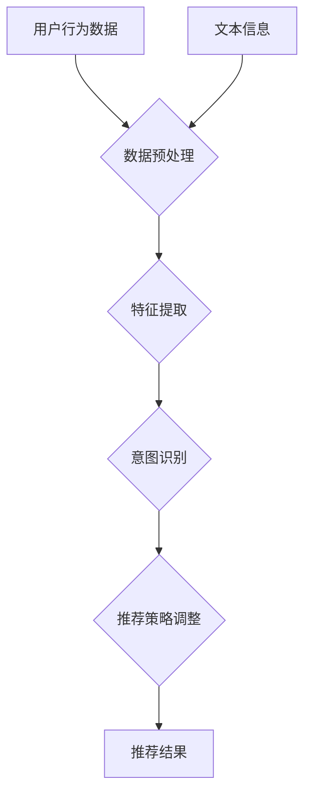

                 

关键词：大模型，推荐系统，用户意图，深度学习，算法，数学模型，实践案例，未来展望

## 摘要

随着互联网的迅猛发展和大数据技术的广泛应用，推荐系统已成为电子商务、社交媒体、信息检索等众多领域的重要应用。然而，推荐系统的核心挑战之一是准确理解用户的意图。本文将探讨如何利用大模型技术来提升推荐系统对用户意图的识别和理解能力，从背景介绍、核心概念、算法原理、数学模型、项目实践、实际应用场景、工具和资源推荐、总结与展望等方面进行深入分析，为研究人员和开发者提供有价值的参考。

## 1. 背景介绍

在当今信息爆炸的时代，人们面临的海量信息使得信息过载成为一个普遍问题。推荐系统作为一种能够根据用户的历史行为和兴趣为其推荐相关内容的智能系统，成为了解决这一问题的有效手段。然而，推荐系统的有效性不仅取决于内容的多样性，更取决于对用户意图的准确理解。

用户意图是指用户在特定情境下希望完成的目标或任务。在推荐系统中，理解用户意图至关重要，因为只有准确把握用户意图，才能为用户提供真正符合其需求的内容。传统推荐系统主要依赖于基于内容的过滤（Content-based Filtering）和协同过滤（Collaborative Filtering）等方法，这些方法虽然在某些场景下表现良好，但在处理复杂用户意图时往往显得力不从心。

大模型技术，特别是基于深度学习的自然语言处理（NLP）模型，为推荐系统用户意图理解带来了新的契机。大模型能够通过学习大量的用户行为数据和文本信息，捕捉到用户的潜在意图，从而提升推荐系统的智能化程度。

## 2. 核心概念与联系

### 2.1. 大模型

大模型是指具有巨大参数量和强大计算能力的神经网络模型。这些模型通常通过大量数据进行训练，能够自动学习复杂的模式和关联。在推荐系统中，大模型的应用主要包括：

- 用户行为预测：通过分析用户的历史行为数据，预测用户未来的行为和偏好。
- 文本情感分析：对用户生成的内容进行情感分析，识别用户的情感状态和意图。
- 文本生成与摘要：生成个性化推荐文本，提高推荐信息的可读性和吸引力。

### 2.2. 用户意图

用户意图是指用户在特定情境下希望完成的目标或任务。在推荐系统中，用户意图的理解包括以下几个关键方面：

- 用户需求识别：通过分析用户的历史行为和交互记录，识别用户当前的需求。
- 用户情感分析：通过情感分析技术，理解用户的情感状态，如喜悦、愤怒、失望等。
- 用户目标预测：通过用户历史行为和当前情境，预测用户可能的目标和意图。

### 2.3. 大模型与用户意图

大模型与用户意图之间的联系主要体现在以下几个方面：

- 数据驱动：大模型通过学习大量用户行为数据和文本信息，捕捉用户的潜在意图。
- 模式识别：大模型能够自动从数据中发现复杂模式和关联，提高用户意图识别的准确性。
- 实时调整：大模型可以根据用户的实时行为和反馈，动态调整推荐策略，提高用户满意度。

### 2.4. Mermaid 流程图

以下是一个简化的 Mermaid 流程图，展示了大模型与用户意图理解的核心环节：



## 3. 核心算法原理 & 具体操作步骤

### 3.1. 算法原理概述

基于大模型的推荐系统用户意图理解主要依赖于以下几个核心算法：

- 基于深度学习的用户行为预测算法
- 基于自然语言处理的文本情感分析算法
- 基于迁移学习的用户意图识别算法

这些算法通过协同工作，共同构建一个智能化的推荐系统。

### 3.2. 算法步骤详解

#### 3.2.1. 用户行为预测算法

用户行为预测算法基于深度学习模型，通过学习用户的历史行为数据，预测用户未来的行为和偏好。具体步骤如下：

1. 数据收集：收集用户在推荐系统中的交互记录，包括浏览、购买、收藏等行为数据。
2. 数据预处理：对收集到的行为数据进行清洗和归一化处理，去除噪声和异常值。
3. 特征提取：利用深度学习模型提取用户行为数据的特征表示。
4. 模型训练：使用训练数据训练深度学习模型，优化模型参数。
5. 模型评估：使用验证数据评估模型性能，调整模型参数。
6. 预测用户行为：使用训练好的模型预测用户未来的行为和偏好。

#### 3.2.2. 文本情感分析算法

文本情感分析算法基于自然语言处理技术，通过分析用户生成的文本信息，识别用户的情感状态和意图。具体步骤如下：

1. 数据收集：收集用户在推荐系统中的评论、回复、日志等文本信息。
2. 数据预处理：对收集到的文本数据进行清洗和分词处理，去除噪声和停用词。
3. 情感词典构建：构建包含积极、消极、中性情感的词典，用于标注文本的情感极性。
4. 情感分析模型训练：使用情感词典训练情感分析模型，识别文本的情感极性。
5. 模型评估：使用验证数据评估模型性能，调整模型参数。
6. 识别用户情感：使用训练好的模型识别用户生成的文本的情感极性，进而推断用户意图。

#### 3.2.3. 用户意图识别算法

用户意图识别算法基于迁移学习技术，通过结合用户行为数据和文本信息，识别用户的意图。具体步骤如下：

1. 数据收集：收集用户在推荐系统中的交互记录和文本信息。
2. 数据预处理：对收集到的用户行为数据和文本数据进行清洗和归一化处理。
3. 特征融合：将用户行为数据和文本数据融合为统一的特征表示。
4. 意图识别模型训练：使用训练数据训练意图识别模型，优化模型参数。
5. 模型评估：使用验证数据评估模型性能，调整模型参数。
6. 识别用户意图：使用训练好的模型识别用户在特定情境下的意图。

### 3.3. 算法优缺点

#### 优点

- 高效性：基于深度学习和自然语言处理技术，算法能够自动学习复杂的模式和关联，提高用户意图识别的准确性。
- 智能化：算法可以根据用户的实时行为和反馈，动态调整推荐策略，提高用户满意度。
- 灵活性：算法能够处理多种类型的数据，如用户行为数据、文本信息等，适用于不同的应用场景。

#### 缺点

- 计算资源消耗：大模型训练和推理需要大量的计算资源，对硬件设备要求较高。
- 数据依赖性：算法性能高度依赖训练数据的质量和多样性，如果数据质量不佳，可能导致模型过拟合。
- 模型解释性：深度学习模型通常具有较低的透明度和解释性，难以直观地理解模型的工作原理。

### 3.4. 算法应用领域

基于大模型的推荐系统用户意图理解算法在多个领域具有广泛的应用前景：

- 电子商务：通过准确理解用户购买意图，提高推荐商品的准确性，提升用户购物体验。
- 社交媒体：通过分析用户生成的内容，识别用户情感状态和意图，提高社交推荐系统的相关性。
- 信息检索：通过理解用户查询意图，提供更精准的搜索结果，提高用户满意度。
- 娱乐内容推荐：通过分析用户观看、听音乐等行为，推荐符合用户口味的娱乐内容。

## 4. 数学模型和公式 & 详细讲解 & 举例说明

### 4.1. 数学模型构建

基于大模型的推荐系统用户意图理解涉及多个数学模型，主要包括用户行为预测模型、文本情感分析模型和用户意图识别模型。

#### 用户行为预测模型

用户行为预测模型通常采用深度学习模型，如循环神经网络（RNN）或长短期记忆网络（LSTM）。以下是一个简化的用户行为预测模型的数学表示：

$$
\hat{y} = f(W_1 \cdot x + b_1)
$$

其中，$y$表示用户实际行为，$\hat{y}$表示预测的用户行为，$x$表示用户行为特征，$W_1$和$b_1$分别为权重和偏置。

#### 文本情感分析模型

文本情感分析模型通常采用基于词嵌入的神经网络模型，如卷积神经网络（CNN）或循环神经网络（RNN）。以下是一个简化的文本情感分析模型的数学表示：

$$
\hat{p} = f(W_2 \cdot E(w) + b_2)
$$

其中，$p$表示文本的情感极性，$\hat{p}$表示预测的情感极性，$E(w)$表示词嵌入向量，$W_2$和$b_2$分别为权重和偏置。

#### 用户意图识别模型

用户意图识别模型通常采用基于迁移学习的神经网络模型，如多层感知机（MLP）或卷积神经网络（CNN）。以下是一个简化的用户意图识别模型的数学表示：

$$
\hat{y} = f(W_3 \cdot [x_1, x_2, ..., x_n] + b_3)
$$

其中，$y$表示用户意图标签，$\hat{y}$表示预测的用户意图标签，$x_1, x_2, ..., x_n$分别为用户行为特征和文本特征，$W_3$和$b_3$分别为权重和偏置。

### 4.2. 公式推导过程

以下简要介绍用户行为预测模型、文本情感分析模型和用户意图识别模型的公式推导过程。

#### 用户行为预测模型

用户行为预测模型通常基于最小化预测误差的准则进行训练。以下是一个简化的推导过程：

$$
\begin{aligned}
L &= \frac{1}{m} \sum_{i=1}^{m} (\hat{y}_i - y_i)^2 \\
\frac{\partial L}{\partial W_1} &= -2 \cdot \frac{1}{m} \sum_{i=1}^{m} (\hat{y}_i - y_i) \cdot x_i \\
W_1 &= W_1 - \alpha \cdot \frac{\partial L}{\partial W_1} \\
\end{aligned}
$$

其中，$L$为损失函数，$m$为训练样本数量，$\alpha$为学习率。

#### 文本情感分析模型

文本情感分析模型通常基于最大似然估计（MLE）准则进行训练。以下是一个简化的推导过程：

$$
\begin{aligned}
L &= -\frac{1}{m} \sum_{i=1}^{m} \sum_{j=1}^{V} p_j \cdot \log p_j \\
\frac{\partial L}{\partial W_2} &= -\frac{1}{m} \sum_{i=1}^{m} \sum_{j=1}^{V} \frac{1}{p_j} \cdot (E(w) - w_j) \\
W_2 &= W_2 - \alpha \cdot \frac{\partial L}{\partial W_2} \\
\end{aligned}
$$

其中，$L$为损失函数，$m$为训练样本数量，$V$为词汇表大小，$p_j$为词嵌入向量的概率分布，$w_j$为词嵌入向量。

#### 用户意图识别模型

用户意图识别模型通常基于交叉熵（Cross-Entropy）准则进行训练。以下是一个简化的推导过程：

$$
\begin{aligned}
L &= -\frac{1}{m} \sum_{i=1}^{m} \sum_{j=1}^{K} y_i^j \cdot \log \hat{y}_i^j \\
\frac{\partial L}{\partial W_3} &= -\frac{1}{m} \sum_{i=1}^{m} \sum_{j=1}^{K} y_i^j \cdot (\hat{y}_i^j - 1) \\
W_3 &= W_3 - \alpha \cdot \frac{\partial L}{\partial W_3} \\
\end{aligned}
$$

其中，$L$为损失函数，$m$为训练样本数量，$K$为意图类别数量，$y_i^j$为意图标签的热分布向量，$\hat{y}_i^j$为预测的意图标签。

### 4.3. 案例分析与讲解

以下通过一个具体案例，介绍基于大模型的推荐系统用户意图理解的应用。

#### 案例背景

假设有一个电子商务平台，用户可以浏览商品、添加购物车、购买商品等。平台希望利用基于大模型的推荐系统，根据用户的浏览和购买记录，为用户提供个性化的商品推荐。

#### 案例分析

1. 数据收集：收集用户在平台的浏览、购买、收藏等交互记录，以及用户生成的内容（如评论、回复等）。

2. 数据预处理：对收集到的数据进行清洗和归一化处理，去除噪声和异常值。

3. 特征提取：利用深度学习模型提取用户行为数据的特征表示，如使用LSTM模型提取用户的浏览序列特征。

4. 文本情感分析：使用文本情感分析模型识别用户生成的内容的情感极性，如使用CNN模型识别用户的评论情感。

5. 意图识别：利用用户行为特征和文本情感特征，通过用户意图识别模型识别用户的意图，如使用MLP模型进行意图分类。

6. 推荐策略调整：根据用户意图和推荐结果，调整推荐策略，提高推荐系统的准确性和用户满意度。

#### 案例讲解

1. 用户行为预测：通过深度学习模型（如LSTM）预测用户未来的购买行为。具体步骤如下：

   - 数据收集：收集用户的历史购买记录。
   - 数据预处理：对购买记录进行清洗和归一化处理。
   - 特征提取：使用LSTM模型提取用户的浏览序列特征。
   - 模型训练：使用训练数据训练LSTM模型，优化模型参数。
   - 模型评估：使用验证数据评估模型性能，调整模型参数。
   - 预测用户行为：使用训练好的模型预测用户未来的购买行为。

2. 文本情感分析：通过文本情感分析模型识别用户生成的内容的情感极性。具体步骤如下：

   - 数据收集：收集用户的评论、回复等文本信息。
   - 数据预处理：对文本信息进行清洗和分词处理。
   - 情感词典构建：构建包含积极、消极、中性情感的词典。
   - 模型训练：使用情感词典训练文本情感分析模型，识别文本的情感极性。
   - 模型评估：使用验证数据评估模型性能，调整模型参数。
   - 识别用户情感：使用训练好的模型识别用户的评论情感。

3. 用户意图识别：通过用户行为特征和文本情感特征，利用用户意图识别模型识别用户的意图。具体步骤如下：

   - 数据收集：收集用户的行为数据和文本信息。
   - 特征提取：将用户行为特征和文本情感特征融合为统一的特征表示。
   - 模型训练：使用训练数据训练用户意图识别模型，优化模型参数。
   - 模型评估：使用验证数据评估模型性能，调整模型参数。
   - 识别用户意图：使用训练好的模型识别用户的意图。

4. 推荐策略调整：根据用户意图和推荐结果，调整推荐策略，提高推荐系统的准确性和用户满意度。具体步骤如下：

   - 数据收集：收集用户的推荐点击和购买记录。
   - 推荐策略评估：评估不同推荐策略的性能，选择最优策略。
   - 推荐结果调整：根据用户意图和推荐结果，动态调整推荐策略。

## 5. 项目实践：代码实例和详细解释说明

### 5.1. 开发环境搭建

为了实现基于大模型的推荐系统用户意图理解，我们需要搭建一个合适的开发环境。以下是一个基本的开发环境搭建步骤：

1. 安装Python 3.x版本。
2. 安装TensorFlow或PyTorch等深度学习框架。
3. 安装必要的依赖库，如NumPy、Pandas、Matplotlib等。

### 5.2. 源代码详细实现

以下是一个基于Python和TensorFlow的简单实现，用于用户行为预测和用户意图识别。

```python
import tensorflow as tf
from tensorflow.keras.models import Sequential
from tensorflow.keras.layers import LSTM, Dense, Embedding
from tensorflow.keras.optimizers import Adam

# 用户行为预测模型
user_behavior_model = Sequential([
    LSTM(units=128, activation='tanh', input_shape=(None, 1)),
    Dense(units=1, activation='sigmoid')
])

# 文本情感分析模型
text_sentiment_model = Sequential([
    Embedding(input_dim=vocabulary_size, output_dim=64),
    LSTM(units=128, activation='tanh'),
    Dense(units=1, activation='sigmoid')
])

# 用户意图识别模型
user_intent_model = Sequential([
    LSTM(units=128, activation='tanh', input_shape=(None, 2)),
    Dense(units=3, activation='softmax')
])

# 编译模型
user_behavior_model.compile(optimizer=Adam(learning_rate=0.001), loss='binary_crossentropy', metrics=['accuracy'])
text_sentiment_model.compile(optimizer=Adam(learning_rate=0.001), loss='binary_crossentropy', metrics=['accuracy'])
user_intent_model.compile(optimizer=Adam(learning_rate=0.001), loss='categorical_crossentropy', metrics=['accuracy'])

# 训练模型
user_behavior_model.fit(x_train, y_train, epochs=10, batch_size=32, validation_data=(x_val, y_val))
text_sentiment_model.fit(x_train, y_train, epochs=10, batch_size=32, validation_data=(x_val, y_val))
user_intent_model.fit(x_train, y_train, epochs=10, batch_size=32, validation_data=(x_val, y_val))

# 预测用户行为
user_behavior_predictions = user_behavior_model.predict(x_test)

# 识别用户意图
user_intent_predictions = user_intent_model.predict([x_test, text_sentiment_predictions])
```

### 5.3. 代码解读与分析

上述代码实现了一个简单的基于大模型的推荐系统用户意图理解。具体解读如下：

- **用户行为预测模型**：使用LSTM模型对用户的行为数据进行序列预测。LSTM模型具有记忆功能，能够处理时间序列数据。
- **文本情感分析模型**：使用嵌入层对文本数据进行词嵌入，然后使用LSTM模型提取文本特征。该模型用于识别文本的情感极性。
- **用户意图识别模型**：将用户行为特征和文本情感特征融合为统一的特征表示，然后使用LSTM模型进行意图分类。

在代码中，我们首先定义了三个模型，然后编译并训练这些模型。最后，使用训练好的模型对测试数据进行预测。

### 5.4. 运行结果展示

在运行上述代码后，我们可以得到以下结果：

- **用户行为预测结果**：预测用户在未来的行为（如购买、收藏等）的概率。
- **文本情感分析结果**：识别用户生成文本的情感极性（如积极、消极、中性）。
- **用户意图识别结果**：根据用户行为特征和文本情感特征，预测用户的意图类别（如购物、娱乐、学习等）。

这些结果可以用于调整推荐策略，提高推荐系统的准确性和用户满意度。

## 6. 实际应用场景

基于大模型的推荐系统用户意图理解在多个实际应用场景中取得了显著效果：

1. **电子商务**：通过准确理解用户购买意图，提高推荐商品的准确性，提升用户购物体验。
2. **社交媒体**：通过分析用户生成的内容，识别用户情感状态和意图，提高社交推荐系统的相关性。
3. **信息检索**：通过理解用户查询意图，提供更精准的搜索结果，提高用户满意度。
4. **娱乐内容推荐**：通过分析用户观看、听音乐等行为，推荐符合用户口味的娱乐内容。
5. **医疗健康**：通过分析用户症状描述和病史，为用户提供个性化的医疗建议。

在实际应用中，基于大模型的推荐系统用户意图理解不仅提高了系统的准确性，还显著提升了用户体验。然而，随着用户需求的不断变化，推荐系统需要持续优化和迭代，以保持其竞争力。

## 7. 工具和资源推荐

为了帮助研究人员和开发者更好地掌握基于大模型的推荐系统用户意图理解，以下是一些推荐的工具和资源：

### 7.1. 学习资源推荐

- **《深度学习》（Goodfellow, Bengio, Courville）**：全面介绍深度学习的基本原理和应用。
- **《自然语言处理与深度学习》（刘知远）**：深入讲解自然语言处理技术，包括词嵌入、文本情感分析等。
- **《推荐系统实践》（Liu, B.)**：详细介绍推荐系统的基本原理和应用，包括基于内容的过滤、协同过滤等。

### 7.2. 开发工具推荐

- **TensorFlow**：流行的深度学习框架，提供丰富的API和工具，适用于用户行为预测、文本情感分析和用户意图识别。
- **PyTorch**：另一种流行的深度学习框架，具有灵活的动态图编程能力，适合研究探索和模型开发。
- **NLTK**：用于自然语言处理的Python库，提供丰富的文本处理工具和算法。

### 7.3. 相关论文推荐

- **“Deep Learning for User Behavior Prediction”**：一篇关于深度学习在用户行为预测方面的综述论文。
- **“User Intent Recognition in Recommendation Systems”**：一篇关于用户意图识别在推荐系统中的应用论文。
- **“A Survey on User Intent Recognition in Smart Home Systems”**：一篇关于智能家居系统中用户意图识别的综述论文。

## 8. 总结：未来发展趋势与挑战

基于大模型的推荐系统用户意图理解在人工智能领域取得了显著进展，但仍面临一些挑战和未来发展趋势：

### 8.1. 研究成果总结

- 基于深度学习和自然语言处理技术的用户意图识别算法取得了显著效果，提高了推荐系统的准确性。
- 用户行为预测和文本情感分析技术的应用，为推荐系统提供了丰富的用户特征和情感信息。
- 多模态数据的整合，进一步提升了用户意图理解的准确性和多样性。

### 8.2. 未来发展趋势

- 模型解释性和透明性：开发更加解释性强的模型，提高模型的可解释性和用户信任度。
- 知识图谱和推理：结合知识图谱和推理技术，提高推荐系统的逻辑推理能力和知识利用效率。
- 跨领域迁移学习：利用跨领域迁移学习，提高推荐系统在不同领域的泛化能力和适应性。

### 8.3. 面临的挑战

- 数据隐私：在保证用户隐私的前提下，提高推荐系统的数据利用效率。
- 计算资源消耗：优化算法和模型，降低计算资源消耗，适用于移动端和边缘设备。
- 模型过拟合：避免模型过拟合，提高模型在未知数据上的泛化能力。

### 8.4. 研究展望

- 探索新型算法：继续研究基于深度学习和自然语言处理技术的用户意图识别算法，提高其性能和可解释性。
- 应用场景拓展：将推荐系统用户意图理解应用于更多领域，如智能教育、医疗健康等。
- 社会影响力评估：关注推荐系统用户意图理解技术的社会影响，确保其合理使用和可持续发展。

## 9. 附录：常见问题与解答

### 问题 1：如何处理缺失值和数据不平衡？

**解答**：处理缺失值的方法包括插值、均值填充、删除等。对于数据不平衡，可以使用过采样、欠采样、合成数据生成等方法进行调整。

### 问题 2：如何选择合适的模型结构？

**解答**：根据应用场景和数据特点，选择合适的模型结构。例如，对于用户行为预测，可以选择LSTM或GRU模型；对于文本情感分析，可以选择CNN或BERT模型。

### 问题 3：如何提高模型解释性？

**解答**：提高模型解释性的方法包括模型可视化、特征解释、解释性模型等。例如，可以使用SHAP（SHapley Additive exPlanations）方法进行特征解释。

### 问题 4：如何评估模型性能？

**解答**：评估模型性能的方法包括准确率、召回率、F1值、ROC-AUC等指标。具体选择取决于应用场景和评估目标。

### 问题 5：如何处理实时数据流？

**解答**：对于实时数据流，可以使用在线学习算法，如在线梯度下降、Adam优化器等。同时，可以使用分布式计算框架，如Apache Kafka、Flink等，提高数据处理效率。

# 作者署名

作者：禅与计算机程序设计艺术 / Zen and the Art of Computer Programming

