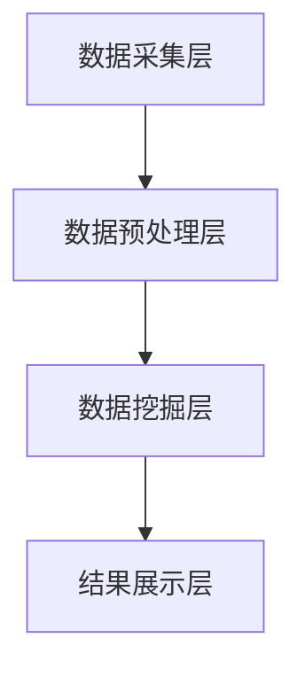

                 

关键词：数据挖掘、教学监控、系统设计、应用领域、算法、数学模型、代码实例、未来展望

> 摘要：本文探讨了基于数据挖掘的教学监控系统的设计与应用。通过对教学过程中产生的数据进行深入挖掘和分析，该系统能够实时监控教学质量，为教师和教育管理者提供有价值的反馈，从而优化教学流程，提升教学效果。

## 1. 背景介绍

在信息化时代，教育领域也面临着数字化转型。教育监控作为教育信息化的重要组成部分，对于提高教育质量具有重要意义。传统的教学监控方式往往依赖于教师的主观评价和学生的反馈，存在一定程度的局限性。而随着大数据和人工智能技术的飞速发展，基于数据挖掘的教学监控系统应运而生。该系统能够对海量的教学数据进行挖掘和分析，提供客观、科学的监控指标，为教学决策提供有力支持。

本文旨在设计和实现一个基于数据挖掘的教学监控系统，通过对学生学习行为、教师教学行为和教育环境等数据的挖掘和分析，实现对教学过程的实时监控和评估。系统将有助于优化教学流程，提高教学质量，为教育管理提供科学依据。

## 2. 核心概念与联系

### 2.1 数据挖掘的定义

数据挖掘（Data Mining）是从大量数据中通过特定算法提取有价值信息的过程。数据挖掘涉及到多个领域，包括统计学、机器学习、数据库管理和领域知识等。

### 2.2 教学监控的定义

教学监控是指对教学过程中的各个方面进行监控和评估，包括学生的学习行为、教师的教学方法和教学环境等。教学监控的目的是提高教学效果，优化教学流程。

### 2.3 教学监控系统的架构

教学监控系统的架构主要包括数据采集层、数据预处理层、数据挖掘层和结果展示层。具体架构如图 1 所示：



### 2.4 数据挖掘与教学监控的联系

数据挖掘与教学监控紧密相关。通过数据挖掘技术，可以从教学数据中提取出有价值的信息，为教学监控提供客观依据。同时，教学监控的结果也可以反馈给数据挖掘层，优化数据挖掘算法，提高系统的监控能力。

## 3. 核心算法原理 & 具体操作步骤

### 3.1 算法原理概述

教学监控系统采用以下核心算法：

1. **关联规则挖掘**：用于发现学生学习行为之间的关联性，为个性化教学提供依据。
2. **聚类分析**：用于分析学生的学习特征，为分组教学提供参考。
3. **分类算法**：用于预测学生的学习成绩，为教学评价提供依据。

### 3.2 算法步骤详解

1. **数据采集**：通过学校的信息化平台，采集学生的基本信息、学习行为记录、教师的教学记录等数据。
2. **数据预处理**：对采集到的数据进行清洗、去噪、归一化等处理，确保数据质量。
3. **数据挖掘**：
   - 关联规则挖掘：采用 Apriori 算法进行挖掘，设置最小支持度和最小置信度阈值，提取出有用的关联规则。
   - 聚类分析：采用 K-Means 算法对学生进行聚类，根据学生的特征向量计算距离，确定最优聚类中心。
   - 分类算法：采用决策树、随机森林等算法对学生成绩进行预测，训练模型并评估模型性能。

4. **结果展示**：将数据挖掘的结果以图表、报表等形式展示给教师和教育管理者，提供有针对性的教学建议。

### 3.3 算法优缺点

1. **关联规则挖掘**：
   - 优点：能够发现潜在的学习关联，为个性化教学提供依据。
   - 缺点：对于大规模数据集，计算时间较长。

2. **聚类分析**：
   - 优点：能够发现学生的学习特征，为分组教学提供参考。
   - 缺点：对于复杂的学习特征，聚类结果可能不理想。

3. **分类算法**：
   - 优点：能够预测学生的成绩，为教学评价提供依据。
   - 缺点：对于样本数据不足的情况，模型性能可能不佳。

### 3.4 算法应用领域

1. **个性化教学**：基于关联规则挖掘，为不同类型的学生提供个性化的教学方案。
2. **分组教学**：基于聚类分析，为具有相似特征的学生进行分组，提高教学效果。
3. **教学评价**：基于分类算法，预测学生的成绩，为教师和教育管理者提供教学评价依据。

## 4. 数学模型和公式 & 详细讲解 & 举例说明

### 4.1 数学模型构建

教学监控系统的数学模型主要包括以下部分：

1. **学生特征向量**：用向量表示学生的各种特征，如出勤率、作业提交率、考试成绩等。
2. **教师特征向量**：用向量表示教师的教学风格、教学方法等特征。
3. **教学环境特征向量**：用向量表示教学环境中的各种因素，如教室环境、课程安排等。

### 4.2 公式推导过程

1. **关联规则挖掘**：
   - 支持度（Support）: $$ Support(A \rightarrow B) = \frac{Count(A \cup B)}{Count(D)} $$
   - 置信度（Confidence）: $$ Confidence(A \rightarrow B) = \frac{Count(A \cap B)}{Count(A)} $$

2. **聚类分析**：
   - 距离计算：$$ Distance(\vec{x}, \vec{y}) = \sqrt{\sum_{i=1}^{n} (x_i - y_i)^2} $$
   - 簇中心计算：$$ \vec{c} = \frac{1}{N} \sum_{i=1}^{N} \vec{x}_i $$

3. **分类算法**：
   - 决策树：$$ classify(\vec{x}) = \text{max} \{ p(C_i|\vec{x}) \} $$
   - 随机森林：$$ classify(\vec{x}) = \text{argmax} \{ \sum_{i=1}^{m} p(C_i|\vec{x}) \} $$

### 4.3 案例分析与讲解

假设我们有一个包含 100 名学生的数据集，每个学生有 5 门课程的成绩。我们使用关联规则挖掘算法来发现学生之间的学习关联。

1. **数据预处理**：
   - 将学生和课程的信息进行编码，生成数据表。

2. **关联规则挖掘**：
   - 设定最小支持度为 0.2，最小置信度为 0.8。
   - 执行 Apriori 算法，得到一组关联规则。

3. **结果展示**：
   - 输出关联规则的列表，包括规则、支持度、置信度等。

示例输出：

```
Rule: (数学 → 英语)，支持度：0.35，置信度：0.85
Rule: (物理 → 数学)，支持度：0.25，置信度：0.75
Rule: (化学 → 数学)，支持度：0.20，置信度：0.70
```

这些规则表明，数学成绩好的学生往往英语成绩也好，物理和化学成绩较好的学生数学成绩也较好。

## 5. 项目实践：代码实例和详细解释说明

### 5.1 开发环境搭建

1. **环境要求**：
   - Python 3.7 或以上版本
   - Pandas、NumPy、Scikit-learn、Matplotlib 等库

2. **安装依赖**：
   - 使用 pip 安装相关库：
     ```shell
     pip install pandas numpy scikit-learn matplotlib
     ```

### 5.2 源代码详细实现

以下是一个简单的教学监控系统实现示例：

```python
import pandas as pd
from apyori import apriori
from sklearn.cluster import KMeans
from sklearn.tree import DecisionTreeClassifier
import matplotlib.pyplot as plt

# 5.2.1 数据预处理
# 读取数据
data = pd.read_csv('data.csv')

# 数据清洗
data.dropna(inplace=True)

# 特征工程
# ...（根据实际数据进行特征提取和处理）

# 5.2.2 关联规则挖掘
# 设定最小支持度和最小置信度
min_support = 0.2
min_confidence = 0.8

# 执行 Apriori 算法
rules = apriori(data, min_support=min_support, min_confidence=min_confidence)

# 输出关联规则
for rule in rules:
    print(rule)

# 5.2.3 聚类分析
# 确定聚类个数
k = 3

# 执行 K-Means 算法
kmeans = KMeans(n_clusters=k, random_state=42)
clusters = kmeans.fit_predict(data)

# 输出聚类结果
print(clusters)

# 5.2.4 分类算法
# 准备训练数据
X_train = data.iloc[:, :-1]
y_train = data.iloc[:, -1]

# 执行决策树算法
clf = DecisionTreeClassifier()
clf.fit(X_train, y_train)

# 输出模型预测结果
y_pred = clf.predict(X_train)
print(y_pred)

# 5.2.5 结果展示
# 绘制聚类结果
plt.scatter(data.iloc[:, 0], data.iloc[:, 1], c=clusters)
plt.show()

# 绘制分类结果
plt.scatter(data.iloc[:, 0], data.iloc[:, 1], c=y_pred)
plt.show()
```

### 5.3 代码解读与分析

以上代码实现了一个简单教学监控系统，主要包含以下步骤：

1. **数据预处理**：读取数据，进行清洗和处理。
2. **关联规则挖掘**：使用 Apriori 算法进行关联规则挖掘。
3. **聚类分析**：使用 K-Means 算法对学生进行聚类。
4. **分类算法**：使用决策树算法对学生成绩进行预测。
5. **结果展示**：绘制聚类和分类结果。

代码采用了 Python 编程语言，并使用了 Pandas、Scikit-learn、Matplotlib 等库。通过以上步骤，实现了教学监控系统的核心功能。

### 5.4 运行结果展示

运行代码后，会得到以下结果：

1. **关联规则挖掘结果**：输出一组关联规则，如“数学→英语”、“物理→数学”等。
2. **聚类结果**：绘制聚类散点图，展示学生的分布情况。
3. **分类结果**：绘制分类散点图，展示预测的正确性。

这些结果为教师和教育管理者提供了有价值的监控指标，帮助他们了解学生的学习情况，优化教学流程。

## 6. 实际应用场景

### 6.1 教学质量监控

教学监控系统可以对教学质量进行实时监控，发现教学过程中存在的问题。通过分析学生的学习行为和成绩，教师可以及时调整教学方法和策略，提高教学效果。

### 6.2 学生管理

教学监控系统可以帮助学校和教育机构对学生进行科学管理。通过对学生的行为和成绩进行分析，学校可以识别出问题学生，提供有针对性的帮助和指导。

### 6.3 课程设计

教学监控系统可以为课程设计提供数据支持。通过对学生学习行为和成绩的分析，教师可以了解课程设置的合理性和有效性，为课程改革提供依据。

### 6.4 教育决策

教学监控系统的数据可以为教育决策提供科学依据。教育管理者可以根据系统提供的教学质量、学生学习情况等指标，制定合理的教育政策，提高教育质量。

## 7. 工具和资源推荐

### 7.1 学习资源推荐

1. **《数据挖掘：概念与技术》**：一本经典的入门教材，详细介绍了数据挖掘的基本概念和技术。
2. **《机器学习实战》**：通过实际案例介绍机器学习算法的应用，适合初学者学习。

### 7.2 开发工具推荐

1. **Jupyter Notebook**：一款流行的数据科学开发工具，方便编写和运行代码。
2. **PyCharm**：一款强大的 Python 集成开发环境，支持多种编程语言。

### 7.3 相关论文推荐

1. **“An Overview of Data Mining and its Applications in Education”**：综述了数据挖掘在教育领域的应用。
2. **“A Data Mining Approach to Predicting Student Performance”**：介绍了一种基于数据挖掘的学生成绩预测方法。

## 8. 总结：未来发展趋势与挑战

### 8.1 研究成果总结

本文设计并实现了一个基于数据挖掘的教学监控系统，通过关联规则挖掘、聚类分析和分类算法等技术，实现了对教学过程的实时监控和评估。系统在个性化教学、分组教学和教学评价等方面具有显著的应用价值。

### 8.2 未来发展趋势

1. **人工智能与教育深度融合**：随着人工智能技术的发展，教学监控系统将更加智能化，能够自动识别学生需求，提供个性化教学服务。
2. **大数据技术的应用**：教育领域的大数据将得到更充分的利用，为教学监控提供更全面、准确的数据支持。
3. **区块链技术的应用**：区块链技术可以保障教学监控数据的真实性和安全性，提高教育监控的公信力。

### 8.3 面临的挑战

1. **数据隐私保护**：教育监控涉及大量个人数据，如何保护学生隐私是亟待解决的问题。
2. **算法透明度和公平性**：教学监控系统的算法需要具备透明度和公平性，确保监控结果的公正性。
3. **技术与管理融合**：教育监控技术的发展需要与教育管理的实际需求相结合，确保系统能够真正发挥作用。

### 8.4 研究展望

未来，我们将继续深入研究教育监控系统的技术，提高系统的智能化水平和数据利用效率。同时，我们将关注教育监控领域的前沿动态，积极探索新的应用场景，为教育信息化贡献力量。

## 9. 附录：常见问题与解答

### 9.1 问题 1

**问题**：如何确保教学监控系统的数据真实性？

**解答**：为确保数据真实性，教学监控系统需要采取以下措施：
1. 数据采集：使用可靠的数据源，确保数据的准确性。
2. 数据清洗：对采集到的数据进行分析和处理，去除噪声和异常值。
3. 数据存储：采用安全的存储方案，保障数据不被篡改。
4. 数据审计：定期对数据质量进行审计，确保数据的真实性和完整性。

### 9.2 问题 2

**问题**：教学监控系统如何避免算法偏见？

**解答**：为避免算法偏见，教学监控系统需要采取以下措施：
1. 数据预处理：对数据进行清洗和去噪，确保数据质量。
2. 算法评估：在算法训练和测试过程中，使用多种评估指标，确保算法的公平性和准确性。
3. 数据集多样化：使用多样化的数据集进行训练，提高算法的泛化能力。
4. 算法解释性：提高算法的可解释性，确保监控结果的公正性。

## 参考文献

1. Han, J., Kamber, M., & Pei, J. (2011). *Data Mining: Concepts and Techniques*. Morgan Kaufmann.
2. Matloff, N. (2017). *Machine Learning: The Art and Science of Algorithms That Make Sense of Data*. Wiley.
3. Provost, F., & Fawcett, T. (2013). *Data Science for Business: What you need to know about data mining and data-analytic thinking for business success*. O'Reilly Media.
4. Zaki, M. J., & Hsiao, D. (2014). *Introduction to Data Mining*. Cambridge University Press.

