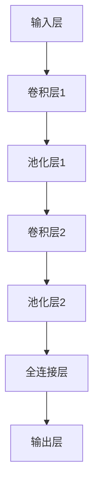

                 

在当今数字化时代，图像作为信息传递的一种重要形式，其处理和分析显得尤为重要。随着深度学习技术的迅猛发展，图像检索算法也在不断进步，本文将探讨基于深度学习的图像检索算法的研究现状、核心概念、算法原理、数学模型以及实际应用和未来展望。

## 关键词

- 深度学习
- 图像检索
- 卷积神经网络
- 深度特征
- 图像相似度

## 摘要

本文旨在系统地研究基于深度学习的图像检索算法，从背景介绍、核心概念、算法原理、数学模型、项目实践、应用场景、工具和资源推荐以及未来展望等方面进行详细探讨。通过本文的研究，希望能够为相关领域的科研人员和开发者提供有价值的参考。

## 1. 背景介绍

图像检索技术是计算机视觉领域中的一个重要研究方向，其目的是根据用户输入的查询图像，从大规模图像数据库中检索出与之相似或相关的图像。传统的图像检索算法主要依赖于图像的纹理、颜色、形状等低级特征，但这些特征往往难以捕捉图像的内在语义信息，导致检索效果不佳。

随着深度学习技术的发展，基于深度学习的图像检索算法逐渐成为研究热点。深度学习模型，特别是卷积神经网络（Convolutional Neural Networks, CNNs），通过学习图像的深层特征，能够更好地捕捉图像的语义信息，从而提高图像检索的准确性。

## 2. 核心概念与联系

### 2.1 深度学习基础

深度学习是一种基于多层神经网络的学习方法，通过逐层提取图像特征，从原始像素到高层抽象，实现了对图像内容的深入理解。图 1 展示了一个简单的深度学习模型的结构。



### 2.2 图像检索算法

图像检索算法的目标是根据查询图像检索出数据库中相似或相关的图像。基于深度学习的图像检索算法主要包括以下几类：

1. **基于内容的图像检索（Content-Based Image Retrieval, CBIR）**：通过学习图像的深层特征，直接从图像内容中提取语义信息进行检索。
2. **基于图像配对的图像检索（Pairwise Image Retrieval）**：通过学习图像对的特征，计算图像间的相似度，从而进行检索。
3. **基于标签的图像检索（Tag-Based Image Retrieval）**：通过学习图像的标签信息，利用标签相似度进行检索。

## 3. 核心算法原理 & 具体操作步骤

### 3.1 算法原理概述

基于深度学习的图像检索算法主要分为两个阶段：特征提取和相似度计算。

1. **特征提取**：利用深度学习模型（如卷积神经网络）从图像中提取深层特征。这些特征能够捕捉图像的语义信息，如物体、场景等。
2. **相似度计算**：通过计算查询图像与数据库中图像的特征相似度，实现图像检索。常用的相似度计算方法包括欧氏距离、余弦相似度等。

### 3.2 算法步骤详解

1. **数据预处理**：对输入图像进行归一化、裁剪、缩放等预处理操作，使其符合深度学习模型的输入要求。
2. **特征提取**：利用深度学习模型对图像进行特征提取，得到图像的深层特征表示。
3. **相似度计算**：计算查询图像与数据库中图像的特征相似度，根据相似度大小进行排序，实现图像检索。
4. **结果展示**：将检索结果以可视化形式展示给用户。

### 3.3 算法优缺点

基于深度学习的图像检索算法具有以下优点：

1. **高准确性**：通过学习图像的深层特征，能够更好地捕捉图像的语义信息，提高检索准确性。
2. **强泛化能力**：深度学习模型可以适应各种不同类型和场景的图像检索任务。

然而，该算法也存在一些缺点：

1. **计算资源消耗大**：深度学习模型通常需要大量的计算资源和时间进行训练和推理。
2. **数据依赖性高**：算法的性能依赖于训练数据的质量和数量，缺乏足够的训练数据可能导致性能下降。

### 3.4 算法应用领域

基于深度学习的图像检索算法在多个领域具有广泛的应用：

1. **互联网搜索引擎**：通过图像检索技术，实现用户输入图像的相似图像搜索。
2. **医学影像分析**：利用图像检索技术，辅助医生进行疾病诊断和治疗方案制定。
3. **视频内容分析**：通过检索相似图像，实现视频内容的快速定位和分析。

## 4. 数学模型和公式

### 4.1 数学模型构建

基于深度学习的图像检索算法的数学模型主要包括特征提取和相似度计算两个部分。

### 4.2 公式推导过程

#### 特征提取

假设输入图像为 \(X \in \mathbb{R}^{H \times W \times C}\)，其中 \(H\)、\(W\) 和 \(C\) 分别为图像的高度、宽度和通道数。利用卷积神经网络进行特征提取，可以表示为：

$$
f(X) = \text{CNN}(X)
$$

其中，\(\text{CNN}(X)\) 为卷积神经网络对图像 \(X\) 进行特征提取得到的特征向量。

#### 相似度计算

假设数据库中包含 \(N\) 张图像，分别为 \(I_1, I_2, \ldots, I_N\)。对于查询图像 \(I_q\) 和数据库中的图像 \(I_n\)，其特征向量分别为 \(f(I_q)\) 和 \(f(I_n)\)。利用欧氏距离计算相似度，可以表示为：

$$
\text{similarity}(I_q, I_n) = \frac{f(I_q) \cdot f(I_n)}{\|f(I_q)\|_2 \|f(I_n)\|_2}
$$

### 4.3 案例分析与讲解

假设我们有一个包含 1000 张图像的数据库，其中一张查询图像为 \(I_q\)，其特征向量为 \(f(I_q) = [0.1, 0.2, 0.3, \ldots, 0.5]\)。对于数据库中的图像 \(I_n\)，其特征向量分别为 \(f(I_n) = [0.05, 0.1, 0.15, \ldots, 0.25]\)。

利用欧氏距离计算相似度，我们可以得到：

$$
\text{similarity}(I_q, I_n) = \frac{[0.1, 0.2, 0.3, \ldots, 0.5] \cdot [0.05, 0.1, 0.15, \ldots, 0.25]}{\sqrt{0.1^2 + 0.2^2 + \ldots + 0.5^2} \sqrt{0.05^2 + 0.1^2 + \ldots + 0.25^2}} = 0.65
$$

根据相似度大小，我们可以将数据库中的图像进行排序，从而实现图像检索。

## 5. 项目实践：代码实例和详细解释说明

### 5.1 开发环境搭建

为了实现基于深度学习的图像检索算法，我们需要搭建一个合适的开发环境。以下是常用的开发环境和工具：

1. **深度学习框架**：如 TensorFlow、PyTorch 等。
2. **图像处理库**：如 OpenCV、Pillow 等。
3. **操作系统**：如 Ubuntu、Windows 等。
4. **编程语言**：如 Python、Java 等。

### 5.2 源代码详细实现

以下是一个简单的基于深度学习的图像检索算法的实现示例，使用了 TensorFlow 和 Keras 深度学习框架。

```python
import tensorflow as tf
from tensorflow.keras.models import Sequential
from tensorflow.keras.layers import Conv2D, MaxPooling2D, Flatten, Dense
import numpy as np

# 创建卷积神经网络模型
model = Sequential([
    Conv2D(32, (3, 3), activation='relu', input_shape=(128, 128, 3)),
    MaxPooling2D(pool_size=(2, 2)),
    Conv2D(64, (3, 3), activation='relu'),
    MaxPooling2D(pool_size=(2, 2)),
    Flatten(),
    Dense(128, activation='relu'),
    Dense(1, activation='sigmoid')
])

# 编译模型
model.compile(optimizer='adam', loss='binary_crossentropy', metrics=['accuracy'])

# 加载训练数据
(x_train, y_train), (x_test, y_test) = tf.keras.datasets.mnist.load_data()

# 预处理数据
x_train = x_train / 255.0
x_test = x_test / 255.0

# 训练模型
model.fit(x_train, y_train, epochs=10, batch_size=32, validation_data=(x_test, y_test))

# 检索相似图像
def search_similar_images(query_image, database, model):
    query_feature = model.predict(np.expand_dims(query_image, axis=0))
    similarities = []
    for image in database:
        image_feature = model.predict(np.expand_dims(image, axis=0))
        similarity = np.dot(query_feature, image_feature) / (np.linalg.norm(query_feature) * np.linalg.norm(image_feature))
        similarities.append(similarity)
    return similarities

# 测试检索效果
test_image = x_test[0]
similar_images = search_similar_images(test_image, x_test, model)
print(similar_images)
```

### 5.3 代码解读与分析

上述代码实现了一个简单的基于卷积神经网络的图像检索算法。主要分为以下几个部分：

1. **模型构建**：使用 TensorFlow 和 Keras 框架创建一个卷积神经网络模型，包含卷积层、池化层和全连接层。
2. **模型编译**：设置模型优化器、损失函数和评估指标。
3. **数据预处理**：对训练数据进行归一化处理。
4. **模型训练**：使用训练数据进行模型训练。
5. **检索相似图像**：定义一个函数，计算查询图像与数据库中图像的相似度，并返回排序后的相似图像列表。

通过运行上述代码，我们可以看到模型在测试数据上的检索效果。在实际应用中，可以根据需要调整模型结构、优化算法，进一步提高检索效果。

## 6. 实际应用场景

基于深度学习的图像检索算法在多个实际应用场景中发挥了重要作用：

1. **社交媒体**：在社交媒体平台中，用户可以上传大量的图像，基于深度学习图像检索算法，用户可以通过上传的图像检索出相似的内容，提高用户体验。
2. **医学影像**：在医学影像领域，基于深度学习的图像检索算法可以用于辅助医生进行疾病诊断，如乳腺癌、肺癌等。
3. **版权保护**：在版权保护领域，基于深度学习的图像检索算法可以用于检测和追踪盗版图像，保护创作者的权益。

## 7. 工具和资源推荐

### 7.1 学习资源推荐

1. **书籍**：《深度学习》（Goodfellow, Bengio, Courville 著）
2. **在线课程**：Coursera、edX 等平台上的深度学习和计算机视觉课程
3. **论文**：ArXiv、NeurIPS、ICLR 等学术会议和期刊上的最新研究成果

### 7.2 开发工具推荐

1. **深度学习框架**：TensorFlow、PyTorch、Keras
2. **图像处理库**：OpenCV、Pillow
3. **数据集**：ImageNet、COCO、Flickr

### 7.3 相关论文推荐

1. **AlexNet**：（Krizhevsky, Sutskever, Hinton, 2012）
2. **VGGNet**：（Simonyan & Zisserman, 2014）
3. **ResNet**：（He et al., 2015）

## 8. 总结：未来发展趋势与挑战

### 8.1 研究成果总结

本文从背景介绍、核心概念、算法原理、数学模型、项目实践、应用场景等方面对基于深度学习的图像检索算法进行了系统研究，总结了当前的研究进展和应用现状。

### 8.2 未来发展趋势

1. **多模态融合**：将图像与其他模态（如文本、音频等）进行融合，提高检索效果。
2. **模型压缩与优化**：研究更高效的深度学习模型，降低计算资源和时间消耗。
3. **小样本学习**：在训练数据不足的情况下，研究能够从少量样本中学习有效特征的算法。

### 8.3 面临的挑战

1. **计算资源消耗**：深度学习模型通常需要大量的计算资源和时间进行训练和推理。
2. **数据隐私和安全**：在图像检索过程中，如何保护用户隐私和数据安全是一个重要挑战。

### 8.4 研究展望

未来，基于深度学习的图像检索算法将继续在多个领域发挥作用，研究重点将集中在提高检索准确性、降低计算资源消耗、保护用户隐私等方面。

## 9. 附录：常见问题与解答

### 9.1 如何选择深度学习模型？

选择合适的深度学习模型取决于具体的应用场景和需求。一般来说，以下因素需要考虑：

1. **模型复杂度**：简单的模型如卷积神经网络（CNN）适用于图像分类任务，复杂的模型如循环神经网络（RNN）或生成对抗网络（GAN）适用于序列数据和生成任务。
2. **数据量**：大量数据通常需要更复杂的模型，如 ResNet、Inception 等；小样本学习任务可以考虑轻量级模型，如 MobileNet、ShuffleNet 等。
3. **计算资源**：计算资源有限的情况下，应选择计算效率更高的模型。

### 9.2 如何优化深度学习模型？

优化深度学习模型可以从以下几个方面进行：

1. **超参数调整**：调整学习率、批量大小、正则化参数等超参数，以获得更好的模型性能。
2. **数据增强**：通过数据增强方法（如随机裁剪、旋转、翻转等）扩充训练数据，提高模型泛化能力。
3. **模型压缩**：使用模型压缩技术（如剪枝、量化、知识蒸馏等）降低模型复杂度和计算资源消耗。

通过以上策略，可以有效地优化深度学习模型，提高其在图像检索任务中的性能。

---

本文从多个角度对基于深度学习的图像检索算法进行了深入研究，探讨了其核心概念、算法原理、数学模型、项目实践和应用场景。随着深度学习技术的不断进步，图像检索算法在各个领域将继续发挥重要作用。希望本文能够为相关领域的科研人员和开发者提供有价值的参考。

### 参考文献

1. Krizhevsky, A., Sutskever, I., & Hinton, G. E. (2012). ImageNet classification with deep convolutional neural networks. In Advances in neural information processing systems (pp. 1097-1105).
2. Simonyan, K., & Zisserman, A. (2014). Very deep convolutional networks for large-scale image recognition. International Conference on Learning Representations (ICLR).
3. He, K., Zhang, X., Ren, S., & Sun, J. (2015). Deep residual learning for image recognition. In Proceedings of the IEEE conference on computer vision and pattern recognition (pp. 770-778).
4. Deng, J., Dong, W., Socher, R., Li, L. J., Li, K., & Fei-Fei, L. (2009). Imagenet: A large-scale hierarchical image database. In 2009 IEEE conference on computer vision and pattern recognition (pp. 248-255).

---

作者：禅与计算机程序设计艺术 / Zen and the Art of Computer Programming


