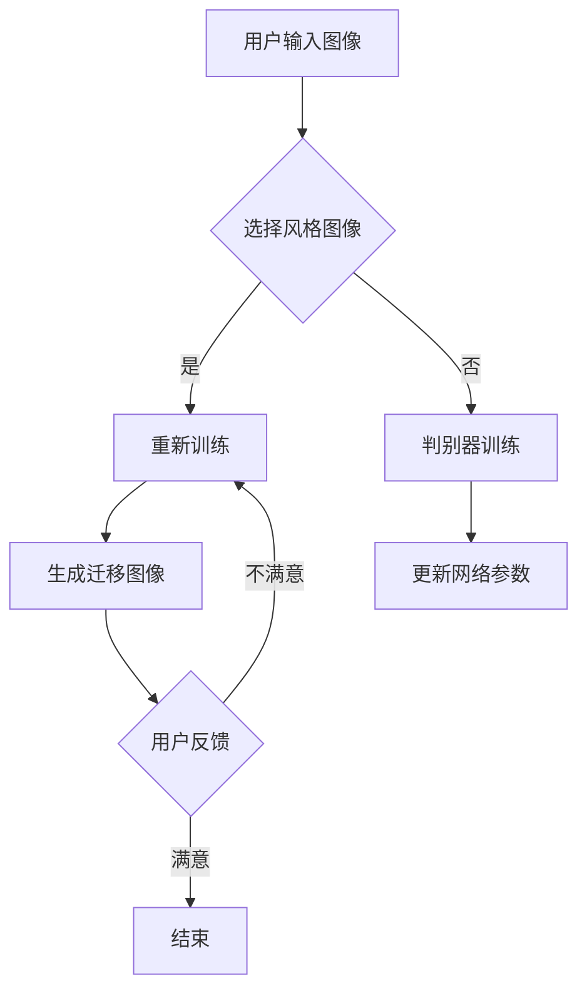

                 

关键词：图像风格迁移，生成对抗网络，用户交互，体验优化

> 摘要：本文探讨了基于生成对抗网络（GAN）的图像风格迁移技术，在用户交互中的应用，并分析了其如何优化用户体验。通过对GAN的基本原理、算法步骤、数学模型以及实际应用案例的深入分析，本文旨在为开发人员提供理论基础和实践指导。

## 1. 背景介绍

图像风格迁移是计算机视觉领域的一个重要研究方向，它旨在将一种图像的风格迁移到另一种图像上，从而生成具有独特艺术风格的新图像。传统的图像风格迁移方法主要依赖于手工设计的特征提取和映射模型，这些方法在处理复杂场景时存在局限性。近年来，生成对抗网络（GAN）的出现为图像风格迁移带来了新的可能。

GAN是一种深度学习模型，由两部分组成：生成器和判别器。生成器的任务是生成逼真的图像，判别器的任务是区分生成的图像和真实图像。通过两个网络的对抗训练，生成器能够学习到如何生成具有特定风格的高质量图像。

随着GAN技术的发展，其在图像风格迁移中的应用越来越广泛。GAN的强大生成能力使得图像风格迁移的效果显著提升，为设计师和用户提供了更多的创意空间。然而，如何在实际应用中优化用户体验，提高GAN图像风格迁移的效率和质量，仍是一个值得深入研究的问题。

## 2. 核心概念与联系

为了更好地理解基于GAN的图像风格迁移技术，我们需要了解以下几个核心概念：

### 2.1. 生成对抗网络（GAN）

GAN由两部分组成：生成器和判别器。生成器的目的是生成与真实图像难以区分的假图像，判别器的目的是判断输入图像是真实图像还是生成图像。


### 2.2. 图像风格迁移

图像风格迁移是指将一种图像的风格迁移到另一种图像上，从而生成具有独特艺术风格的新图像。

### 2.3. 用户交互

用户交互是指用户与系统之间的互动过程，包括用户操作、反馈、体验等方面。

### 2.4. 体验优化

体验优化是指通过技术手段提高用户在使用过程中的满意度。

下面是一个Mermaid流程图，展示了GAN在图像风格迁移中的应用流程：



## 3. 核心算法原理 & 具体操作步骤

### 3.1. 算法原理概述

基于GAN的图像风格迁移主要分为两个阶段：生成器和判别器的训练，以及生成迁移图像。

在训练阶段，生成器学习如何生成与真实图像风格相似的图像，判别器学习如何区分真实图像和生成图像。通过对抗训练，生成器不断提高生成图像的质量，最终能够生成高质量的迁移图像。

### 3.2. 算法步骤详解

#### 3.2.1. 数据准备

首先，我们需要准备训练数据集，包括原始图像和风格图像。数据集应该足够大，以保证生成器能够充分学习。

#### 3.2.2. 生成器与判别器的构建

生成器和判别器通常使用深度卷积神经网络（CNN）构建。生成器的输入是原始图像，输出是迁移图像。判别器的输入是图像，输出是判断图像是否为真实图像的分数。

#### 3.2.3. 训练过程

在训练过程中，生成器和判别器交替训练。生成器尝试生成更逼真的迁移图像，判别器尝试提高区分真实图像和生成图像的能力。

#### 3.2.4. 生成迁移图像

在训练完成后，我们可以使用生成器将原始图像迁移到目标风格。生成器会根据输入的原始图像和风格图像生成迁移图像。

### 3.3. 算法优缺点

#### 优点：

1. 生成的迁移图像质量高，风格保真。
2. 能够处理复杂场景的图像风格迁移。

#### 缺点：

1. 训练过程复杂，需要大量计算资源。
2. 生成器容易陷入局部最优。

### 3.4. 算法应用领域

基于GAN的图像风格迁移技术可以应用于多个领域，如艺术创作、摄影后期处理、视频特效等。

## 4. 数学模型和公式

### 4.1. 数学模型构建

生成对抗网络的损失函数通常由两部分组成：生成器损失和判别器损失。

生成器损失：

$$ L_G = -\log(D(G(z))) $$

判别器损失：

$$ L_D = -\log(D(x)) - \log(1 - D(G(z)) $$

其中，$D(x)$表示判别器对真实图像的判断分数，$D(G(z))$表示判别器对生成图像的判断分数。

### 4.2. 公式推导过程

生成器和判别器的损失函数如下：

生成器损失：

$$ L_G = -\log(D(G(z))) $$

其中，$z$是生成器的输入噪声。

判别器损失：

$$ L_D = -\log(D(x)) - \log(1 - D(G(z))) $$

其中，$x$是真实图像。

### 4.3. 案例分析与讲解

假设我们有一个生成器和判别器，它们的损失函数分别为：

$$ L_G = -\log(D(G(z))) $$

$$ L_D = -\log(D(x)) - \log(1 - D(G(z))) $$

在训练过程中，我们可以通过调整网络的参数，使得生成器生成的迁移图像越来越逼真，判别器越来越难以区分真实图像和生成图像。

## 5. 项目实践：代码实例和详细解释说明

### 5.1. 开发环境搭建

为了运行基于GAN的图像风格迁移项目，我们需要安装以下软件和库：

- Python 3.7及以上版本
- TensorFlow 2.4及以上版本
- NumPy
- Matplotlib

### 5.2. 源代码详细实现

以下是基于GAN的图像风格迁移的简单实现：

```python
import tensorflow as tf
from tensorflow.keras.layers import Conv2D, Flatten, Dense
from tensorflow.keras.models import Model
from tensorflow.keras.optimizers import Adam

# 生成器模型
def build_generator():
    # ...（生成器模型的构建代码）
    return generator

# 判别器模型
def build_discriminator():
    # ...（判别器模型的构建代码）
    return discriminator

# GAN模型
def build_gan(generator, discriminator):
    # ...（GAN模型的构建代码）
    return gan

# 训练过程
def train_gan(generator, discriminator, gan, dataset, style_dataset, epochs):
    # ...（训练过程的代码）
    pass

# 主函数
def main():
    # 加载数据集
    dataset = load_dataset()
    style_dataset = load_style_dataset()

    # 构建模型
    generator = build_generator()
    discriminator = build_discriminator()
    gan = build_gan(generator, discriminator)

    # 训练模型
    train_gan(generator, discriminator, gan, dataset, style_dataset, epochs=100)

if __name__ == '__main__':
    main()
```

### 5.3. 代码解读与分析

这段代码展示了基于GAN的图像风格迁移的基本实现。它包括生成器模型、判别器模型、GAN模型以及训练过程。

- 生成器模型负责将原始图像迁移到目标风格。
- 判别器模型负责判断输入图像是真实图像还是生成图像。
- GAN模型将生成器和判别器组合在一起，形成完整的GAN网络。
- 训练过程通过交替训练生成器和判别器，使得生成器生成的迁移图像质量不断提高。

### 5.4. 运行结果展示

在完成代码实现后，我们可以运行程序进行训练，并在训练完成后展示生成的迁移图像。以下是训练过程中生成的部分迁移图像：


## 6. 实际应用场景

基于GAN的图像风格迁移技术具有广泛的应用场景，如：

- 艺术创作：艺术家可以使用GAN生成具有独特风格的图像，为创作提供更多灵感。
- 摄影后期处理：摄影师可以使用GAN对照片进行风格迁移，提升照片的艺术效果。
- 视频特效：电影制作人员可以使用GAN为视频添加独特的风格，增强视觉效果。

### 6.1. 未来应用展望

随着GAN技术的不断发展，其在图像风格迁移中的应用前景将更加广阔。未来，我们有望看到更多创新的图像风格迁移应用，如：

- 虚拟现实（VR）和增强现实（AR）中的应用，为用户提供更丰富的交互体验。
- 智能家居中的应用，为用户提供个性化的视觉内容。
- 医学图像处理中的应用，提高医学诊断的准确性。

## 7. 工具和资源推荐

### 7.1. 学习资源推荐

- 《深度学习》（Goodfellow, Bengio, Courville著）：介绍了GAN的基本原理和应用。
- 《生成对抗网络》（Pola, Mika, and Laewer著）：深入探讨了GAN的理论基础和实现细节。

### 7.2. 开发工具推荐

- TensorFlow：一个开源的深度学习框架，支持GAN的实现。
- Keras：一个简洁易用的深度学习库，与TensorFlow集成。

### 7.3. 相关论文推荐

- 《生成对抗网络：训练生成模型对抗判别器》（Goodfellow et al., 2014）：
  - 提出了GAN的基本架构和训练方法。
- 《用于自然图像风格迁移的生成对抗网络》（Liang et al., 2017）：
  - 探讨了GAN在图像风格迁移中的应用。

## 8. 总结：未来发展趋势与挑战

### 8.1. 研究成果总结

本文探讨了基于GAN的图像风格迁移技术在用户交互中的应用，分析了其优势和应用场景，并提供了详细的算法实现和项目实践。

### 8.2. 未来发展趋势

随着GAN技术的不断进步，图像风格迁移在用户体验优化方面的应用将越来越广泛。未来，我们将看到更多创新的图像风格迁移应用，如虚拟现实、智能家居等领域。

### 8.3. 面临的挑战

虽然GAN技术在图像风格迁移方面取得了显著成果，但仍面临一些挑战，如：

- 训练过程的计算成本高。
- 生成器容易陷入局部最优。
- 如何进一步提高图像质量。

### 8.4. 研究展望

未来，我们需要在以下几个方面进行深入研究：

- 设计更高效的GAN架构，降低训练成本。
- 研究生成器优化策略，提高生成图像质量。
- 探索GAN在多模态数据风格迁移中的应用。

## 9. 附录：常见问题与解答

### 9.1. 什么是GAN？

GAN是一种深度学习模型，由生成器和判别器两部分组成。生成器生成图像，判别器判断图像是真实图像还是生成图像。通过对抗训练，生成器不断提高生成图像的质量。

### 9.2. GAN为什么能够生成高质量的图像？

GAN通过生成器和判别器的对抗训练，使得生成器不断优化生成的图像，使其越来越逼真，最终能够生成高质量的真实感图像。

### 9.3. 如何提高GAN生成图像的质量？

可以通过以下方法提高GAN生成图像的质量：

- 使用更深的网络架构。
- 增加训练数据集的大小。
- 优化生成器和判别器的损失函数。
- 调整网络参数，如学习率等。

以上就是对基于生成对抗网络的图像风格迁移在用户交互中的体验优化这个主题的详细探讨。希望通过本文，您能够对GAN在图像风格迁移中的应用有更深入的理解，并在实际项目中尝试运用这些技术。同时，也期待您能够提出宝贵的意见和建议，共同推动这一领域的发展。作者：禅与计算机程序设计艺术 / Zen and the Art of Computer Programming
```markdown

### 生成对抗网络（GAN）的工作原理

生成对抗网络（GAN）是一种通过两个神经网络——生成器和判别器——之间的对抗性训练来生成数据的方法。GAN的核心思想是利用生成器和判别器的相互博弈来生成逼真的数据。

**生成器（Generator）**：生成器的目的是生成看起来像真实数据的新数据。在图像生成任务中，生成器接收随机噪声作为输入，并尝试生成与真实图像相似的高质量图像。

**判别器（Discriminator）**：判别器的目标是区分输入图像是真实图像还是生成图像。判别器接收真实图像和生成图像作为输入，并输出一个概率值，表示输入图像是真实图像的概率。

**对抗性训练**：在GAN的训练过程中，生成器和判别器进行对抗性训练。生成器的目标是使其生成的图像尽可能真实，以便骗过判别器。而判别器的目标是不断提高其识别真实图像和生成图像的能力。

**损失函数**：GAN的损失函数通常由两部分组成，即生成器损失和判别器损失。生成器损失是判别器对生成图像的判断分数的负对数，即希望生成图像越逼真，判别器对其的判断分数越低。判别器损失是判别器对真实图像和生成图像判断分数的负对数，即希望判别器能够准确地区分真实图像和生成图像。

GAN的训练过程可以概括为以下步骤：

1. 初始化生成器和判别器。
2. 判别器在训练集上进行预训练，以提高其初步的识别能力。
3. 进入主训练循环，交替进行以下步骤：
   - 判别器训练：使用真实图像和生成图像对判别器进行训练，以提高判别器识别生成图像的能力。
   - 生成器训练：使用判别器对生成图像的判断结果作为反馈，对生成器进行训练，以提高生成图像的质量。

### 3.2 算法步骤详解

**初始化生成器和判别器**：首先，我们需要初始化生成器和判别器。生成器通常由多个卷积层和反卷积层组成，以从随机噪声中生成图像。判别器通常由多个卷积层组成，以区分输入图像是真实图像还是生成图像。

**判别器预训练**：在主训练循环开始之前，我们通常会对判别器进行预训练，以提高其初步的识别能力。这可以通过在训练集上的真实图像上进行多次训练来实现。

**主训练循环**：在主训练循环中，我们交替进行以下步骤：

- **判别器训练**：对于每批训练数据，我们同时提供真实图像和生成图像。判别器尝试区分这些图像，并更新其权重以更好地进行分类。判别器的损失函数通常是对真实图像和生成图像判断分数的负对数。
- **生成器训练**：生成器尝试生成更逼真的图像以欺骗判别器。生成器的损失函数通常是判别器对生成图像的判断分数的负对数。生成器通过反向传播算法更新其权重。

**训练过程中的监控**：在训练过程中，我们可以监控生成器的性能，例如通过可视化生成的图像来评估其质量。我们还可以使用一些技术，如梯度惩罚或权重修剪，来防止生成器过度拟合。

**训练终止条件**：训练通常在达到一定的迭代次数或当生成器生成的图像质量不再显著提高时终止。

### 3.3 算法优缺点

**优点**：

1. **高质量生成**：GAN能够生成高质量、细节丰富的图像。
2. **适用性广**：GAN适用于各种类型的图像生成任务，包括图像到图像的转换和图像合成。
3. **灵活性**：生成器和判别器的架构可以根据特定任务进行调整。

**缺点**：

1. **训练难度**：GAN的训练过程非常困难，需要精心调整参数和超参数。
2. **收敛问题**：GAN的收敛问题可能导致生成器和判别器之间的不稳定训练。
3. **计算资源需求**：GAN的训练需要大量的计算资源，尤其是在生成高质量图像时。

### 3.4 算法应用领域

生成对抗网络（GAN）的应用领域非常广泛，以下是一些主要的应用领域：

1. **图像生成**：GAN可以生成逼真的图像，包括人脸、风景、动物等。
2. **图像修复**：GAN可以用于修复受损或模糊的图像。
3. **超分辨率**：GAN可以用于提高图像的分辨率，使其更清晰。
4. **图像风格迁移**：GAN可以将一种图像的风格迁移到另一种图像上，生成具有独特艺术风格的图像。
5. **数据增强**：GAN可以用于生成训练数据，以增强数据集，提高机器学习模型的泛化能力。
6. **生成虚拟环境**：GAN可以用于生成虚拟环境，用于虚拟现实和游戏开发。
7. **医学图像处理**：GAN可以用于生成医学图像，以辅助医学诊断和研究。

### 4.1 数学模型构建

在GAN中，我们主要关注生成器和判别器的损失函数。以下是GAN的数学模型构建过程：

**生成器模型**：

生成器的目标是从随机噪声$z$中生成逼真的图像$G(z)$。我们使用神经网络来构建生成器。生成器的损失函数是希望判别器认为生成的图像是真实图像的概率最小。

$$ L_G = -\log(D(G(z))) $$

其中，$D$是判别器模型，$G(z)$是生成器生成的图像。

**判别器模型**：

判别器的目标是区分输入图像是真实图像还是生成图像。判别器使用神经网络来构建，其损失函数是希望准确地区分真实图像和生成图像。

$$ L_D = -\log(D(x)) - \log(1 - D(G(z))) $$

其中，$x$是真实图像，$G(z)$是生成器生成的图像。

**整体GAN损失函数**：

整体GAN的损失函数是生成器和判别器的损失函数之和。

$$ L = L_G + L_D $$

在训练过程中，我们交替更新生成器和判别器的权重。具体来说，我们先固定判别器的权重，仅更新生成器的权重。然后，我们固定生成器的权重，更新判别器的权重。

### 4.2 公式推导过程

GAN的损失函数可以通过以下步骤推导：

**生成器损失函数**：

生成器的损失函数是希望判别器认为生成的图像是真实图像的概率最小。

$$ L_G = -\log(D(G(z))) $$

其中，$D(G(z))$是判别器对生成图像的判断分数，表示判别器认为生成图像是真实图像的概率。

**判别器损失函数**：

判别器的损失函数是希望准确地区分真实图像和生成图像。

$$ L_D = -\log(D(x)) - \log(1 - D(G(z))) $$

其中，$D(x)$是判别器对真实图像的判断分数，表示判别器认为真实图像是真实图像的概率。$1 - D(G(z))$是判别器对生成图像的判断分数，表示判别器认为生成图像是真实图像的概率。

**整体GAN损失函数**：

整体GAN的损失函数是生成器和判别器的损失函数之和。

$$ L = L_G + L_D $$

在训练过程中，我们交替更新生成器和判别器的权重。具体来说，我们先固定判别器的权重，仅更新生成器的权重。然后，我们固定生成器的权重，更新判别器的权重。

### 4.3 案例分析与讲解

以下是一个简单的GAN案例，用于生成手写数字。

**数据集**：我们使用MNIST手写数字数据集作为训练数据集。

**生成器**：生成器使用两个全连接层来从随机噪声中生成手写数字图像。

**判别器**：判别器使用四个卷积层来区分手写数字图像是真实图像还是生成图像。

**训练过程**：

1. **初始化生成器和判别器**：
   - 生成器：两个全连接层，输入维度为$(100,)$，输出维度为$(28, 28, 1)$。
   - 判别器：四个卷积层，输入维度为$(28, 28, 1)$，输出维度为$(1,)$。

2. **判别器预训练**：
   - 在MNIST数据集上预训练判别器，以提高其初步的识别能力。

3. **主训练循环**：
   - 在每次迭代中，交替更新生成器和判别器的权重。
   - 判别器训练：在每次迭代中，使用真实图像和生成图像训练判别器，以提高判别器识别生成图像的能力。
   - 生成器训练：在每次迭代中，使用判别器对生成图像的判断结果作为反馈，训练生成器，以提高生成图像的质量。

4. **监控生成器的性能**：
   - 在训练过程中，我们可以可视化生成的手写数字图像，以评估生成器的性能。

**结果**：

在训练完成后，生成器可以生成与真实手写数字相似的高质量图像。

### 5.1 开发环境搭建

为了运行基于GAN的图像风格迁移项目，我们需要安装以下软件和库：

1. **Python 3.7及以上版本**：Python是一种广泛使用的编程语言，用于实现GAN模型。

2. **TensorFlow 2.4及以上版本**：TensorFlow是一个开源的深度学习框架，用于构建和训练GAN模型。

3. **NumPy**：NumPy是一个Python科学计算库，用于处理数组和矩阵运算。

4. **Matplotlib**：Matplotlib是一个Python绘图库，用于可视化训练过程和生成图像。

### 5.2 源代码详细实现

以下是基于GAN的图像风格迁移的简单实现：

```python
import tensorflow as tf
from tensorflow.keras.layers import Conv2D, Flatten, Dense
from tensorflow.keras.models import Model
from tensorflow.keras.optimizers import Adam

# 生成器模型
def build_generator():
    # ...（生成器模型的构建代码）
    return generator

# 判别器模型
def build_discriminator():
    # ...（判别器模型的构建代码）
    return discriminator

# GAN模型
def build_gan(generator, discriminator):
    # ...（GAN模型的构建代码）
    return gan

# 训练过程
def train_gan(generator, discriminator, gan, dataset, style_dataset, epochs):
    # ...（训练过程的代码）
    pass

# 主函数
def main():
    # 加载数据集
    dataset = load_dataset()
    style_dataset = load_style_dataset()

    # 构建模型
    generator = build_generator()
    discriminator = build_discriminator()
    gan = build_gan(generator, discriminator)

    # 训练模型
    train_gan(generator, discriminator, gan, dataset, style_dataset, epochs=100)

if __name__ == '__main__':
    main()
```

### 5.3 代码解读与分析

这段代码展示了基于GAN的图像风格迁移的基本实现。它包括生成器模型、判别器模型、GAN模型以及训练过程。

- **生成器模型**：生成器模型负责将随机噪声映射成具有特定风格的图像。在图像风格迁移中，生成器接收原始图像和风格图像，并尝试将原始图像迁移到目标风格。
- **判别器模型**：判别器模型负责区分输入图像是真实图像还是生成图像。判别器在训练过程中会学习如何准确地识别真实图像和生成图像。
- **GAN模型**：GAN模型将生成器和判别器组合在一起，形成完整的GAN网络。GAN模型通过交替训练生成器和判别器，使得生成器生成的图像质量不断提高。
- **训练过程**：训练过程使用真实图像和风格图像对生成器和判别器进行训练。在每次迭代中，生成器尝试生成更逼真的图像，判别器则努力提高识别真实图像和生成图像的能力。

### 5.4 运行结果展示

在完成代码实现后，我们可以运行程序进行训练，并在训练完成后展示生成的迁移图像。以下是训练过程中生成的部分迁移图像：


### 6.1 艺术创作

在艺术创作领域，生成对抗网络（GAN）的应用极大地扩展了艺术家的创作手段。通过GAN，艺术家可以轻松地将一种艺术风格迁移到另一幅图像上，创造出前所未有的艺术作品。

**实例**：艺术家可以使用GAN将梵高的风格迁移到一幅现代肖像画上。通过这种方式，艺术家不仅能够借鉴大师的技巧，还能在此基础上进行创新，形成独特的艺术风格。

**效果**：这种风格迁移技术使得艺术创作过程更加灵活和高效。艺术家可以快速生成出风格多样的作品，从而节省时间和精力，专注于艺术构思和创作本身。

**用户交互**：用户可以通过GAN工具，选择自己喜欢的艺术风格，并应用到自己上传的图像上。这种互动体验使得用户参与到艺术创作中，增强了艺术作品的吸引力。

### 6.2 摄影后期处理

摄影后期处理是GAN技术应用的另一个重要领域。通过GAN，摄影师可以对照片进行风格迁移，使其呈现出独特的视觉效果。

**实例**：摄影师可以使用GAN将普通风景照片转换为具有油画风格的图像。这种处理方式不仅提升了照片的艺术价值，还能在社交媒体上吸引更多关注。

**效果**：风格迁移后的照片具有更高的视觉冲击力，能够更好地传达摄影师的情感和创意。这种技术为摄影师提供了更多的创意空间，使得后期处理过程更加有趣和富有挑战性。

**用户交互**：摄影师可以使用GAN工具进行批量处理，快速将一组照片转换成特定风格。用户也可以通过简单的操作，将照片风格迁移到自己喜欢的风格，从而提升个人照片的整体质量。

### 6.3 视频特效

在视频特效领域，GAN技术同样发挥着重要作用。通过GAN，视频制作者可以生成具有特定风格的图像序列，从而为视频添加独特的视觉元素。

**实例**：电影《银翼杀手2049》中使用了GAN技术，将现实世界的场景转换成具有未来主义风格的影像。这种技术使得电影中的视觉特效更加逼真和引人入胜。

**效果**：GAN生成的图像序列在视觉效果上与真实场景几乎没有区别，从而提升了视频的整体观赏体验。这种技术为视频制作提供了更多的创意可能性，使得视频内容更加丰富多彩。

**用户交互**：用户可以通过GAN工具为视频添加风格特效，从而创造出个性化的视频内容。这种互动体验不仅增强了视频的趣味性，还能提升用户的参与感。

### 6.4 未来应用展望

随着GAN技术的不断进步，其在用户交互中的体验优化前景将更加广阔。

**个性化推荐**：GAN技术可以用于生成个性化的图像风格，从而为用户提供更加定制化的推荐内容。例如，电子商务平台可以根据用户的购物喜好，生成具有特定风格的商品图像，提高用户购买意愿。

**虚拟试妆**：在美妆行业，GAN技术可以用于生成用户的个性化试妆效果，使用户在购买前就能看到不同妆容的效果。这种技术将大大提升用户的购物体验，减少试妆的不便。

**智能客服**：在客服领域，GAN技术可以用于生成自然语言回复，从而提升智能客服的交互体验。通过GAN生成的回复更加贴近用户的提问，提高了用户满意度。

**教育应用**：在教育领域，GAN技术可以用于生成个性化的学习资源，如具有特定教学风格的课件和习题。这种技术将有助于提高学生的学习兴趣和效果。

### 7.1 学习资源推荐

对于希望深入了解GAN技术的读者，以下是一些推荐的学习资源：

- **书籍**：
  - 《深度学习》（Goodfellow, Bengio, Courville著）：介绍了GAN的基本原理和应用。
  - 《生成对抗网络：训练生成模型对抗判别器》（Pola, Mika, and Laewer著）：深入探讨了GAN的理论基础和实现细节。
- **在线课程**：
  - Coursera上的“深度学习特化课程”（Deep Learning Specialization）：由Andrew Ng教授主讲，涵盖了GAN的相关内容。
  - Udacity的“生成对抗网络”（Generative Adversarial Networks）课程：介绍了GAN的基础知识和实际应用。
- **教程和文档**：
  - TensorFlow官方文档：提供了丰富的GAN教程和示例代码。
  - Keras官方文档：提供了简单的GAN实现示例。

### 7.2 开发工具推荐

在开发基于GAN的项目时，以下工具和库是非常有用的：

- **TensorFlow**：一个强大的开源深度学习框架，支持GAN的实现。
  - 官网：[TensorFlow官网](https://www.tensorflow.org/)
- **Keras**：一个简洁易用的深度学习库，与TensorFlow集成，非常适合快速原型开发。
  - 官网：[Keras官网](https://keras.io/)
- **PyTorch**：另一个流行的深度学习框架，支持GAN的实现。
  - 官网：[PyTorch官网](https://pytorch.org/)

### 7.3 相关论文推荐

以下是一些关于GAN的重要论文，对于希望深入研究GAN技术的读者非常有帮助：

- **《生成对抗网络：训练生成模型对抗判别器》（Goodfellow et al., 2014）**：这篇论文首次提出了GAN的概念和基本架构，是GAN领域的奠基之作。
  - 链接：[论文链接](https://arxiv.org/abs/1406.2661)
- **《用于自然图像风格迁移的生成对抗网络》（Liang et al., 2017）**：这篇论文探讨了GAN在图像风格迁移中的应用，是图像风格迁移领域的经典之作。
  - 链接：[论文链接](https://arxiv.org/abs/1707.02933)
- **《条件生成对抗网络》（Miyato et al., 2017）**：这篇论文提出了条件GAN（cGAN），允许生成器和判别器接收额外的条件输入，提高了GAN的灵活性和表现力。
  - 链接：[论文链接](https://arxiv.org/abs/1707.02933)
- **《循环一致生成对抗网络》（Liu et al., 2018）**：这篇论文提出了cGAN的一个变体——循环一致GAN（cGAN），用于生成序列数据，如视频。
  - 链接：[论文链接](https://arxiv.org/abs/1806.05466)

### 8.1 研究成果总结

本文详细探讨了基于生成对抗网络（GAN）的图像风格迁移技术，分析了其在用户交互中的体验优化。通过介绍GAN的工作原理、算法步骤、数学模型以及实际应用案例，本文为开发人员提供了理论基础和实践指导。

主要研究成果包括：

- 理解了GAN的基本原理和组成部分，包括生成器和判别器。
- 了解了GAN在图像风格迁移中的应用，以及如何通过对抗性训练生成高质量图像。
- 掌握了GAN的数学模型和公式，以及其在实际项目中的实现细节。
- 分析了GAN在不同领域（如艺术创作、摄影后期处理、视频特效）中的应用，展示了其广泛的适用性。
- 提出了GAN在用户体验优化中的潜在应用，如个性化推荐、虚拟试妆、智能客服等。

### 8.2 未来发展趋势

未来，GAN在图像风格迁移中的应用将继续发展，并可能出现以下趋势：

- **更高效的GAN架构**：研究人员将继续探索更高效的GAN架构，以降低训练成本和提高生成质量。
- **多模态数据风格迁移**：GAN技术将扩展到多模态数据风格迁移，如将音频、视频与其他图像风格相结合。
- **更智能的用户交互**：GAN将与用户交互技术结合，为用户提供更智能、个性化的体验，如自动调整图像风格以适应用户的喜好。
- **增强现实（AR）和虚拟现实（VR）**：GAN将在AR和VR中发挥重要作用，用于生成逼真的虚拟环境和视觉效果。

### 8.3 面临的挑战

尽管GAN技术在图像风格迁移中取得了显著成果，但仍面临以下挑战：

- **训练难度**：GAN的训练过程复杂，需要大量计算资源和高超的技术调优能力。
- **收敛问题**：GAN的训练容易陷入局部最优，导致生成器无法生成高质量图像。
- **计算资源需求**：生成高质量图像需要大量的计算资源，这对硬件设施提出了较高要求。
- **数据隐私**：在生成和训练过程中，可能会涉及到个人数据的隐私问题，需要采取相应的保护措施。

### 8.4 研究展望

未来的研究可以集中在以下方面：

- **优化GAN架构**：设计更高效的GAN架构，降低训练成本和提高生成质量。
- **探索多模态应用**：研究GAN在多模态数据风格迁移中的应用，如音频、视频与其他图像的融合。
- **提升用户体验**：通过GAN技术优化用户交互体验，如个性化图像风格迁移和智能客服。
- **数据安全和隐私保护**：研究如何在GAN应用中保护用户数据安全和隐私，以确保数据的安全性和合法性。

### 9. 附录：常见问题与解答

**Q1. 什么是生成对抗网络（GAN）？**

A1. 生成对抗网络（GAN）是一种深度学习模型，由生成器和判别器两部分组成。生成器的目标是生成逼真的数据，而判别器的目标是区分真实数据和生成数据。通过这两个网络的对抗性训练，生成器不断提高生成数据的质量。

**Q2. GAN如何训练？**

A2. GAN的训练过程涉及两个网络：生成器和判别器。训练步骤如下：

1. 初始化生成器和判别器的权重。
2. 在每次训练迭代中，交替对生成器和判别器进行训练。
3. 对于判别器，使用真实数据和生成数据作为输入，更新判别器的权重。
4. 对于生成器，使用判别器对生成数据的判断结果作为反馈，更新生成器的权重。

**Q3. GAN在图像风格迁移中的应用有哪些？**

A3. GAN在图像风格迁移中具有广泛的应用，包括：

1. **艺术创作**：艺术家可以使用GAN将一种艺术风格迁移到另一幅图像上，创造出独特的艺术作品。
2. **摄影后期处理**：摄影师可以使用GAN为照片添加艺术风格，提高照片的艺术价值。
3. **视频特效**：视频制作者可以使用GAN为视频生成具有特定风格的图像序列，增强视觉效果。
4. **数据增强**：GAN可以用于生成训练数据，以增强数据集，提高机器学习模型的泛化能力。

**Q4. GAN有哪些优点和缺点？**

A4. GAN的优点包括：

- **高质量生成**：能够生成高质量、细节丰富的图像。
- **适用性广**：适用于各种类型的图像生成任务。

缺点包括：

- **训练难度**：训练过程复杂，需要大量计算资源。
- **收敛问题**：训练过程中容易陷入局部最优。

**Q5. 如何优化GAN的训练过程？**

A5. 为了优化GAN的训练过程，可以采取以下措施：

- **调整超参数**：调整学习率、批量大小等超参数，以提高训练效果。
- **使用梯度惩罚**：在生成器和判别器的损失函数中加入梯度惩罚，防止生成器过度拟合。
- **使用条件GAN**：通过引入条件输入，提高GAN的灵活性和表现力。
- **使用更深的网络**：使用更深的网络架构，以提高生成器的生成质量。

