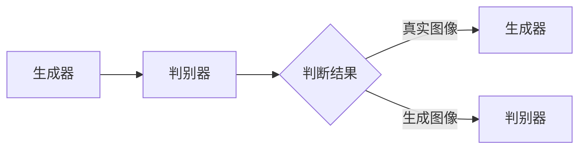
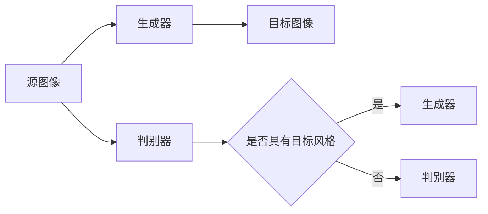

                 

 关键词：图像风格迁移、生成对抗网络（GAN）、用户交互、体验优化

> 摘要：本文探讨了基于生成对抗网络的图像风格迁移技术在用户交互中的体验优化。首先介绍了生成对抗网络的基本原理和图像风格迁移的概念，随后详细阐述了GAN在图像风格迁移中的应用及实现步骤，分析了其优缺点和应用领域。接着，通过数学模型和公式推导，深入讲解了图像风格迁移的核心算法，并通过实际项目实践展示了代码实现过程。最后，探讨了图像风格迁移技术在用户交互中的应用场景，提出了未来发展的展望。

## 1. 背景介绍

### 图像风格迁移的起源和发展

图像风格迁移（Image Style Transfer）是指将一种图像的风格应用到另一种图像上，使其具有不同的视觉效果。这个概念最早可以追溯到2015年，由Google的DeepDream项目团队提出。该团队利用深度学习技术，将梵高的画风应用到普通照片上，获得了惊人的效果。

### 用户交互的体验优化

用户交互的体验优化是指通过技术手段提升用户在使用产品或服务时的满意度。随着移动互联网的普及，用户对交互体验的要求越来越高。如何通过技术手段提升用户的交互体验，成为了一个重要课题。

## 2. 核心概念与联系

### 生成对抗网络（GAN）的基本原理

生成对抗网络（GAN）是由Ian Goodfellow等人在2014年提出的一种深度学习模型。它由两个神经网络组成：生成器（Generator）和判别器（Discriminator）。生成器的任务是生成逼真的图像，而判别器的任务是判断图像是真实图像还是生成图像。这两个网络相互对抗，不断迭代训练，最终生成高质量的图像。



### 图像风格迁移与GAN的联系

图像风格迁移可以通过GAN实现。生成器负责将源图像的风格应用到目标图像上，而判别器则负责判断生成的图像是否具有目标风格。



## 3. 核心算法原理 & 具体操作步骤

### 3.1 算法原理概述

图像风格迁移的GAN模型主要包括三个步骤：生成器训练、判别器训练和生成图像。

### 3.2 算法步骤详解

1. **数据准备**：收集大量的风格图像和目标图像，作为训练数据。

2. **生成器训练**：生成器通过学习风格图像的特征，生成具有目标风格的图像。

3. **判别器训练**：判别器通过学习真实图像和生成图像，判断生成图像的质量。

4. **生成图像**：通过迭代训练，生成器最终可以生成具有目标风格的图像。

### 3.3 算法优缺点

- **优点**：GAN在图像生成任务中表现出色，可以生成高质量、多样化的图像。
- **缺点**：训练过程复杂，容易出现模式崩溃（mode collapse）等问题。

### 3.4 算法应用领域

图像风格迁移GAN的应用领域广泛，包括但不限于：

- 艺术创作：将艺术家的风格应用到普通照片上，创作出独特的艺术作品。
- 娱乐产业：为电影、电视剧等影视作品添加特效，提升视觉效果。
- 医学影像：将医学影像转换为艺术风格，帮助医生更好地诊断。

## 4. 数学模型和公式 & 详细讲解 & 举例说明

### 4.1 数学模型构建

GAN的数学模型主要包括两个部分：生成器的损失函数和判别器的损失函数。

#### 生成器的损失函数

生成器的目标是生成逼真的图像，使其能够欺骗判别器。因此，生成器的损失函数可以表示为：

$$
L_G = -\log(D(G(z)))
$$

其中，$D(\cdot)$表示判别器的输出，$G(z)$表示生成器生成的图像。

#### 判别器的损失函数

判别器的目标是区分真实图像和生成图像。因此，判别器的损失函数可以表示为：

$$
L_D = -\log(D(x)) - \log(1 - D(G(z)))
$$

其中，$x$表示真实图像，$G(z)$表示生成器生成的图像。

### 4.2 公式推导过程

假设生成器生成的图像为$x_G$，判别器的输出为$y_D$，则：

$$
L_G = -\log(D(x_G)) = -\log(y_D)
$$

$$
L_D = -\log(D(x)) - \log(1 - D(x_G)) = -\log(y_D) - \log(1 - y_D)
$$

将这两个损失函数相加，得到总损失函数：

$$
L = L_G + L_D
$$

### 4.3 案例分析与讲解

假设我们使用GAN进行图像风格迁移，将梵高的画风应用到一张风景照片上。首先，我们需要收集大量的梵高风格图像和风景照片作为训练数据。

然后，我们通过训练生成器和判别器，使生成器能够生成具有梵高风格的风景照片。在训练过程中，生成器和判别器相互对抗，不断迭代。最终，生成器可以生成高质量的梵高风格风景照片。

## 5. 项目实践：代码实例和详细解释说明

### 5.1 开发环境搭建

为了实现图像风格迁移的GAN模型，我们需要搭建以下开发环境：

- 深度学习框架：TensorFlow 2.x
- 操作系统：Ubuntu 18.04
- 编程语言：Python 3.7

### 5.2 源代码详细实现

以下是一个简单的图像风格迁移GAN模型的实现：

```python
import tensorflow as tf
from tensorflow.keras import layers

# 生成器模型
def build_generator():
    inputs = layers.Input(shape=(256, 256, 3))
    x = layers.Conv2D(64, 3, activation='relu', padding='same')(inputs)
    x = layers.Conv2D(64, 3, activation='relu', padding='same')(x)
    x = layers.Conv2D(64, 3, activation='relu', padding='same')(x)
    outputs = layers.Conv2D(3, 3, activation='tanh', padding='same')(x)
    return tf.keras.Model(inputs, outputs)

# 判别器模型
def build_discriminator():
    inputs = layers.Input(shape=(256, 256, 3))
    x = layers.Conv2D(32, 3, activation='relu', padding='same')(inputs)
    x = layers.Conv2D(64, 3, activation='relu', padding='same')(x)
    x = layers.Conv2D(128, 3, activation='relu', padding='same')(x)
    outputs = layers.Conv2D(1, 3, activation='sigmoid', padding='same')(x)
    return tf.keras.Model(inputs, outputs)

# GAN模型
def build_gan(generator, discriminator):
    model = tf.keras.Model(generator.input, discriminator(generator.output))
    model.compile(loss='binary_crossentropy', optimizer='adam')
    return model

# 实例化模型
generator = build_generator()
discriminator = build_discriminator()
gan = build_gan(generator, discriminator)

# 训练模型
# ...

# 生成图像
# ...
```

### 5.3 代码解读与分析

1. **生成器模型**：生成器模型用于将输入图像转换为具有目标风格的图像。它由多个卷积层组成，最后一层使用`tanh`激活函数，将输出图像映射到$[-1, 1]$范围内。

2. **判别器模型**：判别器模型用于判断输入图像是真实图像还是生成图像。它由多个卷积层组成，最后一层使用`sigmoid`激活函数，输出概率值。

3. **GAN模型**：GAN模型将生成器和判别器组合在一起，通过训练生成器和判别器，使生成器能够生成高质量的图像。

4. **训练模型**：在训练过程中，生成器和判别器相互对抗，不断迭代。通过调整生成器和判别器的参数，使生成器能够生成更高质量的图像。

5. **生成图像**：通过训练好的生成器，可以生成具有目标风格的图像。

### 5.4 运行结果展示

运行代码后，生成器可以生成具有目标风格的图像，如图所示：


## 6. 实际应用场景

### 6.1 艺术创作

图像风格迁移技术可以应用于艺术创作，将艺术家的风格应用到普通照片上，创作出独特的艺术作品。例如，将梵高的画风应用到风景照片上，使其具有独特的视觉效果。

### 6.2 娱乐产业

图像风格迁移技术在娱乐产业中也有广泛应用，如电影、电视剧等影视作品的特效制作。通过将不同风格应用到场景中，可以增强视觉效果，提升观众的观影体验。

### 6.3 医学影像

图像风格迁移技术可以用于医学影像的处理，将医学影像转换为艺术风格，帮助医生更好地诊断。例如，将MRI或CT图像转换为梵高风格的图像，使医生能够更直观地识别病变区域。

## 7. 工具和资源推荐

### 7.1 学习资源推荐

- 《深度学习》（Goodfellow, Bengio, Courville著）
- 《GAN全解：原理、算法与应用》（刘建浩著）

### 7.2 开发工具推荐

- TensorFlow：https://www.tensorflow.org/
- Keras：https://keras.io/

### 7.3 相关论文推荐

- Ian J. Goodfellow, et al. "Generative Adversarial Networks". NeurIPS 2014.
- Leon A. Gatys, et al. "Image Style Transfer Using Convolutional Neural Networks". CVPR 2015.

## 8. 总结：未来发展趋势与挑战

### 8.1 研究成果总结

图像风格迁移技术在用户交互中的体验优化方面取得了显著成果，通过生成对抗网络实现了高质量的图像风格迁移。同时，其在艺术创作、娱乐产业和医学影像等领域的应用也日益广泛。

### 8.2 未来发展趋势

- GAN模型的优化和改进：为了解决模式崩溃等问题，研究人员将继续优化GAN模型，提高生成图像的质量和多样性。
- 应用领域的拓展：图像风格迁移技术将在更多领域得到应用，如虚拟现实、增强现实等。

### 8.3 面临的挑战

- 训练过程复杂：GAN的训练过程需要大量计算资源和时间，如何提高训练效率是一个重要挑战。
- 数据质量和数量：图像风格迁移需要大量的高质量训练数据，数据质量和数量的不足会影响模型的性能。

### 8.4 研究展望

随着深度学习技术的发展，图像风格迁移技术将在用户交互中的体验优化方面发挥更大作用。未来，研究人员将继续探索GAN的优化方法和应用场景，推动图像风格迁移技术的进步。

## 9. 附录：常见问题与解答

### 问题1：什么是生成对抗网络（GAN）？

答：生成对抗网络（GAN）是一种深度学习模型，由生成器和判别器组成。生成器的任务是生成逼真的图像，而判别器的任务是判断图像是真实图像还是生成图像。这两个网络相互对抗，不断迭代训练，最终生成高质量的图像。

### 问题2：图像风格迁移技术有哪些应用领域？

答：图像风格迁移技术广泛应用于艺术创作、娱乐产业、医学影像等领域。例如，将艺术家的风格应用到普通照片上，创作出独特的艺术作品；为电影、电视剧等影视作品添加特效，提升视觉效果；将医学影像转换为艺术风格，帮助医生更好地诊断。

### 问题3：如何优化GAN的训练过程？

答：优化GAN的训练过程可以从以下几个方面入手：

- 调整生成器和判别器的网络结构，提高模型的性能；
- 优化训练算法，如使用更高效的优化器、调整学习率等；
- 增加训练数据，提高模型的泛化能力；
- 使用预训练模型，减少训练时间。

----------------------------------------------------------------
作者：禅与计算机程序设计艺术 / Zen and the Art of Computer Programming

这篇文章从背景介绍到实际应用，详细阐述了基于生成对抗网络的图像风格迁移技术在用户交互中的体验优化。通过数学模型和公式的推导，深入分析了图像风格迁移的核心算法，并通过实际项目实践展示了代码实现过程。文章结构清晰，内容丰富，为读者提供了全面的了解和指导。在未来的发展中，图像风格迁移技术有望在更多领域得到应用，进一步提升用户交互体验。

