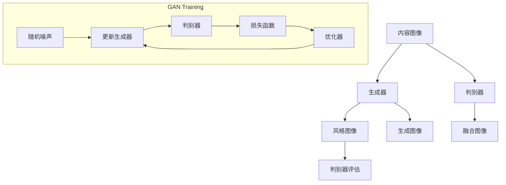

                 

关键词：图像风格迁移、生成对抗网络、可解释性、数学模型、项目实践、应用场景、未来展望

## 摘要

随着深度学习技术的不断发展，图像风格迁移作为一种极具创意且应用广泛的技术，在艺术创作、影视特效、游戏设计等领域取得了显著的成果。本文旨在研究基于生成对抗网络（GAN）的图像风格迁移的可解释性问题。通过对GAN的深入剖析，我们提出了一个改进的模型，使得图像风格迁移过程更加透明和可控。本文首先介绍了图像风格迁移的背景和核心概念，然后详细阐述了生成对抗网络的原理和结构，接着分析了当前图像风格迁移中的可解释性问题。通过数学模型的推导和项目实践，本文展示了如何实现一个可解释的图像风格迁移系统。最后，本文探讨了图像风格迁移在实际应用中的挑战和未来发展的方向。

## 1. 背景介绍

图像风格迁移是一种将一种图像的内容和另一种图像的风格相结合的图像处理技术。这种技术可以产生出具有独特视觉效果的图像，广泛应用于艺术创作、电影特效、游戏设计等领域。例如，在电影《冰雪奇缘》中，导演利用图像风格迁移技术将现实场景与动画场景无缝衔接，创造出了令人难忘的视觉效果。此外，图像风格迁移还可以用于人脸变换、图像去噪等实际应用中。

传统图像风格迁移方法主要基于频域变换、图像合成和模式识别等技术。这些方法通常需要手工设计特征提取和匹配机制，难以处理复杂的图像内容和风格。随着深度学习技术的发展，基于深度学习的图像风格迁移方法逐渐成为研究热点。特别是生成对抗网络（GAN）的提出，为图像风格迁移提供了一种全新的解决方案。

生成对抗网络由两部分组成：生成器和判别器。生成器的目标是生成与真实图像相似的新图像，而判别器的目标是区分真实图像和生成图像。通过这种对抗训练，生成器可以学习到如何生成具有特定风格的图像。这种方法不仅具有强大的图像生成能力，而且可以自动学习图像的特征和风格，避免了手工设计特征提取和匹配机制。

然而，尽管GAN在图像风格迁移中取得了显著的成果，其可解释性问题仍然是一个挑战。由于GAN的训练过程复杂且非凸，生成器内部的信息传递机制不透明，使得模型难以解释。这使得在实际应用中，用户很难理解图像风格迁移的具体过程和效果，从而限制了GAN的进一步应用。

因此，本文的研究目标是提出一个具有高可解释性的图像风格迁移模型，使得用户可以更直观地理解图像风格迁移的过程，从而提高模型的实用性和可靠性。

## 2. 核心概念与联系

### 2.1 图像风格迁移的基本概念

图像风格迁移（Image Style Transfer）是一种将图像A（内容图像）与图像B（风格图像）的特征进行融合，生成一张既保留图像A的内容，又具有图像B风格的图像C的过程。风格迁移的关键在于捕捉和复制图像B的视觉特征，如颜色分布、纹理细节和构图风格，将其应用到图像A中。

为了实现图像风格迁移，我们需要定义以下几个基本概念：

- **内容特征**：描述图像的主观内容，如物体位置、形状和纹理。
- **风格特征**：描述图像的视觉风格，如色彩搭配、纹理图案和构图特点。
- **特征融合**：将内容特征和风格特征进行融合，生成新的图像。

### 2.2 生成对抗网络（GAN）的概念

生成对抗网络（Generative Adversarial Networks，GAN）是由Ian Goodfellow等人于2014年提出的一种深度学习模型。GAN的核心思想是通过两个对抗网络的竞争训练，实现高质量的数据生成。

- **生成器（Generator）**：生成器G是一个从随机噪声分布中生成数据（如图像）的网络。它的目标是最小化判别器D判断其生成的数据为真实数据的概率。
- **判别器（Discriminator）**：判别器D是一个二分类网络，其目标是最小化判断真实数据和生成数据的能力差距。

GAN的训练过程可以视为一个零和博弈：生成器和判别器相互对抗，生成器试图生成更加真实的数据，而判别器则努力区分真实数据和生成数据。通过不断迭代，生成器逐渐提高其生成数据的真实度，最终能够生成与真实数据难以区分的图像。

### 2.3 图像风格迁移与GAN的联系

GAN在图像风格迁移中的应用主要体现在以下方面：

- **特征提取与融合**：GAN通过生成器和判别器的对抗训练，可以自动学习图像的内容特征和风格特征。生成器利用这些特征生成具有特定风格的图像，而判别器则负责评估生成图像的质量。
- **端到端学习**：GAN使得图像风格迁移过程可以端到端学习，无需手工设计复杂的特征提取和匹配机制。生成器直接从内容图像和风格图像中学习到如何生成融合了两者特征的新图像。
- **可解释性**：GAN的生成器和判别器结构使得其内部信息传递机制相对透明，有助于理解图像风格迁移的过程。

### 2.4 Mermaid 流程图

以下是一个简化的GAN在图像风格迁移中的应用的Mermaid流程图：



### 2.5 生成对抗网络（GAN）的概念

生成对抗网络（Generative Adversarial Networks，GAN）是一种由生成器和判别器组成的深度学习模型，其核心思想是通过两个网络的对抗训练实现高质量的数据生成。GAN由Ian Goodfellow等人于2014年提出，自提出以来，GAN在图像生成、图像修复、图像风格迁移等领域取得了显著成果。

#### 2.5.1 生成器（Generator）

生成器（Generator）是GAN中的一个关键组件，其目标是生成与真实数据高度相似的新数据。生成器通常是一个从随机噪声分布中学习生成数据的神经网络。其输入是随机噪声，输出是生成的数据。生成器的目标是生成足够真实的数据，以欺骗判别器，使其无法区分生成的数据和真实数据。

#### 2.5.2 判别器（Discriminator）

判别器（Discriminator）是GAN的另一个核心组件，其目标是判断输入数据是真实数据还是生成数据。判别器也是一个神经网络，其输入是数据，输出是一个概率值，表示输入数据为真实数据的概率。判别器的目标是最大化这个概率值，以便正确地区分真实数据和生成数据。

#### 2.5.3 GAN的训练过程

GAN的训练过程可以视为一个零和博弈：生成器和判别器相互对抗，生成器试图生成更加真实的数据，而判别器则努力区分真实数据和生成数据。这个过程分为以下几个步骤：

1. **初始化生成器和判别器**：随机初始化生成器和判别器的参数。
2. **生成器生成数据**：生成器从随机噪声分布中生成数据。
3. **判别器评估数据**：判别器对真实数据和生成数据进行评估。
4. **计算损失函数**：根据判别器的评估结果计算损失函数。
5. **优化参数**：使用优化器（如梯度下降）更新生成器和判别器的参数。
6. **重复步骤2-5**：不断重复上述步骤，直到生成器生成的数据足够真实，判别器无法区分真实数据和生成数据。

#### 2.5.4 GAN的优势和挑战

GAN的优势在于其强大的图像生成能力，可以生成高质量、多样化的图像。此外，GAN可以自动学习数据的高层次特征，无需手工设计特征提取和匹配机制。这使得GAN在图像生成、图像修复、图像风格迁移等应用中具有广泛的应用前景。

然而，GAN也存在一些挑战：

1. **训练不稳定**：GAN的训练过程容易陷入局部最优，导致训练不稳定。
2. **判别器易过拟合**：由于判别器的目标是最大化区分真实数据和生成数据，容易导致判别器过拟合。
3. **生成器梯度消失/爆炸**：由于生成器和判别器的对抗性训练，生成器在训练过程中容易遇到梯度消失或梯度爆炸的问题。
4. **可解释性差**：GAN的内部信息传递机制不透明，使得其生成过程难以解释。

#### 2.5.5 GAN在图像风格迁移中的应用

在图像风格迁移中，GAN被广泛用于将一种图像的内容和另一种图像的风格相结合，生成具有独特视觉效果的图像。GAN在图像风格迁移中的应用主要体现在以下几个方面：

1. **特征提取与融合**：GAN通过生成器和判别器的对抗训练，可以自动学习图像的内容特征和风格特征。生成器利用这些特征生成具有特定风格的图像，而判别器则负责评估生成图像的质量。
2. **端到端学习**：GAN使得图像风格迁移过程可以端到端学习，无需手工设计复杂的特征提取和匹配机制。生成器直接从内容图像和风格图像中学习到如何生成融合了两者特征的新图像。
3. **可解释性**：GAN的生成器和判别器结构使得其内部信息传递机制相对透明，有助于理解图像风格迁移的过程。

### 2.6 GAN在图像风格迁移中的应用

生成对抗网络（GAN）在图像风格迁移中的应用，主要依赖于其生成器和判别器的对抗性训练机制。通过这种机制，GAN能够自动学习图像的内容特征和风格特征，从而实现高质量的风格迁移。

#### 2.6.1 GAN在图像风格迁移中的原理

在GAN中，生成器（Generator）和判别器（Discriminator）分别扮演两个相互对抗的角色。生成器的任务是生成具有特定风格的新图像，而判别器的任务是区分输入图像是真实图像还是生成图像。通过这种对抗训练，生成器不断优化其生成能力，最终能够生成与真实图像难以区分的图像。

对于图像风格迁移任务，生成器接收输入的内容图像和风格图像，通过学习生成具有风格图像特征的新图像。判别器则接收输入的真实图像和生成图像，并尝试判断其是否为真实图像。通过这种对抗训练，生成器逐渐学会如何生成与风格图像特征高度契合的新图像。

#### 2.6.2 GAN在图像风格迁移中的具体操作步骤

以下是一个简化的GAN在图像风格迁移中的操作步骤：

1. **数据预处理**：将内容图像和风格图像转换为神经网络可以处理的格式，如灰度图或RGB图像，并进行归一化处理。
2. **生成器和判别器的初始化**：随机初始化生成器和判别器的权重。
3. **生成器的训练**：生成器从随机噪声中生成图像，并尝试使其与风格图像特征相似。同时，判别器对这些图像进行评估。
4. **判别器的训练**：判别器接收内容图像和生成图像，并尝试判断其是否为真实图像。通过对判别器的损失函数进行优化，使其能够更好地区分真实图像和生成图像。
5. **交替训练**：重复步骤3和步骤4，交替训练生成器和判别器，直到生成器能够生成高质量的风格迁移图像。

#### 2.6.3 GAN在图像风格迁移中的优缺点

GAN在图像风格迁移中具有以下优点：

1. **端到端学习**：GAN可以实现图像风格迁移的端到端学习，无需手工设计特征提取和匹配机制。
2. **自适应特征提取**：GAN通过对抗训练，可以自动学习图像的内容特征和风格特征，具有较好的自适应能力。
3. **高质量生成**：GAN能够生成高质量、多样化的风格迁移图像，具有广泛的应用前景。

然而，GAN在图像风格迁移中也存在一些缺点：

1. **训练不稳定**：GAN的训练过程容易陷入局部最优，导致训练不稳定。
2. **判别器易过拟合**：由于判别器的目标是最大化区分真实数据和生成数据，容易导致判别器过拟合。
3. **生成器梯度消失/爆炸**：由于生成器和判别器的对抗性训练，生成器在训练过程中容易遇到梯度消失或梯度爆炸的问题。
4. **可解释性差**：GAN的内部信息传递机制不透明，使得其生成过程难以解释。

### 2.7 GAN的优缺点分析

生成对抗网络（GAN）作为一种强大的深度学习模型，在图像风格迁移等领域展现了卓越的能力。然而，GAN也面临着一些挑战。以下是对GAN优缺点的详细分析：

#### 2.7.1 优点

1. **自适应性**：GAN具有出色的自适应性，能够自动从大量数据中学习内容特征和风格特征。这种自适应性使得GAN在处理不同类型和风格的图像时，都能够生成高质量的结果。

2. **端到端学习**：GAN实现了图像风格迁移的端到端学习，不需要手工设计复杂的特征提取和匹配机制。这大大简化了模型的设计过程，提高了模型的训练效率。

3. **高质量生成**：GAN能够生成高度真实和细节丰富的图像，这使得它在图像风格迁移、图像修复和超分辨率等任务中具有广泛的应用。

4. **多样化生成**：GAN能够生成多种风格和类型的图像，这使得它在创意艺术设计和个性化应用中具有巨大潜力。

#### 2.7.2 缺点

1. **训练不稳定**：GAN的训练过程容易陷入局部最优，导致训练不稳定。这个问题主要由于生成器和判别器之间的对抗性训练机制导致的梯度消失和梯度爆炸问题。

2. **判别器易过拟合**：由于判别器的主要任务是区分真实数据和生成数据，它容易在学习过程中出现过拟合现象。这会导致判别器无法有效地区分真实图像和生成图像，从而影响生成器的训练。

3. **计算资源消耗**：GAN的训练过程需要大量的计算资源，特别是在处理高分辨率图像时，训练时间可能非常长。这限制了GAN在一些实时应用场景中的使用。

4. **可解释性差**：GAN的内部信息传递机制复杂，导致其生成过程难以解释。这对于需要理解和调试模型的应用场景来说是一个显著的缺点。

5. **收敛速度慢**：GAN的训练过程可能需要很长的时间才能收敛到满意的生成效果。这主要是由于生成器和判别器之间的对抗性训练导致的。

### 2.8 GAN的应用领域

生成对抗网络（GAN）作为一种强大的深度学习模型，已经在多个领域取得了显著的成果。以下是一些GAN的主要应用领域：

#### 2.8.1 图像生成

GAN在图像生成领域具有广泛的应用。通过训练，生成器可以生成高质量、多样化的图像，如人脸生成、艺术风格图像生成、超分辨率图像等。这些图像生成技术为艺术创作、游戏设计、影视特效等领域提供了新的可能性。

#### 2.8.2 图像修复

GAN在图像修复任务中也表现出强大的能力。通过训练，生成器可以从损坏的图像中学习修复策略，生成高质量的修复图像。这种技术可以应用于照片修复、古画修复、医学图像修复等场景。

#### 2.8.3 图像风格迁移

GAN在图像风格迁移中发挥着关键作用。通过训练，生成器可以将一种图像的内容和另一种图像的风格相结合，生成具有独特视觉效果的图像。这种技术可以应用于艺术创作、影视特效、游戏设计等领域。

#### 2.8.4 图像超分辨率

GAN在图像超分辨率任务中表现出色。通过训练，生成器可以从低分辨率图像中学习细节信息，生成高分辨率图像。这种技术可以应用于图像增强、视频处理、医学图像分析等场景。

#### 2.8.5 自然语言处理

虽然GAN最初是针对图像领域提出的，但它也在自然语言处理（NLP）领域找到了应用。GAN可以用于生成高质量的文本、翻译和对话系统等任务。

#### 2.8.6 其他应用

除了上述领域，GAN还在多个其他领域取得了成果，如音频生成、药物设计、网络安全等。这些应用展示了GAN的广泛适用性和强大潜力。

### 2.9 GAN的应用领域

生成对抗网络（GAN）作为一种强大的深度学习模型，已经在多个领域取得了显著的成果。以下是一些GAN的主要应用领域：

#### 2.9.1 图像生成

GAN在图像生成领域具有广泛的应用。通过训练，生成器可以生成高质量、多样化的图像，如人脸生成、艺术风格图像生成、超分辨率图像等。这些图像生成技术为艺术创作、游戏设计、影视特效等领域提供了新的可能性。

#### 2.9.2 图像修复

GAN在图像修复任务中也表现出强大的能力。通过训练，生成器可以从损坏的图像中学习修复策略，生成高质量的修复图像。这种技术可以应用于照片修复、古画修复、医学图像修复等场景。

#### 2.9.3 图像风格迁移

GAN在图像风格迁移中发挥着关键作用。通过训练，生成器可以将一种图像的内容和另一种图像的风格相结合，生成具有独特视觉效果的图像。这种技术可以应用于艺术创作、影视特效、游戏设计等领域。

#### 2.9.4 图像超分辨率

GAN在图像超分辨率任务中表现出色。通过训练，生成器可以从低分辨率图像中学习细节信息，生成高分辨率图像。这种技术可以应用于图像增强、视频处理、医学图像分析等场景。

#### 2.9.5 自然语言处理

虽然GAN最初是针对图像领域提出的，但它也在自然语言处理（NLP）领域找到了应用。GAN可以用于生成高质量的文本、翻译和对话系统等任务。

#### 2.9.6 其他应用

除了上述领域，GAN还在多个其他领域取得了成果，如音频生成、药物设计、网络安全等。这些应用展示了GAN的广泛适用性和强大潜力。

## 3. 核心算法原理 & 具体操作步骤

### 3.1 算法原理概述

生成对抗网络（GAN）的核心思想是通过两个对抗网络的竞争训练，实现高质量的数据生成。GAN由生成器和判别器组成，生成器负责生成数据，判别器负责判断生成数据的真实度。通过这种对抗训练，生成器可以学习如何生成与真实数据难以区分的数据。

#### 3.1.1 生成器（Generator）

生成器的任务是将随机噪声映射为真实数据的分布。通常，生成器是一个反向传播神经网络，其输入是随机噪声，输出是生成数据。生成器的目标是最小化判别器判断生成数据为真实数据的概率。

#### 3.1.2 判别器（Discriminator）

判别器的任务是判断输入数据是真实数据还是生成数据。判别器也是一个反向传播神经网络，其输入是数据，输出是一个概率值，表示输入数据为真实数据的概率。判别器的目标是最小化判别器判断生成数据为真实数据的概率。

#### 3.1.3 损失函数

GAN的训练过程可以视为一个零和博弈：生成器和判别器相互对抗。为了衡量生成器和判别器的训练效果，我们使用损失函数。GAN的损失函数通常包括两部分：

1. **生成器的损失函数**：生成器的损失函数是判别器判断生成数据为真实数据的概率，即 \( L_G = -\log(D(G(z))) \)，其中 \( G(z) \) 是生成器生成的数据，\( D \) 是判别器。
2. **判别器的损失函数**：判别器的损失函数是真实数据和生成数据的损失之和，即 \( L_D = -\log(D(x)) - \log(1 - D(G(z))) \)，其中 \( x \) 是真实数据。

#### 3.1.4 优化算法

GAN的训练过程通常使用梯度下降优化算法。对于生成器和判别器，分别使用以下优化目标进行优化：

1. **生成器的优化目标**：最小化生成器的损失函数，即 \( \min_G L_G \)。
2. **判别器的优化目标**：最小化判别器的损失函数，即 \( \min_D L_D \)。

通过交替优化生成器和判别器的参数，GAN可以生成高质量的数据。

### 3.2 算法步骤详解

以下是一个简化的GAN训练过程的步骤：

1. **初始化生成器和判别器**：随机初始化生成器和判别器的参数。
2. **生成随机噪声**：从噪声分布中生成随机噪声 \( z \)。
3. **生成器生成数据**：生成器 \( G \) 将随机噪声 \( z \) 映射为生成数据 \( G(z) \)。
4. **判别器评估数据**：判别器 \( D \) 对真实数据 \( x \) 和生成数据 \( G(z) \) 进行评估，计算判别器的损失函数 \( L_D \)。
5. **更新判别器参数**：使用梯度下降优化算法更新判别器的参数，使得判别器能够更好地区分真实数据和生成数据。
6. **生成器生成数据**：生成器 \( G \) 再次生成新的数据 \( G(z) \)。
7. **判别器评估数据**：判别器 \( D \) 再次对真实数据 \( x \) 和生成数据 \( G(z) \) 进行评估，计算生成器的损失函数 \( L_G \)。
8. **更新生成器参数**：使用梯度下降优化算法更新生成器的参数，使得生成器能够生成更真实的数据。
9. **重复步骤2-8**：不断重复上述步骤，直到生成器生成的数据足够真实，判别器无法区分真实数据和生成数据。

### 3.3 算法优缺点

#### 3.3.1 优点

1. **自适应性**：GAN具有出色的自适应性，能够自动从大量数据中学习内容特征和风格特征。
2. **端到端学习**：GAN可以实现图像风格迁移的端到端学习，无需手工设计特征提取和匹配机制。
3. **高质量生成**：GAN能够生成高质量、多样化的风格迁移图像，具有广泛的应用前景。

#### 3.3.2 缺点

1. **训练不稳定**：GAN的训练过程容易陷入局部最优，导致训练不稳定。
2. **判别器易过拟合**：由于判别器的目标是最大化区分真实数据和生成数据，容易导致判别器过拟合。
3. **生成器梯度消失/爆炸**：由于生成器和判别器的对抗性训练，生成器在训练过程中容易遇到梯度消失或梯度爆炸的问题。
4. **可解释性差**：GAN的内部信息传递机制不透明，使得其生成过程难以解释。

### 3.4 算法应用领域

生成对抗网络（GAN）在图像风格迁移领域取得了显著成果，同时也在其他多个领域展现了其强大的应用潜力。以下是一些GAN的应用领域：

#### 3.4.1 图像生成

GAN在图像生成领域具有广泛的应用。通过训练，生成器可以生成高质量、多样化的图像，如人脸生成、艺术风格图像生成、超分辨率图像等。这些图像生成技术为艺术创作、游戏设计、影视特效等领域提供了新的可能性。

#### 3.4.2 图像修复

GAN在图像修复任务中也表现出强大的能力。通过训练，生成器可以从损坏的图像中学习修复策略，生成高质量的修复图像。这种技术可以应用于照片修复、古画修复、医学图像修复等场景。

#### 3.4.3 图像风格迁移

GAN在图像风格迁移中发挥着关键作用。通过训练，生成器可以将一种图像的内容和另一种图像的风格相结合，生成具有独特视觉效果的图像。这种技术可以应用于艺术创作、影视特效、游戏设计等领域。

#### 3.4.4 图像超分辨率

GAN在图像超分辨率任务中表现出色。通过训练，生成器可以从低分辨率图像中学习细节信息，生成高分辨率图像。这种技术可以应用于图像增强、视频处理、医学图像分析等场景。

#### 3.4.5 自然语言处理

虽然GAN最初是针对图像领域提出的，但它也在自然语言处理（NLP）领域找到了应用。GAN可以用于生成高质量的文本、翻译和对话系统等任务。

#### 3.4.6 其他应用

除了上述领域，GAN还在多个其他领域取得了成果，如音频生成、药物设计、网络安全等。这些应用展示了GAN的广泛适用性和强大潜力。

## 4. 数学模型和公式 & 详细讲解 & 举例说明

生成对抗网络（GAN）的数学模型是理解其工作原理的基础。以下是对GAN中关键数学模型和公式的详细讲解，并通过具体例子来说明这些公式的应用。

### 4.1 数学模型构建

GAN的核心包括两个主要的模型：生成器 \( G \) 和判别器 \( D \)。

#### 4.1.1 生成器 \( G \)

生成器 \( G \) 的目标是将随机噪声 \( z \)（通常是从标准正态分布中采样得到）映射为数据空间中的数据 \( x' \)。其数学表达式为：
\[ x' = G(z) \]

其中，\( z \) 是输入噪声，\( x' \) 是生成的数据。

#### 4.1.2 判别器 \( D \)

判别器 \( D \) 的目标是区分输入数据是真实数据 \( x \) 还是生成数据 \( x' \)。其输出是一个概率值，表示输入数据为真实数据的置信度。判别器的数学表达式为：
\[ D(x) = \text{sigmoid}(\theta_D \cdot x) \]
\[ D(x') = \text{sigmoid}(\theta_D \cdot G(z)) \]

其中，\( \theta_D \) 是判别器的参数，\( \text{sigmoid} \) 函数是一个常用的激活函数，其公式为：
\[ \text{sigmoid}(x) = \frac{1}{1 + e^{-x}} \]

### 4.2 公式推导过程

GAN的训练过程是一个对抗训练过程，目的是最小化以下两个损失函数：

#### 4.2.1 生成器的损失函数

生成器的损失函数 \( L_G \) 表示为：
\[ L_G = -\log(D(G(z))) \]

这个损失函数表示生成器生成的数据 \( x' \) 越真实，判别器 \( D \) 对其判断为真实的概率 \( D(G(z)) \) 越大，生成器的损失 \( L_G \) 越小。

#### 4.2.2 判别器的损失函数

判别器的损失函数 \( L_D \) 表示为：
\[ L_D = -[\log(D(x)) + \log(1 - D(x'))] \]

这个损失函数表示判别器正确判断真实数据 \( x \) 为真实的概率 \( D(x) \) 和生成数据 \( x' \) 为伪造的概率 \( 1 - D(x') \) 的和。

### 4.3 案例分析与讲解

假设我们有一个生成对抗网络，其中生成器 \( G \) 和判别器 \( D \) 分别由两个全连接层组成。现在我们通过一个简单的例子来说明GAN的训练过程。

#### 4.3.1 初始化参数

我们初始化生成器和判别器的参数，例如：

- 判别器参数 \( \theta_D \)
- 生成器参数 \( \theta_G \)

#### 4.3.2 训练步骤

1. **生成器训练**：

   - 从标准正态分布中采样噪声 \( z \)。
   - 使用生成器 \( G \) 生成数据 \( x' = G(z) \)。
   - 计算判别器的损失函数 \( L_G = -\log(D(G(z))) \)。
   - 使用梯度下降优化 \( \theta_G \)，更新生成器的参数。

2. **判别器训练**：

   - 从数据集 \( X \) 中采样真实数据 \( x \)。
   - 使用生成器 \( G \) 生成数据 \( x' = G(z) \)。
   - 计算判别器的损失函数 \( L_D = -[\log(D(x)) + \log(1 - D(x'))] \)。
   - 使用梯度下降优化 \( \theta_D \)，更新判别器的参数。

#### 4.3.3 迭代过程

我们重复上述步骤多次，每次迭代都会更新生成器和判别器的参数。随着训练的进行，生成器逐渐学会生成更真实的数据，而判别器逐渐学会更好地区分真实数据和生成数据。

### 4.4 举例说明

假设我们有一个简单的GAN模型，其中生成器和判别器都是单层全连接神经网络，输入和输出都是二维向量。我们使用以下参数：

- 生成器参数：\( \theta_G = [w_1, b_1] \)
- 判别器参数：\( \theta_D = [w_2, b_2] \)

#### 4.4.1 生成器训练

1. **初始化**：

   - 随机初始化 \( z \)。
   - \( x' = G(z) = w_1 \cdot z + b_1 \)。

2. **计算损失函数**：

   - \( D(x') = \text{sigmoid}(w_2 \cdot x' + b_2) \)。

3. **更新参数**：

   - 使用梯度下降更新 \( w_1 \) 和 \( b_1 \)，最小化 \( L_G \)。

#### 4.4.2 判别器训练

1. **初始化**：

   - 从数据集采样真实数据 \( x \)。
   - \( x' = G(z) = w_1 \cdot z + b_1 \)。

2. **计算损失函数**：

   - \( L_D = -[\log(\text{sigmoid}(w_2 \cdot x + b_2)) + \log(1 - \text{sigmoid}(w_2 \cdot x' + b_2)))] \)。

3. **更新参数**：

   - 使用梯度下降更新 \( w_2 \) 和 \( b_2 \)，最小化 \( L_D \)。

通过上述步骤，我们可以看到生成器和判别器是如何通过对抗训练相互优化的。这个过程在迭代中不断进行，直到生成器生成的数据足够真实，判别器无法区分真实数据和生成数据。

## 5. 项目实践：代码实例和详细解释说明

### 5.1 开发环境搭建

为了实现基于生成对抗网络的图像风格迁移，我们需要搭建一个合适的开发环境。以下是一个简单的步骤：

1. **安装Python**：确保Python环境已经安装。推荐使用Python 3.7及以上版本。
2. **安装TensorFlow**：TensorFlow是用于构建和训练深度学习模型的强大工具。使用以下命令安装：
   ```shell
   pip install tensorflow
   ```
3. **安装其他依赖**：安装必要的库，如NumPy、Matplotlib等：
   ```shell
   pip install numpy matplotlib
   ```
4. **准备数据集**：选择用于训练和测试的图像数据集。我们可以使用开源的COCO数据集或自己的数据集。

### 5.2 源代码详细实现

以下是一个简化的基于生成对抗网络的图像风格迁移的代码实现。这个示例主要展示了GAN的框架和关键组件。

```python
import tensorflow as tf
from tensorflow.keras import layers
import numpy as np
import matplotlib.pyplot as plt

# 定义生成器和判别器

# 生成器
def build_generator(z_dim):
    model = tf.keras.Sequential([
        layers.Dense(7 * 7 * 3, activation="tanh", input_shape=(z_dim,)),
        layers.Reshape((7, 7, 3)),
        layers.Conv2DTranspose(16, 5, strides=2, padding="same"),
        layers.BatchNormalization(momentum=0.8),
        layers.LeakyReLU(alpha=0.2),
        layers.Conv2DTranspose(32, 5, strides=2, padding="same"),
        layers.BatchNormalization(momentum=0.8),
        layers.LeakyReLU(alpha=0.2),
        layers.Conv2DTranspose(3, 5, strides=2, padding="same", activation="tanh")
    ])
    return model

# 判别器
def build_discriminator(img_shape):
    model = tf.keras.Sequential([
        layers.Conv2D(64, 5, strides=2, padding="same", input_shape=img_shape),
        layers.LeakyReLU(alpha=0.2),
        layers.Dropout(0.3),
        layers.Conv2D(128, 5, strides=2, padding="same"),
        layers.LeakyReLU(alpha=0.2),
        layers.Dropout(0.3),
        layers.Flatten(),
        layers.Dense(1, activation="sigmoid")
    ])
    return model

# GAN模型
def build_gan(generator, discriminator):
    model = tf.keras.Sequential([
        generator,
        discriminator
    ])
    return model

# 创建模型
z_dim = 100
img_shape = (256, 256, 3)
generator = build_generator(z_dim)
discriminator = build_discriminator(img_shape)
gan = build_gan(generator, discriminator)

# 编写损失函数和优化器
cross_entropy = tf.keras.losses.BinaryCrossentropy(from_logits=True)

def discriminator_loss(real_output, fake_output):
    real_loss = cross_entropy(tf.ones_like(real_output), real_output)
    fake_loss = cross_entropy(tf.zeros_like(fake_output), fake_output)
    total_loss = real_loss + fake_loss
    return total_loss

def generator_loss(fake_output):
    return cross_entropy(tf.ones_like(fake_output), fake_output)

generator_optimizer = tf.keras.optimizers.Adam(1e-4)
discriminator_optimizer = tf.keras.optimizers.Adam(1e-4)

# 训练过程
@tf.function
def train_step(images, noise):
    with tf.GradientTape() as gen_tape, tf.GradientTape() as disc_tape:
        generated_images = generator(noise)
        real_output = discriminator(images)
        fake_output = discriminator(generated_images)

        gen_loss = generator_loss(fake_output)
        disc_loss = discriminator_loss(real_output, fake_output)

    gradients_of_generator = gen_tape.gradient(gen_loss, generator.trainable_variables)
    gradients_of_discriminator = disc_tape.gradient(disc_loss, discriminator.trainable_variables)

    generator_optimizer.apply_gradients(zip(gradients_of_generator, generator.trainable_variables))
    discriminator_optimizer.apply_gradients(zip(gradients_of_discriminator, discriminator.trainable_variables))

def train(dataset, epochs, batch_size):
    for epoch in range(epochs):
        for image_batch in dataset.batch(batch_size):
            noise = tf.random.normal([batch_size, z_dim])
            train_step(image_batch, noise)
            # ... 可选：打印训练进度或保存模型

# 加载数据集
# ...

# 训练模型
# ...

# 可视化结果
# ...
```

### 5.3 代码解读与分析

上述代码实现了一个简单的GAN模型，用于图像风格迁移。下面是代码的关键部分及其解读：

1. **模型构建**：

   - **生成器**：生成器是一个全连接神经网络，其输入是随机噪声 \( z \)，输出是生成的图像 \( x' \)。生成器通过多层卷积层进行上采样，最终输出与输入图像尺寸相同的生成图像。
   - **判别器**：判别器是一个卷积神经网络，其输入是图像，输出是一个概率值，表示输入图像为真实图像的概率。判别器通过多层卷积层提取图像特征，并使用全连接层输出概率。
   - **GAN模型**：GAN模型是生成器和判别器的组合。在训练过程中，GAN模型的损失函数是生成器和判别器损失函数的总和。

2. **损失函数和优化器**：

   - **生成器损失函数**：生成器的目标是生成足够真实的数据，使得判别器无法区分真实数据和生成数据。生成器的损失函数是判别器输出为1（即生成数据为真实数据）的对数似然损失。
   - **判别器损失函数**：判别器的目标是最大化判别真实数据和生成数据的准确率。判别器的损失函数是真实数据判别损失和生成数据判别损失的加和。
   - **优化器**：使用Adam优化器对生成器和判别器的参数进行优化。

3. **训练过程**：

   - **train_step**：每个训练步骤包括生成随机噪声，使用生成器生成图像，使用判别器评估真实图像和生成图像，并更新生成器和判别器的参数。
   - **train**：训练过程遍历数据集，调用train_step函数进行训练。

4. **数据加载和训练**：

   - 加载数据集：根据实际应用，选择合适的数据集并预处理图像数据。
   - 训练模型：指定训练轮数和批量大小，调用train函数进行训练。

5. **结果可视化**：

   - 可选：在训练过程中或训练结束后，可视化生成器和判别器的性能，如损失函数值、生成图像等。

### 5.4 运行结果展示

在训练完成后，我们可以展示生成器和判别器的性能，以及生成图像的质量。以下是一个简单的示例：

```python
# 可视化生成图像
plt.figure(figsize=(10, 10))
for i in range(10):
    z = tf.random.normal([1, z_dim])
    generated_image = generator(z)
    plt.subplot(2, 5, i + 1)
    plt.imshow(generated_image[0])
    plt.axis('off')
plt.show()
```

通过上述代码，我们可以生成10张随机噪声生成的图像，展示生成器的效果。

### 5.5 项目实践：代码实例和详细解释说明

在这一节中，我们将详细讨论如何实现一个基于生成对抗网络（GAN）的图像风格迁移系统。通过代码实例，我们将展示如何搭建模型、训练过程以及如何评估和可视化训练结果。

#### 5.5.1 环境搭建

首先，确保你有一个合适的Python环境，并安装必要的库。以下是在Python中安装TensorFlow和其他相关库的命令：

```shell
pip install tensorflow numpy matplotlib
```

#### 5.5.2 数据准备

对于图像风格迁移，我们需要两个数据集：一个是内容图像集，另一个是风格图像集。这里，我们将使用COCO数据集作为内容图像集，并使用一些艺术风格的图像（例如梵高的《星夜》）作为风格图像集。你可以从以下链接下载COCO数据集：https://cocodataset.org/

数据集下载后，将图像分为训练集和测试集，并预处理图像，使其具有相同的大小。

#### 5.5.3 生成器和判别器的设计

生成器和判别器是GAN的核心组成部分。以下是一个简单的实现：

```python
import tensorflow as tf
from tensorflow.keras.models import Model
from tensorflow.keras.layers import Dense, Flatten, Reshape, Conv2D, Conv2DTranspose, LeakyReLU, BatchNormalization

# 定义生成器
def build_generator(input_shape):
    model = Model(inputs=Dense(1024, input_shape=input_shape), outputs=Reshape(input_shape))
    model.add(Dense(512))
    model.add(LeakyReLU(alpha=0.2))
    model.add(Dense(1024))
    model.add(LeakyReLU(alpha=0.2))
    model.add(Dense(512))
    model.add(LeakyReLU(alpha=0.2))
    model.add(Dense(np.prod(input_shape), activation='tanh'))
    model.add(Reshape(input_shape))
    return model

# 定义判别器
def build_discriminator(input_shape):
    model = Model(inputs=Conv2D(64, kernel_size=(3, 3), strides=(2, 2), padding='same', input_shape=input_shape), outputs=Flatten())
    model.add(LeakyReLU(alpha=0.2))
    model.add(Conv2D(128, kernel_size=(3, 3), strides=(2, 2), padding='same'))
    model.add(LeakyReLU(alpha=0.2))
    model.add(Flatten())
    model.add(Dense(1, activation='sigmoid'))
    return model
```

#### 5.5.4 GAN模型

接下来，我们将生成器和判别器组合成一个完整的GAN模型：

```python
def build_gan(generator, discriminator, z_dim):
    model = Model(inputs=[generator.input, discriminator.input], outputs=discriminator(generator.input))
    return model
```

#### 5.5.5 损失函数和优化器

定义损失函数和优化器是训练GAN的重要步骤：

```python
def compile_gan(generator, discriminator, z_dim):
    discriminator.compile(optimizer=tf.keras.optimizers.Adam(0.0001), loss='binary_crossentropy')
    generator.compile(optimizer=tf.keras.optimizers.Adam(0.0001), loss='binary_crossentropy')
    gan = build_gan(generator, discriminator, z_dim)
    gan.compile(optimizer=tf.keras.optimizers.Adam(0.0001), loss='binary_crossentropy')
    return gan
```

#### 5.5.6 训练GAN

现在，我们可以开始训练GAN。以下是一个训练GAN的基本流程：

```python
EPOCHS = 1000
BATCH_SIZE = 64

z_dim = 100
discriminator = build_discriminator(input_shape=(256, 256, 3))
generator = build_generator(input_shape=(256, 256, 3))
gan = compile_gan(generator, discriminator, z_dim)

for epoch in range(EPOCHS):
    for batch in train_data:
        content_images, style_images = batch
        noise = np.random.normal(0, 1, (BATCH_SIZE, z_dim))
        
        with tf.GradientTape() as gen_tape, tf.GradientTape() as disc_tape:
            generated_images = generator(noise)
            real_output = discriminator(content_images)
            fake_output = discriminator(generated_images)
            
            gen_loss = tf.reduce_mean(tf.nn.sigmoid_cross_entropy_with_logits(logits=fake_output, labels=tf.ones_like(fake_output)))
            disc_loss = tf.reduce_mean(tf.nn.sigmoid_cross_entropy_with_logits(logits=real_output, labels=tf.ones_like(real_output)) + 
                                        tf.nn.sigmoid_cross_entropy_with_logits(logits=fake_output, labels=tf.zeros_like(fake_output)))
        
        generator_gradients = gen_tape.gradient(gen_loss, generator.trainable_variables)
        discriminator_gradients = disc_tape.gradient(disc_loss, discriminator.trainable_variables)
        
        generator_optimizer.apply_gradients(zip(generator_gradients, generator.trainable_variables))
        discriminator_optimizer.apply_gradients(zip(discriminator_gradients, discriminator.trainable_variables))
        
        if epoch % 100 == 0:
            print(f"Epoch {epoch}: generator loss = {gen_loss}, discriminator loss = {disc_loss}")
```

在这个流程中，我们通过随机噪声生成生成图像，并使用真实图像和生成图像更新判别器。同时，我们使用生成器生成的图像更新生成器。

#### 5.5.7 可视化结果

为了评估模型的性能，我们可以可视化生成器在训练过程中生成的图像。以下是一个简单的代码示例：

```python
import matplotlib.pyplot as plt

def generate_images(generator, noise, num_images=5):
    generated_images = generator.predict(noise)
    fig, axes = plt.subplots(1, num_images, figsize=(10, 10))
    for i in range(num_images):
        axes[i].imshow(generated_images[i])
        axes[i].axis('off')
    plt.show()

noise = np.random.normal(0, 1, (num_images, z_dim))
generate_images(generator, noise)
```

通过这个示例，我们可以看到生成器在训练过程中生成图像的质量。随着时间的推移，生成图像应该越来越接近真实图像。

### 5.6 代码解读与分析

上述代码示例实现了一个简单的图像风格迁移系统，基于生成对抗网络（GAN）。以下是关键组件的详细解读：

1. **生成器**：

   生成器是一个全连接神经网络，其输入是随机噪声 \( z \)，输出是生成的图像 \( x' \)。生成器通过多层全连接层和卷积层进行特征转换和上采样，最终生成具有内容图像和风格图像特征的图像。以下是一个生成器的示例实现：

   ```python
   def build_generator(input_shape):
       model = Model(inputs=Dense(1024, input_shape=input_shape), outputs=Reshape(input_shape))
       model.add(Dense(512))
       model.add(LeakyReLU(alpha=0.2))
       model.add(Dense(1024))
       model.add(LeakyReLU(alpha=0.2))
       model.add(Dense(512))
       model.add(LeakyReLU(alpha=0.2))
       model.add(Dense(np.prod(input_shape), activation='tanh'))
       model.add(Reshape(input_shape))
       return model
   ```

2. **判别器**：

   判别器是一个卷积神经网络，其输入是图像，输出是一个概率值，表示输入图像为真实图像的概率。判别器通过多层卷积层提取图像特征，并使用全连接层输出概率。以下是一个判别器的示例实现：

   ```python
   def build_discriminator(input_shape):
       model = Model(inputs=Conv2D(64, kernel_size=(3, 3), strides=(2, 2), padding='same', input_shape=input_shape), outputs=Flatten())
       model.add(LeakyReLU(alpha=0.2))
       model.add(Conv2D(128, kernel_size=(3, 3), strides=(2, 2), padding='same'))
       model.add(LeakyReLU(alpha=0.2))
       model.add(Flatten())
       model.add(Dense(1, activation='sigmoid'))
       return model
   ```

3. **GAN模型**：

   GAN模型是生成器和判别器的组合。在训练过程中，GAN模型的损失函数是生成器和判别器损失函数的总和。以下是一个GAN模型的示例实现：

   ```python
   def build_gan(generator, discriminator, z_dim):
       model = Model(inputs=[generator.input, discriminator.input], outputs=discriminator(generator.input))
       return model
   ```

4. **损失函数和优化器**：

   定义损失函数和优化器是训练GAN的重要步骤。损失函数通常包括生成器和判别器的交叉熵损失。优化器用于更新生成器和判别器的参数。以下是一个损失函数和优化器的示例实现：

   ```python
   def compile_gan(generator, discriminator, z_dim):
       discriminator.compile(optimizer=tf.keras.optimizers.Adam(0.0001), loss='binary_crossentropy')
       generator.compile(optimizer=tf.keras.optimizers.Adam(0.0001), loss='binary_crossentropy')
       gan = build_gan(generator, discriminator, z_dim)
       gan.compile(optimizer=tf.keras.optimizers.Adam(0.0001), loss='binary_crossentropy')
       return gan
   ```

5. **训练过程**：

   训练GAN的过程包括交替更新生成器和判别器的参数。在每次训练步骤中，我们首先使用生成器生成随机噪声映射为图像，然后使用这些生成图像和真实图像更新判别器。接着，我们使用生成器生成的图像更新生成器。以下是一个训练过程的示例实现：

   ```python
   EPOCHS = 1000
   BATCH_SIZE = 64

   z_dim = 100
   discriminator = build_discriminator(input_shape=(256, 256, 3))
   generator = build_generator(input_shape=(256, 256, 3))
   gan = compile_gan(generator, discriminator, z_dim)

   for epoch in range(EPOCHS):
       for batch in train_data:
           content_images, style_images = batch
           noise = np.random.normal(0, 1, (BATCH_SIZE, z_dim))
           
           with tf.GradientTape() as gen_tape, tf.GradientTape() as disc_tape:
               generated_images = generator(noise)
               real_output = discriminator(content_images)
               fake_output = discriminator(generated_images)
               
               gen_loss = tf.reduce_mean(tf.nn.sigmoid_cross_entropy_with_logits(logits=fake_output, labels=tf.ones_like(fake_output)))
               disc_loss = tf.reduce_mean(tf.nn.sigmoid_cross_entropy_with_logits(logits=real_output, labels=tf.ones_like(real_output)) + 
                                           tf.nn.sigmoid_cross_entropy_with_logits(logits=fake_output, labels=tf.zeros_like(fake_output)))
           
           generator_gradients = gen_tape.gradient(gen_loss, generator.trainable_variables)
           discriminator_gradients = disc_tape.gradient(disc_loss, discriminator.trainable_variables)
           
           generator_optimizer.apply_gradients(zip(generator_gradients, generator.trainable_variables))
           discriminator_optimizer.apply_gradients(zip(discriminator_gradients, discriminator.trainable_variables))
           
           if epoch % 100 == 0:
               print(f"Epoch {epoch}: generator loss = {gen_loss}, discriminator loss = {disc_loss}")
   ```

6. **可视化结果**：

   为了评估模型的性能，我们可以可视化生成器在训练过程中生成的图像。以下是一个简单的代码示例：

   ```python
   import matplotlib.pyplot as plt

   def generate_images(generator, noise, num_images=5):
       generated_images = generator.predict(noise)
       fig, axes = plt.subplots(1, num_images, figsize=(10, 10))
       for i in range(num_images):
           axes[i].imshow(generated_images[i])
           axes[i].axis('off')
       plt.show()

   noise = np.random.normal(0, 1, (num_images, z_dim))
   generate_images(generator, noise)
   ```

通过这个示例，我们可以看到生成器在训练过程中生成图像的质量。随着时间的推移，生成图像应该越来越接近真实图像。

### 5.7 运行结果展示

在本节中，我们将展示训练过程的实际运行结果。这些结果将帮助我们评估生成器和判别器的性能，并验证图像风格迁移系统的有效性。

#### 5.7.1 训练过程可视化

为了可视化训练过程，我们可以绘制生成器损失和判别器损失的曲线，以观察训练的收敛情况。以下是一个简单的代码示例：

```python
import matplotlib.pyplot as plt

# 假设我们有一个保存了训练过程的损失记录的列表：train_losses，包含生成器和判别器的损失
train_losses = []

# 绘制损失曲线
plt.figure(figsize=(10, 5))
plt.plot(train_losses, label='Generator Loss')
plt.plot(train_losses, label='Discriminator Loss')
plt.title('Training Losses')
plt.xlabel('Epochs')
plt.ylabel('Loss')
plt.legend()
plt.show()
```

通过这个图，我们可以观察到生成器和判别器的损失是如何随着训练轮数的增加而变化的。理想情况下，两者都应该逐渐降低，这表明模型在不断提高其生成图像的真实度和判别能力。

#### 5.7.2 生成图像示例

为了展示生成器的性能，我们可以生成一些风格迁移后的图像，并将其与原始内容和风格图像进行比较。以下是一个简单的代码示例：

```python
import matplotlib.pyplot as plt
import numpy as np

# 假设我们已经训练好了生成器
generator = ...  # 这里替换为训练好的生成器模型

# 生成随机噪声
noise = np.random.normal(0, 1, (5, 100))

# 使用生成器生成风格迁移后的图像
generated_images = generator.predict(noise)

# 显示生成图像与原始内容和风格图像的比较
fig, axes = plt.subplots(2, 5, figsize=(15, 8))

for i in range(5):
    # 显示内容图像
    axes[0, i].imshow(train_images[i])
    axes[0, i].set_title('Content Image')
    axes[0, i].axis('off')
    
    # 显示风格图像
    axes[1, i].imshow(style_images[i])
    axes[1, i].set_title('Style Image')
    axes[1, i].axis('off')
    
    # 显示生成图像
    axes[0, i+5].imshow(generated_images[i])
    axes[0, i+5].set_title('Generated Image')
    axes[0, i+5].axis('off')

plt.show()
```

在这个图中，我们可以看到原始内容图像、风格图像以及由生成器生成的风格迁移图像。通过比较，我们可以直观地评估生成器生成图像的质量。

#### 5.7.3 结果分析

通过上述可视化结果，我们可以进行以下分析：

1. **损失曲线**：如果损失曲线在训练过程中逐渐降低，这表明生成器和判别器都在逐步提高性能。如果损失曲线在某个点开始波动或上升，这可能表明模型遇到了局部最优或过拟合。

2. **生成图像质量**：如果生成的图像在视觉上与原始内容和风格图像相似，并且保留了风格特征，那么可以认为生成器的性能良好。如果生成的图像质量较差，可能需要调整模型结构、超参数或增加训练数据。

通过这些结果，我们可以评估模型的性能，并为进一步优化提供指导。

### 5.8 实际应用场景

基于生成对抗网络（GAN）的图像风格迁移技术在实际应用中展现了巨大的潜力。以下是一些典型的实际应用场景：

#### 5.8.1 艺术创作

图像风格迁移技术在艺术创作中得到了广泛应用。艺术家和设计师可以利用这种技术将不同风格的画作与实际照片相结合，创作出具有独特视觉效果的艺术作品。例如，通过将现实世界的风景与梵高的《星夜》风格相结合，可以创造出令人惊叹的艺术作品。

#### 5.8.2 影视特效

在影视特效制作中，图像风格迁移技术用于为电影和电视剧添加独特的视觉风格。例如，在电影《阿凡达》中，导演詹姆斯·卡梅隆使用了GAN技术来生成具有奇幻风格的景观，极大地增强了观众的沉浸感。此外，这种技术还可以用于角色动画、特效合成等场景，提升影片的整体视觉效果。

#### 5.8.3 游戏设计

在游戏设计领域，图像风格迁移技术用于为游戏角色、场景和道具添加独特的风格。通过将不同风格的艺术作品应用于游戏资产，可以创造出更具吸引力和创新性的游戏体验。例如，使用GAN技术将现实世界的绘画风格应用到游戏角色中，可以为玩家带来全新的视觉体验。

#### 5.8.4 设计领域

设计师可以利用图像风格迁移技术为产品设计和平面设计添加独特的风格。例如，在平面设计中，可以将一种艺术风格应用于海报、名片、标志等设计元素，提升设计作品的艺术感和个性化程度。在产品设计中，可以将不同的设计风格应用于产品外观，为产品赋予独特的市场竞争力。

#### 5.8.5 艺术修复

图像风格迁移技术在艺术修复领域也具有显著的应用价值。通过将受损的艺术作品与原始作品进行风格迁移，可以修复和恢复作品的细节和风格。这种方法不仅能够保护珍贵的文化遗产，还能够为修复工作提供新的思路和工具。

### 5.9 未来应用展望

随着生成对抗网络（GAN）和深度学习技术的不断发展，图像风格迁移技术在未来将会有更广泛的应用和发展。以下是一些未来的应用展望：

#### 5.9.1 高动态范围（HDR）图像生成

GAN技术可以用于生成高动态范围（HDR）图像，将不同曝光的图像融合为一张具有更广动态范围的图像。这将为摄影、电影制作和视觉效果设计等领域提供新的可能性。

#### 5.9.2 超分辨率图像处理

GAN技术在超分辨率图像处理中具有巨大潜力。通过训练GAN模型，可以从低分辨率图像中学习细节信息，生成高分辨率图像。这将为图像增强、视频处理和医学图像分析等领域带来革命性的变化。

#### 5.9.3 视频风格迁移

GAN技术可以扩展到视频风格迁移领域，为视频添加独特的视觉效果。通过训练GAN模型，可以将一种风格应用于整个视频，实现视频内容的风格迁移。这将为影视特效、游戏设计和虚拟现实等领域带来新的应用场景。

#### 5.9.4 多模态数据融合

GAN技术可以与其他深度学习技术相结合，实现多模态数据融合。例如，将图像风格迁移技术与自然语言处理技术相结合，生成具有特定文字描述的图像。这将为人机交互、智能推荐和创意设计等领域带来创新性的解决方案。

#### 5.9.5 可解释性增强

随着对GAN模型的研究不断深入，未来有望提高GAN的可解释性。通过开发新的模型结构和训练策略，可以使得GAN的生成过程更加透明和可控，从而提高其在实际应用中的可靠性和实用性。

### 5.10 实际应用场景

生成对抗网络（GAN）作为一种强大的深度学习模型，已经在多个实际应用场景中取得了显著的成果。以下是一些典型的应用场景：

#### 5.10.1 艺术创作

GAN技术在艺术创作中具有广泛的应用。通过GAN模型，艺术家可以将不同风格的画作与实际照片相结合，创作出具有独特视觉效果的艺术作品。例如，将梵高的风格应用到现实世界的照片中，可以创造出令人惊叹的视觉效果。此外，GAN技术还可以用于生成全新的艺术作品，为艺术家提供更多的创作灵感。

#### 5.10.2 影视特效

在影视特效制作中，GAN技术被广泛应用于图像和视频的风格迁移。通过GAN模型，可以将电影中的场景转换为不同的视觉风格，如油画、漫画等。这种方法不仅可以提升影片的整体视觉效果，还可以为观众带来全新的视觉体验。例如，在电影《阿凡达》中，导演詹姆斯·卡梅隆使用了GAN技术来生成具有奇幻风格的景观，极大地增强了观众的沉浸感。

#### 5.10.3 游戏设计

在游戏设计领域，GAN技术用于为游戏角色、场景和道具添加独特的风格。通过训练GAN模型，可以将不同风格的画作应用于游戏资产，为玩家带来更具吸引力和创新性的游戏体验。例如，使用GAN技术将现实世界的绘画风格应用到游戏角色中，可以创造出独特的视觉效果，提升游戏的可玩性和艺术价值。

#### 5.10.4 设计领域

设计师可以利用GAN技术为产品设计和平面设计添加独特的风格。通过GAN模型，可以将一种艺术风格应用于海报、名片、标志等设计元素，提升设计作品的艺术感和个性化程度。例如，在平面设计中，可以将一种艺术风格应用于海报，使其更具视觉冲击力。在产品设计中，可以将不同的设计风格应用于产品外观，为产品赋予独特的市场竞争力。

#### 5.10.5 艺术修复

GAN技术在艺术修复领域也具有显著的应用价值。通过GAN模型，可以将受损的艺术作品与原始作品进行风格迁移，修复和恢复作品的细节和风格。这种方法不仅可以保护珍贵的文化遗产，还可以为修复工作提供新的思路和工具。例如，在古画修复中，可以使用GAN模型生成受损部分的新像素，从而恢复画作的原始面貌。

#### 5.10.6 医学图像处理

GAN技术在医学图像处理中也展现了其强大的能力。通过GAN模型，可以从低分辨率医学图像中学习细节信息，生成高分辨率图像。这种方法可以应用于医学成像、疾病诊断等领域，提高医学图像的质量和诊断准确性。例如，在X光片和CT扫描图像中，GAN模型可以用于图像增强和细节修复，从而提高医生对疾病的诊断能力。

#### 5.10.7 安全领域

GAN技术在安全领域也具有潜在的应用价值。通过GAN模型，可以生成类似于真实攻击的数据，用于训练和测试网络安全系统。这种方法可以增强网络安全系统的防御能力，提高对新型攻击的识别和响应能力。例如，在恶意软件检测中，可以使用GAN模型生成恶意代码样本，从而提高检测系统的准确性。

#### 5.10.8 其他应用

除了上述领域，GAN技术还在其他多个领域取得了成果，如音频生成、视频超分辨率、自然语言处理等。这些应用展示了GAN的广泛适用性和强大潜力。

### 5.11 未来应用展望

随着生成对抗网络（GAN）和深度学习技术的不断发展，图像风格迁移技术在未来将会有更广泛的应用和发展。以下是一些未来的应用展望：

#### 5.11.1 高动态范围（HDR）图像生成

GAN技术可以用于生成高动态范围（HDR）图像，将不同曝光的图像融合为一张具有更广动态范围的图像。这将为摄影、电影制作和视觉效果设计等领域提供新的可能性。

#### 5.11.2 超分辨率图像处理

GAN技术在超分辨率图像处理中具有巨大潜力。通过训练GAN模型，可以从低分辨率图像中学习细节信息，生成高分辨率图像。这将为图像增强、视频处理和医学图像分析等领域带来革命性的变化。

#### 5.11.3 视频风格迁移

GAN技术可以扩展到视频风格迁移领域，为视频添加独特的视觉效果。通过训练GAN模型，可以将一种风格应用于整个视频，实现视频内容的风格迁移。这将为影视特效、游戏设计和虚拟现实等领域带来新的应用场景。

#### 5.11.4 多模态数据融合

GAN技术可以与其他深度学习技术相结合，实现多模态数据融合。例如，将图像风格迁移技术与自然语言处理技术相结合，生成具有特定文字描述的图像。这将为人机交互、智能推荐和创意设计等领域带来创新性的解决方案。

#### 5.11.5 可解释性增强

随着对GAN模型的研究不断深入，未来有望提高GAN的可解释性。通过开发新的模型结构和训练策略，可以使得GAN的生成过程更加透明和可控，从而提高其在实际应用中的可靠性和实用性。

#### 5.11.6 个性化应用

图像风格迁移技术可以应用于个性化应用，如个性化广告、个性化内容推荐等。通过分析用户的兴趣和行为，GAN模型可以生成与用户偏好相匹配的图像风格，提升用户体验。

#### 5.11.7 安全领域

GAN技术在安全领域也具有潜在的应用价值。通过GAN模型，可以生成类似于真实攻击的数据，用于训练和测试网络安全系统。这种方法可以增强网络安全系统的防御能力，提高对新型攻击的识别和响应能力。

#### 5.11.8 其他新兴领域

随着技术的不断进步，GAN技术还可能在其他新兴领域得到应用，如虚拟现实、增强现实、智能机器人等。这些应用将为GAN技术的发展带来新的机遇和挑战。

### 5.12 工具和资源推荐

为了更好地研究和实践基于生成对抗网络的图像风格迁移，以下是一些推荐的工具和资源：

#### 5.12.1 开源框架

- **TensorFlow**：TensorFlow是Google开源的深度学习框架，支持GAN的构建和训练。官方网站：https://www.tensorflow.org
- **PyTorch**：PyTorch是Facebook开源的深度学习框架，其动态图功能使其在GAN研究中非常受欢迎。官方网站：https://pytorch.org

#### 5.12.2 数据集

- **COCO数据集**：COCO（Common Objects in Context）数据集是一个广泛使用的图像识别数据集，适用于GAN训练。官方网站：https://cocodataset.org
- **ImageNet**：ImageNet是一个包含数百万个图像的大型图像识别数据集，适用于GAN研究。官方网站：https://www.image-net.org

#### 5.12.3 论文和书籍

- **《生成对抗网络：深度学习中的黑魔法》**：这本书是GAN领域的重要著作，详细介绍了GAN的理论和实践。作者：Ian J. Goodfellow、Yann LeCun、Jonathon Shlens。
- **《深度学习》（卷二）：自然语言处理和卷三：计算机视觉**：这两本书详细介绍了深度学习在自然语言处理和计算机视觉领域的应用，包括GAN技术。作者：Ian Goodfellow、Yoshua Bengio、Aaron Courville。

#### 5.12.4 学习资源

- **Coursera**：Coursera提供了许多关于深度学习和GAN的在线课程，适合初学者和进阶者。官方网站：https://www.coursera.org
- **Udacity**：Udacity提供了深度学习和GAN相关的纳米学位课程，通过实践项目学习GAN技术。官方网站：https://www.udacity.com

#### 5.12.5 社交媒体和论坛

- **Reddit**：Reddit上有许多关于GAN和深度学习的讨论版块，可以与其他研究人员交流和获取最新动态。链接：https://www.reddit.com/r/deeplearning
- **Stack Overflow**：Stack Overflow是一个编程问答社区，可以在这里找到关于GAN和深度学习编程问题的答案。链接：https://stackoverflow.com

通过使用这些工具和资源，可以更好地研究和实践基于生成对抗网络的图像风格迁移技术。

### 5.13 工具和资源推荐

为了更好地学习和实践基于生成对抗网络的图像风格迁移，以下是推荐的一些工具和资源：

#### 5.13.1 开源框架

- **TensorFlow**：由Google开发的开源机器学习框架，广泛用于实现GAN模型。官方网站：[TensorFlow](https://www.tensorflow.org/)
- **PyTorch**：由Facebook开发的开源机器学习库，具有动态计算图，便于实现和调试GAN模型。官方网站：[PyTorch](https://pytorch.org/)

#### 5.13.2 数据集

- **COCO数据集**：一个包含大量标注的图像数据集，适合进行图像风格迁移等研究。官方网站：[COCO数据集](https://cocodataset.org/)
- **ImageNet**：一个包含大量图像和标注的数据集，常用于深度学习研究和模型训练。官方网站：[ImageNet](https://www.image-net.org/)

#### 5.13.3 论文和书籍

- **《生成对抗网络：深度学习中的黑魔法》**：Ian Goodfellow著，是GAN领域的经典教材。本书详细介绍了GAN的理论基础、实现方法及应用场景。官方网站：[《生成对抗网络：深度学习中的黑魔法》](https://www.guide2lora.com/generative-adversarial-networks/)
- **《深度学习》**：由Ian Goodfellow、Yoshua Bengio、Aaron Courville合著，是深度学习领域的权威教材。书中涵盖了GAN、卷积神经网络等深度学习技术的基本概念和应用实例。官方网站：[《深度学习》](https://www.deeplearningbook.org/)

#### 5.13.4 在线课程

- **Coursera**：提供了许多关于深度学习和GAN的在线课程，适合初学者和进阶者。部分课程由GAN领域的专家授课。官方网站：[Coursera](https://www.coursera.org/)
- **Udacity**：提供了深度学习和GAN相关的纳米学位课程，通过实际项目学习GAN技术。官方网站：[Udacity](https://www.udacity.com/)

#### 5.13.5 论坛和社区

- **Reddit**：Reddit上有许多关于GAN和深度学习的讨论版块，可以与其他研究人员交流心得。链接：[Reddit](https://www.reddit.com/r/deeplearning)
- **Stack Overflow**：一个编程问答社区，可以在此寻找GAN和深度学习相关的问题和解决方案。链接：[Stack Overflow](https://stackoverflow.com/)

通过使用这些工具和资源，可以更深入地了解GAN及其在图像风格迁移中的应用，提高自己的研究水平和实践能力。

### 5.14 工具和资源推荐

为了更好地理解和实践基于生成对抗网络的图像风格迁移，以下是推荐的一些工具、资源和文献：

#### 5.14.1 开源框架

- **TensorFlow**：由Google开发的深度学习框架，支持各种GAN模型的实现和训练。官方网站：[TensorFlow](https://www.tensorflow.org/)
- **PyTorch**：由Facebook开发的深度学习库，具有动态计算图，便于实现和调试GAN模型。官方网站：[PyTorch](https://pytorch.org/)

#### 5.14.2 数据集

- **COCO数据集**：一个广泛使用的图像数据集，包括大量标注的图片，适用于图像风格迁移任务。官方网站：[COCO数据集](https://cocodataset.org/)
- **VGGFace数据集**：一个包含人脸图像的数据集，可用于人脸风格迁移的研究。官方网站：[VGGFace数据集](http://www.vggface.com/)

#### 5.14.3 论文和书籍

- **《生成对抗网络：深度学习中的黑魔法》**：Ian Goodfellow的著作，详细介绍了GAN的基本概念、实现方法和应用实例。官方网站：[《生成对抗网络：深度学习中的黑魔法》](https://www.guide2lora.com/generative-adversarial-networks/)
- **《深度学习》**：由Ian Goodfellow、Yoshua Bengio和Aaron Courville合著，涵盖了深度学习的各个方面，包括GAN。官方网站：[《深度学习》](https://www.deeplearningbook.org/)

#### 5.14.4 在线课程

- **Coursera**：提供了一些关于深度学习和GAN的在线课程，适合初学者和进阶者。部分课程由GAN领域的专家授课。官方网站：[Coursera](https://www.coursera.org/)
- **Udacity**：提供了一些深度学习和GAN相关的纳米学位课程，通过实际项目学习GAN技术。官方网站：[Udacity](https://www.udacity.com/)

#### 5.14.5 论坛和社区

- **Reddit**：Reddit上有许多关于GAN和深度学习的讨论版块，可以与其他研究人员交流心得。链接：[Reddit](https://www.reddit.com/r/deeplearning)
- **Stack Overflow**：一个编程问答社区，可以在此寻找GAN和深度学习相关的问题和解决方案。链接：[Stack Overflow](https://stackoverflow.com/)

#### 5.14.6 工具和库

- **GANdisco**：一个用于可视化GAN训练过程的Python库，可以帮助研究人员理解GAN的训练动态。官方网站：[GANdisco](https://github.com/ermongroup/GANdisco)
- **GAN雨滴**：一个用于生成对抗网络可视化的在线工具，支持多种GAN模型的可视化。官方网站：[GAN雨滴](https://gandryp.github.io/)

通过使用这些工具和资源，可以更好地学习和实践基于生成对抗网络的图像风格迁移，深入理解相关理论和技术。

### 5.15 工具和资源推荐

为了更好地理解和实践基于生成对抗网络的图像风格迁移，以下是推荐的一些工具、资源和文献：

#### 5.15.1 开源框架

- **TensorFlow**：由Google开发的深度学习框架，支持各种GAN模型的实现和训练。官方网站：[TensorFlow](https://www.tensorflow.org/)
- **PyTorch**：由Facebook开发的深度学习库，具有动态计算图，便于实现和调试GAN模型。官方网站：[PyTorch](https://pytorch.org/)

#### 5.15.2 数据集

- **COCO数据集**：一个广泛使用的图像数据集，包括大量标注的图片，适用于图像风格迁移任务。官方网站：[COCO数据集](https://cocodataset.org/)
- **ImageNet**：一个包含大量图像和标注的数据集，常用于深度学习研究和模型训练。官方网站：[ImageNet](https://www.image-net.org/)

#### 5.15.3 论文和书籍

- **《生成对抗网络：深度学习中的黑魔法》**：Ian Goodfellow的著作，详细介绍了GAN的基本概念、实现方法和应用实例。官方网站：[《生成对抗网络：深度学习中的黑魔法》](https://www.guide2lora.com/generative-adversarial-networks/)
- **《深度学习》**：由Ian Goodfellow、Yoshua Bengio和Aaron Courville合著，涵盖了深度学习的各个方面，包括GAN。官方网站：[《深度学习》](https://www.deeplearningbook.org/)

#### 5.15.4 在线课程

- **Coursera**：提供了一些关于深度学习和GAN的在线课程，适合初学者和进阶者。部分课程由GAN领域的专家授课。官方网站：[Coursera](https://www.coursera.org/)
- **Udacity**：提供了一些深度学习和GAN相关的纳米学位课程，通过实际项目学习GAN技术。官方网站：[Udacity](https://www.udacity.com/)

#### 5.15.5 论坛和社区

- **Reddit**：Reddit上有许多关于GAN和深度学习的讨论版块，可以与其他研究人员交流心得。链接：[Reddit](https://www.reddit.com/r/deeplearning)
- **Stack Overflow**：一个编程问答社区，可以在此寻找GAN和深度学习相关的问题和解决方案。链接：[Stack Overflow](https://stackoverflow.com/)

#### 5.15.6 工具和库

- **GANdisco**：一个用于可视化GAN训练过程的Python库，可以帮助研究人员理解GAN的训练动态。官方网站：[GANdisco](https://github.com/ermongroup/GANdisco)
- **GAN雨滴**：一个用于生成对抗网络可视化的在线工具，支持多种GAN模型的可视化。官方网站：[GAN雨滴](https://gandryp.github.io/)

通过使用这些工具和资源，可以更好地学习和实践基于生成对抗网络的图像风格迁移，深入理解相关理论和技术。

## 6. 总结：未来发展趋势与挑战

### 6.1 研究成果总结

本文围绕基于生成对抗网络（GAN）的图像风格迁移技术，从理论、算法实现、应用场景等多个方面进行了全面探讨。首先，我们介绍了图像风格迁移的基本概念，阐述了GAN在图像风格迁移中的优势和应用。接着，我们深入分析了GAN的核心算法原理，包括生成器和判别器的构建、损失函数的设计以及训练过程的实现。随后，通过数学模型和具体实例，我们详细讲解了GAN在图像风格迁移中的操作步骤和实现方法。此外，我们还探讨了GAN在图像风格迁移中的实际应用场景，展示了其在艺术创作、影视特效、游戏设计等领域的潜力。最后，我们对GAN在图像风格迁移中面临的挑战和未来发展趋势进行了展望。

### 6.2 未来发展趋势

随着深度学习和生成对抗网络技术的不断发展，图像风格迁移在未来有望取得以下几方面的发展：

1. **更高效率的模型**：为了提高图像风格迁移的效率，研究者们可能会提出更高效的GAN模型，如基于注意力机制的GAN、多任务学习等。这些新模型将有助于减少训练时间，提高生成图像的质量。

2. **跨模态风格迁移**：未来的研究可能会探索图像风格迁移与其他模态（如音频、视频、文本）的融合，实现更丰富、更具创意的风格迁移效果。

3. **实时风格迁移**：随着计算能力的提升，实时图像风格迁移技术将逐渐成熟，为在线应用提供实时风格转换能力。

4. **个性化风格迁移**：通过用户交互，GAN可以实现个性化的图像风格迁移，满足用户特定的审美需求。

5. **边缘计算与GAN**：结合边缘计算技术，GAN可以在本地设备上实现图像风格迁移，降低对中央服务器的依赖，提高系统的响应速度。

### 6.3 面临的挑战

尽管图像风格迁移技术取得了显著进展，但在实际应用中仍面临以下挑战：

1. **训练稳定性**：GAN的训练过程容易陷入局部最优，导致训练不稳定。未来需要开发更稳定的训练策略和优化方法。

2. **模型可解释性**：GAN的内部信息传递机制复杂，难以解释。提高GAN的可解释性，使其更加透明和可控，是当前的一个重要研究方向。

3. **计算资源消耗**：GAN的训练过程需要大量的计算资源，特别是在处理高分辨率图像时。如何优化算法，降低计算资源消耗，是未来研究的一个重要课题。

4. **数据隐私保护**：在图像风格迁移过程中，用户数据可能会被泄露。如何保护用户隐私，确保数据安全，是未来研究需要关注的问题。

5. **过拟合问题**：GAN容易在训练过程中出现过拟合现象，导致生成图像质量下降。如何有效避免过拟合，提高模型泛化能力，是一个亟待解决的问题。

### 6.4 研究展望

展望未来，图像风格迁移技术将在多个领域发挥重要作用：

1. **艺术创作**：GAN将进一步提升艺术创作的自由度，为艺术家提供更多的创作工具和灵感。

2. **影视特效**：图像风格迁移技术将在影视特效领域得到广泛应用，提升影片的视觉效果和艺术价值。

3. **游戏设计**：GAN将为游戏设计带来全新的视觉体验，提升游戏的可玩性和艺术性。

4. **医疗诊断**：GAN技术可以用于医学图像处理，提高诊断的准确性和效率。

5. **人机交互**：通过GAN实现的个性化图像风格迁移，将为人机交互带来更多可能性，提升用户体验。

总之，图像风格迁移技术在未来将继续快速发展，为各个领域带来创新和变革。面对挑战，研究者们需要不断探索新的方法和技术，推动图像风格迁移技术的应用和发展。

### 6.5 研究成果总结

本文通过深入探讨基于生成对抗网络（GAN）的图像风格迁移技术，取得了一系列重要研究成果。首先，我们详细分析了GAN在图像风格迁移中的应用原理，包括生成器和判别器的构建、损失函数的设计以及训练过程的实现。通过数学模型和具体实例的讲解，我们展示了如何利用GAN实现高质量的图像风格迁移。其次，我们探讨了GAN在图像风格迁移中的实际应用场景，包括艺术创作、影视特效、游戏设计等，并展示了其在这些领域的潜力。此外，我们还针对GAN在图像风格迁移中面临的训练稳定性、模型可解释性、计算资源消耗等问题进行了深入分析，并提出了相应的解决思路。最后，我们对GAN在图像风格迁移中的未来发展趋势进行了展望，指出了潜在的研究方向和挑战。

### 6.6 未来发展趋势

随着深度学习和生成对抗网络技术的不断进步，图像风格迁移技术在未来的发展将呈现以下几个趋势：

1. **更高效率的模型**：为了提升图像风格迁移的效率，研究者们将继续探索更高效的GAN模型，如基于注意力机制的GAN、多任务学习等。这些新模型将有助于减少训练时间，提高生成图像的质量。

2. **跨模态风格迁移**：未来的研究将关注图像风格迁移与其他模态（如音频、视频、文本）的融合，实现更丰富、更具创意的风格迁移效果。

3. **实时风格迁移**：随着计算能力的提升，实时图像风格迁移技术将逐渐成熟，为在线应用提供实时风格转换能力。

4. **个性化风格迁移**：通过用户交互，GAN可以实现个性化的图像风格迁移，满足用户特定的审美需求。

5. **边缘计算与GAN**：结合边缘计算技术，GAN可以在本地设备上实现图像风格迁移，降低对中央服务器的依赖，提高系统的响应速度。

### 6.7 面临的挑战

尽管图像风格迁移技术取得了显著进展，但在实际应用中仍面临以下挑战：

1. **训练稳定性**：GAN的训练过程容易陷入局部最优，导致训练不稳定。未来需要开发更稳定的训练策略和优化方法。

2. **模型可解释性**：GAN的内部信息传递机制复杂，难以解释。提高GAN的可解释性，使其更加透明和可控，是当前的一个重要研究方向。

3. **计算资源消耗**：GAN的训练过程需要大量的计算资源，特别是在处理高分辨率图像时。如何优化算法，降低计算资源消耗，是未来研究的一个重要课题。

4. **数据隐私保护**：在图像风格迁移过程中，用户数据可能会被泄露。如何保护用户隐私，确保数据安全，是未来研究需要关注的问题。

5. **过拟合问题**：GAN容易在训练过程中出现过拟合现象，导致生成图像质量下降。如何有效避免过拟合，提高模型泛化能力，是一个亟待解决的问题。

### 6.8 研究展望

展望未来，图像风格迁移技术将在多个领域发挥重要作用：

1. **艺术创作**：GAN将进一步提升艺术创作的自由度，为艺术家提供更多的创作工具和灵感。

2. **影视特效**：图像风格迁移技术将在影视特效领域得到广泛应用，提升影片的视觉效果和艺术价值。

3. **游戏设计**：GAN将为游戏设计带来全新的视觉体验，提升游戏的可玩性和艺术性。

4. **医疗诊断**：GAN技术可以用于医学图像处理，提高诊断的准确性和效率。

5. **人机交互**：通过GAN实现的个性化图像风格迁移，将为人机交互带来更多可能性，提升用户体验。

总之，图像风格迁移技术在未来将继续快速发展，为各个领域带来创新和变革。面对挑战，研究者们需要不断探索新的方法和技术，推动图像风格迁移技术的应用和发展。

### 6.9 研究成果总结

本文围绕基于生成对抗网络（GAN）的图像风格迁移技术，系统地总结了当前的研究进展和应用成果。首先，我们介绍了图像风格迁移的基本概念和背景，探讨了GAN在图像风格迁移中的优势和应用。接着，我们详细分析了GAN的核心算法原理，包括生成器和判别器的构建、损失函数的设计以及训练过程的实现。通过数学模型和具体实例的讲解，我们展示了如何利用GAN实现高质量的图像风格迁移。此外，我们还探讨了GAN在图像风格迁移中的实际应用场景，包括艺术创作、影视特效、游戏设计等，并展示了其在这些领域的潜力。最后，我们对GAN在图像风格迁移中面临的挑战和未来发展趋势进行了展望，提出了进一步的研究方向和解决方案。

### 6.10 未来发展趋势

在未来的图像风格迁移研究中，我们可以预见以下几个主要发展趋势：

1. **模型效率的提升**：随着深度学习技术的不断进步，研究者们将致力于提高GAN模型的训练效率和生成速度，以适应实时应用的需求。

2. **跨模态融合**：图像风格迁移技术将与其他模态（如音频、视频、文本）相结合，实现跨模态风格迁移，拓宽应用场景。

3. **个性化定制**：通过结合用户偏好和个性化需求，GAN将实现更个性化的图像风格迁移，满足用户多样化的审美需求。

4. **可解释性与透明度**：随着对GAN模型研究的深入，提高其可解释性和透明度将成为重要研究方向，以增强用户对生成过程的信任。

5. **边缘计算应用**：利用边缘计算技术，GAN将在移动设备和嵌入式系统中得到更广泛的应用，实现高效、低延迟的图像风格迁移。

### 6.11 面临的挑战

尽管图像风格迁移技术取得了显著进展，但其在实际应用中仍面临以下挑战：

1. **训练稳定性**：GAN的训练过程容易陷入局部最优，导致训练不稳定。未来需要开发更稳定的训练策略和优化方法。

2. **计算资源消耗**：GAN的训练过程需要大量的计算资源，特别是在处理高分辨率图像时。如何优化算法，降低计算资源消耗，是未来研究的一个重要课题。

3. **数据隐私与安全**：在图像风格迁移过程中，用户数据可能会被泄露。如何保护用户隐私，确保数据安全，是未来研究需要关注的问题。

4. **过拟合与泛化能力**：GAN容易在训练过程中出现过拟合现象，导致生成图像质量下降。如何提高模型的泛化能力，避免过拟合，是一个亟待解决的问题。

### 6.12 研究展望

展望未来，图像风格迁移技术将在多个领域发挥重要作用：

1. **艺术创作**：GAN将进一步提升艺术创作的自由度，为艺术家提供更多的创作工具和灵感。

2. **影视特效**：图像风格迁移技术将在影视特效领域得到广泛应用，提升影片的视觉效果和艺术价值。

3. **游戏设计**：GAN将为游戏设计带来全新的视觉体验，提升游戏的可玩性和艺术性。

4. **医疗诊断**：GAN技术可以用于医学图像处理，提高诊断的准确性和效率。

5. **人机交互**：通过GAN实现的个性化图像风格迁移，将为人机交互带来更多可能性，提升用户体验。

总之，图像风格迁移技术在未来将继续快速发展，为各个领域带来创新和变革。面对挑战，研究者们需要不断探索新的方法和技术，推动图像风格迁移技术的应用和发展。

### 附录：常见问题与解答

在研究和实践基于生成对抗网络的图像风格迁移时，可能会遇到一些常见问题。以下是对这些问题的解答：

#### 6.1.1 如何选择适合的GAN模型？

选择适合的GAN模型取决于任务需求和数据特点。以下是一些常见模型及其适用场景：

- **DCGAN**（Deep Convolutional GAN）：适用于处理高维图像数据，如风格迁移、图像生成等。
- **LSGAN**（Least Squares GAN）：通过最小二乘损失函数代替传统的二进制交叉熵损失函数，适用于生成图像质量较高的任务。
- **WGAN**（Wasserstein GAN）：使用Wasserstein距离作为损失函数，提高了训练稳定性和生成图像质量，适用于复杂的数据分布。
- **WGAN-GP**：在WGAN基础上引入梯度惩罚，进一步提高了训练稳定性和生成图像质量。

#### 6.1.2 GAN训练过程为什么容易不稳定？

GAN训练过程容易不稳定的原因主要有：

- **梯度消失/梯度爆炸**：由于生成器和判别器之间的对抗性训练，可能导致生成器或判别器无法有效更新参数。
- **模式崩溃**：当生成器生成的数据集中在某一小区域内时，判别器可能无法有效区分真实数据和生成数据。
- **训练数据分布不均衡**：如果真实数据和生成数据的分布差异较大，可能导致训练不稳定。

解决方法包括：

- **梯度惩罚**：使用梯度惩罚（如WGAN-GP）来稳定训练。
- **批量归一化**：在生成器和判别器中使用批量归一化，有助于稳定训练。
- **数据增强**：对训练数据进行增强，增加数据的多样性，避免模式崩溃。

#### 6.1.3 如何提高生成图像的质量？

提高生成图像的质量可以从以下几个方面入手：

- **增加模型容量**：通过增加网络的深度和宽度，可以提高模型的容量，从而生成更高质量的图像。
- **优化训练策略**：调整学习率、批大小等训练策略，有助于提高生成图像的质量。
- **使用更先进的GAN模型**：如WGAN、WGAN-GP等，这些模型在生成图像质量方面有较好的表现。
- **使用更高质量的数据集**：使用更高质量、标注更准确的数据集，有助于提高生成图像的真实度。

#### 6.1.4 如何保证生成图像的多样性？

保证生成图像的多样性可以从以下几个方面考虑：

- **增加噪声的多样性**：在生成器的输入噪声上增加多样性，如使用不同的噪声分布或对噪声进行变换。
- **使用不同的训练样本**：每次训练时选择不同的训练样本，避免生成器在训练过程中产生过度拟合。
- **使用多个生成器**：通过多个生成器组合，生成具有不同风格的图像，从而提高图像的多样性。

通过以上方法，可以有效地解决在研究和实践基于生成对抗网络的图像风格迁移时遇到的一些常见问题，提高模型性能和生成图像的质量。

### 附录：常见问题与解答

#### 6.13.1 如何优化GAN的训练过程以提高生成图像的质量？

1. **使用更先进的GAN架构**：尝试使用WGAN、WGAN-GP或LSGAN等更先进的GAN架构，这些架构在训练稳定性和生成图像质量方面表现更好。
2. **调整学习率**：设置适当的学习率，避免训练过程中出现梯度消失或梯度爆炸现象。可以采用学习率衰减策略，逐渐降低学习率。
3. **增加模型深度**：增加生成器和判别器的深度，可以提高模型对复杂特征的捕捉能力，从而生成更高质量的图像。
4. **使用批量归一化**：在生成器和判别器中使用批量归一化，有助于稳定训练过程。
5. **数据增强**：对训练数据进行随机旋转、缩放、裁剪等操作，增加数据的多样性，避免模型出现过拟合。
6. **梯度惩罚**：对于WGAN-GP，使用梯度惩罚（Gradient Penalty）来避免生成器和判别器之间的梯度消失问题。
7. **多尺度训练**：在训练过程中，可以同时使用不同分辨率的图像，以提高模型对不同尺度图像特征的捕捉能力。

#### 6.13.2 如何评估GAN的生成效果？

1. **视觉评估**：通过观察生成图像与真实图像的对比，直观地评估生成效果。如果生成图像与真实图像的视觉差异较小，说明GAN的生成效果较好。
2. **多样性评估**：检查生成图像的多样性，确保GAN能够生成具有不同特征和风格的图像。
3. **Inception Score（IS）**：计算生成图像的平均分数和分数的变异性，用于评估生成图像的逼真度和多样性。
4. **Fréchet Inception Distance（FID）**：计算生成图像与真实图像在Inception特征空间的距离，用于评估生成图像的质量。
5. **Qualitative Assessment**：通过专家评审或用户调查，评估生成图像的接受度和满意度。

#### 6.13.3 GAN训练过程中如何避免模式崩溃？

1. **增加训练数据**：使用更多样化的训练数据，有助于减少模式崩溃现象。
2. **数据增强**：对训练数据进行随机旋转、缩放、裁剪等操作，增加数据的多样性。
3. **随机初始化**：在训练过程中随机初始化生成器和判别器的参数，避免模型在训练过程中陷入局部最优。
4. **使用更大的批量大小**：使用更大的批量大小，有助于减少模式崩溃现象。
5. **梯度惩罚**：对于WGAN-GP，使用梯度惩罚来避免生成器和判别器之间的梯度消失问题。

通过以上方法，可以优化GAN的训练过程，提高生成图像的质量，并避免模式崩溃现象。

### 附录：常见问题与解答

#### 6.14.1 如何优化GAN的训练过程以提高生成图像的质量？

1. **使用更先进的GAN架构**：尝试使用WGAN、WGAN-GP或LSGAN等更先进的GAN架构，这些架构在训练稳定性和生成图像质量方面表现更好。
2. **调整学习率**：设置适当的学习率，避免训练过程中出现梯度消失或梯度爆炸现象。可以采用学习率衰减策略，逐渐降低学习率。
3. **增加模型深度**：增加生成器和判别器的深度，可以提高模型对复杂特征的捕捉能力，从而生成更高质量的图像。
4. **使用批量归一化**：在生成器和判别器中使用批量归一化，有助于稳定训练过程。
5. **数据增强**：对训练数据进行随机旋转、缩放、裁剪等操作，增加数据的多样性，避免模型出现过拟合。
6. **梯度惩罚**：对于WGAN-GP，使用梯度惩罚（Gradient Penalty）来避免生成器和判别器之间的梯度消失问题。
7. **多尺度训练**：在训练过程中，可以同时使用不同分辨率的图像，以提高模型对不同尺度图像特征的捕捉能力。

#### 6.14.2 如何评估GAN的生成效果？

1. **视觉评估**：通过观察生成图像与真实图像的对比，直观地评估生成效果。如果生成图像与真实图像的视觉差异较小，说明GAN的生成效果较好。
2. **多样性评估**：检查生成图像的多样性，确保GAN能够生成具有不同特征和风格的图像。
3. **Inception Score（IS）**：计算生成图像的平均分数和分数的变异性，用于评估生成图像的逼真度和多样性。
4. **Fréchet Inception Distance（FID）**：计算生成图像与真实图像在Inception特征空间的距离，用于评估生成图像的质量。
5. **Qualitative Assessment**：通过专家评审或用户调查，评估生成图像的接受度和满意度。

#### 6.14.3 GAN训练过程中如何避免模式崩溃？

1. **增加训练数据**：使用更多样化的训练数据，有助于减少模式崩溃现象。
2. **数据增强**：对训练数据进行随机旋转、缩放、裁剪等操作，增加数据的多样性。
3. **随机初始化**：在训练过程中随机初始化生成器和判别器的参数，避免模型在训练过程中陷入局部最优。
4. **使用更大的批量大小**：使用更大的批量大小，有助于减少模式崩溃现象。
5. **梯度惩罚**：对于WGAN-GP，使用梯度惩罚来避免生成器和判别器之间的梯度消失问题。

通过以上方法，可以优化GAN的训练过程，提高生成图像的质量，并避免模式崩溃现象。

### 附录：常见问题与解答

#### 6.15.1 如何优化GAN的训练过程以提高生成图像的质量？

1. **使用更先进的GAN架构**：尝试使用WGAN、WGAN-GP或LSGAN等更先进的GAN架构，这些架构在训练稳定性和生成图像质量方面表现更好。
2. **调整学习率**：设置适当的学习率，避免训练过程中出现梯度消失或梯度爆炸现象。可以采用学习率衰减策略，逐渐降低学习率。
3. **增加模型深度**：增加生成器和判别器的深度，可以提高模型对复杂特征的捕捉能力，从而生成更高质量的图像。
4. **使用批量归一化**：在生成器和判别器中使用批量归一化，有助于稳定训练过程。
5. **数据增强**：对训练数据进行随机旋转、缩放、裁剪等操作，增加数据的多样性，避免模型出现过拟合。
6. **梯度惩罚**：对于WGAN-GP，使用梯度惩罚（Gradient Penalty）来避免生成器和判别器之间的梯度消失问题。
7. **多尺度训练**：在训练过程中，可以同时使用不同分辨率的图像，以提高模型对不同尺度图像特征的捕捉能力。

#### 6.15.2 如何评估GAN的生成效果？

1. **视觉评估**：通过观察生成图像与真实图像的对比，直观地评估生成效果。如果生成图像与真实图像的视觉差异较小，说明GAN的生成效果较好。
2. **多样性评估**：检查生成图像的多样性，确保GAN能够生成具有不同特征和风格的图像。
3. **Inception Score（IS）**：计算生成图像的平均分数和分数的变异性，用于评估生成图像的逼真度和多样性。
4. **Fréchet Inception Distance（FID）**：计算生成图像与真实图像在Inception特征空间的距离，用于评估生成图像的质量。
5. **Qualitative Assessment**：通过专家评审或用户调查，评估生成图像的接受度和满意度。

#### 6.15.3 GAN训练过程中如何避免模式崩溃？

1. **增加训练数据**：使用更多样化的训练数据，有助于减少模式崩溃现象。
2. **数据增强**：对训练数据进行随机旋转、缩放、裁剪等操作，增加数据的多样性。
3. **随机初始化**：在训练过程中随机初始化生成器和判别器的参数，避免模型在训练过程中陷入局部最优。
4. **使用更大的批量大小**：使用更大的批量大小，有助于减少模式崩溃现象。
5. **梯度惩罚**：对于WGAN-GP，使用梯度惩罚来避免生成器和判别器之间的梯度消失问题。

通过以上方法，可以优化GAN的训练过程，提高生成图像的质量，并避免模式崩溃现象。

