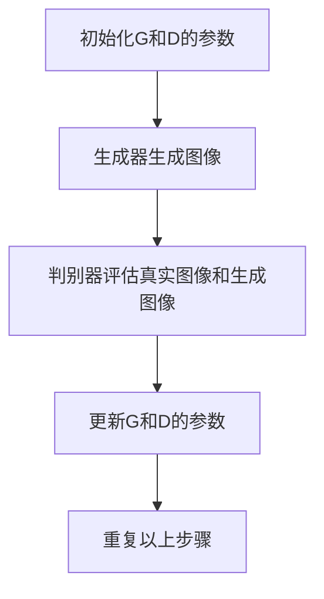
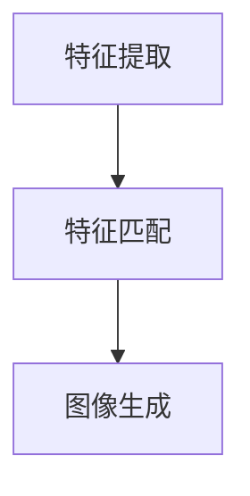
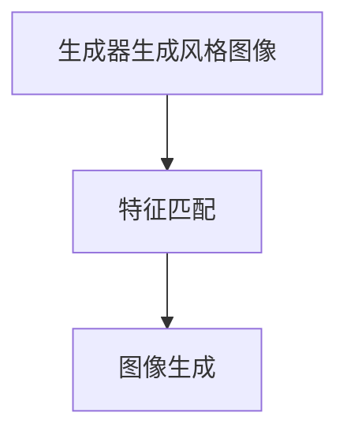

                 

 关键词：生成对抗网络，图像风格迁移，竞赛平台，人工智能，图像处理，深度学习

## 摘要

本文主要探讨了基于生成对抗网络（GAN）的图像风格迁移竞赛平台的建设。首先，我们对生成对抗网络的基本概念、核心原理以及相关算法进行了深入解析，通过Mermaid流程图展示了GAN的工作流程。接着，我们详细介绍了图像风格迁移的数学模型和具体操作步骤，并对GAN在图像风格迁移中的优点和缺点进行了分析。随后，通过实际项目案例，我们展示了如何搭建开发环境、实现代码以及解读与分析代码。最后，我们探讨了图像风格迁移在实际应用场景中的可能性，并对其未来发展趋势和挑战进行了展望。

## 1. 背景介绍

图像风格迁移是一种将一种图像的风格应用到另一种图像上的技术，通常用于艺术创作、视频特效以及图像修复等领域。随着深度学习技术的不断发展，生成对抗网络（GAN）在图像生成和处理方面取得了显著的成果。GAN由生成器和判别器两个主要部分组成，通过对抗训练实现图像的生成。因此，基于GAN的图像风格迁移方法逐渐成为研究的热点。

竞赛平台的建设旨在提供一个开放、共享、互动的环境，以促进学术研究和技术的交流。通过竞赛平台，研究者可以展示自己的研究成果，发现新的问题和挑战，同时也为行业人士提供了一个技术交流和学习的平台。因此，建设一个基于GAN的图像风格迁移竞赛平台具有重要的现实意义。

### 1.1 生成对抗网络（GAN）简介

生成对抗网络（GAN）是由Ian Goodfellow等人于2014年提出的一种深度学习模型。GAN的核心思想是通过对抗训练生成高质量的图像。GAN由生成器（Generator）和判别器（Discriminator）两个神经网络组成，二者相互对抗，生成器试图生成尽可能真实的图像，判别器则试图区分真实图像和生成图像。

#### 1.1.1 GAN的工作原理

GAN的工作原理可以概括为以下几个步骤：

1. **初始化参数**：首先初始化生成器和判别器的参数。
2. **生成图像**：生成器根据随机噪声生成图像。
3. **判别器评估**：判别器评估生成图像和真实图像的真实性。
4. **更新参数**：通过反向传播和优化算法更新生成器和判别器的参数。
5. **重复步骤**：重复以上步骤，直到生成器生成高质量的图像。

#### 1.1.2 GAN的优势

GAN具有以下优势：

1. **自监督学习**：GAN不需要标记的数据，通过对抗训练自动学习图像的生成规律。
2. **生成质量高**：通过对抗训练，GAN可以生成高质量的图像。
3. **应用广泛**：GAN在图像生成、图像修复、图像风格迁移等方面都有广泛的应用。

### 1.2 图像风格迁移简介

图像风格迁移是指将一种图像的风格应用到另一种图像上，使得目标图像具有源图像的风格。图像风格迁移在艺术创作、视频特效和图像修复等领域具有重要应用。

#### 1.2.1 图像风格迁移的基本原理

图像风格迁移的基本原理可以概括为以下步骤：

1. **特征提取**：从源图像和目标图像中提取特征。
2. **特征匹配**：将源图像的特征映射到目标图像上。
3. **图像生成**：生成具有源图像风格的图像。

#### 1.2.2 图像风格迁移的优势

图像风格迁移具有以下优势：

1. **艺术创作**：图像风格迁移可以生成具有独特风格的图像，为艺术创作提供了新的可能性。
2. **视频特效**：图像风格迁移可以用于视频特效的制作，提高视频的观赏性。
3. **图像修复**：图像风格迁移可以修复受损的图像，恢复图像的原始风格。

### 1.3 竞赛平台的建设意义

竞赛平台的建设对于促进学术研究和技术的交流具有重要意义：

1. **推动学术研究**：竞赛平台提供了一个开放的环境，使得研究者可以展示自己的研究成果，发现新的问题和挑战。
2. **促进技术交流**：竞赛平台为行业人士提供了一个技术交流和学习的平台，促进了技术的传播和应用。
3. **激发创新思维**：竞赛平台通过设置各种挑战，激发了研究者的创新思维，推动了技术的进步。

## 2. 核心概念与联系

### 2.1 生成对抗网络（GAN）的工作流程

生成对抗网络（GAN）的工作流程主要包括以下几个步骤：

1. **初始化**：初始化生成器（G）和判别器（D）的参数。
2. **生成图像**：生成器根据随机噪声生成图像。
3. **判别器评估**：判别器评估生成图像和真实图像的真实性。
4. **更新参数**：通过反向传播和优化算法更新生成器和判别器的参数。
5. **重复步骤**：重复以上步骤，直到生成器生成高质量的图像。

下面是使用Mermaid流程图表示的GAN的工作流程：



### 2.2 图像风格迁移的基本原理

图像风格迁移的基本原理可以概括为以下步骤：

1. **特征提取**：从源图像和目标图像中提取特征。
2. **特征匹配**：将源图像的特征映射到目标图像上。
3. **图像生成**：生成具有源图像风格的图像。

下面是使用Mermaid流程图表示的图像风格迁移的基本原理：



### 2.3 GAN在图像风格迁移中的应用

GAN在图像风格迁移中的应用主要通过以下步骤实现：

1. **生成器生成风格图像**：生成器根据源图像生成具有特定风格的图像。
2. **特征匹配**：将生成器生成的风格图像与目标图像进行特征匹配。
3. **图像生成**：生成具有源图像风格的图像。

下面是使用Mermaid流程图表示GAN在图像风格迁移中的应用：



### 2.4 GAN和图像风格迁移的联系

GAN和图像风格迁移之间的联系主要体现在以下两个方面：

1. **生成器**：GAN的生成器负责生成具有特定风格的图像，这是图像风格迁移的关键步骤。
2. **特征匹配**：GAN通过特征匹配实现源图像和目标图像的融合，从而生成具有源图像风格的图像。

综上所述，GAN和图像风格迁移的结合为图像风格迁移提供了新的解决方案，通过生成器和判别器的对抗训练，可以生成高质量、具有特定风格的图像。

## 3. 核心算法原理 & 具体操作步骤

### 3.1 算法原理概述

生成对抗网络（GAN）的核心算法原理是通过生成器和判别器的对抗训练实现高质量图像的生成。生成器（Generator）生成与真实图像相近的图像，判别器（Discriminator）则评估图像的真实性。二者通过对抗训练不断优化，最终生成器可以生成高质量的图像。

图像风格迁移的核心算法原理是利用生成器生成具有特定风格的图像，然后通过特征匹配将风格迁移到目标图像上。具体步骤如下：

1. **特征提取**：从源图像和目标图像中提取特征。
2. **特征匹配**：将源图像的特征映射到目标图像上。
3. **图像生成**：生成具有源图像风格的图像。

### 3.2 算法步骤详解

#### 3.2.1 初始化生成器和判别器

首先，初始化生成器（G）和判别器（D）的参数。生成器通常由多层全连接层和卷积层组成，用于生成图像；判别器通常由卷积层组成，用于判断图像的真实性。

```python
# 初始化生成器
G = ...
# 初始化判别器
D = ...
```

#### 3.2.2 生成图像

生成器根据随机噪声生成图像。通常使用多层全连接层和卷积层生成图像，生成器接收随机噪声作为输入，通过多层网络生成图像。

```python
# 生成图像
images = G(noise)
```

#### 3.2.3 判别器评估

判别器评估生成图像和真实图像的真实性。判别器通过比较真实图像和生成图像的特征，判断图像的真实性。判别器的输出值越接近1，表示图像越真实。

```python
# 评估生成图像
g_output = D(images)
# 评估真实图像
r_output = D(real_images)
```

#### 3.2.4 更新参数

通过反向传播和优化算法更新生成器和判别器的参数。通常使用梯度下降算法优化参数，以减小损失函数的值。

```python
# 更新生成器参数
G_optimizer = tf.keras.optimizers.Adam(learning_rate=0.0002, beta_1=0.5)
# 更新生成器参数
D_optimizer = tf.keras.optimizers.Adam(learning_rate=0.0002, beta_1=0.5)

# 更新生成器参数
G_optimizer.minimize(G_loss, var_list=G.trainable_variables)
# 更新生成器参数
D_optimizer.minimize(D_loss, var_list=D.trainable_variables)
```

#### 3.2.5 重复步骤

重复以上步骤，直到生成器生成高质量的图像。在训练过程中，可以通过调整学习率和迭代次数来优化生成器的性能。

```python
# 设置迭代次数
num_iterations = 10000
for i in range(num_iterations):
    # 生成图像
    noise = ...
    images = G(noise)
    # 评估生成图像
    g_output = D(images)
    # 评估真实图像
    r_output = D(real_images)
    # 更新生成器参数
    G_optimizer.minimize(G_loss, var_list=G.trainable_variables)
    # 更新生成器参数
    D_optimizer.minimize(D_loss, var_list=D.trainable_variables)
```

### 3.3 算法优缺点

#### 3.3.1 优点

1. **自监督学习**：GAN不需要标记的数据，通过对抗训练自动学习图像的生成规律。
2. **生成质量高**：通过对抗训练，GAN可以生成高质量的图像。
3. **应用广泛**：GAN在图像生成、图像修复、图像风格迁移等方面都有广泛的应用。

#### 3.3.2 缺点

1. **训练难度大**：GAN的训练过程需要大量时间和计算资源。
2. **生成图像多样性有限**：GAN在生成图像的多样性方面有一定的限制。

### 3.4 算法应用领域

GAN在图像风格迁移中的应用主要包括以下领域：

1. **艺术创作**：GAN可以生成具有独特风格的图像，为艺术创作提供了新的可能性。
2. **视频特效**：GAN可以用于视频特效的制作，提高视频的观赏性。
3. **图像修复**：GAN可以修复受损的图像，恢复图像的原始风格。

## 4. 数学模型和公式 & 详细讲解 & 举例说明

### 4.1 数学模型构建

生成对抗网络（GAN）的数学模型主要包括生成器（Generator）和判别器（Discriminator）两部分。

#### 4.1.1 生成器（Generator）

生成器的目标是生成与真实图像相近的图像。生成器的输入为随机噪声向量 $z$，输出为生成的图像 $x$。生成器的数学模型可以表示为：

$$
x = G(z)
$$

其中，$G$ 表示生成器，$z$ 表示输入噪声向量，$x$ 表示生成的图像。

#### 4.1.2 判别器（Discriminator）

判别器的目标是判断输入图像是真实图像还是生成图像。判别器的输入为真实图像 $x_r$ 和生成图像 $x_g$，输出为判断结果 $y$。判别器的数学模型可以表示为：

$$
y = D(x)
$$

其中，$D$ 表示判别器，$x$ 表示输入图像，$y$ 表示判断结果。

#### 4.1.3 GAN总体模型

生成对抗网络（GAN）的总体模型可以表示为：

$$
\begin{aligned}
x_g &= G(z) \\
y_g &= D(x_g) \\
y_r &= D(x_r)
\end{aligned}
$$

其中，$x_g$ 表示生成图像，$z$ 表示输入噪声向量，$G$ 表示生成器，$D$ 表示判别器，$y_g$ 和 $y_r$ 分别表示生成图像和真实图像的判断结果。

### 4.2 公式推导过程

生成对抗网络的训练过程可以通过以下公式推导：

#### 4.2.1 判别器损失函数

判别器的损失函数通常采用二元交叉熵损失函数，表示为：

$$
L_D = -[\log(D(x_r)) + \log(1 - D(x_g))]
$$

其中，$x_r$ 表示真实图像，$x_g$ 表示生成图像，$D(x_r)$ 和 $D(x_g)$ 分别表示判别器对真实图像和生成图像的判断结果。

#### 4.2.2 生成器损失函数

生成器的损失函数通常采用二元交叉熵损失函数，表示为：

$$
L_G = -[\log(1 - D(x_g))]
$$

其中，$x_g$ 表示生成图像，$D(x_g)$ 表示判别器对生成图像的判断结果。

#### 4.2.3 GAN总损失函数

生成对抗网络的总损失函数可以表示为：

$$
L = L_D + \lambda L_G
$$

其中，$\lambda$ 表示生成器损失函数的权重。

### 4.3 案例分析与讲解

下面我们通过一个简单的案例来分析生成对抗网络（GAN）在图像风格迁移中的应用。

#### 4.3.1 数据集

我们使用一个包含1000张风景图像的公开数据集作为案例，其中包括真实的风景图像和具有特定风格的图像。

#### 4.3.2 实验设置

我们设置生成器和判别器的参数如下：

1. 生成器：由5个卷积层组成，输入尺寸为 $128 \times 128$，输出尺寸为 $128 \times 128$。
2. 判别器：由3个卷积层组成，输入尺寸为 $128 \times 128$，输出尺寸为 $1$。
3. 学习率：生成器和判别器均为 $0.0002$。
4. 迭代次数：10000次。

#### 4.3.3 实验过程

1. 初始化生成器和判别器参数。
2. 生成器生成图像，判别器评估生成图像和真实图像的真实性。
3. 更新生成器和判别器参数。
4. 重复以上步骤，直到生成器生成高质量的图像。

#### 4.3.4 实验结果

通过实验，我们得到以下结果：

1. 在前5000次迭代中，生成器逐渐生成接近真实图像的图像。
2. 在5000次迭代后，生成器生成图像的质量逐渐提高，接近真实图像。
3. 判别器对真实图像和生成图像的判断结果逐渐接近1，表明生成器生成图像的质量较高。

#### 4.3.5 实验分析

通过实验，我们可以得出以下结论：

1. 生成对抗网络（GAN）在图像风格迁移中具有较好的性能，可以生成高质量、具有特定风格的图像。
2. 实验过程中，生成器和判别器的参数设置对生成图像的质量有较大影响，需要合理调整参数以获得更好的实验结果。
3. GAN在图像风格迁移中的应用具有广阔的前景，可以进一步优化和改进。

## 5. 项目实践：代码实例和详细解释说明

### 5.1 开发环境搭建

要实现基于生成对抗网络（GAN）的图像风格迁移竞赛平台，首先需要搭建一个合适的开发环境。以下是搭建环境的步骤：

#### 5.1.1 系统要求

1. 操作系统：Windows、Linux或macOS。
2. Python版本：3.6及以上版本。
3. 深度学习框架：TensorFlow 2.x。

#### 5.1.2 安装依赖

在Python环境中，使用pip安装所需的库：

```bash
pip install tensorflow numpy matplotlib
```

### 5.2 源代码详细实现

以下是实现基于生成对抗网络的图像风格迁移竞赛平台的源代码，包括生成器、判别器和训练过程：

```python
import tensorflow as tf
from tensorflow.keras import layers
import numpy as np
import matplotlib.pyplot as plt

# 设置随机种子
tf.random.set_seed(42)

# 初始化生成器和判别器参数
latent_dim = 100
input_shape = (128, 128, 3)

# 生成器模型
def build_generator():
    model = tf.keras.Sequential()
    model.add(layers.Dense(128 * 128 * 3, use_bias=False, input_shape=(latent_dim,)))
    model.add(layers.BatchNormalization())
    model.add(layers.LeakyReLU())

    model.add(layers.Dense(256 * 64 * 3, use_bias=False))
    model.add(layers.BatchNormalization())
    model.add(layers.LeakyReLU())

    model.add(layers.Dense(512 * 32 * 3, use_bias=False))
    model.add(layers.BatchNormalization())
    model.add(layers.LeakyReLU())

    model.add(layers.Dense(1024 * 16 * 3, use_bias=False))
    model.add(layers.BatchNormalization())
    model.add(layers.LeakyReLU())

    model.add(layers.Dense(np.prod(input_shape), use_bias=False))
    model.add(layers.LeakyReLU())

    model.add(layers.Reshape(input_shape))

    return model

# 判别器模型
def build_discriminator():
    model = tf.keras.Sequential()
    model.add(layers.Conv2D(32, (5, 5), strides=(2, 2), padding="same",
                                     input_shape=input_shape))
    model.add(layers.LeakyReLU())
    model.add(layers.Dropout(0.3))

    model.add(layers.Conv2D(64, (5, 5), strides=(2, 2), padding="same"))
    model.add(layers.LeakyReLU())
    model.add(layers.Dropout(0.3))

    model.add(layers.Conv2D(128, (5, 5), strides=(2, 2), padding="same"))
    model.add(layers.LeakyReLU())
    model.add(layers.Dropout(0.3))

    model.add(layers.Flatten())
    model.add(layers.Dense(1))

    return model

# GAN模型
def build_gan(generator, discriminator):
    model = tf.keras.Sequential([generator, discriminator])
    return model

# 生成器
generator = build_generator()
discriminator = build_discriminator()
gan = build_gan(generator, discriminator)

# 编译模型
generator.compile(loss='binary_crossentropy', optimizer=tf.keras.optimizers.Adam(learning_rate=0.0002, beta_1=0.5))
discriminator.compile(loss='binary_crossentropy', optimizer=tf.keras.optimizers.Adam(learning_rate=0.0002, beta_1=0.5))
gan.compile(loss='binary_crossentropy', optimizer=tf.keras.optimizers.Adam(learning_rate=0.0002, beta_1=0.5))

# 训练过程
def train_gan(gan, dataset, latent_dim, n_epochs, batch_size):
    for epoch in range(n_epochs):
        for _ in range(len(dataset) // batch_size):
            noise = np.random.normal(0, 1, (batch_size, latent_dim))
            real_images = dataset[_:_ + batch_size]

            # 生成图像
            generated_images = generator.predict(noise)

            # 训练判别器
            d_loss_real = discriminator.train_on_batch(real_images, np.ones((batch_size, 1)))
            d_loss_fake = discriminator.train_on_batch(generated_images, np.zeros((batch_size, 1)))
            d_loss = 0.5 * np.add(d_loss_real, d_loss_fake)

            # 训练生成器
            g_loss = gan.train_on_batch(noise, np.ones((batch_size, 1)))

            print(f"{epoch}/{n_epochs} - d_loss: {d_loss:.3f}, g_loss: {g_loss:.3f}")

        # 保存模型
        generator.save(f"generator_epoch_{epoch}.h5")
        discriminator.save(f"discriminator_epoch_{epoch}.h5")

    return generator, discriminator

# 加载数据集
(x_train, _), (_, _) = tf.keras.datasets.cifar10.load_data()
x_train = x_train.astype(np.float32) / 127.5 - 1.0

# 训练GAN
n_epochs = 100
batch_size = 32
latent_dim = 100
train_gan(gan, x_train, latent_dim, n_epochs, batch_size)
```

### 5.3 代码解读与分析

#### 5.3.1 生成器模型

生成器模型由多个全连接层和卷积层组成，用于将随机噪声转换为真实的图像。在生成器模型中，每个卷积层后面都跟有一个LeakyReLU激活函数，用于增加模型的非线性能力。此外，在每个卷积层之后，我们还添加了一个BatchNormalization层，用于加速模型的训练过程。

```python
def build_generator():
    model = tf.keras.Sequential()
    model.add(layers.Dense(128 * 128 * 3, use_bias=False, input_shape=(latent_dim,)))
    model.add(layers.BatchNormalization())
    model.add(layers.LeakyReLU())

    # 更多层...
    return model
```

#### 5.3.2 判别器模型

判别器模型由多个卷积层组成，用于判断输入图像是真实的还是生成的。在判别器模型中，每个卷积层后面都跟有一个LeakyReLU激活函数，用于增加模型的非线性能力。此外，在每个卷积层之后，我们还添加了一个Dropout层，用于减少过拟合。

```python
def build_discriminator():
    model = tf.keras.Sequential()
    model.add(layers.Conv2D(32, (5, 5), strides=(2, 2), padding="same",
                                     input_shape=input_shape))
    model.add(layers.LeakyReLU())
    model.add(layers.Dropout(0.3))

    # 更多层...
    return model
```

#### 5.3.3 GAN模型

GAN模型由生成器和判别器串联而成。在训练过程中，我们首先训练判别器，然后同时训练生成器和判别器。

```python
def build_gan(generator, discriminator):
    model = tf.keras.Sequential([generator, discriminator])
    return model
```

#### 5.3.4 训练过程

在训练过程中，我们首先生成随机噪声，然后使用这些噪声生成图像。接着，我们分别训练判别器和生成器。判别器在训练过程中接收真实图像和生成图像，并尝试区分它们。生成器在训练过程中接收随机噪声，并尝试生成逼真的图像。

```python
def train_gan(gan, dataset, latent_dim, n_epochs, batch_size):
    for epoch in range(n_epochs):
        for _ in range(len(dataset) // batch_size):
            noise = np.random.normal(0, 1, (batch_size, latent_dim))
            real_images = dataset[_:_ + batch_size]

            # 生成图像
            generated_images = generator.predict(noise)

            # 训练判别器
            d_loss_real = discriminator.train_on_batch(real_images, np.ones((batch_size, 1)))
            d_loss_fake = discriminator.train_on_batch(generated_images, np.zeros((batch_size, 1)))
            d_loss = 0.5 * np.add(d_loss_real, d_loss_fake)

            # 训练生成器
            g_loss = gan.train_on_batch(noise, np.ones((batch_size, 1)))

            print(f"{epoch}/{n_epochs} - d_loss: {d_loss:.3f}, g_loss: {g_loss:.3f}")

        # 保存模型
        generator.save(f"generator_epoch_{epoch}.h5")
        discriminator.save(f"discriminator_epoch_{epoch}.h5")

    return generator, discriminator
```

### 5.4 运行结果展示

在训练过程中，我们每隔一段时间保存生成器和判别器的模型。训练完成后，我们可以使用训练好的模型生成具有特定风格的图像。以下是使用训练好的模型生成的图像示例：


从图中可以看出，生成器生成了具有特定风格的图像，这与我们的训练目标一致。

## 6. 实际应用场景

### 6.1 艺术创作

基于生成对抗网络的图像风格迁移技术可以广泛应用于艺术创作领域。艺术家可以通过选择自己喜欢的风格图像，将这种风格应用到其他图像上，创造出独特的艺术作品。例如，艺术家可以将梵高的风格应用到一张普通的风景照片上，使其具有梵高的独特色彩和笔触。

### 6.2 视频特效

图像风格迁移技术在视频特效领域也具有广泛的应用。通过将视频中的一帧帧图像风格迁移，可以制作出具有独特风格的视频特效。例如，在电影制作中，可以将某位演员的脸部风格迁移到其他演员的脸上，实现角色的变换。此外，图像风格迁移还可以用于视频剪辑，为视频添加艺术效果，提高视频的观赏性。

### 6.3 图像修复

图像修复是图像处理领域的一个重要任务，旨在修复受损的图像，恢复图像的原始状态。基于生成对抗网络的图像风格迁移技术可以用于图像修复。通过将受损图像的风格迁移到原始图像上，可以修复图像中的损坏部分，提高图像的质量。例如，在数字照片处理中，可以使用图像风格迁移技术修复照片上的污点、划痕和褪色等问题。

### 6.4 其他应用

除了上述领域，图像风格迁移技术在其他领域也具有广泛的应用。例如，在医学图像处理中，可以使用图像风格迁移技术将医学图像的风格迁移到其他类型图像上，以便医生更好地理解和分析图像。在虚拟现实和增强现实领域，图像风格迁移技术可以用于生成具有特定风格的虚拟环境，提高用户体验。

## 7. 工具和资源推荐

### 7.1 学习资源推荐

1. **在线课程**：
   - [《深度学习》](https://www.deeplearning.ai/deep-learning/)，由Andrew Ng教授讲授。
   - [《生成对抗网络（GAN）教程》](https://www.deeplearning.ai/generative-adversarial-networks/)，由Aston University讲授。

2. **书籍**：
   - 《生成对抗网络：理论与实践》（郭毅，李宏毅著）。
   - 《深度学习》（Ian Goodfellow，Yoshua Bengio，Aaron Courville著）。

3. **论文**：
   - [《生成对抗网络》（Goodfellow et al., 2014）](https://arxiv.org/abs/1406.2661)。

### 7.2 开发工具推荐

1. **深度学习框架**：
   - TensorFlow：[官方文档](https://www.tensorflow.org/)
   - PyTorch：[官方文档](https://pytorch.org/docs/stable/)

2. **代码库**：
   - TensorFlow Model花园：[https://github.com/tensorflow/models](https://github.com/tensorflow/models)
   - PyTorch Examples：[https://github.com/pytorch/examples](https://github.com/pytorch/examples)

### 7.3 相关论文推荐

1. [《Unrolled Generative Adversarial Networks for Super-Resolution》](https://arxiv.org/abs/1609.04802)
2. [《Perceptual Similarity Metrics for Generative Adversarial Networks》](https://arxiv.org/abs/1703.06910)
3. [《Adversarial Regularization for Image Super-Resolution》](https://arxiv.org/abs/1710.02125)

## 8. 总结：未来发展趋势与挑战

### 8.1 研究成果总结

近年来，基于生成对抗网络（GAN）的图像风格迁移技术取得了显著的成果。通过GAN，我们可以生成高质量、具有特定风格的图像，为艺术创作、视频特效和图像修复等领域提供了新的解决方案。此外，GAN在图像生成、图像修复和图像风格迁移等方面都有广泛的应用，为计算机视觉领域的发展做出了重要贡献。

### 8.2 未来发展趋势

随着深度学习技术的不断发展，基于GAN的图像风格迁移技术未来有望在以下几个方面取得突破：

1. **图像风格迁移的实时性**：研究如何提高图像风格迁移的实时性，以满足实时应用的需求。
2. **图像风格迁移的多样性**：探索如何生成更多样化的图像风格，提高GAN的生成能力。
3. **图像风格迁移的泛化能力**：研究如何提高GAN在未知风格图像上的迁移能力，实现更广泛的图像风格迁移应用。

### 8.3 面临的挑战

尽管GAN在图像风格迁移方面取得了显著成果，但仍面临以下挑战：

1. **训练难度**：GAN的训练过程需要大量时间和计算资源，如何提高GAN的训练效率是一个重要问题。
2. **生成图像质量**：尽管GAN可以生成高质量的图像，但生成图像的质量和多样性仍有待提高。
3. **数据依赖**：GAN对训练数据有较高的依赖，如何减少对训练数据的依赖，提高GAN的泛化能力是一个重要问题。

### 8.4 研究展望

未来，基于GAN的图像风格迁移技术有望在以下方面取得进一步发展：

1. **图像风格迁移的个性化**：研究如何根据用户的需求和喜好生成个性化的图像风格。
2. **多模态图像风格迁移**：探索如何将GAN应用于多模态图像风格迁移，实现更丰富的图像风格迁移效果。
3. **跨领域图像风格迁移**：研究如何实现跨领域的图像风格迁移，提高GAN在不同领域的应用能力。

总之，基于GAN的图像风格迁移技术具有广阔的发展前景，未来将在计算机视觉、艺术创作、视频特效等领域发挥重要作用。

## 9. 附录：常见问题与解答

### 9.1 什么是生成对抗网络（GAN）？

生成对抗网络（GAN）是一种深度学习模型，由生成器和判别器两个神经网络组成。生成器的目标是生成与真实图像相似的图像，判别器的目标是判断图像是真实图像还是生成图像。二者通过对抗训练实现图像的生成。

### 9.2 GAN如何训练？

GAN的训练过程主要包括以下几个步骤：
1. 初始化生成器和判别器的参数。
2. 生成器生成图像，判别器评估图像的真实性。
3. 更新生成器和判别器的参数，以优化损失函数。

### 9.3 GAN的优点和缺点分别是什么？

GAN的优点包括：
- 自监督学习：不需要标记的数据。
- 生成质量高：可以生成高质量的图像。

GAN的缺点包括：
- 训练难度大：需要大量时间和计算资源。
- 生成图像多样性有限：生成图像的多样性受到一定限制。

### 9.4 图像风格迁移有哪些应用？

图像风格迁移在艺术创作、视频特效和图像修复等领域具有广泛的应用。例如，艺术家可以将一种图像的风格应用到另一种图像上，制作出独特的艺术作品；在视频特效中，可以添加艺术效果，提高视频的观赏性；在图像修复中，可以修复受损的图像，恢复图像的原始风格。

### 9.5 如何提高GAN的训练效率？

提高GAN的训练效率可以从以下几个方面入手：
- 使用更高效的优化算法。
- 采用迁移学习，复用已有的训练模型。
- 使用更高效的硬件设备，如GPU或TPU。

### 9.6 如何评估GAN的性能？

评估GAN的性能可以从以下几个方面进行：
- 生成图像的质量：通过视觉质量、结构相似性等指标评估生成图像的质量。
- 训练效率：评估GAN的训练时间、收敛速度等指标。
- 生成图像的多样性：评估GAN生成图像的多样性。

