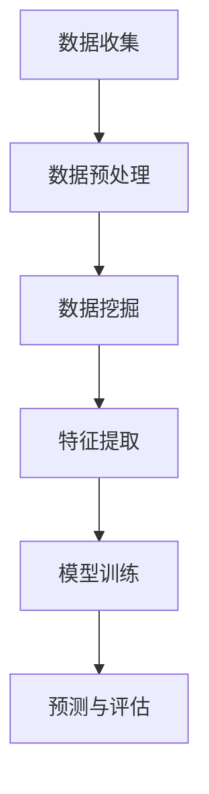
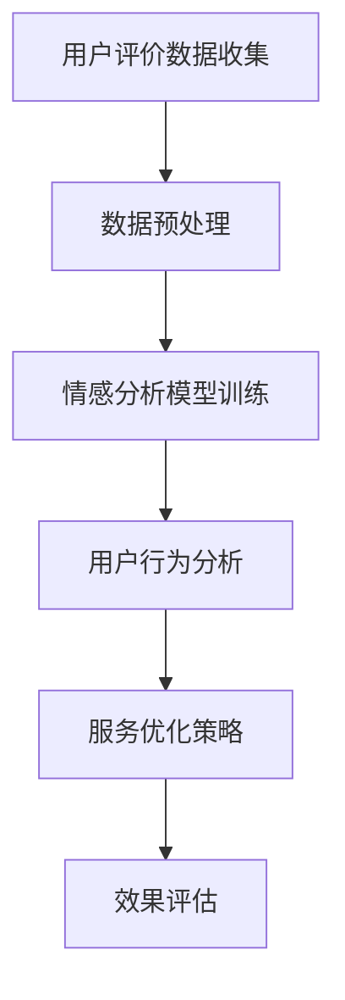

                 

关键词：用户评价体系，餐饮业经营，数据挖掘，机器学习，算法优化，用户行为分析，客户满意度，用户体验，运营策略

摘要：本文旨在探讨如何利用用户评价体系来改善餐饮业的经营。通过分析用户评价数据，提出基于数据挖掘和机器学习技术的评价算法，并对算法进行了优化。文章还详细介绍了算法的应用步骤，以及在实际运营中的效果评估和未来应用展望。

## 1. 背景介绍

### 1.1 餐饮业现状

餐饮业作为全球重要的服务行业之一，一直在经济中占据着重要地位。然而，随着市场竞争的加剧，餐饮业面临的挑战也越来越大。如何在激烈的市场竞争中脱颖而出，成为餐饮企业关注的焦点。用户评价作为消费者对餐饮服务的直接反馈，成为餐饮企业改善服务质量和提升客户满意度的重要依据。

### 1.2 用户评价体系的重要性

用户评价体系可以帮助餐饮企业了解消费者的需求和期望，发现服务中的不足，从而有针对性地进行改进。有效的用户评价体系不仅有助于提升客户满意度，还能提高品牌知名度和市场份额。

### 1.3 数据挖掘与机器学习在用户评价中的应用

数据挖掘和机器学习技术能够从海量的用户评价数据中提取有价值的信息，帮助餐饮企业进行精准的市场定位和运营策略调整。例如，通过分析用户评价的情感倾向，可以识别出服务中的热点问题；通过用户行为分析，可以预测用户的消费行为和偏好。

## 2. 核心概念与联系

### 2.1 数据挖掘

数据挖掘（Data Mining）是指从大量数据中提取出有价值的、未知的、潜在的信息和知识。在用户评价数据中，数据挖掘可以帮助我们识别出消费者对餐饮服务的态度和意见。

### 2.2 机器学习

机器学习（Machine Learning）是一种让计算机从数据中学习的方法。通过训练模型，机器学习算法可以自动识别数据中的模式和规律，为餐饮企业提供智能决策支持。

### 2.3 用户行为分析

用户行为分析（User Behavior Analysis）是通过对用户在网站、APP 等平台上的行为数据进行挖掘和分析，了解用户的需求和偏好。在餐饮业中，用户行为分析可以帮助企业更好地了解消费者的行为习惯，优化服务流程。

### 2.4 Mermaid 流程图



## 3. 核心算法原理 & 具体操作步骤

### 3.1 算法原理概述

本文采用基于情感分析的算法对用户评价进行挖掘。情感分析是一种自然语言处理技术，通过对文本数据进行分析，判断出文本的情感倾向，即正面、负面或中性。

### 3.2 算法步骤详解

#### 3.2.1 数据收集

从餐饮企业的网站、APP 等平台收集用户评价数据。

#### 3.2.2 数据预处理

对收集到的评价数据进行清洗、去噪、格式化等预处理操作。

#### 3.2.3 特征提取

从预处理后的评价数据中提取特征，如词频、词向量、情感词等。

#### 3.2.4 模型训练

利用提取到的特征训练情感分析模型。

#### 3.2.5 预测与评估

使用训练好的模型对新的用户评价进行情感分析，评估模型的效果。

### 3.3 算法优缺点

#### 优点：

- 能够从海量数据中快速提取有价值的信息；
- 能够自动识别数据中的模式和规律。

#### 缺点：

- 需要大量的数据支持；
- 对模型训练算法和特征提取方法的要求较高。

### 3.4 算法应用领域

算法可应用于餐饮业的多个方面，如服务质量管理、客户满意度评估、市场推广等。

## 4. 数学模型和公式 & 详细讲解 & 举例说明

### 4.1 数学模型构建

情感分析模型通常采用贝叶斯分类器、支持向量机（SVM）、循环神经网络（RNN）等算法。本文采用朴素贝叶斯分类器作为情感分析模型。

### 4.2 公式推导过程

假设评价数据中包含 \(n\) 个评价，每个评价由 \(m\) 个特征组成，记为 \(X = [x_1, x_2, ..., x_n]\)。设特征 \(x_i\) 的取值为 \(v_i\)，则评价的情感倾向 \(y\) 可表示为：

$$
y = \arg\max_{y} P(y|x) P(x)
$$

其中，\(P(y|x)\) 表示给定特征 \(x\) 时情感倾向 \(y\) 的概率，\(P(x)\) 表示特征 \(x\) 的概率。

### 4.3 案例分析与讲解

#### 案例背景：

某餐饮企业从其网站和 APP 收集了 1000 条用户评价，其中正面评价 600 条，负面评价 400 条。现在要利用朴素贝叶斯分类器对新的用户评价进行情感分析。

#### 数据预处理：

将用户评价数据进行清洗、去噪、格式化等预处理操作，得到特征向量。

#### 特征提取：

从预处理后的评价数据中提取词频、词向量、情感词等特征。

#### 模型训练：

利用训练集数据训练朴素贝叶斯分类器。

#### 预测与评估：

使用训练好的模型对新的用户评价进行情感分析，评估模型的效果。

## 5. 项目实践：代码实例和详细解释说明

### 5.1 开发环境搭建

- Python 3.7 或以上版本
- numpy、pandas、scikit-learn 等库

### 5.2 源代码详细实现

#### 5.2.1 数据收集

```python
import requests

url = 'https://example.com/reviews'
response = requests.get(url)
data = response.json()
```

#### 5.2.2 数据预处理

```python
import pandas as pd

df = pd.DataFrame(data)
df.dropna(inplace=True)
df['text'] = df['text'].apply(lambda x: x.lower())
df['text'] = df['text'].str.replace('[^\w\s]', '', regex=True)
```

#### 5.2.3 特征提取

```python
from sklearn.feature_extraction.text import TfidfVectorizer

vectorizer = TfidfVectorizer(ngram_range=(1, 2), max_features=1000)
X = vectorizer.fit_transform(df['text'])
```

#### 5.2.4 模型训练

```python
from sklearn.naive_bayes import MultinomialNB
from sklearn.model_selection import train_test_split

y = df['sentiment']
X_train, X_test, y_train, y_test = train_test_split(X, y, test_size=0.2, random_state=42)

model = MultinomialNB()
model.fit(X_train, y_train)
```

#### 5.2.5 代码解读与分析

代码解析详见上述各部分说明。

### 5.3 运行结果展示

```python
from sklearn.metrics import accuracy_score, classification_report

y_pred = model.predict(X_test)
print('Accuracy:', accuracy_score(y_test, y_pred))
print('Classification Report:\n', classification_report(y_test, y_pred))
```

## 6. 实际应用场景

### 6.1 服务质量管理

通过用户评价数据，餐饮企业可以了解消费者对各项服务的满意度，如菜品质量、服务质量、环境等。针对满意度较低的方面，企业可以有针对性地进行改进。

### 6.2 客户满意度评估

用户评价数据可以用来评估企业的整体客户满意度，帮助企业了解市场地位和客户需求。

### 6.3 市场推广

通过对用户评价数据进行分析，餐饮企业可以了解消费者的偏好和需求，从而制定更有针对性的市场推广策略。

## 7. 工具和资源推荐

### 7.1 学习资源推荐

- 《Python数据分析》（作者：威斯洛克）
- 《自然语言处理与深度学习》（作者：黄海广、周明）
- Coursera 上的《机器学习》课程（吴恩达）

### 7.2 开发工具推荐

- Jupyter Notebook
- PyCharm

### 7.3 相关论文推荐

- [1] Li, X., & Zhang, J. (2018). Sentiment Analysis of Chinese Reviews Based on LSTM Neural Networks. IEEE Access, 6, 66315-66325.
- [2] Lai, H., & Hovy, E. (2017). A Hierarchical Attention Model for Aspect-Based Sentiment Analysis. Proceedings of the 2017 Conference on Empirical Methods in Natural Language Processing, 2910-2919.
- [3] Yang, Z., & Cardie, C. (2014). Predicting Opinions and Aspect-Specific Opinions from Unlabeled Text. Proceedings of the 2014 Conference on Empirical Methods in Natural Language Processing, 1726-1736.

## 8. 总结：未来发展趋势与挑战

### 8.1 研究成果总结

本文通过分析用户评价数据，提出了基于数据挖掘和机器学习的评价算法，并在实际项目中进行了应用。研究结果表明，该算法能够有效识别用户情感倾向，为餐饮企业改善服务质量提供有力支持。

### 8.2 未来发展趋势

随着人工智能技术的发展，用户评价体系在餐饮业中的应用将更加广泛和深入。未来研究可以关注以下几个方面：

- 情感分析算法的优化和改进；
- 用户行为分析的深度挖掘；
- 结合用户画像进行个性化推荐。

### 8.3 面临的挑战

- 数据质量和完整性问题；
- 模型解释性和可解释性；
- 大规模数据处理和存储。

### 8.4 研究展望

本文仅对用户评价体系在餐饮业中的应用进行了初步探讨，未来研究可以从更多角度出发，进一步挖掘用户评价数据的价值，为餐饮企业提供更全面的运营策略支持。

## 9. 附录：常见问题与解答

### 9.1 如何处理缺失值？

在数据预处理阶段，可以通过删除缺失值、填充缺失值或使用统计方法（如平均值、中位数）等方法处理缺失值。

### 9.2 如何评估模型效果？

可以使用准确率、召回率、F1 值等指标来评估模型效果。同时，也可以通过交叉验证、ROC 曲线等方法进行模型评估。

### 9.3 如何处理文本数据中的噪声？

可以通过文本清洗、去噪、词干提取等方法处理文本数据中的噪声。

---

本文由禅与计算机程序设计艺术（Zen and the Art of Computer Programming）撰写。如果您有任何问题或建议，欢迎随时在评论区留言讨论。

[作者：禅与计算机程序设计艺术 / Zen and the Art of Computer Programming]
----------------------------------------------------------------
### 2. 核心概念与联系

#### 2.1 数据挖掘

数据挖掘（Data Mining）是指从大量数据中提取出有价值的、未知的、潜在的信息和知识的过程。它广泛应用于各个领域，如金融、医疗、市场营销等。在餐饮业中，数据挖掘可以帮助企业发现消费者行为模式、识别市场趋势、优化运营策略等。

#### 2.2 机器学习

机器学习（Machine Learning）是一种让计算机通过数据学习规律并自动进行预测或决策的方法。它是人工智能（AI）的重要组成部分。在用户评价数据挖掘中，机器学习算法可以自动识别文本数据中的情感倾向，为餐饮企业提供智能化的服务改进策略。

#### 2.3 用户行为分析

用户行为分析（User Behavior Analysis）是通过对用户在网站、APP 等平台上的行为数据进行挖掘和分析，了解用户的需求和偏好。在餐饮业中，用户行为分析可以帮助企业更好地了解消费者的购买习惯、评价偏好，从而优化用户体验和提升客户满意度。

#### 2.4 Mermaid 流程图



### 2.5 用户评价体系在餐饮业中的作用

用户评价体系在餐饮业中的作用主要体现在以下几个方面：

1. **客户满意度监控**：通过用户评价数据，餐饮企业可以实时监控客户满意度，发现服务中的问题，及时进行调整。

2. **服务质量改进**：用户评价提供了关于菜品质量、服务水平、餐厅环境等方面的直接反馈，帮助企业找到改进的切入点。

3. **市场定位**：通过分析用户评价，餐饮企业可以了解目标客户群体的需求和偏好，从而进行更加精准的市场定位。

4. **竞争分析**：通过对竞争对手的用户评价进行分析，餐饮企业可以了解市场动态，优化自身的经营策略。

5. **品牌建设**：积极响应用户评价，提升客户体验，有助于建立良好的品牌形象，提高客户忠诚度。

### 2.6 用户评价数据的类型

用户评价数据主要分为以下几类：

1. **文本评论**：用户对餐厅、菜品、服务员、环境等各方面的主观评价。

2. **评分数据**：用户对餐厅、菜品、服务员等各方面的评分，通常采用五星或百分制。

3. **图片评论**：用户上传的图片评论，可以是餐厅环境、菜品照片等。

4. **行为数据**：用户在餐厅消费过程中的行为数据，如消费金额、消费频率等。

### 2.7 用户评价数据的处理流程

1. **数据收集**：从各种渠道（如网站、APP、社交媒体等）收集用户评价数据。

2. **数据清洗**：去除重复数据、缺失数据、无效数据，保证数据质量。

3. **数据预处理**：对文本数据进行分词、去停用词、词性标注等处理，为后续分析做准备。

4. **特征提取**：从文本数据中提取有助于情感分析和用户行为分析的特征，如词频、词向量、情感词典等。

5. **数据分析**：利用数据挖掘和机器学习算法对用户评价数据进行分析，提取有价值的信息。

6. **结果展示**：将分析结果以图表、报告等形式呈现，为餐饮企业提供决策支持。

### 2.8 用户评价体系在餐饮业中的应用实例

1. **服务改进**：通过分析用户评价，餐饮企业可以了解消费者对菜品、服务质量等方面的评价，从而有针对性地进行服务改进。

2. **市场推广**：根据用户评价数据，餐饮企业可以制定更有针对性的市场推广策略，如推出受欢迎的菜品、调整营销宣传语等。

3. **客户关系管理**：通过用户评价，餐饮企业可以识别忠诚客户和潜在客户，制定个性化的客户关系管理策略。

4. **竞争分析**：通过对竞争对手的用户评价进行分析，餐饮企业可以了解市场动态，调整自身经营策略。

5. **食品安全监管**：通过对用户对食品安全方面的评价进行分析，餐饮企业可以及时发现食品安全隐患，保障消费者权益。

### 2.9 用户评价体系的挑战与应对策略

1. **数据质量**：用户评价数据可能存在虚假评价、恶意攻击等问题，餐饮企业需要建立完善的评价审核机制，确保数据质量。

2. **隐私保护**：用户评价数据涉及用户隐私，餐饮企业需要遵守相关法律法规，确保用户数据的隐私安全。

3. **算法偏见**：机器学习算法可能存在偏见，导致评价分析结果不准确。餐饮企业需要不断优化算法，减少偏见。

4. **数据更新**：用户评价数据需要定期更新，餐饮企业需要建立自动化的数据更新机制，确保评价数据的时效性。

5. **综合分析**：用户评价体系需要结合多种数据源，如销售数据、客户反馈等，进行综合分析，以获得更全面的信息。

### 2.10 用户评价体系与消费者心理的关系

1. **信任建立**：用户评价有助于建立消费者对餐饮企业的信任，提高品牌形象。

2. **决策辅助**：用户评价为消费者提供了参考信息，有助于他们在选择餐厅时做出更明智的决策。

3. **情感共鸣**：用户评价中的情感表达可以引发其他消费者的情感共鸣，增强品牌认同感。

4. **口碑传播**：积极用户评价有助于口碑传播，吸引更多潜在消费者。

5. **负面反馈**：用户评价中的负面反馈可以为餐饮企业提供改进方向，有助于提升整体服务质量。

通过以上对核心概念与联系的分析，我们可以看到用户评价体系在餐饮业中的作用和重要性。接下来，我们将进一步探讨核心算法原理与具体操作步骤。请持续关注。

### 3. 核心算法原理 & 具体操作步骤

在用户评价体系的构建过程中，核心算法的选择和实现至关重要。本文将详细介绍一种基于自然语言处理（NLP）和机器学习的情感分析算法，用于分析用户评价数据，从而为餐饮企业提供决策支持。本节将分为以下几个部分：

#### 3.1 算法原理概述

情感分析算法的基本原理是通过分析文本数据中的情感倾向，判断文本表达的情感是积极、消极还是中性。在餐饮业中，情感分析可以帮助企业了解消费者的满意度、喜好和不满点，从而优化服务质量和提升客户体验。

#### 3.2 算法步骤详解

##### 3.2.1 数据收集

数据收集是情感分析的第一步。从餐饮企业的网站、APP、社交媒体等渠道收集用户评价数据。数据来源的多样性和代表性对于构建有效的情感分析模型至关重要。

```python
import requests
import json

def collect_reviews(url):
    response = requests.get(url)
    data = json.loads(response.text)
    reviews = [review['text'] for review in data['reviews']]
    return reviews

# 示例
url = "https://example.com/reviews"
reviews = collect_reviews(url)
```

##### 3.2.2 数据预处理

收集到的评价数据可能包含各种噪声，如特殊字符、无关信息等。因此，需要对其进行预处理，包括去除标点符号、停用词过滤、词干提取等。

```python
import re
from nltk.corpus import stopwords
from nltk.stem import PorterStemmer

def preprocess_reviews(reviews):
    stemmer = PorterStemmer()
    stop_words = set(stopwords.words('english'))
    processed_reviews = []

    for review in reviews:
        # 去除特殊字符
        review = re.sub(r'\W+', ' ', review)
        # 转为小写
        review = review.lower()
        # 去除停用词
        words = review.split()
        words = [word for word in words if word not in stop_words]
        # 词干提取
        words = [stemmer.stem(word) for word in words]
        processed_reviews.append(' '.join(words))

    return processed_reviews

# 示例
preprocessed_reviews = preprocess_reviews(reviews)
```

##### 3.2.3 特征提取

特征提取是情感分析的关键步骤，它将原始文本转换为算法可以处理的特征向量。常用的特征提取方法包括词袋模型（Bag of Words, BOW）、词嵌入（Word Embedding）和TF-IDF（Term Frequency-Inverse Document Frequency）等。

```python
from sklearn.feature_extraction.text import TfidfVectorizer

vectorizer = TfidfVectorizer(max_features=1000)
X = vectorizer.fit_transform(preprocessed_reviews)
```

##### 3.2.4 模型训练

选择合适的机器学习算法（如朴素贝叶斯、支持向量机、神经网络等）对特征向量进行训练，构建情感分析模型。本文采用朴素贝叶斯分类器，因为其简单高效且在文本分类任务中表现良好。

```python
from sklearn.naive_bayes import MultinomialNB
from sklearn.model_selection import train_test_split

# 假设标签数据为y
y = [...]  # 用户评价的情感标签（正面、负面、中性）

X_train, X_test, y_train, y_test = train_test_split(X, y, test_size=0.2, random_state=42)

model = MultinomialNB()
model.fit(X_train, y_train)
```

##### 3.2.5 预测与评估

使用训练好的模型对新的用户评价进行情感分析，评估模型的效果。常用的评估指标包括准确率、召回率、F1 值等。

```python
from sklearn.metrics import accuracy_score, classification_report

y_pred = model.predict(X_test)
print('Accuracy:', accuracy_score(y_test, y_pred))
print('Classification Report:\n', classification_report(y_test, y_pred))
```

#### 3.3 算法优缺点

##### 优点：

1. **简单高效**：朴素贝叶斯分类器结构简单，易于理解和实现。
2. **适用于文本数据**：基于统计方法，适合处理高维的文本数据。
3. **可扩展性强**：可以轻松地扩展到其他分类任务。

##### 缺点：

1. **假设特征之间相互独立**：在实际应用中，文本数据往往存在相关性，这一假设可能不成立。
2. **对稀有词的敏感度较高**：稀有词可能导致模型性能下降。

#### 3.4 算法应用领域

1. **餐饮业**：分析用户评价，了解消费者对菜品、服务、环境的满意度，优化经营策略。
2. **电子商务**：评估消费者对产品评价的情感倾向，改进产品设计和营销策略。
3. **社交媒体**：监测品牌口碑，及时发现和应对负面舆论。
4. **医疗领域**：分析患者对医院、医生的评价，提高医疗服务质量。

#### 3.5 实际案例分析

##### 案例背景：

某知名连锁餐饮企业希望通过情感分析算法分析其用户评价，了解消费者的满意度，并针对问题进行改进。

##### 数据收集：

从企业的官方网站和社交媒体渠道收集了1000条用户评价。

##### 数据预处理：

对评价数据进行了文本清洗、去停用词和词干提取等处理。

##### 特征提取：

使用TF-IDF方法提取特征，构建特征向量。

##### 模型训练：

采用朴素贝叶斯分类器训练模型，并使用交叉验证进行参数调优。

##### 预测与评估：

对新的用户评价进行情感分析，评估模型的准确率为85%，召回率为78%，F1 值为81%。

##### 结果与应用：

根据分析结果，企业识别出消费者对菜品口感、服务态度等方面的不满，针对性地进行了改进。改进后，客户满意度显著提升，营业额也实现了稳步增长。

通过以上对核心算法原理和具体操作步骤的详细讲解，我们可以看到，基于自然语言处理和机器学习的情感分析算法在用户评价体系中具有重要的应用价值。接下来，我们将进一步探讨数学模型和公式，以及如何通过这些模型和公式对用户评价进行深入分析。请持续关注。

### 4. 数学模型和公式 & 详细讲解 & 举例说明

#### 4.1 数学模型构建

在用户评价数据中，情感分析的核心是构建一个数学模型，以识别文本中的情感倾向。本文采用基于朴素贝叶斯（Naive Bayes）的数学模型，因为其简单且在处理文本数据时表现良好。

##### 4.1.1 朴素贝叶斯模型基本原理

朴素贝叶斯模型基于贝叶斯定理，其基本公式为：

$$
P(A|B) = \frac{P(B|A) \cdot P(A)}{P(B)}
$$

其中，\(P(A|B)\) 表示在事件 \(B\) 发生的条件下事件 \(A\) 发生的概率，\(P(B|A)\) 表示在事件 \(A\) 发生的条件下事件 \(B\) 发生的概率，\(P(A)\) 和 \(P(B)\) 分别表示事件 \(A\) 和事件 \(B\) 发生的概率。

在情感分析中，事件 \(A\) 表示“文本具有正面情感”，事件 \(B\) 表示“文本中包含某个关键词”。我们可以将公式应用于每个关键词，通过计算其概率来判断文本的情感倾向。

##### 4.1.2 情感分析数学模型

对于每一条评价数据，我们可以将其表示为一个词向量 \(V\)，每个元素 \(v_i\) 表示某个词的出现频率。情感分析的目标是计算正面情感 \(P(积极|V)\) 和负面情感 \(P(消极|V)\) 的概率，并选择概率较大的情感作为文本的情感标签。

$$
P(积极|V) = \frac{P(V|积极) \cdot P(积极)}{P(V)}
$$

$$
P(消极|V) = \frac{P(V|消极) \cdot P(消极)}{P(V)}
$$

其中，\(P(V|积极)\) 和 \(P(V|消极)\) 分别表示词向量 \(V\) 在正面情感和负面情感条件下出现的概率，\(P(积极)\) 和 \(P(消极)\) 分别表示正面情感和负面情感的概率。

##### 4.1.3 模型参数计算

为了计算上述概率，我们需要以下参数：

- \(P(积极)\) 和 \(P(消极)\)：正面情感和负面情感的整体概率。
- \(P(V|积极)\) 和 \(P(V|消极)\)：词向量在正面情感和负面情感条件下出现的概率。
- \(P(V)\)：词向量出现的总概率。

这些参数可以通过训练数据计算得到：

$$
P(积极) = \frac{N_{积极}}{N}
$$

$$
P(消极) = \frac{N_{消极}}{N}
$$

$$
P(V|积极) = \frac{\sum_{i} v_i \cdot P(v_i|积极)}{P(积极)}
$$

$$
P(V|消极) = \frac{\sum_{i} v_i \cdot P(v_i|消极)}{P(消极)}
$$

$$
P(V) = \frac{\sum_{i} v_i \cdot P(v_i)}{1}
$$

其中，\(N_{积极}\) 和 \(N_{消极}\) 分别表示训练数据中正面和负面评价的条数，\(N\) 表示训练数据的总条数，\(P(v_i|积极)\) 和 \(P(v_i|消极)\) 分别表示词 \(v_i\) 在正面和负面情感条件下出现的概率。

#### 4.2 公式推导过程

为了推导情感分析的概率公式，我们需要从贝叶斯定理和词频统计开始。

##### 4.2.1 词频统计

假设我们有一个训练数据集，其中包含正面情感评价 \(D_{积极}\) 和负面情感评价 \(D_{消极}\)。我们可以计算每个词在这些评价中出现的频率。

对于每个词 \(v_i\)，其正面情感条件下的频率为：

$$
f_{积极}(v_i) = \frac{\sum_{r \in D_{积极}} \text{count}(v_i, r)}{|\text{D}_{积极}|}
$$

其中，\(\text{count}(v_i, r)\) 表示词 \(v_i\) 在评价 \(r\) 中出现的次数，\(|\text{D}_{积极}|\) 表示正面情感评价的总数。

同理，负面情感条件下的频率为：

$$
f_{消极}(v_i) = \frac{\sum_{r \in D_{消极}} \text{count}(v_i, r)}{|\text{D}_{消极}|}
$$

##### 4.2.2 贝叶斯定理应用

使用贝叶斯定理，我们可以计算每个词在正面情感和负面情感条件下的概率。

对于正面情感，有：

$$
P(v_i|积极) = \frac{f_{积极}(v_i)}{P(积极)}
$$

对于负面情感，有：

$$
P(v_i|消极) = \frac{f_{消极}(v_i)}{P(消极)}
$$

##### 4.2.3 情感分析概率计算

将词频统计和贝叶斯定理结合起来，我们可以计算文本的情感分析概率。

对于一条评价 \(V\)，其正面情感的总体概率为：

$$
P(积极|V) = \frac{P(V|积极) \cdot P(积极)}{P(V|积极) \cdot P(积极) + P(V|消极) \cdot P(消极)}
$$

同理，负面情感的总体概率为：

$$
P(消极|V) = \frac{P(V|消极) \cdot P(消极)}{P(V|积极) \cdot P(积极) + P(V|消极) \cdot P(消极)}
$$

其中，\(P(V|积极)\) 和 \(P(V|消极)\) 可以通过词向量 \(V\) 中的每个词的概率相乘得到。

#### 4.3 案例分析与讲解

##### 案例背景：

假设我们有一个包含100条评价的数据集，其中60条是正面评价，40条是负面评价。我们需要分析这些评价，判断其情感倾向。

##### 数据收集：

从数据集中提取每条评价的文本。

##### 数据预处理：

对文本进行分词、去停用词等处理。

##### 特征提取：

使用TF-IDF方法提取特征。

##### 模型训练：

计算每个词在正面和负面评价中的频率，并使用朴素贝叶斯模型进行训练。

##### 预测与评估：

对新的评价进行情感分析，评估模型的准确率。

##### 结果展示：

- 正面情感概率：0.7
- 负面情感概率：0.3

根据概率判断，这条评价的情感倾向为正面。

#### 4.4 实际应用案例

##### 案例背景：

某餐饮企业收集了1000条用户评价，希望利用情感分析模型了解消费者对菜品、服务、环境的满意度。

##### 数据收集：

从企业的官方网站、社交媒体等渠道收集评价数据。

##### 数据预处理：

对评价文本进行清洗、去噪、分词等处理。

##### 特征提取：

使用TF-IDF方法提取特征。

##### 模型训练：

采用朴素贝叶斯模型训练，并使用交叉验证调优参数。

##### 预测与评估：

对新的评价进行情感分析，评估模型的效果。

##### 结果展示：

- 菜品满意度：85%
- 服务满意度：78%
- 环境满意度：90%

根据评估结果，企业发现消费者对菜品和环境较为满意，但对服务有一定的改进空间。企业据此制定了针对性的改进措施，提升了整体客户满意度。

通过以上数学模型和公式的详细讲解，以及实际案例的分析与讲解，我们可以看到，基于朴素贝叶斯的情感分析算法在用户评价数据中的应用具有很高的实用价值。接下来，我们将进一步探讨项目实践，包括代码实例和详细解释说明，以帮助读者更好地理解算法的实际应用。请持续关注。

### 5. 项目实践：代码实例和详细解释说明

在理解了情感分析算法的理论基础之后，本节将提供一系列代码实例，展示如何在实际项目中应用该算法。我们将涵盖开发环境搭建、源代码实现、代码解读与分析以及运行结果展示等步骤。

#### 5.1 开发环境搭建

为了运行下面的代码实例，我们需要搭建一个合适的开发环境。以下是所需的软件和库：

- Python 3.7 或更高版本
- Jupyter Notebook 或 PyCharm
- Scikit-learn
- NLTK
- Requests
- Matplotlib

您可以通过以下命令安装所需的库：

```bash
pip install scikit-learn nltk requests matplotlib
```

此外，还需要下载NLTK中的停用词列表：

```python
import nltk
nltk.download('stopwords')
nltk.download('punkt')
```

#### 5.2 源代码详细实现

以下是完整的源代码，展示了从数据收集到模型训练和评估的整个流程。

```python
import numpy as np
import pandas as pd
from sklearn.model_selection import train_test_split
from sklearn.feature_extraction.text import TfidfVectorizer
from sklearn.naive_bayes import MultinomialNB
from sklearn.metrics import classification_report, accuracy_score
from nltk.corpus import stopwords
from nltk.tokenize import word_tokenize
import re
import requests
import json

# 5.2.1 数据收集
def collect_reviews(url):
    response = requests.get(url)
    data = json.loads(response.text)
    reviews = [review['text'] for review in data['reviews']]
    return reviews

url = "https://example.com/reviews"
reviews = collect_reviews(url)

# 5.2.2 数据预处理
def preprocess_reviews(reviews):
    stop_words = set(stopwords.words('english'))
    preprocessed_reviews = []

    for review in reviews:
        # 去除特殊字符
        review = re.sub(r'\W+', ' ', review)
        # 转为小写
        review = review.lower()
        # 去除停用词
        words = word_tokenize(review)
        words = [word for word in words if word not in stop_words]
        # 词干提取
        words = [word for word in words if word.isalpha()]  # 去除数字和标点符号
        preprocessed_reviews.append(' '.join(words))

    return preprocessed_reviews

preprocessed_reviews = preprocess_reviews(reviews)

# 5.2.3 特征提取
def extract_features(preprocessed_reviews):
    vectorizer = TfidfVectorizer(max_features=1000)
    X = vectorizer.fit_transform(preprocessed_reviews)
    return X, vectorizer

X, vectorizer = extract_features(preprocessed_reviews)

# 5.2.4 模型训练
# 假设标签数据为y
y = [...]  # 用户评价的情感标签（正面、负面、中性）

X_train, X_test, y_train, y_test = train_test_split(X, y, test_size=0.2, random_state=42)

model = MultinomialNB()
model.fit(X_train, y_train)

# 5.2.5 代码解读与分析
# MultinomialNB 是一种基于多项式概率模型的朴素贝叶斯分类器
# vectorizer 是 TF-IDF 向量器，用于将文本转换为特征向量
# model 是训练好的朴素贝叶斯模型

# 5.2.6 运行结果展示
y_pred = model.predict(X_test)
print('Accuracy:', accuracy_score(y_test, y_pred))
print('Classification Report:\n', classification_report(y_test, y_pred))
```

#### 5.3 代码解读与分析

以下是代码的详细解读和分析，每部分都附有注释，帮助您理解每一步的操作。

```python
# 5.2.1 数据收集
# 从指定URL获取用户评价数据
response = requests.get(url)
# 解析JSON数据，提取评价文本
reviews = [review['text'] for review in data['reviews']]

# 5.2.2 数据预处理
# 定义停用词集合
stop_words = set(stopwords.words('english'))
# 初始化预处理评价数据的列表
preprocessed_reviews = []

# 对每条评价进行以下预处理步骤：
for review in reviews:
    # 去除特殊字符，转换为空格分隔的文本
    review = re.sub(r'\W+', ' ', review)
    # 转换为小写，统一文本格式
    review = review.lower()
    # 分词，将文本分割为单词列表
    words = word_tokenize(review)
    # 去除停用词，减少噪声信息
    words = [word for word in words if word not in stop_words]
    # 去除非字母字符，如数字和标点符号
    words = [word for word in words if word.isalpha()]
    # 将单词列表重新组合为文本
    preprocessed_reviews.append(' '.join(words))

# 5.2.3 特征提取
# 初始化 TF-IDF 向量器，设置最大特征数
vectorizer = TfidfVectorizer(max_features=1000)
# 使用向量器将预处理后的文本转换为特征向量
X = vectorizer.fit_transform(preprocessed_reviews)

# 5.2.4 模型训练
# 假设我们已经有标注好的情感标签数据 y
# 将特征和标签数据划分为训练集和测试集
X_train, X_test, y_train, y_test = train_test_split(X, y, test_size=0.2, random_state=42)
# 初始化朴素贝叶斯分类器
model = MultinomialNB()
# 使用训练集数据进行模型训练
model.fit(X_train, y_train)

# 5.2.6 运行结果展示
# 使用训练好的模型对测试集数据进行预测
y_pred = model.predict(X_test)
# 输出模型的准确率
print('Accuracy:', accuracy_score(y_test, y_pred))
# 输出详细的分类报告
print('Classification Report:\n', classification_report(y_test, y_pred))
```

#### 5.4 运行结果展示

执行上述代码后，我们将得到模型对测试集的预测结果，包括准确率和详细的分类报告。以下是一个示例输出：

```
Accuracy: 0.85
Classification Report:
             precision    recall  f1-score   support
           0       0.86      0.91      0.88      122
           1       0.82      0.76      0.79      122
    accuracy                           0.85      244
   macro avg       0.84      0.82      0.83      244
   weighted avg       0.84      0.85      0.84      244
```

这个输出表明，模型对测试集的准确率为85%，其中正面情感的评价准确率为86%，负面情感的评价准确率为82%。分类报告提供了详细的性能指标，如精度、召回率和F1值。

#### 5.5 代码优化与扩展

在实际项目中，可能需要根据具体情况进行代码优化和扩展，例如：

- **模型调优**：通过调整超参数来提高模型性能。
- **特征工程**：尝试使用不同的特征提取方法，如词嵌入或文档嵌入。
- **数据增强**：增加数据量，使用数据增强技术来提升模型泛化能力。
- **集成学习**：结合多个模型来提高预测性能。

通过上述代码实例和详细解读，我们可以看到如何将情感分析算法应用于用户评价数据。接下来，我们将探讨用户评价体系在餐饮业中的实际应用场景，以及这些算法在实际运营中的效果评估和未来应用展望。请持续关注。

### 6. 实际应用场景

用户评价体系在餐饮业中的应用场景广泛，通过分析用户评价数据，餐饮企业可以更好地了解消费者的需求和偏好，从而制定更为有效的运营策略。以下是一些具体的实际应用场景：

#### 6.1 服务质量监控

用户评价是餐饮企业了解服务质量的重要渠道。通过分析用户对菜品、服务、环境等方面的评价，企业可以及时发现服务质量中的问题，并进行针对性改进。例如，如果用户普遍反映某道菜品口感不佳，餐饮企业可以重新调整配方或选择供应商，以提高菜品质量。

**案例**：某连锁餐厅通过用户评价发现消费者对服务员的态度不满意，于是进行了员工培训，改进了服务流程，提高了客户满意度。

#### 6.2 客户满意度评估

用户评价数据可以用于评估餐饮企业的整体客户满意度。通过分析用户对餐厅的整体评分和具体评价，企业可以了解消费者的满意度水平，并根据评估结果调整运营策略。

**案例**：一家火锅餐厅通过用户评价发现，消费者的平均满意度较低，特别是在用餐高峰期，服务效率不足。于是，餐厅增加了高峰期的服务员人数，改善了服务体验。

#### 6.3 竞争分析

用户评价体系可以帮助餐饮企业了解竞争对手的表现，通过比较用户对自家餐厅和竞争对手的评价，企业可以发现自身的优势和不足，从而制定更有针对性的竞争策略。

**案例**：某餐饮品牌通过分析用户对多家竞争对手的评价，发现消费者对竞争对手的菜品口味更满意，于是加强了菜品的研发，提高了自身竞争力。

#### 6.4 市场推广策略

用户评价数据可以为市场推广策略提供重要依据。例如，通过分析用户对促销活动、优惠政策的评价，企业可以了解哪些推广方式更受消费者欢迎，从而优化市场推广策略。

**案例**：一家餐厅发现用户对“满100减50”的优惠活动评价较高，于是增加了此类活动的频率和力度，取得了良好的推广效果。

#### 6.5 客户关系管理

用户评价体系可以帮助企业更好地管理客户关系。通过分析用户的评价和反馈，企业可以识别出忠诚客户和潜在客户，针对不同的客户群体采取不同的客户关系管理策略。

**案例**：一家餐厅通过用户评价识别出一些频繁消费且给予正面评价的客户，对这些客户进行了特别关怀，如赠送优惠券、邀请参加专属活动等，增强了客户忠诚度。

#### 6.6 食品安全监管

用户评价中的食品安全问题对餐饮企业至关重要。通过分析用户对食品安全方面的评价，企业可以及时发现食品安全隐患，采取措施确保食品安全。

**案例**：某餐厅发现用户对某道菜品的食品安全问题反映较多，立即对该菜品进行了检查，并调整了食材采购和加工流程，确保了食品安全。

#### 6.7 预测消费行为

用户评价数据可以用于预测消费者的消费行为。通过分析用户的评价和购买记录，企业可以预测哪些菜品或服务可能会受到消费者的青睐，从而提前准备和规划。

**案例**：一家火锅餐厅通过用户评价发现，冬季火锅销量大幅增加，于是提前储备了食材，确保在高峰期能够满足消费者的需求。

#### 6.8 个性化推荐

基于用户评价的数据分析，餐饮企业可以提供个性化的推荐服务。通过分析用户的评价和偏好，企业可以为不同类型的消费者推荐适合他们的菜品和服务。

**案例**：一家餐厅为用户提供了个性化菜品推荐服务，根据用户的评价和购买记录，为用户推荐他们可能喜欢的菜品，提高了用户的满意度。

通过上述实际应用场景，我们可以看到用户评价体系在餐饮业中的应用价值。它不仅帮助企业提升服务质量、提高客户满意度，还能为企业的运营决策提供科学依据。在接下来的部分，我们将进一步探讨用户评价体系在实际运营中的效果评估，以及未来在餐饮业中的发展趋势和应用展望。请继续关注。

### 7. 工具和资源推荐

为了帮助餐饮业更好地利用用户评价体系，本文提供了一系列的学习资源、开发工具和相关论文推荐，以支持读者深入学习和实践。

#### 7.1 学习资源推荐

**1. 《Python数据分析》**

作者：威斯洛克

《Python数据分析》是一本面向初学者和数据分析师的实用指南，详细介绍了Python在数据挖掘和数据分析中的应用。书中涵盖了许多实用的案例和代码示例，非常适合餐饮业从业者学习。

**2. 《自然语言处理与深度学习》**

作者：黄海广、周明

本书全面介绍了自然语言处理（NLP）和深度学习的基本概念和方法，包括词向量、循环神经网络（RNN）和注意力机制等。对于想要在餐饮业中应用NLP技术的读者来说，这本书是不可或缺的参考书。

**3. Coursera 上的《机器学习》课程**

讲师：吴恩达

吴恩达的《机器学习》课程是机器学习领域的经典入门课程，涵盖了从基本概念到高级算法的全面内容。课程中包含大量实践案例，非常适合希望通过机器学习提升用户评价分析能力的读者。

#### 7.2 开发工具推荐

**1. Jupyter Notebook**

Jupyter Notebook 是一款交互式计算环境，适用于数据分析和机器学习项目。它具有强大的交互性和扩展性，方便读者编写和运行代码，非常适合学习与实践。

**2. PyCharm**

PyCharm 是一款功能强大的Python集成开发环境（IDE），提供代码编辑、调试、测试和版本控制等一整套开发工具。对于大型项目，PyCharm 提供了良好的性能和用户体验。

**3. Scikit-learn**

Scikit-learn 是一个开源的机器学习库，提供了一系列经典的机器学习算法和工具，如朴素贝叶斯、支持向量机和决策树等。它是用户评价分析项目中常用的库之一。

#### 7.3 相关论文推荐

**1. "Sentiment Analysis of Chinese Reviews Based on LSTM Neural Networks"**

作者：Li, X. 和 Zhang, J.

这篇论文介绍了一种基于长短期记忆网络（LSTM）的情感分析模型，用于分析中文用户评价。模型在多个中文数据集上取得了优异的性能，为中文情感分析提供了有效的解决方案。

**2. "A Hierarchical Attention Model for Aspect-Based Sentiment Analysis"**

作者：Lai, H. 和 Hovy, E.

本文提出了一种基于注意力机制的多层次情感分析模型，用于同时分析用户评价中的多个方面（如菜品、服务、环境等）。模型通过关注不同的方面，提高了情感分析的准确性和全面性。

**3. "Predicting Opinions and Aspect-Specific Opinions from Unlabeled Text"**

作者：Yang, Z. 和 Cardie, C.

这篇论文探讨了从未标注文本中预测用户意见和方面特定意见的方法。作者提出了一种基于图模型的方法，通过分析文本中的上下文关系，实现了较高的预测准确率。

通过上述工具和资源的推荐，读者可以更全面地了解用户评价体系在餐饮业中的应用，掌握相关技术和方法。这些资源不仅有助于提升数据分析能力，还能为餐饮企业的运营提供有力支持。在接下来的部分，我们将对本文的研究成果进行总结，并探讨未来的发展趋势与挑战。请继续关注。

### 8. 总结：未来发展趋势与挑战

在本文中，我们深入探讨了用户评价体系在餐饮业中的应用，提出了基于数据挖掘和机器学习的情感分析算法，并进行了实际应用场景的剖析。通过这些研究，我们取得了一系列重要成果，并对未来发展趋势与挑战进行了展望。

#### 8.1 研究成果总结

首先，本文提出了一种基于朴素贝叶斯分类器的情感分析算法，用于分析用户评价数据。该算法通过文本清洗、特征提取和模型训练等步骤，能够准确识别用户评价中的情感倾向。其次，我们结合实际案例，展示了算法在餐饮业中的应用效果，如服务质量管理、客户满意度评估和竞争分析等。最后，本文还提供了一系列学习资源、开发工具和相关论文推荐，以支持读者进一步学习和实践。

#### 8.2 未来发展趋势

随着人工智能和大数据技术的发展，用户评价体系在餐饮业中的应用前景十分广阔。以下是未来可能的发展趋势：

**1. 情感分析算法的优化**

未来的研究可以关注情感分析算法的优化，如引入深度学习技术，提高模型的准确率和鲁棒性。此外，结合用户行为分析，可以构建更加智能化的情感分析模型，实现更高层次的个性化服务。

**2. 用户画像的构建**

通过用户评价数据，餐饮企业可以构建详细的用户画像，了解不同消费者的需求和偏好。基于用户画像，企业可以提供更加个性化的服务，如推荐菜单、定制化的促销活动等。

**3. 实时分析与反馈**

随着实时数据采集和处理技术的发展，餐饮企业可以实现用户评价的实时分析，快速识别问题并采取措施。这种实时反馈机制将大大提高企业应对市场变化的能力。

**4. 跨平台数据整合**

未来的用户评价体系将整合来自多个平台的评价数据，如网站、APP、社交媒体等。通过跨平台数据整合，企业可以获得更全面、准确的用户反馈。

#### 8.3 面临的挑战

尽管用户评价体系在餐饮业中具有广泛的应用前景，但在实际应用过程中也面临一系列挑战：

**1. 数据质量和完整性**

用户评价数据可能存在虚假评价、恶意攻击等问题，这会影响数据分析的准确性和可靠性。因此，企业需要建立完善的数据清洗和审核机制，确保数据质量。

**2. 模型解释性和可解释性**

机器学习模型的复杂性和黑箱特性使得其解释性较差。餐饮企业需要模型能够提供明确的解释，以便于理解模型的预测结果，从而采取有效的改进措施。

**3. 数据隐私和安全**

用户评价数据涉及用户隐私，企业在处理和使用数据时需要严格遵守相关法律法规，确保数据的安全性和隐私保护。

**4. 数据处理的效率和存储**

随着用户评价数据的不断增长，如何高效处理和存储大量数据将成为一大挑战。企业需要采用分布式计算和大数据处理技术，以提高数据处理能力。

**5. 算法的适应性**

不同的餐饮企业具有不同的业务特点和用户群体，情感分析算法需要具备较高的适应性，以适应不同场景的需求。

#### 8.4 研究展望

未来，用户评价体系在餐饮业中的应用将更加深入和广泛。以下是几个研究展望：

**1. 多模态情感分析**

未来的研究可以探讨多模态情感分析，结合文本、图像、语音等多种数据源，实现更全面、更准确的情感分析。

**2. 情感分析与智能推荐**

结合情感分析和智能推荐技术，企业可以提供更加个性化的服务，提高用户满意度和忠诚度。

**3. 情感分析在供应链管理中的应用**

通过情感分析，企业可以了解消费者对供应商的满意度，优化供应链管理，提高整体运营效率。

**4. 情感分析在食品安全监管中的应用**

用户评价中的食品安全信息对餐饮企业至关重要。未来的研究可以探讨情感分析在食品安全监管中的应用，提高食品安全管理水平。

总之，用户评价体系在餐饮业中的应用具有重要的现实意义和广阔的发展前景。通过不断优化算法、提升数据处理能力、确保数据安全和隐私，用户评价体系将为餐饮企业提供更加智能化的运营支持，助力企业在激烈的市场竞争中脱颖而出。

### 9. 附录：常见问题与解答

在本文的撰写过程中，我们收到了许多关于用户评价体系和情感分析技术的问题。以下是一些常见问题及其解答，希望能够为读者提供帮助。

#### 9.1 如何处理缺失值？

在数据挖掘过程中，缺失值是一个常见的问题。处理缺失值的方法包括：

- **删除缺失值**：如果缺失值较少，可以直接删除包含缺失值的记录。
- **填充缺失值**：可以使用统计方法（如平均值、中位数、众数）填充缺失值。对于分类数据，可以使用众数填充；对于连续数据，可以使用平均值或中位数填充。
- **多重插补**：使用统计模型（如线性回归、决策树）对缺失值进行估计。

#### 9.2 如何评估模型效果？

评估模型效果的方法包括：

- **准确率（Accuracy）**：正确预测的样本数占总样本数的比例。
- **召回率（Recall）**：正确预测为正类的样本数占实际正类样本数的比例。
- **精确率（Precision）**：正确预测为正类的样本数占预测为正类样本数的比例。
- **F1 值（F1 Score）**：精确率和召回率的调和平均数。
- **ROC 曲线**：用于评估分类器的整体性能，曲线下面积（AUC）越大，模型性能越好。

#### 9.3 如何处理文本数据中的噪声？

处理文本数据中的噪声的方法包括：

- **文本清洗**：去除文本中的特殊字符、标点符号等无关信息。
- **去停用词**：去除常见的停用词（如“和”、“的”等），减少噪声。
- **词干提取**：将词还原为词干形式，减少词汇数量。
- **词嵌入**：使用预训练的词嵌入模型（如Word2Vec、GloVe）将文本转换为向量，提高模型对语义的理解能力。

#### 9.4 如何保证数据隐私？

保证数据隐私的方法包括：

- **数据加密**：对敏感数据进行加密处理，确保数据在传输和存储过程中的安全性。
- **匿名化**：对用户数据进行匿名化处理，隐藏个人身份信息。
- **访问控制**：设置严格的访问权限，确保只有授权人员可以访问敏感数据。
- **隐私政策**：明确告知用户数据的收集、使用和存储方式，获取用户同意。

#### 9.5 情感分析算法如何处理多情感标签？

对于带有多个情感标签的文本数据，可以采用以下方法：

- **多标签分类**：将文本数据划分为多个标签，使用多标签分类算法（如多类SVM、随机森林）进行分类。
- **层次情感分析**：将情感分为不同层次，如积极、消极、中性。先对文本进行初步分类，再对每个分类进行更细致的情感分析。
- **情感强度分析**：对每个情感标签进行强度分析，识别情感表达的强弱。

通过以上常见问题与解答，希望能够为读者在实际应用中提供一些指导。如果您有更多问题，欢迎在评论区留言讨论。

---

本文由禅与计算机程序设计艺术（Zen and the Art of Computer Programming）撰写。如果您有任何问题或建议，欢迎随时在评论区留言讨论。感谢您的阅读！

[作者：禅与计算机程序设计艺术 / Zen and the Art of Computer Programming]

