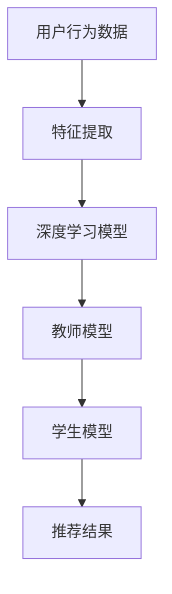

                 

关键词：知识蒸馏，轻量级模型，推荐系统，模型压缩，模型优化

摘要：随着互联网的快速发展，推荐系统在各类应用中扮演着越来越重要的角色。然而，传统的推荐系统模型往往计算复杂度高，难以满足实时性和低延迟的需求。本文将介绍一种基于知识蒸馏的轻量级推荐模型，通过降低模型参数量和计算复杂度，实现高效且精确的推荐。

## 1. 背景介绍

推荐系统作为一种信息过滤方法，旨在为用户推荐他们可能感兴趣的内容。传统推荐系统主要包括基于协同过滤、基于内容过滤和混合推荐等方法。然而，随着推荐场景的日益复杂和用户需求的多样化，传统推荐系统的性能面临巨大挑战。

近年来，深度学习在图像识别、自然语言处理等领域取得了显著进展。深度学习模型，尤其是神经网络模型，具有强大的表示学习能力，能够处理复杂的非线性关系。然而，深度学习模型通常参数量庞大，计算复杂度高，难以应用于推荐系统这种对实时性和低延迟要求较高的场景。

知识蒸馏（Knowledge Distillation）是一种将知识从大的教师模型传递到小的学生模型的方法。通过知识蒸馏，教师模型将知识编码成特征表示，学生模型通过学习这些特征表示来实现与教师模型相似的性能。知识蒸馏技术为构建轻量级深度学习模型提供了一种有效途径。

## 2. 核心概念与联系

### 2.1 知识蒸馏

知识蒸馏是一种迁移学习技术，通过将教师模型的知识传递给学生模型。在知识蒸馏过程中，教师模型生成高层次的语义特征表示，学生模型通过学习这些特征表示来提高其性能。知识蒸馏的核心思想是将模型训练过程中的软标签（Soft Label）用于指导学生模型的训练。

### 2.2 轻量级模型

轻量级模型是指在保持较高性能的前提下，具有较少参数量和较低计算复杂度的模型。轻量级模型通常应用于移动设备、嵌入式系统和实时应用场景，以降低计算资源和能耗。

### 2.3 推荐系统与深度学习

推荐系统通常采用深度学习模型来处理复杂的用户行为和内容特征，以实现更精准的推荐。然而，深度学习模型的参数量和计算复杂度较高，不适合直接应用于推荐系统。知识蒸馏技术为构建轻量级推荐模型提供了一种解决方案。

### 2.4 Mermaid 流程图

## 3. 核心算法原理 & 具体操作步骤

### 3.1 算法原理概述

基于知识蒸馏的轻量级推荐模型主要包括两个阶段：教师模型的训练和学生模型的学习。

1. **教师模型训练**：使用原始数据集训练一个大的深度学习模型，以生成高层次的语义特征表示。
2. **学生模型学习**：使用教师模型生成的软标签（Soft Label）训练一个小的深度学习模型，以实现与教师模型相似的性能。

### 3.2 算法步骤详解

1. **数据预处理**：对用户行为数据进行清洗和编码，提取用户兴趣特征和物品特征。
2. **教师模型训练**：使用预处理后的数据集训练一个大的深度学习模型，例如基于卷积神经网络（CNN）或循环神经网络（RNN）的模型。
3. **特征提取**：在教师模型训练过程中，提取模型中间层的特征表示。
4. **学生模型学习**：使用教师模型生成的软标签（Soft Label）训练一个小的深度学习模型。学生模型通常采用较少的层和较少的神经元，以降低计算复杂度和参数量。
5. **推荐结果生成**：使用训练好的学生模型对用户进行推荐，生成推荐结果。

### 3.3 算法优缺点

**优点**：

- **轻量级模型**：学生模型具有较少的参数量和计算复杂度，适用于实时推荐场景。
- **高效性**：知识蒸馏技术通过将教师模型的知识传递给学生模型，提高了学生模型的性能，降低了计算复杂度。

**缺点**：

- **教师模型训练成本**：教师模型需要较大的计算资源和时间进行训练，增加了模型部署成本。
- **模型迁移性能**：在知识蒸馏过程中，学生模型可能无法完全继承教师模型的所有知识，导致性能损失。

### 3.4 算法应用领域

基于知识蒸馏的轻量级推荐模型可以应用于多种场景，包括电商推荐、社交媒体推荐、内容推荐等。在移动设备、嵌入式系统和实时应用中，轻量级推荐模型能够提供高效且精确的推荐服务。

## 4. 数学模型和公式

### 4.1 数学模型构建

假设教师模型和学生模型分别为 $T$ 和 $S$，输入数据为 $X$，输出为 $Y$。教师模型和

