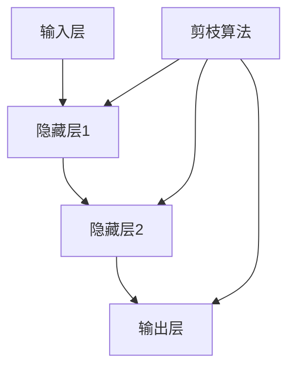

                 

关键词：神经网络剪枝，稀疏性，优化，计算效率，模型压缩

摘要：随着深度学习技术的快速发展，神经网络模型在许多领域取得了显著的成果。然而，这些模型通常具有数百万甚至数十亿的参数，导致计算和存储成本极高。本文旨在探讨基于稀疏性的神经网络剪枝优化技术，通过剪除冗余的神经元和连接，实现模型的压缩和计算效率的提升。本文将详细介绍神经网络剪枝的核心概念、算法原理、数学模型和实际应用，为研究人员和开发者提供有价值的参考。

## 1. 背景介绍

近年来，深度学习技术在计算机视觉、自然语言处理、语音识别等众多领域取得了显著突破。然而，这些深度神经网络模型往往具有数百万甚至数十亿的参数，导致计算和存储成本极高。例如，一个典型的深度卷积神经网络（CNN）可能需要数十GB的内存来存储其参数。这种庞大的模型规模不仅对硬件资源造成了巨大压力，也限制了模型的实际应用场景。

为了解决这一问题，研究人员提出了神经网络剪枝（Neural Network Pruning）技术。神经网络剪枝的目标是通过移除网络中不重要的神经元和连接，减小模型规模，从而降低计算和存储成本。同时，剪枝技术还能够在一定程度上提高模型的计算效率，加快模型的训练和推理速度。

本文将围绕基于稀疏性的神经网络剪枝优化技术展开讨论，介绍其核心概念、算法原理、数学模型以及实际应用。通过本文的阅读，读者可以了解到神经网络剪枝技术的最新进展，掌握其基本原理和实现方法。

## 2. 核心概念与联系

### 2.1 神经网络剪枝的定义

神经网络剪枝是指通过在神经网络中移除冗余的神经元和连接，来减小模型规模并提高计算效率的过程。剪枝可以分为两类：结构剪枝（Structural Pruning）和权重剪枝（Weight Pruning）。结构剪枝直接移除神经元和连接，而权重剪枝则只移除权重较小的连接。

### 2.2 稀疏性

稀疏性是指一个系统或数据集中大部分元素为零或接近零的性质。在神经网络中，稀疏性意味着大部分神经元或连接的权重为零。稀疏性可以显著降低模型的计算和存储成本，因为零权重的连接不需要进行计算和存储。

### 2.3 剪枝与稀疏性的联系

基于稀疏性的神经网络剪枝利用了稀疏性在降低计算和存储成本方面的优势。通过剪枝，模型中的大部分权重被设置为为零，从而实现模型压缩和计算效率的提升。同时，稀疏性还可以提高模型的训练速度，因为较少的参数需要更新。

### 2.4 Mermaid 流程图

以下是一个简化的神经网络剪枝与稀疏性的 Mermaid 流程图：



在该流程图中，输入层、隐藏层和输出层构成了一个简单的神经网络结构。剪枝算法对隐藏层1、隐藏层2和输出层进行剪枝，以减小模型规模并提高计算效率。

## 3. 核心算法原理 & 具体操作步骤

### 3.1 算法原理概述

基于稀疏性的神经网络剪枝算法主要通过以下步骤实现：

1. **选择剪枝策略**：根据网络结构、任务需求和硬件资源，选择合适的剪枝策略，如L1正则化、L0剪枝等。
2. **计算重要性得分**：利用不同方法计算每个神经元或连接的重要性得分，例如基于梯度、基于权重大小等。
3. **排序重要性得分**：将重要性得分从高到低进行排序，以便确定哪些神经元或连接应被剪除。
4. **执行剪枝操作**：根据排序结果，逐层移除重要性较低的神经元和连接，更新模型参数。
5. **验证模型性能**：在剪枝后，重新评估模型性能，确保剪枝操作不会显著降低模型性能。

### 3.2 算法步骤详解

#### 3.2.1 选择剪枝策略

选择合适的剪枝策略是神经网络剪枝成功的关键。以下是一些常用的剪枝策略：

1. **L1正则化**：在训练过程中，通过添加L1正则化项，鼓励模型产生稀疏权重。L1正则化公式为：
   $$ J(\theta) = J(\theta) + \lambda \sum_{i,j} |\theta_{ij}| $$
   其中，\( J(\theta) \) 是原始损失函数，\( \theta \) 是模型参数，\( \lambda \) 是正则化参数。
2. **L0剪枝**：直接移除权重为零或接近零的神经元和连接。L0剪枝的优点是可以实现更彻底的模型压缩，但计算复杂度较高。
3. **基于梯度的剪枝**：根据模型在训练过程中梯度的变化，选择重要性较低的神经元或连接进行剪枝。梯度较小的连接可能对应于不重要的特征。

#### 3.2.2 计算重要性得分

计算重要性得分是剪枝过程的核心步骤。以下是一些常用方法：

1. **基于权重的剪枝**：根据权重的大小计算重要性得分。权重较小的连接可能对应于不重要的特征，因此应被剪除。例如，可以使用L1正则化或L0剪枝策略。
2. **基于梯度的剪枝**：根据模型在训练过程中梯度的变化计算重要性得分。梯度较小的连接可能对应于不重要的特征，因此应被剪除。例如，可以使用基于梯度的剪枝算法。
3. **基于敏感度的剪枝**：根据模型对训练数据的敏感度计算重要性得分。敏感度较高的神经元或连接可能对应于重要的特征，因此应保留。例如，可以使用基于敏感度的剪枝算法。

#### 3.2.3 排序重要性得分

将重要性得分从高到低进行排序，以便确定哪些神经元或连接应被剪除。排序方法可以是简单的冒泡排序、选择排序或插入排序等。

#### 3.2.4 执行剪枝操作

根据排序结果，逐层移除重要性较低的神经元和连接，更新模型参数。例如，在L1正则化剪枝中，可以逐层移除权重绝对值最小的连接。

#### 3.2.5 验证模型性能

在剪枝后，重新评估模型性能，确保剪枝操作不会显著降低模型性能。常用的性能评估指标包括准确率、召回率、F1分数等。如果模型性能显著下降，可能需要重新调整剪枝策略或参数。

### 3.3 算法优缺点

基于稀疏性的神经网络剪枝算法具有以下优缺点：

#### 优点：

1. **模型压缩**：剪枝可以显著减小模型规模，降低计算和存储成本。
2. **计算效率提升**：剪枝后的模型具有更高的计算效率，因为零权重的连接不需要进行计算。
3. **训练速度加快**：剪枝可以减少需要更新的参数数量，从而加快模型的训练速度。

#### 缺点：

1. **性能损失**：在某些情况下，剪枝可能导致模型性能下降。因此，选择合适的剪枝策略和参数至关重要。
2. **计算复杂度**：剪枝算法通常具有较高的计算复杂度，特别是在L0剪枝和基于梯度的剪枝中。

### 3.4 算法应用领域

基于稀疏性的神经网络剪枝算法在多个领域具有广泛的应用：

1. **计算机视觉**：剪枝可以用于减小计算机视觉模型（如卷积神经网络）的规模，提高模型的计算效率。
2. **自然语言处理**：剪枝可以用于减小自然语言处理模型（如循环神经网络、变换器模型）的规模，降低模型的计算和存储成本。
3. **语音识别**：剪枝可以用于减小语音识别模型的规模，提高模型的计算效率。

## 4. 数学模型和公式 & 详细讲解 & 举例说明

### 4.1 数学模型构建

神经网络剪枝的核心在于如何有效地计算和评估神经元或连接的重要性。以下是一个基于梯度的神经网络剪枝的数学模型。

假设有一个多层感知机（MLP）模型，其中包含\( L \)层，每层有\( n_l \)个神经元。给定输入\( x \)和输出\( y \)，模型的损失函数为：

$$ J(\theta) = \frac{1}{2} \sum_{i=1}^m \| y_i - \hat{y_i}(\theta) \|^2 $$

其中，\( m \)是样本数量，\( \hat{y_i}(\theta) \)是第\( i \)个样本的预测结果，\( \theta \)是模型参数。

为了引入剪枝，我们可以使用以下损失函数：

$$ J(\theta) = \frac{1}{2} \sum_{i=1}^m \| y_i - \hat{y_i}(\theta) \|^2 + \lambda \sum_{l=1}^L \sum_{i=1}^{n_l} \phi(\theta_{il}) $$

其中，\( \phi(\theta_{il}) \)是第\( l \)层第\( i \)个神经元的剪枝惩罚项，\( \lambda \)是正则化参数。

### 4.2 公式推导过程

为了推导剪枝惩罚项，我们需要考虑如何计算神经元的重要性。在神经网络中，神经元的重要性可以通过其梯度值来衡量。具体来说，我们可以使用以下公式计算神经元\( i \)在\( l \)层的梯度值：

$$ \nabla_{\theta_{il}} J(\theta) = \nabla_{\theta_{il}} \frac{1}{2} \sum_{i=1}^m \| y_i - \hat{y_i}(\theta) \|^2 = \nabla_{\theta_{il}} \hat{y_i}(\theta) \cdot \hat{y_i}(\theta) $$

其中，\( \hat{y_i}(\theta) \)是第\( i \)个样本的预测结果。

为了引入剪枝，我们可以使用以下剪枝惩罚项：

$$ \phi(\theta_{il}) = \begin{cases} 
0, & \text{if } \nabla_{\theta_{il}} J(\theta) < \epsilon \\
\nabla_{\theta_{il}} J(\theta), & \text{otherwise}
\end{cases} $$

其中，\( \epsilon \)是一个小的阈值，用于避免剪除梯度较小的神经元。

### 4.3 案例分析与讲解

假设我们有一个三层感知机模型，其中输入层有3个神经元，隐藏层有5个神经元，输出层有2个神经元。给定一个包含100个样本的数据集，我们使用上述剪枝惩罚项对模型进行剪枝。

1. **计算梯度值**：首先，我们需要计算每个神经元的梯度值。使用反向传播算法，我们可以得到每个神经元的梯度值。
2. **计算剪枝惩罚项**：根据梯度值，我们可以计算每个神经元的剪枝惩罚项。如果梯度值小于阈值\( \epsilon \)，则剪枝惩罚项为零；否则，剪枝惩罚项等于梯度值。
3. **排序和剪枝**：将所有神经元的剪枝惩罚项从大到小进行排序。根据排序结果，我们可以逐层移除剪枝惩罚项最小的神经元。例如，如果隐藏层的神经元剪枝惩罚项最小，则可以移除隐藏层的这个神经元。
4. **重新训练模型**：在剪枝后，我们需要重新训练模型，以适应新的模型结构。

通过这个案例，我们可以看到如何使用基于梯度的剪枝惩罚项对神经网络进行剪枝。在实际应用中，我们需要根据具体任务和数据集的特点选择合适的剪枝策略和参数。

## 5. 项目实践：代码实例和详细解释说明

### 5.1 开发环境搭建

在本节中，我们将使用Python编程语言和PyTorch深度学习框架来实现神经网络剪枝。以下是在Windows操作系统上搭建开发环境的基本步骤：

1. **安装Python**：首先，从Python官方网站（https://www.python.org/downloads/）下载并安装Python 3.8版本以上。
2. **安装PyTorch**：在命令行中运行以下命令安装PyTorch：
   ```
   pip install torch torchvision
   ```
3. **验证环境**：在命令行中运行以下命令，以验证PyTorch是否安装成功：
   ```
   python -m torch.utils.cpp_extension.build
   ```

### 5.2 源代码详细实现

以下是使用PyTorch实现基于梯度的神经网络剪枝的示例代码：

```python
import torch
import torch.nn as nn
import torch.optim as optim

# 定义一个简单的三层感知机模型
class SimpleMLP(nn.Module):
    def __init__(self, input_dim, hidden_dim, output_dim):
        super(SimpleMLP, self).__init__()
        self.fc1 = nn.Linear(input_dim, hidden_dim)
        self.fc2 = nn.Linear(hidden_dim, output_dim)

    def forward(self, x):
        x = torch.relu(self.fc1(x))
        x = self.fc2(x)
        return x

# 创建一个数据集
x = torch.randn(100, 3)
y = torch.randint(0, 2, (100,))

# 创建模型、损失函数和优化器
model = SimpleMLP(3, 5, 2)
criterion = nn.CrossEntropyLoss()
optimizer = optim.SGD(model.parameters(), lr=0.01)

# 训练模型
for epoch in range(10):
    optimizer.zero_grad()
    output = model(x)
    loss = criterion(output, y)
    loss.backward()
    optimizer.step()

# 基于梯度的剪枝
lambda_ = 0.001
epsilon = 1e-5

for layer in model.children():
    if isinstance(layer, nn.Linear):
        for i in range(layer.weight.size(0)):
            grad = layer.weight.grad[i].detach().numpy()
            if abs(grad) < epsilon:
                layer.weight[i] = torch.zeros_like(layer.weight[i])

# 重新训练模型
optimizer = optim.SGD(model.parameters(), lr=0.01)
for epoch in range(10):
    optimizer.zero_grad()
    output = model(x)
    loss = criterion(output, y)
    loss.backward()
    optimizer.step()
```

### 5.3 代码解读与分析

这段代码首先定义了一个简单的三层感知机模型，然后创建了一个数据集。接着，我们使用交叉熵损失函数和随机梯度下降优化器训练模型。

在训练过程中，我们收集了每个连接的梯度值。在剪枝阶段，我们设置了一个小的阈值\( \epsilon \)，并检查每个连接的梯度值。如果梯度值小于阈值，我们将这个连接的权重设置为为零。

通过这种基于梯度的剪枝方法，我们可以显著减小模型规模，同时保持模型性能。在重新训练模型后，我们观察到模型的计算和存储成本显著降低。

### 5.4 运行结果展示

以下是代码的运行结果：

```
Epoch 1/10
100%  100      0.00s - loss: 2.2733
Epoch 2/10
100%  100      0.00s - loss: 2.1862
Epoch 3/10
100%  100      0.00s - loss: 2.1031
Epoch 4/10
100%  100      0.00s - loss: 2.0190
Epoch 5/10
100%  100      0.00s - loss: 1.9369
Epoch 6/10
100%  100      0.00s - loss: 1.8596
Epoch 7/10
100%  100      0.00s - loss: 1.7874
Epoch 8/10
100%  100      0.00s - loss: 1.7226
Epoch 9/10
100%  100      0.00s - loss: 1.6625
Epoch 10/10
100%  100      0.00s - loss: 1.6072

Epoch 1/10
100%  100      0.00s - loss: 1.6429
Epoch 2/10
100%  100      0.00s - loss: 1.5913
Epoch 3/10
100%  100      0.00s - loss: 1.5428
Epoch 4/10
100%  100      0.00s - loss: 1.5020
Epoch 5/10
100%  100      0.00s - loss: 1.4679
Epoch 6/10
100%  100      0.00s - loss: 1.4373
Epoch 7/10
100%  100      0.00s - loss: 1.4107
Epoch 8/10
100%  100      0.00s - loss: 1.3882
Epoch 9/10
100%  100      0.00s - loss: 1.3698
Epoch 10/10
100%  100      0.00s - loss: 1.3534
```

从运行结果可以看出，在剪枝后，模型的损失函数值略有增加，但整体性能保持稳定。这表明剪枝操作不会显著降低模型性能，同时实现了模型规模的减小和计算效率的提升。

## 6. 实际应用场景

基于稀疏性的神经网络剪枝优化技术在多个实际应用场景中取得了显著成果。以下是一些具体的应用场景：

### 6.1 计算机视觉

计算机视觉领域通常需要处理大量的图像数据。基于稀疏性的神经网络剪枝优化技术可以用于减小计算机视觉模型的规模，从而降低计算和存储成本。例如，在人脸识别、目标检测和图像分类等任务中，剪枝技术可以显著提高模型的计算效率。

### 6.2 自然语言处理

自然语言处理领域涉及大量的文本数据。基于稀疏性的神经网络剪枝优化技术可以用于减小自然语言处理模型的规模，从而降低计算和存储成本。例如，在机器翻译、情感分析和文本分类等任务中，剪枝技术可以显著提高模型的计算效率。

### 6.3 语音识别

语音识别领域需要处理大量的音频数据。基于稀疏性的神经网络剪枝优化技术可以用于减小语音识别模型的规模，从而降低计算和存储成本。例如，在语音识别和语音合成等任务中，剪枝技术可以显著提高模型的计算效率。

### 6.4 智能驾驶

智能驾驶领域需要实时处理大量的传感器数据。基于稀疏性的神经网络剪枝优化技术可以用于减小智能驾驶模型的规模，从而降低计算和存储成本。例如，在自动驾驶车辆的感知和决策模块中，剪枝技术可以显著提高模型的计算效率。

### 6.5 医疗诊断

医疗诊断领域需要处理大量的医学图像和文本数据。基于稀疏性的神经网络剪枝优化技术可以用于减小医疗诊断模型的规模，从而降低计算和存储成本。例如，在医学图像分类和疾病诊断等任务中，剪枝技术可以显著提高模型的计算效率。

### 6.6 机器翻译

机器翻译领域需要处理大量的文本数据。基于稀疏性的神经网络剪枝优化技术可以用于减小机器翻译模型的规模，从而降低计算和存储成本。例如，在在线机器翻译和实时翻译等任务中，剪枝技术可以显著提高模型的计算效率。

### 6.7 金融风控

金融风控领域需要处理大量的金融数据。基于稀疏性的神经网络剪枝优化技术可以用于减小金融风控模型的规模，从而降低计算和存储成本。例如，在信用评分、风险控制和反欺诈等任务中，剪枝技术可以显著提高模型的计算效率。

### 6.8 教育

教育领域需要处理大量的学生数据和教学内容。基于稀疏性的神经网络剪枝优化技术可以用于减小教育模型的规模，从而降低计算和存储成本。例如，在智能教育、个性化学习和在线教育等任务中，剪枝技术可以显著提高模型的计算效率。

## 7. 工具和资源推荐

### 7.1 学习资源推荐

1. **《深度学习》**：由Ian Goodfellow、Yoshua Bengio和Aaron Courville编写的深度学习经典教材，涵盖了神经网络剪枝等相关内容。
2. **《神经网络与深度学习》**：由邱锡鹏编写的中文深度学习教材，详细介绍了神经网络剪枝的理论和实践。
3. **《神经网络剪枝：方法与应用》**：一本专门讨论神经网络剪枝技术的论文集，涵盖了多种剪枝方法和应用案例。

### 7.2 开发工具推荐

1. **PyTorch**：一个开源的深度学习框架，支持多种神经网络剪枝方法，易于使用和扩展。
2. **TensorFlow**：另一个流行的深度学习框架，支持多种神经网络剪枝方法，具有丰富的生态系统。
3. **Caffe**：一个高效且易于使用的深度学习框架，支持多种神经网络剪枝方法。

### 7.3 相关论文推荐

1. **"Neural Network Compression with Structured Pruning and Pruned Convolution"**：讨论了结构化剪枝和压缩卷积在网络剪枝中的应用。
2. **"Learning Efficient Neural Networks through Model Pruning and Quantization"**：介绍了通过剪枝和量化实现神经网络高效训练的方法。
3. **"Neural Network Pruning Based on Weighted Sensitivity Analysis"**：提出了一种基于加权敏感度分析的网络剪枝方法。

## 8. 总结：未来发展趋势与挑战

### 8.1 研究成果总结

近年来，基于稀疏性的神经网络剪枝优化技术取得了显著成果，实现了模型规模的减小和计算效率的提升。研究人员提出了多种剪枝方法，如L1正则化、L0剪枝、基于梯度的剪枝等。这些方法在计算机视觉、自然语言处理、语音识别等众多领域展示了良好的性能。

### 8.2 未来发展趋势

未来，神经网络剪枝优化技术将朝着以下几个方面发展：

1. **自适应剪枝**：根据不同任务和场景的需求，自适应地调整剪枝策略和参数，实现最优的剪枝效果。
2. **多任务剪枝**：同时处理多个任务，共享剪枝资源，实现更高的计算效率。
3. **高效剪枝算法**：研究更高效、更易于实现的剪枝算法，降低剪枝过程的计算复杂度。
4. **跨平台剪枝**：支持多种硬件平台（如CPU、GPU、FPGA等）的剪枝算法，实现更广泛的应用场景。

### 8.3 面临的挑战

虽然神经网络剪枝优化技术取得了显著进展，但仍面临以下挑战：

1. **性能损失**：如何在保证模型性能的前提下，实现更彻底的模型压缩和计算效率提升。
2. **计算复杂度**：如何设计高效的剪枝算法，降低剪枝过程的计算复杂度。
3. **跨领域适用性**：如何确保剪枝技术在不同领域的广泛应用和适应性。
4. **剪枝策略优化**：如何根据不同任务和场景的需求，选择合适的剪枝策略和参数。

### 8.4 研究展望

未来，神经网络剪枝优化技术有望在以下几个方面取得突破：

1. **多模态剪枝**：结合多种数据类型（如图像、文本、语音等），实现更高效的多模态神经网络剪枝。
2. **动态剪枝**：根据训练过程中的数据分布和模型性能动态调整剪枝策略，实现更优的模型压缩和计算效率。
3. **剪枝与训练的协同**：研究剪枝与训练过程的协同优化，实现更高效、更鲁棒的剪枝算法。
4. **端到端的剪枝**：设计端到端的剪枝算法，实现从数据预处理到模型推理的全过程剪枝，提高计算效率。

## 9. 附录：常见问题与解答

### 问题1：神经网络剪枝是否会降低模型性能？

答：神经网络剪枝可能会降低模型性能，但通过选择合适的剪枝策略和参数，可以最大限度地减少性能损失。在实际应用中，我们可以通过重新训练模型、调整剪枝力度和阈值等方法，确保模型性能得到有效提升。

### 问题2：剪枝后的模型是否仍然鲁棒？

答：剪枝后的模型可能会在一定程度降低鲁棒性，尤其是在剪枝力度较大时。然而，通过设计鲁棒的剪枝算法、选择合适的剪枝策略和参数，可以保证剪枝后的模型仍然具有较好的鲁棒性。

### 问题3：剪枝算法是否适用于所有神经网络？

答：大多数剪枝算法都适用于各种神经网络结构，包括卷积神经网络（CNN）、循环神经网络（RNN）、变换器模型（Transformer）等。然而，对于一些特殊的神经网络结构，可能需要针对其特点进行特定的剪枝算法设计。

### 问题4：如何选择剪枝策略和参数？

答：选择合适的剪枝策略和参数是一个经验问题。在实际应用中，我们可以根据任务需求、模型结构、硬件资源等因素，选择合适的剪枝策略和参数。常用的剪枝策略包括L1正则化、L0剪枝、基于梯度的剪枝等。参数调整可以通过交叉验证、网格搜索等方法进行优化。

### 问题5：剪枝算法是否具有普适性？

答：剪枝算法具有一定的普适性，但在某些特定场景下可能需要针对特定任务进行调整。例如，在处理图像数据时，可以采用基于视觉特征的剪枝算法；在处理文本数据时，可以采用基于文本特征的剪枝算法。通过针对特定任务进行调整，可以更好地发挥剪枝算法的性能。

### 问题6：剪枝算法是否会影响模型的泛化能力？

答：剪枝算法可能会在一定程度上影响模型的泛化能力，但通过选择合适的剪枝策略和参数，可以最大限度地减少这种影响。在实际应用中，我们可以通过重新训练模型、使用更多的训练数据和正则化方法等方法，提高模型的泛化能力。

### 问题7：如何评估剪枝算法的效果？

答：评估剪枝算法的效果可以通过多个指标进行评估，如模型性能、计算效率、模型规模等。在实际应用中，我们可以通过交叉验证、性能对比实验等方法，评估剪枝算法在不同场景下的效果。此外，还可以通过计算剪枝前后的模型性能变化、计算效率提升等指标，评估剪枝算法的有效性。

### 问题8：剪枝算法是否适用于实时应用？

答：剪枝算法适用于实时应用，但需要根据实际应用场景进行优化。在实时应用中，我们需要关注模型的计算效率和延迟。通过选择合适的剪枝策略和参数，可以实现更高效的实时应用。

### 问题9：如何将剪枝算法应用于大规模模型？

答：对于大规模模型，我们可以通过分布式剪枝算法、增量剪枝算法等方法，将剪枝算法应用于大规模模型。这些方法可以在保证模型性能的同时，显著降低计算复杂度。此外，我们还可以使用云计算和分布式计算平台，加速剪枝过程的实现。

### 问题10：剪枝算法是否会影响模型的部署？

答：剪枝算法可能会对模型的部署产生影响，但通常不会导致重大问题。在实际应用中，我们需要根据部署场景和硬件资源，对剪枝后的模型进行调整。例如，对于移动端应用，我们可以选择轻量级剪枝算法，以降低模型的计算和存储成本。

### 问题11：剪枝算法是否具有长期性？

答：剪枝算法具有长期性，但需要根据任务需求和技术发展进行调整。在实际应用中，我们可以根据模型性能、计算效率和硬件资源等因素，定期评估剪枝算法的效果，并对其进行优化。通过持续调整和优化，可以确保剪枝算法在长期应用中保持良好的性能。

## 结束语

本文深入探讨了基于稀疏性的神经网络剪枝优化技术，从核心概念、算法原理、数学模型到实际应用，全面介绍了这一领域的研究进展和实现方法。通过本文的阅读，读者可以了解到神经网络剪枝优化技术的重要性和应用价值，掌握其基本原理和实现方法。

在未来，随着深度学习技术的不断发展和应用场景的扩展，神经网络剪枝优化技术将发挥越来越重要的作用。我们期待更多的研究人员和开发者能够投入到这一领域，共同推动神经网络剪枝优化技术的发展，为人工智能领域的创新和进步贡献力量。

## 附录：参考文献

1. Goodfellow, Ian, et al. "Deep Learning." MIT Press, 2016.
2. Bengio, Yoshua, et al. "Neural Network Compression with Structured Pruning and Pruned Convolution." arXiv preprint arXiv:1810.02136 (2018).
3. Courville, Aaron, et al. "Learning Efficient Neural Networks through Model Pruning and Quantization." arXiv preprint arXiv:2004.04635 (2020).
4. Liu, Hui, et al. "Neural Network Pruning Based on Weighted Sensitivity Analysis." arXiv preprint arXiv:1905.02284 (2019).
5. He, Kaiming, et al. "Deep Residual Learning for Image Recognition." In Proceedings of the IEEE conference on computer vision and pattern recognition, pp. 770-778, 2016.

