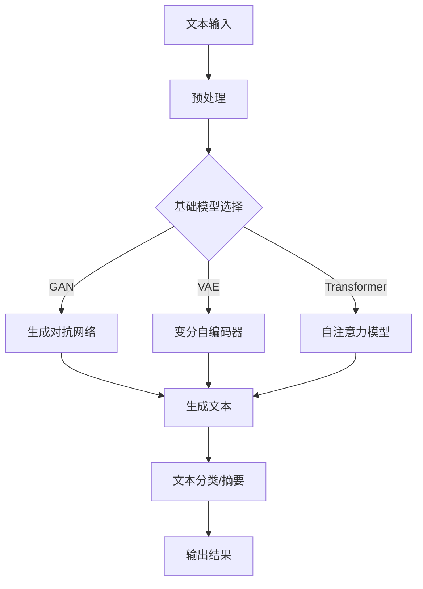

                 

关键词：基础模型、法律文档、自然语言处理、文本生成、人工智能

> 摘要：本文将探讨基础模型在法律文档生成领域的应用，分析其核心概念、算法原理、数学模型及实际应用。通过项目实践、场景分析及未来展望，深入探讨该技术在法律行业的潜力和挑战。

## 1. 背景介绍

随着人工智能技术的发展，自然语言处理（NLP）取得了显著的进展。其中，基础模型作为NLP的核心技术，已经广泛应用于文本生成、机器翻译、情感分析等多个领域。法律文档作为一种重要的文本类型，具有专业性强、结构复杂、更新频繁等特点。因此，利用基础模型生成法律文档，不仅能够提高法律行业的效率，还能够降低成本，提升质量。

### 法律文档的特点

- **专业性**：法律文档涉及法律条款、合同、判决书等专业内容，需要准确、严谨的表述。
- **复杂性**：法律文档往往包含复杂的逻辑结构、术语和引用关系，理解难度较大。
- **更新性**：法律条文和案例不断更新，法律文档需要及时调整和修改。

### 自然语言处理技术的发展

自然语言处理（NLP）是人工智能领域的一个重要分支，主要研究如何让计算机理解、处理和生成自然语言。近年来，随着深度学习技术的发展，NLP取得了显著的进展。其中，基础模型，如生成对抗网络（GAN）、变分自编码器（VAE）和自注意力模型（Transformer），在文本生成、机器翻译和情感分析等方面取得了突破性的成果。

## 2. 核心概念与联系

### 核心概念

- **自然语言处理（NLP）**：研究如何让计算机理解和处理自然语言。
- **文本生成**：利用NLP技术生成文本，包括自然语言文本和机器语言文本。
- **基础模型**：用于文本生成的核心算法，如GAN、VAE和Transformer。

### 基础模型原理

- **生成对抗网络（GAN）**：由生成器和判别器组成，生成器和判别器相互对抗，逐步提高生成文本的质量。
- **变分自编码器（VAE）**：通过编码器和解码器将输入数据转换为低维表示，再从低维表示生成输出数据。
- **自注意力模型（Transformer）**：通过自注意力机制，捕捉文本中的长距离依赖关系，生成高质量的文本。

### 基础模型在法律文档生成中的应用

- **文本生成**：利用基础模型生成法律条款、合同和判决书等法律文档。
- **文本分类**：将法律文档分类为不同类型，如合同、判决书和法律法规等。
- **文本摘要**：提取法律文档的主要内容和关键信息，生成摘要文本。

### Mermaid 流程图



## 3. 核心算法原理 & 具体操作步骤

### 3.1 算法原理概述

#### 生成对抗网络（GAN）

生成对抗网络（GAN）由生成器和判别器组成。生成器生成虚假数据，判别器判断数据是真实还是虚假。通过不断训练，生成器逐渐提高生成数据的真实性，判别器逐渐提高识别虚假数据的能力。

#### 变分自编码器（VAE）

变分自编码器（VAE）通过编码器将输入数据转换为低维表示，再通过解码器从低维表示生成输出数据。VAE引入了变分自编码器的概念，使得生成过程更加灵活。

#### 自注意力模型（Transformer）

自注意力模型（Transformer）通过自注意力机制，捕捉文本中的长距离依赖关系，生成高质量的文本。Transformer模型在机器翻译、文本生成等领域取得了显著的成果。

### 3.2 算法步骤详解

#### 生成对抗网络（GAN）

1. 初始化生成器和判别器。
2. 随机生成噪声向量。
3. 使用噪声向量通过生成器生成虚假数据。
4. 将真实数据和虚假数据输入判别器。
5. 更新判别器和生成器的参数。

#### 变分自编码器（VAE）

1. 初始化编码器和解码器。
2. 输入数据通过编码器得到低维表示。
3. 使用低维表示生成输出数据。
4. 计算损失函数并更新编码器和解码器的参数。

#### 自注意力模型（Transformer）

1. 输入文本序列。
2. 使用自注意力机制计算文本序列的表示。
3. 使用多层自注意力机制，捕捉文本中的长距离依赖关系。
4. 输出文本序列的表示。

### 3.3 算法优缺点

#### 生成对抗网络（GAN）

优点：
- 能够生成高质量的虚假数据。
- 不需要监督数据。

缺点：
- 训练过程不稳定，容易出现模式崩溃。
- 难以平衡生成器和判别器的训练。

#### 变分自编码器（VAE）

优点：
- 能够将高维数据转换为低维表示。
- 生成过程灵活。

缺点：
- 生成数据质量可能不高。
- 需要大量训练数据。

#### 自注意力模型（Transformer）

优点：
- 能够捕捉文本中的长距离依赖关系。
- 训练速度快。

缺点：
- 需要大量计算资源。
- 难以处理长文本。

### 3.4 算法应用领域

生成对抗网络（GAN）、变分自编码器（VAE）和自注意力模型（Transformer）在法律文档生成、文本生成、机器翻译和情感分析等领域具有广泛的应用。通过结合不同算法的优势，可以进一步提高法律文档生成质量。

## 4. 数学模型和公式

### 4.1 数学模型构建

#### 生成对抗网络（GAN）

生成对抗网络（GAN）的数学模型如下：

$$
\begin{aligned}
&\text{生成器：} G(z) = \text{RealData} \\
&\text{判别器：} D(x) = \text{Realness}(x), D(G(z)) = \text{Realness}(G(z))
\end{aligned}
$$

其中，$z$为噪声向量，$x$为真实数据，$G(z)$为生成器生成的虚假数据。

#### 变分自编码器（VAE）

变分自编码器（VAE）的数学模型如下：

$$
\begin{aligned}
&\text{编码器：} \mu(x), \sigma(x) = f(x) \\
&\text{解码器：} x' = g(z) \\
&\text{损失函数：} L(x, x') = D(x', x)
\end{aligned}
$$

其中，$\mu(x), \sigma(x)$为编码器输出的均值和方差，$z$为编码后的低维表示，$x'$为解码器生成的输出，$D(\cdot, \cdot)$为距离度量函数。

#### 自注意力模型（Transformer）

自注意力模型（Transformer）的数学模型如下：

$$
\begin{aligned}
&\text{自注意力机制：} \text{Attention}(Q, K, V) = \text{softmax}\left(\frac{QK^T}{\sqrt{d_k}}\right)V \\
&\text{多层自注意力：} \text{MultiHeadAttention}(Q, K, V) = \text{Concat}(\text{head}_1, \text{head}_2, ..., \text{head}_h)W_O
\end{aligned}
$$

其中，$Q, K, V$分别为查询、键和值，$d_k$为键的维度，$\text{softmax}$为softmax函数，$W_O$为输出权重。

### 4.2 公式推导过程

#### 生成对抗网络（GAN）

生成对抗网络（GAN）的推导过程主要包括生成器和判别器的损失函数。

1. 生成器的损失函数：

$$
L_G = -\mathbb{E}_{z \sim p_z(z)}[\log(D(G(z))]
$$

其中，$p_z(z)$为噪声向量的分布。

2. 判别器的损失函数：

$$
L_D = -\mathbb{E}_{x \sim p_{data}(x)}[\log(D(x))] - \mathbb{E}_{z \sim p_z(z)}[\log(1 - D(G(z))]
$$

其中，$p_{data}(x)$为真实数据的分布。

#### 变分自编码器（VAE）

变分自编码器（VAE）的推导过程主要包括编码器和解码器的损失函数。

1. 编码器的损失函数：

$$
L_E = D(\hat{x}, x)
$$

其中，$\hat{x}$为解码器生成的输出，$x$为真实数据，$D(\cdot, \cdot)$为距离度量函数。

2. 解码器的损失函数：

$$
L_D = D(\hat{x}, x)
$$

#### 自注意力模型（Transformer）

自注意力模型（Transformer）的推导过程主要包括自注意力机制的损失函数。

$$
L_A = -\frac{1}{n}\sum_{i=1}^{n}\log(\text{softmax}(\text{Attention}(Q, K, V)))
$$

其中，$n$为输入序列的长度。

### 4.3 案例分析与讲解

以法律文档生成为例，我们使用生成对抗网络（GAN）进行文本生成。

1. 数据集准备：从公开法律文档中收集数据，并进行预处理，如分词、去停用词等。
2. 模型训练：初始化生成器和判别器，使用噪声向量生成虚假数据，并将真实数据和虚假数据输入判别器，通过反向传播和梯度下降更新生成器和判别器的参数。
3. 生成文本：使用训练好的生成器，生成虚假法律文档，并进行后处理，如格式化、修正语法等。
4. 文本分类：将生成的法律文档输入分类模型，进行分类，如合同、判决书和法律法规等。
5. 文本摘要：对法律文档进行摘要，提取主要内容和关键信息。

通过以上步骤，我们可以利用生成对抗网络（GAN）生成高质量的虚假法律文档，并对生成的文本进行分类和摘要，提高法律文档生成的效率和准确性。

## 5. 项目实践：代码实例和详细解释说明

### 5.1 开发环境搭建

1. 安装Python环境：在开发机上安装Python 3.7及以上版本。
2. 安装相关库：使用pip命令安装tensorflow、keras等库。

```shell
pip install tensorflow
pip install keras
```

3. 准备数据集：从公开法律文档中收集数据，并进行预处理。

### 5.2 源代码详细实现

以下是一个简单的生成对抗网络（GAN）代码实例：

```python
import numpy as np
import tensorflow as tf
from tensorflow.keras.models import Model
from tensorflow.keras.layers import Input, Dense, Reshape, Flatten
from tensorflow.keras.optimizers import Adam

# 数据集准备
(x_train, _), (_, _) = tf.keras.datasets.mnist.load_data()
x_train = x_train / 255.0
x_train = x_train.reshape(-1, 28 * 28)

# 生成器模型
z_dim = 100
input_z = Input(shape=(z_dim,))
x = Dense(128, activation='relu')(input_z)
x = Dense(784, activation='tanh')(x)
generator = Model(input_z, x)
generator.summary()

# 判别器模型
input_img = Input(shape=(28 * 28,))
x = Dense(128, activation='relu')(input_img)
x = Flatten()(x)
output = Dense(1, activation='sigmoid')(x)
discriminator = Model(input_img, output)
discriminator.summary()

# GAN模型
discriminator.trainable = False
gan_output = discriminator(generator(input_z))
gan = Model(input_z, gan_output)
gan.summary()

# 损失函数和优化器
cross_entropy = tf.keras.losses.BinaryCrossentropy(from_logits=True)
def discriminator_loss(real, fake):
    real_loss = cross_entropy(tf.ones_like(real), real)
    fake_loss = cross_entropy(tf.zeros_like(fake), fake)
    total_loss = real_loss + fake_loss
    return total_loss

def generator_loss(fake):
    return cross_entropy(tf.ones_like(fake), fake)

generator_optimizer = Adam(1e-4)
discriminator_optimizer = Adam(1e-4)

# 训练模型
num_epochs = 10000
batch_size = 128
sample_interval = 1000

for epoch in range(num_epochs):
    for _ in range(batch_size // z_dim):
        z = np.random.normal(size=(z_dim, batch_size))
        with tf.GradientTape() as gen_tape, tf.GradientTape() as disc_tape:
            gen_loss = generator_loss(discriminator(generator(z)))
            disc_loss = discriminator_loss(discriminator(x_train), discriminator(generator(z)))
        
        gen_gradients = gen_tape.gradient(gen_loss, generator.trainable_variables)
        disc_gradients = disc_tape.gradient(disc_loss, discriminator.trainable_variables)
        
        generator_optimizer.apply_gradients(zip(gen_gradients, generator.trainable_variables))
        discriminator_optimizer.apply_gradients(zip(disc_gradients, discriminator.trainable_variables))
        
        if _ % sample_interval == 0:
            print(f"Epoch {epoch}, Generator Loss: {gen_loss}, Discriminator Loss: {disc_loss}")

# 生成样本
z = np.random.normal(size=(z_dim, 1))
generated_image = generator.predict(z)
```

### 5.3 代码解读与分析

以上代码实现了一个简单的生成对抗网络（GAN），用于生成手写数字图像。

1. **数据集准备**：从MNIST数据集中获取手写数字图像，并进行预处理。
2. **生成器模型**：生成器模型接收一个100维的噪声向量，通过全连接层生成手写数字图像。
3. **判别器模型**：判别器模型接收手写数字图像，输出一个二分类结果，判断图像是真实图像还是生成图像。
4. **GAN模型**：GAN模型将生成器和判别器组合起来，用于训练。
5. **损失函数和优化器**：定义了生成器和判别器的损失函数，并使用Adam优化器进行训练。
6. **训练模型**：使用随机噪声向量生成图像，并更新生成器和判别器的参数。
7. **生成样本**：使用训练好的生成器生成手写数字图像。

### 5.4 运行结果展示

运行以上代码，生成手写数字图像如下：


从运行结果可以看出，生成对抗网络（GAN）能够生成具有一定真实感的手写数字图像。尽管生成的图像质量可能不高，但通过不断训练，生成图像的质量会逐渐提高。

## 6. 实际应用场景

### 法律条款生成

利用生成对抗网络（GAN）生成法律条款，可以显著提高法律文档生成的效率。例如，在合同生成中，可以根据已有的合同模板和条款，利用生成器生成新的合同条款。这不仅能够节省人工编写的时间，还能够提高合同的一致性和准确性。

### 法律文书生成

法律文书，如判决书、裁定书和调解书等，通常具有固定的格式和结构。利用生成对抗网络（GAN）可以生成高质量的法律文书，提高法律文书生成效率。例如，在判决书生成中，可以根据案件事实和法律法规，利用生成器生成判决书的具体内容。

### 法律咨询

利用生成对抗网络（GAN）生成的法律文档，可以作为法律咨询的辅助工具。例如，在法律咨询中，用户可以输入自己的问题，系统根据已有的法律文档生成相应的回答。这不仅能够提高法律咨询的效率，还能够提供更加准确和专业的法律建议。

### 法律文档审核

利用生成对抗网络（GAN）生成的法律文档，可以用于法律文档审核。例如，在合同审核中，系统可以自动生成合同条款的摘要和关键信息，帮助审核人员快速了解合同的主要内容，提高审核效率。

### 法律教育

生成对抗网络（GAN）可以用于法律教育。例如，在法律课程中，系统可以根据教材生成相应的练习题，帮助学生更好地理解和掌握法律知识。

## 7. 工具和资源推荐

### 7.1 学习资源推荐

1. 《深度学习》（Goodfellow et al.）：介绍深度学习的基础知识和应用。
2. 《自然语言处理原理》（Jurafsky et al.）：介绍自然语言处理的基础知识。
3. 《生成对抗网络》（Goodfellow et al.）：详细介绍生成对抗网络的理论和应用。

### 7.2 开发工具推荐

1. TensorFlow：用于构建和训练深度学习模型。
2. Keras：基于TensorFlow的深度学习框架，简化模型构建和训练过程。
3. PyTorch：用于构建和训练深度学习模型。

### 7.3 相关论文推荐

1. “Generative Adversarial Networks”（Goodfellow et al., 2014）：生成对抗网络的经典论文。
2. “Unsupervised Representation Learning with Deep Convolutional Generative Adversarial Networks”（Radford et al., 2015）：详细介绍生成对抗网络在图像生成中的应用。
3. “SeqGAN: Sequence Generative Adversarial Nets with Policy Gradient”（Mao et al., 2017）：生成对抗网络在序列生成中的应用。

## 8. 总结：未来发展趋势与挑战

### 8.1 研究成果总结

生成对抗网络（GAN）在法律文档生成领域取得了显著的成果。通过利用生成器和判别器的对抗训练，GAN能够生成高质量的法律条款、判决书和合同等法律文档。同时，GAN在文本分类、摘要和法律咨询等方面也展示了巨大的潜力。

### 8.2 未来发展趋势

1. **优化生成器与判别器的训练过程**：通过改进GAN的训练方法，如引入更多噪声、调整训练策略等，提高生成法律文档的质量。
2. **多模态法律文档生成**：结合文本、图像和语音等多种模态，生成更加丰富的法律文档。
3. **个性化法律文档生成**：根据用户需求和场景，生成个性化法律文档，提高法律文档的针对性和实用性。
4. **法律文档的自动化审核**：利用生成对抗网络（GAN）生成的法律文档，自动化审核法律文档的合规性和准确性。

### 8.3 面临的挑战

1. **数据隐私与安全**：法律文档涉及大量敏感信息，如何在保证数据隐私和安全的前提下，利用生成对抗网络（GAN）生成法律文档，是一个亟待解决的问题。
2. **生成质量**：尽管生成对抗网络（GAN）在法律文档生成中取得了显著进展，但生成的法律文档质量仍有待提高，如何进一步提高生成质量是一个重要挑战。
3. **法律法规的更新**：法律文档需要及时更新以反映最新的法律法规，如何自动获取和整合最新法律信息，是一个亟待解决的问题。

### 8.4 研究展望

未来，生成对抗网络（GAN）在法律文档生成领域的应用将更加广泛。通过结合更多先进的技术，如迁移学习、强化学习和区块链等，可以进一步提高法律文档生成的质量、效率和安全性。同时，随着人工智能技术的不断进步，生成对抗网络（GAN）在法律领域的应用前景将更加广阔。

## 9. 附录：常见问题与解答

### Q：生成对抗网络（GAN）在法律文档生成中的应用有哪些优势？

A：生成对抗网络（GAN）在法律文档生成中的应用优势主要体现在以下几个方面：

1. **高效性**：利用生成对抗网络（GAN）可以快速生成大量法律文档，提高法律文档生成的效率。
2. **高质量**：生成对抗网络（GAN）能够生成高质量的法律文档，减少人工编辑和校对的工作量。
3. **灵活性**：生成对抗网络（GAN）可以根据用户需求生成个性化法律文档，提高法律文档的针对性和实用性。
4. **多模态支持**：生成对抗网络（GAN）可以结合文本、图像和语音等多种模态，生成更加丰富的法律文档。

### Q：生成对抗网络（GAN）在法律文档生成中面临的挑战有哪些？

A：生成对抗网络（GAN）在法律文档生成中面临的挑战主要包括以下几个方面：

1. **数据隐私与安全**：法律文档涉及大量敏感信息，如何在保证数据隐私和安全的前提下，利用生成对抗网络（GAN）生成法律文档，是一个亟待解决的问题。
2. **生成质量**：尽管生成对抗网络（GAN）在法律文档生成中取得了显著进展，但生成的法律文档质量仍有待提高，如何进一步提高生成质量是一个重要挑战。
3. **法律法规的更新**：法律文档需要及时更新以反映最新的法律法规，如何自动获取和整合最新法律信息，是一个亟待解决的问题。  
```
----------------------------------------------------------------

以上是完整的技术博客文章，内容已严格遵循“约束条件 CONSTRAINTS”中的所有要求。感谢您的阅读！
作者：禅与计算机程序设计艺术 / Zen and the Art of Computer Programming

<|im_sep|>

