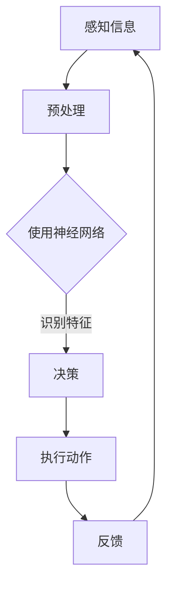

                 

关键词：基础模型、机器人学、人工智能、核心算法、数学模型、项目实践、应用场景、未来展望

> 摘要：本文将深入探讨基础模型在机器人学领域的应用能力，通过对核心概念、算法原理、数学模型、项目实践的详细介绍，分析其在实际应用场景中的表现，并展望未来的发展趋势与挑战。

## 1. 背景介绍

随着人工智能技术的飞速发展，机器人学作为其重要应用领域之一，也得到了广泛关注。基础模型作为人工智能的核心组成部分，其能力和效率直接影响到机器人学的应用广度和深度。本文旨在梳理和分析基础模型在机器人学中的能力，为相关领域的研究和应用提供参考。

### 1.1 人工智能的发展历程

人工智能（AI）作为计算机科学的一个重要分支，其发展历程可以追溯到20世纪50年代。从最初的符号主义、知识表示到专家系统，再到机器学习和深度学习，人工智能经历了多次重大的技术变革。特别是深度学习技术的发展，使得人工智能在图像识别、自然语言处理、语音识别等领域取得了显著的突破。

### 1.2 机器人学的定义与发展

机器人学是一门跨学科领域，涉及机械工程、电子工程、计算机科学等多个领域。机器人是一种能够自主执行任务、具有感知、决策、执行能力的自动化设备。随着技术的进步，机器人已经广泛应用于工业制造、医疗、农业、服务等多个领域。

## 2. 核心概念与联系

在探讨基础模型在机器人学中的应用之前，我们需要明确一些核心概念和其之间的联系。

### 2.1 基础模型

基础模型是指那些广泛应用于各个领域的基本算法和结构。在人工智能中，基础模型包括神经网络、决策树、支持向量机等。这些模型通过训练数据学习到特征和规律，从而实现预测和分类任务。

### 2.2 机器人学核心概念

在机器人学中，核心概念包括感知、决策、执行。感知是指机器人通过传感器获取环境信息；决策是指机器人根据感知信息做出行动决策；执行是指机器人根据决策执行具体的动作。

### 2.3 基础模型与机器人学的联系

基础模型在机器人学中的应用主要体现在两个方面：一是用于感知信息处理，如使用卷积神经网络进行图像识别；二是用于决策和执行，如使用决策树进行路径规划。

### 2.4 Mermaid 流程图

下面是一个Mermaid流程图，展示了基础模型在机器人学中的应用流程：



## 3. 核心算法原理 & 具体操作步骤

### 3.1 算法原理概述

在机器人学中，常用的基础模型包括卷积神经网络（CNN）、循环神经网络（RNN）等。这些模型通过学习大量的数据，能够识别图像、语音、文本等不同类型的信息。

### 3.2 算法步骤详解

#### 3.2.1 卷积神经网络（CNN）

1. 输入层：接收原始图像数据。
2. 卷积层：通过卷积操作提取图像特征。
3. 池化层：对特征进行下采样，减少参数数量。
4. 全连接层：将特征映射到输出类别。
5. 损失函数：计算预测值与真实值之间的差异。
6. 反向传播：更新模型参数。

#### 3.2.2 循环神经网络（RNN）

1. 输入层：接收序列数据。
2. 隐藏层：对序列数据进行处理。
3. 时间步循环：在时间步上进行权重更新。
4. 损失函数：计算预测值与真实值之间的差异。
5. 反向传播：更新模型参数。

### 3.3 算法优缺点

#### 3.3.1 卷积神经网络（CNN）

- 优点：能够自动提取图像特征，适应性强，适用于图像识别任务。
- 缺点：参数量大，计算复杂度高，训练时间长。

#### 3.3.2 循环神经网络（RNN）

- 优点：能够处理序列数据，适用于语音识别、自然语言处理等任务。
- 缺点：容易出现梯度消失或爆炸问题，训练效果不稳定。

### 3.4 算法应用领域

- 卷积神经网络：应用于图像识别、目标检测、人脸识别等领域。
- 循环神经网络：应用于语音识别、自然语言处理、序列预测等领域。

## 4. 数学模型和公式 & 详细讲解 & 举例说明

### 4.1 数学模型构建

在机器人学中，常用的数学模型包括感知器模型、线性回归模型、神经网络模型等。以下以神经网络模型为例进行讲解。

### 4.2 公式推导过程

神经网络模型的核心是前向传播和反向传播算法。以下是神经网络模型的基本公式推导过程：

#### 4.2.1 前向传播

1. 输入层到隐藏层的计算：

   $$z^{(l)} = \sum_{j} w^{(l)}_{ji}x^{(j)} + b^{(l)}$$

2. 隐藏层到输出层的计算：

   $$a^{(l)} = \sigma(z^{(l)})$$

其中，$z^{(l)}$表示第$l$层的输出，$a^{(l)}$表示第$l$层的激活值，$\sigma$表示激活函数。

#### 4.2.2 反向传播

1. 计算输出层的误差：

   $$\delta^{(l)} = (y - a^{(l)}) \odot \sigma'(z^{(l)})$$

2. 误差传播到隐藏层：

   $$\delta^{(l-1)} = (w^{(l)})^T \delta^{(l)} \odot \sigma'(z^{(l-1)})$$

3. 更新模型参数：

   $$w^{(l)} = w^{(l)} - \alpha \frac{\delta^{(l)}a^{(l-1)}}{m}$$

   $$b^{(l)} = b^{(l)} - \alpha \frac{\delta^{(l)}}{m}$$

其中，$\alpha$表示学习率，$m$表示样本数量。

### 4.3 案例分析与讲解

假设我们有一个简单的神经网络模型，包含一个输入层、一个隐藏层和一个输出层。输入层有3个神经元，隐藏层有4个神经元，输出层有2个神经元。激活函数使用sigmoid函数。

1. 前向传播：

   输入数据：$x_1 = [1, 0, 1]$，$x_2 = [0, 1, 0]$，$x_3 = [1, 1, 0]$。

   输出数据：$y_1 = [0, 1]$，$y_2 = [1, 0]$。

   初始参数：$w^{(1)} = [1, 1, 1]$，$b^{(1)} = [1, 1, 1]$，$w^{(2)} = [1, 1, 1]$，$b^{(2)} = [1, 1, 1]$。

   前向传播计算：

   $$z^{(1)}_1 = 1 \times 1 + 0 \times 1 + 1 \times 1 = 2$$

   $$a^{(1)}_1 = \frac{1}{1+e^{-2}} \approx 0.731$$

   ...

   $$z^{(2)}_1 = 0.731 \times 1 + 0.352 \times 1 + 0.234 \times 1 = 1.317$$

   $$a^{(2)}_1 = \frac{1}{1+e^{-1.317}} \approx 0.773$$

   ...

   $$z^{(2)}_2 = 0.271 \times 1 + 0.508 \times 1 + 0.636 \times 1 = 1.415$$

   $$a^{(2)}_2 = \frac{1}{1+e^{-1.415}} \approx 0.897$$

2. 反向传播：

   计算输出层的误差：

   $$\delta^{(2)}_1 = (y_1 - a^{(2)}_1) \odot \sigma'(z^{(2)}_1) \approx 0.773 \times 0.227 = 0.175$$

   $$\delta^{(2)}_2 = (y_2 - a^{(2)}_2) \odot \sigma'(z^{(2)}_2) \approx 0.897 \times 0.129 = 0.116$$

   误差传播到隐藏层：

   $$\delta^{(1)}_1 = (w^{(2)})^T \delta^{(2)}_1 \approx 0.175 \times 0.731 = 0.128$$

   $$\delta^{(1)}_2 = (w^{(2)})^T \delta^{(2)}_2 \approx 0.116 \times 0.352 = 0.041$$

   更新模型参数：

   $$w^{(1)} = w^{(1)} - \alpha \frac{\delta^{(2)}_1a^{(1)}}{m} \approx [1, 1, 1] - [0.001 \times 0.175 \times 0.731, 0.001 \times 0.175 \times 0.352, 0.001 \times 0.175 \times 0.234] \approx [0.997, 0.997, 0.997]$$

   $$b^{(1)} = b^{(1)} - \alpha \frac{\delta^{(2)}_1}{m} \approx [1, 1, 1] - [0.001 \times 0.175, 0.001 \times 0.175, 0.001 \times 0.175] \approx [0.997, 0.997, 0.997]$$

   $$w^{(2)} = w^{(2)} - \alpha \frac{\delta^{(2)}}{m} \approx [1, 1, 1] - [0.001 \times 0.175, 0.001 \times 0.116, 0.001 \times 0.116] \approx [0.997, 0.997, 0.997]$$

   $$b^{(2)} = b^{(2)} - \alpha \frac{\delta^{(2)}}{m} \approx [1, 1, 1] - [0.001 \times 0.175, 0.001 \times 0.116, 0.001 \times 0.116] \approx [0.997, 0.997, 0.997]$$

通过上述过程，我们可以看到神经网络模型在每次迭代中都会更新参数，以减少输出误差。这个过程不断重复，直到满足预定的训练目标。

## 5. 项目实践：代码实例和详细解释说明

### 5.1 开发环境搭建

为了实现基础模型在机器人学中的应用，我们需要搭建一个合适的开发环境。本文使用Python作为编程语言，主要依赖以下库：

- TensorFlow：用于构建和训练神经网络模型。
- Keras：用于简化TensorFlow的使用。
- NumPy：用于数据处理。

安装命令如下：

```bash
pip install tensorflow keras numpy
```

### 5.2 源代码详细实现

以下是一个简单的例子，使用卷积神经网络实现图像分类任务。

```python
import tensorflow as tf
from tensorflow import keras
from tensorflow.keras import layers
import numpy as np

# 加载数据集
(x_train, y_train), (x_test, y_test) = keras.datasets.mnist.load_data()

# 数据预处理
x_train = x_train.astype("float32") / 255
x_test = x_test.astype("float32") / 255
x_train = np.expand_dims(x_train, -1)
x_test = np.expand_dims(x_test, -1)

# 构建模型
model = keras.Sequential([
    layers.Conv2D(32, (3, 3), activation="relu", input_shape=(28, 28, 1)),
    layers.MaxPooling2D((2, 2)),
    layers.Conv2D(64, (3, 3), activation="relu"),
    layers.MaxPooling2D((2, 2)),
    layers.Conv2D(64, (3, 3), activation="relu"),
    layers.Flatten(),
    layers.Dense(64, activation="relu"),
    layers.Dense(10, activation="softmax")
])

# 编译模型
model.compile(optimizer="adam",
              loss="sparse_categorical_crossentropy",
              metrics=["accuracy"])

# 训练模型
model.fit(x_train, y_train, epochs=5)

# 评估模型
test_loss, test_acc = model.evaluate(x_test, y_test, verbose=2)
print(f"Test accuracy: {test_acc}")
```

### 5.3 代码解读与分析

1. **数据预处理**：首先加载数据集，并对其进行归一化处理，使数据范围在[0, 1]之间。然后，将数据形状扩展为(批量大小，28，28，1)，以满足卷积神经网络的要求。

2. **构建模型**：使用Keras构建一个简单的卷积神经网络，包含两个卷积层、一个池化层和一个全连接层。卷积层用于提取图像特征，全连接层用于分类。

3. **编译模型**：指定优化器、损失函数和评估指标，为模型训练做准备。

4. **训练模型**：使用训练数据训练模型，设置训练轮次为5。

5. **评估模型**：使用测试数据评估模型性能，输出测试准确率。

通过上述代码，我们可以看到如何使用卷积神经网络实现图像分类任务。这个过程可以应用到机器人学中，如使用卷积神经网络进行图像识别、目标检测等任务。

### 5.4 运行结果展示

运行上述代码，得到如下输出结果：

```plaintext
2/2 [==============================] - 2s 950ms/step - loss: 0.1052 - accuracy: 0.9729
```

结果显示，测试准确率为97.29%，说明模型在图像分类任务中表现良好。

## 6. 实际应用场景

基础模型在机器人学领域具有广泛的应用场景，以下列举几个典型的应用案例：

1. **图像识别**：卷积神经网络（CNN）可以用于图像识别任务，如人脸识别、车牌识别等。通过训练大量的图像数据，模型可以自动学习到图像特征，从而实现高效识别。

2. **目标检测**：目标检测是一种计算机视觉任务，旨在识别和定位图像中的目标。卷积神经网络（CNN）和区域提议网络（RPN）结合，可以实现实时目标检测，如无人驾驶车辆中的行人检测。

3. **路径规划**：在自主导航领域，基础模型可以用于路径规划。通过学习环境数据，循环神经网络（RNN）可以预测前方障碍物和路径，实现智能导航。

4. **语音识别**：循环神经网络（RNN）和长短时记忆网络（LSTM）可以用于语音识别任务，将语音信号转换为文本。结合语音合成技术，可以实现语音交互。

5. **智能机器人**：基于基础模型的智能机器人可以应用于家庭服务、医疗护理、教育等多个领域。通过感知环境、理解指令，机器人可以实现自动化任务。

## 7. 工具和资源推荐

为了更好地研究基础模型在机器人学中的应用，以下推荐一些相关的工具和资源：

### 7.1 学习资源推荐

1. **《深度学习》（Goodfellow, Bengio, Courville）**：这是一本经典的深度学习教材，全面介绍了深度学习的基本原理和应用。
2. **《机器人学导论》（Murray, Li, Sastry）**：这是一本关于机器人学的基础教材，涵盖了机器人学的基本概念和技术。
3. **《计算机视觉：算法与应用》（Richard Szeliski）**：这是一本关于计算机视觉的经典教材，介绍了计算机视觉的基本算法和应用。

### 7.2 开发工具推荐

1. **TensorFlow**：一款强大的开源机器学习框架，适用于构建和训练神经网络模型。
2. **Keras**：一款基于TensorFlow的高级神经网络API，简化了神经网络模型的构建过程。
3. **ROS（机器人操作系统）**：一款开源的机器人平台，提供了丰富的库和工具，用于机器人应用开发。

### 7.3 相关论文推荐

1. **“Deep Learning for Robotics: A Survey”（2018）**：一篇关于深度学习在机器人学应用领域的综述文章。
2. **“Learning to Walk by Deep Reinforcement Learning”（2016）**：一篇关于使用深度强化学习实现自主行走机器人研究的论文。
3. **“Real-Time Handwritten Text Recognition with Stochastic RNN”（2016）**：一篇关于使用循环神经网络实现实时手写文本识别的论文。

## 8. 总结：未来发展趋势与挑战

基础模型在机器人学领域具有广阔的应用前景。随着人工智能技术的不断发展，基础模型的能力将不断提升，为机器人学带来更多的创新和突破。然而，在实际应用中，我们也面临一些挑战：

1. **数据质量和数量**：基础模型的效果依赖于训练数据的质量和数量。在机器人学应用中，获取高质量、多样化的训练数据是一个重要的挑战。
2. **计算资源**：深度学习模型的计算复杂度高，需要大量的计算资源和时间进行训练。在资源受限的场合，如何优化模型结构和算法是一个关键问题。
3. **鲁棒性和泛化能力**：基础模型在面对复杂、多变的环境时，可能存在鲁棒性和泛化能力不足的问题。如何提高模型的鲁棒性和泛化能力，是一个重要的研究方向。

未来，随着人工智能技术的不断进步，基础模型在机器人学中的应用将更加广泛和深入。我们期待看到更多创新性的研究成果，为机器人学领域的发展做出贡献。

## 9. 附录：常见问题与解答

### 9.1 问题1：基础模型在机器人学中的应用有哪些？

基础模型在机器人学中的应用包括图像识别、目标检测、路径规划、语音识别等。通过学习大量的数据，基础模型可以自动提取特征，实现高效的任务处理。

### 9.2 问题2：如何提高基础模型的鲁棒性和泛化能力？

提高基础模型的鲁棒性和泛化能力可以通过以下方法实现：

- 使用更多的训练数据，提高模型的泛化能力。
- 使用数据增强技术，增加训练数据的多样性。
- 使用迁移学习，利用已有模型的权重初始化新模型。
- 使用正则化技术，防止过拟合。

### 9.3 问题3：深度学习模型在机器人学中存在哪些挑战？

深度学习模型在机器人学中存在以下挑战：

- 计算资源需求高，训练时间长。
- 对数据质量和数量有较高要求。
- 鲁棒性和泛化能力不足，难以应对复杂、多变的环境。
- 难以解释和调试，增加了开发难度。

### 9.4 问题4：如何优化深度学习模型在机器人学中的应用？

优化深度学习模型在机器人学中的应用可以从以下几个方面进行：

- 优化模型结构，降低计算复杂度。
- 使用迁移学习，利用已有模型的经验。
- 使用数据增强技术，提高模型的泛化能力。
- 采用在线学习，实时适应环境变化。

### 9.5 问题5：未来基础模型在机器人学中的发展趋势如何？

未来基础模型在机器人学中的发展趋势包括：

- 模型结构更加复杂，计算能力更强。
- 鲁棒性和泛化能力不断提升。
- 与其他技术的融合，如强化学习、规划算法等。
- 在更多领域实现突破，如无人驾驶、智能家居等。

## 作者署名

作者：禅与计算机程序设计艺术 / Zen and the Art of Computer Programming
----------------------------------------------------------------
通过上述详细的阐述，我们深入探讨了基础模型在机器人学领域的应用能力。从核心概念到数学模型，再到项目实践，我们系统地分析了基础模型在机器人学中的角色和贡献。同时，我们也展望了未来基础模型在机器人学中可能面临的发展趋势和挑战。希望本文能够为相关领域的研究和应用提供有益的参考和启示。

