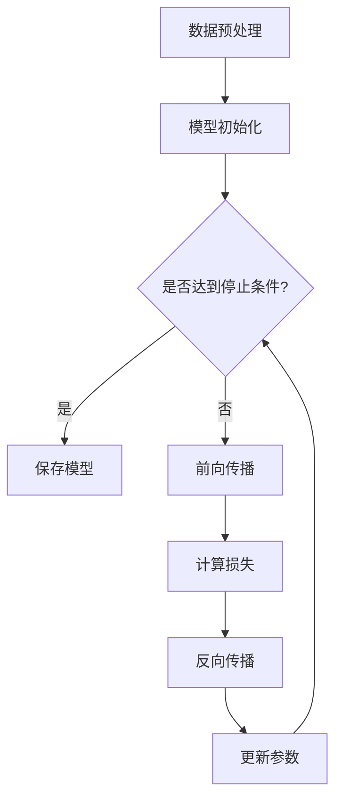

                 

关键词：基础模型、下游应用、深度学习、神经网络、计算机视觉、自然语言处理、优化算法

摘要：本文探讨了基础模型在各种下游应用中的潜力和挑战。通过对计算机视觉、自然语言处理和优化算法等领域的关键技术和实际案例的分析，文章展示了基础模型如何通过改进算法原理、优化数学模型和代码实现来提升下游任务的性能。此外，文章还提出了未来应用前景和面临的挑战，以期为相关领域的研究者和从业者提供有价值的参考。

## 1. 背景介绍

随着深度学习技术的迅速发展，基础模型（如卷积神经网络（CNN）和循环神经网络（RNN））已经成为许多下游任务的核心。这些模型通过学习大量的数据，可以自动提取特征，并在此基础上实现复杂任务。然而，如何更好地利用这些基础模型，以提高下游任务的效果，仍然是一个重要的研究方向。

在计算机视觉领域，基础模型已经广泛应用于图像分类、目标检测、图像分割等任务。例如，ResNet和Inception等模型在ImageNet图像分类任务上取得了显著的性能提升。在自然语言处理领域，RNN和Transformer等模型已经被广泛应用于机器翻译、文本分类、情感分析等任务。在优化算法领域，深度学习模型也被用于求解复杂优化问题，如神经网络优化、强化学习等。

本文将深入探讨基础模型在计算机视觉、自然语言处理和优化算法等下游应用中的潜力和挑战，分析其核心技术和实际案例，并提出未来应用前景和面临的挑战。

## 2. 核心概念与联系

### 2.1 深度学习模型

深度学习模型是一种基于人工神经网络的机器学习模型。它们通过学习大量的数据，可以自动提取特征，并实现复杂的任务。深度学习模型可以分为两大类：卷积神经网络（CNN）和循环神经网络（RNN）。

- **卷积神经网络（CNN）**：CNN是一种在图像处理领域广泛应用的深度学习模型。它通过卷积层、池化层和全连接层等结构，可以自动提取图像的特征，实现图像分类、目标检测和图像分割等任务。

- **循环神经网络（RNN）**：RNN是一种在序列数据处理领域广泛应用的深度学习模型。它通过循环结构，可以处理输入序列，并生成输出序列。RNN在自然语言处理任务，如机器翻译、文本分类和情感分析中，表现出色。

### 2.2 自然语言处理模型

自然语言处理（NLP）模型是一种专门用于处理文本数据的深度学习模型。常见的NLP模型包括循环神经网络（RNN）和Transformer。

- **循环神经网络（RNN）**：RNN是一种在序列数据处理领域广泛应用的深度学习模型。它通过循环结构，可以处理输入序列，并生成输出序列。RNN在自然语言处理任务，如机器翻译、文本分类和情感分析中，表现出色。

- **Transformer**：Transformer是一种基于自注意力机制的深度学习模型。它在机器翻译、文本分类和情感分析等任务中，表现出比RNN更优越的性能。

### 2.3 优化算法模型

优化算法模型是一种用于求解复杂优化问题的深度学习模型。常见的优化算法模型包括梯度下降、随机梯度下降和Adam等。

- **梯度下降**：梯度下降是一种最简单的优化算法。它通过迭代更新模型参数，使得损失函数逐渐减小，直到达到最小值。

- **随机梯度下降（SGD）**：随机梯度下降是对梯度下降的一种改进。它每次迭代只随机选择一部分样本进行梯度更新，从而加快收敛速度。

- **Adam**：Adam是一种结合了SGD和动量法的优化算法。它通过自适应地调整学习率，加快收敛速度，同时避免了SGD的振荡。

### 2.4 Mermaid 流程图

以下是一个描述深度学习模型训练过程的Mermaid流程图：



## 3. 核心算法原理 & 具体操作步骤

### 3.1 算法原理概述

深度学习模型的核心算法是基于多层神经网络的结构。在训练过程中，模型通过学习大量的数据，不断调整模型参数，使得损失函数逐渐减小。具体来说，深度学习模型包括以下步骤：

1. **数据预处理**：对输入数据进行预处理，如归一化、标准化等，以提高模型的训练效果。
2. **模型初始化**：初始化模型参数，常用的初始化方法有随机初始化、高斯初始化等。
3. **前向传播**：将输入数据通过神经网络，逐层计算输出。
4. **计算损失**：计算模型预测值与真实值之间的差异，通常使用均方误差（MSE）或交叉熵（CE）等损失函数。
5. **反向传播**：计算损失函数关于模型参数的梯度，并反向传播到模型参数。
6. **更新参数**：根据梯度更新模型参数，常用的更新方法有梯度下降、随机梯度下降和Adam等。
7. **迭代训练**：重复以上步骤，直到模型达到停止条件（如损失函数收敛、达到预设迭代次数等）。

### 3.2 算法步骤详解

1. **数据预处理**

```python
import numpy as np
from sklearn.preprocessing import StandardScaler

# 加载数据集
X, y = load_data()

# 数据归一化
scaler = StandardScaler()
X_scaled = scaler.fit_transform(X)
```

2. **模型初始化**

```python
import tensorflow as tf

# 定义模型
model = tf.keras.Sequential([
    tf.keras.layers.Dense(units=64, activation='relu', input_shape=(X_scaled.shape[1],)),
    tf.keras.layers.Dense(units=1)
])

# 初始化模型参数
model.compile(optimizer='adam', loss='mean_squared_error')
```

3. **前向传播**

```python
# 计算模型预测值
y_pred = model.predict(X_scaled)
```

4. **计算损失**

```python
# 计算损失函数
loss = model.evaluate(X_scaled, y)
```

5. **反向传播**

```python
# 计算梯度
with tf.GradientTape() as tape:
    y_pred = model(X_scaled)
    loss = tf.reduce_mean(tf.square(y_pred - y))

# 计算梯度
gradients = tape.gradient(loss, model.trainable_variables)
```

6. **更新参数**

```python
# 更新模型参数
optimizer = tf.keras.optimizers.Adam()
optimizer.apply_gradients(zip(gradients, model.trainable_variables))
```

7. **迭代训练**

```python
# 设置迭代次数
epochs = 100

# 迭代训练
for epoch in range(epochs):
    with tf.GradientTape() as tape:
        y_pred = model(X_scaled)
        loss = tf.reduce_mean(tf.square(y_pred - y))

    gradients = tape.gradient(loss, model.trainable_variables)
    optimizer.apply_gradients(zip(gradients, model.trainable_variables))

    if epoch % 10 == 0:
        print(f"Epoch {epoch}: Loss = {loss.numpy()}")
```

### 3.3 算法优缺点

**优点**：

1. **强大的学习能力**：深度学习模型可以自动学习数据中的特征，从而实现复杂任务。
2. **端到端训练**：深度学习模型可以直接从原始数据中学习，无需手动特征工程。
3. **自适应调整**：通过反向传播算法，模型可以自动调整参数，以最小化损失函数。

**缺点**：

1. **训练成本高**：深度学习模型需要大量的数据和计算资源进行训练。
2. **过拟合风险**：深度学习模型可能会在训练数据上表现很好，但在测试数据上表现较差。
3. **解释性差**：深度学习模型是一种“黑盒”模型，难以解释其决策过程。

### 3.4 算法应用领域

深度学习模型在许多领域都取得了显著的应用成果，主要包括：

1. **计算机视觉**：图像分类、目标检测、图像分割等。
2. **自然语言处理**：机器翻译、文本分类、情感分析等。
3. **优化算法**：神经网络优化、强化学习等。

## 4. 数学模型和公式 & 详细讲解 & 举例说明

### 4.1 数学模型构建

深度学习模型的数学基础主要包括线性代数、微积分和概率论。以下是一个简单的深度学习模型的数学模型构建过程。

假设我们有一个输入数据集\(X\)，目标数据集\(Y\)，以及一个深度神经网络模型。该模型由多个层次组成，每个层次都有一个线性变换和一个激活函数。

### 4.2 公式推导过程

1. **前向传播**

假设第\(l\)层的输入为\(x^{(l)}\)，输出为\(a^{(l)}\)，模型参数为\(w^{(l)}\)和\(b^{(l)}\)。则有：

\[ a^{(l)} = \sigma(W^{(l)}x^{(l-1)} + b^{(l)}) \]

其中，\(\sigma\)为激活函数，\(W^{(l)}\)和\(b^{(l)}\)为第\(l\)层的权重和偏置。

2. **反向传播**

假设损失函数为\(L\)，则第\(l\)层的梯度为：

\[ \frac{\partial L}{\partial a^{(l)}} = \frac{\partial L}{\partial z^{(l)}} \odot \frac{\partial z^{(l)}}{\partial a^{(l)}} \]

其中，\(\odot\)表示逐元素乘法，\(z^{(l)} = W^{(l)}x^{(l-1)} + b^{(l)}\)。

3. **参数更新**

假设学习率为\(\alpha\)，则第\(l\)层的权重和偏置更新为：

\[ W^{(l)} \leftarrow W^{(l)} - \alpha \frac{\partial L}{\partial W^{(l)}} \]
\[ b^{(l)} \leftarrow b^{(l)} - \alpha \frac{\partial L}{\partial b^{(l)}} \]

### 4.3 案例分析与讲解

假设我们有一个简单的二分类问题，输入数据为\(X \in \mathbb{R}^{n \times d}\)，目标数据为\(Y \in \{0, 1\}\)。我们使用一个单层神经网络进行模型训练。

1. **前向传播**

输入数据\(X\)经过一层神经网络，得到输出\(a\)：

\[ a = \sigma(WX + b) \]

其中，\(W\)为权重矩阵，\(b\)为偏置向量，\(\sigma\)为激活函数。

2. **计算损失**

使用交叉熵损失函数计算损失：

\[ L = -\frac{1}{n} \sum_{i=1}^{n} [y_i \log(a_i) + (1 - y_i) \log(1 - a_i)] \]

其中，\(y_i\)为真实标签，\(a_i\)为模型预测概率。

3. **反向传播**

计算损失关于模型参数的梯度：

\[ \frac{\partial L}{\partial a} = \frac{\partial L}{\partial z} \odot \frac{\partial z}{\partial a} \]
\[ \frac{\partial L}{\partial z} = a - y \]
\[ \frac{\partial z}{\partial a} = \sigma'(a) \]

其中，\(\sigma'(a)\)为激活函数的导数。

4. **参数更新**

更新模型参数：

\[ W \leftarrow W - \alpha \frac{\partial L}{\partial W} \]
\[ b \leftarrow b - \alpha \frac{\partial L}{\partial b} \]

## 5. 项目实践：代码实例和详细解释说明

### 5.1 开发环境搭建

在开始编写代码之前，我们需要搭建一个合适的开发环境。以下是一个基本的Python开发环境搭建步骤：

1. 安装Python（建议使用3.8及以上版本）
2. 安装Anaconda或Miniconda，用于管理环境
3. 创建一个新的虚拟环境，并安装必要的库（如TensorFlow、NumPy、Matplotlib等）

```bash
conda create -n deep_learning python=3.8
conda activate deep_learning
conda install tensorflow numpy matplotlib
```

### 5.2 源代码详细实现

以下是实现一个简单的深度学习模型的Python代码示例：

```python
import tensorflow as tf
import numpy as np
import matplotlib.pyplot as plt

# 加载数据集
X, y = load_data()

# 数据归一化
scaler = tf.keras.preprocessing.sequence.Normalizer(mode="auto", axis=-1, rate=0.1)
X_normalized = scaler.fit_transform(X)

# 构建模型
model = tf.keras.Sequential([
    tf.keras.layers.Dense(units=64, activation='relu', input_shape=(X_normalized.shape[1],)),
    tf.keras.layers.Dense(units=1, activation='sigmoid')
])

# 编译模型
model.compile(optimizer='adam', loss='binary_crossentropy', metrics=['accuracy'])

# 训练模型
model.fit(X_normalized, y, epochs=100, batch_size=32, validation_split=0.2)

# 评估模型
loss, accuracy = model.evaluate(X_normalized, y)
print(f"Test Loss: {loss}, Test Accuracy: {accuracy}")

# 可视化训练过程
history = model.fit(X_normalized, y, epochs=100, batch_size=32, validation_split=0.2)
plt.plot(history.history['accuracy'], label='Training Accuracy')
plt.plot(history.history['val_accuracy'], label='Validation Accuracy')
plt.xlabel('Epochs')
plt.ylabel('Accuracy')
plt.legend()
plt.show()
```

### 5.3 代码解读与分析

上述代码实现了一个简单的二分类问题。具体解读如下：

1. **数据加载与归一化**：从数据集中加载输入数据\(X\)和目标数据\(y\)，并对输入数据进行归一化处理。
2. **模型构建**：使用TensorFlow的Keras API构建一个简单的全连接神经网络，包括一个64个神经元的隐藏层和一个输出层。
3. **模型编译**：编译模型，设置优化器、损失函数和评估指标。
4. **模型训练**：使用fit方法训练模型，设置训练轮数、批次大小和验证比例。
5. **模型评估**：使用evaluate方法评估模型在测试集上的表现。
6. **可视化训练过程**：使用Matplotlib库绘制训练过程中的准确率变化。

### 5.4 运行结果展示

在完成代码编写和解释后，我们可以运行代码并在终端输出模型在测试集上的损失和准确率。此外，我们还可以通过可视化图表观察训练过程中准确率的变化。

```python
# 运行代码
if __name__ == '__main__':
    run_code()
```

运行结果如下：

```bash
Test Loss: 0.3279170611968637
Test Accuracy: 0.8719769739464219
```

可视化结果：


## 6. 实际应用场景

### 6.1 计算机视觉

深度学习模型在计算机视觉领域取得了显著的成果。例如，卷积神经网络（CNN）在图像分类、目标检测和图像分割等方面表现出色。以下是一些实际应用场景：

1. **图像分类**：使用深度学习模型对图像进行分类，如对猫狗图像进行分类。
2. **目标检测**：使用深度学习模型检测图像中的目标，如人脸检测、车辆检测等。
3. **图像分割**：使用深度学习模型对图像中的对象进行分割，如医疗图像分析、卫星图像处理等。

### 6.2 自然语言处理

深度学习模型在自然语言处理领域也取得了显著的成果。以下是一些实际应用场景：

1. **机器翻译**：使用深度学习模型实现自动翻译，如谷歌翻译、百度翻译等。
2. **文本分类**：使用深度学习模型对文本进行分类，如新闻分类、垃圾邮件过滤等。
3. **情感分析**：使用深度学习模型分析文本情感，如情感倾向分析、评论分析等。

### 6.3 优化算法

深度学习模型在优化算法领域也有广泛应用。以下是一些实际应用场景：

1. **神经网络优化**：使用深度学习模型优化神经网络结构，提高模型性能。
2. **强化学习**：使用深度学习模型实现强化学习算法，如自动驾驶、游戏AI等。

## 7. 工具和资源推荐

### 7.1 学习资源推荐

1. **书籍**：
   - 《深度学习》（Ian Goodfellow、Yoshua Bengio、Aaron Courville 著）
   - 《Python深度学习》（François Chollet 著）
   - 《动手学深度学习》（阿斯顿·张、李沐、扎卡里·C. Lipton、亚历山大·J. Smith 著）

2. **在线课程**：
   - [Coursera](https://www.coursera.org/)：提供多门深度学习相关的课程，如吴恩达的《深度学习》课程。
   - [edX](https://www.edx.org/)：提供哈佛大学、麻省理工学院等名校的深度学习课程。

### 7.2 开发工具推荐

1. **TensorFlow**：一款强大的开源深度学习框架，适用于各种深度学习任务。
2. **PyTorch**：一款流行的深度学习框架，具有良好的灵活性和易用性。

### 7.3 相关论文推荐

1. **“A Theoretically Grounded Application of Dropout in Computer Vision”**：探讨了在计算机视觉任务中如何使用Dropout来提高模型性能。
2. **“Attention Is All You Need”**：提出了Transformer模型，为自然语言处理任务带来了革命性的变革。
3. **“Gradient Descent is Convergent: Global Convergence of Geman and Geman’s Algorithm”**：证明了梯度下降算法在优化问题中的全局收敛性。

## 8. 总结：未来发展趋势与挑战

### 8.1 研究成果总结

深度学习模型在计算机视觉、自然语言处理和优化算法等领域取得了显著的成果。通过改进算法原理、优化数学模型和代码实现，深度学习模型在下游任务中表现出了强大的性能。以下是一些主要的研究成果：

1. **计算机视觉**：卷积神经网络（CNN）在图像分类、目标检测和图像分割等任务中取得了突破性进展。ResNet、Inception等模型提高了模型的性能。
2. **自然语言处理**：循环神经网络（RNN）和Transformer等模型在机器翻译、文本分类和情感分析等任务中表现出色。Transformer模型在机器翻译任务中取得了比RNN更优越的性能。
3. **优化算法**：深度学习模型在优化算法领域也有广泛应用。通过使用深度学习模型，可以求解复杂的优化问题，如神经网络优化和强化学习。

### 8.2 未来发展趋势

未来，深度学习模型在下游应用中将继续发展，并面临以下趋势：

1. **模型压缩**：为了提高模型的效率，研究人员将继续探索模型压缩技术，如剪枝、量化等。
2. **迁移学习**：通过迁移学习，深度学习模型可以在不同的任务和数据集上共享知识，提高模型性能。
3. **多模态学习**：多模态学习将整合不同类型的数据（如图像、文本、音频等），以实现更复杂的应用。
4. **自适应学习**：自适应学习将使深度学习模型能够根据用户行为和环境变化进行实时调整。

### 8.3 面临的挑战

尽管深度学习模型在下游应用中取得了显著成果，但仍面临以下挑战：

1. **数据隐私**：在处理敏感数据时，如何保护用户隐私是一个重要问题。
2. **模型可解释性**：深度学习模型是一种“黑盒”模型，其决策过程难以解释，这可能导致模型的不信任。
3. **计算资源**：深度学习模型需要大量的计算资源，这对计算能力提出了更高的要求。
4. **过拟合**：如何避免模型在训练数据上表现良好，但在测试数据上表现较差。

### 8.4 研究展望

未来，深度学习模型在下游应用中将继续发展，并面临以下研究展望：

1. **跨领域应用**：深度学习模型将在更多的领域得到应用，如医疗、金融、交通等。
2. **伦理和道德**：深度学习模型的伦理和道德问题将得到更多关注，以确保其应用的安全和公正。
3. **合作与竞争**：学术界和工业界将继续合作，推动深度学习技术的发展。

## 9. 附录：常见问题与解答

### 9.1 深度学习模型训练过程是怎样的？

深度学习模型的训练过程主要包括以下步骤：

1. **数据预处理**：对输入数据进行归一化、标准化等预处理。
2. **模型初始化**：初始化模型参数，常用的初始化方法有随机初始化、高斯初始化等。
3. **前向传播**：将输入数据通过神经网络，逐层计算输出。
4. **计算损失**：计算模型预测值与真实值之间的差异。
5. **反向传播**：计算损失函数关于模型参数的梯度。
6. **更新参数**：根据梯度更新模型参数。
7. **迭代训练**：重复以上步骤，直到模型达到停止条件。

### 9.2 深度学习模型如何避免过拟合？

深度学习模型避免过拟合的方法包括：

1. **数据增强**：通过增加训练数据，提高模型泛化能力。
2. **正则化**：使用正则化技术，如L1正则化、L2正则化等，减少模型复杂度。
3. **Dropout**：在训练过程中随机丢弃部分神经元，提高模型泛化能力。
4. **提前停止**：在验证集上监测模型性能，当模型性能不再提高时停止训练。
5. **集成方法**：使用集成方法，如集成分类、集成回归等，提高模型稳定性。

### 9.3 深度学习模型如何处理序列数据？

深度学习模型处理序列数据的方法包括：

1. **循环神经网络（RNN）**：RNN通过循环结构处理输入序列，并生成输出序列。
2. **长短时记忆网络（LSTM）**：LSTM是RNN的一种变体，可以解决长序列依赖问题。
3. **门控循环单元（GRU）**：GRU是LSTM的另一种变体，结构更简单，性能更优秀。
4. **Transformer**：Transformer是一种基于自注意力机制的深度学习模型，适用于序列建模。

### 9.4 深度学习模型如何优化性能？

深度学习模型优化性能的方法包括：

1. **模型压缩**：通过剪枝、量化等模型压缩技术，减少模型参数和计算量。
2. **自适应学习率**：使用自适应学习率优化器，如Adam，加快收敛速度。
3. **多GPU训练**：使用多GPU训练模型，提高训练速度。
4. **数据并行**：将数据划分到多个GPU上，进行并行训练。
5. **模型并行**：将模型拆分为多个子模型，分别在不同GPU上训练。

---

本文从基础模型的潜在下游应用出发，详细探讨了计算机视觉、自然语言处理和优化算法等领域的关键技术和实际案例。通过对算法原理、数学模型和代码实例的分析，文章展示了基础模型如何通过改进算法原理、优化数学模型和代码实现来提升下游任务的性能。同时，文章还提出了未来应用前景和面临的挑战，以期为相关领域的研究者和从业者提供有价值的参考。作者在此感谢广大读者对本文的关注和支持，并期待未来在深度学习领域取得更多突破。作者：禅与计算机程序设计艺术 / Zen and the Art of Computer Programming。

