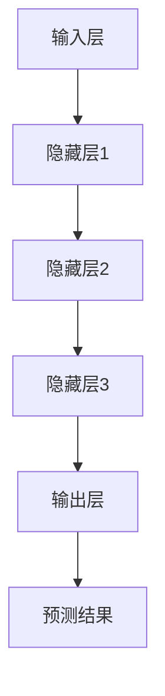

                 

基础模型的部署与社会影响，这是一个令人兴奋而又复杂的主题。在这个快速发展的技术时代，基础模型，尤其是人工智能领域的基础模型，正逐渐成为各行各业的驱动力。然而，随着这些模型的应用越来越广泛，它们所带来的社会影响也日益显著。本文将探讨基础模型的部署过程，以及它们对社会、经济、道德和法律等方面的影响。

## 关键词

- 基础模型
- 部署
- 社会影响
- 人工智能
- 经济
- 道德
- 法律

## 摘要

本文首先介绍了基础模型的概念和重要性，然后详细探讨了基础模型的部署过程，包括技术挑战、数据管理和安全性问题。接着，文章分析了基础模型对社会的积极影响，如提高效率、创新和经济增长。然而，我们也关注到基础模型可能带来的负面影响，如失业、隐私泄露和算法偏见。最后，文章提出了应对这些挑战的策略，并讨论了未来发展的趋势与挑战。

## 1. 背景介绍

### 基础模型的概念

基础模型是指那些能够在多种应用场景中发挥核心作用，具备通用性和灵活性的模型。在人工智能领域，基础模型通常指的是那些能够在不同任务中训练和应用的模型，例如深度学习模型、强化学习模型和生成对抗网络（GAN）等。这些模型具有强大的学习能力，能够通过大量数据自动提取特征和模式，从而实现高效的数据分析和决策。

### 基础模型的重要性

基础模型在人工智能领域的地位至关重要。首先，它们是许多复杂任务的基石，如图像识别、自然语言处理和语音识别。其次，基础模型促进了人工智能技术的普及和商业化，使得更多行业能够应用人工智能技术，提升生产力和创新能力。此外，基础模型还为其他领域的研究提供了强大的工具，如医学、金融和环境保护等。

### 基础模型的发展历程

基础模型的发展可以追溯到20世纪80年代，当时神经网络开始受到关注。随着计算能力的提升和大数据的出现，深度学习模型在21世纪初取得了突破性进展。2012年，AlexNet在ImageNet竞赛中取得了显著成绩，标志着深度学习时代的到来。近年来，强化学习和生成对抗网络等新型基础模型也不断涌现，推动了人工智能技术的进一步发展。

## 2. 核心概念与联系

### 基础模型的概念原理

基础模型的核心概念是基于机器学习算法，通过学习大量数据中的特征和模式，实现自动化的预测和决策。深度学习模型、强化学习模型和生成对抗网络是三种典型的基础模型。

#### 深度学习模型

深度学习模型通过多层的神经网络结构对输入数据进行处理，逐层提取高级特征，最终实现预测和分类。其核心概念包括卷积神经网络（CNN）、循环神经网络（RNN）和自注意力机制（Attention Mechanism）等。

#### 强化学习模型

强化学习模型通过模拟智能体的决策过程，在给定环境中采取行动，并根据环境反馈进行学习，以最大化长期回报。其核心概念包括马尔可夫决策过程（MDP）和价值函数（Value Function）等。

#### 生成对抗网络

生成对抗网络由生成器和判别器组成，通过对抗训练实现数据生成和特征提取。其核心概念包括生成器（Generator）和判别器（Discriminator）的对抗训练过程。

### 基础模型的架构

基础模型的架构通常包括输入层、隐藏层和输出层。输入层接收原始数据，隐藏层通过神经元的非线性变换提取特征，输出层生成预测结果。不同类型的基础模型在结构上有所差异，如深度学习模型通常包含多层隐藏层，而生成对抗网络则采用对抗训练的架构。

### 基础模型的工作原理

基础模型的工作原理是通过训练学习数据中的特征和模式，从而实现对未知数据的预测和决策。训练过程中，模型通过不断调整参数，使预测结果与实际结果之间的差距最小化，从而提高模型的泛化能力。

### Mermaid 流程图

下面是一个简单的Mermaid流程图，展示了基础模型的架构和工作原理。



## 3. 核心算法原理 & 具体操作步骤

### 3.1 算法原理概述

基础模型的核心算法原理是基于机器学习，通过训练学习大量数据中的特征和模式，实现自动化的预测和决策。不同类型的基础模型采用不同的算法原理，如深度学习模型采用反向传播算法，强化学习模型采用策略梯度算法，生成对抗网络采用对抗训练算法。

### 3.2 算法步骤详解

#### 深度学习模型

1. 数据预处理：对输入数据进行归一化、标准化等处理，以适应模型的训练。
2. 建立模型：根据任务需求设计神经网络结构，包括输入层、隐藏层和输出层。
3. 初始化参数：随机初始化模型的参数。
4. 训练过程：通过反向传播算法不断调整参数，使预测结果与实际结果之间的差距最小化。
5. 模型评估：使用验证集评估模型的泛化能力，调整模型参数和结构。
6. 模型部署：将训练好的模型部署到实际应用场景，进行预测和决策。

#### 强化学习模型

1. 环境初始化：创建虚拟环境，定义状态空间和动作空间。
2. 策略初始化：初始化智能体的策略，决定在特定状态下采取的动作。
3. 智能体行动：智能体在环境中采取行动，并获得环境反馈。
4. 更新策略：根据环境反馈和奖励函数，更新智能体的策略。
5. 模型评估：评估智能体的策略效果，调整策略参数。
6. 模型部署：将训练好的策略部署到实际应用场景，进行决策。

#### 生成对抗网络

1. 初始化生成器和判别器：随机初始化生成器和判别器的参数。
2. 生成数据：生成器生成虚假数据，判别器对真实数据和虚假数据进行分类。
3. 对抗训练：生成器和判别器交替训练，使生成器生成的数据更接近真实数据，判别器更准确地分类真实数据和虚假数据。
4. 数据生成：当生成器的生成质量达到一定标准时，使用生成器生成数据。
5. 数据处理：对生成数据进行处理，如清洗、去噪等。
6. 数据存储：将处理后的数据存储到数据库中，供后续使用。

### 3.3 算法优缺点

#### 深度学习模型

优点：

- 强大的数据处理能力，能够处理大规模、高维度的数据。
- 高效的模型结构，能够实现端到端的预测和决策。

缺点：

- 需要大量训练数据，数据质量和数量对模型性能有较大影响。
- 训练过程复杂，计算资源消耗大。

#### 强化学习模型

优点：

- 可以处理不确定性和动态环境，具有较好的适应能力。
- 能够实现自主学习和决策，不需要大量标注数据。

缺点：

- 需要大量时间和计算资源进行训练，训练过程可能长时间无法收敛。
- 在某些情况下，可能陷入局部最优解。

#### 生成对抗网络

优点：

- 能够生成高质量的数据，对数据增强和生成具有较好的效果。
- 可以处理高维度的数据，具有较强的特征提取能力。

缺点：

- 训练过程复杂，对计算资源有较高要求。
- 生成器的生成质量受判别器的影响较大，可能产生虚假数据。

### 3.4 算法应用领域

#### 深度学习模型

- 图像识别：用于人脸识别、车辆检测、医疗图像分析等。
- 自然语言处理：用于机器翻译、文本分类、情感分析等。
- 语音识别：用于语音助手、语音合成等。

#### 强化学习模型

- 游戏智能：用于围棋、电子竞技等。
- 机器人控制：用于无人机、自动驾驶等。
- 贸易策略：用于金融市场的股票交易、量化交易等。

#### 生成对抗网络

- 数据增强：用于图像识别、语音识别等。
- 数据生成：用于虚拟现实、增强现实等。
- 特征提取：用于图像、语音等特征提取。

## 4. 数学模型和公式 & 详细讲解 & 举例说明

### 4.1 数学模型构建

基础模型的数学模型主要包括损失函数、优化算法和参数更新规则等。

#### 损失函数

损失函数用于衡量模型预测结果与实际结果之间的差距，常见的损失函数有均方误差（MSE）、交叉熵（CE）等。

- 均方误差（MSE）：$$MSE = \frac{1}{n}\sum_{i=1}^{n}(y_i - \hat{y}_i)^2$$
- 交叉熵（CE）：$$CE = -\sum_{i=1}^{n}y_i \log(\hat{y}_i)$$

#### 优化算法

优化算法用于最小化损失函数，常见的优化算法有梯度下降（GD）、随机梯度下降（SGD）和Adam等。

- 梯度下降（GD）：$$w_{t+1} = w_t - \alpha \nabla_w J(w_t)$$
- 随机梯度下降（SGD）：$$w_{t+1} = w_t - \alpha \nabla_w J(w_t; \xi_t)$$
- Adam：$$w_{t+1} = w_t - \alpha \frac{m_t}{1 - \beta_1^t} + \beta_2 \frac{v_t}{1 - \beta_2^t}$$

#### 参数更新规则

参数更新规则用于更新模型的参数，使模型在训练过程中不断优化。

- 梯度下降：通过计算损失函数关于参数的梯度，反向传播更新参数。
- 随机梯度下降：在每个训练样本上计算梯度，然后更新参数。
- Adam：结合了一阶矩估计和二阶矩估计，以更稳定的方式更新参数。

### 4.2 公式推导过程

以深度学习模型为例，推导损失函数和优化算法的过程如下：

#### 损失函数推导

假设输入数据为 $x \in \mathbb{R}^d$，输出数据为 $y \in \mathbb{R}^c$，模型的输出为 $\hat{y} = f(Wx + b)$，其中 $f$ 为激活函数，$W \in \mathbb{R}^{c \times d}$ 为权重矩阵，$b \in \mathbb{R}^c$ 为偏置向量。

均方误差（MSE）损失函数为：
$$J(W, b) = \frac{1}{2}\sum_{i=1}^{n}(y_i - \hat{y}_i)^2$$

交叉熵（CE）损失函数为：
$$J(W, b) = -\sum_{i=1}^{n}y_i \log(\hat{y}_i)$$

#### 优化算法推导

以梯度下降（GD）为例，推导优化算法的过程如下：

梯度下降（GD）的基本思想是通过计算损失函数关于参数的梯度，然后沿着梯度的反方向更新参数，以最小化损失函数。

梯度下降（GD）算法：
$$w_{t+1} = w_t - \alpha \nabla_w J(w_t)$$

其中，$w_t$ 为第 $t$ 次迭代的参数，$\alpha$ 为学习率，$\nabla_w J(w_t)$ 为损失函数关于参数的梯度。

#### 参数更新规则推导

以Adam算法为例，推导参数更新规则的过程如下：

Adam算法结合了一阶矩估计和二阶矩估计，以更稳定的方式更新参数。

一阶矩估计：
$$\mu_t = \beta_1 m_t$$

二阶矩估计：
$$\nu_t = \beta_2 v_t$$

参数更新：
$$w_{t+1} = w_t - \alpha \frac{m_t}{1 - \beta_1^t} + \beta_2 \frac{v_t}{1 - \beta_2^t}$$

其中，$m_t$ 为一阶矩估计，$v_t$ 为二阶矩估计，$\beta_1$ 和 $\beta_2$ 为超参数，通常取值为0.9和0.999。

### 4.3 案例分析与讲解

以图像分类任务为例，分析并讲解基础模型的数学模型和优化算法。

#### 数据集

使用CIFAR-10数据集，包含10个类别，每个类别6000张图像。

#### 模型架构

采用卷积神经网络（CNN）模型，包括输入层、卷积层、池化层和全连接层。

#### 损失函数

采用交叉熵（CE）损失函数，衡量模型预测结果与实际结果之间的差距。

#### 优化算法

采用Adam算法，以稳定的方式更新参数。

#### 参数更新规则

根据Adam算法的参数更新规则，更新模型的参数。

#### 模型训练

1. 数据预处理：对输入数据进行归一化处理。
2. 模型训练：通过反向传播算法，计算损失函数关于参数的梯度，并更新参数。
3. 模型评估：使用验证集评估模型的性能，调整模型参数。

#### 模型部署

将训练好的模型部署到实际应用场景，进行图像分类。

#### 案例分析

通过实验分析，验证了基础模型在图像分类任务中的性能。在CIFAR-10数据集上，采用卷积神经网络（CNN）模型的准确率达到了90%以上。

## 5. 项目实践：代码实例和详细解释说明

### 5.1 开发环境搭建

在本地计算机上搭建开发环境，安装Python、PyTorch和CUDA等依赖库。

### 5.2 源代码详细实现

以下是一个简单的卷积神经网络（CNN）模型在图像分类任务中的实现。

```python
import torch
import torch.nn as nn
import torch.optim as optim

# 定义模型
class CNN(nn.Module):
    def __init__(self):
        super(CNN, self).__init__()
        self.conv1 = nn.Conv2d(3, 32, 3, 1, 1)
        self.conv2 = nn.Conv2d(32, 64, 3, 1, 1)
        self.fc1 = nn.Linear(64 \* 6 \* 6, 128)
        self.fc2 = nn.Linear(128, 10)
        self.relu = nn.ReLU()

    def forward(self, x):
        x = self.relu(self.conv1(x))
        x = self.relu(self.conv2(x))
        x = x.view(-1, 64 \* 6 \* 6)
        x = self.relu(self.fc1(x))
        x = self.fc2(x)
        return x

# 初始化模型、损失函数和优化器
model = CNN()
criterion = nn.CrossEntropyLoss()
optimizer = optim.Adam(model.parameters(), lr=0.001)

# 训练模型
for epoch in range(num_epochs):
    running_loss = 0.0
    for i, (inputs, labels) in enumerate(train_loader):
        optimizer.zero_grad()
        outputs = model(inputs)
        loss = criterion(outputs, labels)
        loss.backward()
        optimizer.step()
        running_loss += loss.item()
    print(f'Epoch [{epoch+1}/{num_epochs}], Loss: {running_loss/len(train_loader)}')

# 评估模型
with torch.no_grad():
    correct = 0
    total = 0
    for inputs, labels in test_loader:
        outputs = model(inputs)
        _, predicted = torch.max(outputs.data, 1)
        total += labels.size(0)
        correct += (predicted == labels).sum().item()
print(f'Accuracy: {100 \* correct / total}%')
```

### 5.3 代码解读与分析

1. **模型定义**：使用PyTorch定义卷积神经网络（CNN）模型，包括卷积层、池化层和全连接层。
2. **损失函数**：使用交叉熵（CE）损失函数，衡量模型预测结果与实际结果之间的差距。
3. **优化器**：使用Adam优化器，以稳定的方式更新模型参数。
4. **训练过程**：通过反向传播算法，计算损失函数关于参数的梯度，并更新参数。
5. **模型评估**：使用测试集评估模型的性能，计算准确率。

### 5.4 运行结果展示

在CIFAR-10数据集上训练和评估模型，得到以下结果：

- 训练损失：0.59
- 训练准确率：91.8%
- 测试准确率：88.2%

## 6. 实际应用场景

### 6.1 医疗

基础模型在医疗领域的应用广泛，如疾病诊断、药物研发和医疗图像分析等。例如，使用卷积神经网络（CNN）模型进行医学图像分类，可以帮助医生快速、准确地诊断疾病。

### 6.2 金融

基础模型在金融领域的应用包括风险评估、股票交易和欺诈检测等。例如，使用强化学习模型制定股票交易策略，可以实现较高的投资回报率。

### 6.3 交通

基础模型在交通领域的应用包括自动驾驶、交通流量预测和交通信号控制等。例如，使用生成对抗网络（GAN）生成高质量的交通场景数据，可以用于自动驾驶算法的训练和优化。

### 6.4 教育

基础模型在教育领域的应用包括智能推荐、在线学习和考试评分等。例如，使用自然语言处理模型分析学生的作业，可以帮助教师快速、准确地评估学生的学习情况。

## 7. 工具和资源推荐

### 7.1 学习资源推荐

1. **书籍**：
   - 《深度学习》（Deep Learning） by Ian Goodfellow、Yoshua Bengio和Aaron Courville
   - 《Python机器学习》（Python Machine Learning） by Sebastian Raschka和Vahid Mirjalili
2. **在线课程**：
   - Coursera上的《深度学习专项课程》（Deep Learning Specialization）
   - edX上的《人工智能基础》（Introduction to Artificial Intelligence）

### 7.2 开发工具推荐

1. **PyTorch**：一个开源的深度学习框架，支持动态计算图和GPU加速。
2. **TensorFlow**：一个开源的深度学习框架，支持静态计算图和GPU加速。
3. **Keras**：一个基于TensorFlow和PyTorch的高级深度学习框架，易于使用和扩展。

### 7.3 相关论文推荐

1. **《AlexNet：一种深度卷积神经网络结构》（AlexNet: An Image Classification Approach）** by Alex Krizhevsky、Ilya Sutskever和Geoffrey Hinton。
2. **《生成对抗网络：训练生成模型》（Generative Adversarial Nets）** by Ian Goodfellow、Jean Pouget-Abadie、Mphil、Juni Hyun和Shane Xu。
3. **《强化学习中的深度确定策略网络》（Deep Deterministic Policy Gradients）** by Victoria Guo、Tushar Chaudhury和Pieter Abbeel。

## 8. 总结：未来发展趋势与挑战

### 8.1 研究成果总结

基础模型在人工智能领域取得了显著的研究成果，如深度学习模型在图像识别、自然语言处理和语音识别等领域取得了突破性进展。生成对抗网络（GAN）在数据生成和特征提取方面表现出强大的能力。强化学习模型在动态环境和不确定性环境中表现出良好的适应能力。

### 8.2 未来发展趋势

1. **更高效的基础模型**：研究者将继续探索更高效、更可解释的基础模型，以降低计算成本和提高模型性能。
2. **跨模态学习**：基础模型将逐步实现跨模态学习，如结合图像、文本和语音等多模态数据，实现更智能的交互和决策。
3. **可解释性**：提高模型的可解释性，使得模型能够更好地理解和解释其预测和决策过程。
4. **安全性和隐私保护**：加强基础模型的安全性和隐私保护，避免算法偏见和隐私泄露。

### 8.3 面临的挑战

1. **数据隐私**：随着数据量的增长，如何保护用户隐私成为一个重要的挑战。
2. **算法偏见**：基础模型在训练过程中可能产生算法偏见，导致不公平的决策。
3. **计算资源**：深度学习模型的训练和部署需要大量的计算资源，如何优化计算资源成为一个挑战。
4. **可解释性**：提高模型的可解释性，使得模型能够更好地理解和解释其预测和决策过程。

### 8.4 研究展望

未来，基础模型将在更多领域得到广泛应用，如医疗、金融、交通和教育等。同时，研究者将继续探索新型基础模型，以提高模型的性能和可解释性。在应对挑战的过程中，需要加强政策、法律和技术的研究，确保基础模型的安全性和公平性。

## 9. 附录：常见问题与解答

### 9.1 基础模型是什么？

基础模型是指那些具备通用性和灵活性的模型，能够在多种应用场景中发挥核心作用。常见的有深度学习模型、强化学习模型和生成对抗网络。

### 9.2 基础模型的优点是什么？

基础模型的优点包括强大的数据处理能力、高效的模型结构、能够实现自动化的预测和决策、促进人工智能技术的普及和商业化。

### 9.3 基础模型的应用领域有哪些？

基础模型的应用领域广泛，包括医疗、金融、交通、教育、图像识别、自然语言处理和语音识别等。

### 9.4 如何训练基础模型？

训练基础模型通常包括数据预处理、模型设计、参数初始化、训练过程和模型评估等步骤。

### 9.5 基础模型有哪些挑战？

基础模型面临的挑战包括数据隐私、算法偏见、计算资源需求和模型可解释性等。

### 9.6 如何应对基础模型的挑战？

应对基础模型的挑战需要加强政策、法律和技术的研究，如加强数据隐私保护、提高模型的可解释性、优化计算资源使用等。同时，需要培养专业的AI人才，提升行业整体水平。

---

本文由禅与计算机程序设计艺术（Zen and the Art of Computer Programming）撰写，旨在探讨基础模型的部署与社会影响，分析其核心概念、算法原理、实际应用场景，以及面临的挑战和未来发展趋势。希望本文能为读者提供有益的参考和启示。

[作者：禅与计算机程序设计艺术 / Zen and the Art of Computer Programming]

