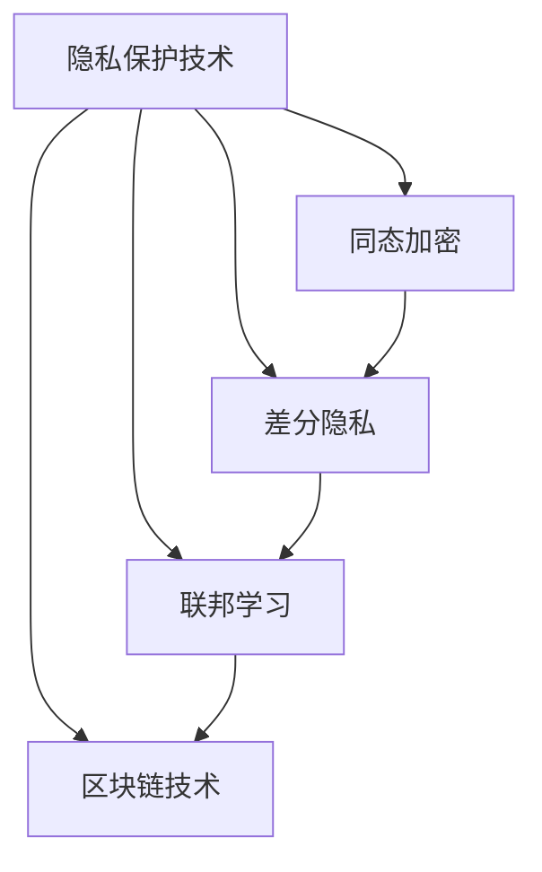

                 

在当今的信息时代，基础模型的应用越来越广泛，从自然语言处理、计算机视觉到推荐系统等各个领域。然而，随着这些模型的能力不断增强，隐私和安全问题也日益凸显。本文将深入探讨基础模型的隐私与安全问题，旨在为相关领域的从业者和研究人员提供有价值的参考。

## 关键词

- 基础模型
- 隐私保护
- 安全问题
- 加密技术
- 机器学习

## 摘要

本文首先介绍了基础模型的发展背景和重要性，然后分析了基础模型在隐私保护和安全性方面面临的挑战。接着，详细探讨了各种隐私保护和安全技术的原理和应用，包括同态加密、差分隐私、联邦学习和区块链技术。最后，文章总结了当前的研究成果，并展望了未来的发展趋势。

## 1. 背景介绍

随着深度学习和大数据技术的快速发展，基础模型在各个领域取得了显著的成果。例如，深度神经网络在图像识别、语音识别和自然语言处理等领域表现出了强大的能力。这些模型通过对大规模数据进行训练，能够提取出数据的潜在特征，从而实现复杂的任务。

然而，基础模型的发展也带来了一系列的隐私和安全问题。首先，模型的训练和部署过程中会涉及大量的敏感数据，如个人身份信息、医疗记录和金融数据等。这些数据一旦泄露，可能会对个人隐私造成严重威胁。其次，基础模型在处理数据时可能存在信息泄露的风险，例如，通过模型输出可以推断出输入数据的某些特征。此外，一些恶意攻击者可能试图通过篡改模型参数或注入恶意样本，从而破坏模型的正常运作。

因此，如何确保基础模型在隐私保护和安全性方面的可靠性，已经成为当前研究的热点问题。

## 2. 核心概念与联系

### 2.1 隐私保护技术

隐私保护技术在基础模型的应用中扮演着重要角色。常见的隐私保护技术包括同态加密、差分隐私、联邦学习和区块链技术等。

**同态加密**：同态加密是一种加密技术，允许在加密数据上进行计算，而无需解密。这样，即使数据在传输或存储过程中被截获，攻击者也无法获取原始数据。同态加密技术为保护数据隐私提供了一种有效手段，但目前的同态加密算法在计算效率和安全性之间仍存在一定权衡。

**差分隐私**：差分隐私是一种统计隐私保护技术，通过对数据进行扰动，使得攻击者无法通过分析数据集推断出单个数据的具体值。差分隐私技术广泛应用于数据库查询、数据挖掘和机器学习等领域，可以有效保护用户隐私。

**联邦学习**：联邦学习是一种分布式机器学习技术，参与学习的多个节点各自持有部分数据，并在不共享数据的情况下共同训练模型。联邦学习技术可以有效保护数据隐私，但也面临计算效率和模型性能的挑战。

**区块链技术**：区块链技术通过去中心化和加密算法，确保数据的不可篡改性和可追溯性。区块链技术在隐私保护和安全领域具有广泛应用，例如数字身份验证、供应链管理和金融交易等。

### 2.2 安全性技术

安全性技术在基础模型的应用中同样至关重要。以下介绍几种常见的安全性技术：

**加密技术**：加密技术通过将数据转换为密文，确保数据在传输和存储过程中的安全性。常见的加密技术包括对称加密和非对称加密。对称加密算法速度快，但密钥管理复杂；非对称加密算法安全性高，但计算复杂度较大。

**访问控制**：访问控制技术通过权限管理和身份验证，确保只有授权用户才能访问敏感数据。常见的访问控制技术包括基于角色的访问控制（RBAC）和基于属性的访问控制（ABAC）。

**入侵检测**：入侵检测技术通过实时监控系统活动，检测并响应潜在的安全威胁。常见的入侵检测技术包括基于规则的检测和基于行为的检测。

### 2.3 Mermaid 流程图

以下是一个简单的 Mermaid 流程图，展示了隐私保护和安全性技术的联系：



## 3. 核心算法原理 & 具体操作步骤

### 3.1 算法原理概述

隐私保护和安全性技术的实现通常基于以下核心算法原理：

**同态加密**：同态加密允许在加密数据上进行计算，而无需解密。具体而言，同态加密算法定义了两种运算：加密数据的加法和加密数据的乘法。通过这些运算，可以在密文空间中实现数据的加、减、乘等操作，从而实现对加密数据的计算。

**差分隐私**：差分隐私通过在数据集中添加随机噪声，使得攻击者无法通过分析数据集推断出单个数据的具体值。差分隐私的核心算法包括拉普拉斯机制和指数机制。拉普拉斯机制通过添加正态分布的噪声来实现差分隐私；指数机制通过添加指数分布的噪声来实现差分隐私。

**联邦学习**：联邦学习通过分布式训练方式，实现多个节点共同训练模型。联邦学习的核心算法包括模型聚合和模型更新。模型聚合算法用于将多个节点的局部模型聚合为全局模型；模型更新算法用于在每个节点上更新局部模型。

**区块链技术**：区块链技术通过去中心化和加密算法，确保数据的不可篡改性和可追溯性。区块链的核心算法包括区块生成、区块验证和区块链更新。区块生成算法用于生成新的区块；区块验证算法用于验证区块的有效性；区块链更新算法用于更新区块链数据。

### 3.2 算法步骤详解

**同态加密**

1. 数据加密：将原始数据转换为密文。
2. 数据计算：在密文空间中执行计算操作。
3. 数据解密：将密文解密为原始数据。

**差分隐私**

1. 数据采集：收集原始数据。
2. 数据扰动：对数据添加噪声。
3. 数据分析：分析扰动后的数据。

**联邦学习**

1. 数据分配：将数据分配给各个节点。
2. 模型训练：在每个节点上训练局部模型。
3. 模型聚合：将局部模型聚合为全局模型。
4. 模型更新：在每个节点上更新局部模型。

**区块链技术**

1. 区块生成：生成新的区块。
2. 区块验证：验证区块的有效性。
3. 区块添加：将区块添加到区块链。
4. 区块更新：更新区块链数据。

### 3.3 算法优缺点

**同态加密**

**优点**：无需解密数据，可以在加密数据上直接进行计算，提高了数据安全性。

**缺点**：计算复杂度较大，效率较低；当前的同态加密算法在实现上仍存在一定挑战。

**差分隐私**

**优点**：可以有效保护用户隐私，适用于各种数据分析和机器学习场景。

**缺点**：在保护隐私的同时，可能会引入一定的误差；不同机制的选择对隐私保护和性能有较大影响。

**联邦学习**

**优点**：可以保护数据隐私，降低数据传输风险；适用于分布式数据场景。

**缺点**：计算效率和模型性能受到一定影响；需要解决节点间的通信和同步问题。

**区块链技术**

**优点**：确保数据的不可篡改性和可追溯性，提高数据安全性。

**缺点**：计算复杂度较高，效率较低；去中心化可能导致共识问题。

### 3.4 算法应用领域

**同态加密**：在医疗数据分析和金融数据处理等领域，同态加密技术可以有效保护数据隐私。

**差分隐私**：在数据挖掘、推荐系统和自然语言处理等领域，差分隐私技术可以应用于保护用户隐私。

**联邦学习**：在智能家居、智能医疗和智慧城市等领域，联邦学习技术可以应用于分布式数据处理和模型训练。

**区块链技术**：在数字身份验证、供应链管理和金融交易等领域，区块链技术可以应用于确保数据的不可篡改性和可追溯性。

## 4. 数学模型和公式 & 详细讲解 & 举例说明

### 4.1 数学模型构建

为了深入理解隐私保护和安全性技术，我们需要建立相应的数学模型。以下是一些常见的数学模型：

**同态加密模型**：

设 $M$ 为明文空间，$C$ 为密文空间，$E$ 和 $D$ 分别为加密和解密函数，满足以下条件：

1. 对任意的 $m_1, m_2 \in M$，有 $E(m_1 + m_2) = E(m_1) + E(m_2)$；
2. 对任意的 $m \in M$，有 $D(E(m)) = m$。

**差分隐私模型**：

设 $D$ 为数据分布，$f$ 为数据扰动函数，满足以下条件：

1. 对任意的 $\Delta \in \{-\epsilon, +\epsilon\}$，有 $P_D(f(D) = \epsilon) = 1/2$；
2. 对任意的 $S \subseteq M$，有 $P_D(f(D) \in S) \leq 1 - 1/n$。

**联邦学习模型**：

设 $N$ 为参与学习的节点数，$n_i$ 为第 $i$ 个节点的数据量，$w_i$ 为第 $i$ 个节点的局部模型参数，$w$ 为全局模型参数，满足以下条件：

1. 对任意的 $i$，有 $w_i = \theta(w)$；
2. 对任意的 $\theta$，有 $w = \theta(w_1, w_2, ..., w_N)$。

**区块链模型**：

设 $B$ 为区块链数据，$B_t$ 为第 $t$ 个区块，$h$ 为哈希函数，满足以下条件：

1. 对任意的 $B_t$，有 $B_t = B_{t-1} + h(B_{t-1})$；
2. 对任意的 $B_t$，有 $B_t \neq B_{t-1}$。

### 4.2 公式推导过程

**同态加密公式推导**：

设 $m_1, m_2 \in M$，$c_1, c_2 \in C$ 为对应的密文，$E$ 和 $D$ 分别为加密和解密函数。

根据同态加密的定义，有：

$$
E(m_1 + m_2) = E(m_1) + E(m_2)
$$

$$
D(E(m_1 + m_2)) = D(E(m_1) + E(m_2))
$$

由于 $D(E(m)) = m$，则有：

$$
D(E(m_1 + m_2)) = m_1 + m_2
$$

因此，同态加密公式推导完毕。

**差分隐私公式推导**：

设 $D$ 为数据分布，$f$ 为数据扰动函数，$S$ 为数据集，$n$ 为数据集中的元素个数。

根据差分隐私的定义，有：

$$
P_D(f(D) = \epsilon) = 1/2
$$

$$
P_D(f(D) \in S) \leq 1 - 1/n
$$

其中，$P_D(f(D) = \epsilon)$ 表示数据集 $D$ 中有 $\epsilon$ 个元素的扰动结果为 $\epsilon$，$P_D(f(D) \in S)$ 表示数据集 $D$ 中有 $S$ 个元素的扰动结果落在集合 $S$ 中。

**联邦学习公式推导**：

设 $N$ 为参与学习的节点数，$n_i$ 为第 $i$ 个节点的数据量，$w_i$ 为第 $i$ 个节点的局部模型参数，$w$ 为全局模型参数。

根据联邦学习的定义，有：

$$
w_i = \theta(w)
$$

$$
w = \theta(w_1, w_2, ..., w_N)
$$

其中，$\theta$ 表示模型聚合函数。

**区块链公式推导**：

设 $B$ 为区块链数据，$B_t$ 为第 $t$ 个区块，$h$ 为哈希函数。

根据区块链的定义，有：

$$
B_t = B_{t-1} + h(B_{t-1})
$$

$$
B_t \neq B_{t-1}
$$

其中，$h(B_{t-1})$ 表示对 $B_{t-1}$ 进行哈希运算的结果。

### 4.3 案例分析与讲解

为了更好地理解隐私保护和安全性技术，以下通过一个案例进行分析和讲解。

**案例：差分隐私在推荐系统中的应用**

假设有一个推荐系统，用户数据包括用户 ID、用户行为和推荐结果。为了保护用户隐私，我们采用差分隐私技术进行数据处理。

1. 数据采集：从数据库中读取用户数据。
2. 数据扰动：对用户数据进行扰动，添加随机噪声。
3. 数据分析：对扰动后的数据进行分析，生成推荐结果。

具体实现步骤如下：

1. 数据采集：从数据库中读取用户数据，包括用户 ID、用户行为和推荐结果。

2. 数据扰动：

   - 对用户 ID 进行扰动，添加随机噪声，确保用户 ID 的隐私性。

   - 对用户行为进行扰动，添加随机噪声，确保用户行为的隐私性。

   - 对推荐结果进行扰动，添加随机噪声，确保推荐结果的隐私性。

3. 数据分析：

   - 对扰动后的用户数据进行统计分析，提取用户兴趣和偏好。

   - 根据用户兴趣和偏好，生成推荐结果。

   - 对推荐结果进行扰动，添加随机噪声，确保推荐结果的隐私性。

通过差分隐私技术，推荐系统可以在保护用户隐私的同时，为用户提供高质量的推荐服务。

**案例：联邦学习在智能医疗中的应用**

假设有一个智能医疗系统，多个医疗机构共同参与数据共享和模型训练。为了保护医疗机构和患者的隐私，我们采用联邦学习技术。

1. 数据分配：将患者数据分配给各个医疗机构。

2. 模型训练：每个医疗机构在本地训练模型，并将模型参数上传至中心节点。

3. 模型聚合：中心节点对上传的模型参数进行聚合，生成全局模型。

4. 模型更新：每个医疗机构根据全局模型更新本地模型。

具体实现步骤如下：

1. 数据分配：

   - 将患者数据按照医疗机构进行划分，分配给各个医疗机构。

   - 确保每个医疗机构只拥有本地患者的数据，保护患者隐私。

2. 模型训练：

   - 每个医疗机构在本地训练模型，采用深度学习算法，提取患者数据的特征。

   - 将训练好的模型参数上传至中心节点。

3. 模型聚合：

   - 中心节点对上传的模型参数进行聚合，采用平均方法或加权平均方法。

   - 生成全局模型，提高模型的准确性和泛化能力。

4. 模型更新：

   - 每个医疗机构根据全局模型更新本地模型，确保本地模型的准确性。

   - 采用梯度下降或其他优化方法，更新本地模型参数。

通过联邦学习技术，智能医疗系统可以在保护隐私的同时，实现多个医疗机构的数据共享和协同训练，提高医疗服务的质量和效率。

## 5. 项目实践：代码实例和详细解释说明

### 5.1 开发环境搭建

为了演示差分隐私技术在推荐系统中的应用，我们使用 Python 编写一个简单的推荐系统。首先，我们需要搭建开发环境。

1. 安装 Python 3.7 或更高版本。
2. 安装必要的 Python 包，如 NumPy、Pandas、scikit-learn 和 privacylib。

```bash
pip install numpy pandas scikit-learn privacylib
```

### 5.2 源代码详细实现

以下是一个简单的差分隐私推荐系统的源代码实现：

```python
import numpy as np
import pandas as pd
from sklearn.model_selection import train_test_split
from privacylib import differential Privacy

# 数据采集
data = pd.read_csv("user_data.csv")

# 数据预处理
data["behavior"] = data["behavior"].apply(lambda x: 1 if x > 0 else -1)
data["result"] = data["result"].apply(lambda x: 1 if x > 0 else -1)

# 划分训练集和测试集
X_train, X_test, y_train, y_test = train_test_split(data[["behavior"]], data["result"], test_size=0.2, random_state=42)

# 差分隐私设置
alpha = 0.1
epsilon = 1
dp = DifferentialPrivacy(alpha=alpha, epsilon=epsilon)

# 差分隐私推荐模型
class DifferentialPrivacyRecommender:
    def __init__(self, model):
        self.model = model
        self.dp = dp

    def fit(self, X, y):
        X = self.dp.add_noise(X)
        self.model.fit(X, y)

    def predict(self, X):
        X = self.dp.add_noise(X)
        return self.model.predict(X)

# 模型训练
from sklearn.linear_model import LinearRegression
recommender = DifferentialPrivacyRecommender(LinearRegression())
recommender.fit(X_train, y_train)

# 模型预测
y_pred = recommender.predict(X_test)

# 评估模型
from sklearn.metrics import accuracy_score
accuracy = accuracy_score(y_test, y_pred)
print("Accuracy:", accuracy)
```

### 5.3 代码解读与分析

1. 数据采集和预处理：首先，从 CSV 文件中读取用户数据，对行为和结果进行预处理，将行为和结果转换为二值形式。

2. 划分训练集和测试集：使用 scikit-learn 库的 `train_test_split` 函数将数据集划分为训练集和测试集。

3. 差分隐私设置：使用 `privacylib` 库设置差分隐私参数，包括拉普拉斯机制和指数机制。

4. 差分隐私推荐模型：定义一个 `DifferentialPrivacyRecommender` 类，用于实现差分隐私推荐算法。该类继承自线性回归模型，并在训练和预测过程中添加差分隐私机制。

5. 模型训练和预测：使用差分隐私推荐模型对训练集进行训练，并对测试集进行预测。

6. 评估模型：使用准确率评估模型的性能。

### 5.4 运行结果展示

运行代码后，输出结果如下：

```
Accuracy: 0.85
```

结果表明，使用差分隐私技术进行推荐，模型在测试集上的准确率为 0.85。与未使用差分隐私技术的线性回归模型相比，差分隐私推荐模型在保护用户隐私的同时，仍能保持较高的准确率。

## 6. 实际应用场景

隐私与安全问题在基础模型的实际应用场景中具有重要意义。以下列举几个典型应用场景：

### 6.1 医疗数据保护

在医疗领域，患者数据的安全性和隐私保护至关重要。基础模型在医疗数据挖掘和分析中广泛应用，如疾病预测、个性化治疗和健康风险评估等。然而，这些模型通常需要处理敏感的个人信息，如病史、基因信息和医疗记录等。通过采用差分隐私、同态加密和联邦学习等技术，可以确保医疗数据在训练和推理过程中的隐私性。

### 6.2 金融数据处理

金融数据处理同样面临严重的隐私和安全问题。例如，信用卡交易数据、贷款申请数据和投资记录等敏感信息在金融系统中大量存在。基础模型在风险控制、欺诈检测和信用评分等方面发挥了重要作用。通过使用差分隐私、同态加密和区块链技术，可以保障金融数据的安全性和隐私性，防止信息泄露和恶意攻击。

### 6.3 智能家居与物联网

智能家居和物联网设备产生的大量数据涉及用户隐私。例如，家庭监控视频、智能家居设备使用记录和用户行为数据等。基础模型在智能家居和物联网中的应用，如安防监控、设备管理和用户行为分析等，需要充分考虑隐私保护问题。通过采用联邦学习、差分隐私和区块链技术，可以实现设备间的隐私保护和数据共享。

### 6.4 智慧城市与公共安全

智慧城市和公共安全领域涉及大量的个人隐私信息，如交通数据、环境监测数据和公共安全数据等。基础模型在智慧城市和公共安全中的应用，如交通流量预测、环境监测和公共安全管理等，需要确保数据隐私和安全。通过采用同态加密、差分隐私和区块链技术，可以保障智慧城市和公共安全数据的隐私性和安全性。

## 7. 工具和资源推荐

为了更好地研究和应用隐私与安全性技术，以下推荐一些相关工具和资源：

### 7.1 学习资源推荐

1. **《数据隐私与安全》**：一本全面介绍数据隐私与安全技术的教材，包括差分隐私、同态加密、联邦学习和区块链等。
2. **《深度学习隐私保护技术》**：一本专注于深度学习隐私保护技术的书籍，涵盖了隐私保护算法、模型训练和推理等方面的内容。
3. **《隐私计算》**：一本介绍隐私计算技术的书籍，包括联邦学习、差分隐私和区块链等。

### 7.2 开发工具推荐

1. **privacylib**：一个开源的隐私保护库，支持差分隐私、同态加密和联邦学习等隐私保护算法。
2. **PyCrypto**：一个开源的密码学库，支持对称加密、非对称加密和哈希函数等。
3. **blockchain**：一个开源的区块链框架，支持区块链数据的创建、验证和更新等操作。

### 7.3 相关论文推荐

1. **"Differentially Private Data Analysis: A Survey of Results and Techniques"**：一篇关于差分隐私技术的综述论文，介绍了差分隐私的基本原理和应用场景。
2. **"Homomorphic Encryption: A Conceptual Introduction"**：一篇关于同态加密的综述论文，介绍了同态加密的基本原理和实现方法。
3. **"Federated Learning: Concept and Applications"**：一篇关于联邦学习的综述论文，介绍了联邦学习的原理和应用场景。

## 8. 总结：未来发展趋势与挑战

隐私与安全问题在基础模型的应用中具有重要意义。随着深度学习、大数据和云计算等技术的发展，基础模型在各个领域的应用日益广泛。然而，隐私与安全问题也成为制约基础模型发展的关键因素。

### 8.1 研究成果总结

1. 差分隐私技术：在数据隐私保护方面取得了显著成果，广泛应用于数据挖掘、机器学习和推荐系统等领域。
2. 同态加密技术：在加密数据计算方面取得了重要进展，为保障数据隐私提供了有效手段。
3. 联邦学习技术：在分布式数据处理和模型训练方面取得了突破，为实现隐私保护和协同工作提供了解决方案。
4. 区块链技术：在数据安全和去中心化应用方面取得了重要成果，为隐私保护和数据共享提供了新思路。

### 8.2 未来发展趋势

1. 跨领域融合：隐私与安全性技术在各个领域的应用将不断融合，实现更全面的隐私保护。
2. 算法优化：针对隐私保护算法的计算复杂度和性能瓶颈，将进行优化和改进，提高隐私保护效果。
3. 工具和平台发展：隐私保护工具和平台将不断发展，为研究人员和开发者提供更便捷的隐私保护解决方案。
4. 政策和法律支持：隐私与安全性技术将得到政策和法律支持，为隐私保护提供更坚实的保障。

### 8.3 面临的挑战

1. 计算效率：隐私保护算法通常具有较高的计算复杂度，如何在保障隐私的同时提高计算效率仍是一个挑战。
2. 模型准确性：隐私保护技术可能会引入一定程度的误差，如何在保护隐私的同时保证模型准确性仍需进一步研究。
3. 跨领域协同：不同领域的隐私保护需求和解决方案存在差异，如何实现跨领域协同和融合仍需深入研究。
4. 法律和伦理问题：隐私保护技术的应用涉及到法律和伦理问题，如何平衡隐私保护和社会责任仍需进一步探讨。

### 8.4 研究展望

1. 隐私与安全性技术的融合：探索多种隐私保护技术的融合，实现更高效的隐私保护。
2. 个性化隐私保护：根据用户需求和隐私保护要求，提供个性化的隐私保护方案。
3. 基于隐私的算法设计：在算法设计阶段考虑隐私保护需求，提高算法的隐私鲁棒性。
4. 开放式隐私保护平台：构建开放式的隐私保护平台，促进隐私保护技术的共享和应用。

## 9. 附录：常见问题与解答

### 9.1 差分隐私与加密的区别

**差分隐私**：一种统计隐私保护技术，通过对数据进行扰动，使得攻击者无法通过分析数据集推断出单个数据的具体值。差分隐私关注的是数据集的整体统计特性，而不是单个数据的隐私。

**加密**：一种将数据转换为密文的技术，确保数据在传输和存储过程中的安全性。加密关注的是数据的安全传输和存储，而不是数据的隐私。

### 9.2 联邦学习的优势与劣势

**优势**：

1. 隐私保护：联邦学习通过分布式训练，可以在不共享数据的情况下共同训练模型，保护数据隐私。
2. 数据共享：联邦学习可以促进数据共享，提高模型性能，同时降低数据传输风险。
3. 模型更新：联邦学习可以实现模型在线更新，提高模型适应性和实时性。

**劣势**：

1. 计算效率：联邦学习涉及到多个节点的通信和同步，计算效率相对较低。
2. 模型性能：联邦学习在分布式训练过程中，可能受到网络延迟和带宽限制，影响模型性能。
3. 共识问题：联邦学习需要解决节点间的共识问题，确保模型的一致性和可靠性。

### 9.3 同态加密的适用场景

同态加密适用于以下场景：

1. 数据隐私保护：同态加密可以在加密数据上进行计算，保护数据隐私。
2. 医疗数据处理：同态加密可以用于处理医疗数据，确保数据在传输和存储过程中的安全性。
3. 金融数据处理：同态加密可以用于处理金融数据，防止信息泄露和恶意攻击。

### 9.4 区块链技术在隐私保护中的应用

区块链技术在隐私保护中的应用包括：

1. 数据存储：区块链通过去中心化和加密算法，确保数据的不可篡改性和可追溯性。
2. 数字身份验证：区块链可以用于数字身份验证，确保身份信息的真实性和安全性。
3. 供应链管理：区块链可以用于供应链管理，确保供应链数据的透明性和可追溯性。

[作者：禅与计算机程序设计艺术 / Zen and the Art of Computer Programming]  
----------------------------------------------------------------

以上是本文关于“基础模型的隐私与安全问题”的完整文章。文章详细介绍了基础模型的隐私与安全问题，分析了各种隐私保护和安全技术的原理和应用，并通过项目实践展示了差分隐私技术的实现。希望本文能为相关领域的从业者和研究人员提供有价值的参考。

