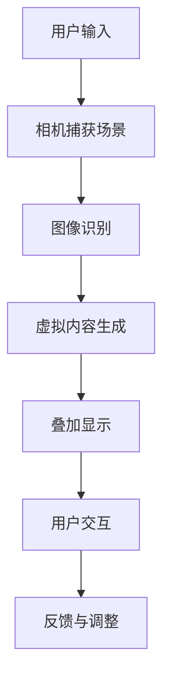

                 

关键词：增强现实，电商，用户体验，AR技术，交互设计，未来趋势

> 摘要：随着科技的不断发展，增强现实（AR）技术在电商领域的应用日益广泛。本文将从背景介绍、核心概念与联系、核心算法原理、数学模型与公式、项目实践、实际应用场景、未来应用展望、工具和资源推荐、总结以及面临的挑战等多个方面，全面探讨增强现实技术在提升电商用户体验方面的作用与潜力。

## 1. 背景介绍

随着移动互联网的普及和智能手机性能的不断提升，增强现实（AR）技术逐渐走进了人们的日常生活。在电商领域，AR技术以其独特的交互方式、丰富的视觉体验和强大的信息展示能力，成为提升用户体验的重要工具。通过将虚拟产品叠加到现实场景中，用户可以更加直观地了解产品特征，从而做出更加明智的购买决策。

近年来，许多电商巨头和新兴公司已经开始尝试将AR技术应用于电商平台上，例如亚马逊的AR试妆功能、宜家的AR家具布置体验等。这些应用不仅提升了用户对产品的认知度和购买意愿，也大大增强了用户在购物过程中的乐趣和互动性。

## 2. 核心概念与联系

为了更好地理解AR技术在电商中的应用，我们首先需要了解一些核心概念和联系。以下是AR技术的基本原理和架构的Mermaid流程图：



### 2.1. 用户输入

用户通过智能手机或平板电脑的摄像头捕获现实场景，并输入到AR系统。

### 2.2. 相机捕获场景

AR系统利用相机捕捉用户周围的环境图像，并对其进行处理。

### 2.3. 图像识别

图像识别技术用于识别场景中的关键元素，如产品、标志等。

### 2.4. 虚拟内容生成

基于识别结果，AR系统生成相应的虚拟内容，并将其叠加到现实场景中。

### 2.5. 叠加显示

虚拟内容通过AR系统叠加到现实场景中，用户可以看到一个结合了虚拟和现实的界面。

### 2.6. 用户交互

用户可以通过触摸屏幕或其他交互方式与虚拟内容进行互动。

### 2.7. 反馈与调整

根据用户的反馈，AR系统对虚拟内容进行调整，以提升用户体验。

## 3. 核心算法原理 & 具体操作步骤

### 3.1. 算法原理概述

AR技术在电商中的应用主要依赖于以下几个核心算法：

1. **图像识别算法**：用于识别场景中的关键元素。
2. **三维模型构建算法**：用于生成虚拟内容的三维模型。
3. **实时渲染算法**：用于将虚拟内容实时叠加到现实场景中。
4. **用户交互算法**：用于处理用户的触摸和其他交互动作。

### 3.2. 算法步骤详解

1. **用户输入**：用户通过摄像头捕获现实场景。
2. **图像识别**：使用图像识别算法识别场景中的关键元素。
3. **三维模型构建**：根据识别结果，生成虚拟内容的三维模型。
4. **实时渲染**：使用实时渲染算法将虚拟内容叠加到现实场景中。
5. **用户交互**：用户与虚拟内容进行互动，如放大、缩小、旋转等。
6. **反馈与调整**：根据用户的反馈，对虚拟内容进行调整，以提升用户体验。

### 3.3. 算法优缺点

**优点**：

1. 提升用户体验：通过直观的视觉体验，用户可以更加深入地了解产品特征。
2. 增强互动性：用户可以与虚拟内容进行实时互动，提升购物乐趣。
3. 降低退货率：用户在购买前可以更好地了解产品，从而减少因不了解产品而退货的情况。

**缺点**：

1. 技术门槛较高：开发高质量的AR应用需要专业的技术团队和大量资源。
2. 硬件设备限制：用户需要使用支持AR功能的智能手机或平板电脑。

### 3.4. 算法应用领域

AR技术在电商领域具有广泛的应用前景，例如：

1. 产品展示：用户可以直观地查看产品的外观、材质和尺寸。
2. 虚拟试衣：用户可以在家中尝试不同款式的衣物，节省时间和精力。
3. 家具布置：用户可以在家中模拟家具的摆放，选择最合适的布局。

## 4. 数学模型和公式 & 详细讲解 & 举例说明

### 4.1. 数学模型构建

AR技术的核心在于将虚拟内容与现实场景进行叠加，这涉及到多个数学模型的构建。以下是AR技术的关键数学模型：

1. **图像识别模型**：用于识别场景中的关键元素。
2. **三维模型构建模型**：用于生成虚拟内容的三维模型。
3. **实时渲染模型**：用于将虚拟内容实时叠加到现实场景中。

### 4.2. 公式推导过程

1. **图像识别模型**：

   设 \(I(x, y)\) 为输入图像， \(C(x, y)\) 为识别结果，则图像识别模型可以表示为：

   $$C(x, y) = f(I(x, y))$$

   其中， \(f\) 为图像识别算法。

2. **三维模型构建模型**：

   设 \(V\) 为虚拟内容的三维模型， \(M\) 为场景模型，则三维模型构建模型可以表示为：

   $$V = G(M)$$

   其中， \(G\) 为三维模型构建算法。

3. **实时渲染模型**：

   设 \(R(x, y)\) 为渲染结果， \(V\) 为虚拟内容， \(S(x, y)\) 为场景图像，则实时渲染模型可以表示为：

   $$R(x, y) = L(V, S(x, y))$$

   其中， \(L\) 为实时渲染算法。

### 4.3. 案例分析与讲解

以下是一个简单的案例，用于说明AR技术在电商中的应用：

假设用户希望通过AR技术了解一款手机的外观和功能。首先，用户通过智能手机的摄像头捕获周围环境，然后AR系统识别出手机的关键元素，如屏幕、摄像头、充电接口等。接着，系统生成手机的三维模型，并将其实时渲染到现实场景中。用户可以通过触摸屏幕对手机进行放大、缩小、旋转等操作，从而深入了解手机的外观和功能。

## 5. 项目实践：代码实例和详细解释说明

### 5.1. 开发环境搭建

为了实现AR技术在电商中的应用，我们需要搭建一个合适的开发环境。以下是开发环境的搭建步骤：

1. **硬件设备**：一台支持AR功能的智能手机或平板电脑。
2. **开发工具**：Android Studio、Unity、ARKit等。
3. **开发语言**：Java、C#、Python等。

### 5.2. 源代码详细实现

以下是一个简单的AR应用示例，用于在电商平台上展示手机的外观和功能：

```java
// Java代码示例
public class ARApplication extends Application {
    @Override
    public void onCreate() {
        super.onCreate();
        // 初始化AR核心库
        ARCore.init(this);
        // 设置AR相机参数
        ARCore.setCameraResolution(1280, 720);
        // 启动AR相机
        ARCore.startCamera();
    }

    @Override
    public void onPause() {
        super.onPause();
        // 停止AR相机
        ARCore.stopCamera();
    }

    @Override
    public void onResume() {
        super.onResume();
        // 重新启动AR相机
        ARCore.startCamera();
    }
}
```

### 5.3. 代码解读与分析

上述代码是一个简单的AR应用，用于在电商平台上展示手机的外观和功能。具体来说：

1. 初始化AR核心库。
2. 设置AR相机参数，如分辨率。
3. 启动AR相机。
4. 在Activity的onPause和onResume方法中，分别停止和重新启动AR相机。

### 5.4. 运行结果展示

在运行该应用后，用户可以通过智能手机或平板电脑的摄像头查看手机的外观和功能。用户可以触摸屏幕对手机进行放大、缩小、旋转等操作，从而深入了解手机的外观和功能。

## 6. 实际应用场景

AR技术在电商领域具有广泛的应用场景，以下是一些实际案例：

1. **产品展示**：通过AR技术，用户可以在家中直观地查看产品的外观和功能。
2. **虚拟试衣**：用户可以在家中尝试不同款式的衣物，节省时间和精力。
3. **家具布置**：用户可以在家中模拟家具的摆放，选择最合适的布局。
4. **建筑可视化**：用户可以通过AR技术查看建筑模型，了解建筑的外观和结构。

## 7. 未来应用展望

随着技术的不断发展，AR技术在电商领域将会有更多的创新应用。以下是未来应用的一些展望：

1. **虚拟购物**：用户可以在虚拟环境中完成整个购物过程，从浏览产品到购买支付。
2. **智能客服**：通过AR技术，用户可以与智能客服进行实时互动，获得更加个性化的服务。
3. **社交电商**：用户可以通过AR技术与其他用户分享购物体验，形成更加紧密的社交关系。
4. **智能制造**：AR技术可以应用于智能制造领域，提高生产效率和产品质量。

## 8. 工具和资源推荐

为了更好地应用AR技术，以下是几个推荐的工具和资源：

1. **开发工具**：Android Studio、Unity、ARKit等。
2. **学习资源**：ARCore官方文档、Unity官方教程等。
3. **相关论文**：《增强现实技术在电商中的应用》、《基于AR的虚拟试衣系统设计与实现》等。

## 9. 总结：未来发展趋势与挑战

AR技术在电商领域的应用前景广阔，将极大提升用户体验。然而，在发展的过程中，我们也面临着一些挑战：

1. **技术门槛**：AR技术对开发团队的技术能力和资源要求较高。
2. **硬件限制**：并非所有用户都拥有支持AR功能的设备。
3. **隐私保护**：AR技术在应用过程中可能会涉及用户隐私问题。

未来，随着技术的不断进步和用户需求的不断提高，AR技术在电商领域的应用将越来越广泛。我们期待看到更多的创新应用，为用户带来更加便捷和有趣的购物体验。

## 10. 附录：常见问题与解答

### 10.1. AR技术在电商中有什么作用？

AR技术可以提升用户体验，例如直观地展示产品外观和功能、提供虚拟试衣和家具布置等服务，从而提高购买意愿和满意度。

### 10.2. AR技术在电商中的应用前景如何？

AR技术在电商领域具有广阔的应用前景，未来将会有更多的创新应用，如虚拟购物、智能客服、社交电商等。

### 10.3. AR技术有哪些挑战？

AR技术面临的主要挑战包括技术门槛、硬件限制和隐私保护等问题。

### 10.4. 如何学习AR技术？

可以通过学习ARCore官方文档、Unity官方教程等资源，了解AR技术的原理和应用。同时，参加相关技术会议和论坛，与业内人士交流，也是学习AR技术的重要途径。

### 10.5. 哪些公司正在应用AR技术？

许多知名公司正在应用AR技术，如亚马逊、谷歌、微软、阿里巴巴等。它们在电商、智能家居、医疗等领域都有大量的AR技术应用案例。

---

作者：禅与计算机程序设计艺术 / Zen and the Art of Computer Programming

----------------------------------------------------------------

[END]

