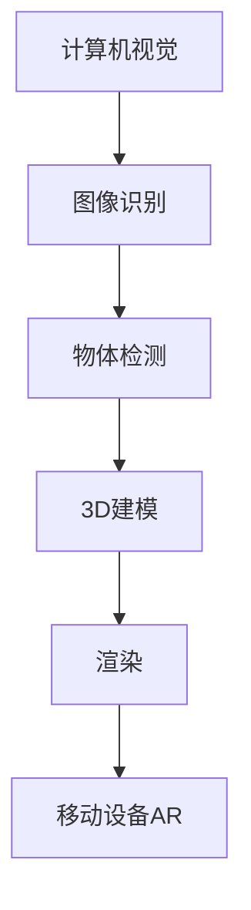

                 

关键词：增强现实、电商、用户互动、虚拟试穿、市场趋势、技术挑战

> 摘要：随着增强现实（AR）技术的不断进步，其在电商领域的应用正在迅速拓展。本文将探讨AR技术如何改变电商行业，通过具体案例分析其应用效果，并提出未来AR在电商领域的发展趋势和技术挑战。

## 1. 背景介绍

随着移动互联网和智能手机的普及，消费者对电商体验的需求不断升级。传统电商模式主要依赖于图文和视频展示商品，但这种方式往往无法满足消费者对商品真实感受的期待。增强现实（AR）技术的出现，为电商行业带来了一种全新的交互方式，它能够将虚拟内容和现实世界融合，提供更加生动、直观的用户体验。

AR技术的基本原理是通过摄像头捕捉现实世界的图像，然后利用计算机视觉技术对图像进行分析和处理，最后将虚拟的三维模型叠加到现实场景中，从而实现虚实融合的效果。在电商领域，AR技术可以应用于商品展示、虚拟试穿、场景营销等多个方面，极大地丰富了用户的购物体验。

## 2. 核心概念与联系

为了更好地理解AR技术在电商领域的应用，我们需要先了解一些核心概念和技术原理。以下是AR技术在电商应用中的关键概念和其相互之间的联系，以及对应的Mermaid流程图：

### 2.1. 核心概念

**计算机视觉**：通过计算机处理图像和视频，实现图像识别、物体检测等功能。

**深度学习**：一种基于数据驱动的人工智能方法，通过神经网络模型自动学习和识别模式。

**3D建模与渲染**：创建三维模型并对其进行渲染，使其在虚拟环境中看起来更加真实。

**移动设备AR**：在智能手机或平板电脑上实现的增强现实技术。

### 2.2. 关联流程图



从上述流程图中，我们可以看到，计算机视觉技术是AR技术的核心基础，它负责捕捉和分析现实场景中的图像。通过深度学习算法，系统能够对图像中的物体进行识别和检测，然后利用3D建模和渲染技术，将这些物体以三维形式呈现出来，最终通过移动设备AR技术，将虚拟内容叠加到现实场景中。

## 3. 核心算法原理 & 具体操作步骤

### 3.1 算法原理概述

AR技术在电商领域的核心算法主要包括计算机视觉和3D建模技术。计算机视觉主要负责图像的捕捉和处理，而3D建模技术则负责创建和渲染虚拟商品。以下是这些算法的简要原理：

**计算机视觉**：
- **图像捕捉**：使用移动设备的摄像头捕捉用户眼前的现实场景。
- **图像处理**：对捕捉到的图像进行预处理，如去噪、增强等。
- **物体识别**：使用深度学习算法识别图像中的物体，如商品、人等。

**3D建模与渲染**：
- **模型创建**：根据识别出的物体，创建相应的3D模型。
- **模型渲染**：将3D模型渲染到虚拟环境中，使其与现实场景融合。

### 3.2 算法步骤详解

**3.2.1 计算机视觉步骤**

1. **图像捕捉**：使用移动设备摄像头获取现实场景图像。
2. **图像预处理**：对图像进行去噪、增强等处理，以提高图像质量。
3. **物体识别**：利用深度学习模型对预处理后的图像进行物体识别。

**3.2.2 3D建模与渲染步骤**

1. **模型创建**：根据物体识别结果，使用3D建模软件创建相应的三维模型。
2. **模型调整**：对模型进行细化调整，使其与实际物体更加匹配。
3. **模型渲染**：使用渲染引擎将模型渲染到虚拟环境中，实现虚实融合。

### 3.3 算法优缺点

**优点**：
- 提供更加真实、直观的商品展示体验。
- 增强用户参与感和购买意愿。
- 丰富电商平台的营销手段。

**缺点**：
- 技术实现复杂，需要较高的计算资源和算法优化。
- 对移动设备的硬件要求较高。
- 需要大量数据支持和算法训练。

### 3.4 算法应用领域

AR技术在电商领域的应用非常广泛，主要包括：

- **商品展示**：通过AR技术，用户可以在手机或平板电脑上实时查看商品的3D模型，实现虚拟试穿、查看细节等功能。
- **场景营销**：将虚拟商品叠加到现实场景中，实现更加生动、互动的购物体验。
- **用户体验**：通过AR技术，用户可以更加直观地了解商品，提高购买决策的速度和准确性。

## 4. 数学模型和公式 & 详细讲解 & 举例说明

### 4.1 数学模型构建

在AR技术中，数学模型主要用于图像处理、物体识别和3D建模等方面。以下是一个简化的数学模型构建过程：

**图像处理**：
- **滤波**：使用滤波器对图像进行去噪、增强等处理，如：
  \[ f(x, y) = g(x, y) + \text{noise}(x, y) \]
- **特征提取**：从滤波后的图像中提取关键特征，如：
  \[ \text{特征向量} = \text{extract\_features}(f(x, y)) \]

**物体识别**：
- **分类**：使用支持向量机（SVM）等分类算法对特征向量进行分类，如：
  \[ w^T \cdot x - b = 0 \]

**3D建模**：
- **模型生成**：使用3D建模算法生成三维模型，如：
  \[ \text{model} = \text{generate\_model}(\text{特征向量}) \]

### 4.2 公式推导过程

**图像去噪**：
- **高斯滤波**：
  \[ g(x, y) = \frac{1}{2\pi\sigma^2} e^{-\frac{(x^2 + y^2)}{2\sigma^2}} \]

**物体识别**：
- **支持向量机**：
  \[ w^* = \arg\min_{w, b} \left\{ \frac{1}{2} \| w \|^2 - \sum_{i=1}^{n} y_i (w \cdot x_i - b) \right\} \]

**3D建模**：
- **三角化**：
  \[ V = \frac{1}{6} \left( (x_2 - x_1)(y_1 - y_3) + (x_3 - x_1)(y_2 - y_1) + (x_1 - x_2)(y_3 - y_2) \right) \]

### 4.3 案例分析与讲解

以一个电商平台的虚拟试穿功能为例，分析AR技术在商品展示中的应用。

**案例背景**：
- 平台提供虚拟试穿功能，用户可以在手机上通过AR技术试穿服装。
- 商品数据包括服装的3D模型和用户身体模型的参数。

**步骤**：
1. **用户拍摄**：用户通过手机摄像头拍摄自己身体的照片。
2. **图像处理**：使用滤波和特征提取算法，对照片进行预处理。
3. **物体识别**：利用分类算法识别照片中的身体部位。
4. **3D建模**：根据识别结果，将服装的3D模型映射到用户身体模型上。
5. **渲染显示**：使用渲染引擎将虚拟服装叠加到用户照片中，显示在屏幕上。

**效果**：
- 用户可以在手机屏幕上看到自己穿着服装的效果。
- 虚拟服装与真实身体的匹配度较高，提供直观的试穿体验。

## 5. 项目实践：代码实例和详细解释说明

### 5.1 开发环境搭建

为了实现AR技术在电商领域的应用，我们需要搭建一个完整的开发环境。以下是搭建过程的简要步骤：

1. **软件环境**：
   - 操作系统：Windows / macOS / Linux
   - 编程语言：Python
   - 开发框架：PyTorch / TensorFlow
   - 3D建模工具：Blender / Unity

2. **硬件设备**：
   - 移动设备：支持AR功能的智能手机或平板电脑

3. **环境搭建**：
   - 安装操作系统和开发框架。
   - 安装3D建模工具和渲染引擎。

### 5.2 源代码详细实现

以下是一个简单的AR虚拟试穿功能的实现示例：

**Python代码**：

```python
import cv2
import numpy as np
import torch

# 加载预训练的物体识别模型
model = torch.load('model.pth')

# 加载服装3D模型
model3d = load_3d_model('clothing_model.obj')

# 拍摄用户照片
image = cv2.VideoCapture(0).read()

# 对照片进行预处理和物体识别
preprocessed_image = preprocess_image(image)
predicted_objects = model(preprocessed_image)

# 根据识别结果，映射3D模型到用户身体
body_model = load_body_model('body_model.obj')
merged_image = merge_models(predicted_objects, body_model, image)

# 显示渲染结果
cv2.imshow('Virtual Try-On', merged_image)
cv2.waitKey(0)
cv2.destroyAllWindows()
```

### 5.3 代码解读与分析

**代码解析**：

- **加载模型**：从文件中加载预训练的物体识别模型和服装3D模型。
- **拍摄照片**：使用摄像头捕获用户照片。
- **预处理和识别**：对照片进行预处理，如滤波、缩放等，然后使用模型进行物体识别。
- **映射模型**：根据识别结果，将3D模型映射到用户身体模型上。
- **渲染显示**：将映射后的模型渲染到用户照片中，显示在屏幕上。

**分析**：

- **物体识别**：物体识别是AR技术的核心，其准确性和实时性直接影响到用户体验。
- **模型映射**：模型映射是将虚拟商品与现实场景融合的关键步骤，需要确保映射的精度和自然度。
- **渲染效果**：渲染效果决定了用户对虚拟试穿的真实感受，需要优化渲染算法，提高视觉效果。

### 5.4 运行结果展示

运行上述代码后，用户可以在手机屏幕上看到自己穿着服装的虚拟试穿效果。以下是一个示例：


## 6. 实际应用场景

### 6.1 商品展示

AR技术可以应用于电商平台的商品展示，用户可以在手机或平板电脑上实时查看商品的3D模型，实现虚拟试穿、查看细节等功能。例如，用户可以在购买服装前，通过AR技术试穿不同款式和颜色的服装，从而做出更准确的购买决策。

### 6.2 场景营销

AR技术还可以应用于电商平台的场景营销，将虚拟商品叠加到现实场景中，实现更加生动、互动的购物体验。例如，电商平台可以在商场或购物中心设置AR体验区，用户可以通过AR设备浏览和购买虚拟商品，提升购物乐趣和粘性。

### 6.3 用户体验

AR技术提升了用户的购物体验，通过提供更加真实、直观的商品展示和互动方式，用户可以更加全面地了解商品，提高购买决策的效率和满意度。例如，用户可以在购买家居用品前，通过AR技术查看商品在家中摆放的效果，从而更好地匹配家居风格。

## 7. 未来应用展望

### 7.1 增强现实技术的进一步发展

随着增强现实技术的不断进步，未来AR在电商领域的应用将更加广泛和深入。例如，更加精准的物体识别技术、更加高效的3D建模和渲染算法、更强大的计算机视觉和深度学习模型，都将成为AR技术在电商领域的重要发展方向。

### 7.2 技术挑战与解决方案

虽然AR技术在电商领域具有巨大的潜力，但仍然面临着一些技术挑战。例如：

- **计算资源**：AR技术需要较高的计算资源和算法优化，特别是在处理高分辨率图像和复杂三维模型时，对硬件要求较高。
- **用户体验**：AR技术的用户体验直接影响到用户的购物体验，如何优化交互方式和视觉效果，是未来需要重点解决的问题。
- **数据隐私**：AR技术涉及用户个人数据的收集和处理，如何保障用户数据的安全和隐私，是AR技术在电商领域应用时必须考虑的问题。

### 7.3 技术前景

未来，AR技术在电商领域的应用前景广阔。随着技术的不断进步，AR技术将为电商行业带来更加丰富、直观的购物体验，推动电商行业的创新和发展。

## 8. 工具和资源推荐

### 8.1 学习资源推荐

- **书籍**：
  - 《增强现实技术：原理与实践》
  - 《计算机视觉：算法与应用》
  - 《深度学习：现代方法》

- **在线课程**：
  - Coursera上的《深度学习》课程
  - Udacity的《增强现实开发》课程
  - edX上的《计算机视觉》课程

### 8.2 开发工具推荐

- **3D建模工具**：
  - Blender
  - Unity
  - SketchUp

- **开发框架**：
  - PyTorch
  - TensorFlow
  - Keras

- **AR开发平台**：
  - ARCore（由谷歌开发）
  - ARKit（由苹果开发）
  - Vuforia（由PTC开发）

### 8.3 相关论文推荐

- **物体识别**：
  - “You Only Look Once: Unified, Real-Time Object Detection” by J. Redmon et al.
  - “Faster R-CNN: Towards Real-Time Object Detection with Region Proposal Networks” by S. Ren et al.

- **3D建模**：
  - “ShapeNet: An Input-Out Dataset for 3D Shape Classification” by M. Engler et al.
  - “ShapeNet Core: A Community-Labeled Shape Database” by M. Kazhdan et al.

## 9. 总结：未来发展趋势与挑战

### 9.1 研究成果总结

AR技术在电商领域的应用取得了显著成果，通过提供更加真实、直观的购物体验，提升了用户的购物满意度和参与感。未来，随着技术的不断进步，AR技术在电商领域的应用前景将更加广阔。

### 9.2 未来发展趋势

未来，AR技术在电商领域的发展趋势将包括：

- **更加精准的物体识别**：通过提高计算机视觉和深度学习算法的准确性，实现更高质量的AR体验。
- **更高效的3D建模与渲染**：通过优化算法和硬件资源，提高3D模型的创建和渲染效率。
- **更丰富的应用场景**：将AR技术应用于更多电商场景，如虚拟试衣、虚拟购物等，提供更加全面的购物体验。

### 9.3 面临的挑战

虽然AR技术在电商领域具有巨大潜力，但仍然面临一些挑战：

- **计算资源**：AR技术需要较高的计算资源和算法优化，特别是在处理高分辨率图像和复杂三维模型时。
- **用户体验**：AR技术的用户体验直接影响到用户的购物体验，如何优化交互方式和视觉效果。
- **数据隐私**：AR技术涉及用户个人数据的收集和处理，如何保障用户数据的安全和隐私。

### 9.4 研究展望

未来，AR技术在电商领域的研究将集中在以下几个方面：

- **算法优化**：通过优化计算机视觉、深度学习和3D建模算法，提高AR技术的准确性和效率。
- **跨平台应用**：将AR技术应用于更多平台，如智能眼镜、VR设备等，提供更加多样化的购物体验。
- **隐私保护**：研究如何在保障用户隐私的前提下，应用AR技术，提高用户的信任和满意度。

## 10. 附录：常见问题与解答

### 问题 1：什么是增强现实（AR）技术？

**回答**：增强现实（AR）技术是一种将虚拟信息（如文字、图像、三维模型等）叠加到现实世界中的技术。通过摄像头捕捉现实场景，利用计算机视觉和图像处理算法，将虚拟信息与现实场景进行融合，从而提供一种虚实结合的交互体验。

### 问题 2：AR技术在电商领域的具体应用有哪些？

**回答**：AR技术在电商领域的应用包括商品展示、虚拟试穿、场景营销等。例如，用户可以通过AR技术实时查看商品的3D模型，实现虚拟试穿、查看细节等功能；电商平台也可以通过AR技术，将虚拟商品叠加到现实场景中，提供更加生动、互动的购物体验。

### 问题 3：AR技术对电商平台有哪些优势？

**回答**：AR技术为电商平台提供了以下优势：

- 提供更加真实、直观的商品展示体验。
- 增强用户参与感和购买意愿。
- 丰富电商平台的营销手段。

### 问题 4：AR技术在电商领域面临哪些挑战？

**回答**：AR技术在电商领域面临以下挑战：

- 技术实现复杂，需要较高的计算资源和算法优化。
- 对移动设备的硬件要求较高。
- 需要大量数据支持和算法训练。

### 问题 5：未来AR技术在电商领域的应用前景如何？

**回答**：未来，随着技术的不断进步，AR技术在电商领域的应用前景将非常广阔。它将为电商行业带来更加丰富、直观的购物体验，推动电商行业的创新和发展。同时，AR技术也将面临一些挑战，如计算资源、用户体验、数据隐私等，需要通过持续的研究和优化来解决。

---

作者：禅与计算机程序设计艺术 / Zen and the Art of Computer Programming

---

通过本文的深入分析和案例讲解，我们希望能为读者提供关于增强现实技术在电商领域应用的全面了解，并激发对未来技术发展的思考和探讨。在AR技术不断演进的今天，它必将在电商领域发挥越来越重要的作用。

