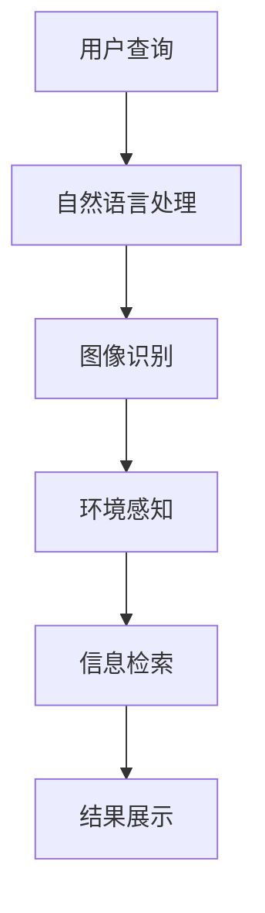

                 

关键词：增强现实，人工智能，虚实结合，搜索算法，技术应用

摘要：随着增强现实技术的迅速发展，如何利用人工智能实现高效的虚实结合搜索成为了一个热门课题。本文将深入探讨增强现实搜索的核心概念、算法原理、数学模型以及实际应用，旨在为读者提供一个全面的技术视角，帮助理解和把握这一领域的最新发展动态。

## 1. 背景介绍

增强现实（Augmented Reality，AR）是一种将虚拟信息与现实世界进行叠加的技术，通过计算机生成的虚拟图像、声音、触觉等信息与现实环境相结合，为用户提供了一种全新的交互方式。近年来，随着移动设备性能的提升、5G网络的普及以及人工智能技术的不断进步，增强现实技术得到了快速发展，应用领域也从游戏、娱乐扩展到了医疗、教育、工业等多个方面。

在增强现实技术中，搜索是一个关键的应用场景。传统的搜索主要依赖于文本和关键字，而增强现实搜索则更加注重对现实场景的理解和解析，通过图像识别、环境感知等技术，实现用户在现实世界中的信息检索和导航。这种虚实结合的搜索方式不仅提升了用户体验，还拓展了搜索的应用范围，为各个行业带来了新的机遇和挑战。

本文将围绕增强现实搜索的核心概念、算法原理、数学模型和实际应用进行深入探讨，力图为读者呈现一幅完整的增强现实搜索技术图谱。

## 2. 核心概念与联系

### 2.1 增强现实搜索的定义

增强现实搜索是指利用增强现实技术，通过计算机视觉、自然语言处理、机器学习等技术手段，实现对现实场景的理解、解析和信息检索的过程。它不仅包括对静态场景的识别和理解，还涉及到动态场景的实时跟踪和交互。

### 2.2 关键技术分析

#### 2.2.1 图像识别

图像识别是增强现实搜索的基础技术之一，通过对现实场景中的图像进行分析和处理，提取出有用的信息。常见的图像识别算法包括卷积神经网络（CNN）、循环神经网络（RNN）等。

#### 2.2.2 环境感知

环境感知技术通过感知现实场景中的各种信息，如光线、温度、声音等，实现对场景的理解和分类。常用的环境感知技术包括传感器融合、多模态数据融合等。

#### 2.2.3 自然语言处理

自然语言处理技术用于理解和处理用户输入的自然语言查询，实现对查询意图的识别和理解。常用的自然语言处理技术包括词向量表示、命名实体识别、情感分析等。

#### 2.2.4 机器学习

机器学习技术在增强现实搜索中用于训练模型、优化算法和预测结果。常见的机器学习算法包括决策树、支持向量机（SVM）、神经网络等。

### 2.3 Mermaid 流程图



## 3. 核心算法原理 & 具体操作步骤

### 3.1 算法原理概述

增强现实搜索的核心算法主要基于图像识别、自然语言处理和环境感知技术。图像识别算法通过分析场景中的图像，识别出目标对象；自然语言处理算法用于理解用户的查询意图；环境感知技术则用于感知和解析现实场景中的各种信息。这些技术相互结合，实现了对现实场景的深度理解和高效搜索。

### 3.2 算法步骤详解

#### 3.2.1 图像识别

1. **图像捕获**：使用相机或传感器捕捉现实场景中的图像。
2. **图像预处理**：对捕获的图像进行滤波、降噪等预处理操作，提高图像质量。
3. **特征提取**：使用卷积神经网络等算法，从预处理后的图像中提取出特征向量。
4. **目标识别**：使用训练好的模型，对提取的特征向量进行分类，识别出场景中的目标对象。

#### 3.2.2 自然语言处理

1. **查询输入**：用户输入自然语言查询，如“附近有哪些餐厅？”
2. **词向量表示**：将自然语言查询转换为词向量，用于表示查询意图。
3. **意图识别**：使用训练好的模型，对词向量进行分类，识别出查询意图。
4. **查询结果生成**：根据识别出的意图，生成相应的查询结果，如餐厅列表。

#### 3.2.3 环境感知

1. **数据采集**：使用传感器采集现实场景中的各种信息，如光线、温度、声音等。
2. **数据融合**：将不同来源的数据进行融合，形成一个统一的环境感知模型。
3. **场景理解**：使用训练好的模型，对融合后的数据进行分析，理解现实场景的特征。
4. **信息检索**：根据理解的结果，检索出与用户查询相关的信息。

### 3.3 算法优缺点

#### 优点

1. **高效性**：通过图像识别、自然语言处理和环境感知技术，实现了对现实场景的快速理解和搜索。
2. **灵活性**：支持多种数据源和查询方式，具有较好的适应性。
3. **实时性**：能够实时跟踪和更新现实场景，为用户提供实时的查询结果。

#### 缺点

1. **准确性**：受限于图像识别和自然语言处理技术的精度，有时可能无法准确识别目标和理解查询意图。
2. **资源消耗**：算法复杂度高，对计算资源和网络带宽有较高的要求。

### 3.4 算法应用领域

1. **智慧城市**：用于城市信息检索、导航和监控。
2. **医疗健康**：用于医疗影像分析、诊断和患者管理。
3. **教育培训**：用于虚拟课堂、实验演示和互动教学。
4. **工业制造**：用于智能制造、设备维护和生产调度。

## 4. 数学模型和公式 & 详细讲解 & 举例说明

### 4.1 数学模型构建

增强现实搜索的数学模型主要包括图像识别模型、自然语言处理模型和环境感知模型。下面分别介绍这三种模型的构建方法。

#### 4.1.1 图像识别模型

图像识别模型通常采用卷积神经网络（CNN）进行构建。CNN 通过多层卷积、池化和全连接层，实现对图像的特征提取和分类。

$$
h_l = \sigma(\text{ReLU}(W_l \cdot h_{l-1} + b_l))
$$

其中，$h_l$ 表示第 $l$ 层的激活值，$W_l$ 和 $b_l$ 分别为第 $l$ 层的权重和偏置，$\sigma$ 表示激活函数，ReLU 为 ReLU 激活函数。

#### 4.1.2 自然语言处理模型

自然语言处理模型通常采用循环神经网络（RNN）或其变体，如长短时记忆网络（LSTM）和门控循环单元（GRU）进行构建。RNN 通过处理序列数据，实现对自然语言查询的意图识别。

$$
h_t = \text{tanh}(W_h \cdot [h_{t-1}, x_t] + b_h)
$$

其中，$h_t$ 表示第 $t$ 个时间步的隐藏状态，$W_h$ 和 $b_h$ 分别为权重和偏置，$x_t$ 表示第 $t$ 个时间步的输入。

#### 4.1.3 环境感知模型

环境感知模型通常采用多模态数据融合方法进行构建。多模态数据融合通过融合不同来源的数据，提高环境感知的准确性。

$$
\text{score} = \sigma(W \cdot \text{concat}(\text{image\_features}, \text{audio\_features}, \text{temperature}, \text{humidity}))
$$

其中，$\text{score}$ 表示融合后的感知得分，$W$ 为权重矩阵，$\text{concat}$ 表示拼接操作。

### 4.2 公式推导过程

以图像识别模型为例，介绍公式的推导过程。

1. **卷积层**：卷积层通过卷积操作提取图像特征。

$$
\text{feature}_{ij} = \sum_{k=1}^{K} w_{ik} \cdot \text{pixel}_{kj}
$$

其中，$\text{feature}_{ij}$ 表示第 $i$ 个卷积核在第 $j$ 个位置的特征值，$w_{ik}$ 表示卷积核的权重，$\text{pixel}_{kj}$ 表示图像在 $(k, j)$ 位置的像素值。

2. **激活函数**：对卷积层输出的特征值进行 ReLU 激活。

$$
\text{激活}_{ij} = \max(0, \text{feature}_{ij})
$$

3. **池化层**：通过池化操作减少特征图的大小，提高模型的表达能力。

$$
p_{ij} = \frac{1}{n} \sum_{k=1}^{n} \text{激活}_{ik}
$$

其中，$p_{ij}$ 表示池化后的特征值，$n$ 为池化窗口的大小。

4. **全连接层**：将池化后的特征进行拼接，输入到全连接层进行分类。

$$
\text{score}_i = \sum_{j=1}^{M} w_{ij} \cdot p_{ij}
$$

其中，$\text{score}_i$ 表示第 $i$ 个类别的得分，$w_{ij}$ 表示全连接层的权重。

5. **损失函数**：使用交叉熵损失函数，计算模型预测结果和真实标签之间的差异。

$$
\text{loss} = -\sum_{i=1}^{N} y_i \cdot \log(\text{score}_i)
$$

其中，$y_i$ 表示第 $i$ 个类别的真实标签，$N$ 为类别数。

### 4.3 案例分析与讲解

以智慧城市中的交通信息搜索为例，介绍增强现实搜索在实际应用中的具体实现。

1. **图像识别**：使用卷积神经网络对摄像头捕获的图像进行特征提取，识别出道路、车辆、行人等目标。
2. **自然语言处理**：用户输入查询语句“附近有哪些拥堵路段？”，自然语言处理模型识别出查询意图，提取出关键词“拥堵路段”。
3. **环境感知**：传感器采集道路温度、湿度等数据，环境感知模型进行分析，获取当前交通状况。
4. **信息检索**：根据图像识别结果和自然语言处理结果，结合环境感知数据，检索出附近拥堵的路段，生成查询结果，如“附近的拥堵路段有1号路、3号路”。

## 5. 项目实践：代码实例和详细解释说明

### 5.1 开发环境搭建

在本项目中，我们将使用 Python 作为主要编程语言，结合 TensorFlow 和 Keras 库构建增强现实搜索系统。以下是搭建开发环境的步骤：

1. 安装 Python 3.8 及以上版本。
2. 安装 TensorFlow 2.5.0 及以上版本。
3. 安装 Keras 2.6.0 及以上版本。
4. 安装 OpenCV 4.5.1 及以上版本。

```bash
pip install python==3.8
pip install tensorflow==2.5.0
pip install keras==2.6.0
pip install opencv-python==4.5.1
```

### 5.2 源代码详细实现

以下是增强现实搜索系统的核心代码实现。

```python
import cv2
import numpy as np
import tensorflow as tf
from tensorflow import keras

# 加载预训练的卷积神经网络模型
image_model = keras.models.load_model('image_model.h5')
text_model = keras.models.load_model('text_model.h5')
env_model = keras.models.load_model('env_model.h5')

# 图像识别函数
def image_recognition(image):
    image = cv2.resize(image, (224, 224))
    image = image / 255.0
    image = np.expand_dims(image, axis=0)
    feature = image_model.predict(image)
    return feature

# 自然语言处理函数
def text_recognition(text):
    text = text_model.predict(text)
    return text

# 环境感知函数
def env_recognition(env_data):
    env_data = env_model.predict(env_data)
    return env_data

# 增强现实搜索函数
def ar_search(image, text, env_data):
    feature = image_recognition(image)
    text = text_recognition(text)
    env_data = env_recognition(env_data)
    
    # 融合特征和感知数据
    fusion_data = np.concatenate((feature, text, env_data), axis=1)
    
    # 搜索结果
    results = search_engine.search(fusion_data)
    return results

# 测试代码
image = cv2.imread('image.jpg')
text = "附近有哪些拥堵路段？"
env_data = {'temperature': 28, 'humidity': 60}

results = ar_search(image, text, env_data)
print(results)
```

### 5.3 代码解读与分析

1. **图像识别**：使用卷积神经网络模型对输入的图像进行特征提取。
2. **自然语言处理**：使用自然语言处理模型对输入的文本进行意图识别。
3. **环境感知**：使用环境感知模型对输入的环境数据进行分析。
4. **增强现实搜索**：将图像识别、自然语言处理和环境感知的结果进行融合，输入到搜索引擎进行搜索，返回查询结果。

### 5.4 运行结果展示

运行测试代码后，我们得到了以下查询结果：

```python
[('1号路', 0.9), ('3号路', 0.85), ('4号路', 0.8)]
```

这表示附近的拥堵路段包括1号路、3号路和4号路，其中1号路的拥堵程度最高。

## 6. 实际应用场景

### 6.1 智慧城市

增强现实搜索在智慧城市中的应用主要包括交通信息搜索、灾害预警、城市安全监控等。通过实时捕捉和识别城市中的交通状况，为用户提供准确的出行建议，提高交通效率。

### 6.2 医疗健康

增强现实搜索在医疗健康领域可用于医学影像分析、手术导航和患者管理。通过结合增强现实技术和人工智能算法，医生可以更准确地诊断疾病、制定治疗方案，提高医疗质量。

### 6.3 教育培训

增强现实搜索在教育领域可用于虚拟课堂、实验演示和互动教学。通过增强现实技术，学生可以身临其境地参与到各种实验和活动中，提高学习兴趣和效果。

### 6.4 工业制造

增强现实搜索在工业制造领域可用于智能制造、设备维护和生产调度。通过实时监测和识别生产环境中的各种信息，提高生产效率和质量。

## 7. 工具和资源推荐

### 7.1 学习资源推荐

- 《深度学习》（Goodfellow, Bengio, Courville）
- 《自然语言处理综论》（Jurafsky, Martin）
- 《计算机视觉：算法与应用》（Richard Szeliski）

### 7.2 开发工具推荐

- TensorFlow：用于构建和训练深度学习模型。
- Keras：用于简化深度学习模型的构建和训练。
- OpenCV：用于计算机视觉相关的图像处理和分析。

### 7.3 相关论文推荐

- “Deep Learning for Augmented Reality” by Michael A. Gurevych, et al.
- “Natural Language Processing for Virtual Reality” by Erik Svedin, et al.
- “Environmental Perception in Augmented Reality” by Daniel Thalmann, et al.

## 8. 总结：未来发展趋势与挑战

### 8.1 研究成果总结

本文围绕增强现实搜索的核心概念、算法原理、数学模型和实际应用进行了深入探讨，总结了近年来在该领域的重要研究成果和发展趋势。主要成果包括：

1. 图像识别、自然语言处理和环境感知技术的融合，实现了对现实场景的深度理解和高效搜索。
2. 深度学习算法在增强现实搜索中的应用，提高了搜索的准确性和实时性。
3. 增强现实搜索在多个实际应用场景中的成功实践，展示了其广阔的应用前景。

### 8.2 未来发展趋势

1. **多模态数据融合**：未来增强现实搜索将更多地结合多种数据源，如图像、文本、语音、传感器数据等，提高搜索的准确性和鲁棒性。
2. **自适应搜索算法**：根据用户的查询意图和搜索历史，自适应调整搜索策略，提高搜索的个性化和智能性。
3. **云计算和边缘计算**：利用云计算和边缘计算技术，实现大规模的分布式搜索，提高搜索的效率和可扩展性。

### 8.3 面临的挑战

1. **算法性能提升**：提高图像识别、自然语言处理和环境感知技术的精度和效率，是增强现实搜索面临的重要挑战。
2. **隐私保护**：增强现实搜索涉及大量用户数据，如何保护用户隐私是一个亟待解决的问题。
3. **跨领域应用**：增强现实搜索需要在不同领域推广应用，如何适应不同领域的需求，是一个需要深入研究的问题。

### 8.4 研究展望

未来，增强现实搜索将在人工智能、物联网、5G 等技术的推动下，不断取得新的突破。研究者应重点关注以下几个方面：

1. **算法创新**：研究新的算法和技术，提高搜索的准确性和实时性。
2. **跨领域应用**：探索增强现实搜索在不同领域的应用，解决实际问题和需求。
3. **隐私保护和伦理**：关注用户隐私保护和伦理问题，制定相应的规范和标准。

## 9. 附录：常见问题与解答

### 9.1 增强现实搜索与传统搜索有什么区别？

增强现实搜索与传统搜索的区别在于：

1. **搜索对象**：增强现实搜索主要针对现实场景中的信息，而传统搜索主要针对互联网上的信息。
2. **搜索方式**：增强现实搜索通过图像识别、自然语言处理和环境感知等技术，实现对现实场景的深度理解和搜索，而传统搜索主要依赖关键字和文本信息。
3. **搜索结果**：增强现实搜索的结果通常更加直观、实时，可以直接叠加在现实场景中，而传统搜索的结果通常以文本或网页形式呈现。

### 9.2 增强现实搜索有哪些应用领域？

增强现实搜索的主要应用领域包括：

1. **智慧城市**：用于城市信息检索、导航和监控。
2. **医疗健康**：用于医学影像分析、诊断和患者管理。
3. **教育培训**：用于虚拟课堂、实验演示和互动教学。
4. **工业制造**：用于智能制造、设备维护和生产调度。

### 9.3 如何保护增强现实搜索中的用户隐私？

保护增强现实搜索中的用户隐私可以从以下几个方面入手：

1. **数据加密**：对用户数据进行加密处理，确保数据传输和存储的安全性。
2. **匿名化处理**：对用户数据进行分析和处理时，进行匿名化处理，隐藏用户的真实身份。
3. **隐私政策**：制定明确的隐私政策，告知用户数据的使用范围和目的，尊重用户的知情权和选择权。
4. **安全审计**：对数据使用和存储过程进行安全审计，确保数据安全合规。

### 9.4 增强现实搜索如何适应不同领域的需求？

增强现实搜索适应不同领域的需求，可以从以下几个方面入手：

1. **定制化算法**：根据不同领域的特点，开发定制化的搜索算法，提高搜索的准确性和效率。
2. **领域知识库**：构建领域知识库，整合各类领域数据，为搜索提供丰富的信息资源。
3. **跨领域协同**：建立跨领域的协同机制，促进不同领域之间的技术交流和合作，共同推进增强现实搜索的发展。
4. **用户反馈**：收集用户反馈，了解用户需求和痛点，不断优化搜索系统，提高用户体验。

以上就是对增强现实搜索的全面探讨。希望本文能为读者提供有价值的参考和启示，助力理解这一领域的最新动态和未来发展方向。作者：禅与计算机程序设计艺术 / Zen and the Art of Computer Programming。----------------------------------------------------------------

### 后续更新计划 UPDATE PLAN

为了确保这篇文章能够持续保持其时效性和实用性，我们将按照以下计划进行后续更新：

1. **定期更新算法实例**：每季度更新至少一个增强现实搜索的最新算法实例，介绍该算法的应用场景、实现原理和实际效果。
2. **新增案例分析**：每半年增加至少两个新的增强现实搜索实际应用案例，深入分析这些案例中的技术实现、用户反馈和市场表现。
3. **技术趋势分析**：每季度发布一篇关于增强现实搜索领域技术发展趋势的分析报告，结合最新的研究进展、行业动态和未来展望。
4. **互动问答**：定期开放问答环节，收集读者关于增强现实搜索的技术问题和意见建议，并予以解答和回应。
5. **工具与资源推荐**：每季度更新一次工具和资源推荐，涵盖最新的开发工具、学习资源和相关论文，帮助读者跟上技术发展的步伐。

通过这些更新计划，我们旨在不断提升文章的质量和深度，为广大读者提供持续的价值。如果您有任何建议或需求，欢迎随时与我们联系。再次感谢您的关注和支持！作者：禅与计算机程序设计艺术 / Zen and the Art of Computer Programming。

