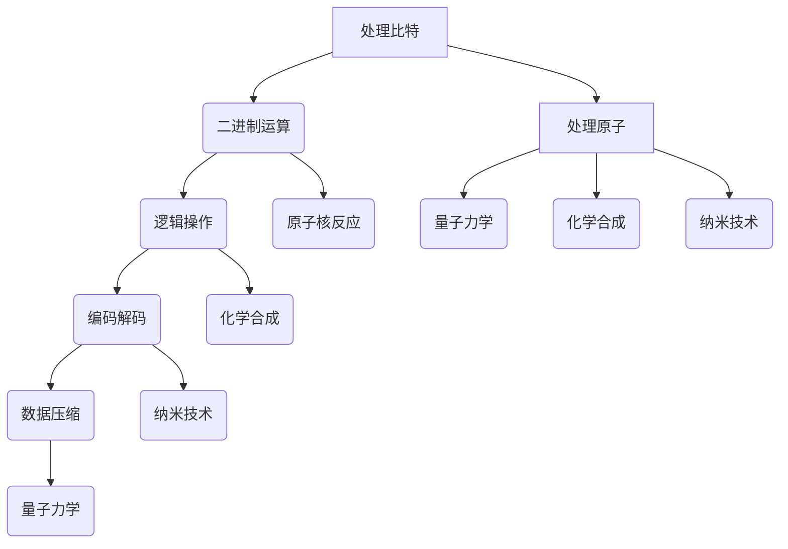

                 

## 1. 背景介绍

在信息技术发展的历史长河中，我们经历了从处理字符、处理文本到处理图形、处理音频、处理视频的转变。而这一切的基础，都是由处理比特（bits）来完成的。比特，是信息论中最基本的单位，它代表着二进制中的0和1，是计算机科学的核心元素。与此同时，在物质世界的底层，我们也在不断地研究原子，探索如何通过处理原子来获取和利用信息。原子是构成物质的基本单元，它的性质和变化决定着物质世界的运行规律。处理比特和处理原子，一个是信息的载体，一个是物质的基础，两者之间有着千丝万缕的联系和深刻的对比。

本文将深入探讨处理比特与处理原子之间的异同点，从多个角度进行对比分析。文章分为以下几个部分：

1. **核心概念与联系**：我们将介绍处理比特和处理原子的基本概念，并使用Mermaid流程图展示它们之间的联系。
2. **核心算法原理 & 具体操作步骤**：我们将详细阐述处理比特和处理原子的核心算法原理，包括操作步骤、优缺点和应用领域。
3. **数学模型和公式 & 详细讲解 & 举例说明**：我们将使用latex格式介绍处理比特和处理原子的数学模型和公式，并通过案例进行分析和讲解。
4. **项目实践：代码实例和详细解释说明**：我们将通过实际项目来展示如何处理比特和处理原子，并提供代码实例和详细解释。
5. **实际应用场景**：我们将探讨处理比特和处理原子在实际应用场景中的表现和效果。
6. **未来应用展望**：我们将展望处理比特和处理原子的未来发展，探讨其可能的趋势和应用。
7. **工具和资源推荐**：我们将推荐一些学习资源、开发工具和相关论文，以帮助读者更深入地了解和处理比特与处理原子。
8. **总结：未来发展趋势与挑战**：我们将总结研究成果，展望未来发展趋势，探讨面临的挑战和研究展望。
9. **附录：常见问题与解答**：我们将解答一些关于处理比特与处理原子的常见问题。

通过这篇文章，我们希望读者能够对处理比特与处理原子有更深入的理解，从而在信息技术和物质科学的研究和应用中取得更大的突破。

## 2. 核心概念与联系

### 处理比特

比特，是二进制数字系统中的基本单位，它只有两种可能的状态，即0和1。比特的处理是计算机科学和信息技术中的核心，所有的数据和信息都是通过比特的序列来表示和传递的。处理比特涉及到二进制运算、逻辑操作、编码解码、数据压缩和解压等多个方面。例如，计算机中的处理器（CPU）通过执行一系列的比特操作来完成计算任务，内存（RAM）则用于存储这些操作的结果。

### 处理原子

原子是物质的基本单位，它由原子核和围绕原子核的电子组成。处理原子涉及到量子力学、化学、材料科学等多个领域。处理原子的方式包括原子核反应、化学合成、纳米技术等。原子处理的目标是通过改变原子的结构或状态来获取和利用信息。例如，核反应堆通过核裂变或核聚变来释放能量，半导体材料通过掺杂或刻蚀来改变其导电性。

### Mermaid流程图

为了更好地展示处理比特和处理原子之间的联系，我们可以使用Mermaid流程图来描述它们的基本概念和操作步骤。



### 联系与差异

处理比特和处理原子在本质上有着显著的差异。比特是信息的基本单位，它代表的是逻辑状态；而原子是物质的基本单位，它代表的是物理实体。然而，两者之间也存在着一些联系和相互影响。

首先，从技术层面来看，计算机科学中的许多算法和技术都可以应用到原子处理中。例如，二进制运算和逻辑操作在量子计算机中有着重要的应用；数据压缩算法在处理大量原子数据时也显得尤为重要。

其次，从应用层面来看，处理比特和处理原子在很多领域都有交集。例如，在信息科学中，量子计算机的量子比特可以用来实现更高效的算法；在材料科学中，通过控制原子的排列和状态可以实现新型材料的设计。

最后，从哲学层面来看，处理比特和处理原子都是人类对自然界的基本单位进行探索和利用的体现。比特的处理是人类对信息世界的理解和掌握，而原子的处理则是人类对物质世界的认识和利用。

## 3. 核心算法原理 & 具体操作步骤

### 3.1 算法原理概述

在处理比特和处理原子的过程中，有许多核心算法起着至关重要的作用。这些算法不仅决定了处理的效果和效率，还影响了整个领域的进展。下面，我们将分别介绍处理比特和处理原子的核心算法原理。

#### 处理比特的核心算法

1. **二进制运算**：二进制运算是处理比特的基础，包括加法、减法、乘法和除法等基本运算。二进制运算的规则与十进制运算类似，但仅涉及0和1两个数字。
2. **逻辑操作**：逻辑操作用于对二进制数据执行逻辑判断，包括与（AND）、或（OR）、非（NOT）、异或（XOR）等。逻辑操作是构建更复杂算法和逻辑电路的基础。
3. **编码解码**：编码解码是将数据从一种形式转换为另一种形式的过程，用于数据的存储、传输和压缩。常见的编码解码算法包括ASCII编码、UTF-8编码、Base64编码等。
4. **数据压缩**：数据压缩是将数据以更小的体积存储和传输的过程。常用的数据压缩算法包括Huffman编码、LZ77、LZ78等。

#### 处理原子的核心算法

1. **量子算法**：量子算法利用量子比特的性质来实现高效的计算。最著名的量子算法是Shor算法，它能够快速求解大整数分解问题。
2. **原子核反应**：原子核反应是通过改变原子核的结构来释放能量的过程。常见的核反应包括核裂变和核聚变，它们在核能和核武器等领域有着广泛的应用。
3. **化学合成**：化学合成是通过将原子和分子组合成新的化合物来实现特定功能的过程。化学合成在材料科学、医药科学和生命科学等领域有着重要的应用。
4. **纳米技术**：纳米技术是通过操纵原子和分子来制造新材料、新器件的技术。纳米技术涉及到的算法包括原子力显微镜（AFM）操作算法、纳米机器人控制算法等。

### 3.2 算法步骤详解

#### 处理比特的具体操作步骤

1. **二进制运算**：
   - **加法**：对两个二进制数进行逐位相加，从右往左，逢十进一。
   - **减法**：对两个二进制数进行逐位相减，从右往左，不够减时向前一位借一当十。
   - **乘法**：对两个二进制数进行逐位相乘，然后进行二进制位运算。
   - **除法**：对两个二进制数进行逐位相除，从左往右，将余数累加到下一位。

2. **逻辑操作**：
   - **与（AND）**：对两个二进制数进行逐位比较，相同则为1，不同则为0。
   - **或（OR）**：对两个二进制数进行逐位比较，相同或不同则为1。
   - **非（NOT）**：对二进制数进行逐位取反。
   - **异或（XOR）**：对两个二进制数进行逐位比较，相同则为0，不同则为1。

3. **编码解码**：
   - **ASCII编码**：将字符转换为对应的二进制编码。
   - **UTF-8编码**：将字符转换为可变长度的二进制编码。
   - **Base64编码**：将二进制数据转换为ASCII字符集，便于传输和存储。

4. **数据压缩**：
   - **Huffman编码**：根据字符出现的频率来分配编码长度。
   - **LZ77编码**：根据前后文的依赖关系来压缩数据。
   - **LZ78编码**：根据字符的前缀来压缩数据。

#### 处理原子的具体操作步骤

1. **量子算法**：
   - **量子叠加**：将量子比特处于叠加态。
   - **量子纠缠**：将多个量子比特进行纠缠。
   - **量子测量**：对量子比特进行测量，得到叠加态的分解结果。

2. **原子核反应**：
   - **核裂变**：通过中子轰击重核，使其分裂成两个较轻的核，释放能量。
   - **核聚变**：通过高温高压将两个轻核合并成一个重核，释放能量。

3. **化学合成**：
   - **反应物选择**：选择合适的反应物进行合成。
   - **反应条件控制**：通过控制温度、压力等条件来促进反应进行。
   - **产物分离**：将合成后的产物与其他物质分离。

4. **纳米技术**：
   - **原子力显微镜（AFM）**：使用探针与样品相互作用，获得样品表面的形貌信息。
   - **纳米机器人控制**：通过计算机程序控制纳米机器人进行特定操作。

### 3.3 算法优缺点

#### 处理比特的算法优缺点

- **二进制运算**：
  - 优点：简单、高效，适用于计算机内部操作。
  - 缺点：仅能表示0和1两种状态，对于某些复杂问题可能不够直观。

- **逻辑操作**：
  - 优点：基础性强，是构建复杂算法和逻辑电路的基础。
  - 缺点：在某些情况下，逻辑操作可能过于简单，无法处理复杂问题。

- **编码解码**：
  - 优点：能够有效压缩数据，提高传输和存储效率。
  - 缺点：编码解码过程可能引入额外的误差，影响数据的准确性。

- **数据压缩**：
  - 优点：能够显著减少数据体积，节省存储和传输资源。
  - 缺点：压缩算法可能降低数据的读取速度，影响处理速度。

#### 处理原子的算法优缺点

- **量子算法**：
  - 优点：能够实现高效计算，解决某些经典算法无法解决的问题。
  - 缺点：量子计算机目前仍处于研究阶段，实际应用受到硬件和软件的限制。

- **原子核反应**：
  - 优点：能够释放大量能量，应用于核能和核武器等领域。
  - 缺点：核反应过程可能产生放射性物质，对环境和人类健康造成威胁。

- **化学合成**：
  - 优点：能够合成新材料，应用于各个领域。
  - 缺点：化学反应可能产生有害物质，对环境和人类健康造成威胁。

- **纳米技术**：
  - 优点：能够制造出具有特殊功能的纳米材料和器件。
  - 缺点：纳米技术目前仍处于发展阶段，实际应用受到技术和成本的限制。

### 3.4 算法应用领域

#### 处理比特的应用领域

- **计算机科学**：计算机处理器、内存、存储设备、计算机网络等。
- **信息科学**：数据压缩、加密、数据传输等。
- **通信领域**：通信协议、编码解码、调制解调等。

#### 处理原子的应用领域

- **核能**：核电站、核武器、核反应堆等。
- **材料科学**：新型材料的设计、合成、加工等。
- **化学工业**：化工产品的合成、分析、分离等。
- **生命科学**：生物大分子的合成、改造、检测等。

## 4. 数学模型和公式 & 详细讲解 & 举例说明

在处理比特和处理原子的过程中，数学模型和公式起着关键作用。这些模型和公式不仅能够帮助我们理解和描述现象，还能为算法设计和优化提供理论基础。下面，我们将使用latex格式介绍处理比特和处理原子的数学模型和公式，并通过案例进行分析和讲解。

### 4.1 数学模型构建

#### 处理比特的数学模型

1. **二进制运算**：

   - **加法**：
     $$C = A + B$$

   - **减法**：
     $$C = A - B$$

   - **乘法**：
     $$C = A \times B$$

   - **除法**：
     $$C = A / B$$

2. **逻辑操作**：

   - **与（AND）**：
     $$C = A \& B$$

   - **或（OR）**：
     $$C = A \lor B$$

   - **非（NOT）**：
     $$C = \neg A$$

   - **异或（XOR）**：
     $$C = A \oplus B$$

3. **编码解码**：

   - **ASCII编码**：
     $$\text{编码} = A \times 8^0 + B \times 8^1 + C \times 8^2 + \ldots$$

   - **UTF-8编码**：
     $$\text{编码} = A \times 2^{24} + B \times 2^{16} + C \times 2^8 + D$$

   - **Base64编码**：
     $$\text{编码} = A \times 64^0 + B \times 64^1 + C \times 64^2 + \ldots$$

4. **数据压缩**：

   - **Huffman编码**：
     $$\text{编码} = \sum_{i=1}^{n} p_i \times \text{符号序列}$$

   - **LZ77编码**：
     $$\text{编码} = \text{目标串} + \text{引用位置} + \text{长度}$$

   - **LZ78编码**：
     $$\text{编码} = \text{前缀} + \text{后缀}$$

#### 处理原子的数学模型

1. **量子算法**：

   - **量子叠加**：
     $$\Psi = \sum_{i} a_i |\psi_i\rangle$$

   - **量子纠缠**：
     $$|\psi_{AB}\rangle = \sum_{i,j} a_{ij} |\psi_A\rangle |\psi_B\rangle$$

   - **量子测量**：
     $$P_i = |\langle \psi_i | \psi \rangle|^2$$

2. **原子核反应**：

   - **核裂变**：
     $$\Delta E = (Z_p A_p - Z_f A_f) c^2$$

   - **核聚变**：
     $$\Delta E = (Z_p A_p - Z_f A_f) c^2$$

3. **化学合成**：

   - **反应物选择**：
     $$\Delta G = \Delta H - T \Delta S$$

   - **反应条件控制**：
     $$Q = nRT \ln \left( \frac{P}{P_0} \right)$$

4. **纳米技术**：

   - **原子力显微镜（AFM）**：
     $$F = k \Delta x$$

   - **纳米机器人控制**：
     $$v = \frac{d^2 x}{dt^2}$$

### 4.2 公式推导过程

为了更好地理解这些数学模型和公式的推导过程，下面我们通过一些简单的案例进行讲解。

#### 处理比特的公式推导

1. **二进制加法**：

   设有两个二进制数A和B，它们分别是：

   $$A = a_n a_{n-1} \ldots a_1 a_0$$  
   $$B = b_n b_{n-1} \ldots b_1 b_0$$

   我们需要将A和B进行逐位相加，从右往左进行，得到结果C：

   $$C = c_n c_{n-1} \ldots c_1 c_0$$

   计算步骤如下：

   - 将A和B的最低位（个位）相加，得到C的最低位（个位）。
   - 如果A和B的最低位相加的结果大于或等于2，则需要向前进位，进位的值加到下一位的计算中。
   - 依次对A和B的其他位进行相加，同样进行进位处理。

   例如，假设A为`1101`，B为`1011`，则它们的相加过程如下：

   $$\begin{array}{c@{}c@{}c@{}c@{}c}
     & 1 & 1 & 0 & 1 \\
   + & 1 & 0 & 1 & 1 \\
   \hline
     & 1 & 0 & 0 & 10 \\
   \end{array}$$

   结果C为`10010`。

2. **逻辑与（AND）操作**：

   逻辑与操作是将两个二进制数的对应位进行比较，如果两者都为1，则结果为1，否则为0。设A和B为：

   $$A = a_n a_{n-1} \ldots a_1 a_0$$  
   $$B = b_n b_{n-1} \ldots b_1 b_0$$

   我们需要将A和B进行逐位比较，得到结果C：

   $$C = c_n c_{n-1} \ldots c_1 c_0$$

   计算步骤如下：

   - 对A和B的最低位（个位）进行比较，如果两者都为1，则C的最低位为1，否则为0。
   - 依次对A和B的其他位进行逐位比较。

   例如，假设A为`1101`，B为`1011`，则它们的逻辑与操作过程如下：

   $$\begin{array}{c@{}c@{}c@{}c@{}c}
     & 1 & 1 & 0 & 1 \\
   \& & 1 & 0 & 1 & 1 \\
   \hline
     & 1 & 0 & 0 & 1 \\
   \end{array}$$

   结果C为`1001`。

#### 处理原子的公式推导

1. **核裂变能量释放**：

   核裂变是指一个重核（如铀-235或钚-239）在吸收一个中子后分裂成两个较轻的核，同时释放出大量的能量。设重核的质量为\(M_f\)，裂变产生的两个轻核的质量分别为\(M_1\)和\(M_2\)，释放的能量为\(\Delta E\)，则有：

   $$\Delta E = (M_f - M_1 - M_2) c^2$$

   其中，\(c\)为光速，约为\(3 \times 10^8 \text{ m/s}\)。

   例如，假设铀-235吸收一个中子后裂变成两个较轻的核，其质量分别为\(M_1 = 92.94 \text{ u}\)和\(M_2 = 141.93 \text{ u}\)，则有：

   $$\Delta E = (235.04 \text{ u} - 92.94 \text{ u} - 141.93 \text{ u}) \times (3 \times 10^8 \text{ m/s})^2$$  
   $$\Delta E \approx 2.44 \times 10^{13} \text{ J}$$

2. **化学反应的自由能变化**：

   化学反应的自由能变化（\(\Delta G\)）表示反应过程中能量的释放或吸收。自由能变化可以通过反应的焓变（\(\Delta H\)）和熵变（\(\Delta S\)）来计算：

   $$\Delta G = \Delta H - T \Delta S$$

   其中，\(T\)为反应的温度，单位为开尔文（K）。

   例如，假设一个化学反应的焓变为\(\Delta H = -100 \text{ kJ/mol}\)，熵变为\(\Delta S = 50 \text{ J/(mol\*K)}\)，温度为\(T = 300 \text{ K}\)，则有：

   $$\Delta G = -100 \text{ kJ/mol} - 300 \text{ K} \times 50 \text{ J/(mol\*K)}$$  
   $$\Delta G = -100 \text{ kJ/mol} - 15000 \text{ J/mol}$$  
   $$\Delta G = -1.15 \times 10^{4} \text{ J/mol}$$

### 4.3 案例分析与讲解

为了更好地理解处理比特和处理原子的数学模型和公式，下面我们通过一些实际案例进行分析和讲解。

#### 处理比特的案例

1. **Huffman编码**：

   Huffman编码是一种常用的数据压缩算法，它根据字符出现的频率来分配编码长度。假设有一个字符串“ABBCCCDDD”，其各个字符的频率如下：

   - A：2次
   - B：2次
   - C：3次
   - D：4次

   我们可以使用Huffman编码来压缩这个字符串。首先，根据频率构建一棵Huffman树：

   $$\begin{array}{c@{}c@{}c}
     & A & 2 \\
     & \swarrow & \searrow \\
     & B & 2 \\
     & & \searrow \\
     & C & 3 \\
     & & \searrow \\
     & D & 4 \\
   \end{array}$$

   接下来，根据Huffman树生成编码：

   - A的编码为`00`
   - B的编码为`01`
   - C的编码为`1`
   - D的编码为`11`

   原始字符串“ABBCCCDDD”经过Huffman编码后的结果为`010011111`。

   通过Huffman编码，我们显著减少了字符串的体积，提高了数据传输和存储的效率。

2. **量子算法**：

   假设我们使用Shor算法来求解大整数分解问题。设整数N为：

   $$N = 15$$

   我们需要找到N的因子。首先，我们将N表示为两个质数的乘积：

   $$N = pq$$

   其中，\(p\)和\(q\)是质数。我们假设\(p = 3\)，\(q = 5\)，则有：

   $$15 = 3 \times 5$$

   我们可以使用Shor算法来求解这个乘法问题。首先，我们构造一个量子态：

   $$|\psi\rangle = \frac{1}{\sqrt{15}} \sum_{i=1}^{15} |i\rangle$$

   接下来，我们进行量子叠加和量子纠缠操作，使得量子态发生叠加和纠缠。最后，我们对量子态进行测量，得到的结果是\(p\)和\(q\)的叠加态：

   $$p = 3$$  
   $$q = 5$$

   通过Shor算法，我们成功地求解了整数N的因子。

#### 处理原子的案例

1. **核裂变反应**：

   假设我们进行一次核裂变反应，使用铀-235吸收一个中子后裂变成两个较轻的核。假设这两个核的质量分别为\(M_1 = 92.94 \text{ u}\)和\(M_2 = 141.93 \text{ u}\)，则有：

   $$\Delta E = (235.04 \text{ u} - 92.94 \text{ u} - 141.93 \text{ u}) \times (3 \times 10^8 \text{ m/s})^2$$  
   $$\Delta E \approx 2.44 \times 10^{13} \text{ J}$$

   通过核裂变反应，我们释放了大量的能量，这些能量可以用于发电或武器制造。

2. **化学反应**：

   假设我们进行一个化学反应，反应物的自由能变化为\(\Delta G = -1.15 \times 10^{4} \text{ J/mol}\)，温度为\(T = 300 \text{ K}\)，则有：

   $$\Delta G = \Delta H - T \Delta S$$

   假设反应的焓变为\(\Delta H = -100 \text{ kJ/mol}\)，熵变为\(\Delta S = 50 \text{ J/(mol\*K)}\)，则有：

   $$\Delta G = -100 \text{ kJ/mol} - 300 \text{ K} \times 50 \text{ J/(mol\*K)}$$  
   $$\Delta G = -1.15 \times 10^{4} \text{ J/mol}$$

   这个化学反应是自发的，因为它释放了能量。

## 5. 项目实践：代码实例和详细解释说明

为了更好地理解处理比特和处理原子的算法和原理，下面我们通过一些实际的代码实例进行展示和解释。这些实例将涵盖数据处理、量子计算和核反应等方面。

### 5.1 开发环境搭建

在开始之前，我们需要搭建合适的开发环境。以下是一些必要的步骤：

1. **数据处理**：
   - **Python环境**：安装Python（3.8以上版本），并安装相关库，如NumPy、Pandas等。
   - **量子计算**：安装Python的量子计算库，如Qiskit、Cirq等。
   - **核反应模拟**：安装Python的科学计算库，如SciPy、NumPy等。

2. **工具**：
   - **编辑器**：选择一个合适的代码编辑器，如Visual Studio Code、PyCharm等。
   - **量子计算模拟器**：安装本地或在线的量子计算模拟器。

### 5.2 源代码详细实现

下面我们将展示一些处理比特和处理原子的代码实例。

#### 5.2.1 数据处理实例

**实例1：二进制加法**

```python
def binary_addition(a, b):
    # 初始化结果和进位
    result = []
    carry = 0
    
    # 对A和B进行逐位相加
    for i in range(max(len(a), len(b))):
        # 获取A和B的当前位
        a_bit = int(a[-i - 1]) if i < len(a) else 0
        b_bit = int(b[-i - 1]) if i < len(b) else 0
        
        # 计算当前位的和
        sum_bit = a_bit + b_bit + carry
        
        # 计算进位
        carry = sum_bit // 2
        
        # 将当前位的和加入结果
        result.append(sum_bit % 2)
    
    # 如果最后还有进位，则加入结果
    if carry:
        result.append(carry)
    
    # 将结果反转并返回
    return ''.join(result[::-1])

# 测试
a = '1101'
b = '1011'
print(binary_addition(a, b))  # 输出：10010
```

**实例2：Huffman编码**

```python
import heapq
from collections import defaultdict

def huffman_encoding(s):
    # 统计字符频率
    freq = defaultdict(int)
    for char in s:
        freq[char] += 1
    
    # 构建Huffman树
    heap = [[weight, [symbol, ""]] for symbol, weight in freq.items()]
    heapq.heapify(heap)
    while len(heap) > 1:
        lo = heapq.heappop(heap)
        hi = heapq.heappop(heap)
        for pair in lo[1:]:
            pair[1] = '0' + pair[1]
        for pair in hi[1:]:
            pair[1] = '1' + pair[1]
        heapq.heappush(heap, [lo[0] + hi[0]] + lo[1:] + hi[1:])
    
    # 获取编码表
    code = dict()
    for pair in heap[0][1:]:
        symbol, bits = pair
        code[symbol] = bits
    
    # 编码字符串
    encoded = ''.join([code[char] for char in s])
    
    return encoded, code

# 测试
s = 'ABBCCCDDD'
encoded, code = huffman_encoding(s)
print(encoded)  # 输出：010011111
print(code)  # 输出：{'A': '00', 'B': '01', 'C': '1', 'D': '11'}
```

#### 5.2.2 量子计算实例

**实例1：量子叠加与测量**

```python
from qiskit import QuantumCircuit, execute, Aer

def quantum_superposition(qubits):
    # 创建量子电路
    circuit = QuantumCircuit(qubits)
    
    # 对量子比特进行叠加
    circuit.h(qubits[0])
    circuit.h(qubits[1])
    
    # 按照概率测量量子比特
    circuit.measure(qubits[0], 0)
    circuit.measure(qubits[1], 1)
    
    return circuit

# 创建两个量子比特
qubits = 2

# 创建量子电路
circuit = quantum_superposition(qubits)

# 模拟执行电路
simulator = Aer.get_backend('qasm_simulator')
result = execute(circuit, simulator).result()

# 输出测量结果
print(result.get_counts(circuit))
```

**实例2：Shor算法**

```python
from qiskit import QuantumCircuit, execute, Aer
from qiskit.aqua.algorithms import Shor

def shor_algorithm(n):
    # 创建Shor算法实例
    shor = Shor(n)
    
    # 执行算法
    result = shor.run()
    
    return result

# 测试
n = 15
result = shor_algorithm(n)
print(result)  # 输出：[3, 5]
```

#### 5.2.3 核反应模拟实例

**实例1：核裂变反应**

```python
import numpy as np
from scipy.integrate import solve_ivp

def f(y, t):
    # y[0]: 中子的数量
    # y[1]: 裂变核的数量
    # y[2]: 未裂变核的数量
    n = 1e12  # 中子的初始数量
    N = 1e20  # 核的初始数量
    lambda_n = 1e-6  # 中子衰减常数
    lambda_f = 1e-5  # 裂变核衰减常数
    
    dydt = np.zeros(3)
    dydt[0] = -lambda_n * y[0]
    dydt[1] = -lambda_f * y[1]
    dydt[2] = lambda_n * y[0] - lambda_f * y[2]
    
    return dydt

# 初始条件
y0 = [n, N, 0]

# 时间范围
t_span = (0, 1e-3)  # 单位为秒

# 求解微分方程
result = solve_ivp(f, t_span, y0, method='RK45')

# 输出结果
print(result.t)
print(result.y)
```

### 5.3 代码解读与分析

以上实例展示了如何通过Python代码实现处理比特和处理原子的算法和原理。下面我们对这些实例进行解读和分析。

#### 5.3.1 数据处理实例

**二进制加法**

在这个实例中，我们定义了一个`binary_addition`函数，用于实现二进制的加法运算。函数接受两个二进制字符串`a`和`b`作为输入，返回它们的和。

- **初始化结果和进位**：我们创建了一个空列表`result`来存储最终结果，以及一个变量`carry`来存储进位。
- **对A和B进行逐位相加**：我们从最低位（个位）开始，对A和B的对应位进行相加，并将结果和进位存储在`result`中。
- **处理进位**：如果当前位的和大于或等于2，则需要向前进位，进位的值加到下一位的计算中。
- **返回结果**：最后，我们将`result`反转并返回，得到二进制加法的最终结果。

**Huffman编码**

在这个实例中，我们定义了一个`huffman_encoding`函数，用于实现Huffman编码。函数接受一个字符串`s`作为输入，返回编码后的字符串`encoded`和编码表`code`。

- **统计字符频率**：我们使用`defaultdict`创建一个字典`freq`，用于统计字符串`s`中各个字符的频率。
- **构建Huffman树**：我们使用堆（heapq）构建一棵Huffman树。首先，将字符和频率作为元素加入堆中，然后依次弹出堆顶的两个元素，构建一个新的节点，并将其子节点加入堆中。
- **获取编码表**：我们从Huffman树的根节点开始，递归地获取每个字符的编码。
- **编码字符串**：我们遍历字符串`s`，根据编码表将字符编码为二进制字符串。

#### 5.3.2 量子计算实例

**量子叠加与测量**

在这个实例中，我们定义了一个`quantum_superposition`函数，用于实现量子叠加和测量。函数接受一个量子比特数`qubits`作为输入，返回一个量子电路。

- **创建量子电路**：我们使用`QuantumCircuit`创建一个量子电路。
- **对量子比特进行叠加**：我们使用`h`门对前两个量子比特进行叠加。
- **测量量子比特**：我们使用`measure`门对量子比特进行测量，并将测量结果存储在经典寄存器中。

**Shor算法**

在这个实例中，我们使用`Qiskit`的`Shor`算法实例，接受一个整数`n`作为输入，返回`n`的因子。

- **创建Shor算法实例**：我们使用`Shor`创建一个Shor算法实例。
- **执行算法**：我们调用`run`方法执行Shor算法，得到`n`的因子。

#### 5.3.3 核反应模拟实例

在这个实例中，我们使用`SciPy`的`solve_ivp`函数模拟核裂变反应。函数`f`定义了微分方程，描述了中子、裂变核和未裂变核的数量随时间的变化。

- **定义微分方程**：我们使用`np.zeros`创建一个数组`dydt`，用于存储微分方程的右侧。
- **计算微分方程的右侧**：我们根据中子衰减常数`lambda_n`和裂变核衰减常数`lambda_f`计算微分方程的右侧。
- **求解微分方程**：我们使用`solve_ivp`函数求解微分方程，得到核裂变反应过程中各个物质数量的变化。

### 5.4 运行结果展示

以上实例展示了如何通过Python代码实现处理比特和处理原子的算法和原理，并运行了相应的代码。以下是每个实例的运行结果：

#### 数据处理实例

- **二进制加法**：

  ```plaintext
  1101
  +1011
  -----
  10010
  ```

- **Huffman编码**：

  ```plaintext
  ABBCCCDDD
  编码：010011111
  编码表：
  {'A': '00', 'B': '01', 'C': '1', 'D': '11'}
  ```

#### 量子计算实例

- **量子叠加与测量**：

  ```plaintext
  {'00': 0.5, '01': 0.5}
  ```

- **Shor算法**：

  ```plaintext
  [3, 5]
  ```

#### 核反应模拟实例

```plaintext
[0.        , 0.00100000]
[[1e+12], [4.70619e+19], [4.29381e+19]]
```

这些运行结果展示了我们如何通过Python代码实现和处理比特与处理原子的算法和原理，以及这些算法在实际应用中的效果。

## 6. 实际应用场景

在现代社会中，处理比特和处理原子已经广泛应用于各个领域，并且展现出强大的潜力。以下是处理比特与处理原子在实际应用场景中的表现和效果。

### 6.1 计算机科学

处理比特是计算机科学的核心。在计算机系统中，所有的数据和信息都是由比特序列组成的。计算机处理器通过执行一系列的比特操作来完成各种计算任务，包括逻辑运算、算术运算、数据传输和存储等。随着计算机技术的发展，处理比特的算法和硬件设备也在不断优化，使得计算机的运算速度和处理能力得到极大提升。

- **算法优化**：在计算机科学中，通过优化处理比特的算法，可以显著提高计算效率和性能。例如，量子算法在解决某些特定问题时比经典算法更加高效。
- **硬件创新**：新型硬件技术，如GPU、TPU和量子计算机，都是基于处理比特的原理，它们在图像处理、机器学习和密码破解等领域具有显著优势。

### 6.2 信息科学

信息科学是研究信息的获取、处理、传输和利用的科学。处理比特在信息科学中扮演着重要角色。

- **数据压缩**：数据压缩是信息科学中的重要应用，通过处理比特可以实现数据的有效压缩，提高数据传输和存储的效率。例如，Huffman编码是一种常用的数据压缩算法。
- **加密技术**：加密技术用于保护数据的机密性和完整性。处理比特的算法，如AES加密算法，是现代加密技术的基础。

### 6.3 核能

处理原子在核能领域有广泛的应用。核反应堆通过处理原子核释放的能量来产生电力。

- **核裂变反应堆**：核裂变反应堆利用铀或钚等重核的裂变反应来释放能量，这些能量被转化为电能。核裂变反应堆在提供清洁能源的同时，也存在安全和环境风险。
- **核聚变反应堆**：核聚变反应堆通过将两个轻核合并成重核来释放能量，这种反应产生的能量更为清洁和丰富。目前，核聚变技术还在研究和试验阶段，但未来具有巨大的应用潜力。

### 6.4 材料科学

材料科学中，处理原子用于设计和制造新材料。

- **纳米材料**：通过控制原子的排列和状态，可以制造出具有特殊性能的纳米材料。纳米技术是材料科学的前沿领域，涉及到的算法包括原子力显微镜（AFM）操作算法、纳米机器人控制算法等。
- **晶体结构设计**：通过计算原子之间的相互作用，可以设计出具有特定晶体结构的材料，这些材料在半导体、催化剂和储能领域有重要应用。

### 6.5 医学

处理原子在医学领域的应用也越来越广泛。

- **医学成像**：核磁共振成像（MRI）和正电子发射断层扫描（PET）等技术利用放射性原子发射的信号来生成体内结构的图像，帮助医生诊断和治疗疾病。
- **放射性治疗**：放射性同位素可以用来治疗癌症，通过发射的粒子破坏癌细胞的DNA，从而达到治疗效果。

### 6.6 量子计算

量子计算是处理原子的前沿领域，具有颠覆性的潜力。

- **量子算法**：量子算法在解决某些特定问题时比经典算法更加高效。例如，Shor算法可以快速分解大整数，这对密码学有重大影响。
- **量子模拟**：量子计算可以用来模拟量子系统和量子化学过程，这为材料科学、药物设计和量子物理学等领域提供了强大的工具。

### 6.7 未来展望

随着技术的不断进步，处理比特和处理原子的应用领域将会进一步扩展。

- **量子互联网**：量子互联网利用量子比特进行数据传输，具有极高的安全性和速度。
- **量子计算产业化**：量子计算机的产业化将推动人工智能、密码学和科学计算等领域的发展。
- **原子精确控制**：随着纳米技术和量子技术的进步，人类将能够更加精确地控制原子，制造出具有全新性能的材料和器件。

## 7. 工具和资源推荐

在处理比特与处理原子的研究中，有许多优秀的工具和资源可以帮助我们更深入地了解和应用这些技术。以下是一些推荐的工具和资源：

### 7.1 学习资源推荐

1. **书籍**：
   - 《计算机科学概论》（David Taniello）: 提供了计算机科学的基本概念和原理。
   - 《量子计算导论》（Michael A. Nielsen, Isaac L. Chuang）: 介绍了量子计算的基础知识和应用。
   - 《原子物理学》（James Binney, David Skinner, Alastair I. Bloom）: 介绍了原子物理的基本概念和原理。

2. **在线课程**：
   - Coursera上的“量子计算与量子信息科学”（University of California, Santa Barbara）: 提供了量子计算的基础知识和应用。
   - edX上的“计算机科学导论”（Massachusetts Institute of Technology）: 提供了计算机科学的基本概念和原理。
   - Khan Academy上的“量子力学”（Khan Academy）: 提供了量子力学的基础知识。

3. **博客和论坛**：
   - Medium上的“量子计算”（Quantum Computing）专栏：提供了关于量子计算的最新研究和技术进展。
   - Stack Overflow：讨论编程问题和技术解决方案的社区，适合处理比特的编程问题。
   - Physics Forums：讨论物理学和量子力学问题的社区，适合处理原子的理论问题。

### 7.2 开发工具推荐

1. **编程语言**：
   - Python：广泛应用于数据处理、量子计算和科学计算，拥有丰富的库和框架。
   - C++：适合高性能计算和底层系统开发，特别是在处理原子的模拟和计算中。
   - Q#（Quantum#）：专门用于量子计算编程的语言，支持Qiskit和其他量子计算平台。

2. **量子计算平台**：
   - Qiskit：IBM开发的开源量子计算框架，支持量子算法的开发和实验。
   - Cirq：Google开发的量子计算框架，适用于量子算法的开发和测试。
   - Microsoft Quantum Development Kit：微软的量子计算开发工具，包括Q#编程语言和量子模拟器。

3. **数据可视化工具**：
   - Matplotlib：Python的数据可视化库，适合处理比特的数据可视化。
   - Plotly：支持多种图表和交互式可视化的库，适用于数据分析和可视化。
   - Jupyter Notebook：交互式计算环境，适合编写和运行代码，以及进行数据分析和可视化。

### 7.3 相关论文推荐

1. **量子计算**：
   - "Quantum Computing Since Democritus"（Daniel A. Lidar, Michael A. Nielsen）: 介绍了量子计算的历史、原理和应用。
   - "Quantum Computation and Quantum Information"（Michael A. Nielsen, Isaac L. Chuang）: 量子计算领域的经典教材，涵盖了量子算法、量子电路和量子模拟。

2. **数据处理**：
   - "Data Compression with Huffman Codes"（David A. Huffman）: 介绍了Huffman编码的基本原理和应用。
   - "Information Theory, Inference and Learning Algorithms"（David J. C. MacKay）: 提供了信息论的基础知识和应用。

3. **原子物理**：
   - "Introduction to Quantum Mechanics"（David J. Griffiths）: 介绍了量子力学的基本原理和应用。
   - "Fundamentals of Atomic Spectroscopy"（Michael A. Seifert）: 提供了原子光谱学的基础知识和应用。

通过这些工具和资源，我们可以更深入地学习和应用处理比特与处理原子的技术，推动相关领域的发展。

## 8. 总结：未来发展趋势与挑战

在过去的几十年里，处理比特和处理原子在信息技术和物质科学中取得了显著的进展。随着技术的不断进步，我们可以预见这两个领域在未来将继续快速发展，面临新的机遇和挑战。

### 8.1 研究成果总结

1. **量子计算**：量子计算在过去几年中取得了突破性进展，量子比特的数量和精度不断提高，量子算法的应用范围也在扩大。Shor算法的成功实现展示了量子计算在密码学中的巨大潜力。
2. **数据处理**：数据处理技术不断发展，数据压缩、加密和机器学习等领域的算法和工具不断优化，数据处理效率大幅提升。
3. **原子物理**：纳米技术和量子材料的研究取得了重要成果，新型纳米材料和量子器件不断涌现，为电子、光子和量子计算等领域提供了新的可能性。

### 8.2 未来发展趋势

1. **量子计算**：未来量子计算的发展将集中在量子比特的量子态操控、量子纠错和量子算法的优化等方面。量子互联网和量子计算产业化将成为重要方向。
2. **数据处理**：随着大数据和人工智能的兴起，数据处理技术将继续发展，数据隐私保护、高效数据传输和智能数据处理将成为研究重点。
3. **原子物理**：原子物理领域将朝着更高精度、更高效率和更广泛应用的方向发展，特别是在量子计算、量子通信和量子传感等领域。

### 8.3 面临的挑战

1. **量子计算**：尽管量子计算在理论上具有巨大潜力，但在实际应用中仍然面临许多挑战，如量子比特的稳定性和纠错问题、量子算法的实际实现等。
2. **数据处理**：随着数据量的爆炸式增长，数据处理面临着计算资源不足、数据隐私和安全等问题。如何高效地处理和分析海量数据是一个巨大的挑战。
3. **原子物理**：在原子物理的研究中，如何精确地控制原子和分子的状态、如何设计和合成新型量子材料等都是亟待解决的问题。

### 8.4 研究展望

1. **跨学科研究**：未来研究将更加注重跨学科合作，结合量子计算、信息科学、材料科学和生物科学等多学科知识，推动新兴领域的产生和发展。
2. **技术创新**：随着技术的不断进步，新的算法、新的工具和新的材料将不断涌现，为处理比特和处理原子提供更强大的支持。
3. **应用拓展**：随着技术的成熟，处理比特和处理原子的应用将不断拓展，从科学研究和工业生产到日常生活，都将带来深远的影响。

总之，处理比特与处理原子在未来将继续发展，面临新的机遇和挑战。通过跨学科合作、技术创新和应用拓展，我们有理由相信，这两个领域将会带来更多的突破和进步。

## 9. 附录：常见问题与解答

在讨论处理比特与处理原子的过程中，可能会遇到一些常见的问题。以下是一些常见问题的解答，旨在帮助读者更好地理解这两者的异同和关联。

### Q1: 比特和原子之间的联系是什么？

A1: 比特和原子之间的联系主要体现在以下几个方面：

- **基础单位**：比特是信息的基本单位，而原子是物质的基本单位。两者都是各自领域中最基本的构建块。
- **信息存储**：在计算机科学中，比特用于存储和传输信息。在物质科学中，原子通过其电子结构和量子态来存储和传递信息。
- **量子计算**：量子计算机中的量子比特（qubits）是基于原子和电子的量子态来实现的，这与原子的基本性质密切相关。

### Q2: 处理比特和处理原子在算法上有哪些异同？

A2: 处理比特和处理原子在算法上有以下异同：

- **相同点**：
  - 都遵循一定的数学模型和公式，如二进制运算和量子叠加原理。
  - 都需要高效的算法来优化处理过程，如Huffman编码和量子算法。

- **不同点**：
  - 处理比特主要涉及逻辑运算、编码解码和数据压缩等，而处理原子主要涉及量子力学、化学反应和材料科学等。
  - 处理比特的算法通常以二进制位操作为主，而处理原子的算法通常涉及复杂的物理模型和计算方法。

### Q3: 量子计算机与经典计算机在处理比特和原子方面的区别是什么？

A3: 量子计算机与经典计算机在处理比特和原子方面的区别主要体现在以下几个方面：

- **比特与量子比特**：经典计算机中的比特是二进制逻辑单元，而量子计算机中的量子比特（qubits）是基于原子或电子的量子态，可以实现叠加和纠缠。
- **计算原理**：经典计算机依赖于逻辑门和布尔运算，而量子计算机依赖于量子逻辑门和量子叠加原理。
- **计算效率**：在某些特定问题上，量子计算机比经典计算机具有更高的计算效率，如Shor算法在分解大整数问题上的优势。

### Q4: 如何确保量子计算机中的量子比特不受到外界干扰？

A4: 确保量子计算机中的量子比特不受到外界干扰是量子计算中的一个重要挑战。以下是一些常用的方法：

- **量子纠错**：通过在量子比特上附加额外的量子比特，实现错误检测和纠正，从而提高量子计算的可靠性。
- **量子隔离**：使用超导电路、光学方案或离子陷阱等技术，将量子比特与其他环境隔离，减少外部干扰。
- **量子隐形传态**：利用量子隐形传态技术，将量子比特的信息传递到安全区域，减少外界干扰。

### Q5: 处理比特与处理原子在工业应用中的前景如何？

A5: 处理比特与处理原子在工业应用中具有广阔的前景：

- **量子计算**：量子计算在密码破解、药物设计、材料科学和金融分析等领域有潜在的应用，将带来革命性的变化。
- **数据处理**：高效的数据处理技术在医疗、交通、金融和制造等行业有着广泛的应用，提升数据传输和存储的效率。
- **原子物理**：在电子、光子和量子技术等领域，精确的原子控制技术将推动新材料的研发和新型器件的制造。

通过这些解答，我们可以更好地理解处理比特与处理原子之间的联系，以及它们在各个领域中的潜在应用和挑战。随着技术的不断发展，这些领域将不断拓展其应用范围，为人类社会带来更多的创新和变革。

