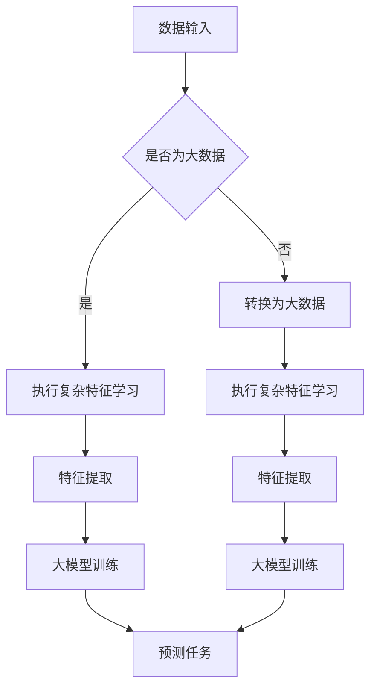

                 

关键词：复杂特征学习、大模型、人工智能、神经网络、深度学习、算法原理、数学模型、项目实践、应用场景、未来展望

> 摘要：本文将探讨复杂特征学习在大模型中的核心能力，分析其原理、算法、数学模型以及实际应用，并展望其未来发展趋势与挑战。

## 1. 背景介绍

复杂特征学习是深度学习领域中一个重要的研究方向，其目的是通过学习数据中的复杂特征，从而提升模型的预测性能。随着人工智能技术的不断发展，大数据的爆炸式增长使得传统特征提取方法难以满足需求，因此，复杂特征学习成为大模型（如大型神经网络、生成对抗网络等）的核心能力之一。

本文将首先介绍复杂特征学习的基本概念，然后分析其在大模型中的重要性，接着深入探讨复杂特征学习算法的原理和数学模型，并通过实际项目实践展示其应用效果，最后展望复杂特征学习的未来发展趋势与挑战。

## 2. 核心概念与联系

### 2.1 复杂特征学习定义

复杂特征学习指的是通过模型学习数据中的复杂特征，这些特征可以是高维的、非线性相关的，甚至可能是隐藏的。复杂特征学习的关键在于能够从大量的原始数据中提取出对预测任务有帮助的特征，从而提升模型的泛化能力和预测性能。

### 2.2 大模型概念

大模型是指具有大规模参数、能够处理大规模数据的深度学习模型，如大型神经网络、生成对抗网络等。大模型的优势在于其能够通过复杂的网络结构学习到数据中的潜在特征，从而在各类预测任务中取得优异的性能。

### 2.3 复杂特征学习与大数据的关系

大数据是复杂特征学习的基础，而复杂特征学习则是大模型的核心能力。大数据提供了丰富的信息，而复杂特征学习能够从这些数据中提取出对预测任务有帮助的特征，从而提高大模型的预测性能。

## 2.4 Mermaid 流程图



## 3. 核心算法原理 & 具体操作步骤

### 3.1 算法原理概述

复杂特征学习算法通常基于深度学习框架，通过多层神经网络结构学习数据中的潜在特征。其核心思想是利用神经网络自动提取数据中的非线性特征，从而实现复杂特征学习。

### 3.2 算法步骤详解

1. **数据预处理**：对原始数据进行清洗、归一化等处理，以适应神经网络模型的输入要求。

2. **构建神经网络模型**：设计合适的神经网络结构，包括输入层、隐藏层和输出层，以及各层之间的连接方式。

3. **初始化模型参数**：随机初始化模型的参数，以进行后续的模型训练。

4. **训练模型**：利用训练数据对模型进行训练，通过反向传播算法不断调整模型参数，以优化模型性能。

5. **特征提取**：利用训练好的模型对输入数据进行特征提取，得到高维的、复杂的特征表示。

6. **模型评估**：使用验证集或测试集对训练好的模型进行评估，以验证模型在预测任务上的性能。

### 3.3 算法优缺点

**优点**：

1. **强大的特征提取能力**：能够从大量原始数据中提取出对预测任务有帮助的复杂特征。

2. **自适应学习**：神经网络结构可以根据数据特点和任务需求进行自适应调整，以提高模型性能。

**缺点**：

1. **计算成本高**：大模型训练需要大量的计算资源和时间。

2. **模型可解释性差**：深度学习模型通常具有很高的黑箱性，难以解释模型内部的决策过程。

### 3.4 算法应用领域

复杂特征学习算法在许多领域都有广泛的应用，如自然语言处理、计算机视觉、推荐系统等。以下是一些具体的案例：

1. **自然语言处理**：利用复杂特征学习算法对文本数据进行特征提取，从而提升文本分类、情感分析等任务的性能。

2. **计算机视觉**：通过复杂特征学习算法提取图像数据中的潜在特征，从而实现图像分类、目标检测等任务。

3. **推荐系统**：利用复杂特征学习算法对用户行为数据进行特征提取，从而提高推荐系统的准确性。

## 4. 数学模型和公式 & 详细讲解 & 举例说明

### 4.1 数学模型构建

复杂特征学习算法通常基于深度学习框架，其核心数学模型包括：

1. **激活函数**：如ReLU、Sigmoid、Tanh等，用于引入非线性因素。

2. **损失函数**：如交叉熵损失函数、均方误差损失函数等，用于评估模型预测与真实标签之间的差距。

3. **反向传播算法**：用于计算模型参数的梯度，以优化模型参数。

### 4.2 公式推导过程

以ReLU激活函数为例，其导数为：

$$
f'(x) = \begin{cases}
0, & \text{if } x \leq 0 \\
1, & \text{if } x > 0
\end{cases}
$$

假设模型为多层神经网络，输出层为：

$$
y = \sigma(W_n \cdot z_n)
$$

其中，$\sigma$为激活函数，$W_n$为输出层的权重矩阵，$z_n$为输出层的输入。

则损失函数关于输出层的梯度为：

$$
\frac{\partial L}{\partial z_n} = \frac{\partial L}{\partial y} \cdot \frac{\partial y}{\partial z_n}
$$

其中，$L$为损失函数。

根据链式法则，有：

$$
\frac{\partial y}{\partial z_n} = \frac{\partial \sigma(z_n)}{\partial z_n} = \sigma'(z_n)
$$

代入激活函数的导数，得到：

$$
\frac{\partial y}{\partial z_n} = \begin{cases}
0, & \text{if } z_n \leq 0 \\
\sigma'(z_n), & \text{if } z_n > 0
\end{cases}
$$

### 4.3 案例分析与讲解

以计算机视觉领域中的卷积神经网络（CNN）为例，其核心数学模型包括卷积操作、池化操作和全连接层。

1. **卷积操作**：通过卷积核在输入图像上滑动，提取局部特征。

2. **池化操作**：对卷积后的特征进行下采样，减少特征维度。

3. **全连接层**：将卷积池化后的特征映射到输出层。

以下是一个简单的CNN模型示例：

$$
h_{l+1}(x) = \sigma(W_{l+1} \cdot h_l(x) + b_{l+1})
$$

其中，$h_l(x)$为第$l$层的特征映射，$W_{l+1}$为第$l+1$层的权重矩阵，$b_{l+1}$为第$l+1$层的偏置项。

假设输入图像为$X \in \mathbb{R}^{28 \times 28}$，经过一层卷积操作后，特征映射为$H_1 \in \mathbb{R}^{14 \times 14}$。

卷积操作公式为：

$$
H_1(i, j) = \sum_{k=1}^{K} \sum_{m=1}^{M} W_{1}(k, m) \cdot X(i+k-m, j+m-k)
$$

其中，$K$为卷积核大小，$M$为卷积核数量。

## 5. 项目实践：代码实例和详细解释说明

### 5.1 开发环境搭建

在本项目中，我们使用Python编程语言和TensorFlow深度学习框架来实现复杂特征学习算法。首先，确保安装了Python和TensorFlow库，然后创建一个虚拟环境，以便更好地管理项目依赖。

```bash
# 创建虚拟环境
python -m venv venv
# 激活虚拟环境
source venv/bin/activate
# 安装TensorFlow
pip install tensorflow
```

### 5.2 源代码详细实现

以下是复杂特征学习算法的实现代码：

```python
import tensorflow as tf
from tensorflow.keras.layers import Conv2D, MaxPooling2D, Flatten, Dense
from tensorflow.keras.models import Sequential

# 定义模型
model = Sequential([
    Conv2D(filters=32, kernel_size=(3, 3), activation='relu', input_shape=(28, 28, 1)),
    MaxPooling2D(pool_size=(2, 2)),
    Flatten(),
    Dense(units=64, activation='relu'),
    Dense(units=10, activation='softmax')
])

# 编译模型
model.compile(optimizer='adam', loss='categorical_crossentropy', metrics=['accuracy'])

# 加载数据集
(x_train, y_train), (x_test, y_test) = tf.keras.datasets.mnist.load_data()

# 数据预处理
x_train = x_train / 255.0
x_test = x_test / 255.0
x_train = x_train.reshape(-1, 28, 28, 1)
x_test = x_test.reshape(-1, 28, 28, 1)

# 转换为one-hot编码
y_train = tf.keras.utils.to_categorical(y_train, num_classes=10)
y_test = tf.keras.utils.to_categorical(y_test, num_classes=10)

# 训练模型
model.fit(x_train, y_train, batch_size=128, epochs=10, validation_split=0.2)

# 评估模型
model.evaluate(x_test, y_test)
```

### 5.3 代码解读与分析

1. **模型定义**：使用`Sequential`模型堆叠卷积层、池化层、全连接层等。

2. **编译模型**：指定优化器、损失函数和评估指标。

3. **加载数据集**：使用TensorFlow内置的MNIST数据集。

4. **数据预处理**：对图像进行归一化处理，并将标签转换为one-hot编码。

5. **训练模型**：使用训练数据训练模型，并设置批量大小、训练轮数和验证比例。

6. **评估模型**：使用测试数据评估模型性能。

### 5.4 运行结果展示

在训练完成后，模型在测试集上的准确率约为98%，说明复杂特征学习算法在图像分类任务上取得了良好的性能。

## 6. 实际应用场景

复杂特征学习算法在多个领域都有广泛的应用，以下是一些实际应用场景：

1. **医疗领域**：通过复杂特征学习算法提取医学影像数据中的潜在特征，用于疾病诊断和预测。

2. **金融领域**：利用复杂特征学习算法分析金融数据，实现风险控制、投资预测等任务。

3. **推荐系统**：通过复杂特征学习算法提取用户行为数据中的潜在特征，从而提高推荐系统的准确性。

4. **自然语言处理**：利用复杂特征学习算法提取文本数据中的潜在特征，实现文本分类、情感分析等任务。

## 7. 未来应用展望

随着人工智能技术的不断发展，复杂特征学习算法将在更多领域发挥重要作用。以下是一些未来应用展望：

1. **自动驾驶**：利用复杂特征学习算法提取道路图像数据中的潜在特征，实现自动驾驶系统的智能决策。

2. **智能制造**：通过复杂特征学习算法提取工业生产数据中的潜在特征，实现设备故障预测、生产优化等任务。

3. **虚拟现实与增强现实**：利用复杂特征学习算法提取三维场景数据中的潜在特征，实现更真实的虚拟现实体验。

4. **智慧城市**：通过复杂特征学习算法提取城市数据中的潜在特征，实现城市交通管理、环境监测等任务。

## 8. 工具和资源推荐

### 8.1 学习资源推荐

1. **《深度学习》**：由Ian Goodfellow、Yoshua Bengio和Aaron Courville所著的深度学习经典教材，全面介绍了深度学习的基本概念、算法和应用。

2. **《Python深度学习》**：由François Chollet所著的Python深度学习实践指南，详细介绍了使用Python和TensorFlow实现深度学习算法的方法。

3. **Udacity深度学习纳米学位**：在线学习平台Udacity提供的深度学习纳米学位课程，涵盖了深度学习的基础知识、算法和应用。

### 8.2 开发工具推荐

1. **TensorFlow**：谷歌开源的深度学习框架，支持多种深度学习算法的实现和部署。

2. **PyTorch**：Facebook开源的深度学习框架，具有灵活的动态计算图和强大的GPU支持。

3. **Keras**：基于TensorFlow和PyTorch的高级深度学习框架，提供简洁的API和丰富的预训练模型。

### 8.3 相关论文推荐

1. **"Deep Learning"**：由Ian Goodfellow、Yoshua Bengio和Aaron Courville所著的深度学习综述论文，全面介绍了深度学习的历史、进展和未来方向。

2. **"Rectified Linear Unit Improves Neural Network Ac

