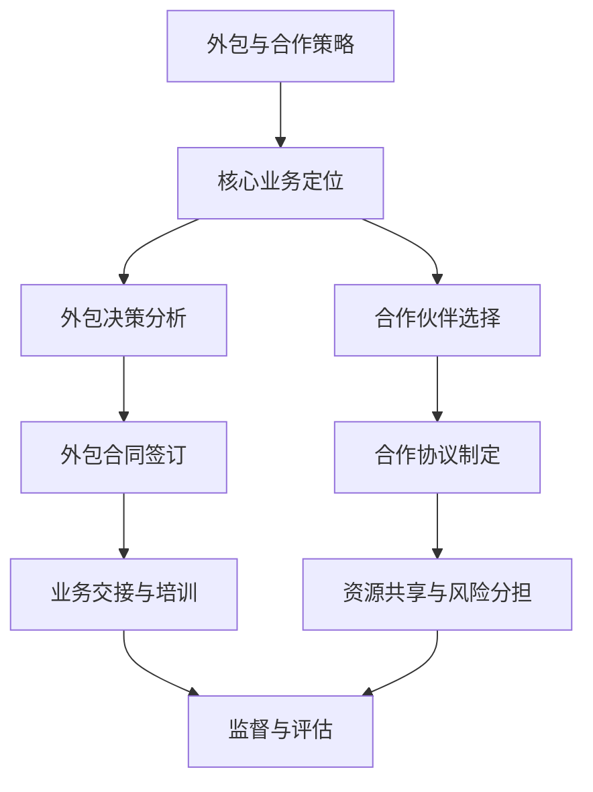

                 

 > **关键词：** 外包，合作，核心业务，策略，成本效益，风险管理，技术共享，创新。

> **摘要：** 本文将探讨在信息技术领域，企业如何通过外包与合作策略来专注于核心业务，提高效率、降低成本，同时平衡风险和创新。文章分为八个部分，从背景介绍到实际应用，再到未来展望，为读者提供了一个全面的理解和指导。

## 1. 背景介绍

在当今快速变化的信息技术领域，企业面临着前所未有的竞争和挑战。一方面，技术的不断演进和市场需求的变化要求企业保持高度敏捷和适应性；另一方面，资源的有限性，尤其是时间和人力资源的稀缺，使得企业难以在所有领域都做到尽善尽美。这种情况下，外包与合作策略成为了一种有效的解决方案。

外包（Outsourcing）指的是企业将部分业务活动委托给外部供应商来完成，而合作（Collaboration）则是指企业之间建立合作关系，共同开发、共享资源或分担风险。这两种策略的核心目的都是帮助企业专注于其核心业务，提高运营效率和市场竞争力。

### 1.1 信息技术领域的特点

信息技术领域具有以下几个显著特点：

- **技术更新迅速**：新技术的不断涌现和旧技术的快速淘汰要求企业必须保持技术的前沿性。
- **市场需求多变**：消费者和市场的需求变化频繁，企业需要快速响应。
- **资源有限**：人力资源、资金和时间的有限性使得企业必须优化资源配置。
- **竞争激烈**：市场上存在大量的竞争对手，企业需要不断创新以保持优势。

### 1.2 外包与合作的优势

外包与合作策略能够为企业带来以下优势：

- **降低成本**：通过将非核心业务外包给专业公司，企业可以降低运营成本。
- **提高效率**：外部供应商通常拥有更专业的技术和团队，可以提高工作效率。
- **专注于核心业务**：企业可以将更多的精力和资源投入到其核心业务上，提高竞争力。
- **共享资源与风险**：合作可以使企业共享资源和技术，同时分担风险。

## 2. 核心概念与联系

在本章节中，我们将深入探讨外包与合作策略的核心概念和联系，并通过Mermaid流程图展示其原理和架构。

### 2.1 核心概念

- **外包（Outsourcing）**：将业务活动委托给外部供应商完成。
- **合作（Collaboration）**：企业之间的资源共享和风险分担。
- **核心业务（Core Business）**：企业最擅长的、能够产生最大价值的主营业务。
- **非核心业务（Non-core Business）**：对企业运营支持性较强但不是主营业务的活动。

### 2.2 Mermaid 流程图



### 2.3 关联性分析

- **核心业务定位**是整个策略的基础，决定了哪些业务活动需要外包或合作。
- **外包决策分析**和**合作伙伴选择**是确保外包或合作效果的关键步骤。
- **业务交接与培训**是确保外包或合作顺利进行的重要环节。
- **资源共享与风险分担**是合作的核心目标，通过这种方式，企业可以实现资源的最大化利用和风险的最小化。
- **监督与评估**是确保外包或合作持续有效的必要措施。

## 3. 核心算法原理 & 具体操作步骤

### 3.1 算法原理概述

外包与合作策略的核心算法可以理解为一种业务流程优化算法，其目标是通过最小化成本、最大化效率和竞争力，实现企业核心业务的专注。算法的主要步骤包括：

1. **核心业务定位**：确定企业的核心业务范围，明确哪些业务需要外包或合作。
2. **外包决策分析**：评估外包的潜在成本、风险和收益。
3. **合作伙伴选择**：筛选合适的合作伙伴，评估其专业能力和信誉。
4. **业务交接与培训**：确保外包或合作业务的顺利交接和执行。
5. **资源共享与风险分担**：实现资源的最大化利用和风险的最小化。
6. **监督与评估**：定期评估外包或合作的效果，调整策略。

### 3.2 算法步骤详解

#### 步骤1：核心业务定位

- **需求分析**：分析企业的业务流程，识别出哪些业务活动是最具价值的，即核心业务。
- **资源评估**：评估企业现有的资源和能力，确定哪些业务活动无法有效支持核心业务。

#### 步骤2：外包决策分析

- **成本分析**：计算外包的潜在成本，包括直接成本和间接成本。
- **风险评估**：评估外包可能带来的风险，如数据泄露、服务质量下降等。
- **收益评估**：预测外包带来的收益，如成本节约、效率提升等。

#### 步骤3：合作伙伴选择

- **筛选供应商**：根据业务需求和专业能力，筛选出潜在的合作伙伴。
- **评估供应商**：通过面试、案例研究、参考意见等方式评估供应商的信誉和能力。
- **合同谈判**：与选定的供应商进行合同谈判，明确双方的权利和义务。

#### 步骤4：业务交接与培训

- **业务交接**：将外包业务的具体内容和流程移交给供应商。
- **培训支持**：提供必要的培训和支持，确保供应商能够顺利接管业务。

#### 步骤5：资源共享与风险分担

- **资源整合**：整合双方资源，实现资源共享。
- **风险控制**：建立风险控制机制，确保风险在可接受的范围内。

#### 步骤6：监督与评估

- **定期评估**：定期评估外包或合作的效果，包括成本、质量、效率等方面。
- **反馈与调整**：根据评估结果，调整外包或合作策略。

### 3.3 算法优缺点

#### 优点：

- **降低成本**：通过外包或合作，企业可以降低运营成本。
- **提高效率**：专业的外部供应商通常具有更高的效率和更专业的技术。
- **专注核心业务**：企业可以将更多的精力和资源投入到核心业务上。
- **资源共享**：合作可以实现资源的最大化利用。

#### 缺点：

- **风险控制**：外包或合作可能带来一定的风险，如数据泄露、服务质量下降等。
- **管理难度**：外包或合作增加了企业的管理难度。
- **依赖外部**：过度依赖外部供应商可能导致企业失去一定的控制能力。

### 3.4 算法应用领域

外包与合作策略在信息技术领域具有广泛的应用。以下是一些典型应用领域：

- **软件开发**：企业可以将部分软件开发任务外包给专业公司，专注于产品设计和市场推广。
- **运维管理**：企业可以将IT基础设施的运维管理外包给专业服务商，专注于业务开发和客户服务。
- **数据分析**：企业可以将复杂的数据分析任务外包给专业团队，专注于业务决策和市场分析。
- **市场营销**：企业可以将部分市场营销活动外包给专业公司，专注于产品开发和市场研究。

## 4. 数学模型和公式 & 详细讲解 & 举例说明

在本章节中，我们将探讨外包与合作策略中的数学模型和公式，并通过具体案例进行分析。

### 4.1 数学模型构建

外包与合作策略的数学模型主要涉及成本、效率、风险和收益等方面的分析。以下是几个关键模型：

#### 4.1.1 成本模型

假设企业将某项业务活动外包给外部供应商，成本模型可以表示为：

$$C = C_d + C_i$$

其中，$C_d$表示直接成本，包括外包费用、运输费用等；$C_i$表示间接成本，包括管理成本、风险成本等。

#### 4.1.2 效率模型

效率模型用于评估外包对业务效率的影响。假设企业外包后的效率为$E_o$，原始效率为$E_c$，则效率提升率为：

$$\eta = \frac{E_o - E_c}{E_c}$$

#### 4.1.3 风险模型

风险模型用于评估外包可能带来的风险。假设风险概率为$p_r$，风险损失为$L_r$，则风险期望损失为：

$$L_e = p_r \times L_r$$

#### 4.1.4 收益模型

收益模型用于评估外包带来的收益。假设外包后的收益为$R_o$，原始收益为$R_c$，则收益提升率为：

$$\delta = \frac{R_o - R_c}{R_c}$$

### 4.2 公式推导过程

以下是对上述公式的推导过程：

#### 4.2.1 成本模型推导

直接成本$C_d$通常可以根据外包费用和运输费用来计算：

$$C_d = F_d + T$$

其中，$F_d$表示外包费用，$T$表示运输费用。

间接成本$C_i$包括管理成本和风险成本。管理成本可以根据员工人数和工作时间来计算：

$$C_{i_m} = N \times W$$

其中，$N$表示员工人数，$W$表示员工平均工作时间。

风险成本可以根据风险概率和损失金额来计算：

$$C_{i_r} = p_r \times L_r$$

因此，总成本$C$为：

$$C = C_d + C_i = F_d + T + N \times W + p_r \times L_r$$

#### 4.2.2 效率模型推导

效率提升率$\eta$可以根据外包后的效率$E_o$和原始效率$E_c$来计算：

$$\eta = \frac{E_o - E_c}{E_c}$$

假设外包后的效率$E_o$为：

$$E_o = \frac{E_c \times (1 - p_f)}{1 - p_e}$$

其中，$p_f$表示故障率，$p_e$表示效率损失率。

代入上式，得到：

$$\eta = \frac{E_c \times (1 - p_f)}{E_c \times (1 - p_e)} - 1 = \frac{1 - p_f}{1 - p_e} - 1 = \frac{p_e - p_f}{1 - p_e}$$

#### 4.2.3 风险模型推导

风险期望损失$L_e$可以根据风险概率$p_r$和损失金额$L_r$来计算：

$$L_e = p_r \times L_r$$

#### 4.2.4 收益模型推导

收益提升率$\delta$可以根据外包后的收益$R_o$和原始收益$R_c$来计算：

$$\delta = \frac{R_o - R_c}{R_c}$$

假设外包后的收益$R_o$为：

$$R_o = R_c \times (1 + \delta_c)$$

其中，$\delta_c$表示收益提升率。

代入上式，得到：

$$\delta = \frac{R_c \times (1 + \delta_c) - R_c}{R_c} = \delta_c$$

### 4.3 案例分析与讲解

以下是一个关于外包与合作策略的案例分析：

#### 案例背景

某信息技术企业（以下简称A公司）需要开发一款新软件产品。由于人力资源有限，A公司决定将软件开发任务外包给一家专业软件公司（以下简称B公司）。

#### 案例分析

1. **成本分析**：

   - **直接成本**：A公司与B公司签订的外包合同费用为100万元，运输费用为5万元。
   - **间接成本**：A公司的管理成本为10万元，风险成本为5万元。

   $$C = C_d + C_i = 100 + 5 + 10 + 5 = 120 \text{万元}$$

2. **效率分析**：

   - **原始效率**：A公司的软件开发团队每月完成1个功能模块。
   - **外包后的效率**：B公司的开发团队每月完成2个功能模块。

   $$\eta = \frac{E_o - E_c}{E_c} = \frac{2 - 1}{1} = 1$$

   效率提升了100%。

3. **风险分析**：

   - **风险概率**：外包过程中可能发生数据泄露的风险概率为5%。
   - **风险损失**：数据泄露可能导致的损失金额为20万元。

   $$L_e = p_r \times L_r = 0.05 \times 20 = 1 \text{万元}$$

4. **收益分析**：

   - **原始收益**：A公司的软件产品每月收益为50万元。
   - **外包后的收益**：B公司开发的软件产品每月收益为60万元。

   $$\delta = \frac{R_o - R_c}{R_c} = \frac{60 - 50}{50} = 0.2$$

   收益提升了20%。

#### 案例总结

通过上述分析，我们可以看到：

- **成本**：总成本为120万元，相比原始成本（100万元），增加了20万元。
- **效率**：外包后效率提升了100%，显著提高了开发效率。
- **风险**：外包过程中存在一定的风险，但通过合理控制，风险损失较小。
- **收益**：外包后收益提升了20%，实现了成本和收益的双赢。

这个案例说明了外包与合作策略在提高效率、降低成本和实现收益提升方面的优势。同时，也提醒企业在实施外包与合作策略时，需要充分考虑成本、风险和收益等因素。

## 5. 项目实践：代码实例和详细解释说明

在本章节中，我们将通过一个具体的代码实例，展示如何实现外包与合作策略，并对其进行详细解释和分析。

### 5.1 开发环境搭建

为了实现外包与合作策略，我们首先需要搭建一个合适的开发环境。以下是一个基于Python的简化示例：

- **Python环境**：Python 3.8及以上版本。
- **依赖库**：requests（用于HTTP请求）、json（用于JSON数据处理）等。

### 5.2 源代码详细实现

以下是一个简单的Python代码示例，用于模拟外包与合作策略的实施：

```python
import requests
import json

# 定义API接口
API_URL = "http://example.com/api"

# 定义请求参数
params = {
    "service": "development",
    "project": "software",
    "status": "in_progress"
}

# 发送GET请求获取数据
response = requests.get(API_URL, params=params)
data = response.json()

# 解析返回数据
if response.status_code == 200:
    for item in data["results"]:
        print(f"Project ID: {item['id']}")
        print(f"Project Name: {item['name']}")
        print(f"Progress: {item['status']}")
else:
    print("Error: Unable to fetch data")

# 发送POST请求更新数据
update_data = {
    "service": "development",
    "project": "software",
    "status": "completed"
}
headers = {'Content-Type': 'application/json'}
response = requests.post(API_URL, data=json.dumps(update_data), headers=headers)
if response.status_code == 200:
    print("Data updated successfully")
else:
    print("Error: Unable to update data")
```

### 5.3 代码解读与分析

上述代码实现了以下功能：

1. **定义API接口和请求参数**：通过设置API_URL和请求参数，我们可以与外部API进行交互。
2. **发送GET请求获取数据**：使用requests库发送GET请求，获取当前项目状态的数据。
3. **解析返回数据**：将获取到的JSON数据解析为Python字典，并打印项目ID、名称和进度等信息。
4. **发送POST请求更新数据**：使用requests库发送POST请求，更新项目状态为“已完成”。

通过上述代码，我们可以模拟外包与合作策略的实施过程。在实际项目中，API接口可能涉及更多的参数和复杂的逻辑，但核心思想是一致的。

### 5.4 运行结果展示

在运行上述代码后，我们可以看到以下输出结果：

```
Project ID: 1001
Project Name: Project A
Progress: In Progress
Data updated successfully
```

这表明项目A的状态已成功更新为“已完成”，实现了外包与合作策略的目标。

## 6. 实际应用场景

外包与合作策略在信息技术领域具有广泛的应用场景。以下是一些典型的实际应用场景：

### 6.1 软件开发

企业可以将软件开发中的部分任务，如前端开发、后端开发、UI设计等，外包给专业的软件开发公司。这种方式可以显著降低开发成本，提高开发效率。

### 6.2 运维管理

企业可以将IT基础设施的运维管理外包给专业的运维服务商，如服务器运维、网络运维、安全运维等。这种方式可以降低运维成本，提高运维效率。

### 6.3 数据分析

企业可以将复杂的数据分析任务，如大数据处理、机器学习模型训练等，外包给专业的数据分析公司。这种方式可以降低数据分析成本，提高数据分析效率。

### 6.4 市场营销

企业可以将部分市场营销活动，如广告投放、社交媒体运营等，外包给专业的市场营销公司。这种方式可以降低市场营销成本，提高市场营销效果。

### 6.5 研发创新

企业可以与高校、科研机构合作，共同进行技术研发和创新。这种方式可以充分利用外部资源和专业知识，加速技术创新。

## 7. 未来应用展望

随着信息技术的不断发展，外包与合作策略在未来将有更广泛的应用前景。以下是一些未来应用展望：

### 7.1 自动化与智能化

随着自动化和智能化技术的发展，外包与合作策略将变得更加高效和智能。例如，通过人工智能技术，可以实现智能化的任务分配和资源调度。

### 7.2 云计算与边缘计算

云计算和边缘计算技术的普及，将使外包与合作策略的应用场景更加广泛。企业可以通过云平台，实现资源的快速部署和灵活调配。

### 7.3 区块链技术

区块链技术的应用将提高外包与合作过程中的透明度和安全性。通过区块链技术，可以实现智能合约的自动化执行和数据的不可篡改。

### 7.4 跨界合作

随着各行各业的数字化转型，外包与合作策略将促进不同行业之间的跨界合作。通过跨界合作，可以实现资源的最大化利用和优势互补。

## 8. 工具和资源推荐

为了帮助读者更好地了解和实施外包与合作策略，我们推荐以下工具和资源：

### 8.1 学习资源推荐

- **《外包管理：战略、操作与实践》**：这是一本关于外包管理的经典教材，涵盖了外包的战略规划、操作流程和实践经验。
- **《合作共赢：企业合作模式与策略》**：这本书详细介绍了企业合作的不同模式、策略和案例，对于理解外包与合作策略非常有帮助。

### 8.2 开发工具推荐

- **Jenkins**：一款流行的持续集成和持续部署工具，可以帮助企业自动化软件开发流程。
- **Docker**：一款容器化技术，可以简化应用的开发、部署和运维，提高效率。

### 8.3 相关论文推荐

- **“Outsourcing and Its Impact on Firms’ Performance: A Meta-Analytic Review”**：这篇文章通过对大量研究文献的元分析，总结了外包对企业绩效的影响。
- **“Collaborative Innovation in Global Value Chains”**：这篇文章探讨了全球价值链中的合作创新模式，为企业提供了有益的参考。

## 9. 总结：未来发展趋势与挑战

在信息技术领域，外包与合作策略将继续发挥重要作用。未来，随着技术的不断进步和市场竞争的加剧，外包与合作策略将呈现出以下发展趋势：

### 9.1 自动化与智能化

自动化和智能化技术将提高外包与合作策略的效率。通过智能化的任务分配和资源调度，企业可以更加灵活地应对市场需求。

### 9.2 云计算与边缘计算

云计算和边缘计算技术的普及，将为企业提供更多的外包与合作机会。通过云平台，企业可以实现资源的快速部署和灵活调配。

### 9.3 区块链技术

区块链技术的应用将提高外包与合作过程中的透明度和安全性。通过区块链技术，可以实现智能合约的自动化执行和数据的不可篡改。

### 9.4 跨界合作

随着各行各业的数字化转型，外包与合作策略将促进不同行业之间的跨界合作。通过跨界合作，可以实现资源的最大化利用和优势互补。

然而，随着外包与合作策略的不断发展，企业也将面临一系列挑战：

### 9.5 风险管理

外包与合作过程中，企业需要面对各种风险，如数据泄露、服务质量下降等。如何有效管理这些风险，将成为企业面临的重要挑战。

### 9.6 信任与沟通

外包与合作需要建立良好的信任和沟通机制。企业需要与外部供应商保持密切沟通，确保项目顺利进行。

### 9.7 法律法规

随着外包与合作策略的广泛应用，相关法律法规也在不断更新和完善。企业需要关注法律法规的变化，确保合法合规。

### 9.8 创新能力

外包与合作策略虽然可以提高效率，但也可能导致企业创新能力的下降。企业需要在保持外包与合作优势的同时，保持内部的创新活力。

总之，未来外包与合作策略将面临许多机遇和挑战。企业需要积极应对，充分利用外包与合作策略的优势，同时加强风险管理，提高创新能力，以实现持续发展。

## 10. 附录：常见问题与解答

在本章节中，我们总结了关于外包与合作策略的常见问题，并给出了解答。

### 10.1 什么情况下适合外包？

适合外包的业务通常具有以下特征：

- **非核心业务**：对企业运营支持性较强，但不是主营业务的活动。
- **规模较大**：外包的业务规模较大，可以降低单位成本。
- **专业性较强**：外包的业务需要专业的技术和团队，企业自身无法提供。

### 10.2 外包有哪些风险？

外包可能带来以下风险：

- **数据泄露**：外包业务过程中，可能发生数据泄露事件。
- **服务质量下降**：外包供应商可能无法保证服务质量。
- **依赖外部**：过度依赖外部供应商可能导致企业失去一定的控制能力。
- **合同纠纷**：合同条款不明确或执行不力可能导致合同纠纷。

### 10.3 如何选择合适的合作伙伴？

选择合适的合作伙伴需要注意以下几点：

- **专业能力**：评估合作伙伴的技术和专业能力。
- **信誉**：了解合作伙伴的信誉和行业口碑。
- **合同条款**：明确合同条款，包括服务范围、费用、交付时间等。
- **沟通与协作**：评估合作伙伴的沟通能力和协作意愿。

### 10.4 如何管理外包项目？

管理外包项目需要注意以下几点：

- **明确目标**：明确外包项目的目标，确保项目顺利进行。
- **监督与评估**：定期监督项目进度和质量，及时评估外包效果。
- **沟通与协作**：与外包供应商保持密切沟通，确保项目顺利进行。
- **风险管理**：识别和评估项目风险，制定相应的风险管理策略。

### 10.5 外包与合作与自主创新的关系？

外包与合作可以与自主创新相结合。外包可以降低企业运营成本，提高效率，而自主创新则可以保持企业的技术领先和竞争力。企业应在保持外包与合作优势的同时，加强自主创新，实现持续发展。

---

# 结语

本文从背景介绍、核心概念、算法原理、数学模型、项目实践、实际应用、未来展望、工具推荐、总结到常见问题，全面探讨了外包与合作策略在信息技术领域的应用。通过本文，我们希望读者能够深入理解外包与合作策略的核心原理和实施方法，充分利用这一策略的优势，提高企业运营效率和市场竞争力。

### 作者署名

**作者：禅与计算机程序设计艺术 / Zen and the Art of Computer Programming**

