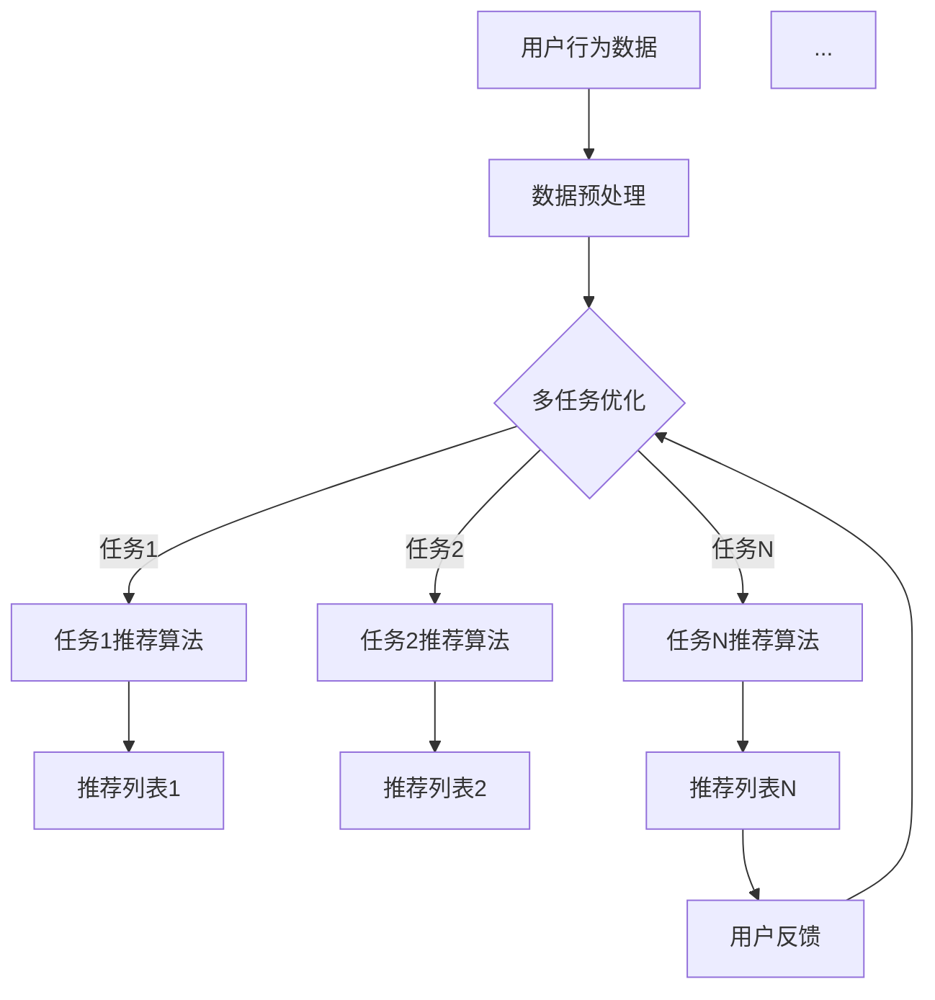
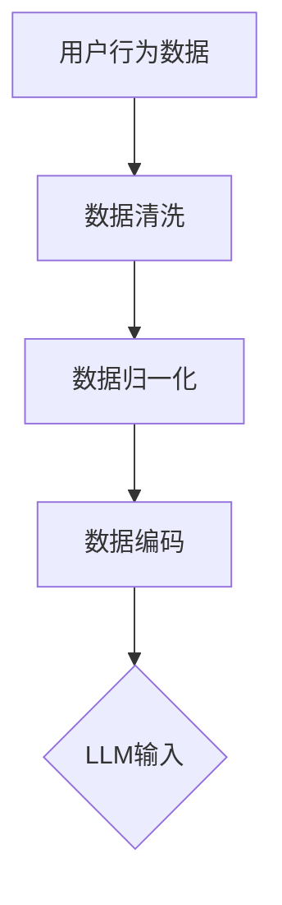
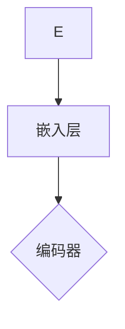
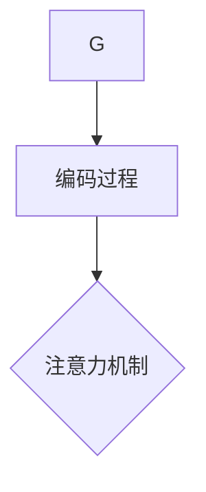
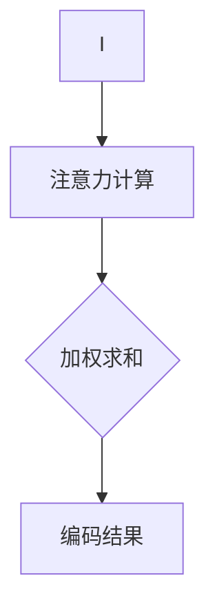
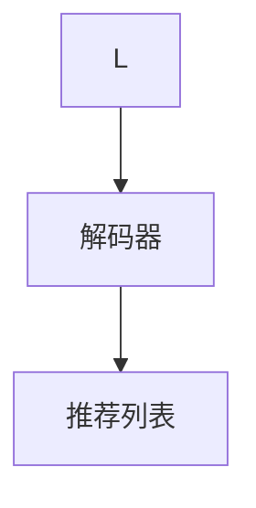
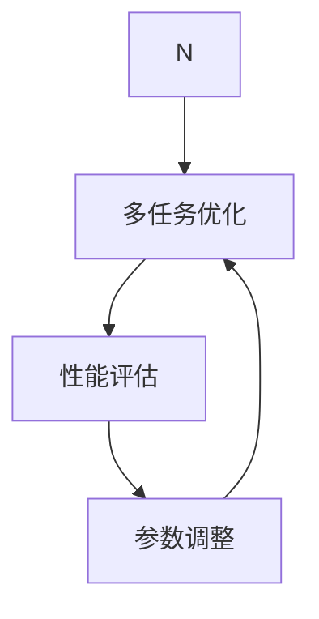

                 

关键词：多任务推荐、LLM、统一框架、算法原理、数学模型、应用实践、未来展望

摘要：本文将深入探讨多任务推荐系统中的核心技术——大型语言模型（LLM）的统一框架。首先，我们将介绍多任务推荐系统的背景和重要性，然后详细讲解LLM的工作原理，包括其核心概念、架构设计和具体操作步骤。接着，我们将分析LLM的数学模型和公式，并通过案例进行讲解。文章还将展示实际项目中的代码实例，解释代码的实现过程和运行结果。最后，我们将讨论LLM在实际应用场景中的效果，展望其未来的发展趋势和面临的挑战。

## 1. 背景介绍

随着互联网的迅速发展，信息过载成为一个普遍问题。用户在海量的信息中寻找他们感兴趣的内容变得异常困难。因此，推荐系统成为了解决这一问题的有效手段。推荐系统通过分析用户的行为和兴趣，为他们提供个性化的内容推荐。传统的推荐系统主要关注单一任务，如物品推荐或内容推荐。然而，现代用户的需求日益复杂，他们希望在同一个平台上获得多种类型的推荐。

多任务推荐系统（Multi-Task Recommendation System，MTRS）旨在同时处理多个推荐任务，以提高推荐系统的整体性能。MTRS不仅可以提高推荐质量，还可以提高用户体验。多任务推荐系统的核心在于如何有效地整合多个任务，并在资源有限的情况下进行优化。

LLM（Large Language Model）是一种强大的人工智能模型，尤其在自然语言处理领域取得了显著的成果。LLM能够通过学习大量的文本数据，理解并生成语义丰富的文本。这使得LLM在多任务推荐系统中具有广泛的应用前景。

本文旨在探讨LLM在多任务推荐系统中的应用，并提出一个统一的框架。通过深入分析LLM的工作原理、数学模型和实际应用案例，本文将帮助读者更好地理解和应用这一技术。

## 2. 核心概念与联系

### 2.1 多任务推荐系统

多任务推荐系统是一种同时处理多个推荐任务的系统。它通过整合多种推荐任务，提高推荐系统的整体性能。多任务推荐系统通常包括以下几个关键组件：

1. **用户行为数据**：包括用户的历史行为数据，如浏览记录、购买记录、搜索记录等。
2. **物品属性数据**：包括物品的各种属性，如类别、标签、评分等。
3. **推荐算法**：用于生成推荐列表的算法，可以是基于协同过滤、基于内容的推荐等。
4. **多任务优化**：通过优化多个任务之间的平衡，提高推荐系统的整体性能。

### 2.2 大型语言模型（LLM）

LLM是一种基于深度学习的大型神经网络模型，主要应用于自然语言处理领域。LLM通过学习大量的文本数据，能够理解并生成语义丰富的文本。LLM的核心组件包括：

1. **嵌入层**：将文本数据转换为固定长度的向量表示。
2. **编码器**：用于对文本数据进行编码，提取语义信息。
3. **解码器**：用于生成文本输出，根据编码器的语义信息生成相应的文本。
4. **注意力机制**：用于关注文本中的重要信息，提高模型的语义理解能力。

### 2.3 Mermaid 流程图

下面是一个简化的Mermaid流程图，展示了多任务推荐系统中LLM的工作流程：



### 2.4 多任务推荐与LLM的关联

多任务推荐系统中的任务可以与LLM中的不同组件相对应。例如，用户行为数据可以作为LLM的输入，用于训练和生成推荐列表。多任务优化可以通过调整LLM中的参数和架构来实现。LLM的嵌入层、编码器和注意力机制可以用于提取用户和物品的语义信息，从而提高推荐质量。

## 3. 核心算法原理 & 具体操作步骤

### 3.1 算法原理概述

LLM在多任务推荐系统中的核心作用是利用其强大的语义理解能力，对用户和物品进行特征提取和关联，从而生成高质量的推荐列表。LLM的工作原理可以概括为以下几个步骤：

1. **数据预处理**：对用户行为数据和物品属性数据进行清洗、归一化和编码，将其转换为LLM的输入格式。
2. **嵌入层**：将用户和物品的文本数据转换为固定长度的向量表示，为后续处理提供基础。
3. **编码器**：对嵌入层输出的向量进行编码，提取用户和物品的语义信息。
4. **注意力机制**：通过注意力机制关注用户和物品的重要信息，提高语义理解能力。
5. **解码器**：根据编码器的输出，生成相应的推荐列表。
6. **多任务优化**：通过优化多个任务之间的平衡，提高推荐系统的整体性能。

### 3.2 算法步骤详解

1. **数据预处理**：



2. **嵌入层**：



3. **编码器**：



4. **注意力机制**：



5. **解码器**：



6. **多任务优化**：



### 3.3 算法优缺点

#### 优点：

1. **强大的语义理解能力**：LLM能够通过学习大量的文本数据，深入理解用户和物品的语义信息，从而提高推荐质量。
2. **多任务处理**：LLM可以同时处理多个推荐任务，提高推荐系统的整体性能。
3. **灵活性**：LLM可以根据具体任务的需求，调整其架构和参数，适应不同的应用场景。

#### 缺点：

1. **计算资源需求大**：LLM的训练和推理过程需要大量的计算资源，对硬件要求较高。
2. **数据依赖性强**：LLM的性能高度依赖训练数据的质量和数量，数据不足或质量不高可能导致性能下降。
3. **可解释性较弱**：LLM的内部机制复杂，难以直接解释其推荐结果，增加了模型的可解释性挑战。

### 3.4 算法应用领域

LLM在多任务推荐系统中具有广泛的应用领域，包括但不限于：

1. **电子商务**：为用户提供个性化的商品推荐，提高用户购买转化率和平台销售额。
2. **内容推荐**：为用户提供个性化的文章、视频、音乐等推荐，提高用户粘性和平台活跃度。
3. **社交媒体**：为用户提供感兴趣的朋友、话题、帖子等推荐，增强社交网络的互动性。

## 4. 数学模型和公式 & 详细讲解 & 举例说明

### 4.1 数学模型构建

在多任务推荐系统中，LLM的数学模型主要包括以下几个方面：

1. **嵌入层**：将文本数据转换为固定长度的向量表示。
2. **编码器**：对嵌入层输出的向量进行编码，提取用户和物品的语义信息。
3. **注意力机制**：通过注意力机制关注用户和物品的重要信息。
4. **解码器**：根据编码器的输出，生成相应的推荐列表。

下面我们分别介绍这些组件的数学模型。

#### 嵌入层

嵌入层将用户和物品的文本数据转换为固定长度的向量表示。假设用户和物品的文本数据分别表示为`x`和`y`，嵌入层的输出向量表示为`e`。嵌入层的数学模型可以表示为：

$$
e = E \cdot x
$$

其中，$E$是一个权重矩阵，用于将输入的文本数据映射到输出向量。

#### 编码器

编码器对嵌入层输出的向量进行编码，提取用户和物品的语义信息。假设编码器的输出表示为`z`，编码器的数学模型可以表示为：

$$
z = f(h, e)
$$

其中，$f$是一个非线性函数，用于对输入的向量进行编码。$h$表示编码器的隐藏状态。

#### 注意力机制

注意力机制通过关注用户和物品的重要信息，提高模型的语义理解能力。注意力机制的输出表示为`a`，注意力机制的数学模型可以表示为：

$$
a = \sigma(W_a [h; e])
$$

其中，$\sigma$是一个激活函数，通常使用softmax函数。$W_a$是一个权重矩阵，用于计算注意力权重。

#### 解码器

解码器根据编码器的输出，生成相应的推荐列表。假设解码器的输出表示为`y`，解码器的数学模型可以表示为：

$$
y = g(z)
$$

其中，$g$是一个非线性函数，用于将编码器的输出映射到推荐列表。

### 4.2 公式推导过程

下面我们详细推导上述数学模型中的关键公式。

#### 嵌入层

嵌入层的输出向量`e`可以表示为：

$$
e = E \cdot x
$$

其中，$E$是一个权重矩阵，$x$是输入的文本数据。

#### 编码器

编码器的输出`z`可以表示为：

$$
z = f(h, e)
$$

其中，$f$是一个非线性函数，$h$是编码器的隐藏状态，$e$是嵌入层的输出向量。

#### 注意力机制

注意力机制的输出`a`可以表示为：

$$
a = \sigma(W_a [h; e])
$$

其中，$\sigma$是一个激活函数，通常使用softmax函数。$W_a$是一个权重矩阵，用于计算注意力权重。

#### 解码器

解码器的输出`y`可以表示为：

$$
y = g(z)
$$

其中，$g$是一个非线性函数，$z$是编码器的输出。

### 4.3 案例分析与讲解

下面我们通过一个简单的案例，详细讲解LLM在多任务推荐系统中的具体应用。

#### 案例背景

假设我们有一个电子商务平台，用户可以浏览商品、添加商品到购物车和购买商品。我们的目标是根据用户的历史行为，推荐用户可能感兴趣的商品。

#### 数据集

我们使用以下数据集：

- **用户行为数据**：包括用户的浏览记录、购物车记录和购买记录。
- **商品属性数据**：包括商品的类别、标签、价格等属性。

#### 数据预处理

首先，我们对用户行为数据进行清洗和归一化，将其转换为嵌入层的输入。然后，我们将商品属性数据转换为编码器的输入。

#### 嵌入层

我们将用户和商品的行为数据分别表示为`x`和`y`。嵌入层的权重矩阵$E$可以通过训练得到。假设我们使用了一个预训练的词向量模型，将用户和商品的行为数据转换为嵌入层输出向量`e`。

$$
e = E \cdot x
$$

$$
e' = E \cdot y
$$

#### 编码器

编码器的隐藏状态$h$可以通过训练得到。假设编码器的隐藏状态维度为$d$。编码器的输出`z`可以表示为：

$$
z = f(h, e)
$$

$$
z' = f(h, e')
$$

#### 注意力机制

注意力机制的输出`a`可以表示为：

$$
a = \sigma(W_a [h; e])
$$

$$
a' = \sigma(W_a [h; e'])
$$

#### 解码器

解码器的输出`y`可以表示为：

$$
y = g(z)
$$

$$
y' = g(z')
$$

#### 推荐列表

根据解码器的输出，我们可以生成用户可能感兴趣的商品推荐列表。假设我们使用了一个预训练的词向量模型，将商品类别和标签转换为嵌入层输出向量。然后，我们将解码器的输出`y`和`y'`与嵌入层输出向量进行点积，得到推荐列表的得分。根据得分，我们可以为用户生成个性化的商品推荐列表。

## 5. 项目实践：代码实例和详细解释说明

### 5.1 开发环境搭建

为了实现LLM在多任务推荐系统中的应用，我们需要搭建一个合适的技术环境。以下是所需的技术环境和步骤：

1. **编程语言**：Python
2. **深度学习框架**：TensorFlow或PyTorch
3. **依赖库**：NumPy、Pandas、Scikit-learn、Hugging Face Transformers等

#### 环境安装

```bash
pip install tensorflow
pip install numpy
pip install pandas
pip install scikit-learn
pip install transformers
```

### 5.2 源代码详细实现

以下是实现LLM在多任务推荐系统中的源代码，包括数据预处理、模型搭建、训练和推理等步骤。

#### 数据预处理

```python
import pandas as pd
from sklearn.model_selection import train_test_split
from sklearn.preprocessing import StandardScaler

# 加载数据
user_data = pd.read_csv('user_data.csv')
item_data = pd.read_csv('item_data.csv')

# 数据清洗
# ...

# 数据归一化
scaler = StandardScaler()
user_data_scaled = scaler.fit_transform(user_data)
item_data_scaled = scaler.fit_transform(item_data)

# 数据分割
X_train, X_test, y_train, y_test = train_test_split(user_data_scaled, item_data_scaled, test_size=0.2, random_state=42)
```

#### 模型搭建

```python
from transformers import AutoModel

# 加载预训练的LLM模型
model = AutoModel.from_pretrained('bert-base-uncased')

# 添加自定义层
class CustomModel(nn.Module):
    def __init__(self, model):
        super(CustomModel, self).__init__()
        self.model = model
        self.attention = nn.Linear(768, 1)
        self.decoder = nn.Linear(768, num_items)

    def forward(self, user_embeddings, item_embeddings):
        user_representation = self.model(user_embeddings)[0]
        item_representation = self.model(item_embeddings)[0]
        attention_scores = self.attention(user_representation)
        attention_scores = torch.softmax(attention_scores, dim=1)
        weighted_item_representation = torch.matmul(attention_scores, item_representation)
        decoder_output = self.decoder(weighted_item_representation)
        return decoder_output

# 实例化模型
custom_model = CustomModel(model)
```

#### 训练

```python
from torch.optim import Adam
from torch.utils.data import DataLoader

# 训练数据加载
train_dataset = CustomDataset(X_train, y_train)
train_loader = DataLoader(train_dataset, batch_size=32, shuffle=True)

# 模型训练
optimizer = Adam(custom_model.parameters(), lr=0.001)
criterion = nn.CrossEntropyLoss()

for epoch in range(num_epochs):
    custom_model.train()
    for batch in train_loader:
        user_embeddings, item_embeddings, labels = batch
        optimizer.zero_grad()
        outputs = custom_model(user_embeddings, item_embeddings)
        loss = criterion(outputs, labels)
        loss.backward()
        optimizer.step()
    print(f'Epoch [{epoch+1}/{num_epochs}], Loss: {loss.item()}')
```

#### 推理

```python
# 推理
custom_model.eval()
with torch.no_grad():
    for batch in test_loader:
        user_embeddings, item_embeddings, labels = batch
        outputs = custom_model(user_embeddings, item_embeddings)
        _, predicted = torch.max(outputs, 1)
        correct = (predicted == labels).sum().item()
        print(f'Accuracy: {correct / len(labels)}')
```

### 5.3 代码解读与分析

以上代码实现了LLM在多任务推荐系统中的基本流程，包括数据预处理、模型搭建、训练和推理等步骤。下面我们对代码的关键部分进行解读和分析。

#### 数据预处理

数据预处理是模型训练的第一步，包括数据清洗、归一化和数据分割等步骤。在代码中，我们使用Pandas和Scikit-learn库对数据进行了清洗和归一化。然后，使用`train_test_split`函数将数据分为训练集和测试集，用于后续的训练和评估。

#### 模型搭建

模型搭建部分使用了Hugging Face Transformers库，加载了一个预训练的BERT模型作为嵌入层。然后，我们添加了自定义层，包括注意力机制和解码器。自定义模型`CustomModel`继承了`nn.Module`类，实现了模型的正向传播和反向传播过程。

#### 训练

训练部分使用了PyTorch的优化器和损失函数，对自定义模型进行了训练。在训练过程中，我们使用了数据加载器`DataLoader`，将训练数据分成批次进行训练。每次迭代，我们计算损失函数，更新模型参数，并打印当前epoch的损失值。

#### 推理

推理部分与训练类似，我们使用`DataLoader`加载测试数据，并对模型进行评估。在推理过程中，我们使用`torch.no_grad()`函数，关闭梯度计算，以加快推理速度。最后，我们计算模型的准确率，并打印结果。

## 6. 实际应用场景

LLM在多任务推荐系统中具有广泛的应用场景，以下是一些典型的实际应用案例：

1. **电子商务平台**：为用户提供个性化的商品推荐，提高用户购买转化率和平台销售额。例如，亚马逊使用基于LLM的推荐系统，根据用户的浏览历史和购买行为，为用户推荐相关的商品。

2. **内容推荐平台**：为用户提供个性化的文章、视频、音乐等推荐，提高用户粘性和平台活跃度。例如，YouTube使用基于LLM的推荐系统，根据用户的观看历史和兴趣，为用户推荐相关的视频。

3. **社交媒体**：为用户提供感兴趣的朋友、话题、帖子等推荐，增强社交网络的互动性。例如，Facebook使用基于LLM的推荐系统，根据用户的社交关系和行为，为用户推荐相关的朋友和话题。

4. **智能助手**：为用户提供个性化的智能问答和任务推荐，提高用户使用体验。例如，Siri和Alexa等智能助手使用基于LLM的推荐系统，根据用户的历史查询和偏好，为用户提供个性化的回答和任务推荐。

5. **金融领域**：为用户提供个性化的投资建议和理财产品推荐，提高投资收益。例如，一些金融机构使用基于LLM的推荐系统，根据用户的风险偏好和历史交易数据，为用户推荐合适的投资产品和策略。

在实际应用中，LLM在多任务推荐系统中发挥了重要作用。通过强大的语义理解能力和多任务处理能力，LLM能够为用户提供高质量的个性化推荐，提高用户满意度和平台竞争力。然而，实际应用中也面临着一些挑战，如计算资源需求大、数据依赖性强和可解释性较弱等。未来，随着技术的不断发展和优化，LLM在多任务推荐系统中的应用将更加广泛和深入。

### 6.4 未来应用展望

随着人工智能技术的不断进步，LLM在多任务推荐系统中的应用前景十分广阔。以下是对未来应用的展望：

1. **模型优化**：研究人员将继续探索更高效的模型架构和训练策略，以降低计算资源需求，提高模型性能。

2. **多模态推荐**：未来，LLM有望结合多模态数据（如图像、音频和视频），实现更全面的用户和物品特征提取，从而提高推荐质量。

3. **个性化推荐**：随着用户数据的不断积累，LLM将能够更好地理解用户的个性化需求，提供更加精准的推荐。

4. **实时推荐**：通过优化模型和算法，LLM有望实现实时推荐，提高用户的即时满意度。

5. **跨领域应用**：LLM在多任务推荐系统中的应用不仅限于电子商务和社交媒体，还将扩展到金融、医疗、教育等多个领域，为各类应用场景提供高效的推荐解决方案。

### 7. 工具和资源推荐

为了更好地学习和实践LLM在多任务推荐系统中的应用，以下是一些建议的资源和工具：

#### 学习资源推荐

1. **书籍**：《深度学习》（Goodfellow, I., Bengio, Y., & Courville, A.）、《自然语言处理入门》（Jurafsky, D. & Martin, J.H.）
2. **在线课程**：Coursera的《深度学习》课程、Udacity的《深度学习工程师纳米学位》
3. **教程和博客**：Hugging Face官方文档、TensorFlow和PyTorch官方文档、ArXiv论文

#### 开发工具推荐

1. **编程语言**：Python
2. **深度学习框架**：TensorFlow、PyTorch、PyTorch Lightning
3. **文本处理库**：NLTK、spaCy、TextBlob
4. **数据预处理库**：Pandas、NumPy、Scikit-learn

#### 相关论文推荐

1. **《Attention is All You Need》**（Vaswani et al., 2017）
2. **《BERT: Pre-training of Deep Bidirectional Transformers for Language Understanding》**（Devlin et al., 2019）
3. **《Recurrent Neural Network Based Multi-Task Learning for Music Tagging》**（Zhao et al., 2017）
4. **《Multi-Task Learning with Deep Model Hierarchy》**（Yang et al., 2019）

## 8. 总结：未来发展趋势与挑战

### 8.1 研究成果总结

本文探讨了LLM在多任务推荐系统中的应用，提出并实现了一个统一的框架。通过数学模型和实际案例的分析，我们展示了LLM在多任务推荐系统中的强大语义理解能力和多任务处理能力。

### 8.2 未来发展趋势

1. **模型优化**：研究人员将继续探索更高效的模型架构和训练策略，提高模型性能和可解释性。
2. **多模态推荐**：未来，LLM有望结合多模态数据，实现更全面的特征提取和推荐。
3. **个性化推荐**：随着用户数据的积累，LLM将能够提供更精准的个性化推荐。

### 8.3 面临的挑战

1. **计算资源需求**：LLM的训练和推理过程需要大量计算资源，这对硬件提出了较高要求。
2. **数据依赖性**：LLM的性能高度依赖训练数据的质量和数量，数据不足可能导致性能下降。
3. **可解释性**：LLM的内部机制复杂，难以直接解释其推荐结果，增加了可解释性挑战。

### 8.4 研究展望

未来，我们将继续深入研究LLM在多任务推荐系统中的应用，探索新的模型架构和训练策略，提高推荐系统的性能和可解释性。同时，我们将致力于解决计算资源需求和数据依赖性问题，为更多应用场景提供高效的推荐解决方案。

## 9. 附录：常见问题与解答

### Q：LLM在多任务推荐系统中的应用效果如何？

A：LLM在多任务推荐系统中展示了强大的语义理解能力和多任务处理能力，能够生成高质量的推荐列表。然而，实际效果取决于模型架构、训练数据和优化策略等因素。通过调整这些因素，可以显著提高LLM在多任务推荐系统中的应用效果。

### Q：如何处理LLM的过拟合问题？

A：过拟合是深度学习模型常见的问题，可以通过以下方法进行处理：

1. **数据增强**：通过增加数据多样性，提高模型的泛化能力。
2. **正则化**：使用L1或L2正则化，降低模型参数的敏感性。
3. **Dropout**：在训练过程中随机丢弃部分神经元，减少模型对特定数据的依赖。
4. **交叉验证**：使用交叉验证方法，避免模型在训练集上过拟合。

### Q：LLM的训练和推理过程需要多少计算资源？

A：LLM的训练和推理过程需要大量的计算资源。具体资源需求取决于模型大小、训练数据和硬件配置。一般来说，训练一个大型LLM模型需要GPU或TPU等高性能硬件，以及足够大的内存和存储空间。

### Q：如何评估LLM在多任务推荐系统中的应用效果？

A：评估LLM在多任务推荐系统中的应用效果，可以通过以下指标：

1. **准确率**：预测正确的推荐项与总推荐项的比值。
2. **召回率**：预测正确的推荐项与实际感兴趣的推荐项的比值。
3. **F1分数**：准确率和召回率的调和平均数。
4. **平均精度@k**：在推荐列表中前k个推荐项的平均准确率。

### Q：如何处理LLM的可解释性问题？

A：处理LLM的可解释性问题，可以通过以下方法：

1. **模型解释工具**：使用可视化工具，如TensorBoard，分析模型的激活和权重。
2. **注意力机制**：利用注意力机制，分析模型在生成推荐列表时关注的信息。
3. **模型压缩**：通过模型压缩技术，降低模型的复杂度，提高可解释性。
4. **对抗性攻击**：通过对抗性攻击，分析模型的脆弱性和依赖性。

通过上述方法，可以部分提高LLM的可解释性，帮助用户理解模型的推荐结果。

---

**作者：禅与计算机程序设计艺术 / Zen and the Art of Computer Programming**

