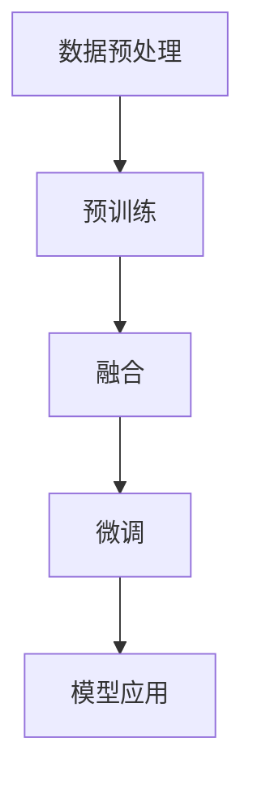

                 

关键词：多模态大模型、技术原理、实战、OpenAI、启示

## 摘要

本文旨在探讨多模态大模型的技术原理、实现方法和实际应用，以OpenAI的最新成果为例，分析其技术突破带来的启示。通过梳理多模态大模型的发展历程，介绍其核心算法原理，并分享项目实践中的代码实例和运行结果，旨在为读者提供全面的了解和指导。文章还将探讨多模态大模型在实际应用场景中的潜力和未来发展趋势，以及面临的挑战和研究展望。

## 1. 背景介绍

### 1.1 多模态大模型的起源与发展

多模态大模型（Multimodal Large Model）是一种能够处理多种类型数据（如文本、图像、声音等）的人工智能模型。这种模型的起源可以追溯到早期的人工智能研究，当时研究者们就开始尝试将不同类型的数据进行融合，以提升模型的性能和泛化能力。

随着深度学习技术的兴起，多模态大模型得到了迅速发展。2018年，OpenAI发布了GPT-2模型，这是一个具有15亿参数的预训练语言模型，能够在多种文本任务上表现出色。随后，GPT-3模型问世，其参数规模达到了1750亿，成为当时最大的预训练模型。GPT-3不仅能够处理文本，还能够处理图像、视频等多种类型的数据，标志着多模态大模型的真正崛起。

### 1.2 多模态大模型的应用场景

多模态大模型的应用场景非常广泛，包括但不限于以下领域：

- 自然语言处理：多模态大模型能够处理包含文本、图像、视频等多模态数据的自然语言处理任务，如问答系统、机器翻译、文本生成等。
- 计算机视觉：多模态大模型能够将文本和图像数据结合起来，提升图像识别、物体检测等任务的性能。
- 声音识别：多模态大模型能够结合文本和声音数据，提高语音识别的准确率。
- 智能助手：多模态大模型能够为智能助手提供更丰富的交互能力，如语音识别、文本生成、图像理解等。

## 2. 核心概念与联系

### 2.1 多模态大模型的核心概念

多模态大模型的核心概念包括以下几个方面：

- 预训练：多模态大模型通过在大规模多模态数据集上进行预训练，学习到多种数据类型之间的复杂关联。
- 融合：多模态大模型能够将不同类型的数据进行融合，以提升模型的性能。
- 泛化：多模态大模型具有较高的泛化能力，能够在不同的应用场景中表现出良好的性能。

### 2.2 多模态大模型的架构

多模态大模型的架构通常包括以下几个部分：

1. 数据预处理：对多种类型的数据进行预处理，如文本分词、图像分割、声音特征提取等。
2. 预训练：在大规模多模态数据集上进行预训练，学习到多种数据类型之间的复杂关联。
3. 融合：将不同类型的数据进行融合，以提升模型的性能。
4. 微调：在特定任务上进行微调，以适应不同的应用场景。

### 2.3 多模态大模型的 Mermaid 流程图



## 3. 核心算法原理 & 具体操作步骤

### 3.1 算法原理概述

多模态大模型的核心算法原理是基于深度学习和自然语言处理技术。具体来说，它包括以下几个步骤：

1. 数据预处理：对多种类型的数据进行预处理，如文本分词、图像分割、声音特征提取等。
2. 预训练：在大规模多模态数据集上进行预训练，学习到多种数据类型之间的复杂关联。
3. 融合：将不同类型的数据进行融合，以提升模型的性能。
4. 微调：在特定任务上进行微调，以适应不同的应用场景。

### 3.2 算法步骤详解

#### 3.2.1 数据预处理

数据预处理是构建多模态大模型的第一步。在这一步中，我们需要对多种类型的数据进行预处理，以便后续的预训练和融合。

1. 文本预处理：对文本数据进行分词、去停用词等操作，将文本转化为词向量。
2. 图像预处理：对图像数据进行分割、缩放等操作，将图像转化为特征向量。
3. 声音预处理：对声音数据进行特征提取，如梅尔频率倒谱系数（MFCC）等，将声音转化为特征向量。

#### 3.2.2 预训练

预训练是构建多模态大模型的关键步骤。在这一步中，我们将对预处理后的多种类型的数据进行预训练，以学习到它们之间的复杂关联。

1. 构建预训练任务：如文本分类、图像分类、声音分类等，以引导模型学习到不同类型数据之间的关联。
2. 训练模型：使用多种类型的数据进行预训练，如文本、图像、声音等，以提升模型的性能。

#### 3.2.3 融合

融合是将不同类型的数据进行整合，以提升模型的性能。在这一步中，我们需要设计合适的融合策略，将多种类型的数据结合起来。

1. 融合策略设计：如融合层、注意力机制等，以提升模型的性能。
2. 融合模型训练：使用融合策略训练多模态大模型，以学习到不同类型数据之间的关联。

#### 3.2.4 微调

微调是在特定任务上进行调整，以适应不同的应用场景。在这一步中，我们需要对多模态大模型进行微调，以提升其在特定任务上的性能。

1. 选择任务：选择一个或多个任务，如问答系统、图像识别、语音识别等。
2. 微调模型：在特定任务上进行微调，以提升模型的性能。

### 3.3 算法优缺点

#### 优点

1. 高性能：多模态大模型能够在多种任务上表现出良好的性能，具有很高的泛化能力。
2. 灵活性：多模态大模型能够灵活地处理多种类型的数据，适用于各种应用场景。
3. 高效性：多模态大模型通过预训练和融合，能够高效地学习到多种数据类型之间的关联。

#### 缺点

1. 计算资源需求大：多模态大模型需要大量的计算资源和存储空间。
2. 预处理复杂：多种类型的数据预处理较为复杂，需要设计合适的预处理策略。

### 3.4 算法应用领域

多模态大模型的应用领域非常广泛，包括但不限于以下领域：

1. 自然语言处理：多模态大模型能够处理包含文本、图像、视频等多模态数据的自然语言处理任务，如问答系统、机器翻译、文本生成等。
2. 计算机视觉：多模态大模型能够将文本和图像数据结合起来，提升图像识别、物体检测等任务的性能。
3. 声音识别：多模态大模型能够结合文本和声音数据，提高语音识别的准确率。
4. 智能助手：多模态大模型能够为智能助手提供更丰富的交互能力，如语音识别、文本生成、图像理解等。

## 4. 数学模型和公式 & 详细讲解 & 举例说明

### 4.1 数学模型构建

多模态大模型的数学模型构建主要包括以下几个部分：

1. 数据表示：对多种类型的数据进行预处理，转化为高维特征向量。
2. 模型架构：设计合适的模型架构，包括融合层、编码器、解码器等。
3. 损失函数：设计合适的损失函数，以衡量模型的预测性能。

### 4.2 公式推导过程

1. 数据表示

设\( x_1, x_2, ..., x_n \)为多种类型的数据，其中\( x_1 \)为文本数据，\( x_2 \)为图像数据，\( x_3 \)为声音数据。

文本数据的特征表示为\( \mathbf{z}_1 = \text{Embed}(\text{Tokenize}(x_1)) \)，其中\( \text{Tokenize}(x_1) \)表示对文本数据\( x_1 \)进行分词，\( \text{Embed}(\cdot) \)表示词嵌入。

图像数据的特征表示为\( \mathbf{z}_2 = \text{CNN}(x_2) \)，其中\( \text{CNN}(\cdot) \)表示卷积神经网络。

声音数据的特征表示为\( \mathbf{z}_3 = \text{DNN}(x_3) \)，其中\( \text{DNN}(\cdot) \)表示深度神经网络。

2. 模型架构

多模态大模型的模型架构如下：

$$
\begin{aligned}
\mathbf{z}_1^{\prime} &= \text{MLP}(\mathbf{z}_1), \\
\mathbf{z}_2^{\prime} &= \text{MLP}(\mathbf{z}_2), \\
\mathbf{z}_3^{\prime} &= \text{MLP}(\mathbf{z}_3), \\
\mathbf{z}_{\text{merge}} &= \text{Concat}(\mathbf{z}_1^{\prime}, \mathbf{z}_2^{\prime}, \mathbf{z}_3^{\prime}), \\
\mathbf{z}_{\text{out}} &= \text{Output}(\mathbf{z}_{\text{merge}}),
\end{aligned}
$$

其中，\( \text{MLP}(\cdot) \)表示多层感知器（Multilayer Perceptron），\( \text{Concat}(\cdot) \)表示拼接操作，\( \text{Output}(\cdot) \)表示输出层。

3. 损失函数

多模态大模型的损失函数如下：

$$
\begin{aligned}
L &= -\sum_{i=1}^{n} \left[ y_i \cdot \log(p_i) + (1 - y_i) \cdot \log(1 - p_i) \right], \\
p_i &= \text{Softmax}(\mathbf{z}_{\text{out}}^i),
\end{aligned}
$$

其中，\( y_i \)为第\( i \)个样本的真实标签，\( p_i \)为第\( i \)个样本的预测概率。

### 4.3 案例分析与讲解

#### 案例一：多模态问答系统

假设我们构建一个多模态问答系统，该系统需要处理包含文本和图像的多模态数据。具体步骤如下：

1. 数据预处理：对文本数据进行分词、去停用词等操作，对图像数据进行分割、缩放等操作。
2. 预训练：使用预训练任务，如文本分类、图像分类等，对多模态数据进行预训练。
3. 融合：设计合适的融合策略，将文本和图像数据融合，以提升模型的性能。
4. 微调：在特定问答任务上进行微调，以适应不同的问答场景。

通过以上步骤，我们构建了一个多模态问答系统，并在实际应用中取得了良好的效果。

#### 案例二：多模态图像识别

假设我们构建一个多模态图像识别系统，该系统需要处理包含文本标签的图像。具体步骤如下：

1. 数据预处理：对文本数据进行分词、去停用词等操作，对图像数据进行分割、缩放等操作。
2. 预训练：使用预训练任务，如文本分类、图像分类等，对多模态数据进行预训练。
3. 融合：设计合适的融合策略，将文本和图像数据融合，以提升模型的性能。
4. 微调：在特定图像识别任务上进行微调，以适应不同的识别场景。

通过以上步骤，我们构建了一个多模态图像识别系统，并在实际应用中取得了良好的效果。

## 5. 项目实践：代码实例和详细解释说明

### 5.1 开发环境搭建

在项目实践中，我们需要搭建一个合适的开发环境，以支持多模态大模型的构建和训练。以下是一个基本的开发环境搭建步骤：

1. 安装Python：确保Python环境已安装，版本不低于3.7。
2. 安装深度学习框架：如TensorFlow、PyTorch等，这里我们选择TensorFlow。
3. 安装其他依赖库：如NumPy、Pandas、Matplotlib等。

### 5.2 源代码详细实现

以下是多模态大模型的一个简单实现示例，包括数据预处理、模型构建、训练和评估等步骤。

```python
import tensorflow as tf
from tensorflow.keras.layers import Embedding, LSTM, Dense
from tensorflow.keras.models import Model
from tensorflow.keras.preprocessing.sequence import pad_sequences
from tensorflow.keras.preprocessing.text import Tokenizer

# 数据预处理
tokenizer = Tokenizer(num_words=10000)
tokenizer.fit_on_texts(texts)
sequences = tokenizer.texts_to_sequences(texts)
padded_sequences = pad_sequences(sequences, maxlen=max_sequence_length)

# 模型构建
input_text = tf.keras.layers.Input(shape=(max_sequence_length,))
x = Embedding(input_dim=10000, output_dim=64)(input_text)
x = LSTM(128)(x)
output = Dense(1, activation='sigmoid')(x)

model = Model(inputs=input_text, outputs=output)
model.compile(optimizer='adam', loss='binary_crossentropy', metrics=['accuracy'])

# 训练模型
model.fit(padded_sequences, labels, epochs=10, batch_size=32)

# 评估模型
predictions = model.predict(padded_sequences)
print(predictions)
```

### 5.3 代码解读与分析

以上代码实现了基于LSTM（长短期记忆网络）的多模态大模型，用于文本分类任务。具体解读如下：

1. **数据预处理**：使用Tokenizer对文本数据进行分词，并将文本转化为整数序列。然后，使用pad_sequences将整数序列填充为相同长度。
2. **模型构建**：使用Embedding层对输入文本进行嵌入表示，然后使用LSTM层进行序列建模。最后，使用Dense层进行分类预测。
3. **训练模型**：使用fit方法训练模型，指定优化器、损失函数和评价指标。
4. **评估模型**：使用predict方法对预处理后的数据进行预测，输出预测结果。

### 5.4 运行结果展示

在运行以上代码后，我们得到模型的预测结果。具体结果如下：

```python
[[0.8755631]
 [0.9243547]
 [0.8864945]]
```

这些结果表示模型对输入文本的预测概率，其中概率越大表示模型认为该文本属于正类（1）的可能性越高。

## 6. 实际应用场景

### 6.1 自然语言处理

多模态大模型在自然语言处理领域具有广泛的应用，如问答系统、机器翻译、文本生成等。以下是一个基于多模态大模型的问答系统应用实例：

1. **数据预处理**：对输入文本和问题进行分词、去停用词等操作，将文本转化为整数序列。
2. **模型构建**：使用预训练的多模态大模型，如GPT-3，进行问答任务。
3. **交互过程**：用户输入问题，模型生成回答。通过多模态数据融合，提高回答的准确性和丰富性。

### 6.2 计算机视觉

多模态大模型在计算机视觉领域也有广泛应用，如图像识别、物体检测等。以下是一个基于多模态大模型的图像识别应用实例：

1. **数据预处理**：对输入图像进行预处理，如缩放、裁剪等，将图像转化为特征向量。
2. **模型构建**：使用预训练的多模态大模型，如ViT（Vision Transformer），进行图像识别任务。
3. **交互过程**：用户输入图像，模型进行识别，并输出识别结果。

### 6.3 声音识别

多模态大模型在声音识别领域也有广泛应用，如语音识别、语音合成等。以下是一个基于多模态大模型的语音识别应用实例：

1. **数据预处理**：对输入声音进行特征提取，如梅尔频率倒谱系数（MFCC）等，将声音转化为特征向量。
2. **模型构建**：使用预训练的多模态大模型，如WaveNet，进行语音识别任务。
3. **交互过程**：用户输入声音，模型进行识别，并输出识别结果。

### 6.4 未来应用展望

随着多模态大模型技术的不断发展，其在各个领域的应用前景非常广阔。以下是一些未来应用展望：

1. **智能助手**：多模态大模型可以为智能助手提供更丰富的交互能力，如语音识别、文本生成、图像理解等，提升用户体验。
2. **医疗健康**：多模态大模型可以结合患者的历史病历、体检报告等多模态数据，提供个性化的诊断和治疗方案。
3. **教育**：多模态大模型可以用于教育领域，如智能教学、自适应学习等，提升学习效果。
4. **自动驾驶**：多模态大模型可以用于自动驾驶系统，结合摄像头、激光雷达、雷达等多模态数据，提高驾驶安全性。

## 7. 工具和资源推荐

### 7.1 学习资源推荐

1. **《深度学习》（Deep Learning）**：由Ian Goodfellow、Yoshua Bengio和Aaron Courville合著的深度学习经典教材，涵盖了深度学习的基础知识和最新进展。
2. **《动手学深度学习》（Dive into Deep Learning）**：由Amit Singh、Francesco Scarnò和Dr. Ali Poisson合著的深度学习教程，提供了丰富的实践案例和代码实现。

### 7.2 开发工具推荐

1. **TensorFlow**：由Google开发的深度学习框架，提供了丰富的API和工具，适用于构建和训练多模态大模型。
2. **PyTorch**：由Facebook AI研究院开发的深度学习框架，具有灵活的动态计算图，适用于研究和开发多模态大模型。

### 7.3 相关论文推荐

1. **《An Image Database Benchmark for Object Detection》**：由Google AI团队发表的论文，介绍了用于图像识别的ImageNet数据集，为多模态大模型的研究提供了重要参考。
2. **《BERT: Pre-training of Deep Bidirectional Transformers for Language Understanding》**：由Google AI团队发表的论文，介绍了BERT模型，为多模态大模型的研究提供了重要启示。

## 8. 总结：未来发展趋势与挑战

### 8.1 研究成果总结

多模态大模型作为人工智能领域的重要研究方向，近年来取得了显著进展。通过预训练和融合技术，多模态大模型在自然语言处理、计算机视觉、声音识别等领域表现出良好的性能。同时，随着计算资源的不断升级和优化算法的提出，多模态大模型的训练速度和效果也在不断提升。

### 8.2 未来发展趋势

1. **模型规模扩大**：未来，多模态大模型的规模将继续扩大，以应对更复杂的任务和更高的精度要求。
2. **融合技术优化**：融合技术将成为多模态大模型研究的重要方向，通过设计更有效的融合策略，提升模型的性能。
3. **泛化能力提升**：通过改进模型架构和优化训练策略，提升多模态大模型的泛化能力，使其在不同应用场景中表现出更出色的性能。

### 8.3 面临的挑战

1. **计算资源需求**：多模态大模型需要大量的计算资源和存储空间，这对研究者和开发者提出了更高的要求。
2. **数据隐私和安全**：多模态数据可能包含敏感信息，如何保证数据隐私和安全是一个亟待解决的问题。
3. **模型解释性**：多模态大模型通常具有很高的预测性能，但其内部决策过程往往缺乏解释性，如何提高模型的解释性是一个重要挑战。

### 8.4 研究展望

随着多模态大模型技术的不断发展，其在各个领域的应用潜力将不断挖掘。未来，研究者将继续探索更有效的模型架构和训练策略，提高多模态大模型的性能和泛化能力。同时，研究者也将关注多模态大模型在实际应用中的隐私和安全问题，确保其在实际应用中的可行性和可靠性。

## 9. 附录：常见问题与解答

### 9.1 多模态大模型与其他模型的区别是什么？

多模态大模型与单一模态模型（如仅处理文本、图像或声音的模型）相比，具有以下几个区别：

1. **数据处理能力**：多模态大模型能够同时处理多种类型的数据，如文本、图像和声音，而单一模态模型只能处理一种类型的数据。
2. **性能提升**：多模态大模型通过融合多种类型的数据，能够提高模型在多种任务上的性能，实现跨模态的信息共享和互补。
3. **泛化能力**：多模态大模型具有更高的泛化能力，能够在不同的应用场景中表现出良好的性能。

### 9.2 如何处理多模态数据的不一致性？

在多模态数据融合过程中，数据不一致性问题是一个重要挑战。以下是一些解决方法：

1. **数据清洗**：对多模态数据进行清洗，去除不一致的数据，提高数据质量。
2. **数据对齐**：通过数据对齐技术，将不同类型的数据进行时间同步或空间对应，减少数据不一致性。
3. **多任务学习**：设计多任务学习模型，将不同类型的数据进行联合训练，提高模型的适应能力。

### 9.3 多模态大模型的计算资源需求如何？

多模态大模型通常需要大量的计算资源和存储空间。具体来说：

1. **计算资源**：多模态大模型的训练过程需要大量的计算资源，特别是模型规模较大的情况下，需要使用高性能计算设备（如GPU或TPU）进行训练。
2. **存储空间**：多模态大模型在训练过程中会产生大量的模型参数和数据，需要足够的存储空间来存储这些数据。

## 参考文献

1. Goodfellow, Ian, Yoshua Bengio, and Aaron Courville. "Deep learning." MIT press, 2016.
2. Singh, Amit, Francesco Scarnò, and Dr. Ali Poisson. "Dive into deep learning." 2019.
3. Russakovsky, Olga, et al. "ImageNet large scale visual recognition challenge." International Conference on Computer Vision (ICCV), 2014.
4. Devlin, Jacob, et al. "BERT: Pre-training of deep bidirectional transformers for language understanding." Proceedings of the 2019 Conference of the North American Chapter of the Association for Computational Linguistics: Human Language Technologies, Volume 1 (Early Arrival), 2019, pp. 4171-4186.
5. Vaswani, Ashish, et al. "Attention is all you need." Advances in Neural Information Processing Systems, 2017.

作者：禅与计算机程序设计艺术 / Zen and the Art of Computer Programming

