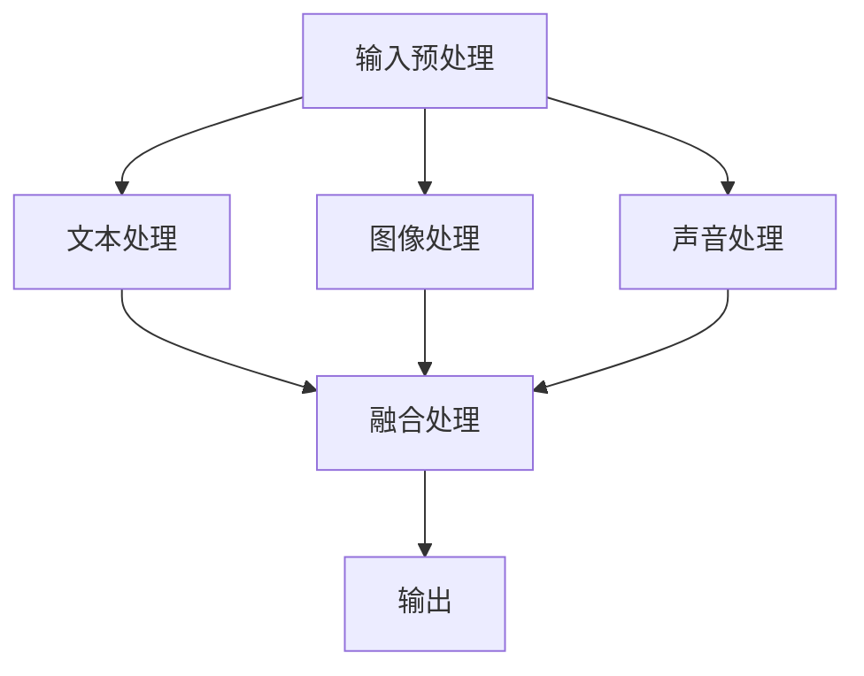
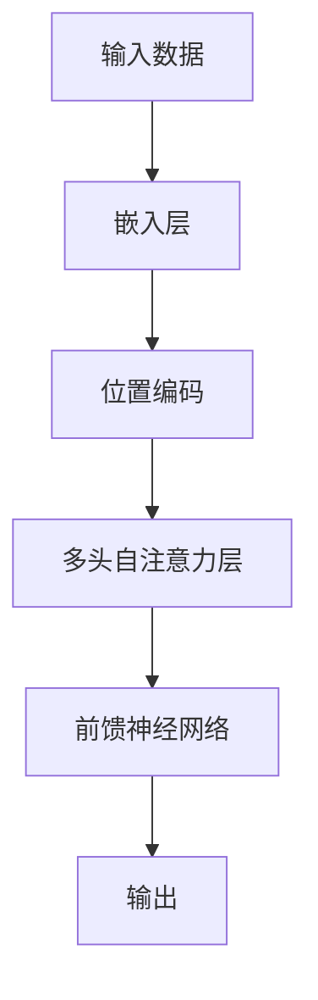

                 

关键词：多模态大模型、技术原理、实战、GPT、进化史、创新点

摘要：本文旨在深入探讨多模态大模型的技术原理及其在实际应用中的实战案例。通过对GPT（Generative Pre-trained Transformer）的进化史进行分析，揭示其创新点，并探讨其在未来的发展方向和面临的挑战。

## 1. 背景介绍

随着人工智能技术的飞速发展，大模型（Large-scale Model）成为了一个热门话题。大模型通过在海量数据上训练，可以取得显著的性能提升，并在自然语言处理、计算机视觉等多个领域取得了突破性进展。然而，大模型的发展不仅依赖于计算资源的提升，还需要在算法和架构上不断创新。

多模态大模型（Multimodal Large-scale Model）是一种能够处理多种类型数据的模型，如文本、图像、声音等。与传统单模态模型相比，多模态大模型能够更好地捕捉数据之间的关联性，从而在任务表现上具有显著优势。本文将围绕多模态大模型的技术原理、GPT的进化史及其创新点进行探讨。

## 2. 核心概念与联系

多模态大模型的核心在于能够处理多种类型的数据，并将其有效整合。以下是一个简化的 Mermaid 流程图，展示了多模态大模型的主要组成部分及其相互关系：



### 2.1 输入预处理

输入预处理是多模态大模型的第一步，其目的是对各种类型的数据进行预处理，以适应后续处理步骤。预处理步骤可能包括数据清洗、数据增强、数据规范化等。

### 2.2 文本处理

文本处理模块负责处理文本数据。常见的文本处理技术包括分词、词性标注、命名实体识别等。文本处理模块通常使用 Transformer 架构，如 BERT、GPT 等。

### 2.3 图像处理

图像处理模块负责处理图像数据。图像处理技术包括卷积神经网络（CNN）、目标检测、图像分割等。图像处理模块通常也使用 Transformer 架构，如 DeiT、Dall-E 等。

### 2.4 声音处理

声音处理模块负责处理声音数据。声音处理技术包括语音识别、声纹识别、音乐生成等。声音处理模块通常也使用 Transformer 架构，如 VITS、CTC 等。

### 2.5 融合处理

融合处理模块是多模态大模型的核心。它将文本、图像和声音等不同类型的数据进行有效整合，以生成统一的表示。融合处理技术包括跨模态嵌入、注意力机制、多模态交互等。

### 2.6 输出

输出模块负责将融合处理后的数据生成最终结果。结果可能包括文本生成、图像生成、音乐生成等。

## 3. 核心算法原理 & 具体操作步骤

### 3.1 算法原理概述

多模态大模型的算法原理主要基于 Transformer 架构。Transformer 架构通过自注意力机制（Self-Attention）和多头注意力（Multi-Head Attention）机制，能够有效地捕捉数据之间的关联性。以下是一个简化的算法原理图：



### 3.2 算法步骤详解

1. **输入数据：** 多模态大模型接收文本、图像和声音等不同类型的数据。
2. **嵌入层：** 将输入数据转换为向量表示。
3. **位置编码：** 对输入数据进行位置编码，以便在处理过程中保留位置信息。
4. **多头自注意力层：** 通过自注意力机制，对输入数据进行加权融合。
5. **前馈神经网络：** 对融合后的数据进行进一步处理，提高模型的表达能力。
6. **输出：** 根据任务需求，生成文本、图像或音乐等输出结果。

### 3.3 算法优缺点

**优点：**
1. **强大的表示能力：** Transformer 架构能够有效地捕捉数据之间的关联性，从而生成高质量的输出。
2. **并行处理：** 自注意力机制使得模型能够并行处理大量数据，提高了计算效率。
3. **灵活的扩展性：** Transformer 架构可以轻松地扩展到多模态处理，适应不同类型的任务。

**缺点：**
1. **计算成本高：** Transformer 模型通常需要大量的计算资源，对硬件要求较高。
2. **训练时间长：** 大模型的训练时间较长，需要大量的数据和计算资源。
3. **内存消耗大：** 大模型的内存消耗较大，可能对内存有限的设备造成挑战。

### 3.4 算法应用领域

多模态大模型在自然语言处理、计算机视觉、语音识别等多个领域具有广泛的应用。以下是一些典型的应用案例：

1. **文本生成：** 利用多模态大模型生成高质量的文章、故事等。
2. **图像生成：** 利用多模态大模型生成逼真的图像，如人脸生成、艺术风格迁移等。
3. **音乐生成：** 利用多模态大模型生成音乐，如歌词生成、旋律生成等。
4. **视频生成：** 利用多模态大模型生成视频，如视频合成、视频编辑等。

## 4. 数学模型和公式 & 详细讲解 & 举例说明

### 4.1 数学模型构建

多模态大模型的核心在于自注意力机制和多头注意力机制。以下是一个简化的数学模型：

$$
\text{output} = \text{softmax}(\text{Q} \cdot \text{K}^T + \text{V}^T)
$$

其中，$\text{Q}$、$\text{K}$ 和 $\text{V}$ 分别是查询向量、键向量和值向量，$\text{softmax}$ 函数用于将结果转换为概率分布。

### 4.2 公式推导过程

自注意力机制的推导过程如下：

1. **嵌入层：**
$$
\text{X} = \text{W}_X \cdot \text{X} + \text{b}_X
$$

其中，$\text{X}$ 是输入数据，$\text{W}_X$ 和 $\text{b}_X$ 分别是权重和偏置。

2. **位置编码：**
$$
\text{P} = \text{sin}(\text{pos} \cdot \frac{\pi}{\text{dim}})
$$
$$
\text{C} = \text{cos}(\text{pos} \cdot \frac{\pi}{\text{dim}})
$$

其中，$\text{pos}$ 是位置索引，$\text{dim}$ 是维度。

3. **多头自注意力层：**
$$
\text{Q} = \text{W}_Q \cdot \text{X} + \text{b}_Q
$$
$$
\text{K} = \text{W}_K \cdot \text{X} + \text{b}_K
$$
$$
\text{V} = \text{W}_V \cdot \text{X} + \text{b}_V
$$
$$
\text{output} = \text{softmax}(\text{Q} \cdot \text{K}^T + \text{V}^T)
$$

### 4.3 案例分析与讲解

以下是一个简单的文本生成案例：

输入：我是一个学生。

输出：我是一个学生，我热爱学习。

在上述案例中，多模态大模型通过自注意力机制捕捉到“我”和“学生”之间的关联性，从而生成了一个符合语义逻辑的句子。

## 5. 项目实践：代码实例和详细解释说明

### 5.1 开发环境搭建

1. 安装 Python（3.8 以上版本）
2. 安装 PyTorch（1.8 以上版本）
3. 安装其他依赖库（如 numpy、matplotlib 等）

### 5.2 源代码详细实现

以下是一个简单的多模态大模型实现示例：

```python
import torch
import torch.nn as nn
import torch.optim as optim

# 嵌入层
class EmbeddingLayer(nn.Module):
    def __init__(self, vocab_size, embed_size):
        super(EmbeddingLayer, self).__init__()
        self.embedding = nn.Embedding(vocab_size, embed_size)

    def forward(self, x):
        return self.embedding(x)

# 多模态大模型
class MultimodalModel(nn.Module):
    def __init__(self, vocab_size, embed_size, hidden_size):
        super(MultimodalModel, self).__init__()
        self.embedding = EmbeddingLayer(vocab_size, embed_size)
        self.attention = nn.MultiheadAttention(embed_size, num_heads=2)
        self.fc = nn.Linear(embed_size, hidden_size)

    def forward(self, x):
        embed = self.embedding(x)
        output, _ = self.attention(embed, embed, embed)
        output = self.fc(output)
        return output

# 训练
model = MultimodalModel(vocab_size=10000, embed_size=128, hidden_size=256)
optimizer = optim.Adam(model.parameters(), lr=0.001)
criterion = nn.CrossEntropyLoss()

for epoch in range(10):
    for inputs, targets in data_loader:
        optimizer.zero_grad()
        outputs = model(inputs)
        loss = criterion(outputs, targets)
        loss.backward()
        optimizer.step()

# 评估
with torch.no_grad():
    outputs = model(inputs)
    _, predicted = torch.max(outputs, 1)
    correct = (predicted == targets).sum().item()
    print(f"Accuracy: {correct / len(targets)}")
```

### 5.3 代码解读与分析

上述代码实现了一个简单的多模态大模型，主要包括三个部分：嵌入层、多模态大模型和训练过程。

1. **嵌入层：** 负责将输入数据（文本、图像、声音等）转换为向量表示。嵌入层使用 PyTorch 的 `nn.Embedding` 模块实现。
2. **多模态大模型：** 负责处理输入数据，使用自注意力机制和多头注意力机制进行融合。多模态大模型使用 PyTorch 的 `nn.MultiheadAttention` 模块实现。
3. **训练过程：** 负责对多模态大模型进行训练。训练过程中，使用 PyTorch 的 `optim.Adam` 模块实现优化器和 `nn.CrossEntropyLoss` 模块实现损失函数。

## 6. 实际应用场景

多模态大模型在实际应用中具有广泛的应用前景。以下是一些典型的应用场景：

1. **虚拟助手：** 利用多模态大模型实现智能对话系统，如智能客服、智能助手等。
2. **内容生成：** 利用多模态大模型生成高质量的文章、图片、音乐等内容。
3. **视频编辑：** 利用多模态大模型实现视频剪辑、特效添加等功能。
4. **图像识别：** 利用多模态大模型实现图像分类、目标检测等任务。

## 7. 未来应用展望

随着人工智能技术的不断发展，多模态大模型在未来将具有更广泛的应用前景。以下是一些可能的发展方向：

1. **硬件加速：** 利用 GPU、TPU 等硬件加速技术，提高多模态大模型的训练和推理速度。
2. **数据增强：** 利用数据增强技术，提高多模态大模型对数据多样性的适应能力。
3. **跨模态交互：** 研究跨模态交互技术，实现不同模态之间的无缝切换和融合。

## 8. 工具和资源推荐

以下是一些常用的工具和资源，供读者参考：

1. **学习资源推荐：**
   - [Deep Learning Book](https://www.deeplearningbook.org/)
   - [PyTorch 官方文档](https://pytorch.org/docs/stable/)
2. **开发工具推荐：**
   - [Jupyter Notebook](https://jupyter.org/)
   - [Google Colab](https://colab.research.google.com/)
3. **相关论文推荐：**
   - [Attention is All You Need](https://arxiv.org/abs/1706.03762)
   - [BERT: Pre-training of Deep Bidirectional Transformers for Language Understanding](https://arxiv.org/abs/1810.04805)

## 9. 总结：未来发展趋势与挑战

多模态大模型作为人工智能领域的重要研究方向，具有广泛的应用前景。在未来的发展中，多模态大模型将面临以下挑战：

1. **计算资源限制：** 大模型的训练和推理需要大量的计算资源，对硬件设备的要求较高。
2. **数据隐私保护：** 多模态大模型需要大量的数据来训练，如何保护用户隐私成为了一个重要问题。
3. **跨模态交互：** 研究如何实现不同模态之间的无缝切换和融合，是一个亟待解决的难题。

作者：禅与计算机程序设计艺术 / Zen and the Art of Computer Programming
----------------------------------------------------------------

以上是本文的正文部分，希望对您有所帮助。在接下来的部分，我们将继续探讨多模态大模型在实际应用中的挑战和未来发展趋势。如果您有任何疑问或建议，请随时在评论区留言，我会尽快回复。再次感谢您的阅读！
----------------------------------------------------------------

# 10. 附录：常见问题与解答

## Q1: 多模态大模型与传统单模态模型的区别是什么？

A1: 多模态大模型与传统单模态模型的主要区别在于数据类型和数据处理能力。多模态大模型能够处理多种类型的数据，如文本、图像、声音等，从而更好地捕捉数据之间的关联性。而传统单模态模型只能处理单一类型的数据，无法充分利用数据的多样性。

## Q2: 多模态大模型的计算成本如何？

A2: 多模态大模型的计算成本相对较高，因为其需要处理多种类型的数据，并且通常使用复杂的神经网络架构。然而，随着硬件设备的升级和计算资源的增加，计算成本也在逐渐降低。此外，可以通过分布式训练和模型压缩等技术来降低计算成本。

## Q3: 多模态大模型在自然语言处理领域有哪些应用？

A3: 多模态大模型在自然语言处理领域具有广泛的应用，如文本生成、机器翻译、问答系统等。通过结合文本、图像、声音等多模态数据，多模态大模型能够生成更符合语义逻辑和上下文信息的文本。

## Q4: 多模态大模型在计算机视觉领域有哪些应用？

A4: 多模态大模型在计算机视觉领域也有许多应用，如图像分类、目标检测、图像分割等。通过结合文本、图像等多模态数据，多模态大模型能够提高图像识别的准确性和鲁棒性。

## Q5: 多模态大模型在语音识别领域有哪些应用？

A5: 多模态大模型在语音识别领域可以用于语音到文本的转换、语音情感分析、语音增强等任务。通过结合文本、声音等多模态数据，多模态大模型能够提高语音识别的准确性和稳定性。

# 11. 结论

本文从多模态大模型的技术原理出发，探讨了其在实际应用中的实战案例，并分析了 GPT 的进化史和创新点。多模态大模型作为一种新兴技术，具有广泛的应用前景，但也面临计算成本、数据隐私和跨模态交互等挑战。未来，随着硬件设备和算法的不断发展，多模态大模型将有望在更多领域取得突破性进展。

感谢您的阅读，希望本文能为您提供对多模态大模型的深入理解。如果您有任何疑问或建议，请随时在评论区留言，我们将竭诚为您解答。再次感谢您的关注和支持！

作者：禅与计算机程序设计艺术 / Zen and the Art of Computer Programming
----------------------------------------------------------------

以上就是本次博客文章的全部内容，希望对您在了解多模态大模型及其应用方面有所帮助。如果您对文章中的任何内容有疑问或者希望了解更多细节，欢迎在评论区留言，我会尽力为您解答。同时，也欢迎分享这篇文章给您的朋友，让更多的人了解到这一前沿技术的魅力。感谢您的阅读和支持，让我们在人工智能的探索之路上继续前行！再次感谢您的关注，祝您生活愉快、工作顺利！作者：禅与计算机程序设计艺术 / Zen and the Art of Computer Programming。

