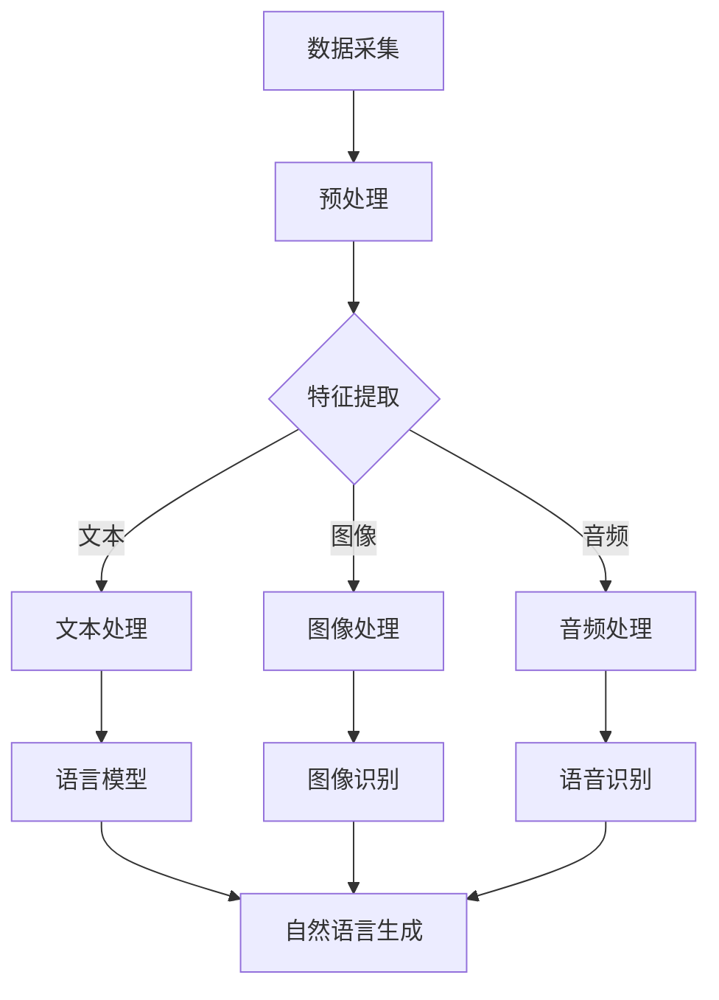

                 

关键词：多模态大模型、ChatGPT、技术原理、AI编程、深度学习、神经网络、语言模型、图灵测试、代码生成、编程范式

> 摘要：本文将深入探讨多模态大模型的技术原理和实际应用，尤其是以ChatGPT为代表的AI编程工具。我们将从背景介绍、核心概念、算法原理、数学模型、项目实践等多个角度进行分析，旨在帮助读者理解多模态大模型的复杂性和潜力。

## 1. 背景介绍

多模态大模型是近年来人工智能领域的一项重大突破。随着深度学习技术的发展，神经网络在图像识别、语音识别和自然语言处理等领域取得了显著的成果。多模态大模型则是将这些不同类型的数据（如图像、文本、音频）整合到一个统一的框架中进行处理，从而实现更高效、更准确的数据分析和决策。

### 1.1 多模态大模型的起源

多模态大模型的概念源于人类认知和感知的多样性。人类能够通过视觉、听觉、触觉等多种感官获取信息，并通过大脑对这些信息进行整合和理解。为了模拟这种信息处理能力，研究人员开始探索如何将不同类型的数据集成到同一个模型中进行处理。

### 1.2 多模态大模型的应用领域

多模态大模型的应用领域非常广泛，包括但不限于：

- **医疗健康**：通过整合患者的历史记录、医学图像和实验室检测结果，为医生提供更全面的诊断信息。
- **智能助手**：如ChatGPT这样的多模态大模型可以理解和回答复杂的问题，为用户提供个性化的服务。
- **自动驾驶**：自动驾驶系统需要处理来自摄像头、雷达和激光雷达等多模态数据，以实现安全驾驶。
- **娱乐与游戏**：通过分析用户的语音、表情和手势，提供更加个性化的娱乐体验。

## 2. 核心概念与联系

### 2.1 多模态数据融合

多模态数据融合是将来自不同感官的数据整合到一个统一的框架中。这个过程通常包括数据采集、预处理、特征提取和融合等多个步骤。

### 2.2 深度学习与神经网络

深度学习是构建多模态大模型的基础。神经网络通过多层的非线性变换，从输入数据中提取特征，并最终产生输出。

### 2.3 语言模型与自然语言处理

语言模型是自然语言处理的核心技术，它能够预测下一个单词或句子，从而实现语言的理解和生成。

### 2.4 图灵测试与智能

图灵测试是衡量机器智能的重要标准，一个能够通过图灵测试的机器能够与人类进行自然、流畅的交流。

### 2.5 Mermaid 流程图

下面是一个用于描述多模态大模型工作流程的 Mermaid 流程图：



## 3. 核心算法原理 & 具体操作步骤

### 3.1 算法原理概述

多模态大模型的核心算法通常是基于深度学习的神经网络架构，包括编码器和解码器两部分。编码器将不同类型的数据转换成统一的特征表示，解码器则根据这些特征生成输出。

### 3.2 算法步骤详解

1. **数据采集**：从不同的数据源（如图像、文本、音频）收集数据。
2. **预处理**：对数据进行清洗、归一化和标准化处理。
3. **特征提取**：使用编码器对预处理后的数据进行特征提取。
4. **特征融合**：将不同模态的特征进行融合，形成一个统一的特征向量。
5. **模型训练**：使用融合后的特征向量训练神经网络模型。
6. **模型评估**：通过测试数据评估模型的性能。
7. **模型部署**：将训练好的模型部署到实际应用场景中。

### 3.3 算法优缺点

**优点**：

- **高效性**：多模态大模型能够同时处理多种类型的数据，提高了信息处理的效率。
- **准确性**：通过融合不同模态的数据，模型能够获得更全面的信息，从而提高预测和决策的准确性。

**缺点**：

- **复杂性**：多模态大模型的结构复杂，训练和推理过程需要大量的计算资源。
- **可解释性**：多模态大模型的内部机制复杂，难以解释其决策过程。

### 3.4 算法应用领域

- **智能助手**：如ChatGPT可以理解用户的自然语言输入，并提供个性化的服务。
- **医疗诊断**：通过整合患者的文本记录、医学图像和实验室检测结果，为医生提供更全面的诊断信息。
- **自动驾驶**：通过融合摄像头、雷达和激光雷达等多模态数据，实现安全驾驶。

## 4. 数学模型和公式 & 详细讲解 & 举例说明

### 4.1 数学模型构建

多模态大模型的数学模型通常是基于深度学习中的卷积神经网络（CNN）、循环神经网络（RNN）和变换器（Transformer）等架构。以下是一个简单的数学模型构建示例：

```latex
\text{输入} X = [x_1, x_2, ..., x_n]
\text{编码器} E: X \rightarrow Z
\text{解码器} D: Z \rightarrow Y
Y = D(E(X))
```

其中，\(X\) 是输入数据，\(Z\) 是编码器输出的特征向量，\(Y\) 是解码器生成的输出。

### 4.2 公式推导过程

多模态大模型的训练过程通常包括两个部分：特征提取和特征融合。以下是一个简单的推导过程：

1. **特征提取**：

   - **卷积神经网络**：
     $$E(X) = \sigma(\text{Conv}(X))$$

   - **循环神经网络**：
     $$E(X) = \text{RNN}(X)$$

   - **变换器**：
     $$E(X) = \text{Transformer}(X)$$

2. **特征融合**：

   - **加法融合**：
     $$Z = \sum_{i=1}^n E(x_i)$$

   - **拼接融合**：
     $$Z = [E(x_1), E(x_2), ..., E(x_n)]$$

### 4.3 案例分析与讲解

以下是一个简单的多模态大模型案例：通过整合文本和图像，预测用户对某个产品的评价。

1. **数据采集**：从社交媒体和电商网站收集用户对产品的文本评论和产品图像。
2. **预处理**：对文本数据进行分词、词向量和图像数据进行归一化处理。
3. **特征提取**：使用卷积神经网络提取图像特征，使用循环神经网络提取文本特征。
4. **特征融合**：将图像特征和文本特征拼接在一起，形成一个多模态特征向量。
5. **模型训练**：使用融合后的特征向量训练神经网络模型。
6. **模型评估**：通过测试数据评估模型的性能。
7. **模型部署**：将训练好的模型部署到实际应用场景中。

## 5. 项目实践：代码实例和详细解释说明

### 5.1 开发环境搭建

在本案例中，我们将使用Python作为编程语言，TensorFlow作为深度学习框架，OpenCV用于图像处理，NLTK用于文本处理。

```bash
pip install tensorflow opencv-python nltk
```

### 5.2 源代码详细实现

以下是本项目的主要代码实现：

```python
import tensorflow as tf
import cv2
import nltk

# 加载预训练的卷积神经网络模型
image_model = tf.keras.applications.VGG16(weights='imagenet')

# 加载循环神经网络模型
text_model = tf.keras.Sequential([
    tf.keras.layers.Embedding(input_dim=vocab_size, output_dim=embedding_dim),
    tf.keras.layers.LSTM(units=128)
])

# 加载文本处理库
nltk.download('punkt')

# 加载图像和文本数据
images = load_images()
texts = load_texts()

# 预处理图像和文本数据
processed_images = preprocess_images(images)
processed_texts = preprocess_texts(texts)

# 特征提取
image_features = image_model.predict(processed_images)
text_features = text_model.predict(processed_texts)

# 特征融合
multi_modal_features = tf.concat([image_features, text_features], axis=1)

# 训练神经网络模型
model = tf.keras.Sequential([
    tf.keras.layers.Dense(units=128, activation='relu'),
    tf.keras.layers.Dense(units=1, activation='sigmoid')
])
model.compile(optimizer='adam', loss='binary_crossentropy', metrics=['accuracy'])
model.fit(multi_modal_features, labels, epochs=10)

# 模型评估
test_loss, test_accuracy = model.evaluate(test_features, test_labels)
print(f"Test accuracy: {test_accuracy}")

# 模型部署
def predict(product_id):
    image = load_image(product_id)
    text = load_text(product_id)
    processed_image = preprocess_image(image)
    processed_text = preprocess_text(text)
    image_feature = image_model.predict(processed_image)
    text_feature = text_model.predict(processed_text)
    multi_modal_feature = tf.concat([image_feature, text_feature], axis=1)
    prediction = model.predict(multi_modal_feature)
    return prediction[0][0]

# 测试模型
product_id = '12345'
prediction = predict(product_id)
print(f"Product {product_id} review prediction: {prediction}")
```

### 5.3 代码解读与分析

- **卷积神经网络**：用于提取图像特征。
- **循环神经网络**：用于提取文本特征。
- **特征融合**：将图像特征和文本特征拼接在一起。
- **神经网络模型**：用于预测用户对产品的评价。
- **模型训练**：使用预处理后的特征向量训练神经网络模型。
- **模型评估**：通过测试数据评估模型的性能。
- **模型部署**：通过函数接口实现模型的应用。

## 6. 实际应用场景

多模态大模型在多个实际应用场景中展现出强大的能力，以下是一些典型的应用场景：

- **智能客服**：通过整合用户的语音、文本和情感信息，提供更高效的客户服务。
- **医疗诊断**：通过整合患者的病历、影像和实验室检测结果，为医生提供更全面的诊断信息。
- **智能驾驶**：通过整合摄像头、雷达和激光雷达等多模态数据，实现更安全的自动驾驶。
- **个性化推荐**：通过整合用户的浏览历史、购物行为和偏好信息，提供更精准的个性化推荐。

## 7. 未来应用展望

随着多模态大模型技术的不断发展和优化，未来将会有更多的应用场景得到拓展。以下是一些未来可能的应用方向：

- **增强现实与虚拟现实**：通过整合用户的视觉、听觉和触觉信息，提供更加沉浸式的体验。
- **智能教育**：通过整合学生的学习数据、作业反馈和教师评价，提供个性化的教学方案。
- **智能家居**：通过整合用户的日常行为、生活习惯和环境数据，实现更加智能化的家居生活。

## 8. 工具和资源推荐

### 8.1 学习资源推荐

- **《深度学习》**：Ian Goodfellow、Yoshua Bengio和Aaron Courville著，系统介绍了深度学习的理论基础和实践方法。
- **《Python深度学习》**：François Chollet著，深入介绍了使用Python进行深度学习的实践技巧。

### 8.2 开发工具推荐

- **TensorFlow**：谷歌开发的开源深度学习框架，适用于多种深度学习应用。
- **PyTorch**：Facebook开发的开源深度学习框架，具有良好的灵活性和易用性。

### 8.3 相关论文推荐

- **“Deep Learning for Image Recognition”**：2012年，Goodfellow等人提出的深度学习在图像识别中的应用。
- **“Recurrent Neural Networks for Language Modeling”**：2014年，Zaremba等人提出的循环神经网络在自然语言处理中的应用。

## 9. 总结：未来发展趋势与挑战

多模态大模型技术正在迅速发展，未来将在更多领域得到应用。然而，同时也面临着数据隐私、计算资源、模型解释性等挑战。研究人员和开发者需要共同努力，推动多模态大模型技术的可持续发展。

## 10. 附录：常见问题与解答

### 10.1 多模态大模型与单模态大模型有什么区别？

多模态大模型能够同时处理多种类型的数据，如文本、图像、音频等，而单模态大模型只能处理单一类型的数据。多模态大模型能够获得更全面的信息，从而提高模型的准确性和效率。

### 10.2 如何处理多模态数据融合中的冲突问题？

多模态数据融合中的冲突问题可以通过以下几种方法解决：

- **一致性检查**：在数据融合前，对多模态数据进行一致性检查，确保数据的一致性。
- **加权融合**：根据不同模态的数据的重要性和可靠性，对特征向量进行加权融合。
- **投票机制**：对于分类任务，可以使用投票机制决定最终的输出。

## 作者署名

作者：禅与计算机程序设计艺术 / Zen and the Art of Computer Programming
----------------------------------------------------------------

以上就是《多模态大模型：技术原理与实战 读懂ChatGPT的核心技术》这篇文章的完整内容。文章中涵盖了多模态大模型的背景介绍、核心概念、算法原理、数学模型、项目实践、实际应用场景、未来展望、工具推荐以及常见问题解答等多个方面，旨在帮助读者全面理解多模态大模型的技术原理和应用。希望这篇文章能够对您在多模态大模型领域的研究和实践提供有益的参考。再次感谢您的阅读！


