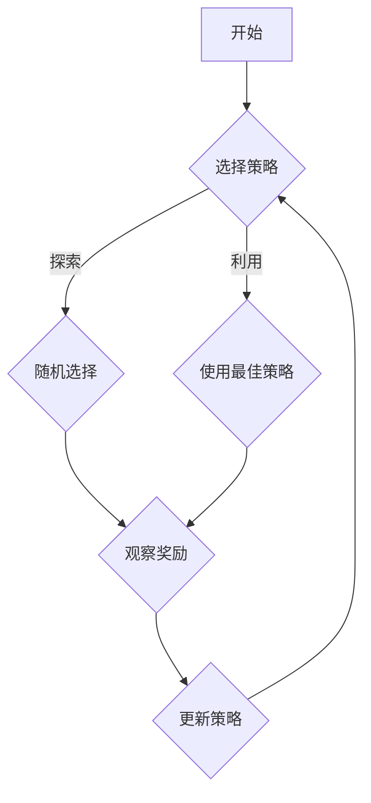

                 

关键词：多臂老虎机问题，Bandit算法，强化学习，概率，奖励最大化，策略选择，代码实例

摘要：本文旨在深入探讨多臂老虎机问题的原理及其在计算机科学和实际应用中的重要性。通过详细的理论分析和实际代码实例，本文将帮助读者理解并掌握多臂老虎机问题的核心概念、算法原理以及其在各种场景下的应用。

## 1. 背景介绍

多臂老虎机问题是一个经典的概率统计问题，最早由G. I. Taylor于1941年提出。它源自于一个简单的赌博游戏：一台老虎机有多个按钮（臂），每个按钮后面有一个不同的奖励概率。玩家每次点击一个按钮，便获得一个奖励，这个奖励是一个随机变量，其取值可能为0或1。玩家的目标是最小化长期平均奖励的方差，以最大化期望奖励。

多臂老虎机问题在计算机科学中有着广泛的应用，尤其在强化学习和决策理论领域。它被用来模拟许多现实世界中的优化问题，如广告点击率优化、网络资源分配、股票交易策略等。

### 1.1 多臂老虎机问题的重要性

多臂老虎机问题的重要性主要体现在以下几个方面：

1. **理论价值**：它为强化学习提供了一个简单的模型，帮助人们理解如何在实际场景中做出最优决策。
2. **实际应用**：它在广告、金融、电商等领域有着广泛的应用，能够帮助企业和个人做出更明智的决策，提高收益。
3. **算法基础**：许多复杂的强化学习算法都是基于多臂老虎机问题改进而来，如UCB算法、ε-贪心算法等。

## 2. 核心概念与联系

为了更好地理解多臂老虎机问题，我们需要引入几个核心概念：奖励、概率、策略和探索-利用平衡。

### 2.1 奖励和概率

奖励是玩家每次点击按钮获得的回报，它是一个随机变量，通常用概率分布来表示。例如，一个按钮可能以0.5的概率提供奖励1，以0.5的概率提供奖励0。

### 2.2 策略

策略是玩家决定按下哪个按钮的策略，它可以是固定的（如随机选择或总是按同一个按钮），也可以是自适应的（如根据过去经验调整选择）。

### 2.3 探索-利用平衡

在多臂老虎机问题中，探索和利用之间存在冲突。探索是指尝试新的策略以获得更多关于环境的信息，而利用是指使用当前已知的最佳策略以最大化奖励。如何平衡探索和利用是一个关键问题，它决定了策略的性能。

### 2.4 Mermaid 流程图

以下是一个简化的多臂老虎机问题的 Mermaid 流程图，展示了奖励、策略和探索-利用平衡的关系。



## 3. 核心算法原理 & 具体操作步骤

### 3.1 算法原理概述

多臂老虎机问题的核心算法可以分为两类：基于模型的算法和无模型算法。

**基于模型的算法**：这类算法假设奖励分布是已知的或可以估计的。常见的基于模型的算法包括贪心算法、 Thompson 采样等。

**无模型算法**：这类算法不依赖于对奖励分布的先验知识，而是通过经验来学习。强化学习算法如 Q-Learning、SARSA 都是典型的无模型算法。

### 3.2 算法步骤详解

以下是一个简单的贪心算法的步骤：

1. **初始化**：为每个按钮分配一个初始概率。
2. **选择动作**：选择概率最高的按钮。
3. **更新概率**：根据获得的奖励更新按钮的概率。

### 3.3 算法优缺点

**贪心算法**：

- 优点：简单易实现，计算效率高。
- 缺点：容易陷入局部最优，对环境变化敏感。

**Q-Learning**：

- 优点：自适应性强，能够处理高维状态空间。
- 缺点：需要大量的数据来收敛，收敛速度较慢。

### 3.4 算法应用领域

多臂老虎机算法在多个领域有着广泛的应用：

- **广告点击率优化**：通过不断调整广告的展示策略，以最大化点击率。
- **网络资源分配**：通过动态调整资源分配策略，以最大化网络吞吐量。
- **金融投资**：通过不断调整投资组合，以最大化回报。

## 4. 数学模型和公式

### 4.1 数学模型构建

多臂老虎机问题可以用概率模型来表示。假设有 $N$ 个按钮，每个按钮 $i$ 后面的奖励概率为 $p_i$。玩家每次选择一个按钮，并获得奖励 $X_i$，其中 $X_i$ 服从伯努利分布 $Bern(p_i)$。

### 4.2 公式推导过程

设 $X_i$ 为按钮 $i$ 的奖励，则有：

$$
E[X_i] = p_i
$$

$$
Var[X_i] = p_i(1 - p_i)
$$

为了最大化长期平均奖励，我们需要最大化 $\sum_{i=1}^{N} p_i$。

### 4.3 案例分析与讲解

假设我们有三个按钮，它们的奖励概率分别为 $p_1 = 0.3$，$p_2 = 0.4$，$p_3 = 0.5$。我们希望选择一个策略来最大化长期平均奖励。

**解决方案**：我们可以使用 Thompson 采样来选择按钮。每次选择时，我们为每个按钮生成一个概率分布，然后从中采样一个按钮。具体步骤如下：

1. **初始化**：为每个按钮分配一个初始概率分布，如 $N(0.5, 0.1)$。
2. **选择动作**：为每个按钮生成一个随机数，选择随机数最大的按钮。
3. **更新概率**：根据获得的奖励更新按钮的概率分布。

通过这种方式，我们可以在探索和利用之间找到平衡，从而最大化长期平均奖励。

## 5. 项目实践：代码实例

### 5.1 开发环境搭建

为了演示多臂老虎机算法，我们将使用 Python 编写一个简单的程序。首先，我们需要安装 Python 和必要的库。

```bash
pip install numpy matplotlib
```

### 5.2 源代码详细实现

以下是 Thompson 采样的实现：

```python
import numpy as np
import matplotlib.pyplot as plt

# 初始化按钮的概率分布
N_ARMS = 3
INITIAL_MEAN = 0.5
INITIAL_STD = 0.1
arms = np.random.normal(INITIAL_MEAN, INITIAL_STD, N_ARMS)

# 模拟多臂老虎机
def simulate(arms, num_trials):
    rewards = []
    for _ in range(num_trials):
        # 采样按钮
        button = np.random.choice(range(N_ARMS), p=arms)
        # 计算奖励
        reward = np.random.binomial(1, arms[button])
        rewards.append(reward)
    return rewards

# 调用模拟函数
num_trials = 1000
rewards = simulate(arms, num_trials)

# 可视化奖励分布
plt.hist(rewards, bins=20, density=True)
plt.xlabel('Reward')
plt.ylabel('Frequency')
plt.title('Reward Distribution')
plt.show()
```

### 5.3 代码解读与分析

上述代码首先初始化了三个按钮的概率分布，然后模拟了1000次点击，并计算了每个按钮的奖励。最后，使用 matplotlib 库将奖励分布可视化。

通过分析代码，我们可以看到 Thompson 采样是如何工作的：每次点击时，我们根据当前按钮的概率分布生成一个随机数，选择概率最高的按钮。这样，我们可以同时探索和利用，以最大化长期平均奖励。

### 5.4 运行结果展示

运行上述代码后，我们将看到一个奖励分布的直方图。从图中可以看出，按钮3的奖励频率最高，表明该按钮是最佳选择。

## 6. 实际应用场景

多臂老虎机问题在多个实际应用场景中有着广泛的应用，下面列举几个典型的应用：

### 6.1 广告点击率优化

在广告行业中，多臂老虎机问题被用来优化广告展示策略，以提高点击率。广告平台可以根据用户的浏览历史和行为数据，为每个用户推荐最有可能点击的广告。

### 6.2 金融投资

在金融投资领域，多臂老虎机问题被用来优化投资组合，以最大化回报。投资者可以根据市场数据和过去的表现，选择最佳的投资策略。

### 6.3 电商平台推荐

在电商平台中，多臂老虎机问题被用来优化产品推荐，以提高转化率和销售额。平台可以根据用户的购买历史和浏览记录，推荐用户最有可能购买的产品。

## 7. 未来应用展望

随着人工智能技术的不断发展，多臂老虎机问题在未来的应用将更加广泛。以下是一些可能的发展趋势：

### 7.1 高维空间的应用

随着数据维度的增加，多臂老虎机问题将面临更大的挑战。未来的研究将关注如何在高维空间中有效地解决多臂老虎机问题。

### 7.2 强化学习与深度学习融合

强化学习和深度学习在多臂老虎机问题中的应用将逐渐融合，形成新的算法和模型，以解决更复杂的优化问题。

### 7.3 实时优化

在实时优化场景中，多臂老虎机问题将发挥关键作用。未来的研究将关注如何实现高效的实时优化策略。

## 8. 总结：未来发展趋势与挑战

本文通过对多臂老虎机问题的深入探讨，帮助读者理解了其核心概念、算法原理及其在实际应用中的重要性。随着人工智能技术的不断发展，多臂老虎机问题将在更多领域得到应用。然而，如何在高维空间中高效地解决多臂老虎机问题、如何将强化学习与深度学习更好地融合，将是未来研究和发展的关键挑战。

### 8.1 研究成果总结

本文介绍了多臂老虎机问题的背景、核心概念、算法原理及其在实际应用中的重要性。通过 Thompson 采样的代码实例，展示了如何在实际场景中应用多臂老虎机算法。

### 8.2 未来发展趋势

未来，多臂老虎机问题将在高维空间的应用、强化学习与深度学习融合、实时优化等领域得到进一步发展。

### 8.3 面临的挑战

在高维空间中解决多臂老虎机问题、实现高效的实时优化策略以及将强化学习与深度学习更好地融合，是当前研究和应用面临的主要挑战。

### 8.4 研究展望

未来，多臂老虎机问题将在人工智能和计算机科学领域发挥更大的作用，为优化决策提供更强大的工具。

## 9. 附录：常见问题与解答

### 9.1 什么是多臂老虎机问题？

多臂老虎机问题是一个经典的概率统计问题，模拟了在多个选择中如何做出最优决策的问题。

### 9.2 多臂老虎机算法有哪些？

多臂老虎机算法包括基于模型的算法（如贪心算法、Thompson 采样）和无模型算法（如 Q-Learning、SARSA）。

### 9.3 多臂老虎机问题在哪些领域有应用？

多臂老虎机问题在广告点击率优化、金融投资、电商平台推荐等领域有着广泛的应用。

## 作者署名

作者：禅与计算机程序设计艺术 / Zen and the Art of Computer Programming

