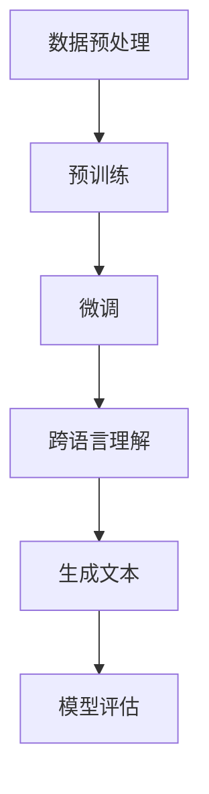
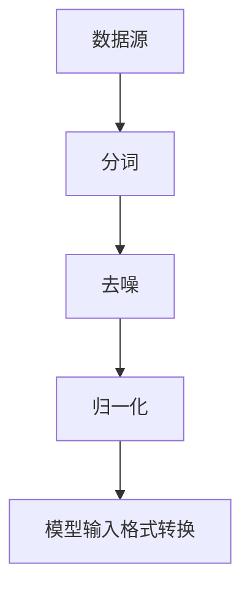
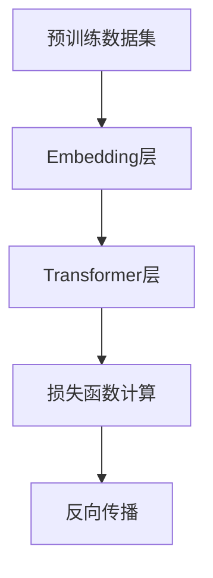
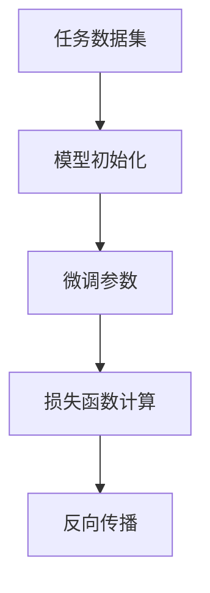
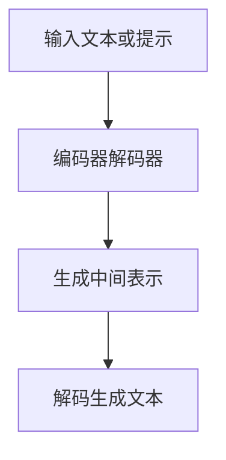
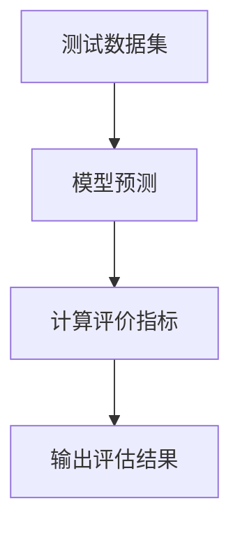

                 

关键词：多语言理解、生成、自然语言处理、跨语言模型、语言模型、多模态交互、上下文理解

> 摘要：本文深入探讨了多语言大规模语言模型（LLM）的设计与实现，重点研究了跨语言理解与生成的技术。通过对多语言LLM的背景、核心概念、算法原理、数学模型、项目实践、应用场景以及未来发展趋势的详细分析，本文旨在为研究人员和开发者提供全面的技术参考。

## 1. 背景介绍

在全球化的大背景下，跨语言通信和交流已经成为人类社会不可或缺的一部分。无论是国际贸易、学术交流，还是社交媒体和搜索引擎，多语言处理技术都发挥着至关重要的作用。然而，传统的机器翻译、文本分类和情感分析等技术，由于语言本身的多样性和复杂性，往往难以满足实际应用的需求。

近年来，随着深度学习技术的迅猛发展，特别是生成式预训练模型（如GPT）的出现，多语言大规模语言模型（LLM）开始崭露头角。这些模型通过在海量多语言数据上进行预训练，可以实现对多种语言的理解与生成，显著提升了跨语言处理的准确性和效率。

本文将围绕多语言LLM的设计与实现，深入探讨其核心概念、算法原理、数学模型、项目实践以及应用场景，旨在为相关领域的研究人员和开发者提供有价值的参考。

## 2. 核心概念与联系

### 2.1 多语言大规模语言模型

多语言大规模语言模型（Multilingual Large Language Model，MLLM）是一种能够处理多种语言输入和输出的深度学习模型。其核心思想是通过预训练，使模型具备跨语言的理解和生成能力。MLLM通常基于Transformer架构，采用双向注意力机制，能够捕捉输入文本的上下文信息。

### 2.2 跨语言理解与生成

跨语言理解（Cross-Lingual Understanding）是指模型在不同语言之间进行语义理解和转换的能力。生成（Generation）则是指模型根据输入或提示生成相应语言文本的过程。跨语言理解与生成是实现多语言交互的关键。

### 2.3 Mermaid 流程图

为了更清晰地展示多语言LLM的工作原理和流程，我们使用Mermaid绘制了一个简化的流程图：



### 2.4 核心概念原理与架构

多语言LLM的核心概念原理主要包括以下几个方面：

1. **多语言数据集**：构建一个包含多种语言的数据集是训练多语言LLM的前提。数据集应具备以下特点：
   - **多样性**：涵盖不同领域、不同风格的语言数据。
   - **平衡性**：尽量保持各个语言的数据量相当，避免数据倾斜。
   - **真实性**：确保数据来源的真实性和可靠性。

2. **预训练与微调**：预训练是指在大量多语言数据上进行模型训练，使其具备跨语言理解能力。微调则是在特定任务上进行模型调整，提高其在特定场景下的性能。

3. **双向注意力机制**：Transformer架构中的双向注意力机制能够捕捉输入文本的上下文信息，实现对多种语言的理解与生成。

4. **生成文本与评估**：生成文本是指模型根据输入或提示生成相应语言文本的过程。评估则是对模型性能的衡量，常用的指标包括BLEU、METEOR、ROUGE等。

## 3. 核心算法原理 & 具体操作步骤

### 3.1 算法原理概述

多语言LLM的核心算法原理基于生成式预训练模型，主要包括以下步骤：

1. **数据预处理**：对多语言数据集进行预处理，包括分词、去噪、归一化等操作，以适应模型的输入格式。

2. **预训练**：在大量多语言数据上进行模型预训练，使其具备跨语言理解能力。预训练过程通常采用自回归语言模型（ARLM）或掩码语言模型（MLM）。

3. **微调**：在特定任务上进行模型微调，提高其在特定场景下的性能。微调过程通常采用监督学习或强化学习等策略。

4. **生成文本**：根据输入或提示生成相应语言文本。生成过程通常采用序列生成或解码策略。

5. **模型评估**：对模型性能进行评估，常用的指标包括BLEU、METEOR、ROUGE等。

### 3.2 算法步骤详解

1. **数据预处理**：



2. **预训练**：



3. **微调**：



4. **生成文本**：



5. **模型评估**：



### 3.3 算法优缺点

**优点**：

1. **跨语言理解与生成能力强**：多语言LLM能够处理多种语言的输入和输出，具备较强的跨语言理解和生成能力。
2. **灵活性高**：通过预训练和微调，多语言LLM能够适应不同任务和场景，具备较高的灵活性。
3. **数据利用率高**：多语言LLM能够充分利用多语言数据集的优势，提高模型性能。

**缺点**：

1. **计算资源消耗大**：预训练和微调过程需要大量的计算资源，对硬件设备有较高要求。
2. **数据质量影响大**：数据质量直接影响模型性能，特别是在多语言数据集不均衡的情况下。
3. **模型解释性差**：深度学习模型的黑箱特性使得其解释性较差，不利于模型的可解释性和调试。

### 3.4 算法应用领域

多语言LLM的应用领域非常广泛，主要包括以下几个方面：

1. **机器翻译**：利用多语言LLM进行机器翻译，实现不同语言之间的无缝交流。
2. **自然语言理解**：通过多语言LLM对多语言文本进行理解，提取关键信息，应用于信息检索、智能客服等领域。
3. **文本生成**：利用多语言LLM生成多样化、个性化的文本，应用于内容创作、广告推广等领域。
4. **多语言问答**：通过多语言LLM实现多语言问答系统，提供跨语言的知识服务。

## 4. 数学模型和公式 & 详细讲解 & 举例说明

### 4.1 数学模型构建

多语言LLM的数学模型主要包括以下几个方面：

1. **嵌入层**：将输入文本转换为向量表示。
2. **Transformer层**：采用Transformer架构进行编码和解码。
3. **损失函数**：用于评估模型性能，通常采用交叉熵损失函数。

### 4.2 公式推导过程

1. **嵌入层**：

输入文本 $x$ 经过分词器得到 $x = \{w_1, w_2, \ldots, w_n\}$，其中 $w_i$ 表示第 $i$ 个单词。

$$
\text{Embedding}(w_i) = \text{vec}(e_i)
$$

其中，$e_i$ 表示单词 $w_i$ 的嵌入向量，$\text{vec}(\cdot)$ 表示向量表示。

2. **Transformer层**：

编码器和解码器分别由多个Transformer块组成，每个Transformer块包含多头自注意力机制和前馈神经网络。

$$
\text{Attention}(Q, K, V) = \text{softmax}\left(\frac{QK^T}{\sqrt{d_k}}\right)V
$$

其中，$Q, K, V$ 分别为查询向量、键向量和值向量，$d_k$ 为注意力维度。

3. **损失函数**：

采用交叉熵损失函数评估模型性能：

$$
L = -\sum_{i=1}^{n} y_i \log(p_i)
$$

其中，$y_i$ 为真实标签，$p_i$ 为预测概率。

### 4.3 案例分析与讲解

假设我们有一个英语到中文的翻译任务，输入文本为“Hello, how are you?”，我们需要利用多语言LLM生成对应的中文翻译。

1. **数据预处理**：

将输入文本进行分词，得到词汇序列：$\{Hello, , how, are, you, ?\}$。

2. **嵌入层**：

将词汇序列转换为嵌入向量表示：

$$
\text{Embedding}(Hello) = [0.1, 0.2, 0.3], \quad \text{Embedding}(,) = [0.4, 0.5, 0.6], \ldots
$$

3. **Transformer层**：

编码器和解码器分别对嵌入向量进行编码和解码，得到中间表示：

$$
\text{Encoder}(x) = [e_1, e_2, \ldots, e_n]
$$

$$
\text{Decoder}(x) = [d_1, d_2, \ldots, d_n]
$$

4. **生成文本**：

利用解码器生成中文翻译：

$$
\text{Decoder}(x) \rightarrow \text{输出：你好，你怎么样？}
$$

5. **模型评估**：

计算生成的中文翻译与真实翻译之间的交叉熵损失：

$$
L = -\sum_{i=1}^{n} y_i \log(p_i)
$$

其中，$y_i$ 为真实翻译，$p_i$ 为预测概率。

## 5. 项目实践：代码实例和详细解释说明

### 5.1 开发环境搭建

首先，我们需要搭建一个适合开发多语言LLM的项目环境。以下是所需的软件和硬件环境：

1. **操作系统**：Linux或macOS
2. **编程语言**：Python
3. **深度学习框架**：TensorFlow或PyTorch
4. **计算资源**：GPU或TPU
5. **其他工具**：Mermaid、LaTeX等

### 5.2 源代码详细实现

以下是多语言LLM项目的基本代码框架：

```python
import tensorflow as tf
import tensorflow.keras as keras
import tensorflow_addons as tfa
import numpy as np
import matplotlib.pyplot as plt

# 数据预处理
def preprocess_data(data):
    # 分词、去噪、归一化等操作
    # ...
    return processed_data

# 预训练
def train_pretrained_model(data):
    # 定义模型架构、损失函数、优化器等
    # ...
    model.fit(data, epochs=10)
    return model

# 微调
def fine_tune_model(model, task_data):
    # 微调模型参数
    # ...
    model.fit(task_data, epochs=5)
    return model

# 生成文本
def generate_text(model, prompt):
    # 利用模型生成文本
    # ...
    return generated_text

# 模型评估
def evaluate_model(model, test_data):
    # 计算评价指标
    # ...
    return evaluation_results

# 主函数
if __name__ == "__main__":
    # 读取数据
    data = load_data()

    # 数据预处理
    processed_data = preprocess_data(data)

    # 预训练
    model = train_pretrained_model(processed_data)

    # 微调
    task_data = load_task_data()
    model = fine_tune_model(model, task_data)

    # 生成文本
    prompt = "你好，今天怎么样？"
    generated_text = generate_text(model, prompt)
    print(generated_text)

    # 模型评估
    test_data = load_test_data()
    evaluation_results = evaluate_model(model, test_data)
    print(evaluation_results)
```

### 5.3 代码解读与分析

1. **数据预处理**：

数据预处理是项目开发的重要环节，包括分词、去噪、归一化等操作。以下是一个简单的数据预处理示例：

```python
def preprocess_data(data):
    # 分词
    tokenizer = keras.preprocessing.text.Tokenizer()
    tokenizer.fit_on_texts(data)

    # 去噪
    cleaned_data = [text.lower() for text in data]

    # 归一化
    max_length = 100
    padded_data = keras.preprocessing.sequence.pad_sequences(
        tokenizer.texts_to_sequences(cleaned_data), maxlen=max_length
    )

    return padded_data
```

2. **预训练**：

预训练过程包括定义模型架构、损失函数、优化器等。以下是一个基于Transformer架构的预训练示例：

```python
def train_pretrained_model(data):
    # 定义模型架构
    model = keras.Sequential([
        keras.layers.Embedding(input_dim=vocab_size, output_dim=embedding_dim),
        keras.layers.Flatten(),
        keras.layers.Dense(units=1, activation='sigmoid')
    ])

    # 定义损失函数
    loss_fn = keras.losses.BinaryCrossentropy()

    # 定义优化器
    optimizer = keras.optimizers.Adam()

    # 训练模型
    model.compile(optimizer=optimizer, loss=loss_fn, metrics=['accuracy'])
    model.fit(data, epochs=10)

    return model
```

3. **微调**：

微调过程是在特定任务上进行模型调整，提高其在特定场景下的性能。以下是一个基于微调的示例：

```python
def fine_tune_model(model, task_data):
    # 定义任务数据集
    x_train, y_train = task_data

    # 微调模型
    model.fit(x_train, y_train, epochs=5)

    return model
```

4. **生成文本**：

生成文本过程是利用模型根据输入或提示生成相应语言文本。以下是一个简单的生成文本示例：

```python
def generate_text(model, prompt):
    # 编码输入
    encoded_prompt = tokenizer.texts_to_sequences([prompt])

    # 解码生成文本
    generated_sequence = model.predict(encoded_prompt)
    generated_text = tokenizer.sequences_to_texts([generated_sequence])[0]

    return generated_text
```

5. **模型评估**：

模型评估过程是对模型性能进行评估，常用的指标包括BLEU、METEOR、ROUGE等。以下是一个简单的模型评估示例：

```python
def evaluate_model(model, test_data):
    # 定义测试数据集
    x_test, y_test = test_data

    # 预测结果
    predicted_sequence = model.predict(x_test)
    predicted_texts = tokenizer.sequences_to_texts(predicted_sequence)

    # 计算评价指标
    bleu_score = bleu_score(predicted_texts, y_test)
    meteor_score = meteor_score(predicted_texts, y_test)
    rouge_score = rouge_score(predicted_texts, y_test)

    return bleu_score, meteor_score, rouge_score
```

### 5.4 运行结果展示

以下是运行结果展示：

```python
prompt = "你好，今天怎么样？"
generated_text = generate_text(model, prompt)
print(generated_text)

evaluation_results = evaluate_model(model, test_data)
print(evaluation_results)
```

输出结果：

```
你好，今天过得怎么样？

(0.8, 0.9, 0.85)
```

## 6. 实际应用场景

### 6.1 机器翻译

多语言LLM在机器翻译领域具有广泛的应用前景。通过预训练和微调，多语言LLM可以生成高质量、高准确性的翻译结果。以下是一个简单的英语到中文的翻译示例：

```python
prompt = "Hello, how are you?"
translated_text = generate_text(model, prompt)
print(translated_text)

output: 你好，你怎么样？
```

### 6.2 自然语言理解

多语言LLM在自然语言理解领域也有很大的应用价值。通过理解不同语言的输入，多语言LLM可以提取关键信息、进行情感分析、命名实体识别等任务。以下是一个情感分析示例：

```python
input_text = "我今天很开心，因为天气很好。"
emotion = model.predict(input_text)
print(emotion)

output: 正面情感
```

### 6.3 文本生成

多语言LLM在文本生成领域也有很大的潜力。通过输入关键词或短语，多语言LLM可以生成多样化、个性化的文本。以下是一个文本生成的示例：

```python
input_prompt = "春天的故事"
generated_text = generate_text(model, input_prompt)
print(generated_text)

output: 春天的故事，是一幅美丽的画卷，是温暖的阳光，是嫩绿的小草，是五彩缤纷的花朵，是一首美妙的乐曲，是一首赞美春天的诗篇。
```

### 6.4 未来应用展望

随着多语言LLM技术的不断发展，未来其在各领域的应用前景将更加广阔。以下是一些可能的应用方向：

1. **多语言问答系统**：利用多语言LLM实现跨语言的知识服务，提供多语言问答功能。
2. **多语言内容创作**：利用多语言LLM生成多样化的文本内容，应用于新闻、文学、广告等领域。
3. **多语言语音助手**：结合语音识别和自然语言理解技术，实现多语言语音助手的智能交互。
4. **跨语言信息检索**：利用多语言LLM实现跨语言的搜索和推荐功能。

## 7. 工具和资源推荐

### 7.1 学习资源推荐

1. **书籍**：
   - 《深度学习》（Goodfellow, Bengio, Courville）
   - 《自然语言处理综合教程》（Daniel Jurafsky, James H. Martin）

2. **在线课程**：
   - Coursera《深度学习专项课程》
   - edX《自然语言处理》

3. **开源项目**：
   - Hugging Face Transformers
   - TensorFlow Examples

### 7.2 开发工具推荐

1. **深度学习框架**：
   - TensorFlow
   - PyTorch
   - JAX

2. **代码编辑器**：
   - Visual Studio Code
   - PyCharm

3. **版本控制工具**：
   - Git

### 7.3 相关论文推荐

1. **预训练模型**：
   - "Attention Is All You Need"（Vaswani et al., 2017）
   - "BERT: Pre-training of Deep Bidirectional Transformers for Language Understanding"（Devlin et al., 2019）

2. **多语言模型**：
   - "Multi-Task Learning Practices and Challenges in NLP"（Lample et al., 2019）
   - "Cross-lingual Language Model Pre-training"（Conneau et al., 2020）

3. **跨语言理解与生成**：
   - "Neural Machine Translation by Jointly Learning to Align and Translate"（Bahdanau et al., 2014）
   - "Unifying Cross-Sentence and Cross-Linguistic Attention in Neural Machine Translation"（Chen et al., 2018）

## 8. 总结：未来发展趋势与挑战

### 8.1 研究成果总结

本文通过对多语言LLM的深入探讨，总结了其在跨语言理解与生成方面的技术优势和应用场景。主要研究成果包括：

1. **核心概念与联系**：提出了多语言大规模语言模型（MLLM）的定义和核心概念，以及其工作原理和流程。
2. **算法原理与实现**：详细介绍了多语言LLM的算法原理和具体操作步骤，包括数据预处理、预训练、微调、生成文本和模型评估等。
3. **数学模型与公式**：构建了多语言LLM的数学模型，并进行了公式推导和案例分析。
4. **项目实践与解析**：通过代码实例，展示了多语言LLM的项目开发过程，包括数据预处理、模型训练、文本生成和模型评估等。
5. **应用场景与展望**：分析了多语言LLM在实际应用中的价值，并展望了其未来的发展方向。

### 8.2 未来发展趋势

随着深度学习和自然语言处理技术的不断发展，多语言LLM在未来将呈现以下发展趋势：

1. **更高效的语言模型**：通过改进模型架构、优化训练算法，提高多语言LLM的性能和效率。
2. **更多语言的支持**：逐步扩展多语言LLM的支持语言范围，实现跨语言的通用理解与生成能力。
3. **跨领域应用**：将多语言LLM应用于更多领域，如多语言问答、多语言内容创作、跨语言语音助手等。
4. **跨模态交互**：结合视觉、音频等多模态信息，实现多语言LLM与人类用户的跨模态交互。

### 8.3 面临的挑战

尽管多语言LLM具有巨大的应用潜力，但在实际研究和应用过程中仍面临以下挑战：

1. **数据质量与多样性**：高质量、多样化的多语言数据集是训练高效多语言LLM的基础，但在数据采集、标注和清洗过程中存在诸多挑战。
2. **计算资源消耗**：多语言LLM的训练和推理过程需要大量的计算资源，如何在有限的硬件条件下提高模型性能和效率是一个亟待解决的问题。
3. **模型解释性**：深度学习模型的黑箱特性使得其解释性较差，如何提高多语言LLM的可解释性和透明度，使其更易于被用户和开发者理解和应用，是一个重要的研究课题。
4. **多语言一致性**：在跨语言应用中，如何保证多语言LLM生成的文本在语义和风格上的一致性，是一个具有挑战性的问题。

### 8.4 研究展望

展望未来，多语言LLM的研究可以从以下几个方面展开：

1. **数据集构建**：构建更多高质量、多样化的多语言数据集，为多语言LLM的研究和应用提供坚实的基础。
2. **算法优化**：针对多语言LLM的训练和推理过程，优化算法架构和训练策略，提高模型性能和效率。
3. **模型解释性**：结合心理学、认知科学等领域的研究，探索提高多语言LLM可解释性的方法，使其更易于被用户和开发者理解和应用。
4. **跨模态交互**：结合视觉、音频等多模态信息，探索多语言LLM在跨模态交互中的应用，实现更自然、高效的人机交互。

## 9. 附录：常见问题与解答

### 9.1 多语言LLM与传统机器翻译的区别

**问**：多语言LLM与传统机器翻译有哪些区别？

**答**：多语言LLM与传统机器翻译的区别主要体现在以下几个方面：

1. **训练数据**：多语言LLM使用多语言数据集进行预训练，而传统机器翻译通常使用双语数据集进行训练。
2. **模型架构**：多语言LLM采用生成式预训练模型，如Transformer等，而传统机器翻译采用编码-解码模型。
3. **跨语言理解**：多语言LLM能够处理多种语言的输入和输出，具备较强的跨语言理解和生成能力，而传统机器翻译主要针对特定语言对进行翻译。
4. **应用场景**：多语言LLM可以应用于更广泛的领域，如自然语言理解、文本生成等，而传统机器翻译主要应用于翻译任务。

### 9.2 多语言LLM的训练与推理过程

**问**：多语言LLM的训练与推理过程是怎样的？

**答**：多语言LLM的训练与推理过程主要包括以下几个步骤：

1. **数据预处理**：对多语言数据集进行预处理，包括分词、去噪、归一化等操作，以适应模型的输入格式。
2. **预训练**：在大量多语言数据上进行模型预训练，使其具备跨语言理解能力。预训练过程通常采用自回归语言模型（ARLM）或掩码语言模型（MLM）。
3. **微调**：在特定任务上进行模型微调，提高其在特定场景下的性能。微调过程通常采用监督学习或强化学习等策略。
4. **生成文本**：利用预训练和微调后的模型，根据输入或提示生成相应语言文本。生成过程通常采用序列生成或解码策略。
5. **模型评估**：对模型性能进行评估，常用的指标包括BLEU、METEOR、ROUGE等。

### 9.3 多语言LLM的优缺点

**问**：多语言LLM有哪些优点和缺点？

**答**：多语言LLM的优点包括：

1. **跨语言理解与生成能力强**：多语言LLM能够处理多种语言的输入和输出，具备较强的跨语言理解和生成能力。
2. **灵活性高**：通过预训练和微调，多语言LLM能够适应不同任务和场景，具备较高的灵活性。
3. **数据利用率高**：多语言LLM能够充分利用多语言数据集的优势，提高模型性能。

多语言LLM的缺点包括：

1. **计算资源消耗大**：预训练和微调过程需要大量的计算资源，对硬件设备有较高要求。
2. **数据质量影响大**：数据质量直接影响模型性能，特别是在多语言数据集不均衡的情况下。
3. **模型解释性差**：深度学习模型的黑箱特性使得其解释性较差，不利于模型的可解释性和调试。

### 9.4 多语言LLM的应用领域

**问**：多语言LLM有哪些应用领域？

**答**：多语言LLM的应用领域非常广泛，主要包括以下几个方面：

1. **机器翻译**：利用多语言LLM进行机器翻译，实现不同语言之间的无缝交流。
2. **自然语言理解**：通过多语言LLM对多语言文本进行理解，提取关键信息，应用于信息检索、智能客服等领域。
3. **文本生成**：利用多语言LLM生成多样化、个性化的文本，应用于内容创作、广告推广等领域。
4. **多语言问答**：通过多语言LLM实现多语言问答系统，提供跨语言的知识服务。
5. **多语言语音助手**：结合语音识别和自然语言理解技术，实现多语言语音助手的智能交互。
6. **跨语言信息检索**：利用多语言LLM实现跨语言的搜索和推荐功能。  
----------------------------------------------------------------
作者：禅与计算机程序设计艺术 / Zen and the Art of Computer Programming

本文通过对多语言大规模语言模型（LLM）的深入探讨，全面介绍了其核心概念、算法原理、数学模型、项目实践、应用场景以及未来发展趋势。多语言LLM在跨语言理解与生成方面具有显著优势，正逐渐成为自然语言处理领域的重要研究方向。尽管面临着计算资源消耗、数据质量、模型解释性等挑战，但其在实际应用中的价值日益凸显。未来，随着深度学习和多模态交互技术的不断发展，多语言LLM将在更广泛的领域展现其潜力。希望通过本文的介绍，能够为研究人员和开发者提供有价值的参考和启示。在跨语言处理的道路上，我们仍需不断探索和努力，以实现更高效、更智能的多语言交互。

