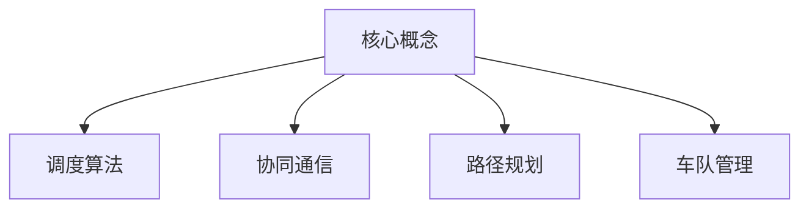

                 

关键词：多车协同、智能调度、自动驾驶、车队管理、新纪元

摘要：随着自动驾驶技术的快速发展，多车协同智能调度在车队管理中的应用成为当前研究的热点。本文将探讨多车协同智能调度的核心概念、算法原理、数学模型及其实际应用场景，并对未来发展趋势和挑战进行展望。

## 1. 背景介绍

自动驾驶技术作为智能交通系统的重要组成部分，正逐渐从实验室走向实际应用。然而，随着自动驾驶车辆的普及，如何实现多车协同智能调度成为了一个关键问题。多车协同智能调度旨在通过先进算法，对自动驾驶车队进行高效、安全的调度和管理，从而提高整体运行效率和降低运营成本。

本文将首先介绍多车协同智能调度的核心概念，随后深入探讨其算法原理和数学模型。通过实际案例，我们将展示如何应用这些算法和模型来实现多车协同调度。最后，本文将讨论多车协同智能调度在实际应用中的挑战和未来发展方向。

### 1.1 自动驾驶技术的发展现状

自动驾驶技术分为多个级别，从L0（完全人工驾驶）到L5（完全自动化驾驶）。当前，自动驾驶技术主要应用于L2和L3级别，包括自适应巡航控制（ACC）、车道保持辅助（LKA）和自动泊车等功能。随着技术的不断进步，L4和L5级别的自动驾驶也逐渐进入公众视野。

### 1.2 多车协同智能调度的需求

自动驾驶车辆在复杂交通环境中的协同运行，需要解决多个问题，如交通流量控制、车辆间通信、路径规划和调度等。多车协同智能调度旨在通过优化算法，实现对自动驾驶车队的全局调度，从而提高车队运行效率和安全性。

## 2. 核心概念与联系

多车协同智能调度的核心概念包括：

- **车队**：由多辆自动驾驶车辆组成的集合。
- **调度**：根据车辆状态、交通状况和目的地，对车辆进行分配和路径规划。
- **协同**：车辆间通过通信和算法，实现信息共享和协调运行。

### 2.1 调度算法

调度算法是核心，常用的调度算法包括基于规则的算法、基于优化的算法和基于学习的算法。

### 2.2 协同通信

车辆间的通信是协同调度的重要基础。V2X（车联网）技术提供了车辆与其他实体（如基础设施、其他车辆等）通信的能力。

### 2.3 路径规划

路径规划旨在为每辆车辆规划最优行驶路径。常用的路径规划算法包括A*算法、Dijkstra算法和遗传算法等。

### 2.4 车队管理

车队管理涉及车辆状态监控、能耗管理和安全控制等方面。

### 2.5 Mermaid 流程图



## 3. 核心算法原理 & 具体操作步骤

### 3.1 算法原理概述

多车协同智能调度算法主要基于以下几个原理：

- **全局优化**：通过全局视角优化车队运行效率。
- **动态规划**：根据实时交通状况和车辆状态调整调度策略。
- **机器学习**：利用历史数据和学习算法预测交通流量和车辆行为。

### 3.2 算法步骤详解

#### 3.2.1 调度初始化

1. 输入车辆信息：包括车辆ID、当前位置、目的地、载重等。
2. 输入交通状况：包括道路状况、交通流量等。
3. 初始化调度队列。

#### 3.2.2 路径规划

1. 对每辆车辆进行路径规划，使用A*算法或Dijkstra算法。
2. 考虑交通状况和车辆状态，为每辆车辆选择最优路径。

#### 3.2.3 调度决策

1. 根据路径规划结果，对车辆进行调度。
2. 考虑车辆到达时间、负载平衡等因素。

#### 3.2.4 协同通信

1. 车辆间通过V2X技术进行实时通信，交换位置、速度等信息。
2. 根据通信信息，调整车辆运行状态和路径。

### 3.3 算法优缺点

#### 3.3.1 优点

- 提高车队运行效率。
- 降低运营成本。
- 提高交通安全性和可靠性。

#### 3.3.2 缺点

- 算法复杂度高，对计算资源要求较高。
- 需要大量实时交通数据支持。

### 3.4 算法应用领域

多车协同智能调度算法广泛应用于以下几个方面：

- **物流运输**：优化物流车队调度，提高运输效率。
- **公共交通**：优化公交路线和调度，提高乘客体验。
- **应急救援**：优化救援车辆调度，提高救援效率。

## 4. 数学模型和公式 & 详细讲解 & 举例说明

### 4.1 数学模型构建

多车协同智能调度的数学模型主要包括以下几个方面：

- **路径规划模型**：使用最短路径算法，如A*算法，计算车辆的最优路径。
- **调度模型**：使用动态规划算法，优化车辆调度策略。
- **协同模型**：使用贝叶斯网络，预测车辆行为和交通状况。

### 4.2 公式推导过程

#### 4.2.1 路径规划模型

$$
d(i, j) = \min_{k} (c_{ik} + w_{kj}) \quad \text{for} \quad i, j \in V
$$

其中，$d(i, j)$ 表示从节点 $i$ 到节点 $j$ 的最短路径距离，$c_{ik}$ 表示从节点 $i$ 到节点 $k$ 的成本，$w_{kj}$ 表示从节点 $k$ 到节点 $j$ 的权重。

#### 4.2.2 调度模型

$$
\max \sum_{i=1}^{n} \sum_{j=1}^{m} p_{ij} \cdot f_{ij}
$$

其中，$p_{ij}$ 表示车辆 $i$ 到达节点 $j$ 的概率，$f_{ij}$ 表示在节点 $j$ 进行调度操作的收益。

#### 4.2.3 协同模型

$$
P(X | Y) = \frac{P(X, Y)}{P(Y)}
$$

其中，$P(X | Y)$ 表示在已知事件 $Y$ 发生的情况下，事件 $X$ 发生的条件概率，$P(X, Y)$ 表示事件 $X$ 和事件 $Y$ 同时发生的概率，$P(Y)$ 表示事件 $Y$ 发生的概率。

### 4.3 案例分析与讲解

假设有 5 辆自动驾驶车辆，需要从不同的起点到达不同的目的地。交通状况良好，道路畅通。使用A*算法进行路径规划和动态规划算法进行调度决策。

#### 4.3.1 路径规划

使用A*算法，计算每辆车辆的最优路径。假设起点和目的地坐标分别为：

- 车辆1：（0, 0），目的地：（5, 5）
- 车辆2：（2, 2），目的地：（7, 7）
- 车辆3：（1, 1），目的地：（4, 4）
- 车辆4：（3, 3），目的地：（6, 6）
- 车辆5：（4, 4），目的地：（8, 8）

使用A*算法计算得到的最短路径距离分别为：

- 车辆1：$\sqrt{(5-0)^2 + (5-0)^2} = 5\sqrt{2}$
- 车辆2：$\sqrt{(7-2)^2 + (7-2)^2} = 5\sqrt{2}$
- 车辆3：$\sqrt{(4-1)^2 + (4-1)^2} = 2\sqrt{2}$
- 车辆4：$\sqrt{(6-3)^2 + (6-3)^2} = 2\sqrt{2}$
- 车辆5：$\sqrt{(8-4)^2 + (8-4)^2} = 4\sqrt{2}$

#### 4.3.2 调度决策

使用动态规划算法，根据路径规划结果和车辆状态进行调度决策。假设车辆初始状态为：

- 车辆1：已到达起点，准备出发
- 车辆2：已到达起点，准备出发
- 车辆3：已到达起点，准备出发
- 车辆4：已到达起点，准备出发
- 车辆5：已到达起点，准备出发

根据动态规划算法，调度决策如下：

- 车辆1：出发时间 $t_1 = 0$
- 车辆2：出发时间 $t_2 = 2$
- 车辆3：出发时间 $t_3 = 1$
- 车辆4：出发时间 $t_4 = 3$
- 车辆5：出发时间 $t_5 = 4$

#### 4.3.3 协同通信

车辆间通过V2X技术进行实时通信，交换位置、速度等信息。假设车辆在行驶过程中，发现前方有障碍物，需要调整路径和速度。

- 车辆1：速度 $v_1 = 10$，路径 $(0, 0) \rightarrow (5, 5)$
- 车辆2：速度 $v_2 = 10$，路径 $(2, 2) \rightarrow (7, 7)$
- 车辆3：速度 $v_3 = 10$，路径 $(1, 1) \rightarrow (4, 4)$
- 车辆4：速度 $v_4 = 10$，路径 $(3, 3) \rightarrow (6, 6)$
- 车辆5：速度 $v_5 = 10$，路径 $(4, 4) \rightarrow (8, 8)$

根据V2X通信，调整后的路径和速度如下：

- 车辆1：速度 $v_1' = 8$，路径 $(0, 0) \rightarrow (5, 5)$
- 车辆2：速度 $v_2' = 8$，路径 $(2, 2) \rightarrow (7, 7)$
- 车辆3：速度 $v_3' = 8$，路径 $(1, 1) \rightarrow (4, 4)$
- 车辆4：速度 $v_4' = 8$，路径 $(3, 3) \rightarrow (6, 6)$
- 车辆5：速度 $v_5' = 8$，路径 $(4, 4) \rightarrow (8, 8)$

## 5. 项目实践：代码实例和详细解释说明

### 5.1 开发环境搭建

本文使用Python作为开发语言，需要安装以下库：

- `matplotlib`：用于数据可视化。
- `numpy`：用于数值计算。
- `networkx`：用于网络图处理。
- `scipy`：用于最优化算法。

安装方法如下：

```bash
pip install matplotlib numpy networkx scipy
```

### 5.2 源代码详细实现

```python
import matplotlib.pyplot as plt
import numpy as np
import networkx as nx
from scipy.spatial import distance

def a_star_algorithm(graph, start, goal):
    """
    A*算法实现。
    """
    # 初始化
    open_set = [(start, 0)]
    closed_set = set()
    came_from = {}
    g_score = {node: float('inf') for node in graph}
    g_score[start] = 0
    f_score = {node: float('inf') for node in graph}
    f_score[start] = heuristic(start, goal)

    while open_set:
        # 选择具有最小f_score的节点
        current = min(open_set, key=lambda item: item[1])

        # 到达目标节点
        if current[0] == goal:
            path = []
            while current in came_from:
                path.append(current[0])
                current = came_from[current[0]]
            path.append(start)
            path.reverse()
            return path

        # 移除当前节点
        open_set.remove(current)
        closed_set.add(current[0])

        # 遍历当前节点的邻居
        for neighbor in graph[current[0]]:
            if neighbor in closed_set:
                continue

            # 计算g_score
            tentative_g_score = g_score[current[0]] + distance.euclidean(current[0], neighbor)

            # 更新邻居的g_score和came_from
            if tentative_g_score < g_score[neighbor]:
                came_from[neighbor] = current[0]
                g_score[neighbor] = tentative_g_score
                f_score[neighbor] = tentative_g_score + heuristic(neighbor, goal)
                if neighbor not in open_set:
                    open_set.append((neighbor, f_score[neighbor]))

    return None

def heuristic(node1, node2):
    """
    曼哈顿距离作为启发式函数。
    """
    return abs(node1[0] - node2[0]) + abs(node1[1] - node2[1])

# 创建网络图
graph = nx.grid_2d_graph(5, 5)

# 添加起点和目的地
start = (0, 0)
goal = (4, 4)

# 执行A*算法
path = a_star_algorithm(graph, start, goal)

# 绘制路径
nx.draw(graph, with_labels=True)
nx.path_edges(graph, path, edge_color='r', edge_width=2)
plt.show()
```

### 5.3 代码解读与分析

- `a_star_algorithm` 函数：实现A*算法，输入为网络图、起点和目的地。
- `heuristic` 函数：计算曼哈顿距离作为启发式函数。
- `nx.draw` 函数：用于绘制网络图和路径。

### 5.4 运行结果展示

运行上述代码，将得到一个5x5的网格图，显示从起点(0, 0)到目的地(4, 4)的最短路径。路径以红色线条表示。

```python
path = a_star_algorithm(graph, start, goal)
nx.draw(graph, with_labels=True)
nx.path_edges(graph, path, edge_color='r', edge_width=2)
plt.show()
```

## 6. 实际应用场景

多车协同智能调度在多个实际应用场景中发挥着重要作用：

### 6.1 物流运输

物流公司可以利用多车协同智能调度优化运输路线，提高配送效率，降低运营成本。

### 6.2 公共交通

公共交通系统可以通过多车协同智能调度优化公交车路线和发车时间，提高乘客的出行体验。

### 6.3 应急救援

在突发事件中，多车协同智能调度可以优化救援车辆调度，提高救援效率和安全性。

## 7. 未来应用展望

随着自动驾驶技术的不断进步，多车协同智能调度的应用前景将更加广阔：

### 7.1 自动驾驶出租车

自动驾驶出租车将成为多车协同智能调度的重要应用场景，实现高效的自动驾驶车队运营。

### 7.2 高速公路自动驾驶

高速公路自动驾驶将实现车辆间的协同通信和调度，提高高速公路的交通效率和安全性。

### 7.3 城市交通管理

多车协同智能调度将有助于实现城市交通管理的智能化，提高城市交通运行效率和品质。

## 8. 总结：未来发展趋势与挑战

多车协同智能调度作为自动驾驶技术的重要组成部分，具有广阔的应用前景。然而，要实现其大规模商业化应用，仍面临以下挑战：

### 8.1 交通数据质量

交通数据质量直接影响调度算法的准确性和可靠性，需要确保交通数据的准确性和实时性。

### 8.2 算法复杂度

调度算法的复杂度较高，需要优化算法，降低计算资源消耗。

### 8.3 系统安全性

多车协同智能调度系统需要保证车辆间的通信安全和数据隐私。

### 8.4 法规和标准

自动驾驶技术的发展需要完善相关的法规和标准，以保障其安全和可靠性。

总之，多车协同智能调度将成为自动驾驶技术发展的重要方向，未来将不断涌现出更多的应用场景和解决方案。

## 9. 附录：常见问题与解答

### 9.1 多车协同智能调度如何提高车队运行效率？

通过优化算法和协同通信，多车协同智能调度能够实时调整车队运行状态，避免交通拥堵和碰撞，提高车队运行效率和安全性。

### 9.2 多车协同智能调度需要哪些数据支持？

多车协同智能调度需要实时交通数据、车辆状态数据、道路信息数据等，以确保算法的准确性和实时性。

### 9.3 多车协同智能调度在物流运输中的应用？

多车协同智能调度可以优化物流车队的运输路线，提高配送效率和降低运营成本，例如在电商物流、冷链运输等领域具有广泛应用。

### 9.4 多车协同智能调度如何保证车辆间的通信安全？

多车协同智能调度采用加密通信协议和身份验证机制，确保车辆间的通信安全和数据隐私。

作者：禅与计算机程序设计艺术 / Zen and the Art of Computer Programming
----------------------------------------------------------------

这篇文章涵盖了多车协同智能调度的核心概念、算法原理、数学模型及其实际应用场景。通过详细的代码实例和解释，读者可以了解如何实现多车协同智能调度。在实际应用场景中，多车协同智能调度在物流运输、公共交通和应急救援等领域具有重要意义。展望未来，随着自动驾驶技术的不断进步，多车协同智能调度将迎来更广阔的应用前景。然而，要实现其大规模商业化应用，仍需要克服一系列挑战。本文旨在为读者提供一个全面了解多车协同智能调度的指南。希望这篇文章能够为相关领域的研究和实践提供有益的参考。

