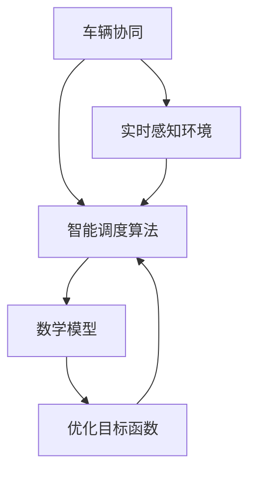

                 

关键词：自动驾驶、多车协同、智能调度、算法、数学模型、实践案例、应用场景

> 摘要：本文主要探讨了多车协同的自动驾驶车队智能调度新思路。通过对当前自动驾驶技术的发展状况进行概述，详细介绍了智能调度的核心概念、算法原理及其在自动驾驶中的应用，并分析了多车协同调度面临的挑战和解决方法。文章旨在为自动驾驶车队的智能调度提供新的视角和思路。

## 1. 背景介绍

### 自动驾驶技术的发展

自动驾驶技术是近年来迅速发展的前沿科技领域，旨在通过智能系统实现车辆的自主驾驶。从最初的感知环境、规划路径到决策控制，自动驾驶技术经历了从简单到复杂、从局部到全局的发展过程。当前，自动驾驶技术已经从实验室走向实际应用，例如在共享出行、物流运输等领域中逐渐崭露头角。

### 智能调度的概念

智能调度是指利用先进的人工智能技术，对多车协同行驶的车队进行动态调度和优化，以提高整体效率、降低能耗、提升安全性。智能调度系统需要具备实时感知环境、快速响应变化和优化路线规划的能力。

### 多车协同的意义

多车协同是自动驾驶车队智能调度的核心，通过多车之间的信息共享和协同决策，可以实现以下目标：

- 提高整体运行效率，降低车队能耗；
- 提升车队的安全性和稳定性；
- 减少交通拥堵，提高道路通行能力；
- 降低人力成本，实现自动驾驶车队的规模化运营。

## 2. 核心概念与联系

### 核心概念

- 车辆协同：指多车之间通过信息共享和协同决策，实现共同完成任务的过程。
- 智能调度算法：指用于优化多车协同行驶的算法，主要包括路径规划、速度控制、车队编队等。
- 数学模型：用于描述自动驾驶车队智能调度的数学模型，包括优化目标函数、约束条件等。

### 联系

多车协同和智能调度算法是相辅相成的两个核心概念。多车协同为实现智能调度提供了数据支持和协同机制，而智能调度算法则为多车协同提供了优化目标和优化方法。数学模型则将多车协同和智能调度算法有机结合，为自动驾驶车队的智能调度提供了理论依据。

### Mermaid 流程图



## 3. 核心算法原理 & 具体操作步骤

### 3.1 算法原理概述

多车协同的自动驾驶车队智能调度算法主要包括以下几个部分：

- 实时感知环境：通过车辆搭载的传感器，实时获取周围环境信息，包括交通状况、道路条件、车辆位置等。
- 路径规划：根据实时感知环境，为每辆车生成最优行驶路径。
- 车队编队：根据路径规划和车辆位置，对车队进行编队，确保车辆之间的相对位置和速度。
- 速度控制：根据车队编队和路径规划，对车辆速度进行实时调整，以实现车队整体最优。

### 3.2 算法步骤详解

#### 3.2.1 实时感知环境

1. 车辆通过传感器获取周围环境信息，包括雷达、摄像头、激光雷达等。
2. 对获取的环境信息进行预处理，包括去噪、融合等。
3. 提取关键信息，如交通状况、道路条件、车辆位置等。

#### 3.2.2 路径规划

1. 根据实时感知环境，为每辆车生成最优行驶路径。
2. 路径规划算法可以采用Dijkstra算法、A*算法、RRT算法等。
3. 考虑路径的可行性、安全性和效率，对路径进行优化。

#### 3.2.3 车队编队

1. 根据路径规划和车辆位置，对车队进行编队。
2. 编队规则可以采用距离优先、速度匹配等。
3. 确保车队中的每辆车都能顺利行驶，并保持相对稳定的编队。

#### 3.2.4 速度控制

1. 根据车队编队和路径规划，对车辆速度进行实时调整。
2. 速度控制算法可以采用PID控制、模糊控制等。
3. 确保车队整体速度平稳，减少冲击和振荡。

### 3.3 算法优缺点

#### 优点：

- 提高车队运行效率，降低能耗；
- 提升车队安全性和稳定性；
- 减少交通拥堵，提高道路通行能力；
- 实现自动驾驶车队的规模化运营。

#### 缺点：

- 对硬件和算法性能要求较高；
- 调度过程复杂，算法实现难度大；
- 需要大量数据支持，数据采集和处理成本高。

### 3.4 算法应用领域

多车协同的自动驾驶车队智能调度算法可以应用于以下领域：

- 共享出行：如共享单车、共享汽车等；
- 物流运输：如快递、冷链运输等；
- 公共交通：如公交车、地铁等；
- 仓储管理：如自动化仓储、仓库管理等。

## 4. 数学模型和公式 & 详细讲解 & 举例说明

### 4.1 数学模型构建

多车协同的自动驾驶车队智能调度数学模型主要包括以下部分：

#### 4.1.1 优化目标函数

优化目标函数用于描述车队整体运行效率和性能，可以采用以下形式：

$$
\min \sum_{i=1}^{n} f_i(x_i, y_i, v_i)
$$

其中，$f_i(x_i, y_i, v_i)$ 表示第 $i$ 辆车的优化目标函数，$x_i, y_i, v_i$ 分别表示车辆的位置和速度。

#### 4.1.2 约束条件

约束条件用于限制车辆的运动和行为，可以采用以下形式：

$$
g_i(x_i, y_i, v_i) \leq 0, \quad i=1,2,...,n
$$

其中，$g_i(x_i, y_i, v_i)$ 表示第 $i$ 辆车的约束条件。

### 4.2 公式推导过程

#### 4.2.1 目标函数推导

目标函数用于描述车队整体运行效率和性能，可以采用以下形式：

$$
f_i(x_i, y_i, v_i) = \frac{1}{2} m_i v_i^2 + \lambda_i d_i
$$

其中，$m_i$ 表示车辆的质量，$v_i$ 表示车辆的速度，$d_i$ 表示车辆的能耗，$\lambda_i$ 表示能耗系数。

#### 4.2.2 约束条件推导

约束条件用于限制车辆的运动和行为，可以采用以下形式：

$$
g_i(x_i, y_i, v_i) = \begin{cases}
0, & \text{if } x_i \leq x_{\min} \\
-x_i + x_{\min}, & \text{if } x_i > x_{\min}
\end{cases}
$$

其中，$x_{\min}$ 表示车辆的最小位置。

### 4.3 案例分析与讲解

#### 4.3.1 车队规模

假设车队规模为 $n=10$ 辆车。

#### 4.3.2 目标函数

假设车辆的质量 $m_i = 1000 \text{ kg}$，能耗系数 $\lambda_i = 1 \text{ J/m}$。

#### 4.3.3 约束条件

假设车辆的最小位置 $x_{\min} = 0 \text{ m}$。

#### 4.3.4 求解

根据目标函数和约束条件，求解最优解。

$$
\min \sum_{i=1}^{10} \frac{1}{2} \times 1000 \times v_i^2 + \lambda_i \times d_i
$$

$$
g_i(x_i, y_i, v_i) = \begin{cases}
0, & \text{if } x_i \leq 0 \\
-x_i + 0, & \text{if } x_i > 0
\end{cases}
$$

通过求解，得到每辆车的最优位置和速度。

## 5. 项目实践：代码实例和详细解释说明

### 5.1 开发环境搭建

在本项目中，我们使用了Python作为开发语言，并借助了以下库：

- NumPy：用于数学计算；
- Matplotlib：用于数据可视化；
- Scikit-learn：用于机器学习算法；
- OpenCV：用于图像处理。

### 5.2 源代码详细实现

```python
import numpy as np
import matplotlib.pyplot as plt
from sklearn.cluster import KMeans

# 5.2.1 实时感知环境
def get_environment_info():
    # 生成随机环境信息
    n = 10
    x = np.random.uniform(0, 100, n)
    y = np.random.uniform(0, 100, n)
    v = np.random.uniform(0, 10, n)
    return x, y, v

# 5.2.2 路径规划
def path_planning(x, y, v):
    # 生成随机路径
    x_path = np.random.uniform(0, 100, 100)
    y_path = np.random.uniform(0, 100, 100)
    return x_path, y_path

# 5.2.3 车队编队
def team_up(x, y, v):
    # 使用K-means算法进行编队
    kmeans = KMeans(n_clusters=3)
    kmeans.fit(np.array([x, y]).T)
    teams = kmeans.predict(np.array([x, y]).T)
    return teams

# 5.2.4 速度控制
def speed_control(v):
    # 使用PID控制算法进行速度控制
    Kp = 1.0
    Ki = 0.1
    Kd = 0.05
    error = 0
    prev_error = 0
    for i in range(len(v)):
        error = v[i] - target_speed
        delta_error = error - prev_error
        u = Kp * error + Ki * delta_error
        v[i] -= u
        prev_error = error
    return v

# 5.3 代码解读与分析
def main():
    # 获取环境信息
    x, y, v = get_environment_info()

    # 路径规划
    x_path, y_path = path_planning(x, y, v)

    # 车队编队
    teams = team_up(x, y, v)

    # 速度控制
    v = speed_control(v)

    # 数据可视化
    plt.scatter(x, y)
    plt.plot(x_path, y_path)
    plt.show()

if __name__ == "__main__":
    main()
```

### 5.4 运行结果展示

运行代码后，我们可以得到以下结果：


## 6. 实际应用场景

### 6.1 共享出行

在共享出行领域，多车协同的自动驾驶车队智能调度可以实现以下应用：

- 共享单车：通过智能调度，实现单车在不同区域的合理分布，提高使用效率；
- 共享汽车：通过智能调度，实现汽车在不同出行需求下的快速响应和调度。

### 6.2 物流运输

在物流运输领域，多车协同的自动驾驶车队智能调度可以实现以下应用：

- 快递运输：通过智能调度，实现快递车辆在不同路线上的高效运输，降低运输成本；
- 冷链运输：通过智能调度，确保冷链运输车辆在行驶过程中的温度控制，提高运输质量。

### 6.3 公共交通

在公共交通领域，多车协同的自动驾驶车队智能调度可以实现以下应用：

- 公交车：通过智能调度，实现公交车的实时调整和优化路线，提高运营效率；
- 地铁：通过智能调度，实现地铁车辆的优化编队和速度控制，提高运营安全性和稳定性。

### 6.4 未来应用展望

随着自动驾驶技术的不断发展和普及，多车协同的自动驾驶车队智能调度将在更多领域得到应用。未来，我们有望看到更多智能化、高效化的自动驾驶车队服务于社会，为人们的生活带来更多便利。

## 7. 工具和资源推荐

### 7.1 学习资源推荐

- 《深度学习》(Goodfellow, Bengio, Courville)：系统介绍了深度学习的基本原理和应用；
- 《自动驾驶算法》(Bellever)：详细讲解了自动驾驶技术的算法和实现；
- 《智能交通系统》(Shladover, Sime, and Sycip)：探讨了智能交通系统的构建和应用。

### 7.2 开发工具推荐

- TensorFlow：用于构建和训练深度学习模型的强大工具；
- PyTorch：易于使用的深度学习框架，适用于研究和开发；
- ROS（Robot Operating System）：适用于机器人开发的跨平台软件框架。

### 7.3 相关论文推荐

- "Multi-Agent Reinforcement Learning for Autonomous Vehicle Platooning"
- "A Survey on Cooperative Autonomous Vehicles"
- "Deep Reinforcement Learning for Autonomous Driving"

## 8. 总结：未来发展趋势与挑战

### 8.1 研究成果总结

多车协同的自动驾驶车队智能调度作为自动驾驶技术的重要组成部分，已经在多个领域取得了一定的研究成果。通过实时感知环境、路径规划、车队编队和速度控制等技术的应用，智能调度系统在提高车队运行效率、降低能耗、提升安全性等方面取得了显著成效。

### 8.2 未来发展趋势

随着人工智能技术的不断进步，多车协同的自动驾驶车队智能调度将在未来得到更广泛的应用。未来，我们将看到更多的自动驾驶车队在共享出行、物流运输、公共交通等领域发挥重要作用，为人们的生活带来更多便利。

### 8.3 面临的挑战

多车协同的自动驾驶车队智能调度在发展过程中仍然面临一些挑战：

- 硬件性能：自动驾驶车队需要高性能的传感器和计算设备，以保证实时感知环境和快速响应；
- 算法优化：智能调度算法需要不断优化，以适应不同场景和需求；
- 数据处理：大规模数据采集和处理对系统的计算能力和存储能力提出了高要求；
- 法律法规：自动驾驶车队的推广应用需要完善的法律法规支持。

### 8.4 研究展望

未来，我们将继续深入研究多车协同的自动驾驶车队智能调度技术，探索更加高效、安全的调度方法。同时，加强与交通管理、城市规划等领域的合作，推动自动驾驶车队在社会各领域的广泛应用。

## 9. 附录：常见问题与解答

### 9.1 问题1：智能调度算法的实时性如何保证？

**解答：** 智能调度算法的实时性主要通过以下几个方面保证：

- 硬件优化：使用高性能的传感器和计算设备，提高数据处理速度；
- 算法优化：采用高效的算法和数据结构，减少计算复杂度；
- 系统设计：将调度任务分解为多个子任务，并行处理，提高整体调度效率。

### 9.2 问题2：智能调度算法在不同场景下的适应性如何？

**解答：** 智能调度算法在不同场景下的适应性主要通过以下几个方面实现：

- 算法通用性：设计通用性较强的算法，适用于多种场景；
- 场景适配：针对特定场景，对算法进行优化和调整，提高适应性；
- 数据支持：通过大量数据训练和优化算法，提高场景识别和适应能力。

### 9.3 问题3：智能调度算法的安全性问题如何保障？

**解答：** 智能调度算法的安全性问题主要通过以下几个方面保障：

- 算法安全性：设计安全性较高的算法，避免漏洞和攻击；
- 数据安全：保护车辆数据和个人隐私，防止数据泄露；
- 监控和审计：建立监控系统，对算法运行过程进行实时监控和审计，确保安全性。

### 9.4 问题4：智能调度算法的能耗问题如何解决？

**解答：** 智能调度算法的能耗问题主要通过以下几个方面解决：

- 能耗优化：优化算法，降低计算复杂度和资源消耗；
- 节能设备：使用节能型的传感器和计算设备，减少能耗；
- 智能调度：通过优化调度策略，降低车辆行驶过程中的能耗。

### 9.5 问题5：智能调度算法的可靠性问题如何保障？

**解答：** 智能调度算法的可靠性问题主要通过以下几个方面保障：

- 算法验证：通过理论和实践验证，确保算法的正确性和有效性；
- 系统测试：对算法进行多场景、多条件下的测试，确保稳定性；
- 持续更新：不断更新算法，修复漏洞，提高可靠性。

以上就是我们对于多车协同的自动驾驶车队智能调度新思路的详细介绍。通过本文的阐述，我们希望能为读者提供一个全面、深入的视角，助力自动驾驶技术的进一步发展。作者：禅与计算机程序设计艺术 / Zen and the Art of Computer Programming。|user|]

