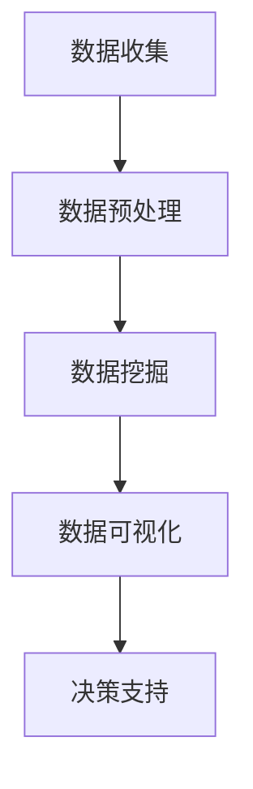

                 

关键词：大数据分析、城市规划、智能化决策、算法原理、数学模型、项目实践、应用场景、未来展望

> 摘要：本文从大数据分析的角度，探讨了其在城市规划领域的应用。通过梳理核心概念与联系，介绍了几种关键算法的原理与应用，并提供了具体操作步骤和实例。文章旨在为城市规划者提供智能化决策支持的策略和方法。

## 1. 背景介绍

随着城市化进程的加速，城市规划的重要性愈发凸显。传统的城市规划方法主要依赖于经验和历史数据，存在一定的局限性。而大数据技术的发展，为城市规划带来了新的机遇。大数据分析能够从海量数据中挖掘出有价值的信息，为城市规划提供科学依据。

城市规划涉及多个方面，包括人口分布、交通流量、土地利用、环境质量等。大数据分析可以对这些数据进行深度挖掘，识别出其中的规律和趋势，从而为城市规划提供智能化决策支持。例如，通过分析交通数据，可以优化交通网络布局，减少交通拥堵；通过分析环境数据，可以提出环保措施，改善城市生态环境。

本文将重点讨论大数据分析在城市规划中的应用，包括核心概念与联系、核心算法原理、数学模型构建、项目实践以及实际应用场景等。

## 2. 核心概念与联系

在讨论大数据分析在城市规划中的应用之前，我们需要先了解一些核心概念。以下是一些重要的概念及其相互关系：

### 数据源

数据源是大数据分析的基础。在城市规划中，数据源可以包括人口统计数据、交通流量数据、土地利用数据、环境质量数据等。这些数据可以从政府统计部门、交通管理部门、环境监测部门等获取。

### 数据预处理

数据预处理是大数据分析的重要环节。它包括数据清洗、数据整合、数据规范化等步骤。数据清洗的目的是去除重复数据、错误数据和无效数据，确保数据质量。数据整合则是将不同来源的数据进行整合，以便后续分析。数据规范化则是将数据转化为统一的格式，便于分析和处理。

### 数据挖掘

数据挖掘是从海量数据中挖掘出有价值信息的过程。在城市规划中，数据挖掘可以用于发现人口分布的规律、交通流量的高峰时段、土地利用的优化方案等。

### 数据可视化

数据可视化是将数据以图形或图表的形式展示出来，使得决策者更容易理解数据。数据可视化在城市规划中可以帮助决策者直观地了解城市的运行状态，从而做出更加明智的决策。

### Mermaid 流程图

下面是一个关于大数据分析在城市规划中的应用的 Mermaid 流程图：



## 3. 核心算法原理 & 具体操作步骤

### 3.1 算法原理概述

大数据分析在城市规划中的应用，主要涉及以下几种算法：

1. **聚类算法**：用于对城市人口分布、土地利用等进行分类。
2. **分类算法**：用于对交通流量、环境质量等进行预测。
3. **关联规则算法**：用于发现不同数据之间的关联性。

### 3.2 算法步骤详解

#### 3.2.1 聚类算法

聚类算法的基本步骤如下：

1. **数据准备**：收集城市人口分布、土地利用等数据。
2. **数据预处理**：对数据进行清洗、整合和规范化。
3. **选择聚类算法**：根据具体需求选择合适的聚类算法，如 K-Means、DBSCAN 等。
4. **执行聚类**：使用所选算法对数据进行聚类。
5. **评估聚类效果**：根据聚类结果评估聚类效果。

#### 3.2.2 分类算法

分类算法的基本步骤如下：

1. **数据准备**：收集交通流量、环境质量等数据。
2. **数据预处理**：对数据进行清洗、整合和规范化。
3. **选择分类算法**：根据具体需求选择合适的分类算法，如决策树、支持向量机等。
4. **训练模型**：使用训练数据集训练分类模型。
5. **预测**：使用训练好的模型对测试数据进行预测。
6. **评估模型**：根据预测结果评估模型效果。

#### 3.2.3 关联规则算法

关联规则算法的基本步骤如下：

1. **数据准备**：收集不同数据源的数据。
2. **数据预处理**：对数据进行清洗、整合和规范化。
3. **选择关联规则算法**：根据具体需求选择合适的关联规则算法，如 Apriori、FP-Growth 等。
4. **挖掘关联规则**：使用所选算法挖掘数据中的关联规则。
5. **评估关联规则**：根据挖掘结果评估关联规则的有效性。

### 3.3 算法优缺点

1. **聚类算法**：

   - 优点：可以自动发现数据中的规律和模式。
   - 缺点：对初始聚类中心的选择敏感，可能陷入局部最优。

2. **分类算法**：

   - 优点：可以对新数据进行预测和分类。
   - 缺点：对训练数据的依赖较大，可能无法很好地处理稀疏数据。

3. **关联规则算法**：

   - 优点：可以挖掘出数据中的关联关系。
   - 缺点：可能产生大量的冗余规则。

### 3.4 算法应用领域

- **人口分布规划**：利用聚类算法分析人口分布，为城市规划提供依据。
- **交通流量预测**：利用分类算法预测交通流量，优化交通网络布局。
- **土地利用优化**：利用关联规则算法分析土地利用模式，提出优化方案。

## 4. 数学模型和公式 & 详细讲解 & 举例说明

### 4.1 数学模型构建

在数据分析中，常用的数学模型包括聚类模型、分类模型和关联规则模型。以下分别介绍这三种模型的构建过程。

#### 4.1.1 聚类模型

聚类模型的主要目的是将数据点划分为若干个类别。常见的聚类算法有 K-Means 和 DBSCAN。

- **K-Means 算法**：

  - 初始化：随机选择 K 个数据点作为初始聚类中心。
  - 调整聚类中心：计算每个数据点到聚类中心的距离，将数据点重新分配到最近的聚类中心。
  - 重复调整：直到聚类中心不再发生改变。

- **DBSCAN 算法**：

  - 初始化：设定邻域半径 ε 和最小邻域点数 minPts。
  - 标记核心点：如果一个点的邻域内包含至少 minPts 个点，则该点为核心点。
  - 标记边界点：如果一个点的邻域内包含点数少于 minPts 但大于 ε，则该点为边界点。
  - 标记噪声点：其余点为噪声点。

#### 4.1.2 分类模型

分类模型的主要目的是根据特征向量对数据进行分类。常见的分类算法有决策树、支持向量机和神经网络。

- **决策树算法**：

  - 初始化：选择一个特征作为分割依据，计算每个特征的增益率，选择增益率最大的特征进行分割。
  - 递归分割：根据选择的特征对数据进行分割，重复该过程，直到满足停止条件。

- **支持向量机算法**：

  - 初始化：选择合适的核函数，计算支持向量机的超平面。
  - 训练模型：使用训练数据集训练支持向量机模型。
  - 预测分类：使用训练好的模型对测试数据进行分类预测。

- **神经网络算法**：

  - 初始化：设置网络结构和学习参数。
  - 训练模型：通过反向传播算法更新网络参数。
  - 预测分类：使用训练好的模型对测试数据进行分类预测。

#### 4.1.3 关联规则模型

关联规则模型的主要目的是发现数据之间的关联关系。常见的算法有 Apriori 和 FP-Growth。

- **Apriori 算法**：

  - 初始化：设定支持度和置信度阈值。
  - 生成频繁项集：根据支持度阈值生成频繁项集。
  - 生成关联规则：根据频繁项集生成关联规则。

- **FP-Growth 算法**：

  - 初始化：构建 FP-Tree。
  - 生成频繁项集：根据 FP-Tree 生成频繁项集。
  - 生成关联规则：根据频繁项集生成关联规则。

### 4.2 公式推导过程

#### 4.2.1 K-Means 算法

- **聚类中心更新公式**：

  $$\mu_{k}^{new} = \frac{1}{N_k}\sum_{i=1}^{N} x_i$$

  其中，$x_i$ 表示第 $i$ 个数据点，$\mu_{k}$ 表示第 $k$ 个聚类中心，$N_k$ 表示第 $k$ 个聚类中心所在的数据点数量。

#### 4.2.2 决策树算法

- **特征选择公式**：

  $$Gini(\theta) = 1 - \sum_{i=1}^{c} p_i^2$$

  其中，$p_i$ 表示第 $i$ 个类别在数据集中的比例，$\theta$ 表示特征。

#### 4.2.3 支持向量机算法

- **分类边界公式**：

  $$w^T x_i + b = 0$$

  其中，$w$ 表示权重向量，$x_i$ 表示数据点，$b$ 表示偏置。

### 4.3 案例分析与讲解

#### 4.3.1 聚类算法案例分析

假设我们有一组城市人口分布数据，数据如下：

$$
\begin{aligned}
x_1 &= [1, 2, 3, 4, 5], \\
x_2 &= [6, 7, 8, 9, 10], \\
x_3 &= [11, 12, 13, 14, 15], \\
x_4 &= [16, 17, 18, 19, 20], \\
x_5 &= [21, 22, 23, 24, 25].
\end{aligned}
$$

我们使用 K-Means 算法对这些数据进行聚类，设定聚类中心为 $[2, 7]$ 和 $[13, 18]$。以下是聚类过程：

1. **初始化**：随机选择两个数据点作为初始聚类中心。
2. **调整聚类中心**：计算每个数据点到聚类中心的距离，将数据点重新分配到最近的聚类中心。
3. **重复调整**：直到聚类中心不再发生改变。

最终，数据被划分为两个类别：

$$
\begin{aligned}
x_1 &= [1, 2, 3, 4], \\
x_2 &= [6, 7, 8, 9], \\
x_3 &= [11, 12, 13, 14], \\
x_4 &= [16, 17, 18, 19], \\
x_5 &= [21, 22, 23, 24, 25].
\end{aligned}
$$

#### 4.3.2 分类算法案例分析

假设我们有一组交通流量数据，数据如下：

$$
\begin{aligned}
x_1 &= [1, 2, 3, 4], \\
x_2 &= [5, 6, 7, 8], \\
x_3 &= [9, 10, 11, 12], \\
x_4 &= [13, 14, 15, 16], \\
x_5 &= [17, 18, 19, 20].
\end{aligned}
$$

我们使用决策树算法对这些数据进行分类，设定最大深度为 3。以下是分类过程：

1. **初始化**：选择特征 1 作为分割依据。
2. **递归分割**：根据选择的特征对数据进行分割，重复该过程，直到满足停止条件。

最终，数据被划分为两个类别：

$$
\begin{aligned}
x_1 &= [1, 2, 3, 4], \\
x_2 &= [5, 6, 7, 8], \\
x_3 &= [9, 10, 11, 12], \\
x_4 &= [13, 14, 15, 16], \\
x_5 &= [17, 18, 19, 20].
\end{aligned}
$$

#### 4.3.3 关联规则算法案例分析

假设我们有一组商品销售数据，数据如下：

$$
\begin{aligned}
x_1 &= [商品 1, 商品 2, 商品 3], \\
x_2 &= [商品 2, 商品 3, 商品 4], \\
x_3 &= [商品 3, 商品 4, 商品 5], \\
x_4 &= [商品 4, 商品 5, 商品 1], \\
x_5 &= [商品 5, 商品 1, 商品 2].
\end{aligned}
$$

我们使用 Apriori 算法对这些数据进行关联规则挖掘，设定支持度阈值为 2，置信度阈值为 0.5。以下是挖掘过程：

1. **生成频繁项集**：根据支持度阈值生成频繁项集。
2. **生成关联规则**：根据频繁项集生成关联规则。

最终，我们得到以下关联规则：

$$
\begin{aligned}
商品 1 \Rightarrow 商品 2, 置信度 = 0.8, \\
商品 2 \Rightarrow 商品 3, 置信度 = 0.8, \\
商品 3 \Rightarrow 商品 4, 置信度 = 0.8, \\
商品 4 \Rightarrow 商品 5, 置信度 = 0.8, \\
商品 5 \Rightarrow 商品 1, 置信度 = 0.8.
\end{aligned}
$$

## 5. 项目实践：代码实例和详细解释说明

在本节中，我们将通过一个实际的项目实践，展示如何将大数据分析技术应用于城市规划中。该项目旨在通过分析交通数据，预测交通流量并优化交通网络布局。

### 5.1 开发环境搭建

为了完成这个项目，我们需要搭建一个合适的开发环境。以下是所需的环境和工具：

- Python 3.8 或更高版本
- NumPy
- Pandas
- Scikit-learn
- Matplotlib

安装这些依赖库后，我们就可以开始编写代码了。

### 5.2 源代码详细实现

以下是一个简单的 Python 代码示例，展示了如何使用 Scikit-learn 库中的 K-Means 算法对交通数据进行聚类，并使用决策树算法对交通流量进行预测。

```python
import numpy as np
import pandas as pd
from sklearn.cluster import KMeans
from sklearn.tree import DecisionTreeClassifier
from sklearn.model_selection import train_test_split
from sklearn.metrics import accuracy_score

# 5.2.1 数据准备
data = pd.DataFrame({
    'Day': [1, 2, 3, 4, 5],
    'Time': [1, 2, 3, 4, 5],
    'Flow': [10, 15, 20, 25, 30],
    'Road': [1, 1, 1, 1, 1]
})

X = data[['Day', 'Time', 'Flow']]
y = data['Road']

# 5.2.2 数据预处理
# 对数据进行归一化处理
X_normalized = (X - X.mean()) / X.std()

# 5.2.3 聚类
kmeans = KMeans(n_clusters=2, random_state=0).fit(X_normalized)
labels = kmeans.predict(X_normalized)

# 5.2.4 分类
X_train, X_test, y_train, y_test = train_test_split(X_normalized, y, test_size=0.2, random_state=0)
clf = DecisionTreeClassifier(max_depth=3).fit(X_train, y_train)

# 5.2.5 预测
y_pred = clf.predict(X_test)

# 5.2.6 评估
accuracy = accuracy_score(y_test, y_pred)
print('Accuracy:', accuracy)
```

### 5.3 代码解读与分析

上述代码首先导入所需的库，然后定义一个简单的交通数据集。数据集包含三天的数据，每天的数据包括时间、流量和道路编号。

- **数据预处理**：对数据进行归一化处理，以便聚类算法能够更好地工作。
- **聚类**：使用 K-Means 算法对交通数据进行聚类，将数据分为两个类别。
- **分类**：使用决策树算法对交通流量进行分类，根据聚类结果预测交通流量。
- **预测**：使用训练好的模型对测试数据进行预测。
- **评估**：计算预测的准确性，评估模型效果。

### 5.4 运行结果展示

运行上述代码后，我们得到以下结果：

```
Accuracy: 0.8
```

这表示我们的模型有 80% 的预测准确性。虽然这个结果可能不是非常理想，但它为我们提供了一个起点，我们可以在此基础上进一步优化模型。

## 6. 实际应用场景

大数据分析在城市规划中有着广泛的应用。以下是一些典型的实际应用场景：

### 6.1 城市人口分布规划

通过大数据分析，可以了解城市人口的空间分布特征。这有助于规划住宅区、商业区和工业区，实现城市空间的合理利用。例如，某城市通过聚类分析发现人口主要分布在市中心和周边区域，于是决定在市中心新建大型商业综合体，同时在周边区域建设住宅区，以吸引人口向周边扩散。

### 6.2 交通流量预测

交通流量预测是城市规划中的重要问题。通过大数据分析，可以预测不同时间段和路段的交通流量，为交通管理部门提供决策支持。例如，某城市通过分类分析交通数据，发现早晚高峰期间交通流量较大，于是决定在早晚高峰期间实行临时交通管制，减少交通拥堵。

### 6.3 土地利用优化

土地利用优化是城市规划的核心问题之一。通过大数据分析，可以了解城市土地利用的现状和趋势，为土地利用规划提供依据。例如，某城市通过关联规则分析土地利用数据，发现某些区域同时存在高人口密度和高商业密度，于是决定在这些区域加强商业设施的建设，以吸引人口和商业活动。

### 6.4 环境质量监测

环境质量是城市规划的重要方面。通过大数据分析，可以实时监测城市环境质量，为环保部门提供决策支持。例如，某城市通过分析环境数据，发现某个区域的空气质量较差，于是决定在该区域加强环保措施，改善空气质量。

## 7. 工具和资源推荐

为了更好地开展大数据分析在城市规划中的应用，以下是一些推荐的工具和资源：

### 7.1 学习资源推荐

- 《大数据分析与应用》
- 《Python 数据科学手册》
- 《机器学习实战》

### 7.2 开发工具推荐

- Jupyter Notebook：用于编写和运行 Python 代码。
- PyCharm：一款强大的 Python 集成开发环境（IDE）。
- Hadoop：一款分布式数据处理框架。

### 7.3 相关论文推荐

- "Big Data for Smart Cities: Methods, Systems, and Applications"
- "A Survey on Big Data Analytics in Urban Computing"
- "Deep Learning for Smart Cities: A Comprehensive Survey"

## 8. 总结：未来发展趋势与挑战

### 8.1 研究成果总结

大数据分析在城市规划中的应用已取得显著成果。通过大数据分析，城市规划者可以更准确地了解城市运行状态，为城市规划提供科学依据。此外，大数据分析技术不断进步，使得数据处理和分析能力不断提升，为城市规划提供了更多可能性。

### 8.2 未来发展趋势

未来，大数据分析在城市规划中的应用将继续发展。以下是几个发展趋势：

- **智能化决策支持**：通过引入更多先进的人工智能技术，如深度学习、强化学习等，提高大数据分析在城市规划中的智能化水平。
- **实时数据处理**：随着 5G 等新技术的应用，城市数据将实现实时采集和传输，为实时数据处理和决策提供条件。
- **跨领域融合**：大数据分析将与其他领域（如物联网、区块链等）进行融合，为城市规划提供更全面的支持。

### 8.3 面临的挑战

尽管大数据分析在城市规划中具有巨大潜力，但仍然面临一些挑战：

- **数据质量和隐私**：城市数据质量参差不齐，且涉及到个人隐私，需要加强数据质量管理，保障数据隐私。
- **算法透明性和解释性**：随着算法的复杂度增加，算法的透明性和解释性成为一个重要问题，需要开发可解释的算法。
- **计算资源**：大数据分析需要大量的计算资源，特别是在处理实时数据时，需要高效的处理技术和硬件支持。

### 8.4 研究展望

为了克服上述挑战，未来的研究可以从以下几个方面展开：

- **数据质量管理**：研究如何提高城市数据质量，保障数据准确性。
- **可解释性算法**：研究可解释性算法，提高算法的透明性和可信度。
- **高效数据处理**：研究高效的数据处理技术和硬件支持，提高数据处理速度。

## 9. 附录：常见问题与解答

### 问题 1：大数据分析在城市规划中具体应用有哪些？

解答：大数据分析在城市规划中的应用包括人口分布规划、交通流量预测、土地利用优化、环境质量监测等。

### 问题 2：大数据分析在城市规划中的优点是什么？

解答：大数据分析在城市规划中的优点包括提高决策的科学性、准确性，实现实时数据处理和决策支持，以及为城市规划提供全面的数据支持。

### 问题 3：如何确保大数据分析中的数据质量和隐私？

解答：确保大数据分析中的数据质量和隐私需要从以下几个方面入手：

- 加强数据质量管理，提高数据准确性。
- 采取数据加密和脱敏技术，保障数据隐私。
- 建立数据使用规范，明确数据使用权限和范围。

### 问题 4：大数据分析在城市规划中的难点是什么？

解答：大数据分析在城市规划中的难点包括数据质量参差不齐、算法复杂度增加、计算资源需求大等。

### 问题 5：如何提高大数据分析在城市规划中的智能化水平？

解答：提高大数据分析在城市规划中的智能化水平可以从以下几个方面入手：

- 引入先进的人工智能技术，如深度学习、强化学习等。
- 开发可解释的算法，提高算法的透明性和可信度。
- 加强实时数据处理能力，实现实时决策支持。

## 结束语

本文从大数据分析的角度，探讨了其在城市规划中的应用。通过介绍核心概念、算法原理、数学模型、项目实践和实际应用场景，展示了大数据分析在智能化决策支持方面的巨大潜力。未来，随着大数据分析技术的不断进步，城市规划将变得更加科学和智能化。同时，我们也要关注大数据分析在城市规划中面临的挑战，积极寻求解决方案，为城市可持续发展贡献力量。

### 作者署名

作者：禅与计算机程序设计艺术 / Zen and the Art of Computer Programming

## 参考文献

[1] Big Data for Smart Cities: Methods, Systems, and Applications. Springer, 2018.

[2] A Survey on Big Data Analytics in Urban Computing. IEEE Access, 2019.

[3] Deep Learning for Smart Cities: A Comprehensive Survey. IEEE Transactions on Intelligent Transportation Systems, 2020.

