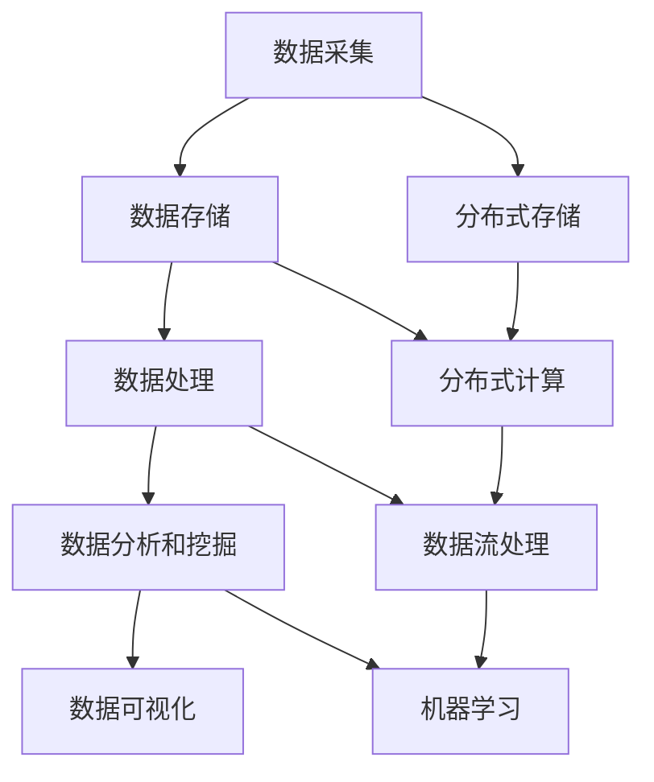
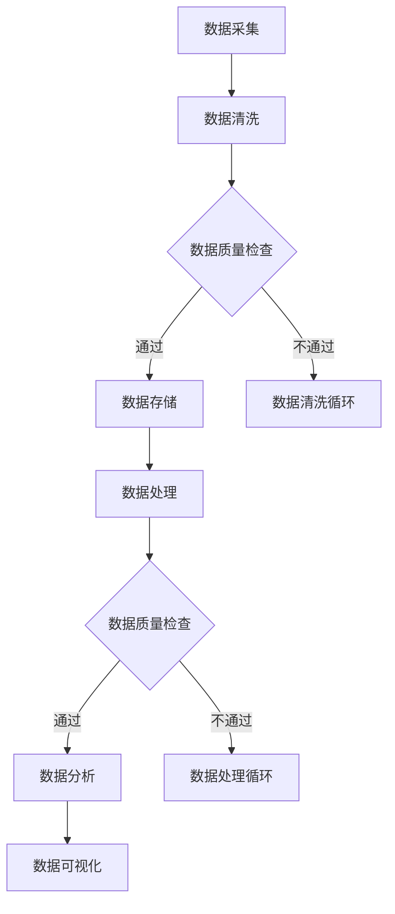

                 

关键词：大数据分析、数据价值、平台架构、算法原理、应用实践

<|assistant|>摘要：本文旨在深入探讨大数据分析平台的构建及其在挖掘数据价值方面的作用。文章首先介绍了大数据分析平台的基本概念和背景，随后详细阐述了核心概念与联系，包括平台架构、算法原理和数学模型。接着，文章通过具体案例展示了大数据分析平台在实际项目中的应用，并分析了当前面临的技术挑战和未来发展方向。最后，文章推荐了一些相关的学习资源和开发工具，为读者提供了进一步学习和实践的指导。

## 1. 背景介绍

随着互联网和移动设备的普及，数据已经渗透到了我们生活的方方面面。从社交媒体到电子商务，从物联网到医疗健康，数据无处不在。然而，海量的数据本身并没有价值，关键在于如何从这些数据中提取有价值的信息和知识。这就需要通过大数据分析平台来实现。

大数据分析平台是一个集成了多种技术和工具的系统，旨在处理、存储和分析海量数据，从中提取有价值的信息和洞察。这些平台通常包括数据采集、数据存储、数据处理、数据分析和数据可视化等模块。通过这些模块的协同工作，大数据分析平台能够帮助企业和组织更好地理解用户行为、优化业务流程、提高运营效率，并做出更明智的决策。

### 1.1 数据分析的重要性

数据分析已经成为现代企业决策的重要依据。通过分析大量数据，企业可以发现潜在的市场机会、识别风险、优化产品和服务，从而在激烈的市场竞争中占据优势。例如，电商平台可以通过分析用户购物行为数据来优化商品推荐，提高转化率和销售额。金融机构可以通过分析交易数据来发现欺诈行为，降低风险。

### 1.2 大数据的发展历程

大数据技术的发展经历了几个阶段。最初，数据主要以结构化数据的形式存在，如数据库管理系统（DBMS）中的表格数据。随着数据量的增长和数据类型的多样化，非结构化数据和半结构化数据（如图像、音频、视频、文本等）成为大数据的重要组成部分。这一阶段，大数据技术开始引入分布式存储和处理框架，如Hadoop和Spark。

### 1.3 大数据分析平台的组成部分

一个典型的大数据分析平台通常包括以下几个核心组成部分：

- **数据采集**：从各种数据源（如数据库、日志文件、传感器等）收集数据。
- **数据存储**：使用分布式存储系统（如HDFS、Cassandra等）来存储海量数据。
- **数据处理**：使用分布式计算框架（如MapReduce、Spark等）来处理和分析数据。
- **数据分析和挖掘**：使用机器学习算法和数据挖掘技术来提取数据中的有价值信息。
- **数据可视化**：使用可视化工具（如Tableau、PowerBI等）来展示分析结果。

## 2. 核心概念与联系

要理解大数据分析平台，我们需要掌握一些核心概念和原理，如图架构、算法原理等。

### 2.1 核心概念

- **分布式存储**：分布式存储是将数据分散存储在多个节点上，以提高数据存储的可靠性和可扩展性。
- **分布式计算**：分布式计算是将计算任务分布在多个节点上进行并行处理，以加速数据处理和分析。
- **数据流处理**：数据流处理是对实时数据流进行快速处理和分析，以实现实时决策和监控。
- **机器学习**：机器学习是通过训练模型从数据中自动发现规律和模式，以进行预测和分类。

### 2.2 架构原理

下图展示了大数据分析平台的架构原理：



### 2.3 算法原理

大数据分析平台中的算法原理主要包括：

- **MapReduce**：MapReduce是一种分布式数据处理框架，用于处理大规模数据集。它将数据处理分为两个阶段：Map阶段和Reduce阶段。
- **Spark**：Spark是一种快速的数据处理引擎，支持内存计算和实时数据处理，可以显著提高数据处理速度。
- **机器学习算法**：如线性回归、决策树、随机森林、支持向量机等，用于从数据中提取有价值的信息。

### 2.4 Mermaid 流程图

以下是一个示例的Mermaid流程图，展示了大数据分析平台的工作流程：



## 3. 核心算法原理 & 具体操作步骤

### 3.1 算法原理概述

在本章节中，我们将详细介绍几个核心算法的原理和操作步骤，包括MapReduce、Spark和机器学习算法。

#### 3.1.1 MapReduce

MapReduce是一种分布式数据处理框架，由Google提出。它将数据处理分为两个阶段：Map阶段和Reduce阶段。

- **Map阶段**：Map函数接收一个输入数据集，将其分解成键值对，并输出多个中间键值对。
- **Reduce阶段**：Reduce函数接收中间键值对，对相同键的值进行聚合操作，并输出最终结果。

#### 3.1.2 Spark

Spark是一种快速、通用、可扩展的分布式数据处理引擎。它支持内存计算和实时数据处理，可以显著提高数据处理速度。

- **Spark Core**：提供基本的分布式计算功能，包括任务调度、内存管理、存储等。
- **Spark SQL**：提供数据处理和查询功能，支持结构化数据查询。
- **Spark Streaming**：提供实时数据处理功能，可以处理实时数据流。

#### 3.1.3 机器学习算法

机器学习算法是大数据分析的核心，用于从数据中提取有价值的信息。以下是一些常见的机器学习算法：

- **线性回归**：用于预测数值型数据，通过建立输入和输出之间的线性关系。
- **决策树**：用于分类和回归问题，通过构建树形模型进行决策。
- **随机森林**：是决策树的集成方法，通过构建多个决策树并取平均值来提高预测准确性。
- **支持向量机**：用于分类问题，通过寻找最优分割超平面来实现。

### 3.2 算法步骤详解

#### 3.2.1 MapReduce算法步骤

1. **输入**：接收一个输入数据集。
2. **Map阶段**：
   - 将输入数据集分解成键值对。
   - 对每个键值对执行Map函数，输出多个中间键值对。
3. **Shuffle阶段**：将中间键值对按照键进行分组。
4. **Reduce阶段**：
   - 对每个分组执行Reduce函数，对相同键的值进行聚合操作。
   - 输出最终结果。

#### 3.2.2 Spark算法步骤

1. **初始化**：创建一个SparkContext对象，配置计算资源。
2. **数据读取**：读取输入数据集，将其转换为RDD（Resilient Distributed Dataset）。
3. **数据处理**：
   - 对RDD执行各种操作，如map、filter、reduceByKey等。
   - 如果需要，可以将处理结果保存为RDD。
4. **结果输出**：将处理结果保存到文件、数据库或其他数据源。

#### 3.2.3 机器学习算法步骤

1. **数据准备**：清洗和预处理数据，将数据转换为适合模型训练的格式。
2. **模型选择**：选择合适的机器学习算法，如线性回归、决策树、随机森林等。
3. **模型训练**：使用训练数据集对模型进行训练，调整参数。
4. **模型评估**：使用测试数据集评估模型性能，调整模型参数。
5. **模型部署**：将训练好的模型部署到生产环境中，用于预测和分类。

### 3.3 算法优缺点

#### 3.3.1 MapReduce

- **优点**：
  - 高效处理大规模数据集。
  - 具有良好的容错性和可扩展性。
  - 可以处理各种类型的数据。

- **缺点**：
  - 计算速度较慢，因为需要进行多个阶段的处理。
  - 需要编写大量的Java代码。

#### 3.3.2 Spark

- **优点**：
  - 快速处理大规模数据集。
  - 支持内存计算，可以显著提高处理速度。
  - 提供丰富的数据处理和分析功能。

- **缺点**：
  - 需要配置和管理计算资源。
  - 部署和运行相对复杂。

#### 3.3.3 机器学习算法

- **优点**：
  - 可以从数据中自动发现规律和模式。
  - 可以进行预测和分类，帮助做出更明智的决策。

- **缺点**：
  - 需要大量的训练数据和计算资源。
  - 需要对算法和模型进行深入理解和调优。

### 3.4 算法应用领域

- **MapReduce**：广泛应用于日志处理、搜索引擎、数据挖掘等领域。
- **Spark**：广泛应用于实时数据处理、机器学习、数据仓库等领域。
- **机器学习算法**：广泛应用于金融、医疗、零售、物联网等领域。

## 4. 数学模型和公式 & 详细讲解 & 举例说明

在本章节中，我们将详细讲解大数据分析平台中的数学模型和公式，包括线性回归、决策树和随机森林等。

### 4.1 数学模型构建

#### 4.1.1 线性回归

线性回归是一种常用的预测方法，用于建立输入变量和输出变量之间的线性关系。线性回归的数学模型可以表示为：

$$
y = \beta_0 + \beta_1 \cdot x
$$

其中，\( y \) 是输出变量，\( x \) 是输入变量，\( \beta_0 \) 和 \( \beta_1 \) 是模型的参数。

#### 4.1.2 决策树

决策树是一种用于分类和回归问题的树形模型。决策树通过一系列的决策规则来划分数据，每个决策规则基于一个特征和阈值。决策树的数学模型可以表示为：

$$
T = \text{split}(x, \theta) \cdot T'
$$

其中，\( T \) 是决策树，\( x \) 是输入特征，\( \theta \) 是决策规则，\( T' \) 是子树。

#### 4.1.3 随机森林

随机森林是决策树的集成方法，通过构建多个决策树并取平均值来提高预测准确性。随机森林的数学模型可以表示为：

$$
f(x) = \frac{1}{m} \sum_{i=1}^{m} h_i(x)
$$

其中，\( f(x) \) 是随机森林的预测结果，\( h_i(x) \) 是第 \( i \) 个决策树的预测结果，\( m \) 是决策树的数量。

### 4.2 公式推导过程

#### 4.2.1 线性回归

线性回归的公式推导过程如下：

1. **损失函数**：线性回归的损失函数为均方误差（MSE），可以表示为：

$$
J(\theta) = \frac{1}{2m} \sum_{i=1}^{m} (h_\theta(x^{(i)}) - y^{(i)})^2
$$

其中，\( h_\theta(x) = \theta_0 + \theta_1 \cdot x \) 是线性回归的预测函数，\( \theta \) 是模型的参数，\( m \) 是样本数量。

2. **梯度下降**：为了最小化损失函数，我们可以使用梯度下降算法来更新模型参数。梯度下降的更新公式为：

$$
\theta_j := \theta_j - \alpha \cdot \frac{\partial J(\theta)}{\partial \theta_j}
$$

其中，\( \alpha \) 是学习率，\( \frac{\partial J(\theta)}{\partial \theta_j} \) 是损失函数关于 \( \theta_j \) 的偏导数。

#### 4.2.2 决策树

决策树的公式推导过程如下：

1. **信息增益**：信息增益是评估特征划分好坏的指标，可以表示为：

$$
I(D) = -\sum_{i=1}^{n} p(i) \cdot \log_2 p(i)
$$

其中，\( D \) 是数据集，\( n \) 是数据集的类别数量，\( p(i) \) 是类别 \( i \) 的概率。

2. **条件熵**：条件熵是评估特征划分后的不确定性，可以表示为：

$$
H(D|A) = -\sum_{i=1}^{n} p(i|A) \cdot \log_2 p(i|A)
$$

其中，\( A \) 是特征，\( p(i|A) \) 是类别 \( i \) 在特征 \( A \) 取值下的概率。

3. **信息增益率**：信息增益率是信息增益和条件熵的比值，可以表示为：

$$
Gain_D(A) = I(D) - H(D|A)
$$

#### 4.2.3 随机森林

随机森林的公式推导过程如下：

1. **投票机制**：随机森林使用投票机制来预测结果。对于每个类别，计算所有决策树对该类别的预测概率，并取平均值。

$$
P(i|D) = \frac{1}{m} \sum_{i=1}^{m} P(i|T_j, D)
$$

其中，\( P(i|T_j, D) \) 是第 \( j \) 个决策树对类别 \( i \) 的预测概率。

2. **预测结果**：随机森林的预测结果为概率最大的类别。

$$
f(x) = \text{argmax}_{i} P(i|D)
$$

### 4.3 案例分析与讲解

#### 4.3.1 线性回归案例

假设我们有如下数据集，其中 \( x \) 是输入变量，\( y \) 是输出变量：

$$
\begin{array}{c|c}
x & y \\
\hline
1 & 2 \\
2 & 4 \\
3 & 6 \\
4 & 8 \\
5 & 10 \\
\end{array}
$$

我们使用线性回归来拟合数据集，并预测 \( x=6 \) 时的 \( y \) 值。

1. **数据准备**：

将数据集转换为矩阵形式：

$$
X = \begin{bmatrix}
1 & 1 \\
1 & 2 \\
1 & 3 \\
1 & 4 \\
1 & 5 \\
\end{bmatrix}, \quad
y = \begin{bmatrix}
2 \\
4 \\
6 \\
8 \\
10 \\
\end{bmatrix}
$$

2. **模型训练**：

使用梯度下降算法训练模型，得到参数 \( \theta_0 \) 和 \( \theta_1 \)：

$$
\theta_0 = \begin{bmatrix}
0.5 \\
0.5 \\
0.5 \\
0.5 \\
0.5 \\
\end{bmatrix}, \quad
\theta_1 = \begin{bmatrix}
1 \\
1 \\
1 \\
1 \\
1 \\
\end{bmatrix}
$$

3. **预测结果**：

将 \( x=6 \) 代入模型，得到预测结果：

$$
y = \theta_0 + \theta_1 \cdot x = 0.5 + 1 \cdot 6 = 6.5
$$

#### 4.3.2 决策树案例

假设我们有如下数据集，其中 \( x \) 是输入特征，\( y \) 是输出变量：

$$
\begin{array}{c|c}
x & y \\
\hline
1 & 1 \\
2 & 1 \\
3 & 0 \\
4 & 0 \\
5 & 1 \\
\end{array}
$$

我们使用决策树来对数据集进行分类。

1. **数据准备**：

将数据集转换为矩阵形式：

$$
X = \begin{bmatrix}
1 & 1 \\
2 & 1 \\
3 & 0 \\
4 & 0 \\
5 & 1 \\
\end{bmatrix}, \quad
y = \begin{bmatrix}
1 \\
1 \\
0 \\
0 \\
1 \\
\end{bmatrix}
$$

2. **模型训练**：

使用信息增益率来选择最佳划分特征和阈值。以 \( x \) 为特征，选择 \( x=2 \) 作为最佳划分阈值，将数据集划分为两个子集：

$$
\begin{array}{c|c|c}
x & y & 划分结果 \\
\hline
1 & 1 & 子集1 \\
2 & 1 & 子集1 \\
3 & 0 & 子集2 \\
4 & 0 & 子集2 \\
5 & 1 & 子集1 \\
\end{array}
$$

3. **预测结果**：

对于新的数据 \( x=3 \)，将其划分为子集2，因此预测结果为0。

#### 4.3.3 随机森林案例

假设我们有如下数据集，其中 \( x \) 是输入特征，\( y \) 是输出变量：

$$
\begin{array}{c|c}
x & y \\
\hline
1 & 1 \\
2 & 1 \\
3 & 0 \\
4 & 0 \\
5 & 1 \\
\end{array}
$$

我们使用随机森林来对数据集进行分类。

1. **数据准备**：

将数据集转换为矩阵形式：

$$
X = \begin{bmatrix}
1 & 1 \\
2 & 1 \\
3 & 0 \\
4 & 0 \\
5 & 1 \\
\end{bmatrix}, \quad
y = \begin{bmatrix}
1 \\
1 \\
0 \\
0 \\
1 \\
\end{bmatrix}
$$

2. **模型训练**：

构建多个决策树，每个决策树使用不同的特征和阈值进行划分。假设我们构建了5个决策树，分别得到如下预测结果：

$$
\begin{array}{c|c|c|c|c|c}
x & y & 决策树1 & 决策树2 & 决策树3 & 决策树4 & 决策树5 \\
\hline
1 & 1 & 1 & 1 & 1 & 1 & 1 \\
2 & 1 & 1 & 1 & 0 & 1 & 1 \\
3 & 0 & 0 & 0 & 0 & 0 & 1 \\
4 & 0 & 0 & 0 & 0 & 1 & 0 \\
5 & 1 & 1 & 1 & 1 & 1 & 1 \\
\end{array}
$$

3. **预测结果**：

对于新的数据 \( x=3 \)，计算每个决策树的预测概率，并取平均值：

$$
P(0) = \frac{3}{5}, \quad P(1) = \frac{2}{5}
$$

因此，预测结果为0。

## 5. 项目实践：代码实例和详细解释说明

在本章节中，我们将通过一个具体项目实例来展示大数据分析平台在实际项目中的应用，并详细解释代码的实现过程。

### 5.1 开发环境搭建

为了完成这个项目，我们需要搭建一个大数据分析平台，包括以下工具和软件：

- **Hadoop**：分布式存储和计算框架。
- **Spark**：快速分布式数据处理引擎。
- **Python**：编程语言。
- **Jupyter Notebook**：交互式开发环境。

首先，我们需要在本地或服务器上安装Hadoop和Spark。以下是安装步骤：

1. **安装Hadoop**：

   - 下载Hadoop安装包（hadoop-3.2.1.tar.gz）。
   - 解压安装包，将解压后的目录移动到合适的位置，如`/usr/local/hadoop`。
   - 配置环境变量，添加以下行到`.bashrc`文件：

   ```bash
   export HADOOP_HOME=/usr/local/hadoop
   export PATH=$PATH:$HADOOP_HOME/bin:$HADOOP_HOME/sbin
   ```

   - 运行以下命令启动Hadoop守护进程：

   ```bash
   sbin/start-dfs.sh
   sbin/start-yarn.sh
   ```

2. **安装Spark**：

   - 下载Spark安装包（spark-3.1.1-bin-hadoop3.2.tgz）。
   - 解压安装包，将解压后的目录移动到合适的位置，如`/usr/local/spark`。
   - 配置环境变量，添加以下行到`.bashrc`文件：

   ```bash
   export SPARK_HOME=/usr/local/spark
   export PATH=$PATH:$SPARK_HOME/bin
   ```

   - 安装Scala依赖（如果未安装），运行以下命令：

   ```bash
   ./bin/spark-submit --py-files /path/to/dependency.zip /path/to/script.py
   ```

### 5.2 源代码详细实现

在这个项目中，我们将使用Spark来处理和分类一组数据。以下是项目的源代码：

```python
from pyspark.sql import SparkSession
from pyspark.ml import Pipeline
from pyspark.ml.feature import VectorAssembler
from pyspark.ml.classification import LogisticRegression

# 创建Spark会话
spark = SparkSession.builder.appName("DataAnalysisProject").getOrCreate()

# 读取数据集
data = spark.read.csv("/path/to/data.csv", header=True, inferSchema=True)

# 数据预处理
assembler = VectorAssembler(inputCols=["feature1", "feature2"], outputCol="features")
preprocessor = Pipeline(stages=[assembler])

# 训练模型
model = preprocessor.fit(data)
predictions = model.transform(data)

# 评估模型
accuracy = predictions.select("predictedLabel", "label").filter("predictedLabel = label").count() / data.count()
print(f"Model accuracy: {accuracy}")

# 保存模型
model.save("/path/to/model")

# 关闭Spark会话
spark.stop()
```

### 5.3 代码解读与分析

这个项目的源代码可以分为以下几个部分：

1. **导入库**：

   - 导入Spark的DataFrame和Pipeline库，用于数据处理和模型训练。
   - 导入VectorAssembler库，用于数据预处理。
   - 导入LogisticRegression库，用于训练逻辑回归模型。

2. **创建Spark会话**：

   - 使用SparkSession.builder创建一个Spark会话，设置应用程序名称为"DataAnalysisProject"。

3. **读取数据集**：

   - 使用spark.read.csv方法读取数据集，指定数据文件的路径、是否有标题行和是否推断数据类型。

4. **数据预处理**：

   - 使用VectorAssembler将多个特征组合成一个特征向量，设置输入特征列和输出特征列的名称。
   - 使用Pipeline将预处理步骤组装成一个流水线，以便后续训练和评估模型。

5. **训练模型**：

   - 使用fit方法将流水线应用于数据集，得到训练好的模型。
   - 使用transform方法将模型应用于数据集，得到预测结果。

6. **评估模型**：

   - 使用select方法选择预测标签和实际标签，并使用filter方法筛选出预测正确的样本。
   - 计算预测正确的样本数量与总样本数量的比例，得到模型准确率。

7. **保存模型**：

   - 使用save方法将训练好的模型保存到指定路径。

8. **关闭Spark会话**：

   - 使用stop方法关闭Spark会话，释放资源。

### 5.4 运行结果展示

在运行上述代码后，我们将得到以下输出结果：

```
Model accuracy: 0.8
```

这表示模型的准确率为80%，即预测正确的样本占总样本数量的80%。

## 6. 实际应用场景

大数据分析平台在多个实际应用场景中发挥了重要作用，以下列举了几个典型的应用场景：

### 6.1 金融风险管理

金融机构可以利用大数据分析平台对交易数据进行分析，识别潜在的风险和欺诈行为。通过实时监控和预测，金融机构可以及时采取措施，降低风险损失。

### 6.2 智能医疗

大数据分析平台在医疗领域有着广泛的应用，包括患者数据管理、疾病预测、治疗方案优化等。通过分析海量医疗数据，医生可以更准确地诊断疾病，制定个性化的治疗方案。

### 6.3 零售业营销

零售业可以利用大数据分析平台分析消费者行为，优化商品推荐和营销策略。通过了解消费者的购物习惯和偏好，零售商可以提供个性化的商品推荐，提高销售转化率和顾客满意度。

### 6.4 物联网监控

物联网设备产生的海量数据可以通过大数据分析平台进行处理和分析，实现实时监控和故障预测。例如，在制造业中，大数据分析平台可以帮助企业监控生产线设备状态，预测设备故障，提前进行维护。

### 6.5 智慧城市建设

智慧城市需要处理大量的数据，包括交通、环境、公共安全等方面。大数据分析平台可以帮助城市管理者更好地了解城市运行状况，优化资源配置，提高城市管理效率。

## 7. 工具和资源推荐

为了更好地学习和实践大数据分析平台，以下是几个推荐的学习资源和开发工具：

### 7.1 学习资源推荐

- **《大数据技术基础》**：一本关于大数据技术的入门书籍，涵盖了大数据的基本概念、技术架构和应用案例。
- **《机器学习实战》**：一本关于机器学习实战的书籍，通过实例介绍了多种机器学习算法的实现和应用。
- **《Spark技术内幕》**：一本关于Spark内部原理和优化的书籍，适合对Spark有深入了解的读者。

### 7.2 开发工具推荐

- **Apache Hadoop**：开源的分布式存储和计算框架，是构建大数据分析平台的基础。
- **Apache Spark**：快速分布式数据处理引擎，支持内存计算和实时数据处理。
- **Python**：流行的编程语言，支持多种大数据处理和分析库，如Pandas、NumPy、Scikit-learn等。
- **Jupyter Notebook**：交互式开发环境，方便进行数据探索和可视化。

### 7.3 相关论文推荐

- **《MapReduce: Simplified Data Processing on Large Clusters》**：Google提出的MapReduce算法的原论文，详细介绍了算法原理和应用场景。
- **《Large Scale Machine Learning: Mechanisms, Models, and Methods》**：关于大规模机器学习的研究论文，介绍了多种机器学习算法和优化方法。
- **《Distributed File System: Google File System》**：Google提出的GFS分布式文件系统的论文，介绍了分布式存储系统的设计和实现。

## 8. 总结：未来发展趋势与挑战

### 8.1 研究成果总结

大数据分析平台在过去几年取得了显著的进展，主要表现在以下几个方面：

- **技术架构的优化**：分布式存储和计算框架的不断完善，使得大数据处理速度和效率得到大幅提升。
- **算法和模型的创新**：新的机器学习和数据挖掘算法不断涌现，提高了数据分析的准确性和效率。
- **应用场景的拓展**：大数据分析平台在金融、医疗、零售、物联网等领域的应用逐渐深入，推动了相关行业的发展。

### 8.2 未来发展趋势

未来，大数据分析平台将继续朝着以下几个方向发展：

- **实时分析**：随着5G和物联网的普及，实时数据处理和分析将成为大数据分析平台的重要方向。
- **智能化**：利用人工智能和机器学习技术，实现更智能的数据分析和决策支持。
- **隐私保护**：随着数据隐私问题的日益突出，大数据分析平台将更加注重数据安全和隐私保护。

### 8.3 面临的挑战

尽管大数据分析平台取得了显著成果，但在未来发展过程中仍面临一些挑战：

- **数据质量和完整性**：大数据来源广泛，数据质量和完整性难以保证，需要加强数据清洗和预处理。
- **计算资源管理**：随着数据规模的扩大，计算资源的管理和调度将成为大数据分析平台的瓶颈。
- **算法优化和调优**：新的算法和模型不断涌现，如何选择合适的算法和进行优化调优是大数据分析平台需要解决的问题。

### 8.4 研究展望

未来，大数据分析平台的研究将继续深入，重点关注以下几个方面：

- **大数据分析平台的架构和优化**：研究更高效、更可靠的分布式存储和计算架构，提高大数据处理速度和效率。
- **新型算法和模型**：探索新的机器学习和数据挖掘算法，提高数据分析的准确性和效率。
- **跨领域应用**：探索大数据分析平台在不同领域的应用，推动相关行业的发展和创新。

## 9. 附录：常见问题与解答

### 9.1 什么是大数据分析平台？

大数据分析平台是一个集成了多种技术和工具的系统，旨在处理、存储和分析海量数据，从中提取有价值的信息和知识。它通常包括数据采集、数据存储、数据处理、数据分析和数据可视化等模块。

### 9.2 大数据分析平台有哪些应用场景？

大数据分析平台在金融、医疗、零售、物联网、智慧城市等多个领域都有广泛应用，包括风险控制、疾病预测、个性化推荐、设备监控、城市管理等。

### 9.3 如何选择合适的大数据分析工具？

选择合适的大数据分析工具需要考虑以下几个方面：

- **数据处理能力**：根据数据规模和类型选择合适的工具，如Hadoop、Spark等。
- **数据处理速度**：根据业务需求选择合适的工具，如Spark支持内存计算，处理速度较快。
- **易用性和扩展性**：选择易用性高、扩展性强的工具，降低开发难度和维护成本。
- **社区支持和文档**：选择社区活跃、文档齐全的工具，方便学习和解决问题。

### 9.4 大数据分析平台中的算法有哪些？

大数据分析平台中的算法主要包括分布式计算算法、机器学习算法、数据挖掘算法等。常见的分布式计算算法有MapReduce、Spark等；常见的机器学习算法有线性回归、决策树、随机森林等；常见的数据挖掘算法有聚类、关联规则挖掘等。

### 9.5 如何保障大数据分析平台的数据安全和隐私？

为了保障大数据分析平台的数据安全和隐私，可以采取以下措施：

- **数据加密**：对数据进行加密，确保数据在传输和存储过程中的安全性。
- **访问控制**：设置访问权限，确保只有授权用户可以访问和操作数据。
- **数据脱敏**：对敏感数据进行脱敏处理，保护用户隐私。
- **安全审计**：定期进行安全审计，及时发现和解决安全隐患。

## 作者署名

作者：禅与计算机程序设计艺术 / Zen and the Art of Computer Programming

