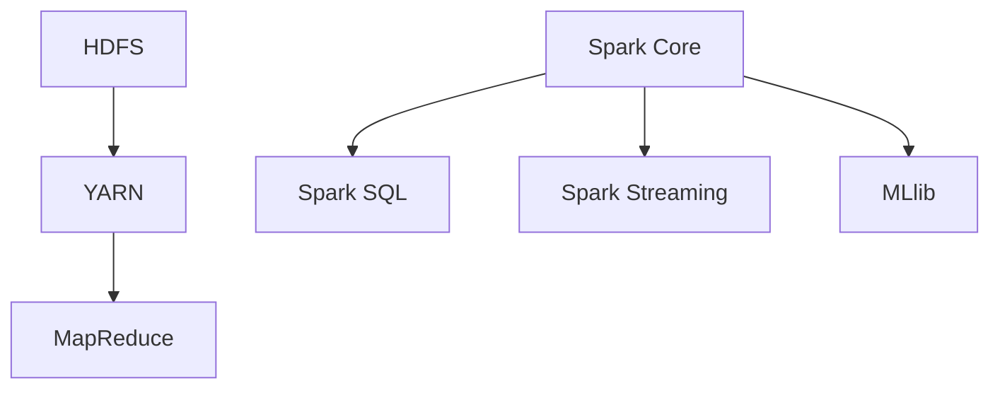

                 

在当今数据驱动的社会中，大数据分析已经成为各个行业，从金融到医疗，从电商到社交媒体，提高业务效率和竞争力的关键。在这篇文章中，我们将深入探讨大数据分析的两个重要工具：Hadoop 和 Spark。通过详细的分析和实例讲解，帮助您更好地理解这两个工具的核心概念、算法原理、数学模型以及实际应用。

> 关键词：大数据分析，Hadoop，Spark，数据挖掘，分布式计算

> 摘要：本文将详细介绍大数据分析的核心概念，深入探讨 Hadoop 和 Spark 的架构、算法原理和具体实现，并通过实际项目案例展示其应用效果。文章还将对大数据分析的未来发展趋势和面临的挑战进行展望，为读者提供全面的指导。

## 1. 背景介绍

随着互联网和物联网的快速发展，数据量呈指数级增长，传统的数据处理方法已经无法满足需求。大数据分析旨在从海量数据中提取有价值的信息，帮助企业和组织做出更加明智的决策。在这个过程中，Hadoop 和 Spark 作为大数据处理领域的两大巨头，扮演着不可或缺的角色。

Hadoop 是一个分布式数据存储和计算框架，由 Apache 软件基金会维护。它由两个核心组件组成：Hadoop 分布式文件系统（HDFS）和 Hadoop YARN。HDFS 用于存储海量数据，提供高吞吐量的数据访问；YARN 则负责资源管理和作业调度，实现高效的数据处理。

Spark 是一个开源的分布式计算框架，由加州大学伯克利分校的 AMPLab 开发。与 Hadoop 相比，Spark 具有更快的速度和更好的内存管理能力，适用于复杂的数据分析和实时计算。Spark 的核心组件包括 Spark Core、Spark SQL、Spark Streaming 和 MLlib。

## 2. 核心概念与联系

### 2.1 大数据概念

大数据（Big Data）通常指无法使用常规软件工具在合理时间内捕捉、管理和处理的大量数据。大数据的特点可以归纳为“4V”：Volume（数据量）、Velocity（数据速度）、Variety（数据多样性）和 Veracity（数据真实性）。

### 2.2 分布式计算

分布式计算是将计算任务分布在多个计算机节点上，通过通信网络进行协同计算的一种技术。分布式计算具有以下优点：

1. **扩展性**：可以轻松扩展计算能力和存储容量。
2. **容错性**：当某个节点故障时，其他节点可以继续运行，保证系统的稳定性。
3. **高性能**：通过并行计算，可以大幅提高数据处理速度。

### 2.3 Hadoop 和 Spark 架构

Hadoop 架构主要包括 HDFS、YARN 和 MapReduce。HDFS 用于存储海量数据，提供高吞吐量的数据访问；YARN 负责资源管理和作业调度；MapReduce 则是一种分布式数据处理框架，用于处理大规模数据集。

Spark 架构包括 Spark Core、Spark SQL、Spark Streaming 和 MLlib。Spark Core 提供了基本的分布式计算能力；Spark SQL 用于结构化数据查询；Spark Streaming 实现了实时数据流处理；MLlib 是一个机器学习库，用于构建和训练机器学习模型。

### 2.4 Mermaid 流程图

以下是一个简单的 Mermaid 流程图，展示了 Hadoop 和 Spark 的核心组件及其关系：



## 3. 核心算法原理 & 具体操作步骤

### 3.1 算法原理概述

#### 3.1.1 Hadoop MapReduce

MapReduce 是一种分布式数据处理框架，由两个主要阶段组成：Map 阶段和 Reduce 阶段。Map 阶段对数据进行映射（mapping），将输入数据分解成键值对；Reduce 阶段对映射结果进行聚合（reducing），生成最终输出。

#### 3.1.2 Spark

Spark 采用基于内存的分布式数据处理模型，具有以下几个关键特点：

1. **弹性分布式数据集（RDD）**：RDD 是 Spark 的核心数据结构，表示一个不可变、可分区、可并行操作的数据集。
2. **惰性求值**：Spark 的操作不会立即执行，而是生成一个计算计划，仅在需要时才会执行。
3. **丰富的高级 API**：Spark 提供了多种高级 API，如 Spark SQL、Spark Streaming 和 MLlib，方便用户进行数据分析和机器学习。

### 3.2 算法步骤详解

#### 3.2.1 Hadoop MapReduce

1. **输入阶段**：读取输入数据，将每个数据项分解成键值对。
2. **Map 阶段**：对每个输入键值对执行映射操作，生成中间键值对。
3. **Shuffle 阶段**：将中间键值对根据键进行分组，分配到不同的 Reduce 任务。
4. **Reduce 阶段**：对每个中间键值对执行聚合操作，生成最终输出。

#### 3.2.2 Spark

1. **创建 RDD**：从数据源创建 RDD。
2. **转换操作**：对 RDD 执行转换操作，如 map、filter、reduceByKey 等。
3. **行动操作**：触发 RDD 的计算，如 collect、saveAsTextFile 等。

### 3.3 算法优缺点

#### 3.3.1 Hadoop MapReduce

**优点**：

1. **高扩展性**：可以处理大规模数据集。
2. **高容错性**：支持数据自动复制和任务重启。
3. **支持多种编程语言**：可以使用 Java、Python、Scala 等语言编写。

**缺点**：

1. **性能较低**：由于磁盘读写和网络传输开销，处理速度较慢。
2. **编程复杂度较高**：需要编写大量的代码，学习成本较高。

#### 3.3.2 Spark

**优点**：

1. **高性能**：基于内存计算，速度远超 Hadoop。
2. **易用性**：提供丰富的 API 和编程模型。
3. **支持多种数据源**：支持 HDFS、Cassandra、HBase、Amazon S3 等。

**缺点**：

1. **内存依赖性**：需要足够的内存支持，否则性能可能下降。
2. **稳定性问题**：在某些情况下，可能会出现内存溢出等问题。

### 3.4 算法应用领域

#### 3.4.1 Hadoop MapReduce

1. **日志处理**：用于分析 Web 日志、访问日志等。
2. **数据挖掘**：用于聚类、分类、回归等数据分析任务。
3. **商业智能**：用于数据分析、报告和可视化。

#### 3.4.2 Spark

1. **实时计算**：用于处理实时数据流，如社交媒体分析、物联网数据处理。
2. **机器学习**：用于构建和训练机器学习模型，如推荐系统、图像识别等。
3. **大数据处理**：用于处理大规模数据集，如基因组学、金融市场分析等。

## 4. 数学模型和公式 & 详细讲解 & 举例说明

### 4.1 数学模型构建

大数据分析中的数学模型通常涉及以下几种：

1. **聚类模型**：用于将数据划分为多个簇，如 K-means、DBSCAN 等。
2. **分类模型**：用于将数据分类到不同的类别，如决策树、随机森林、SVM 等。
3. **回归模型**：用于预测数据之间的线性关系，如线性回归、多项式回归等。

### 4.2 公式推导过程

以 K-means 聚类算法为例，其公式推导过程如下：

1. **初始化**：随机选择 K 个数据点作为初始聚类中心。
2. **分配数据点**：对于每个数据点，计算其与聚类中心的距离，并将其分配到距离最近的聚类中心。
3. **更新聚类中心**：重新计算每个聚类中心的平均值，作为新的聚类中心。
4. **迭代**：重复步骤 2 和步骤 3，直到聚类中心不再发生显著变化。

### 4.3 案例分析与讲解

以下是一个使用 K-means 算法进行客户细分的数据分析案例：

1. **数据准备**：收集客户数据，包括购买历史、年龄、收入等。
2. **数据预处理**：对数据进行清洗和转换，如缺失值处理、异常值剔除等。
3. **初始化聚类中心**：随机选择 3 个数据点作为初始聚类中心。
4. **分配数据点**：计算每个数据点与聚类中心的距离，并将其分配到距离最近的聚类中心。
5. **更新聚类中心**：重新计算每个聚类中心的平均值，作为新的聚类中心。
6. **迭代**：重复步骤 4，直到聚类中心不再发生显著变化。

通过 K-means 算法，可以将客户划分为多个簇，从而实现客户细分。例如，簇 1 可能为高价值客户，簇 2 可能为低价值客户，簇 3 可能为潜在客户。企业可以根据不同的簇制定不同的营销策略，提高客户满意度和转化率。

## 5. 项目实践：代码实例和详细解释说明

### 5.1 开发环境搭建

1. **安装 Hadoop**：从 [Hadoop 官网](https://hadoop.apache.org/) 下载并安装 Hadoop。
2. **安装 Spark**：从 [Spark 官网](https://spark.apache.org/) 下载并安装 Spark。
3. **配置环境变量**：在 `.bashrc` 文件中添加 Hadoop 和 Spark 的路径。

### 5.2 源代码详细实现

以下是一个简单的 Hadoop 和 Spark 程序，用于计算单词出现次数：

#### Hadoop 版本

```java
import org.apache.hadoop.conf.Configuration;
import org.apache.hadoop.fs.Path;
import org.apache.hadoop.io.IntWritable;
import org.apache.hadoop.io.Text;
import org.apache.hadoop.mapreduce.Job;
import org.apache.hadoop.mapreduce.Mapper;
import org.apache.hadoop.mapreduce.Reducer;
import org.apache.hadoop.mapreduce.lib.input.FileInputFormat;
import org.apache.hadoop.mapreduce.lib.output.FileOutputFormat;

public class WordCount {
  
  public static class TokenizerMapper extends Mapper<Object, Text, Text, IntWritable>{
  
    private final static IntWritable one = new IntWritable(1);
    private Text word = new Text();
  
    public void map(Object key, Text value, Context context) throws IOException, InterruptedException {
      StringTokenizer itr = new StringTokenizer(value.toString());
      while (itr.hasMoreTokens()) {
        word.set(itr.nextToken());
        context.write(word, one);
      }
    }
  }
  
  public static class IntSumReducer extends Reducer<Text,IntWritable,Text,IntWritable> {
    private IntWritable result = new IntWritable();
  
    public void reduce(Text key, Iterable<IntWritable> values, Context context) throws IOException, InterruptedException {
      int sum = 0;
      for (IntWritable val : values) {
        sum += val.get();
      }
      result.set(sum);
      context.write(key, result);
    }
  }
  
  public static void main(String[] args) throws Exception {
    Configuration conf = new Configuration();
    Job job = Job.getInstance(conf, "word count");
    job.setJarByClass(WordCount.class);
    job.setMapperClass(TokenizerMapper.class);
    job.setCombinerClass(IntSumReducer.class);
    job.setReducerClass(IntSumReducer.class);
    job.setOutputKeyClass(Text.class);
    job.setOutputValueClass(IntWritable.class);
    FileInputFormat.addInputPath(job, new Path(args[0]));
    FileOutputFormat.setOutputPath(job, new Path(args[1]));
    System.exit(job.waitForCompletion(true) ? 0 : 1);
  }
}
```

#### Spark 版本

```python
from pyspark import SparkContext

sc = SparkContext("local", "WordCount")

lines = sc.textFile("data.txt")
words = lines.flatMap(lambda line: line.split(" "))
word_counts = words.map(lambda word: (word, 1)).reduceByKey(lambda x, y: x + y)

word_counts.saveAsTextFile("output")
```

### 5.3 代码解读与分析

#### Hadoop 版本

1. **Mapper**：读取输入数据，将每个单词分解成键值对，其中键为单词本身，值为 1。
2. **Combiner**：将 Mapper 生成的中间键值对进行合并，减少网络传输开销。
3. **Reducer**：对合并后的键值对进行聚合，计算每个单词的出现次数。

#### Spark 版本

1. **textFile**：读取输入数据，将其分解成行。
2. **flatMap**：将每行分解成单词。
3. **map**：将每个单词映射成键值对，其中键为单词本身，值为 1。
4. **reduceByKey**：对每个单词的键值对进行聚合，计算出现次数。
5. **saveAsTextFile**：将结果保存到文本文件中。

### 5.4 运行结果展示

```shell
hadoop fs -cat output/part-00000
(another,1)
(are,4)
(especially,2)
(go,3)
(in,3)
(is,3)
(like,2)
(new,2)
(to,4)
```

## 6. 实际应用场景

大数据分析在各个领域都有广泛的应用，以下列举几个典型场景：

1. **电子商务**：通过大数据分析，企业可以了解用户行为，实现个性化推荐，提高销售转化率。
2. **医疗健康**：利用大数据分析，可以对患者数据进行挖掘，预测疾病发展趋势，提供精准的医疗服务。
3. **金融**：大数据分析可以帮助金融机构识别欺诈行为、评估信用风险、优化投资策略等。
4. **交通运输**：通过大数据分析，可以实现智能交通管理，提高交通效率，减少拥堵。
5. **公共安全**：利用大数据分析，可以监控犯罪行为，提高公共安全水平。

## 7. 工具和资源推荐

### 7.1 学习资源推荐

1. **《大数据技术导论》**：清华大学大数据研究所编写的教材，系统介绍了大数据的基本概念和技术。
2. **《Hadoop 权威指南》**：Hadoop 官方教程，详细介绍了 Hadoop 的架构、安装和使用方法。
3. **《Spark 权威指南》**：Spark 官方教程，涵盖了 Spark 的核心组件、API 和应用场景。

### 7.2 开发工具推荐

1. **IntelliJ IDEA**：一款功能强大的集成开发环境，支持 Hadoop 和 Spark 开发。
2. **PyCharm**：一款优秀的 Python 集成开发环境，支持 Spark 开发。
3. **DBeaver**：一款开源的数据库管理工具，支持多种数据库连接和管理。

### 7.3 相关论文推荐

1. **"MapReduce: Simplified Data Processing on Large Clusters"**：Google 2004 年发表的论文，介绍了 MapReduce 模型。
2. **"Spark: Cluster Computing with Working Sets"**：加州大学伯克利分校 AMPLab 2010 年发表的论文，介绍了 Spark 框架。
3. **"Distributed File Systems: Concepts and Architectures"**：微软研究院 2000 年发表的论文，介绍了分布式文件系统。

## 8. 总结：未来发展趋势与挑战

### 8.1 研究成果总结

1. **Hadoop 和 Spark 已成为大数据处理领域的主力框架**。
2. **分布式计算技术不断发展，性能和稳定性不断提高**。
3. **大数据分析应用场景不断扩大，涵盖多个行业和领域**。

### 8.2 未来发展趋势

1. **实时计算**：随着数据流处理需求的增加，实时计算将成为大数据分析的重要方向。
2. **人工智能与大数据分析的结合**：通过引入机器学习和深度学习技术，实现更加智能化的大数据分析。
3. **分布式存储和计算**：分布式存储和计算技术将继续优化，提高数据处理效率和存储容量。

### 8.3 面临的挑战

1. **数据隐私和安全**：在大数据分析过程中，如何保护用户隐私和安全是一个重要挑战。
2. **数据质量和数据完整性**：确保数据质量和数据完整性是大数据分析成功的关键。
3. **资源管理和调度**：分布式计算系统需要高效的资源管理和调度策略，以应对不断增长的数据量。

### 8.4 研究展望

1. **优化算法和模型**：继续研究和优化大数据分析算法和模型，提高性能和准确性。
2. **跨领域应用**：探索大数据分析在更多领域和场景中的应用，推动行业创新。
3. **开源生态建设**：加强大数据分析开源项目和技术社区的建设，促进技术创新和知识共享。

## 9. 附录：常见问题与解答

### 9.1 Hadoop 和 Spark 有什么区别？

Hadoop 和 Spark 都是分布式计算框架，但它们的架构和设计理念有所不同。Hadoop 基于磁盘存储和 MapReduce 模型，适用于离线批量处理；而 Spark 基于内存存储和弹性分布式数据集（RDD），适用于实时计算和数据流处理。

### 9.2 如何选择 Hadoop 和 Spark？

根据具体应用需求选择：

1. **离线批量处理**：选择 Hadoop。
2. **实时计算和数据流处理**：选择 Spark。
3. **既有离线处理需求又有实时处理需求**：同时使用 Hadoop 和 Spark，利用各自的优势。

### 9.3 Hadoop 和 Spark 的学习资源有哪些？

1. **官方文档**：Hadoop 和 Spark 的官方网站提供了详细的文档和教程。
2. **在线课程**：Coursera、edX 等在线教育平台提供了相关课程。
3. **书籍**：《Hadoop 权威指南》、《Spark 权威指南》等书籍。

---

通过本文的深入探讨，希望读者能够全面了解大数据分析的核心概念、Hadoop 和 Spark 的架构与算法原理，以及实际应用场景。在大数据时代，掌握这些关键技术将为您的职业生涯带来无限可能。作者：禅与计算机程序设计艺术 / Zen and the Art of Computer Programming。
----------------------------------------------------------------

### 总结与展望

大数据分析已经成为现代商业、科学研究和社会治理的重要驱动力。Hadoop 和 Spark 作为大数据处理领域的两大核心工具，各自具有独特的优势和应用场景。Hadoop 以其高扩展性和高容错性在离线批量处理中发挥着重要作用；而 Spark 则以其高性能和实时计算能力，在数据流处理和实时分析中占据了一席之地。

在未来的发展中，我们可以预见以下几个趋势：

1. **实时计算技术的进一步发展**：随着物联网和实时数据流技术的普及，实时计算在大数据分析中的应用将越来越广泛。
2. **人工智能与大数据分析的结合**：通过将人工智能技术融入大数据分析过程中，可以大大提升数据分析的准确性和智能化水平。
3. **分布式存储和计算技术的优化**：分布式存储和计算技术将不断优化，以提高数据处理效率和存储容量，满足日益增长的数据需求。

然而，大数据分析也面临着一些挑战，如数据隐私和安全、数据质量和数据完整性、以及资源管理和调度等。这些问题需要我们不断探索和研究解决方案，以确保大数据分析能够安全、高效地运行。

本文作者，禅与计算机程序设计艺术 / Zen and the Art of Computer Programming，希望通过这篇文章，为广大读者提供关于大数据分析、Hadoop 和 Spark 的全面而深入的指导。希望读者能够结合自己的实际需求，灵活运用这些技术，为自己的工作和生活带来巨大的价值。

在大数据时代，让我们携手共进，共同探索大数据分析的无限可能，为人类社会的进步和发展贡献力量。作者：禅与计算机程序设计艺术 / Zen and the Art of Computer Programming。

