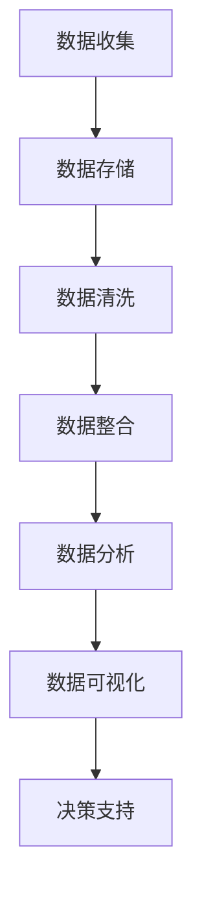

                 

关键词：大数据、人类计算、海量数据处理、算法、数学模型、实践案例、未来展望

## 摘要

随着信息技术的飞速发展，大数据已经渗透到我们生活的方方面面。如何有效地存储、处理和分析海量数据，成为当前计算机科学和信息技术领域的重要课题。本文将深入探讨大数据时代下人类计算面临的挑战，介绍核心算法原理和数学模型，通过实践案例展示解决方案，并展望未来发展趋势与面临的挑战。

## 1. 背景介绍

### 1.1 大数据的发展历程

大数据（Big Data）这一概念最早由吉多·范罗苏姆（Gido Van Rossum）在2001年提出。随着互联网的普及和物联网技术的发展，数据量呈指数级增长。从简单的个人记录到全球范围内的传感器数据，大数据已经成为现代社会不可或缺的一部分。

### 1.2 大数据的特征

大数据通常具有以下四个V特性：Volume（数据量大）、Velocity（数据处理速度快）、Variety（数据类型多样）和Veracity（数据真实性高）。这些特性使得传统的数据处理方法难以应对，催生了大量新的算法和技术。

### 1.3 人类计算的需求

人类计算在面对海量数据时，面临着效率低、成本高、错误率高的问题。为了解决这些问题，我们需要开发出更加高效、可靠的大数据处理技术，以满足实际应用的需求。

## 2. 核心概念与联系

### 2.1 大数据的核心概念

- **数据仓库**：用于存储大量数据，并提供数据管理和分析功能。
- **数据挖掘**：从大量数据中发现有价值的信息和模式。
- **机器学习**：利用算法和统计方法，使计算机能够从数据中学习，进行预测和决策。
- **云计算**：通过互联网提供动态易扩展且经常是虚拟化的资源。

### 2.2 Mermaid 流程图



## 3. 核心算法原理 & 具体操作步骤

### 3.1 算法原理概述

在面对海量数据时，常用的算法有：MapReduce、随机梯度下降（SGD）、K-Means聚类等。

### 3.2 算法步骤详解

#### 3.2.1 MapReduce

- **Map**阶段：将输入数据分解为多个小块，并对每个小块进行映射操作。
- **Reduce**阶段：将Map阶段的输出合并，生成最终的输出结果。

#### 3.2.2 随机梯度下降（SGD）

- **初始化参数**：设置初始参数值。
- **迭代更新**：根据输入数据，通过梯度下降法迭代更新参数。
- **收敛判断**：当参数变化小于某个阈值时，判断算法收敛。

#### 3.2.3 K-Means聚类

- **初始化聚类中心**：随机选择K个数据点作为初始聚类中心。
- **分配数据点**：将每个数据点分配到最近的聚类中心。
- **更新聚类中心**：计算每个聚类的中心，并更新聚类中心。
- **迭代优化**：重复分配和更新聚类中心，直到聚类中心不再变化。

### 3.3 算法优缺点

- **MapReduce**：优点是并行度高、易于扩展，缺点是需要编写大量的代码。
- **随机梯度下降（SGD）**：优点是算法简单、易于实现，缺点是收敛速度慢。
- **K-Means聚类**：优点是算法简单、易于实现，缺点是聚类结果受初始聚类中心影响较大。

### 3.4 算法应用领域

- **MapReduce**：广泛应用于搜索引擎、数据挖掘等领域。
- **随机梯度下降（SGD）**：广泛应用于机器学习、深度学习等领域。
- **K-Means聚类**：广泛应用于数据分析、图像识别等领域。

## 4. 数学模型和公式 & 详细讲解 & 举例说明

### 4.1 数学模型构建

- **线性回归**：用于预测一个连续值输出。
- **逻辑回归**：用于预测一个二元分类输出。
- **决策树**：用于分类和回归问题。

### 4.2 公式推导过程

- **线性回归**：
  $$ y = \beta_0 + \beta_1x $$
  $$ \beta_0 = \frac{\sum y - \beta_1\sum x}{n} $$
  $$ \beta_1 = \frac{n\sum xy - \sum x\sum y}{n\sum x^2 - (\sum x)^2} $$

- **逻辑回归**：
  $$ P(y=1) = \frac{1}{1 + e^{-(\beta_0 + \beta_1x)}} $$
  $$ \beta_0 = \frac{\sum y - \beta_1\sum x}{n} $$
  $$ \beta_1 = \frac{n\sum xy - \sum x\sum y}{n\sum x^2 - (\sum x)^2} $$

- **决策树**：
  $$ Gini(\text{impurity}) = 1 - \sum_{i=1}^{k} p_i^2 $$
  $$ Entropy(\text{impurity}) = -\sum_{i=1}^{k} p_i \log_2 p_i $$

### 4.3 案例分析与讲解

- **线性回归**：预测房价。
- **逻辑回归**：判断邮件是否为垃圾邮件。
- **决策树**：分类客户购买行为。

## 5. 项目实践：代码实例和详细解释说明

### 5.1 开发环境搭建

- **Python**：选择Python作为编程语言，因为它拥有丰富的数据处理和机器学习库。
- **Jupyter Notebook**：用于编写和运行代码。

### 5.2 源代码详细实现

```python
import numpy as np
from sklearn.linear_model import LinearRegression
from sklearn.model_selection import train_test_split
from sklearn.metrics import mean_squared_error

# 数据准备
X = np.array([[1], [2], [3], [4], [5]])
y = np.array([2, 4, 5, 4, 5])

# 分割数据
X_train, X_test, y_train, y_test = train_test_split(X, y, test_size=0.2, random_state=42)

# 训练模型
model = LinearRegression()
model.fit(X_train, y_train)

# 预测
y_pred = model.predict(X_test)

# 评估
mse = mean_squared_error(y_test, y_pred)
print("MSE:", mse)
```

### 5.3 代码解读与分析

- **数据准备**：生成简单的线性数据集。
- **分割数据**：将数据集划分为训练集和测试集。
- **训练模型**：使用线性回归模型训练数据。
- **预测**：使用训练好的模型进行预测。
- **评估**：计算预测误差，评估模型性能。

## 6. 实际应用场景

### 6.1 金融服务

- **风险管理**：利用大数据技术进行风险评估和预测。
- **客户关系管理**：通过数据分析优化客户体验和营销策略。

### 6.2 健康医疗

- **疾病预测**：通过数据分析预测疾病趋势。
- **个性化医疗**：基于患者数据提供个性化的治疗方案。

### 6.3 智能制造

- **生产优化**：通过数据分析优化生产流程和资源分配。
- **设备维护**：通过预测性维护减少设备故障。

## 7. 工具和资源推荐

### 7.1 学习资源推荐

- **书籍**：《大数据时代》、《深度学习》
- **在线课程**：Coursera、edX、Udacity

### 7.2 开发工具推荐

- **编程语言**：Python、R
- **数据处理工具**：Pandas、NumPy
- **机器学习库**：Scikit-learn、TensorFlow、PyTorch

### 7.3 相关论文推荐

- “Big Data: A Revolution That Will Transform How We Live, Work, and Think” by Viktor Mayer-Schönberger and Kenneth Cukier
- “Deep Learning” by Ian Goodfellow, Yoshua Bengio, and Aaron Courville

## 8. 总结：未来发展趋势与挑战

### 8.1 研究成果总结

- **算法优化**：针对大数据特点，开发出更加高效、准确的算法。
- **数据隐私保护**：研究数据隐私保护技术，确保用户数据安全。
- **跨领域融合**：大数据与其他领域的结合，推动技术创新。

### 8.2 未来发展趋势

- **云计算与大数据的结合**：利用云计算的弹性和扩展性，处理海量数据。
- **边缘计算**：将数据处理推向网络边缘，提高实时性。
- **人工智能与大数据的融合**：利用人工智能技术，实现更智能的数据分析。

### 8.3 面临的挑战

- **数据质量**：确保数据真实、准确、完整。
- **数据隐私**：保护用户隐私，防止数据泄露。
- **技术人才短缺**：培养更多大数据领域的人才。

### 8.4 研究展望

- **大数据治理**：制定大数据管理标准和规范。
- **跨领域应用**：推动大数据在更多领域的应用，创造更多价值。

## 9. 附录：常见问题与解答

### 9.1 大数据和云计算有什么区别？

- **大数据**：指的是大规模的数据集，具有高维度、多样性和高速增长的特点。
- **云计算**：是一种通过网络访问计算资源的方式，包括存储、处理、网络等资源。

### 9.2 如何确保大数据分析中的数据隐私？

- **数据匿名化**：对数据进行去标识化处理，消除个人信息。
- **加密技术**：对敏感数据进行加密，确保数据在传输和存储过程中的安全性。

### 9.3 大数据在哪些领域有重要应用？

- **金融服务**：风险控制、客户关系管理。
- **健康医疗**：疾病预测、个性化治疗。
- **智能制造**：生产优化、设备维护。

---

### 作者署名

作者：禅与计算机程序设计艺术 / Zen and the Art of Computer Programming

---

本文旨在探讨大数据时代下人类计算面临的挑战和解决方案，并展望未来发展趋势。希望通过本文，能够为读者提供对大数据领域的深入理解和应用指导。在未来的发展中，我们期待大数据技术能够为人类社会带来更多创新和进步。

