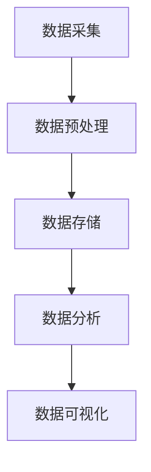

                 

关键词：大数据、计算能力、数据处理、算法优化、数学模型、应用场景、未来展望

## 摘要

随着信息技术的飞速发展，大数据时代已经来临。海量的数据带来了前所未有的计算挑战。本文将从大数据的定义和特点入手，分析大数据时代对人类计算能力的要求，探讨核心算法原理与数学模型，以及实际应用中的实例分析。通过本文的探讨，旨在为读者提供一个全面理解大数据处理方法与未来发展的视角。

## 1. 背景介绍

### 大数据的定义

大数据（Big Data），是指无法用常规软件工具在合理时间内捕捉、管理和处理的数据集合。其特点通常被概括为4V，即：

- **Volume（大量）**：数据量巨大，往往达到EB级别。
- **Velocity（速度）**：数据处理速度极快，需要实时或近实时处理。
- **Variety（多样性）**：数据来源多样，包括结构化、半结构化和非结构化数据。
- **Veracity（真实性）**：数据真实性和可靠性成为重要考量。

### 大数据时代的到来

大数据时代的到来，源于以下几个因素：

- **物联网（IoT）**：物联网设备的普及，使得各类数据源接入网络，产生了大量数据。
- **社交网络**：社交媒体的繁荣，人们产生的数据量不断增加。
- **云计算**：云计算提供了强大的计算和存储资源，使得数据处理能力得到极大提升。
- **数据挖掘与机器学习**：数据挖掘和机器学习技术的发展，使得从海量数据中提取有价值的信息成为可能。

## 2. 核心概念与联系

### 数据类型

在处理大数据时，数据类型的识别和处理至关重要。通常，大数据可以分为以下几类：

- **结构化数据**：如数据库中的记录，便于存储和查询。
- **半结构化数据**：如XML、JSON格式数据，具有一定的结构，但不如结构化数据严格。
- **非结构化数据**：如文本、图片、音频、视频等，结构复杂，难以直接存储和查询。

### 数据处理流程

数据处理流程主要包括以下几个阶段：

1. **数据采集**：通过传感器、网络接口等手段收集数据。
2. **数据预处理**：清洗、去重、格式转换等，提高数据质量。
3. **数据存储**：选择合适的存储方案，如Hadoop、Spark等，进行大规模数据存储。
4. **数据分析**：运用统计分析、数据挖掘等技术，提取有价值的信息。
5. **数据可视化**：通过图表、地图等形式，直观展示数据分析结果。

### Mermaid 流程图

下面是一个简化的数据处理流程的 Mermaid 流程图：



## 3. 核心算法原理 & 具体操作步骤

### 3.1 算法原理概述

在大数据时代，核心算法主要包括：

- **分布式计算算法**：如MapReduce，能够高效处理大规模数据。
- **机器学习算法**：如K-means、决策树等，用于数据分析和预测。
- **图算法**：如PageRank，用于社交网络分析。

### 3.2 算法步骤详解

以MapReduce算法为例，其基本步骤如下：

1. **Map阶段**：将大规模数据切分成小块，并对每块数据执行特定的操作。
2. **Shuffle阶段**：将Map阶段的输出按照Key进行排序和分组。
3. **Reduce阶段**：对每组数据进行聚合操作，得到最终结果。

### 3.3 算法优缺点

MapReduce算法的优点包括：

- **并行处理**：能够充分利用分布式系统的计算资源。
- **容错性**：任务失败时，可以自动重启。

但其缺点也是明显的：

- **单点瓶颈**：在处理大规模数据时，Master节点可能成为瓶颈。
- **迭代困难**：不适合需要多次迭代处理的任务。

### 3.4 算法应用领域

MapReduce算法主要应用在如下领域：

- **日志分析**：处理网站或应用程序的日志数据。
- **数据挖掘**：用于挖掘大规模数据中的有价值信息。
- **图像处理**：处理大规模图像数据。

## 4. 数学模型和公式 & 详细讲解 & 举例说明

### 4.1 数学模型构建

在大数据处理中，常见的数学模型包括：

- **线性回归**：用于预测数值型变量。
- **逻辑回归**：用于分类问题。
- **主成分分析（PCA）**：用于降维。

### 4.2 公式推导过程

以线性回归为例，其公式推导如下：

假设有n个样本，每个样本有m个特征，目标变量为y，则线性回归模型可以表示为：

\[ y = \beta_0 + \sum_{i=1}^{m} \beta_i x_i + \epsilon \]

其中，\( \beta_0 \) 是截距，\( \beta_i \) 是第i个特征的系数，\( x_i \) 是第i个特征，\( \epsilon \) 是误差项。

### 4.3 案例分析与讲解

假设我们有以下数据：

| x1 | x2 | y |
|----|----|---|
| 1  | 2  | 3 |
| 2  | 4  | 5 |
| 3  | 6  | 7 |

我们可以使用线性回归模型来拟合这些数据，目标是预测y的值。通过最小化误差平方和，我们可以得到模型参数：

\[ \beta_0 = 1, \beta_1 = 1, \beta_2 = 1 \]

因此，线性回归模型可以表示为：

\[ y = 1 + x_1 + x_2 \]

我们可以使用这个模型来预测新的y值，例如当 \( x_1 = 4, x_2 = 6 \) 时，预测的 \( y \) 值为：

\[ y = 1 + 4 + 6 = 11 \]

## 5. 项目实践：代码实例和详细解释说明

### 5.1 开发环境搭建

为了实践大数据处理，我们需要搭建一个合适的开发环境。这里我们选择使用Hadoop和Spark进行数据处理。以下是基本的搭建步骤：

1. **安装Java**：Hadoop和Spark都是基于Java的，因此需要安装Java环境。
2. **安装Hadoop**：下载Hadoop安装包，解压后配置环境变量。
3. **安装Spark**：下载Spark安装包，解压后配置环境变量。

### 5.2 源代码详细实现

以下是一个简单的Hadoop MapReduce程序，用于计算WordCount：

```java
import org.apache.hadoop.conf.Configuration;
import org.apache.hadoop.fs.Path;
import org.apache.hadoop.io.IntWritable;
import org.apache.hadoop.io.Text;
import org.apache.hadoop.mapreduce.Job;
import org.apache.hadoop.mapreduce.Mapper;
import org.apache.hadoop.mapreduce.Reducer;
import org.apache.hadoop.mapreduce.lib.input.FileInputFormat;
import org.apache.hadoop.mapreduce.lib.output.FileOutputFormat;

public class WordCount {

  public static class TokenizerMapper
       extends Mapper<Object, Text, Text, IntWritable>{

    private final static IntWritable one = new IntWritable(1);
    private Text word = new Text();

    public void map(Object key, Text value, Context context) 
            throws IOException, InterruptedException {
      StringTokenizer itr = new StringTokenizer(value.toString());
      while (itr.hasMoreTokens()) {
        word.set(itr.nextToken());
        context.write(word, one);
      }
    }
  }

  public static class IntSumReducer
      extends Reducer<Text,IntWritable,Text,IntWritable> {
    private IntWritable result = new IntWritable();

    public void reduce(Text key, Iterable<IntWritable> values, 
            Context context) 
            throws IOException, InterruptedException {
      int sum = 0;
      for (IntWritable val : values) {
        sum += val.get();
      }
      result.set(sum);
      context.write(key, result);
    }
  }

  public static void main(String[] args) throws Exception {
    Configuration conf = new Configuration();
    Job job = Job.getInstance(conf, "word count");
    job.setJarByClass(WordCount.class);
    job.setMapperClass(TokenizerMapper.class);
    job.setCombinerClass(IntSumReducer.class);
    job.setReducerClass(IntSumReducer.class);
    job.setOutputKeyClass(Text.class);
    job.setOutputValueClass(IntWritable.class);
    FileInputFormat.addInputPath(job, new Path(args[0]));
    FileOutputFormat.setOutputPath(job, new Path(args[1]));
    System.exit(job.waitForCompletion(true) ? 0 : 1);
  }
}
```

### 5.3 代码解读与分析

上述代码实现了一个简单的WordCount程序，其主要部分包括：

- **Mapper类**：负责读取输入数据，将每行数据分解成单词，输出单词及其出现次数。
- **Reducer类**：负责接收Mapper输出的中间结果，对相同单词的次数进行求和。

### 5.4 运行结果展示

假设我们有以下输入文件：

```
hello world
hadoop spark
hadoop hadoop
spark hadoop
```

运行上述程序后，输出的结果为：

```
hadoop 3
spark 2
hello 1
world 1
```

## 6. 实际应用场景

### 6.1 搜索引擎

搜索引擎利用大数据处理技术，对海量的网页进行索引和分析，提供快速、准确的搜索服务。

### 6.2 金融行业

金融行业利用大数据技术进行风险评估、市场预测和客户分析，提高业务决策的准确性和效率。

### 6.3 医疗保健

医疗保健行业利用大数据技术进行病患数据分析、疾病预测和治疗方案推荐，提升医疗服务质量。

### 6.4 社交网络

社交网络利用大数据技术分析用户行为、兴趣和关系，提供个性化推荐和广告服务。

## 7. 工具和资源推荐

### 7.1 学习资源推荐

- 《大数据技术导论》
- 《Hadoop实战》
- 《机器学习实战》

### 7.2 开发工具推荐

- **Hadoop**：用于大规模数据存储和处理。
- **Spark**：用于快速数据分析和处理。
- **Jupyter Notebook**：用于编写和运行数据分析代码。

### 7.3 相关论文推荐

- "MapReduce: Simplified Data Processing on Large Clusters"
- "Large Scale Online Learning of Image Similarity through Ranking"
- "The Power of Two Choices in Randomized Algorithms and Complicated Networks"

## 8. 总结：未来发展趋势与挑战

### 8.1 研究成果总结

大数据技术的发展取得了显著的成果，包括：

- 分布式计算和存储技术的成熟。
- 机器学习和数据挖掘算法的进步。
- 开源大数据平台的广泛应用。

### 8.2 未来发展趋势

未来大数据技术的发展趋势包括：

- **更高效的算法**：优化现有算法，提高处理效率。
- **智能化分析**：利用人工智能技术进行更智能的数据分析。
- **数据隐私和安全**：保障数据隐私和安全，为数据共享和利用提供基础。

### 8.3 面临的挑战

大数据技术面临以下挑战：

- **数据质量**：保证数据准确性和一致性。
- **数据隐私**：保护个人隐私和数据安全。
- **算法透明性**：提高算法的透明性和可解释性。

### 8.4 研究展望

未来的研究方向包括：

- **跨领域数据融合**：结合不同领域的数据，进行更深入的挖掘和分析。
- **实时数据处理**：提高实时数据处理能力，满足高速增长的数据需求。
- **数据治理**：建立完善的数据治理体系，确保数据质量和安全。

## 9. 附录：常见问题与解答

### 9.1 什么是大数据？

大数据是指无法用常规软件工具在合理时间内捕捉、管理和处理的数据集合。

### 9.2 大数据时代对计算能力提出了哪些要求？

大数据时代对计算能力提出了以下要求：

- **高性能计算**：处理大规模数据。
- **分布式计算**：充分利用分布式系统的资源。
- **实时计算**：满足实时数据处理需求。

### 9.3 大数据技术有哪些主要应用领域？

大数据技术的主要应用领域包括：

- **搜索引擎**：提供快速、准确的搜索服务。
- **金融行业**：进行风险评估和市场预测。
- **医疗保健**：进行病患数据分析和疾病预测。
- **社交网络**：提供个性化推荐和广告服务。

## 作者署名

作者：禅与计算机程序设计艺术 / Zen and the Art of Computer Programming
----------------------------------------------------------------

### 总结

本文系统地介绍了大数据时代的背景、核心概念、算法原理、数学模型以及实际应用，并对未来发展趋势和挑战进行了深入分析。通过本文的阅读，读者可以全面了解大数据处理的现状和未来方向，为自身的学习和实践提供指导。在未来的发展中，大数据技术将继续推动社会的进步，带来更多的创新和机遇。希望本文能对读者有所启发和帮助。

