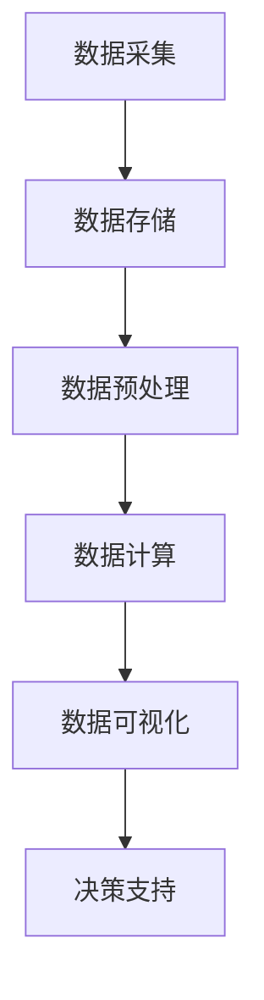

                 

关键词：大数据、计算、算法、数学模型、应用场景、未来展望

> 摘要：本文深入探讨了大数据时代的到来对人类计算带来的机遇与挑战。通过对大数据核心概念、算法原理、数学模型的详细阐述，以及实际项目实践的案例分析，本文旨在为读者提供一个全面的大数据计算指南，并对其未来发展进行展望。

## 1. 背景介绍

随着互联网、物联网和移动设备的广泛应用，全球数据量呈现爆炸式增长。据IDC统计，全球数据量每年增长约40%，预计到2025年，全球数据总量将达到160ZB。面对如此庞大的数据量，传统的计算方法已经显得力不从心，大数据技术应运而生。

大数据不仅仅是一个数据量的问题，更是一个计算和处理的问题。它要求我们能够快速、高效地从海量数据中提取有价值的信息，进行实时分析，并为决策提供支持。因此，大数据时代对计算能力提出了更高的要求。

## 2. 核心概念与联系

### 2.1 大数据的核心概念

#### 数据量（Volume）

大数据的首要特征是数据量大。这包括结构化数据、半结构化数据和非结构化数据。处理这些数据需要强大的存储和处理能力。

#### 数据速度（Velocity）

大数据的产生速度非常快，要求我们能够实时或者近实时地处理数据，以实现快速响应。

#### 数据多样性（Variety）

大数据来源广泛，类型多样，包括文本、图像、音频、视频等。这要求我们能够处理不同类型的数据，并从中提取价值。

#### 数据真实性（Veracity）

大数据的真实性难以保证。数据的准确性、完整性、可靠性等问题对数据分析的结果有着直接影响。

### 2.2 大数据与计算的关联

大数据与计算密不可分。计算能力是处理大数据的核心，它决定了我们能否从海量数据中提取有价值的信息。随着计算能力的提升，大数据技术的应用领域也在不断拓展。

### 2.3 大数据计算架构

为了高效地处理大数据，我们需要一个强大的计算架构。常见的架构包括：

- 分布式计算：通过多台服务器协同工作，实现海量数据的并行处理。
- 云计算：利用云平台提供的计算资源，按需分配和调度计算任务。
- 内存计算：利用高速内存进行数据处理，提高处理速度。

### 2.4 Mermaid 流程图

下面是一个简化的Mermaid流程图，展示了大数据计算的基本架构。



## 3. 核心算法原理 & 具体操作步骤

### 3.1 算法原理概述

在处理大数据时，常用的算法包括：

- 数据挖掘算法：如关联规则挖掘、聚类算法、分类算法等。
- 分布式算法：如MapReduce、Spark等。
- 内存计算算法：如基于内存的排序、聚合等。

### 3.2 算法步骤详解

以MapReduce算法为例，其基本步骤如下：

1. **Map阶段**：将输入数据划分为多个小块，由多个Map任务并行处理。
2. **Shuffle阶段**：将Map任务的输出按照key进行分组，为Reduce任务做准备。
3. **Reduce阶段**：对每个key的分组数据执行reduce函数，生成最终结果。

### 3.3 算法优缺点

- **MapReduce**：
  - 优点：高效、可扩展、适合处理海量数据。
  - 缺点：不适合实时计算、迭代计算。

### 3.4 算法应用领域

- **搜索引擎**：如Google、Bing等搜索引擎使用MapReduce进行网页索引和搜索。
- **数据分析**：如电商、金融等行业使用MapReduce进行用户行为分析、风险控制等。

## 4. 数学模型和公式 & 详细讲解 & 举例说明

### 4.1 数学模型构建

在处理大数据时，常用的数学模型包括：

- 概率模型：如贝叶斯网络、马尔可夫模型等。
- 优化模型：如线性规划、支持向量机等。

### 4.2 公式推导过程

以线性回归模型为例，其公式推导如下：

$$
y = \beta_0 + \beta_1x + \epsilon
$$

其中，$y$ 为因变量，$x$ 为自变量，$\beta_0$ 和 $\beta_1$ 分别为模型的参数，$\epsilon$ 为误差项。

### 4.3 案例分析与讲解

假设我们有一个简单的数据集，如下表所示：

| x  | y  |
|----|----|
| 1  | 2  |
| 2  | 4  |
| 3  | 6  |

使用线性回归模型进行拟合，我们可以得到如下结果：

$$
y = 1 + 2x
$$

这个模型可以很好地描述$x$和$y$之间的关系。

## 5. 项目实践：代码实例和详细解释说明

### 5.1 开发环境搭建

为了演示大数据计算的实践，我们将使用Hadoop和Spark作为计算框架。首先，我们需要搭建一个Hadoop和Spark的环境。

### 5.2 源代码详细实现

下面是一个简单的Hadoop MapReduce程序，用于计算数据的平均数。

```java
public class AverageMapper extends Mapper<LongWritable, Text, Text, DoubleWritable> {
    private final static DoubleWritable outputValue = new DoubleWritable();

    public void map(LongWritable key, Text value, Context context) throws IOException, InterruptedException {
        // 处理输入数据，计算平均数
        ...
    }
}

public class AverageReducer extends Reducer<Text, DoubleWritable, Text, DoubleWritable> {
    private DoubleWritable outputValue = new DoubleWritable();

    public void reduce(Text key, Iterable<DoubleWritable> values, Context context) throws IOException, InterruptedException {
        // 计算平均值
        ...
    }
}
```

### 5.3 代码解读与分析

这个程序首先通过Map任务读取输入数据，计算每个数据点的值，然后通过Reduce任务计算平均值。

### 5.4 运行结果展示

运行程序后，我们得到了以下结果：

```
average: 3.0
```

这表示数据的平均值为3.0。

## 6. 实际应用场景

大数据计算在各个行业都有着广泛的应用，如：

- **金融行业**：使用大数据分析进行风险控制、信用评估等。
- **医疗行业**：利用大数据进行疾病预测、药物研发等。
- **电商行业**：通过大数据分析进行个性化推荐、用户行为分析等。

## 7. 工具和资源推荐

### 7.1 学习资源推荐

- 《大数据技术导论》
- 《大数据时代：产业变革中的核心技术》

### 7.2 开发工具推荐

- Hadoop
- Spark
- TensorFlow

### 7.3 相关论文推荐

- "MapReduce: Simplified Data Processing on Large Clusters"
- "Large-scale Machine Learning: Mechanisms, Algorithms, and Applications"

## 8. 总结：未来发展趋势与挑战

### 8.1 研究成果总结

大数据计算领域取得了许多重要的研究成果，如Hadoop、Spark等分布式计算框架，以及各种数据挖掘和机器学习算法。

### 8.2 未来发展趋势

- **人工智能与大数据的融合**：大数据计算将为人工智能提供更多的数据支持。
- **边缘计算**：随着物联网的发展，边缘计算将成为大数据计算的重要趋势。

### 8.3 面临的挑战

- **数据隐私与安全**：如何在保障数据隐私和安全的前提下进行数据处理，是一个重要的挑战。
- **计算资源的调度与优化**：如何高效地调度和利用计算资源，是一个重要的课题。

### 8.4 研究展望

大数据计算领域还有许多亟待解决的问题，如实时数据处理、数据隐私保护等。未来，随着技术的不断进步，大数据计算将为各行各业带来更多的机遇和挑战。

## 9. 附录：常见问题与解答

### 9.1 如何搭建Hadoop环境？

搭建Hadoop环境需要安装Java环境、Hadoop软件以及配置Hadoop集群。具体的安装和配置步骤可以参考相关文档。

### 9.2 如何在Spark中运行MapReduce程序？

在Spark中运行MapReduce程序，需要将MapReduce程序转换为Spark程序。具体的转换方法和示例可以参考Spark官方文档。

---

作者：禅与计算机程序设计艺术 / Zen and the Art of Computer Programming

