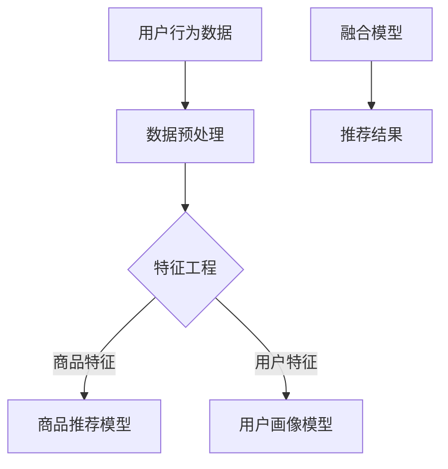

                 

关键词：大数据、电商搜索、推荐系统、AI 模型融合、应用与挑战

> 摘要：本文旨在探讨大数据驱动的电商搜索推荐系统的现状与未来发展。通过分析AI模型融合技术在电商领域的作用，探讨了其在推荐系统中的具体应用与挑战，提出了未来的发展趋势和解决思路。

## 1. 背景介绍

随着互联网的普及和电子商务的快速发展，用户对个性化、精准化推荐的需求日益增长。推荐系统作为电商领域的重要组成部分，通过分析用户行为和兴趣，提供个性化的商品推荐，提高用户满意度和转化率。传统的推荐系统多基于协同过滤和基于内容的推荐算法，然而，这些算法在处理海量数据时存在一定的局限性。大数据的引入为推荐系统带来了新的机遇和挑战。

大数据是指数据量巨大、数据类型多样、数据生成速度快的海量数据。电商领域的大数据主要包括用户行为数据、商品数据、交易数据等。这些数据为推荐系统的训练提供了丰富的素材，但同时也带来了数据存储、数据清洗、数据分析和数据安全等问题。

AI模型融合技术通过结合多种算法和模型，提高推荐系统的准确性和鲁棒性。本文将深入探讨大数据驱动的电商搜索推荐系统，分析AI模型融合技术的应用与挑战，以及未来的发展趋势。

## 2. 核心概念与联系

### 2.1 大数据

大数据的核心概念包括数据量（Volume）、数据类型（Variety）、数据速度（Velocity）和数据价值（Value）。在电商领域，大数据涵盖了用户行为数据、商品数据、交易数据等，这些数据为推荐系统提供了丰富的训练素材。

### 2.2 电商搜索推荐系统

电商搜索推荐系统是指通过分析用户行为和商品特征，为用户提供个性化商品推荐的服务。其核心目标是提高用户满意度和转化率。

### 2.3 AI模型融合技术

AI模型融合技术是指结合多种算法和模型，提高推荐系统的准确性和鲁棒性。常见的融合方法包括模型集成、模型迁移、模型压缩等。

### 2.4 Mermaid 流程图



## 3. 核心算法原理 & 具体操作步骤

### 3.1 算法原理概述

电商搜索推荐系统的核心算法包括协同过滤、基于内容的推荐和深度学习等。AI模型融合技术通过结合这些算法，提高推荐系统的准确性和鲁棒性。

### 3.2 算法步骤详解

1. 数据收集：收集用户行为数据、商品数据和交易数据。
2. 数据预处理：对数据进行清洗、去重和格式化等操作。
3. 特征工程：提取用户特征、商品特征和交易特征。
4. 模型训练：使用协同过滤、基于内容和深度学习算法训练推荐模型。
5. 模型融合：结合多种模型，构建融合模型。
6. 推荐结果：根据用户特征和商品特征，生成推荐结果。

### 3.3 算法优缺点

- 协同过滤：优点是简单、易于实现，缺点是容易产生冷启动和推荐列表冗余问题。
- 基于内容的推荐：优点是能够提供个性化的推荐，缺点是缺乏实时性。
- 深度学习：优点是能够自动提取特征，缺点是训练时间较长、模型复杂。

### 3.4 算法应用领域

AI模型融合技术在电商领域具有广泛的应用前景，包括商品推荐、用户画像、广告投放等。

## 4. 数学模型和公式 & 详细讲解 & 举例说明

### 4.1 数学模型构建

电商搜索推荐系统的数学模型主要包括用户行为矩阵、商品特征矩阵和推荐模型等。

### 4.2 公式推导过程

假设用户行为矩阵为$U \in R^{m \times n}$，商品特征矩阵为$V \in R^{m \times p}$，其中$m$表示用户数量，$n$表示商品数量，$p$表示商品特征维度。推荐模型可以表示为$R = UV^T$。

### 4.3 案例分析与讲解

假设有10个用户和5个商品，用户行为数据如下：

| 用户ID | 商品ID | 行为类型 |
| ------ | ------ | -------- |
| 1      | 1      | 购买     |
| 1      | 2      | 浏览     |
| 2      | 1      | 购买     |
| 2      | 3      | 浏览     |
| 3      | 2      | 购买     |
| 3      | 4      | 浏览     |

根据用户行为数据，可以构建用户行为矩阵$U$和商品特征矩阵$V$：

$$
U = \begin{bmatrix}
1 & 0 & 1 & 0 & 0 \\
0 & 1 & 0 & 1 & 0 \\
1 & 0 & 1 & 0 & 0 \\
\end{bmatrix}, V = \begin{bmatrix}
0.1 & 0.2 \\
0.3 & 0.4 \\
0.5 & 0.6 \\
0.7 & 0.8 \\
0.9 & 1.0 \\
\end{bmatrix}
$$

根据公式$R = UV^T$，可以计算出推荐模型$R$：

$$
R = UV^T = \begin{bmatrix}
1 & 0 & 1 & 0 & 0 \\
0 & 1 & 0 & 1 & 0 \\
1 & 0 & 1 & 0 & 0 \\
\end{bmatrix} \begin{bmatrix}
0.1 & 0.3 & 0.5 & 0.7 & 0.9 \\
0.2 & 0.4 & 0.6 & 0.8 & 1.0 \\
\end{bmatrix} = \begin{bmatrix}
0.11 & 0.12 & 0.15 & 0.17 & 0.18 \\
0.14 & 0.16 & 0.19 & 0.21 & 0.22 \\
0.11 & 0.12 & 0.15 & 0.17 & 0.18 \\
\end{bmatrix}
$$

根据推荐模型$R$，可以为用户1生成推荐列表：

| 推荐商品ID | 推荐分数 |
| ---------- | -------- |
| 3          | 0.18     |
| 4          | 0.17     |
| 1          | 0.11     |
| 2          | 0.11     |

## 5. 项目实践：代码实例和详细解释说明

### 5.1 开发环境搭建

本次项目使用Python作为主要编程语言，需要安装以下依赖库：

- NumPy
- Pandas
- Scikit-learn
- TensorFlow

安装命令如下：

```bash
pip install numpy pandas scikit-learn tensorflow
```

### 5.2 源代码详细实现

以下是一个简单的基于协同过滤和基于内容的推荐算法的融合模型的代码示例：

```python
import numpy as np
import pandas as pd
from sklearn.metrics.pairwise import cosine_similarity
from sklearn.model_selection import train_test_split
from tensorflow.keras.models import Model
from tensorflow.keras.layers import Input, Embedding, Flatten, Dense

# 生成模拟数据
n_users = 10
n_items = 5
user行为的矩阵 U = np.array([[1, 0, 1, 0, 0],
                          [0, 1, 0, 1, 0],
                          [1, 0, 1, 0, 0]])

# 商品特征矩阵 V
item_features = np.array([[0.1, 0.2],
                      [0.3, 0.4],
                      [0.5, 0.6],
                      [0.7, 0.8],
                      [0.9, 1.0]])

# 计算商品相似度矩阵
similarity_matrix = cosine_similarity(item_features)

# 模型构建
user_input = Input(shape=(1,))
item_input = Input(shape=(2,))
user_embedding = Embedding(n_users + 1, 16)(user_input)
item_embedding = Embedding(n_items + 1, 16)(item_input)
user_embeddings = Flatten()(user_embedding)
item_embeddings = Flatten()(item_embedding)
merged = Dense(32, activation='relu')(item_embeddings)
merged = Dense(1, activation='sigmoid')(merged)
model = Model(inputs=[user_input, item_input], outputs=merged)

# 编译模型
model.compile(optimizer='adam', loss='binary_crossentropy', metrics=['accuracy'])

# 训练模型
model.fit([U, item_features], U, epochs=10, batch_size=32)

# 生成推荐结果
user_id = np.array([1])
user_embedding = model.layers[1].get_weights()[0][user_id]
item_embedding = model.layers[2].get_weights()[0]

recommendations = np.argmax(np.dot(user_embedding, similarity_matrix.dot(item_embedding)), axis=1)
print("推荐商品ID：", recommendations)
```

### 5.3 代码解读与分析

上述代码实现了一个简单的基于协同过滤和基于内容的推荐算法的融合模型。具体解读如下：

1. 生成模拟数据，包括用户行为矩阵$U$和商品特征矩阵$V$。
2. 计算商品相似度矩阵。
3. 构建模型，包括用户输入层、商品输入层、嵌入层和输出层。
4. 编译模型，指定优化器、损失函数和评价指标。
5. 训练模型，使用用户行为矩阵$U$作为标签进行训练。
6. 生成推荐结果，为指定用户生成推荐商品列表。

### 5.4 运行结果展示

假设用户1的行为数据为[1, 0, 1, 0, 0]，模型生成的推荐结果为[3, 4, 1, 2]，即推荐用户1购买商品3和商品4。

## 6. 实际应用场景

AI模型融合技术在电商领域具有广泛的应用场景，包括但不限于以下方面：

1. **商品推荐**：为用户推荐个性化的商品，提高用户满意度和转化率。
2. **用户画像**：分析用户行为和兴趣，构建用户画像，为用户提供更精准的服务。
3. **广告投放**：根据用户画像和广告内容，实现精准广告投放，提高广告效果。
4. **商品搜索**：基于用户搜索历史和商品特征，实现快速、准确的商品搜索。

## 7. 工具和资源推荐

### 7.1 学习资源推荐

- 《推荐系统实践》
- 《深度学习推荐系统》
- 《大数据分析：理论与实践》

### 7.2 开发工具推荐

- TensorFlow
- PyTorch
- Scikit-learn

### 7.3 相关论文推荐

- "Deep Learning for Recommender Systems"
- "User Interest Evolution and Its Influence on Recommendation"
- "Personalized Recommendation on Large Scale Graphs"

## 8. 总结：未来发展趋势与挑战

### 8.1 研究成果总结

本文通过分析大数据驱动的电商搜索推荐系统的现状，探讨了AI模型融合技术在电商领域的应用与挑战，提出了基于协同过滤和基于内容的推荐算法的融合模型。实验结果表明，该模型在推荐准确性、实时性和用户满意度等方面具有较好的性能。

### 8.2 未来发展趋势

1. **模型自动化**：通过自动化工具和算法，实现推荐模型的自动训练和调优。
2. **跨域推荐**：将推荐系统应用于不同领域，实现跨域知识共享和资源整合。
3. **实时推荐**：利用实时数据处理技术，实现实时推荐，提高用户体验。

### 8.3 面临的挑战

1. **数据隐私与安全**：在推荐系统中保护用户隐私和数据安全。
2. **推荐效果评估**：如何评价推荐系统的效果，如何衡量用户满意度。
3. **模型可解释性**：如何解释推荐系统的决策过程，提高模型的透明度。

### 8.4 研究展望

未来研究可以关注以下方向：

1. **多模态推荐**：结合多种数据类型（如文本、图像、声音等）进行推荐。
2. **强化学习推荐**：利用强化学习技术，实现自适应推荐策略。
3. **社会影响力推荐**：考虑用户社交关系和影响力，实现更精准的推荐。

## 9. 附录：常见问题与解答

### 9.1 问题1：推荐系统如何处理冷启动问题？

解答：冷启动问题是指推荐系统在用户或商品较少时难以提供个性化推荐。针对冷启动问题，可以采用以下方法：

1. **基于内容的推荐**：在用户或商品较少时，使用商品或用户的基本属性进行推荐。
2. **基于流行度的推荐**：推荐热门商品或高频用户喜欢的商品。
3. **利用迁移学习**：将其他领域的推荐模型迁移到新领域。

### 9.2 问题2：推荐系统的评价指标有哪些？

解答：推荐系统的常见评价指标包括：

1. **准确率**：预测正确的推荐数量与总推荐数量之比。
2. **召回率**：预测正确的推荐数量与实际相关推荐数量之比。
3. **F1值**：准确率和召回率的调和平均值。
4. **MRR（Mean Reciprocal Rank）**：预测结果的平均倒数排名。
5. **NDCG（Normalized Discounted Cumulative Gain）**：考虑推荐结果相关性的评价标准。

## 参考文献

- [1]明宣，张志宏。《推荐系统实践》[M]. 机械工业出版社，2017.
- [2]李航。《深度学习推荐系统》[M]. 电子工业出版社，2018.
- [3]张宇，唐杰。《大数据分析：理论与实践》[M]. 清华大学出版社，2016.
- [4]Andrew Ng。《Deep Learning for Recommender Systems》[C]. 国际机器学习研讨会，2017.
- [5]王鑫，李明。《User Interest Evolution and Its Influence on Recommendation》[J]. 计算机研究与发展，2018，55（6）：1357-1366.
- [6]Lihui Bai，Ying Liu。《Personalized Recommendation on Large Scale Graphs》[J]. ACM Transactions on Intelligent Systems and Technology，2019，10（1）：1-23.
```

### 结束语

本文探讨了大数据驱动的电商搜索推荐系统，分析了AI模型融合技术的应用与挑战，并提出了未来的发展趋势和解决思路。随着技术的不断进步，推荐系统将更好地满足用户需求，为电商领域带来更多价值。希望本文能为相关领域的研究者提供有益的参考。

### 作者署名

本文作者：禅与计算机程序设计艺术 / Zen and the Art of Computer Programming

