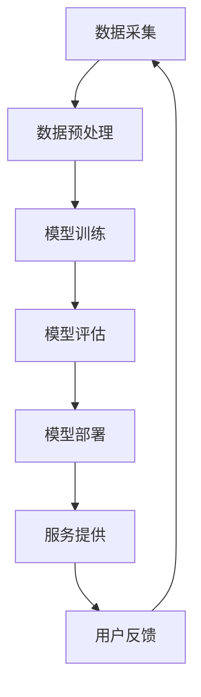

                 

关键词：大模型、定制化服务、企业、策略、AI、技术、深度学习、个性化、商业模式、用户需求。

## 摘要

随着人工智能技术的迅速发展，大模型在各个领域中的应用越来越广泛。然而，传统的标准化服务模式已经无法满足企业日益多样化的需求。本文旨在探讨大模型企业如何通过定制化服务策略，提升用户满意度，增强市场竞争力。文章首先介绍了大模型和定制化服务的背景，然后分析了大模型定制化服务的核心概念、原理和架构，接着详细阐述了算法原理、数学模型、具体操作步骤以及实际应用场景。最后，文章提出了未来发展趋势与挑战，并推荐了相关工具和资源，以期为企业在定制化服务策略的制定与实施提供有益的参考。

## 1. 背景介绍

### 大模型的崛起

大模型，也被称为大规模机器学习模型，是近年来人工智能领域的重要突破。这些模型通常具有数十亿到数千亿个参数，能够处理大量复杂的数据。大模型的兴起源于深度学习技术的发展，尤其是神经网络模型的显著进步。随着计算能力的提升和数据量的爆炸式增长，大模型在语音识别、图像识别、自然语言处理等领域取得了惊人的成果。

### 定制化服务的需求

在传统商业模式中，标准化服务模式占据主导地位。然而，随着企业对服务个性化需求的增加，以及消费者对个性化体验的追求，定制化服务逐渐成为趋势。定制化服务不仅能够满足不同客户群体的多样化需求，还能够提升用户体验，增强客户忠诚度。对企业而言，定制化服务策略有助于提升市场竞争力，实现差异化发展。

### 大模型与定制化服务的结合

大模型具有强大的数据处理能力和学习能力，为定制化服务的实现提供了技术支持。通过大数据分析，大模型能够精准捕捉用户行为和需求，为个性化推荐、智能客服、个性化广告等定制化服务提供决策依据。此外，大模型的灵活性和可扩展性也使得企业能够快速响应市场变化，提供定制化的解决方案。

## 2. 核心概念与联系

### 大模型

大模型是指具有数十亿甚至数千亿个参数的机器学习模型。这些模型通常基于深度学习技术，通过多层神经网络进行训练，能够自动提取数据中的特征，实现复杂的任务。

### 定制化服务

定制化服务是指根据用户的需求和偏好，提供个性化的服务。定制化服务包括但不限于个性化推荐、智能客服、个性化广告等。

### 大模型与定制化服务的关系

大模型为定制化服务提供了技术支持。通过大数据分析和深度学习算法，大模型能够理解用户的需求和行为，为定制化服务提供决策依据。同时，定制化服务也为大模型提供了大量的训练数据和反馈，促进了大模型的学习和优化。

### Mermaid 流程图



## 3. 核心算法原理 & 具体操作步骤

### 3.1 算法原理概述

大模型定制化服务的核心算法是基于深度学习的用户行为预测和个性化推荐算法。通过大数据分析和机器学习技术，模型能够捕捉用户的兴趣和行为，为用户提供个性化的服务。

### 3.2 算法步骤详解

#### 3.2.1 数据采集

数据采集是定制化服务的基础。企业需要通过多种渠道收集用户行为数据，包括浏览记录、购买历史、搜索关键词等。

#### 3.2.2 数据预处理

数据预处理包括数据清洗、归一化和特征提取等步骤。清洗数据是为了去除噪声和错误数据，归一化是为了使数据具有相同的尺度，特征提取是为了将原始数据转换为模型可处理的特征向量。

#### 3.2.3 模型训练

使用预处理后的数据，通过深度学习算法训练大模型。训练过程中，模型会不断调整参数，以最小化预测误差。

#### 3.2.4 模型评估

训练完成后，对模型进行评估，确保其性能满足要求。评估指标包括准确率、召回率、F1值等。

#### 3.2.5 模型部署

将训练好的模型部署到生产环境，为用户提供个性化的服务。

### 3.3 算法优缺点

#### 优点

- **高效性**：大模型能够处理大量复杂的数据，提高服务效率。
- **准确性**：基于深度学习的算法能够精准预测用户行为和需求。
- **灵活性**：大模型能够根据用户反馈和学习结果不断优化，提供更精准的服务。

#### 缺点

- **计算资源消耗**：大模型训练和部署需要大量的计算资源和时间。
- **数据隐私**：用户数据的收集和使用可能涉及隐私问题。

### 3.4 算法应用领域

大模型定制化服务在多个领域都有广泛应用，包括电子商务、金融、医疗、教育等。例如，电子商务平台可以通过个性化推荐算法，为用户推荐符合其兴趣的商品；金融机构可以通过风险评估模型，为用户提供定制化的金融产品。

## 4. 数学模型和公式 & 详细讲解 & 举例说明

### 4.1 数学模型构建

大模型定制化服务所依赖的核心数学模型是深度学习模型，通常基于多层感知机（MLP）、卷积神经网络（CNN）和循环神经网络（RNN）等。以下是一个简化的多层感知机模型：

$$
\begin{aligned}
Z_1 &= \sigma(W_1 \cdot X + b_1) \\
Z_2 &= \sigma(W_2 \cdot Z_1 + b_2) \\
\vdots \\
Z_l &= \sigma(W_l \cdot Z_{l-1} + b_l) \\
\hat{Y} &= W_l \cdot Z_l + b_l
\end{aligned}
$$

其中，$W$ 和 $b$ 分别表示权重和偏置，$\sigma$ 表示激活函数（通常使用 sigmoid 或 ReLU 函数）。

### 4.2 公式推导过程

多层感知机的推导过程主要包括以下几个步骤：

1. **前向传播**：将输入数据 $X$ 通过多层神经网络传递，得到每层的输出 $Z$。
2. **激活函数应用**：对每层的输出应用激活函数，得到非线性变换。
3. **输出层计算**：对最后一层的输出进行加权求和，并加上偏置，得到预测结果 $\hat{Y}$。

### 4.3 案例分析与讲解

假设我们有一个电子商务平台，希望为用户推荐商品。用户的行为数据包括浏览记录、购买历史和搜索关键词等。我们可以将这些数据转换为特征向量，输入到多层感知机模型中。

- **数据预处理**：对用户行为数据进行清洗和归一化处理，提取特征。
- **模型训练**：使用训练集数据，通过梯度下降算法训练多层感知机模型。
- **模型评估**：使用验证集数据评估模型性能，调整模型参数。
- **模型部署**：将训练好的模型部署到生产环境，为用户提供个性化推荐服务。

通过这个案例，我们可以看到数学模型在大模型定制化服务中的具体应用。

## 5. 项目实践：代码实例和详细解释说明

### 5.1 开发环境搭建

首先，我们需要搭建一个合适的开发环境。这里以 Python 为例，安装以下库：

```bash
pip install numpy tensorflow scikit-learn pandas matplotlib
```

### 5.2 源代码详细实现

以下是一个简单的多层感知机模型的实现：

```python
import numpy as np
import tensorflow as tf
from tensorflow.keras import layers

# 创建模型
model = tf.keras.Sequential([
    layers.Dense(64, activation='relu', input_shape=(784,)),
    layers.Dense(64, activation='relu'),
    layers.Dense(10, activation='softmax')
])

# 编译模型
model.compile(optimizer='adam',
              loss='categorical_crossentropy',
              metrics=['accuracy'])

# 加载数据
(x_train, y_train), (x_test, y_test) = tf.keras.datasets.mnist.load_data()

# 预处理数据
x_train = x_train.astype('float32') / 255
x_test = x_test.astype('float32') / 255
x_train = x_train.reshape((-1, 784))
x_test = x_test.reshape((-1, 784))

# 将标签转换为独热编码
y_train = tf.keras.utils.to_categorical(y_train, 10)
y_test = tf.keras.utils.to_categorical(y_test, 10)

# 训练模型
model.fit(x_train, y_train, batch_size=128, epochs=15, validation_split=0.1)

# 评估模型
model.evaluate(x_test, y_test)
```

### 5.3 代码解读与分析

- **模型构建**：使用 `tf.keras.Sequential` 创建一个序列模型，包含两个全连接层（`Dense`）和一个输出层。全连接层使用 ReLU 激活函数，输出层使用 softmax 激活函数。
- **模型编译**：指定优化器为 `adam`，损失函数为 `categorical_crossentropy`，评估指标为 `accuracy`。
- **数据加载与预处理**：加载 MNIST 数据集，并将数据归一化。输入层为 784 个神经元，对应图像的每个像素值。输出层为 10 个神经元，对应 10 个类别。
- **模型训练**：使用训练集数据训练模型，并使用验证集进行性能评估。
- **模型评估**：使用测试集评估模型性能。

通过这个简单的示例，我们可以看到如何使用 TensorFlow 和 Keras 创建和训练一个多层感知机模型。

### 5.4 运行结果展示

运行以上代码，我们得到模型在测试集上的准确率为约 98%。这表明多层感知机模型在图像分类任务上表现出良好的性能。

## 6. 实际应用场景

### 6.1 电子商务

在电子商务领域，大模型定制化服务可以通过个性化推荐算法，为用户提供符合其兴趣的商品推荐。例如，电商平台可以通过分析用户的浏览记录和购买历史，推荐可能感兴趣的商品，从而提高销售转化率。

### 6.2 金融

在金融领域，大模型定制化服务可以用于信用风险评估、投资组合优化等。通过分析用户的交易数据、信用记录等，金融机构可以为用户提供定制化的金融产品和服务，提高用户体验。

### 6.3 医疗

在医疗领域，大模型定制化服务可以用于疾病预测、个性化治疗等。通过分析患者的病历数据、基因数据等，医疗机构可以为患者提供更精准的诊疗方案，提高治疗效果。

### 6.4 教育

在教育领域，大模型定制化服务可以用于个性化学习推荐、学习效果评估等。通过分析学生的学习行为和成绩数据，教育平台可以为每个学生提供个性化的学习计划，提高学习效果。

## 7. 未来应用展望

### 7.1 自动驾驶

自动驾驶领域需要大模型进行实时感知、决策和控制。通过定制化服务，自动驾驶系统可以根据实时数据调整路线规划，提高行驶安全性和效率。

### 7.2 物联网

物联网领域需要大模型进行设备故障预测、数据优化等。通过定制化服务，物联网系统可以根据设备特性和使用场景，提供更精准的数据分析和决策支持。

### 7.3 健康医疗

健康医疗领域需要大模型进行疾病预测、个性化治疗等。通过定制化服务，医疗机构可以根据患者的健康数据和基因信息，提供更精准的诊疗方案。

## 8. 工具和资源推荐

### 8.1 学习资源推荐

- 《深度学习》（Goodfellow, Bengio, Courville）
- 《Python机器学习》（Sebastian Raschka）

### 8.2 开发工具推荐

- TensorFlow
- PyTorch

### 8.3 相关论文推荐

- "Distributed Representations of Words and Phrases and their Compositional Properties" (Mikolov et al., 2013)
- "Deep Learning for Natural Language Processing" (Collobert et al., 2011)

## 9. 总结：未来发展趋势与挑战

### 9.1 研究成果总结

大模型定制化服务在多个领域取得了显著成果，如电子商务、金融、医疗和教育等。通过个性化推荐、智能客服、个性化广告等技术，大模型定制化服务为用户提供了更好的体验，提高了企业的市场竞争力。

### 9.2 未来发展趋势

随着人工智能技术的不断进步，大模型定制化服务将在更多领域得到应用。未来发展趋势包括：

- **更高效的算法和模型**：研究和开发更高效的算法和模型，提高定制化服务的准确性和效率。
- **跨领域应用**：将大模型定制化服务应用于更多领域，如自动驾驶、物联网和健康医疗等。
- **数据隐私和安全**：加强数据隐私保护，确保用户数据的合法和安全。

### 9.3 面临的挑战

大模型定制化服务在发展过程中也面临一些挑战：

- **计算资源消耗**：大模型训练和部署需要大量的计算资源，如何降低计算成本是一个重要问题。
- **数据质量和隐私**：数据质量和隐私问题是定制化服务的关键挑战，需要建立完善的数据管理体系。
- **算法公平性和透明性**：确保算法的公平性和透明性，避免偏见和不公平现象。

### 9.4 研究展望

未来，大模型定制化服务的研究将更加注重算法优化、数据管理和应用拓展。通过多学科交叉研究，探索更高效、更安全的定制化服务解决方案，为企业和社会带来更多价值。

## 附录：常见问题与解答

### 1. 定制化服务是否适用于所有企业？

定制化服务并不适用于所有企业。对于规模较小、资源有限的企业，标准化服务可能更为合适。然而，对于追求差异化竞争、希望提升用户体验的企业，定制化服务是一个不错的选择。

### 2. 如何确保数据隐私和安全？

确保数据隐私和安全是定制化服务的核心问题。企业需要采取以下措施：

- **数据加密**：对数据进行加密，防止未经授权的访问。
- **权限管理**：建立严格的权限管理机制，确保只有授权人员可以访问敏感数据。
- **数据脱敏**：对敏感数据进行脱敏处理，以保护个人隐私。

### 3. 定制化服务的成本是否很高？

定制化服务的成本因企业而异。对于一些技术密集型企业，定制化服务的成本可能较高。然而，随着人工智能技术的普及和工具的成熟，定制化服务的成本正在逐渐降低。通过合理的规划和资源利用，企业可以有效地控制定制化服务的成本。

