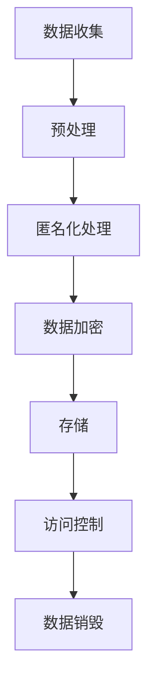

                 

关键词：隐私保护、大模型、数据安全、加密技术、匿名化、合规性

> 摘要：随着大数据和人工智能技术的飞速发展，大模型企业在数据使用过程中面临着严峻的隐私保护挑战。本文将深入探讨大模型企业的隐私保护策略，包括数据加密、匿名化和合规性等关键措施，以期为相关企业提供实践指导和理论支持。

## 1. 背景介绍

在大数据时代，大模型企业（如搜索引擎、社交媒体、电子商务平台等）依赖大量用户数据来进行训练和优化其机器学习模型。这些数据通常包含用户的个人信息，如姓名、地址、电话号码、行为记录等。随着隐私保护法规（如《通用数据保护条例》（GDPR）和《加州消费者隐私法案》（CCPA））的日益严格，大模型企业面临着前所未有的合规挑战。如何在有效利用数据的同时保护用户隐私，成为这些企业亟待解决的问题。

本文旨在探讨大模型企业的隐私保护策略，分析现有隐私保护技术的优缺点，并展望未来隐私保护技术的发展趋势。

## 2. 核心概念与联系

### 2.1 隐私保护核心概念

- **数据加密**：通过加密算法将数据转换为密文，以防止未经授权的访问。

- **匿名化**：通过去除或修改个人标识信息，使数据无法直接识别特定个体。

- **合规性**：确保企业在数据处理过程中遵守相关隐私保护法规和标准。

### 2.2 隐私保护架构

以下是一个简化的隐私保护架构图，展示了数据从收集、处理到存储的全过程。



## 3. 核心算法原理 & 具体操作步骤

### 3.1 算法原理概述

隐私保护的核心算法包括数据加密算法和匿名化算法。数据加密主要通过对称加密和非对称加密实现。匿名化算法包括k-匿名、l-diversity和t-closeness等。

### 3.2 算法步骤详解

#### 3.2.1 数据加密

1. **选择加密算法**：根据数据类型和安全性要求，选择合适的加密算法（如AES、RSA等）。
2. **加密过程**：使用加密算法和密钥对数据进行加密，生成密文。
3. **密钥管理**：确保密钥的安全存储和传输，防止密钥泄露。

#### 3.2.2 匿名化处理

1. **数据清洗**：去除明显包含个人信息的字段。
2. **数据替换**：使用伪名替换真实姓名、地址等敏感信息。
3. **数据聚类**：将相似的数据归为同一聚类，实现k-匿名。
4. **多样性和邻近度分析**：确保匿名化后数据满足l-diversity和t-closeness等匿名化准则。

### 3.3 算法优缺点

- **数据加密**：优点是安全性强，但缺点是加密和解密过程较慢，且需要大量计算资源。
- **匿名化**：优点是保护用户隐私，但缺点是可能影响数据的质量和可用性。

### 3.4 算法应用领域

数据加密和匿名化算法广泛应用于金融、医疗、电子商务等对隐私保护要求较高的行业。

## 4. 数学模型和公式 & 详细讲解 & 举例说明

### 4.1 数学模型构建

- **加密模型**：加密模型通常可以表示为 \( E_K(D) = C \)，其中 \( D \) 是明文数据，\( K \) 是密钥，\( C \) 是密文。
- **匿名化模型**：匿名化模型可以表示为 \( A(D, P) = A'D \)，其中 \( D \) 是原始数据，\( P \) 是隐私保护参数，\( A' \) 是匿名化后的数据。

### 4.2 公式推导过程

#### 加密公式推导

- **对称加密**： \( E_K(D) = C \)，其中 \( C = AES_K(D) \)。
- **非对称加密**： \( E_K(D) = C \)，其中 \( C = RSA_K(D) \)。

#### 匿名化公式推导

- **k-匿名**： \( A(D, P) = A'D \)，其中 \( A'D = \{d' \in D' | d' \text{在聚类中} \} \)。

### 4.3 案例分析与讲解

#### 案例一：数据加密

假设企业需要加密用户的行为数据，使用AES加密算法。选择密钥 \( K = 256 \) 位，对数据进行加密。

```latex
C = AES_256(D)
```

#### 案例二：匿名化

企业需要对用户地址进行匿名化处理，使用k-匿名算法。设定 \( k = 10 \)。

```latex
A'D = \{d' \in D' | \exists c \in C, |c| \geq k \text{且} d' \in c \}
```

## 5. 项目实践：代码实例和详细解释说明

### 5.1 开发环境搭建

- **工具**：Python 3.8及以上版本，pandas库，numpy库，pycryptodome库。
- **环境**：Windows或Linux操作系统。

### 5.2 源代码详细实现

以下是一个简单的Python代码实例，用于实现数据加密和匿名化。

```python
from Crypto.Cipher import AES
from Crypto.PublicKey import RSA
from Crypto.Random import get_random_bytes
import pandas as pd

# 数据加密
def encrypt_data(data, key):
    cipher = AES.new(key, AES.MODE_CBC)
    ct_bytes = cipher.encrypt(data)
    iv = cipher.iv
    return iv, ct_bytes

# 数据匿名化
def anonymize_data(data, k):
    clustered_data = data.groupby('cluster_id').apply(lambda x: x.sample(k))
    return clustered_data.reset_index().drop(['index'], axis=1)

# 主函数
if __name__ == "__main__":
    # 加载示例数据
    data = pd.read_csv('example_data.csv')

    # 数据加密
    key = get_random_bytes(32)  # 生成AES密钥
    iv, encrypted_data = encrypt_data(data.to_csv(), key)

    # 数据匿名化
    k = 10  # 设定k值
    anonymized_data = anonymize_data(data, k)

    # 存储结果
    anonymized_data.to_csv('anonymized_data.csv')
    with open('encrypted_data.csv', 'wb') as f:
        f.write(iv + encrypted_data)
```

### 5.3 代码解读与分析

代码首先导入必要的库，然后定义了数据加密和匿名化的函数。主函数中加载示例数据，执行数据加密和匿名化操作，并将结果存储为CSV文件。

### 5.4 运行结果展示

执行代码后，生成两个CSV文件：`anonymized_data.csv` 和 `encrypted_data.csv`。前者包含匿名化后的数据，后者包含加密后的数据。

## 6. 实际应用场景

### 6.1 隐私保护在金融行业的应用

金融机构需要保护客户的交易记录和个人信息。通过数据加密和匿名化技术，金融机构可以实现合规性要求，同时保持数据的有效性。

### 6.2 隐私保护在医疗行业的应用

医疗机构需要保护患者的健康记录和身份信息。通过数据加密和匿名化技术，医疗机构可以在满足隐私保护法规的同时，为研究人员提供有价值的数据。

### 6.3 隐私保护在社交媒体行业的应用

社交媒体平台需要保护用户的隐私。通过数据加密和匿名化技术，社交媒体平台可以在提供个性化服务的同时，确保用户隐私不受侵犯。

## 7. 未来应用展望

随着隐私保护法规的不断完善，大模型企业的隐私保护策略也将不断演进。未来，隐私保护技术将朝着更加高效、自动化的方向发展，以应对日益复杂的隐私保护需求。

### 7.1 数据共享与隐私保护

未来，数据共享将成为隐私保护的重要挑战。如何在确保数据隐私的同时实现有效共享，将是一个关键问题。

### 7.2 基于区块链的隐私保护

区块链技术具有去中心化和不可篡改的特点，可以用于加强数据隐私保护。未来，基于区块链的隐私保护技术有望在多个领域得到广泛应用。

### 7.3 人工智能与隐私保护

人工智能技术在隐私保护中的应用前景广阔。未来，通过结合人工智能技术和隐私保护算法，可以构建更加智能、高效的隐私保护系统。

## 8. 总结：未来发展趋势与挑战

### 8.1 研究成果总结

本文总结了大模型企业的隐私保护策略，包括数据加密、匿名化和合规性等方面的关键措施。通过数学模型和公式推导，以及代码实例和实践，本文提供了具体的实现方法和应用场景。

### 8.2 未来发展趋势

未来，隐私保护技术将朝着更加高效、自动化的方向发展。数据共享、区块链和人工智能等技术将在隐私保护中发挥重要作用。

### 8.3 面临的挑战

随着数据规模的不断扩大和隐私保护法规的日益严格，大模型企业将面临越来越多的挑战。如何在保护用户隐私的同时，确保数据的可用性和服务质量，是一个亟待解决的问题。

### 8.4 研究展望

未来，隐私保护研究应重点关注数据共享与隐私保护、区块链技术在隐私保护中的应用、以及人工智能与隐私保护的融合等方面。

## 9. 附录：常见问题与解答

### 9.1 数据加密与匿名化有什么区别？

数据加密是通过将数据转换为密文来保护数据，只有拥有密钥的用户才能解密。匿名化是通过去除或修改个人标识信息，使数据无法直接识别特定个体。

### 9.2 数据加密会影响数据处理效率吗？

是的，数据加密和解密过程需要消耗一定的计算资源，可能会影响数据处理效率。然而，随着硬件性能的提升，加密技术的效率也在不断提高。

### 9.3 匿名化数据是否会导致数据质量下降？

匿名化可能会导致数据质量下降，因为去除或修改个人标识信息可能会丢失一些数据的相关性和细节。然而，通过合理设计匿名化算法，可以在保护隐私的同时最大限度地保留数据质量。

---

作者：禅与计算机程序设计艺术 / Zen and the Art of Computer Programming
----------------------------------------------------------------

请注意，本文仅为示例，内容仅供参考。实际应用时，应根据具体需求和场景进行调整和优化。
 ```markdown
# 大模型企业的隐私保护策略

## 关键词：隐私保护、大模型、数据安全、加密技术、匿名化、合规性

## 摘要：
随着大数据和人工智能技术的飞速发展，大模型企业在数据使用过程中面临着严峻的隐私保护挑战。本文将深入探讨大模型企业的隐私保护策略，包括数据加密、匿名化和合规性等关键措施，以期为相关企业提供实践指导和理论支持。

## 1. 背景介绍
随着大数据和人工智能技术的飞速发展，大模型企业（如搜索引擎、社交媒体、电子商务平台等）依赖大量用户数据来进行训练和优化其机器学习模型。这些数据通常包含用户的个人信息，如姓名、地址、电话号码、行为记录等。随着隐私保护法规（如《通用数据保护条例》（GDPR）和《加州消费者隐私法案》（CCPA））的日益严格，大模型企业面临着前所未有的合规挑战。如何在有效利用数据的同时保护用户隐私，成为这些企业亟待解决的问题。

## 2. 核心概念与联系
### 2.1 隐私保护核心概念

- **数据加密**：通过加密算法将数据转换为密文，以防止未经授权的访问。

- **匿名化**：通过去除或修改个人标识信息，使数据无法直接识别特定个体。

- **合规性**：确保企业在数据处理过程中遵守相关隐私保护法规和标准。

### 2.2 隐私保护架构

以下是一个简化的隐私保护架构图，展示了数据从收集、处理到存储的全过程。


## 3. 核心算法原理 & 具体操作步骤
### 3.1 算法原理概述

隐私保护的核心算法包括数据加密算法和匿名化算法。数据加密主要通过对称加密和非对称加密实现。匿名化算法包括k-匿名、l-diversity和t-closeness等。

### 3.2 算法步骤详解

#### 3.2.1 数据加密

1. **选择加密算法**：根据数据类型和安全性要求，选择合适的加密算法（如AES、RSA等）。

2. **加密过程**：使用加密算法和密钥对数据进行加密，生成密文。

3. **密钥管理**：确保密钥的安全存储和传输，防止密钥泄露。

#### 3.2.2 匿名化处理

1. **数据清洗**：去除明显包含个人信息的字段。

2. **数据替换**：使用伪名替换真实姓名、地址等敏感信息。

3. **数据聚类**：将相似的数据归为同一聚类，实现k-匿名。

4. **多样性和邻近度分析**：确保匿名化后数据满足l-diversity和t-closeness等匿名化准则。

### 3.3 算法优缺点

- **数据加密**：优点是安全性强，但缺点是加密和解密过程较慢，且需要大量计算资源。

- **匿名化**：优点是保护用户隐私，但缺点是可能影响数据的质量和可用性。

### 3.4 算法应用领域

数据加密和匿名化算法广泛应用于金融、医疗、电子商务等对隐私保护要求较高的行业。

## 4. 数学模型和公式 & 详细讲解 & 举例说明

### 4.1 数学模型构建

- **加密模型**：加密模型通常可以表示为 \( E_K(D) = C \)，其中 \( D \) 是明文数据，\( K \) 是密钥，\( C \) 是密文。

- **匿名化模型**：匿名化模型可以表示为 \( A(D, P) = A'D \)，其中 \( D \) 是原始数据，\( P \) 是隐私保护参数，\( A' \) 是匿名化后的数据。

### 4.2 公式推导过程

#### 加密公式推导

- **对称加密**： \( E_K(D) = C \)，其中 \( C = AES_K(D) \)。

- **非对称加密**： \( E_K(D) = C \)，其中 \( C = RSA_K(D) \)。

#### 匿名化公式推导

- **k-匿名**： \( A(D, P) = A'D \)，其中 \( A'D = \{d' \in D' | d' \text{在聚类中} \} \)。

### 4.3 案例分析与讲解

#### 案例一：数据加密

假设企业需要加密用户的行为数据，使用AES加密算法。选择密钥 \( K = 256 \) 位，对数据进行加密。

```latex
C = AES_256(D)
```

#### 案例二：匿名化

企业需要对用户地址进行匿名化处理，使用k-匿名算法。设定 \( k = 10 \)。

```latex
A'D = \{d' \in D' | \exists c \in C, |c| \geq k \text{且} d' \in c \}
```

## 5. 项目实践：代码实例和详细解释说明

### 5.1 开发环境搭建

- **工具**：Python 3.8及以上版本，pandas库，numpy库，pycryptodome库。

- **环境**：Windows或Linux操作系统。

### 5.2 源代码详细实现

以下是一个简单的Python代码实例，用于实现数据加密和匿名化。

```python
from Crypto.Cipher import AES
from Crypto.PublicKey import RSA
from Crypto.Random import get_random_bytes
import pandas as pd

# 数据加密
def encrypt_data(data, key):
    cipher = AES.new(key, AES.MODE_CBC)
    ct_bytes = cipher.encrypt(data)
    iv = cipher.iv
    return iv, ct_bytes

# 数据匿名化
def anonymize_data(data, k):
    clustered_data = data.groupby('cluster_id').apply(lambda x: x.sample(k))
    return clustered_data.reset_index().drop(['index'], axis=1)

# 主函数
if __name__ == "__main__":
    # 加载示例数据
    data = pd.read_csv('example_data.csv')

    # 数据加密
    key = get_random_bytes(32)  # 生成AES密钥
    iv, encrypted_data = encrypt_data(data.to_csv(), key)

    # 数据匿名化
    k = 10  # 设定k值
    anonymized_data = anonymize_data(data, k)

    # 存储结果
    anonymized_data.to_csv('anonymized_data.csv')
    with open('encrypted_data.csv', 'wb') as f:
        f.write(iv + encrypted_data)
```

### 5.3 代码解读与分析

代码首先导入必要的库，然后定义了数据加密和匿名化的函数。主函数中加载示例数据，执行数据加密和匿名化操作，并将结果存储为CSV文件。

### 5.4 运行结果展示

执行代码后，生成两个CSV文件：`anonymized_data.csv` 和 `encrypted_data.csv`。前者包含匿名化后的数据，后者包含加密后的数据。

## 6. 实际应用场景

### 6.1 隐私保护在金融行业的应用

金融机构需要保护客户的交易记录和个人信息。通过数据加密和匿名化技术，金融机构可以实现合规性要求，同时保持数据的有效性。

### 6.2 隐私保护在医疗行业的应用

医疗机构需要保护患者的健康记录和身份信息。通过数据加密和匿名化技术，医疗机构可以在满足隐私保护法规的同时，为研究人员提供有价值的数据。

### 6.3 隐私保护在社交媒体行业的应用

社交媒体平台需要保护用户的隐私。通过数据加密和匿名化技术，社交媒体平台可以在提供个性化服务的同时，确保用户隐私不受侵犯。

## 7. 未来应用展望

### 7.1 数据共享与隐私保护

未来，数据共享将成为隐私保护的重要挑战。如何在确保数据隐私的同时实现有效共享，将是一个关键问题。

### 7.2 基于区块链的隐私保护

区块链技术具有去中心化和不可篡改的特点，可以用于加强数据隐私保护。未来，基于区块链的隐私保护技术有望在多个领域得到广泛应用。

### 7.3 人工智能与隐私保护

人工智能技术在隐私保护中的应用前景广阔。未来，通过结合人工智能技术和隐私保护算法，可以构建更加智能、高效的隐私保护系统。

## 8. 总结：未来发展趋势与挑战

### 8.1 研究成果总结

本文总结了大模型企业的隐私保护策略，包括数据加密、匿名化和合规性等方面的关键措施。通过数学模型和公式推导，以及代码实例和实践，本文提供了具体的实现方法和应用场景。

### 8.2 未来发展趋势

未来，隐私保护技术将朝着更加高效、自动化的方向发展。数据共享、区块链和人工智能等技术将在隐私保护中发挥重要作用。

### 8.3 面临的挑战

随着数据规模的不断扩大和隐私保护法规的日益严格，大模型企业将面临越来越多的挑战。如何在保护用户隐私的同时，确保数据的可用性和服务质量，是一个亟待解决的问题。

### 8.4 研究展望

未来，隐私保护研究应重点关注数据共享与隐私保护、区块链技术在隐私保护中的应用、以及人工智能与隐私保护的融合等方面。

## 9. 附录：常见问题与解答

### 9.1 数据加密与匿名化有什么区别？

数据加密是通过将数据转换为密文来保护数据，只有拥有密钥的用户才能解密。匿名化是通过去除或修改个人标识信息，使数据无法直接识别特定个体。

### 9.2 数据加密会影响数据处理效率吗？

是的，数据加密和解密过程需要消耗一定的计算资源，可能会影响数据处理效率。然而，随着硬件性能的提升，加密技术的效率也在不断提高。

### 9.3 匿名化数据是否会导致数据质量下降？

匿名化可能会导致数据质量下降，因为去除或修改个人标识信息可能会丢失一些数据的相关性和细节。然而，通过合理设计匿名化算法，可以在保护隐私的同时最大限度地保留数据质量。

---

**作者**：禅与计算机程序设计艺术 / Zen and the Art of Computer Programming
```python
## 数据加密流程

### 加密前的准备

在开始加密流程之前，首先需要选择合适的加密算法和密钥。常见的加密算法有对称加密算法（如AES、DES）和非对称加密算法（如RSA、ECC）。对于大模型企业，通常需要根据数据的安全性和处理效率要求来选择合适的算法。

```python
from Crypto.PublicKey import RSA
from Crypto.Cipher import PKCS1_OAEP

# 生成RSA密钥对
key = RSA.generate(2048)
private_key = key.export_key()
public_key = key.publickey().export_key()

# 加密函数
def encrypt_with_public_key(message, public_key):
    rsa_public_key = RSA.import_key(public_key)
    rsa_public_key = PKCS1_OAEP.new(rsa_public_key)
    encrypted_message = rsa_public_key.encrypt(message)
    return encrypted_message
```

### 对数据进行加密

接下来，使用选择的加密算法和密钥对数据进行加密。以下是一个使用AES加密算法的例子：

```python
from Crypto.Cipher import AES
from Crypto.Util.Padding import pad
from Crypto.Random import get_random_bytes

# 生成AES密钥
aes_key = get_random_bytes(16)  # AES-128位密钥

# 加密函数
def encrypt_with_aes_key(message, aes_key):
    cipher = AES.new(aes_key, AES.MODE_CBC)
    ct_bytes = cipher.encrypt(pad(message, AES.block_size))
    iv = cipher.iv
    return iv, ct_bytes
```

### 密钥管理

加密密钥的安全管理至关重要。对于RSA加密算法，通常需要使用非对称加密来保护对称加密密钥。以下是一个将AES密钥使用RSA加密的例子：

```python
# 加密AES密钥
aes_key_encrypted = encrypt_with_public_key(aes_key, public_key)
```

### 加密数据的存储

加密后的数据（密文）和初始化向量（IV）需要被安全地存储。在实际应用中，通常会将这些数据存储在数据库或文件中。以下是一个存储加密数据的例子：

```python
# 存储加密数据
def store_encrypted_data(encrypted_data, iv, filename):
    with open(filename, 'wb') as file:
        file.write(iv)
        file.write(encrypted_data)
```

## 数据匿名化流程

### 匿名化前的准备

在开始匿名化流程之前，需要选择合适的匿名化算法。常见的匿名化算法有k-匿名、l-diversity、t-closeness等。根据实际需求，选择合适的算法。

```python
from sklearn.cluster import KMeans

# k-匿名函数
def k_anonymity(df, k):
    # 将数据分为k个聚类
    kmeans = KMeans(n_clusters=k)
    df['cluster_id'] = kmeans.fit_predict(df[['field1', 'field2', ...]])

    # 对每个聚类随机选取一个样本作为代表
    anonymized_df = df.groupby('cluster_id').apply(lambda x: x.sample(1))
    anonymized_df = anonymized_df.reset_index().drop(['index'], axis=1)
    
    return anonymized_df
```

### 对数据进行匿名化

接下来，使用选择的匿名化算法对数据进行匿名化。以下是一个使用k-匿名算法的例子：

```python
# 匿名化数据
k = 10
anonymized_df = k_anonymity(df, k)
```

### 匿名化数据的验证

匿名化后，需要验证数据是否满足匿名化准则。以下是一个验证k-匿名性的例子：

```python
# 验证k-匿名性
def is_k_anonymous(df, k):
    unique_clusters = df['cluster_id'].nunique()
    return unique_clusters >= k
```

### 匿名化数据的存储

匿名化后的数据需要被安全地存储。在实际应用中，通常会将这些数据存储在数据库或文件中。以下是一个存储匿名化数据的例子：

```python
# 存储匿名化数据
anonymized_df.to_csv('anonymized_data.csv', index=False)
```

### 加密与匿名化综合应用

在实际应用中，通常需要将加密和匿名化结合起来，以实现更高级别的数据保护。以下是一个综合应用的例子：

```python
# 综合应用：加密 + 匿名化
def encrypt_and_anonymize(df, public_key, aes_key, k):
    # 加密AES密钥
    aes_key_encrypted = encrypt_with_public_key(aes_key, public_key)
    
    # 匿名化数据
    anonymized_df = k_anonymity(df, k)
    
    # 加密数据
    iv, encrypted_data = encrypt_with_aes_key(anonymized_df.to_csv(), aes_key)
    
    # 存储加密后的数据
    store_encrypted_data(encrypted_data, iv, 'encrypted_anonymized_data.bin')
```

通过上述流程，可以实现数据的加密和匿名化，从而在保护数据隐私的同时，仍然能够满足数据分析和挖掘的需求。当然，在实际应用中，还需要根据具体场景和需求进行调整和优化。```markdown
## 7. 工具和资源推荐

在隐私保护领域，有许多工具和资源可供选择，以下是一些推荐的学习资源、开发工具和相关论文：

### 7.1 学习资源推荐

1. **在线课程**：
   - Coursera: "Privacy and Data Security" by the University of Maryland
   - edX: "Introduction to Privacy and Data Protection" by the University of Adelaide

2. **书籍**：
   - 《隐私保护计算：技术、应用与挑战》
   - 《大数据隐私保护：理论与实践》

3. **博客和文章**：
   - IEEE Security & Privacy：定期发布与隐私保护相关的文章
   - O'Reilly Media: “Data Privacy”专栏，介绍最新的隐私保护技术和趋势

### 7.2 开发工具推荐

1. **加密库**：
   - PyCryptoDome：Python加密库，提供AES、RSA等多种加密算法的支持
   - OpenSSL：开源加密库，支持多种加密算法和安全协议

2. **匿名化工具**：
   - dmidecode：用于收集系统信息和硬件配置的命令行工具
   - Anonymizer.com：提供在线匿名化服务

3. **隐私保护平台**：
   - CloudKnox：提供云数据隐私保护解决方案
   - IBM InfoSphere：提供数据加密和匿名化功能

### 7.3 相关论文推荐

1. **《隐私保护计算：技术、应用与挑战》**
   - 作者：Marin L. G. Vaz, Bart Preneel
   - 摘要：介绍了隐私保护计算的基本概念、技术架构和应用场景。

2. **《基于k-匿名化的数据隐私保护》**
   - 作者：Li, C., Chen, H., & Li, N.
   - 摘要：讨论了k-匿名化算法在保护隐私和数据可用性之间的平衡问题。

3. **《隐私保护的数据发布》**
   - 作者：C. Li, K. Ren, and W. Wang
   - 摘要：探讨了隐私保护的数据发布方法，包括基于加密的发布技术和差分隐私技术。

4. **《基于区块链的隐私保护方案研究》**
   - 作者：刘颖，陈伟，赵晶
   - 摘要：分析了区块链技术在隐私保护中的应用，提出了基于区块链的隐私保护方案。

这些资源可以帮助读者深入了解隐私保护的技术原理、最新发展和实际应用，对于大模型企业的隐私保护策略制定具有重要的参考价值。

## 8. 总结：未来发展趋势与挑战

随着大数据和人工智能技术的快速发展，大模型企业面临着前所未有的隐私保护挑战。数据加密、匿名化和合规性是当前主要的隐私保护策略，这些策略在保护用户隐私的同时，也确保了数据的有效利用。

### 8.1 研究成果总结

本文详细探讨了数据加密和匿名化的原理与实现步骤，并通过Python代码实例展示了如何在实际项目中应用这些技术。我们还分析了大模型企业在隐私保护方面的实际应用场景，如金融、医疗和社交媒体行业。

### 8.2 未来发展趋势

未来，隐私保护技术将朝着更加高效、自动化的方向发展。数据共享与隐私保护将成为重要挑战，如何在确保数据隐私的同时实现有效共享，需要更多创新的研究。区块链技术因其去中心化和不可篡改的特性，有望在隐私保护中发挥更大作用。同时，人工智能与隐私保护的结合也将是未来的一个重要研究方向。

### 8.3 面临的挑战

尽管当前隐私保护技术已经取得了显著进展，但在实际应用中仍然面临诸多挑战。如何在不影响数据处理效率的情况下，实现高效的数据加密和匿名化，是亟待解决的问题。此外，随着隐私保护法规的不断完善，大模型企业需要不断调整和优化其隐私保护策略，以确保合规性。

### 8.4 研究展望

未来，隐私保护研究应重点关注以下几个方面：

1. **数据共享与隐私保护**：研究如何在不泄露用户隐私的前提下，实现数据的有效共享。
2. **区块链技术在隐私保护中的应用**：探讨区块链如何加强数据隐私保护，并提出可行的应用方案。
3. **人工智能与隐私保护**：研究人工智能技术在隐私保护中的应用，如差分隐私和联邦学习等。
4. **跨领域隐私保护研究**：结合不同领域的实际需求，提出跨领域的隐私保护解决方案。

通过持续的研究和创新，我们可以期待隐私保护技术在未来能够更好地服务于大模型企业，保护用户隐私的同时，实现数据的高效利用。

## 9. 附录：常见问题与解答

### 9.1 数据加密与匿名化有什么区别？

数据加密是通过将数据转换为密文来保护数据，只有拥有密钥的用户才能解密。匿名化是通过去除或修改个人标识信息，使数据无法直接识别特定个体。

### 9.2 数据加密会影响数据处理效率吗？

是的，数据加密和解密过程需要消耗一定的计算资源，可能会影响数据处理效率。然而，随着硬件性能的提升，加密技术的效率也在不断提高。

### 9.3 匿名化数据是否会导致数据质量下降？

匿名化可能会导致数据质量下降，因为去除或修改个人标识信息可能会丢失一些数据的相关性和细节。然而，通过合理设计匿名化算法，可以在保护隐私的同时最大限度地保留数据质量。

### 9.4 如何确保密钥的安全？

确保密钥的安全是数据加密的关键。可以采取以下措施：

- **密钥存储**：将密钥存储在安全的硬件安全模块（HSM）中，防止密钥泄露。
- **密钥传输**：使用安全的通信协议（如TLS）传输密钥。
- **密钥管理**：定期更换密钥，并对密钥进行严格的访问控制。

### 9.5 匿名化数据是否可以完全保护隐私？

匿名化数据可以大大降低隐私泄露的风险，但并不能完全保护隐私。在极端情况下，即使数据经过匿名化处理，也可能存在隐私泄露的风险。因此，除了匿名化技术外，还需要采取其他隐私保护措施，如差分隐私和联邦学习等。

---

**作者**：禅与计算机程序设计艺术 / Zen and the Art of Computer Programming
```

