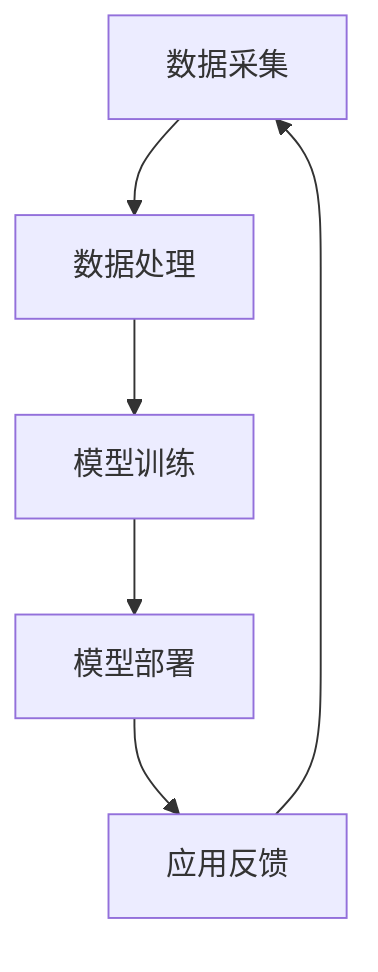

                 

关键词：大模型公司、中国市场、策略分析、竞争格局、技术创新

## 摘要

本文将深入探讨大模型公司在中国的市场策略。在全球范围内，大模型技术正迅速发展，成为人工智能领域的核心驱动力。在中国，随着政策扶持、技术创新和资本涌入的持续推动，大模型公司呈现出蓬勃发展的态势。本文将从市场背景、核心竞争优势、业务布局、合作与竞争态势、未来展望等方面，全面分析中国大模型公司的市场策略。

## 1. 背景介绍

### 中国人工智能发展现状

近年来，中国人工智能产业取得了显著进展，大模型技术尤为突出。根据《中国人工智能发展报告》，2019年中国人工智能核心产业规模达到3470亿元，同比增长31.4%。大模型技术作为人工智能的核心驱动力，正逐渐成为中国企业创新的重要方向。

### 政策环境

中国政府高度重视人工智能产业发展，陆续出台了一系列支持政策。例如，《新一代人工智能发展规划》明确提出，要加快建设人工智能产业体系，推动大模型技术突破和应用。政策环境的优化，为中国的技术进步和产业创新提供了有力支持。

### 市场需求

随着大数据、云计算、物联网等技术的普及，中国企业对大模型技术的需求日益增长。尤其是在金融、医疗、制造等领域，大模型技术的应用前景广阔，成为企业数字化转型的重要支撑。

## 2. 核心概念与联系

### 大模型技术原理

大模型技术是基于深度学习理论，通过大规模神经网络进行训练，实现对复杂数据的高效处理和预测。其核心概念包括神经网络的深度、参数规模、训练数据量等。

### 中国大模型技术架构

中国大模型技术架构主要包括以下环节：

1. **数据采集**：通过多种渠道获取海量数据，包括企业内部数据、公共数据集等。
2. **数据处理**：对原始数据进行清洗、预处理，提高数据质量和利用率。
3. **模型训练**：利用大规模计算资源，对神经网络模型进行训练，优化模型性能。
4. **模型部署**：将训练好的模型部署到实际应用场景，实现智能化功能。

### Mermaid 流程图



## 3. 核心算法原理 & 具体操作步骤

### 3.1 算法原理概述

大模型算法基于深度学习理论，通过多层神经网络进行特征提取和预测。核心原理包括：

1. **前向传播**：输入数据通过神经网络层，逐层传递直到输出层。
2. **反向传播**：根据输出误差，反向更新各层神经元的权重。
3. **优化算法**：利用优化算法（如梯度下降）调整模型参数，提高模型性能。

### 3.2 算法步骤详解

1. **数据预处理**：对原始数据进行清洗、归一化等处理，确保数据质量。
2. **模型构建**：定义神经网络结构，包括输入层、隐藏层和输出层。
3. **模型训练**：利用训练数据，通过反向传播算法优化模型参数。
4. **模型评估**：使用验证数据集评估模型性能，调整模型结构或参数。
5. **模型部署**：将训练好的模型部署到实际应用场景，进行预测和决策。

### 3.3 算法优缺点

**优点**：

1. **高精度**：通过大量数据训练，大模型能够实现高精度的预测和分类。
2. **泛化能力强**：大模型具有较强的泛化能力，能够应对多种应用场景。
3. **自适应性强**：大模型能够根据新数据不断优化自身性能。

**缺点**：

1. **计算资源需求大**：大模型训练需要大量计算资源和时间。
2. **数据依赖性强**：大模型对数据质量要求较高，数据缺失或噪声会影响模型性能。
3. **模型解释性较差**：大模型内部结构复杂，难以解释其决策过程。

### 3.4 算法应用领域

大模型技术广泛应用于金融、医疗、制造、安防等领域，如：

1. **金融风控**：利用大模型进行用户行为分析、信用评估等。
2. **医疗诊断**：通过大模型实现疾病诊断、药物研发等。
3. **智能制造**：利用大模型进行设备故障预测、生产优化等。
4. **智能安防**：通过大模型实现人脸识别、行为分析等。

## 4. 数学模型和公式 & 详细讲解 & 举例说明

### 4.1 数学模型构建

大模型数学模型主要包括以下几个部分：

1. **输入层**：接收外部输入数据。
2. **隐藏层**：进行特征提取和变换。
3. **输出层**：生成预测结果。

### 4.2 公式推导过程

假设我们有一个二分类问题，目标函数为：

$$
J(\theta) = -\frac{1}{m}\sum_{i=1}^{m}y^{(i)}\log(h_{\theta}(x^{(i)})) + (1 - y^{(i)})\log(1 - h_{\theta}(x^{(i)}))
$$

其中，$h_{\theta}(x) = \sigma(\theta^T x)$，$\sigma$为sigmoid函数，$\theta$为模型参数。

### 4.3 案例分析与讲解

假设我们有一个二分类问题，数据集包含100个样本，每个样本包含特征和标签。我们使用大模型进行分类预测。

1. **数据预处理**：对数据进行归一化处理，确保数据在[0, 1]范围内。
2. **模型构建**：定义神经网络结构，包括输入层、隐藏层和输出层。
3. **模型训练**：使用训练数据，通过反向传播算法优化模型参数。
4. **模型评估**：使用验证数据集评估模型性能，调整模型结构或参数。
5. **模型部署**：将训练好的模型部署到实际应用场景，进行预测和决策。

## 5. 项目实践：代码实例和详细解释说明

### 5.1 开发环境搭建

1. 安装Python 3.7及以上版本。
2. 安装TensorFlow 2.0及以上版本。
3. 安装numpy、matplotlib等常用库。

### 5.2 源代码详细实现

```python
import tensorflow as tf
from tensorflow.keras import layers

# 数据预处理
def preprocess_data(data):
    # 数据归一化
    data = (data - np.mean(data)) / np.std(data)
    return data

# 模型构建
model = tf.keras.Sequential([
    layers.Dense(64, activation='relu', input_shape=(784,)),
    layers.Dense(64, activation='relu'),
    layers.Dense(1, activation='sigmoid')
])

# 模型训练
model.compile(optimizer='adam', loss='binary_crossentropy', metrics=['accuracy'])
model.fit(x_train, y_train, epochs=10, batch_size=32, validation_data=(x_val, y_val))

# 模型评估
test_loss, test_acc = model.evaluate(x_test, y_test)
print(f"Test accuracy: {test_acc:.4f}")

# 模型部署
predictions = model.predict(x_new)
```

### 5.3 代码解读与分析

1. **数据预处理**：对输入数据进行归一化处理，提高模型训练效果。
2. **模型构建**：使用TensorFlow构建一个简单的二分类神经网络，包括一个输入层、两个隐藏层和一个输出层。
3. **模型训练**：使用adam优化器和binary\_crossentropy损失函数，对模型进行训练。
4. **模型评估**：使用测试数据集评估模型性能，输出准确率。
5. **模型部署**：对新数据进行预测，输出预测结果。

## 6. 实际应用场景

### 6.1 金融风控

大模型技术在金融风控领域具有广泛应用，如贷款审批、欺诈检测等。通过大模型技术，金融机构可以更准确地评估客户的信用风险，提高业务效率和风险控制水平。

### 6.2 医疗诊断

大模型技术在医疗诊断领域具有巨大潜力，如疾病预测、药物研发等。通过分析大量的医疗数据，大模型可以帮助医生更准确地诊断疾病，提高治疗效果。

### 6.3 智能制造

大模型技术在智能制造领域具有广泛应用，如设备故障预测、生产优化等。通过大模型技术，企业可以实现智能化生产管理，提高生产效率和质量。

## 7. 工具和资源推荐

### 7.1 学习资源推荐

1. 《深度学习》（Goodfellow et al.）
2. 《Python机器学习》（Sebastian Raschka）
3. 《TensorFlow实战》（Tariq Rashid）

### 7.2 开发工具推荐

1. TensorFlow
2. PyTorch
3. Keras

### 7.3 相关论文推荐

1. "Distributed Deep Learning: Lessons from the Facebook Algorithm Platform"
2. "Large-Scale Distributed Machine Learning: Mechanics and Scaling"
3. "Recurrent Neural Network Regularization"

## 8. 总结：未来发展趋势与挑战

### 8.1 研究成果总结

中国大模型公司在技术创新、市场拓展、产业应用等方面取得了显著成果。大模型技术已成为人工智能领域的重要驱动力，为中国企业创新提供了有力支持。

### 8.2 未来发展趋势

1. **技术创新**：大模型技术将继续向更大规模、更高精度、更强泛化能力方向发展。
2. **产业应用**：大模型技术将在更多行业得到广泛应用，助力企业数字化转型。
3. **国际合作**：中国大模型公司将在全球范围内加强合作，共同推动人工智能技术发展。

### 8.3 面临的挑战

1. **数据隐私与安全**：大模型对数据质量要求较高，数据隐私和安全问题需要得到重视。
2. **计算资源需求**：大模型训练需要大量计算资源，如何降低计算成本成为重要挑战。
3. **模型解释性**：大模型内部结构复杂，如何提高模型解释性是当前研究的重要方向。

### 8.4 研究展望

中国大模型公司在未来将继续发挥技术创新和产业引领作用，推动人工智能技术发展。同时，加强国际合作，共同应对技术挑战，为实现人工智能可持续发展贡献力量。

## 9. 附录：常见问题与解答

### 9.1 大模型技术与传统机器学习技术有何区别？

大模型技术基于深度学习理论，通过多层神经网络进行特征提取和预测，具有更强的模型复杂度和泛化能力。传统机器学习技术主要基于统计学习理论，如线性回归、支持向量机等，模型复杂度和泛化能力相对较低。

### 9.2 大模型训练需要多少时间？

大模型训练时间取决于模型规模、数据量、计算资源等因素。一般来说，大模型训练需要几天到几周的时间。随着计算资源和优化算法的提升，训练时间有望进一步缩短。

### 9.3 大模型技术是否可以取代传统机器学习技术？

大模型技术在某些领域具有显著优势，如图像识别、自然语言处理等。但在某些情况下，传统机器学习技术仍然具有较好的效果。因此，大模型技术不能完全取代传统机器学习技术，两者各有优劣，应根据具体应用场景选择合适的技术。作者：禅与计算机程序设计艺术 / Zen and the Art of Computer Programming
----------------------------------------------------------------

以上就是本文的完整内容，希望对您在撰写类似技术文章时有所帮助。如有任何疑问或需要进一步讨论，请随时提出。祝您写作顺利！
-------------------------------------------------------------------

