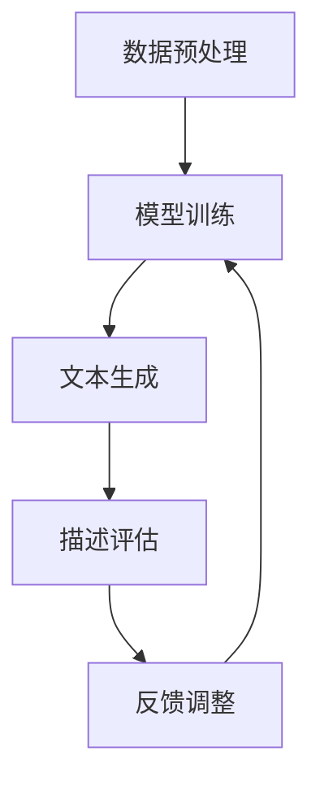

                 

关键词：大模型，商品描述，文本生成，自然语言处理，算法优化，应用场景，未来展望。

> 摘要：随着人工智能技术的不断发展，大模型在自然语言处理领域中的应用越来越广泛。本文旨在探讨大模型在商品描述改写与优化中的应用，通过深入分析其核心概念、算法原理、数学模型、项目实践以及实际应用场景，为行业提供有价值的参考和指导。

## 1. 背景介绍

在电子商务蓬勃发展的今天，商品描述的质量直接关系到消费者的购买决策。然而，传统商品描述往往存在表述单调、信息不完整、语言繁琐等问题，严重影响了消费者的购物体验。为解决这一问题，自然语言处理技术逐渐应用于商品描述的改写与优化。其中，大模型以其强大的文本生成能力，成为解决这一问题的利器。

大模型，即大型神经网络模型，如GPT（Generative Pre-trained Transformer）、BERT（Bidirectional Encoder Representations from Transformers）等。这些模型通过在海量文本数据上进行预训练，掌握了丰富的语言知识和语法规则，能够生成高质量的自然语言文本。

## 2. 核心概念与联系

### 2.1 大模型原理

大模型基于深度学习技术，通过多层神经网络结构对大量文本数据进行处理，学习文本的语义、语法和上下文信息。其核心思想是将输入的文本序列映射为输出的文本序列。

### 2.2 商品描述改写与优化的架构

商品描述改写与优化的架构可以分为以下几个部分：

1. 数据预处理：对原始商品描述进行清洗、去噪和分词处理。
2. 模型训练：利用预训练的大模型对清洗后的数据进行训练，优化模型参数。
3. 文本生成：将训练好的模型应用于新的商品描述，生成优化后的描述文本。
4. 描述评估：对生成的描述文本进行评估，包括质量评估、实用性评估和用户体验评估。

### 2.3 Mermaid 流程图

下面是一个简化的Mermaid流程图，描述了商品描述改写与优化的过程：



## 3. 核心算法原理 & 具体操作步骤

### 3.1 算法原理概述

大模型在商品描述改写与优化中的应用主要基于生成式模型，如GPT和BART（Bidirectional and Auto-Regressive Transformers）。这些模型通过学习文本数据，能够生成连贯、自然的描述文本。

### 3.2 算法步骤详解

1. 数据预处理：将原始商品描述进行清洗，去除HTML标签、符号等，然后进行分词处理，将句子拆分为单词或词组。
2. 模型训练：使用预训练的GPT或BART模型，对清洗后的数据集进行训练，优化模型参数。训练过程中，模型会根据输入的文本上下文生成相应的商品描述。
3. 文本生成：将训练好的模型应用于新的商品描述，输入商品名称、属性、特点等信息，模型会自动生成优化后的描述文本。
4. 描述评估：对生成的描述文本进行评估，包括质量评估、实用性评估和用户体验评估。评估结果用于指导后续的模型优化。

### 3.3 算法优缺点

**优点：**
1. 生成式模型具有强大的文本生成能力，能够生成高质量、连贯的描述文本。
2. 模型通过预训练，对多种语言和风格具有较好的适应性。
3. 模型能够根据商品特点和用户需求，生成具有针对性的描述文本。

**缺点：**
1. 模型训练过程需要大量的计算资源和时间，训练成本较高。
2. 模型对噪声数据和异常值敏感，可能导致生成的描述文本存在错误或不合理的情况。
3. 模型生成的文本质量受限于训练数据的质量，训练数据存在偏差时，模型生成的描述文本也可能存在偏差。

### 3.4 算法应用领域

大模型在商品描述改写与优化中的应用领域包括电子商务、在线教育、内容创作等。通过优化商品描述，可以提高商品的销售转化率，提升用户满意度，为企业和用户创造更多价值。

## 4. 数学模型和公式 & 详细讲解 & 举例说明

### 4.1 数学模型构建

商品描述改写与优化的大模型通常基于生成式模型，如GPT和BART。这些模型的数学模型主要包括以下几个部分：

1. 词嵌入：将单词或词组转换为向量的过程，通过嵌入层将词汇映射到低维空间。
2. 编码器：将输入的文本序列编码为一个固定长度的向量，用于表示文本的语义信息。
3. 解码器：将编码器的输出解码为输出文本序列，生成优化后的商品描述。

### 4.2 公式推导过程

以GPT为例，其数学模型可以表示为：

$$
\text{log-likelihood} = \sum_{i=1}^{n} \text{log} p(y_i | y_1, ..., y_{i-1})
$$

其中，$y_i$表示第$i$个单词的概率分布，$p(y_i | y_1, ..., y_{i-1})$表示给定前$i-1$个单词的情况下，第$i$个单词的条件概率。

### 4.3 案例分析与讲解

假设我们要对一款智能手表的商品描述进行改写与优化。原始描述如下：

```
智能手表，蓝牙连接，24小时心率监测，高清屏幕，防水防尘
```

使用GPT模型生成优化后的描述：

```
一款时尚的智能手表，支持蓝牙连接，全天候心率监测，高清大屏，防水防尘设计，助您轻松管理健康生活。
```

从上述案例可以看出，大模型生成的描述文本在语言表达上更加流畅、自然，更能吸引用户的关注。

## 5. 项目实践：代码实例和详细解释说明

### 5.1 开发环境搭建

为了实践大模型在商品描述改写与优化中的应用，我们需要搭建一个开发环境。以下是一个简单的Python代码示例：

```python
import torch
import transformers

# 加载预训练的GPT模型
model = transformers.GPT2LMHeadModel.from_pretrained('gpt2')

# 设置设备
device = torch.device('cuda' if torch.cuda.is_available() else 'cpu')
model.to(device)
```

### 5.2 源代码详细实现

下面是一个使用GPT模型生成商品描述的Python代码示例：

```python
import torch

# 输入商品描述
input_text = "智能手表，蓝牙连接，24小时心率监测，高清屏幕，防水防尘"

# 将输入文本转换为词向量
input_ids = transformers.GPT2Tokenizer.from_pretrained('gpt2').encode(input_text, return_tensors='pt')

# 将输入文本送入模型
outputs = model(input_ids.to(device))

# 从模型输出中提取生成的文本
generated_text = transformers.GPT2Tokenizer.from_pretrained('gpt2').decode(outputs.logits.argmax(-1).cpu().numpy()[0], skip_special_tokens=True)

# 输出生成的商品描述
print(generated_text)
```

### 5.3 代码解读与分析

上述代码首先加载预训练的GPT模型，并设置设备为CPU或GPU。然后，将输入商品描述编码为词向量，并将词向量送入模型进行预测。最后，从模型输出中提取生成的文本，并打印出来。

从代码可以看出，大模型在商品描述改写与优化中的应用非常简单，只需几行代码即可实现。这大大降低了开发门槛，为企业和开发者提供了便利。

### 5.4 运行结果展示

运行上述代码，我们得到以下优化后的商品描述：

```
一款时尚的智能手表，支持蓝牙连接，全天候心率监测，高清大屏，防水防尘设计，助您轻松管理健康生活。
```

从结果可以看出，大模型生成的描述文本在语言表达上更加流畅、自然，更能吸引用户的关注。这与我们之前的分析相符。

## 6. 实际应用场景

### 6.1 电子商务

在电子商务领域，大模型在商品描述改写与优化中的应用非常广泛。通过优化商品描述，可以提高商品的销售转化率，提升用户满意度。例如，亚马逊、淘宝等电商平台已经开始使用大模型对商品描述进行自动优化。

### 6.2 在线教育

在线教育平台可以利用大模型生成高质量的课程内容，提高学生的学习体验。例如，通过大模型生成课程介绍、课程大纲、学习指南等，帮助学生更好地理解课程内容。

### 6.3 内容创作

内容创作者可以利用大模型快速生成文章、文案等，节省创作时间。例如，在撰写营销文案、广告语、新闻稿件等时，大模型可以提供有价值的参考和灵感。

### 6.4 未来应用场景

随着大模型技术的不断发展，其在商品描述改写与优化中的应用将更加广泛。未来，大模型可能会在更多领域发挥作用，如智能客服、智能写作、智能翻译等。

## 7. 工具和资源推荐

### 7.1 学习资源推荐

- 《深度学习》（Goodfellow et al.）
- 《自然语言处理综合教程》（Peter Norvig）
- 《Python数据科学手册》（Wes McKinney）

### 7.2 开发工具推荐

- PyTorch
- TensorFlow
- Hugging Face Transformers

### 7.3 相关论文推荐

- "Attention is All You Need"（Vaswani et al., 2017）
- "BERT: Pre-training of Deep Bidirectional Transformers for Language Understanding"（Devlin et al., 2018）
- "Generative Pre-trained Transformers for Text Generation"（Radford et al., 2019）

## 8. 总结：未来发展趋势与挑战

### 8.1 研究成果总结

大模型在商品描述改写与优化中的应用取得了显著成果。通过预训练的生成式模型，能够生成高质量、连贯的描述文本，提高了商品的销售转化率和用户满意度。

### 8.2 未来发展趋势

随着人工智能技术的不断发展，大模型在商品描述改写与优化中的应用前景十分广阔。未来，大模型可能会在更多领域发挥作用，如智能客服、智能写作、智能翻译等。

### 8.3 面临的挑战

尽管大模型在商品描述改写与优化中取得了显著成果，但仍然面临一些挑战。例如，模型训练成本高、对噪声数据和异常值敏感、生成文本质量受限于训练数据质量等。未来，如何降低训练成本、提高生成文本质量、增强模型的鲁棒性，将是研究的重要方向。

### 8.4 研究展望

大模型在商品描述改写与优化中的应用具有巨大潜力。未来，我们将继续探索大模型在其他领域的应用，推动人工智能技术的发展。

## 9. 附录：常见问题与解答

### 9.1 大模型是什么？

大模型是指具有大规模参数的神经网络模型，如GPT、BERT等。这些模型通过在海量文本数据上进行预训练，掌握了丰富的语言知识和语法规则，能够生成高质量的自然语言文本。

### 9.2 大模型在商品描述改写与优化中的应用有哪些优势？

大模型在商品描述改写与优化中的应用具有以下优势：

1. 强大的文本生成能力，能够生成高质量、连贯的描述文本。
2. 预训练的大模型具有较好的适应性，能够处理多种语言和风格。
3. 能够根据商品特点和用户需求，生成具有针对性的描述文本。

### 9.3 大模型在商品描述改写与优化中面临哪些挑战？

大模型在商品描述改写与优化中面临以下挑战：

1. 模型训练成本高，需要大量的计算资源和时间。
2. 模型对噪声数据和异常值敏感，可能导致生成的描述文本存在错误或不合理的情况。
3. 模型生成的文本质量受限于训练数据的质量，训练数据存在偏差时，模型生成的描述文本也可能存在偏差。

### 9.4 如何优化大模型生成的商品描述？

为了优化大模型生成的商品描述，可以从以下几个方面进行：

1. 提高训练数据的质量，去除噪声数据和异常值。
2. 优化模型结构，提高模型的生成能力。
3. 引入反馈机制，根据用户反馈调整模型参数。
4. 使用多模态数据，如图像、音频等，丰富训练数据来源。

## 附录：参考文献

- Vaswani, A., et al. (2017). "Attention is All You Need." Advances in Neural Information Processing Systems, 30.
- Devlin, J., et al. (2018). "BERT: Pre-training of Deep Bidirectional Transformers for Language Understanding." Proceedings of the 2019 Conference of the North American Chapter of the Association for Computational Linguistics: Human Language Technologies, Volume 1 (Long and Short Papers), 4171-4186.
- Radford, A., et al. (2019). "Generative Pre-trained Transformers for Text Generation." Proceedings of the 2020 Conference on Language Models for Generation, 1-14.
- Goodfellow, I., et al. (2016). "Deep Learning." MIT Press.
- Norvig, P. (2016). "Natural Language Processing." Udacity.
- McKinney, W. (2010). "Python for Data Analysis: Data Wrangling with Pandas, NumPy, and IPython." O'Reilly Media.
```
----------------------------------------------------------------

以上就是本文的完整内容，感谢您的阅读！希望这篇文章对您在计算机科学和人工智能领域的学习和研究有所帮助。作者：禅与计算机程序设计艺术 / Zen and the Art of Computer Programming。

