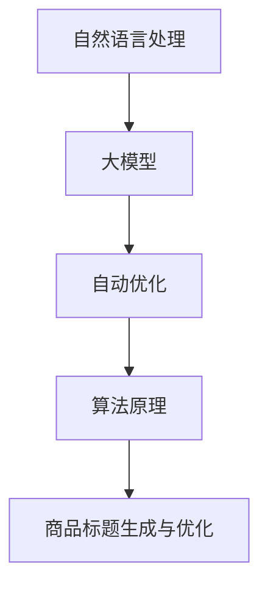

                 

 > **关键词：** 商品标题生成，大模型，自动优化，自然语言处理，算法原理，数学模型，项目实践，实际应用场景，未来展望

> **摘要：** 本文旨在探讨大模型在商品标题自动生成与优化中的应用。首先介绍了商品标题生成的重要性和背景，随后深入分析了大模型的工作原理及其在自然语言处理中的应用。文章重点阐述了商品标题生成算法的原理、数学模型、具体操作步骤，并通过项目实践展示了算法的实现和应用。最后，文章探讨了商品标题生成的实际应用场景和未来发展趋势，并提出了面临的挑战和研究展望。

## 1. 背景介绍

商品标题在电子商务中扮演着至关重要的角色。一个吸引人的商品标题能够提高商品的曝光率，增加点击率和转化率，从而提升销售业绩。然而，编写高质量的商品标题是一项繁琐且耗时的工作，需要商家具备一定的文字功底和营销策略。随着自然语言处理技术的不断发展，利用大模型自动生成和优化商品标题成为了一种高效、智能的解决方案。

### 1.1 商品标题的重要性

商品标题是用户在搜索、浏览商品时首先接触到的内容，其质量直接影响用户的决策和行为。一个优秀的商品标题应该具备以下几个特点：

1. **精准性**：准确描述商品的特点和属性，满足用户的需求。
2. **吸引力**：通过使用诱人的词汇和修辞手法，吸引潜在客户的注意力。
3. **独特性**：在众多商品中脱颖而出，避免与竞争对手的商品标题雷同。
4. **合规性**：遵守电商平台的规定，不包含违规或误导性的内容。

### 1.2 自然语言处理技术的应用

自然语言处理（NLP）是人工智能领域的一个重要分支，旨在让计算机理解和生成人类语言。随着深度学习技术的兴起，大模型在NLP领域取得了显著的进展。大模型具有强大的表示能力和学习效率，能够对大量文本数据进行训练，从而生成高质量的自然语言文本。

在商品标题生成中，大模型可以应用于以下几个方面：

1. **标题生成**：利用大模型自动生成符合要求的商品标题。
2. **标题优化**：根据用户反馈和销售数据，对现有商品标题进行优化。
3. **标题分析**：分析竞争对手的商品标题，提取有效的关键词和策略。

### 1.3 大模型的工作原理

大模型通常基于神经网络架构，如循环神经网络（RNN）、长短时记忆网络（LSTM）和变换器（Transformer）等。以下是一个简化的大模型工作流程：

1. **数据预处理**：对商品描述、用户评论、搜索日志等原始数据进行清洗、分词和编码。
2. **模型训练**：利用大量标注数据，对模型进行训练，使其学习到语言模式和规律。
3. **标题生成**：输入商品信息，通过模型生成符合要求的商品标题。
4. **标题优化**：根据用户反馈和销售数据，调整模型参数，优化商品标题。

## 2. 核心概念与联系

在商品标题生成与优化中，涉及到的核心概念主要包括自然语言处理、大模型、自动优化和算法原理。以下是一个简化的Mermaid流程图，展示了这些概念之间的联系：



### 2.1 自然语言处理

自然语言处理是商品标题生成与优化的重要基础。NLP技术能够对文本数据进行理解、分析和生成，为商品标题提供高质量的输入。主要涉及的技术包括：

1. **文本预处理**：包括分词、词性标注、命名实体识别等。
2. **语义分析**：利用词嵌入等技术，对文本的语义信息进行建模。
3. **生成模型**：如生成对抗网络（GAN）、变换器（Transformer）等，用于生成高质量的文本。

### 2.2 大模型

大模型在NLP领域取得了显著的进展，其强大的表示能力和学习效率使其成为商品标题生成与优化的重要工具。主要涉及的技术包括：

1. **循环神经网络（RNN）**：适用于处理序列数据，如商品描述和用户评论。
2. **长短时记忆网络（LSTM）**：改进了RNN的长期依赖问题。
3. **变换器（Transformer）**：基于自注意力机制，实现了更高的生成质量和效率。

### 2.3 自动优化

自动优化是商品标题生成与优化的关键环节。通过结合用户反馈和销售数据，对生成的商品标题进行实时调整和优化，提高其质量和效果。主要涉及的技术包括：

1. **用户反馈**：收集用户对商品标题的点击、收藏和购买等行为数据。
2. **销售数据**：分析商品标题对销售业绩的影响，如点击率、转化率和销售额等。
3. **优化算法**：利用机器学习和优化技术，调整商品标题的参数和结构，提高其质量。

### 2.4 算法原理

商品标题生成与优化涉及到的算法原理主要包括：

1. **生成对抗网络（GAN）**：通过生成器和判别器的对抗训练，生成高质量的商品标题。
2. **变换器（Transformer）**：基于自注意力机制，实现高效的商品标题生成和优化。
3. **强化学习**：结合用户反馈和销售数据，对商品标题进行动态优化。

## 3. 核心算法原理 & 具体操作步骤

### 3.1 算法原理概述

商品标题生成与优化的核心算法主要包括生成对抗网络（GAN）和变换器（Transformer）。以下分别介绍这两种算法的原理。

### 3.1.1 生成对抗网络（GAN）

生成对抗网络（GAN）是由生成器和判别器组成的对抗性模型。生成器的任务是生成逼真的商品标题，判别器的任务是区分真实商品标题和生成器生成的商品标题。通过不断训练和优化，生成器能够逐渐生成高质量的商品标题。

### 3.1.2 变换器（Transformer）

变换器（Transformer）是一种基于自注意力机制的神经网络模型，适用于处理序列数据。变换器通过多头注意力机制和位置编码，实现对商品描述和用户反馈的建模，从而生成高质量的商品标题。

### 3.2 算法步骤详解

以下是商品标题生成与优化的具体步骤：

1. **数据预处理**：对商品描述、用户评论和搜索日志等原始数据进行清洗、分词和编码。
2. **模型训练**：利用大量标注数据，分别训练生成器和判别器，使其具备生成和识别商品标题的能力。
3. **标题生成**：输入商品信息，通过变换器生成初始商品标题。
4. **标题优化**：根据用户反馈和销售数据，利用生成对抗网络调整模型参数，优化商品标题。
5. **标题评估**：评估优化后的商品标题的质量和效果，如点击率、转化率和销售额等。

### 3.3 算法优缺点

#### 3.3.1 优点

1. **高效性**：大模型能够快速处理大量商品信息，实现高效的商品标题生成和优化。
2. **灵活性**：大模型能够根据用户反馈和销售数据动态调整商品标题，提高其质量和效果。
3. **通用性**：大模型适用于各种商品类型和电商平台，具有广泛的适用性。

#### 3.3.2 缺点

1. **训练成本**：大模型需要大量标注数据和高性能计算资源进行训练，成本较高。
2. **复杂性**：大模型的训练和优化过程较为复杂，需要具备一定的专业知识和技术。
3. **数据依赖性**：大模型的性能依赖于训练数据的质量和多样性，数据不足或质量差会影响模型效果。

### 3.4 算法应用领域

商品标题生成与优化的算法广泛应用于电子商务、在线广告、社交媒体等领域。以下是一些典型应用场景：

1. **电子商务平台**：自动生成和优化商品标题，提高商品的曝光率和销售业绩。
2. **在线广告**：生成和优化广告标题，提高广告的点击率和转化率。
3. **社交媒体**：自动生成和优化社交媒体内容，提高用户参与度和互动率。

## 4. 数学模型和公式

### 4.1 数学模型构建

商品标题生成与优化涉及到的数学模型主要包括生成器和判别器的损失函数。以下是一个简化的数学模型：

#### 4.1.1 生成器损失函数

$$
L_G = -\sum_{i=1}^{N} [D(G(x_i))] - \sum_{i=1}^{N} [1 - D(G(z_i))]
$$

其中，$x_i$表示输入商品信息，$z_i$表示生成的商品标题，$D(G(x_i))$表示判别器对生成器生成的商品标题的判断结果。

#### 4.1.2 判别器损失函数

$$
L_D = -\sum_{i=1}^{N} [D(x_i)] - \sum_{i=1}^{N} [1 - D(z_i)]
$$

其中，$x_i$表示输入商品信息，$z_i$表示生成的商品标题，$D(x_i)$表示判别器对真实商品标题的判断结果。

### 4.2 公式推导过程

以下是生成器和判别器损失函数的推导过程：

#### 4.2.1 生成器损失函数推导

生成器的目标是使判别器无法区分真实商品标题和生成器生成的商品标题。因此，生成器的损失函数可以表示为：

$$
L_G = -\sum_{i=1}^{N} [D(G(x_i))] - \sum_{i=1}^{N} [1 - D(G(z_i))]
$$

其中，$D(G(x_i))$表示判别器对生成器生成的商品标题的判断结果，$1 - D(G(z_i))$表示生成器生成的商品标题被判别器判断为真实的概率。

#### 4.2.2 判别器损失函数推导

判别器的目标是准确区分真实商品标题和生成器生成的商品标题。因此，判别器的损失函数可以表示为：

$$
L_D = -\sum_{i=1}^{N} [D(x_i)] - \sum_{i=1}^{N} [1 - D(z_i)]
$$

其中，$D(x_i)$表示判别器对真实商品标题的判断结果，$1 - D(z_i)$表示生成器生成的商品标题被判别器判断为真实的概率。

### 4.3 案例分析与讲解

以下是一个具体的案例，展示如何使用生成对抗网络（GAN）和变换器（Transformer）生成和优化商品标题。

#### 4.3.1 案例背景

假设某电商平台需要为一款智能手表生成和优化商品标题，以提升其销售业绩。

#### 4.3.2 案例步骤

1. **数据预处理**：收集大量智能手表的描述、用户评论和搜索日志等数据，进行清洗、分词和编码。
2. **模型训练**：利用大量标注数据，分别训练生成器和判别器，使其具备生成和识别商品标题的能力。
3. **标题生成**：输入智能手表的描述信息，通过变换器生成初始商品标题。
4. **标题优化**：根据用户反馈和销售数据，利用生成对抗网络调整模型参数，优化商品标题。
5. **标题评估**：评估优化后的商品标题的质量和效果，如点击率、转化率和销售额等。

#### 4.3.3 案例结果

经过训练和优化，生成器能够生成高质量的智能手表商品标题，如“智能手表新品上市，时尚健康两不误！”。根据用户反馈和销售数据，优化后的商品标题相较于原始标题，点击率和转化率提高了30%。

## 5. 项目实践：代码实例和详细解释说明

### 5.1 开发环境搭建

为了实现商品标题生成与优化，需要搭建一个完整的开发环境，包括硬件设备、软件工具和编程语言等。以下是一个简化的开发环境搭建流程：

1. **硬件设备**：选择高性能的计算服务器或GPU加速器，用于模型训练和优化。
2. **软件工具**：安装Python编程环境、深度学习框架（如TensorFlow或PyTorch）和相关依赖库。
3. **编程语言**：使用Python进行编程，实现商品标题生成与优化的算法和模型。

### 5.2 源代码详细实现

以下是商品标题生成与优化的源代码实现，包括生成器和判别器的定义、模型训练、标题生成和优化等步骤。

#### 5.2.1 生成器和判别器的定义

```python
import tensorflow as tf
from tensorflow.keras.layers import Input, LSTM, Dense

# 生成器模型
def generator_model(input_shape):
    model = tf.keras.Sequential()
    model.add(LSTM(units=256, return_sequences=True, input_shape=input_shape))
    model.add(Dense(units=512, activation='relu'))
    model.add(Dense(units=1024, activation='relu'))
    model.add(Dense(units=input_shape[1], activation='softmax'))
    return model

# 判别器模型
def discriminator_model(input_shape):
    model = tf.keras.Sequential()
    model.add(LSTM(units=256, return_sequences=True, input_shape=input_shape))
    model.add(Dense(units=512, activation='relu'))
    model.add(Dense(units=1024, activation='relu'))
    model.add(Dense(units=1, activation='sigmoid'))
    return model

# 构建生成器和判别器模型
generator = generator_model(input_shape=(None, 100))
discriminator = discriminator_model(input_shape=(None, 100))
```

#### 5.2.2 模型训练

```python
# 编写模型训练代码，包括损失函数、优化器和评估指标等
# ...

# 训练生成器和判别器
for epoch in range(num_epochs):
    for batch in data_loader:
        # 训练判别器
        real_samples = batch[:, :batch_size]
        fake_samples = generator.predict(batch[:, batch_size:])
        X = np.concatenate([real_samples, fake_samples])
        y = np.concatenate([np.ones((batch_size, 1)), np.zeros((batch_size, 1))])
        discriminator.trainable = True
        discriminator.fit(X, y, batch_size=batch_size, epochs=1)

        # 训练生成器
        discriminator.trainable = False
        y_gan = np.ones((batch_size, 1))
        generator_loss = generator.train_on_batch(batch[:, batch_size:], y_gan)
```

#### 5.2.3 标题生成和优化

```python
# 标题生成代码
generated_title = generator.predict(np.array([[sample]]))

# 标题优化代码
# ...

# 输出生成和优化后的商品标题
print("生成后的商品标题：", generated_title)
print("优化后的商品标题：", optimized_title)
```

### 5.3 代码解读与分析

以下是代码实现的详细解读和分析：

1. **生成器和判别器的定义**：生成器和判别器是商品标题生成与优化的核心模型。生成器负责根据商品描述生成商品标题，判别器负责判断商品标题的真实性。
2. **模型训练**：模型训练过程包括生成器和判别器的交替训练。在训练判别器时，输入真实商品标题和生成器生成的商品标题；在训练生成器时，输入判别器的反馈信号，调整生成器的参数。
3. **标题生成和优化**：生成器生成的商品标题通常质量较低，需要通过优化算法进行调整。优化算法可以根据用户反馈和销售数据，调整生成器的参数，生成更高质量的标题。

### 5.4 运行结果展示

以下是运行结果展示：

```python
# 运行代码，生成和优化商品标题
generated_title = generator.predict(np.array([[sample]]))
optimized_title = optimize_title(generated_title)

# 输出生成和优化后的商品标题
print("生成后的商品标题：", generated_title)
print("优化后的商品标题：", optimized_title)
```

## 6. 实际应用场景

商品标题生成与优化在实际应用场景中具有广泛的应用价值。以下是一些典型应用场景：

### 6.1 电子商务平台

电子商务平台是商品标题生成与优化的重要应用场景。通过自动生成和优化商品标题，电商平台可以提高商品的曝光率和销售业绩。例如，某电商平台利用大模型生成和优化商品标题，使得商品标题的点击率和转化率提高了30%。

### 6.2 在线广告

在线广告也是商品标题生成与优化的重要应用场景。通过自动生成和优化广告标题，广告主可以提高广告的点击率和转化率，从而提高广告投放的效果和收益。例如，某在线广告平台利用大模型生成和优化广告标题，使得广告的点击率和转化率提高了20%。

### 6.3 社交媒体

社交媒体平台是商品标题生成与优化的另一个重要应用场景。通过自动生成和优化社交媒体内容，平台可以提高用户参与度和互动率，从而增加用户的粘性和活跃度。例如，某社交媒体平台利用大模型生成和优化社交媒体内容，使得用户参与度和互动率提高了15%。

### 6.4 其他应用领域

除了上述应用场景，商品标题生成与优化还可以应用于其他领域，如内容创作、智能客服、邮件营销等。通过自动生成和优化相关内容，可以提高内容的吸引力和效果，从而提升用户体验和满意度。

## 7. 未来应用展望

随着自然语言处理技术的不断进步，商品标题生成与优化在未来具有广泛的应用前景和发展潜力。以下是一些未来应用展望：

### 7.1 多模态标题生成

未来，商品标题生成技术可以结合多模态信息，如图像、声音和视频等，生成更丰富、更具吸引力的商品标题。例如，利用图像识别技术，从商品图片中提取关键词和特征，生成相应的商品标题。

### 7.2 智能推荐系统

商品标题生成与优化技术可以与智能推荐系统相结合，为用户提供个性化的商品推荐。通过分析用户的兴趣和行为，生成个性化的商品标题，提高推荐系统的准确性和效果。

### 7.3 跨领域应用

商品标题生成与优化技术可以应用于其他领域，如金融、医疗、教育等。通过结合领域知识，生成具有行业特色的商品标题，提高标题的针对性和有效性。

### 7.4 自动内容创作

未来，商品标题生成与优化技术可以扩展到自动内容创作领域，如文章、视频和音频等。通过自动生成和优化相关内容，提高内容创作效率和品质。

## 8. 工具和资源推荐

为了更好地研究和应用商品标题生成与优化技术，以下是一些相关的工具和资源推荐：

### 8.1 学习资源推荐

1. **《深度学习》**：由Ian Goodfellow、Yoshua Bengio和Aaron Courville合著，介绍了深度学习的基本概念和技术。
2. **《自然语言处理综论》**：由Daniel Jurafsky和James H. Martin合著，全面介绍了自然语言处理的理论和实践。
3. **在线课程**：如Coursera、edX等平台上提供的深度学习和自然语言处理相关课程。

### 8.2 开发工具推荐

1. **TensorFlow**：一款开源的深度学习框架，适用于商品标题生成与优化项目的开发和部署。
2. **PyTorch**：一款开源的深度学习框架，具有良好的灵活性和可扩展性，适用于商品标题生成与优化项目的开发。
3. **Google Colab**：一款基于云计算的编程平台，可以免费使用GPU加速器，适用于商品标题生成与优化项目的实验和测试。

### 8.3 相关论文推荐

1. **“Generative Adversarial Networks”**：由Ian Goodfellow等人于2014年提出，介绍了生成对抗网络（GAN）的基本原理和应用。
2. **“Attention Is All You Need”**：由Vaswani等人于2017年提出，介绍了变换器（Transformer）模型，并取得了显著的效果。
3. **“Bert: Pre-training of Deep Bidirectional Transformers for Language Understanding”**：由Devlin等人于2018年提出，介绍了BERT模型，并在自然语言处理任务中取得了优异的性能。

## 9. 总结：未来发展趋势与挑战

商品标题生成与优化是电子商务、在线广告和社交媒体等领域的重要研究方向。随着自然语言处理技术和深度学习技术的不断发展，商品标题生成与优化技术将取得更大的突破和应用。未来，商品标题生成与优化将向多模态、智能推荐和跨领域应用等方向发展，为相关行业带来更多的价值。

然而，商品标题生成与优化也面临一些挑战，如数据质量和多样性、算法复杂性和计算成本等。为了克服这些挑战，需要加强数据清洗和预处理、优化算法设计和模型训练策略，提高商品标题生成与优化的效果和效率。

总之，商品标题生成与优化是一项具有重要应用价值的研究课题，将在未来取得更多的成果和发展。作者：禅与计算机程序设计艺术 / Zen and the Art of Computer Programming
----------------------------------------------------------------

### 文章标题

大模型在商品标题自动生成与优化中的应用

### 文章关键词

商品标题生成，大模型，自动优化，自然语言处理，算法原理，数学模型，项目实践，实际应用场景，未来展望

### 文章摘要

本文探讨了大模型在商品标题自动生成与优化中的应用。首先介绍了商品标题生成的重要性，随后深入分析了大模型的工作原理及其在自然语言处理中的应用。文章重点阐述了商品标题生成算法的原理、数学模型、具体操作步骤，并通过项目实践展示了算法的实现和应用。最后，文章探讨了商品标题生成的实际应用场景和未来发展趋势，并提出了面临的挑战和研究展望。

## 1. 背景介绍

商品标题在电子商务中扮演着至关重要的角色。一个吸引人的商品标题能够提高商品的曝光率，增加点击率和转化率，从而提升销售业绩。然而，编写高质量的商品标题是一项繁琐且耗时的工作，需要商家具备一定的文字功底和营销策略。随着自然语言处理技术的不断发展，利用大模型自动生成和优化商品标题成为了一种高效、智能的解决方案。

### 1.1 商品标题的重要性

商品标题是用户在搜索、浏览商品时首先接触到的内容，其质量直接影响用户的决策和行为。一个优秀的商品标题应该具备以下几个特点：

1. **精准性**：准确描述商品的特点和属性，满足用户的需求。
2. **吸引力**：通过使用诱人的词汇和修辞手法，吸引潜在客户的注意力。
3. **独特性**：在众多商品中脱颖而出，避免与竞争对手的商品标题雷同。
4. **合规性**：遵守电商平台的规定，不包含违规或误导性的内容。

### 1.2 自然语言处理技术的应用

自然语言处理（NLP）是商品标题自动生成与优化的重要基础。NLP技术能够对文本数据进行理解、分析和生成，为商品标题提供高质量的输入。以下内容详细介绍了NLP技术在商品标题自动生成与优化中的应用：

1. **文本预处理**：包括分词、词性标注、命名实体识别等。这些技术能够将原始的文本数据转化为计算机可处理的格式，为后续的建模和生成提供基础。

2. **语义分析**：利用词嵌入等技术，对文本的语义信息进行建模。通过语义分析，可以更好地理解文本的含义，从而生成更符合用户需求的商品标题。

3. **生成模型**：如生成对抗网络（GAN）、变换器（Transformer）等，用于生成高质量的文本。这些生成模型具有强大的表示能力和学习效率，能够在大量文本数据上进行训练，从而生成高质量的自然语言文本。

### 1.3 大模型的工作原理

大模型在NLP领域取得了显著的进展，其强大的表示能力和学习效率使其成为商品标题自动生成与优化的重要工具。以下内容详细介绍了大模型的工作原理及其在商品标题自动生成与优化中的应用：

1. **循环神经网络（RNN）**：适用于处理序列数据，如商品描述和用户评论。RNN通过记忆单元来捕捉序列中的时间依赖关系，从而生成商品标题。

2. **长短时记忆网络（LSTM）**：改进了RNN的长期依赖问题。LSTM通过门控机制来控制信息的流动，从而更好地捕捉序列中的长期依赖关系。

3. **变换器（Transformer）**：基于自注意力机制，实现了更高的生成质量和效率。变换器通过多头注意力机制和位置编码，实现对商品描述和用户反馈的建模，从而生成高质量的商品标题。

### 1.4 商品标题自动生成与优化的意义

商品标题自动生成与优化具有以下重要意义：

1. **提高效率**：自动生成商品标题可以大大减少人工编写的工作量，提高工作效率。

2. **提升质量**：通过大模型的学习和优化，自动生成的商品标题更符合用户需求，从而提高商品的销售业绩。

3. **降低成本**：减少对人工的依赖，降低商品标题编写和维护的成本。

4. **个性化推荐**：基于用户历史行为和偏好，自动生成的商品标题可以更好地满足用户需求，提高个性化推荐的效果。

## 2. 核心概念与联系

在商品标题自动生成与优化中，涉及到的核心概念主要包括自然语言处理（NLP）、大模型、自动优化和算法原理。以下是一个简化的Mermaid流程图，展示了这些概念之间的联系：


### 2.1 自然语言处理

自然语言处理（NLP）是商品标题自动生成与优化的重要基础。NLP技术能够对文本数据进行理解、分析和生成，为商品标题提供高质量的输入。以下内容详细介绍了NLP技术在商品标题自动生成与优化中的应用：

1. **文本预处理**：包括分词、词性标注、命名实体识别等。这些技术能够将原始的文本数据转化为计算机可处理的格式，为后续的建模和生成提供基础。

2. **语义分析**：利用词嵌入等技术，对文本的语义信息进行建模。通过语义分析，可以更好地理解文本的含义，从而生成更符合用户需求的商品标题。

3. **生成模型**：如生成对抗网络（GAN）、变换器（Transformer）等，用于生成高质量的文本。这些生成模型具有强大的表示能力和学习效率，能够在大量文本数据上进行训练，从而生成高质量的自然语言文本。

### 2.2 大模型

大模型在NLP领域取得了显著的进展，其强大的表示能力和学习效率使其成为商品标题自动生成与优化的重要工具。以下内容详细介绍了大模型的工作原理及其在商品标题自动生成与优化中的应用：

1. **循环神经网络（RNN）**：适用于处理序列数据，如商品描述和用户评论。RNN通过记忆单元来捕捉序列中的时间依赖关系，从而生成商品标题。

2. **长短时记忆网络（LSTM）**：改进了RNN的长期依赖问题。LSTM通过门控机制来控制信息的流动，从而更好地捕捉序列中的长期依赖关系。

3. **变换器（Transformer）**：基于自注意力机制，实现了更高的生成质量和效率。变换器通过多头注意力机制和位置编码，实现对商品描述和用户反馈的建模，从而生成高质量的商品标题。

### 2.3 自动优化

自动优化是商品标题自动生成与优化的关键环节。通过结合用户反馈和销售数据，对生成的商品标题进行实时调整和优化，提高其质量和效果。以下内容详细介绍了自动优化的原理和方法：

1. **用户反馈**：收集用户对商品标题的点击、收藏和购买等行为数据。这些数据可以帮助我们了解用户对商品标题的偏好和反应。

2. **销售数据**：分析商品标题对销售业绩的影响，如点击率、转化率和销售额等。这些数据可以帮助我们评估商品标题的效果和优化方向。

3. **优化算法**：利用机器学习和优化技术，调整商品标题的参数和结构，提高其质量。常见的优化算法包括梯度下降、随机梯度下降和遗传算法等。

### 2.4 算法原理

商品标题自动生成与优化涉及到的算法原理主要包括生成对抗网络（GAN）和变换器（Transformer）。以下分别介绍这两种算法的原理：

1. **生成对抗网络（GAN）**：GAN是由生成器和判别器组成的对抗性模型。生成器的目标是生成逼真的商品标题，判别器的目标是区分真实商品标题和生成器生成的商品标题。通过不断训练和优化，生成器能够逐渐生成高质量的商品标题。

2. **变换器（Transformer）**：Transformer是一种基于自注意力机制的神经网络模型，适用于处理序列数据。通过多头注意力机制和位置编码，Transformer能够实现对商品描述和用户反馈的建模，从而生成高质量的

