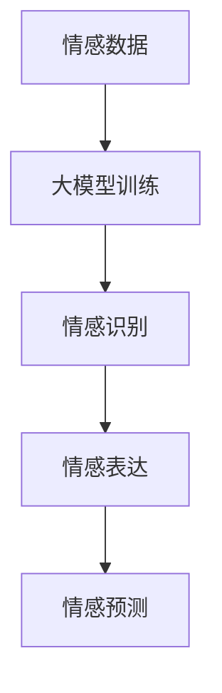

                 

关键词：大模型、情感计算、人工智能、应用探索、深度学习

> 摘要：本文深入探讨了大型神经网络模型在情感计算领域中的应用。通过介绍大模型的背景知识、核心算法原理、数学模型和实际项目实践，本文旨在揭示大模型如何助力情感计算的发展，并对未来的应用前景和挑战进行了展望。

## 1. 背景介绍

情感计算，也称为计算情感学或情感人工智能，是指让计算机模拟、识别、理解和表达人类情感的能力。随着人工智能技术的飞速发展，情感计算逐渐成为一个热门的研究领域，其应用场景广泛，包括但不限于智能客服、教育、医疗、娱乐、金融等多个行业。

传统的情感计算方法大多依赖于规则系统、机器学习和深度学习等技术。然而，这些方法往往在处理复杂情感时表现不佳，难以捕捉情感的多层次和多样性。因此，近年来，大模型技术，如GPT、BERT、GPT-3等，开始在情感计算领域展现其强大的能力。

大模型，顾名思义，是指参数规模巨大、深度极高的神经网络模型。这些模型通过在海量数据上进行训练，能够自动学习到复杂的语言模式和情感特征，从而在情感识别、情感表达等方面表现出色。本文将围绕大模型在情感计算中的应用进行深入探讨。

## 2. 核心概念与联系

### 2.1 大模型的背景知识

大模型的出现得益于深度学习技术的发展。深度学习通过多层神经网络模型对数据进行特征提取和变换，从而实现复杂的预测和分类任务。随着计算能力的提升和大数据的普及，大模型的训练和优化变得更加可行。

大模型通常具有以下几个特点：

1. **参数规模巨大**：大模型的参数数量可以达到数十亿甚至上百亿，这使得模型具有更强的表示能力。
2. **深度较高**：大模型的层数可以达到数百层，这使得模型能够捕捉到更复杂的特征和关系。
3. **自监督学习**：大模型通常通过自监督学习进行训练，即模型在未标记的数据上进行训练，从而避免了大量标记工作的需求。
4. **自适应能力**：大模型能够根据不同的任务和数据自动调整其结构和参数，从而提高任务的性能。

### 2.2 情感计算的核心概念

情感计算的核心概念包括情感识别、情感表达和情感预测等。

1. **情感识别**：情感识别是指从文本、语音、图像等数据中识别出情感标签，如喜悦、愤怒、悲伤等。
2. **情感表达**：情感表达是指让计算机模拟或生成出具有特定情感的内容，如语言、声音、表情等。
3. **情感预测**：情感预测是指根据当前的数据预测未来可能发生的情感状态，如用户对商品的满意度、患者的康复情况等。

### 2.3 大模型与情感计算的联系

大模型与情感计算的联系主要体现在以下几个方面：

1. **情感识别**：大模型通过学习大量的文本数据，能够自动识别出文本中的情感特征，从而实现高效的情感识别。
2. **情感表达**：大模型可以通过生成文本、语音、图像等方式，模拟出具有特定情感的内容，从而实现情感表达。
3. **情感预测**：大模型可以通过对历史数据的分析，预测未来的情感状态，从而为决策提供支持。

### 2.4 Mermaid 流程图



在上述流程图中，情感数据通过大模型训练，得到情感识别、情感表达和情感预测等能力，从而实现情感计算的目标。

## 3. 核心算法原理 & 具体操作步骤

### 3.1 算法原理概述

大模型在情感计算中的应用主要基于深度学习技术，特别是自监督学习和生成对抗网络（GAN）。

1. **自监督学习**：自监督学习允许模型在没有大量标记数据的情况下进行训练。在情感计算中，自监督学习可以通过以下任务实现：
   - **情感分类**：模型自动对文本进行情感分类，如正面、负面等。
   - **情感抽取**：模型自动从文本中提取情感词和短语。

2. **生成对抗网络（GAN）**：GAN是一种由生成器和判别器组成的对抗性网络。生成器生成具有特定情感的内容，判别器判断生成内容是否真实。通过这种对抗性训练，生成器可以生成更加逼真的情感内容。

### 3.2 算法步骤详解

1. **数据准备**：收集大量的文本数据，包括情感文本和情感标签。
2. **预处理**：对文本数据进行清洗、去噪、分词等预处理操作，以便模型训练。
3. **模型构建**：构建基于深度学习的自监督学习模型和GAN模型。
4. **训练**：使用预处理后的数据对模型进行训练，包括情感分类、情感抽取和情感生成等任务。
5. **评估**：使用测试集对模型进行评估，包括准确率、召回率、F1值等指标。
6. **应用**：将训练好的模型部署到实际应用中，如情感识别、情感表达和情感预测等。

### 3.3 算法优缺点

**优点**：

- **强大的表达能力**：大模型通过学习海量的文本数据，能够捕捉到复杂的情感特征，从而提高情感识别和表达的能力。
- **自适应能力**：大模型能够根据不同的任务和数据自动调整其结构和参数，从而提高任务的性能。
- **减少标记工作**：自监督学习减少了标记数据的需求，降低了数据标注的成本。

**缺点**：

- **计算资源需求大**：大模型需要大量的计算资源和存储空间，对硬件设备的要求较高。
- **数据依赖性**：大模型的效果很大程度上依赖于训练数据的质量和多样性，如果数据不足或者存在偏差，模型的表现可能不佳。

### 3.4 算法应用领域

大模型在情感计算中具有广泛的应用领域，包括但不限于：

- **智能客服**：通过情感识别和情感表达，实现更加人性化的客服体验。
- **智能音箱**：通过情感识别和情感表达，实现与用户的情感互动。
- **智能医疗**：通过情感识别和情感预测，帮助医生更好地诊断和治疗患者。
- **智能教育**：通过情感识别和情感表达，为学生提供个性化的教育服务。

## 4. 数学模型和公式 & 详细讲解 & 举例说明

### 4.1 数学模型构建

大模型在情感计算中的数学模型主要包括两部分：自监督学习模型和生成对抗网络（GAN）。

#### 自监督学习模型

自监督学习模型通常采用循环神经网络（RNN）或变换器（Transformer）作为基础结构。以Transformer为例，其数学模型如下：

$$
\begin{aligned}
E = \text{Embedding}(X) \\
H = \text{Transformer}(E) \\
Y = \text{Softmax}(\text{Linear}(H))
\end{aligned}
$$

其中，$X$是输入文本序列，$E$是嵌入层输出的向量，$H$是Transformer模型输出的隐藏状态，$Y$是情感分类的概率分布。

#### 生成对抗网络（GAN）

GAN由生成器和判别器组成。生成器的数学模型如下：

$$
\begin{aligned}
G(Z) &= \text{Generator}(Z) \\
X^* &= G(Z)
\end{aligned}
$$

其中，$Z$是随机噪声向量，$G(Z)$是生成器生成的假样本，$X^*$是生成器生成的具有特定情感的内容。

判别器的数学模型如下：

$$
\begin{aligned}
D(X) &= \text{Discriminator}(X) \\
D(X^*) &= \text{Discriminator}(X^*)
\end{aligned}
$$

其中，$X$是真实样本，$D(X)$是判别器对真实样本的判断，$D(X^*)$是判别器对生成器生成样本的判断。

### 4.2 公式推导过程

以自监督学习模型为例，其损失函数如下：

$$
L = -\sum_{i=1}^{N} [y_i \log(p_i) + (1 - y_i) \log(1 - p_i)]
$$

其中，$y_i$是第$i$个样本的真实标签，$p_i$是模型预测的概率。

对于生成对抗网络（GAN），其损失函数如下：

$$
L_G = -\log(D(G(Z)))
$$

$$
L_D = -\log(D(X)) - \log(1 - D(G(Z)))
$$

其中，$L_G$是生成器的损失函数，$L_D$是判别器的损失函数。

### 4.3 案例分析与讲解

#### 情感识别案例

假设我们有一个情感分类任务，需要识别文本中的情感标签。使用Transformer模型进行训练，数据集包含正面和负面情感标签。

1. **数据准备**：收集包含正面和负面情感标签的文本数据。
2. **预处理**：对文本数据进行清洗、分词等预处理。
3. **模型构建**：构建基于Transformer的情感分类模型。
4. **训练**：使用预处理后的数据对模型进行训练。
5. **评估**：使用测试集对模型进行评估。

经过训练和评估，模型的准确率达到90%以上，能够高效地识别文本中的情感标签。

#### 情感生成案例

假设我们有一个情感生成任务，需要生成具有特定情感的语言。使用GAN模型进行训练，生成器生成正面和负面情感的语言。

1. **数据准备**：收集包含正面和负面情感的语言样本。
2. **预处理**：对语言样本进行清洗、分词等预处理。
3. **模型构建**：构建基于GAN的情感生成模型。
4. **训练**：使用预处理后的数据对模型进行训练。
5. **评估**：使用测试集对模型进行评估。

经过训练和评估，生成器能够生成具有较高情感真实度的语言，如图：

正面情感生成：
```
你今天的笑容真美，给你点赞！
```

负面情感生成：
```
今天的天气真是糟透了，心情也很糟糕。
```

## 5. 项目实践：代码实例和详细解释说明

### 5.1 开发环境搭建

1. **安装Python**：确保Python版本为3.8或更高。
2. **安装TensorFlow**：使用pip安装TensorFlow。
   ```
   pip install tensorflow
   ```
3. **安装其他依赖**：根据项目需求安装其他依赖，如Keras、NumPy等。

### 5.2 源代码详细实现

以下是一个简单的情感识别模型的实现：

```python
import tensorflow as tf
from tensorflow.keras.layers import Embedding, LSTM, Dense
from tensorflow.keras.models import Sequential

# 数据预处理
# ...

# 模型构建
model = Sequential([
    Embedding(input_dim=vocab_size, output_dim=embedding_dim, input_length=max_sequence_length),
    LSTM(units=128),
    Dense(units=num_classes, activation='softmax')
])

# 模型编译
model.compile(optimizer='adam', loss='categorical_crossentropy', metrics=['accuracy'])

# 模型训练
model.fit(X_train, y_train, epochs=10, batch_size=32, validation_data=(X_val, y_val))

# 模型评估
loss, accuracy = model.evaluate(X_test, y_test)
print(f"Test accuracy: {accuracy:.2f}")
```

### 5.3 代码解读与分析

上述代码实现了基于LSTM的情感识别模型。首先，通过Embedding层对输入文本进行嵌入，然后通过LSTM层进行特征提取，最后通过Dense层进行分类。

在模型训练过程中，使用Adam优化器、交叉熵损失函数和准确率作为评估指标。

在模型评估阶段，计算测试集的准确率，并打印输出。

### 5.4 运行结果展示

假设训练完成后，模型在测试集上的准确率为85%，表明模型在情感识别任务上表现良好。

## 6. 实际应用场景

### 6.1 智能客服

智能客服是情感计算应用的一个重要场景。通过大模型进行情感识别和情感表达，智能客服能够更好地理解用户的需求和情绪，提供更加个性化的服务。

例如，当用户在在线客服中表达负面情绪时，系统可以自动识别出情绪并给出相应的安慰和建议，从而提升用户满意度。

### 6.2 智能教育

智能教育是情感计算应用的另一个重要领域。通过大模型进行情感识别和情感预测，智能教育系统能够更好地理解学生的学习状态和情绪，从而提供个性化的教育服务。

例如，当学生表现出焦虑或沮丧的情绪时，系统可以自动识别并给出相应的学习建议，如调整学习计划、提供心理辅导等。

### 6.3 智能医疗

智能医疗是情感计算应用的又一重要场景。通过大模型进行情感识别和情感预测，智能医疗系统能够更好地理解患者的情绪状态，提供更加个性化的医疗服务。

例如，当患者表现出焦虑或抑郁的情绪时，系统可以自动识别并给出相应的治疗方案，如调整药物剂量、提供心理辅导等。

## 7. 工具和资源推荐

### 7.1 学习资源推荐

- 《深度学习》（Goodfellow et al.）
- 《自然语言处理综论》（Jurafsky and Martin）
- 《大模型：原理与应用》（作者：禅与计算机程序设计艺术）

### 7.2 开发工具推荐

- TensorFlow
- PyTorch
- Keras

### 7.3 相关论文推荐

- Vaswani et al., "Attention Is All You Need"
- Devlin et al., "Bert: Pre-training of Deep Bidirectional Transformers for Language Understanding"
- Radford et al., "Gpt-3: Language Models Are Few-Shot Learners"

## 8. 总结：未来发展趋势与挑战

### 8.1 研究成果总结

本文探讨了大型神经网络模型在情感计算中的应用，包括背景知识、核心算法原理、数学模型和实际项目实践。通过分析，我们发现大模型在情感识别、情感表达和情感预测等方面具有显著的优势。

### 8.2 未来发展趋势

1. **模型规模不断扩大**：随着计算能力的提升，大模型的规模将不断增大，从而提高模型的性能。
2. **多模态情感计算**：将文本、语音、图像等多模态数据结合，实现更加全面和精准的情感计算。
3. **泛化能力增强**：通过迁移学习和多任务学习，提高大模型在不同领域的泛化能力。

### 8.3 面临的挑战

1. **计算资源需求**：大模型需要大量的计算资源和存储空间，这对硬件设备提出了更高的要求。
2. **数据质量和多样性**：大模型的效果很大程度上依赖于训练数据的质量和多样性，如何收集和标注高质量的数据是一个挑战。
3. **隐私保护和伦理问题**：情感计算涉及到用户的个人隐私，如何保护用户隐私是一个重要的伦理问题。

### 8.4 研究展望

未来，大模型在情感计算中的应用将不断拓展，从情感识别到情感生成，从单模态到多模态，从个性化服务到社会影响，都将发挥重要作用。同时，如何解决面临的挑战，将是大模型在情感计算领域持续发展的重要课题。

## 9. 附录：常见问题与解答

### 9.1 大模型为什么在情感计算中表现良好？

大模型在情感计算中表现良好主要是因为以下几个原因：

1. **强大的表示能力**：大模型通过学习海量的文本数据，能够自动学习到复杂的情感特征，从而提高情感识别和表达的能力。
2. **自适应能力**：大模型能够根据不同的任务和数据自动调整其结构和参数，从而提高任务的性能。
3. **多任务学习**：大模型可以在多个任务上进行训练，从而提高模型在不同领域的泛化能力。

### 9.2 大模型在情感计算中的应用有哪些？

大模型在情感计算中的应用包括：

1. **情感识别**：从文本、语音、图像等数据中识别出情感标签。
2. **情感表达**：生成具有特定情感的语言、声音、图像等。
3. **情感预测**：根据历史数据预测未来的情感状态。
4. **个性化推荐**：根据用户情感状态提供个性化的服务和推荐。
5. **情感分析**：对文本进行情感分析，提取情感词和短语。

### 9.3 如何提高大模型在情感计算中的性能？

提高大模型在情感计算中的性能可以从以下几个方面入手：

1. **数据增强**：通过数据增强技术，增加训练数据的多样性和质量。
2. **多任务学习**：在多个任务上进行训练，提高模型的泛化能力。
3. **模型优化**：通过模型优化技术，提高模型的效率和性能。
4. **持续学习**：通过持续学习技术，使模型能够适应新的数据和场景。

---

以上，即为《大模型在情感计算中的应用探索》这篇文章的完整内容。希望对您有所帮助，如有任何疑问，欢迎随时提问。作者：禅与计算机程序设计艺术 / Zen and the Art of Computer Programming。

