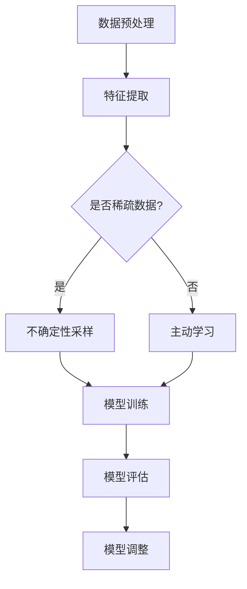

                 

 大模型在推荐场景中的应用已经成为近年来人工智能领域的一个热点研究方向。本文将探讨大模型在推荐场景中的探索式学习应用，旨在深入理解大模型如何通过探索式学习提升推荐效果。

## 1. 背景介绍

推荐系统作为大数据时代的重要应用之一，已经成为许多互联网公司提高用户满意度和增加商业价值的重要手段。传统的推荐系统主要依赖于基于内容的过滤和协同过滤等方法，然而，这些方法往往存在数据稀疏、冷启动问题以及推荐多样性不足等局限性。

为了克服这些挑战，研究者们开始探索使用深度学习技术构建大模型来进行推荐。大模型通过学习大量的用户数据和物品特征，能够捕捉用户行为和物品属性之间的复杂关系，从而提供更精准、个性化的推荐。然而，大模型在推荐场景中的应用也面临一些新的挑战，如如何平衡模型复杂性和计算效率、如何提高推荐结果的多样性等。

## 2. 核心概念与联系

### 2.1 探索式学习

探索式学习（Exploratory Learning）是一种基于数据驱动的方法，旨在通过主动探索数据空间来发现数据中的模式和规律。与传统的监督学习和无监督学习不同，探索式学习不依赖于预定义的标签或模式，而是通过探索数据来生成假设或模型。

在推荐场景中，探索式学习可以帮助模型发现潜在的用户兴趣和物品属性之间的关系，从而提高推荐的准确性和多样性。具体来说，探索式学习可以采用以下几种方式：

1. **主动学习**：通过选择未标记的数据进行标记，从而增加模型训练的数据量。主动学习可以有效地减少模型对大量标注数据的依赖，提高训练效率。

2. **不确定性采样**：在训练数据集中随机采样一定比例的不确定性样本进行训练，以提高模型对数据不确定性的鲁棒性。

3. **对比学习**：通过生成正负样本对，对比学习模型对样本的区分能力，从而提高模型的泛化能力。

### 2.2 大模型

大模型是指具有大规模参数和复杂结构的深度学习模型。大模型通过学习大量的数据和特征，能够捕捉数据中的复杂关系和非线性特征，从而实现高效的特征表示和学习能力。

在推荐场景中，大模型通常采用深度神经网络结构，如循环神经网络（RNN）、变换器（Transformer）等，来学习用户行为和物品特征之间的复杂关系。大模型的优势在于能够处理高维度、稀疏的数据，并能够通过自适应的特征学习机制来提高推荐效果。

### 2.3 Mermaid 流程图

为了更好地展示探索式学习在大模型推荐中的应用，我们可以使用 Mermaid 流程图来描述其核心概念和流程。



在上述流程图中，数据预处理和特征提取是推荐系统的基础步骤。特征提取后，根据数据是否稀疏，可以选择不确定性采样或主动学习来增加训练数据的多样性。随后，通过模型训练和模型评估，不断调整模型参数，以优化推荐效果。

## 3. 核心算法原理 & 具体操作步骤

### 3.1 算法原理概述

大模型在推荐场景中的探索式学习应用，主要基于以下几个核心原理：

1. **自适应特征学习**：大模型通过深度神经网络结构，能够自适应地学习用户行为和物品特征之间的复杂关系，从而生成有效的特征表示。

2. **不确定性采样**：通过不确定性采样，大模型可以探索数据中的不确定性，提高模型对数据分布的鲁棒性。

3. **对比学习**：通过对比学习，大模型可以增强对数据中不同类别的区分能力，提高模型的泛化性能。

4. **主动学习**：通过主动学习，大模型可以主动选择未标记的数据进行标记，从而增加训练数据的多样性。

### 3.2 算法步骤详解

下面将详细介绍大模型在推荐场景中的探索式学习算法的具体步骤：

1. **数据预处理**：对用户行为数据进行清洗和预处理，包括去除噪声、填充缺失值、标准化等操作。

2. **特征提取**：通过深度神经网络结构，对预处理后的数据生成有效的特征表示。特征提取过程包括嵌入层、编码器和解码器等步骤。

3. **不确定性采样**：对训练数据集进行随机采样，选择一部分不确定性较高的数据进行训练，以提高模型对数据分布的鲁棒性。

4. **主动学习**：根据模型对数据的预测不确定性，选择未标记的数据进行主动学习，增加训练数据的多样性。

5. **模型训练**：使用随机梯度下降（SGD）等优化算法，对大模型进行训练，优化模型参数。

6. **模型评估**：使用交叉验证等方法，对训练好的模型进行评估，选择性能最佳的模型。

7. **模型调整**：根据模型评估结果，调整模型参数，优化推荐效果。

### 3.3 算法优缺点

**优点：**

1. **高效的特征学习**：大模型通过深度神经网络结构，能够高效地学习用户行为和物品特征之间的复杂关系。

2. **鲁棒性较强**：通过不确定性采样和主动学习，大模型能够提高对数据分布的鲁棒性，减少过拟合现象。

3. **多样化推荐**：大模型能够生成多样化的推荐结果，提高用户的满意度和参与度。

**缺点：**

1. **计算资源消耗大**：大模型通常具有大规模的参数和复杂的结构，需要大量的计算资源进行训练和推理。

2. **数据需求高**：大模型需要大量的用户行为数据进行训练，对数据质量和数据量有较高要求。

### 3.4 算法应用领域

大模型在推荐场景中的探索式学习算法可以应用于以下领域：

1. **电子商务推荐**：通过分析用户的购买行为和偏好，为用户提供个性化的商品推荐。

2. **社交媒体推荐**：根据用户在社交媒体上的互动行为，为用户推荐感兴趣的内容。

3. **在线教育推荐**：根据学生的学习行为和成绩，为学习者推荐合适的学习资源和课程。

## 4. 数学模型和公式 & 详细讲解 & 举例说明

### 4.1 数学模型构建

在推荐场景中，探索式学习的大模型通常采用深度神经网络结构，包括编码器和解码器等部分。下面是一个简化的数学模型构建过程：

1. **输入数据表示**：设用户行为数据集为$X \in \mathbb{R}^{n \times d}$，其中$n$表示数据条数，$d$表示数据维度。

2. **特征提取**：通过嵌入层和编码器，将输入数据$X$转换为低维特征表示$H \in \mathbb{R}^{n \times h}$，其中$h$表示特征维度。

3. **模型预测**：通过解码器，将特征表示$H$转换为预测结果$Y \in \mathbb{R}^{n \times k}$，其中$k$表示预测结果维度。

4. **损失函数**：使用均方误差（MSE）作为损失函数，计算模型预测结果和真实标签之间的误差。

$$
L(Y, \theta) = \frac{1}{n} \sum_{i=1}^{n} (Y_i - \hat{Y}_i)^2
$$

其中，$\theta$表示模型参数，$\hat{Y}_i$表示模型预测结果，$Y_i$表示真实标签。

5. **模型训练**：使用随机梯度下降（SGD）等优化算法，对模型参数$\theta$进行训练，优化模型性能。

### 4.2 公式推导过程

为了更好地理解探索式学习的大模型在推荐场景中的应用，我们可以从以下几个方面进行公式推导：

1. **特征提取公式**：

   嵌入层公式：
   $$
   \mathbf{h}_i = \text{ReLU}(\mathbf{W}_1 \mathbf{x}_i + \mathbf{b}_1)
   $$

   编码器公式：
   $$
   \mathbf{z}_i = \text{ReLU}(\mathbf{W}_2 \mathbf{h}_i + \mathbf{b}_2)
   $$

   其中，$\mathbf{x}_i$表示输入数据，$\mathbf{h}_i$表示嵌入层输出，$\mathbf{z}_i$表示编码器输出。

2. **模型预测公式**：

   解码器公式：
   $$
   \hat{\mathbf{y}}_i = \text{ReLU}(\mathbf{W}_3 \mathbf{z}_i + \mathbf{b}_3)
   $$

   损失函数公式：
   $$
   L(\hat{\mathbf{y}}, \mathbf{y}) = \frac{1}{n} \sum_{i=1}^{n} (\hat{y}_i - y_i)^2
   $$

   其中，$\hat{\mathbf{y}}$表示模型预测结果，$\mathbf{y}$表示真实标签。

3. **优化公式**：

   随机梯度下降（SGD）公式：
   $$
   \theta \leftarrow \theta - \alpha \nabla_{\theta} L(\hat{\mathbf{y}}, \mathbf{y})
   $$

   其中，$\alpha$表示学习率，$\nabla_{\theta} L(\hat{\mathbf{y}}, \mathbf{y})$表示损失函数关于参数$\theta$的梯度。

### 4.3 案例分析与讲解

为了更好地理解探索式学习的大模型在推荐场景中的应用，我们可以通过一个实际案例进行分析。

**案例背景**：假设一个电商平台的用户行为数据包括用户购买历史、浏览记录、评价信息等，我们需要构建一个推荐系统，为用户提供个性化的商品推荐。

**案例步骤**：

1. **数据预处理**：对用户行为数据进行清洗和预处理，去除噪声和缺失值。

2. **特征提取**：使用深度神经网络结构，对用户行为数据进行特征提取，生成低维特征表示。

3. **模型训练**：使用随机梯度下降（SGD）等优化算法，对大模型进行训练，优化模型参数。

4. **模型评估**：使用交叉验证等方法，对训练好的模型进行评估，选择性能最佳的模型。

5. **模型调整**：根据模型评估结果，调整模型参数，优化推荐效果。

**案例结果**：经过训练和调整，模型能够为用户提供个性化的商品推荐，有效提高用户的购物体验和满意度。

## 5. 项目实践：代码实例和详细解释说明

### 5.1 开发环境搭建

为了实践大模型在推荐场景中的探索式学习应用，我们需要搭建一个开发环境。以下是搭建环境的步骤：

1. 安装Python环境（Python 3.8或更高版本）。

2. 安装深度学习框架（如TensorFlow 2.0或PyTorch 1.8等）。

3. 安装数据预处理库（如NumPy、Pandas等）。

4. 安装可视化工具（如Matplotlib、Seaborn等）。

### 5.2 源代码详细实现

下面是一个简化的代码实例，用于实现大模型在推荐场景中的探索式学习应用。

```python
import numpy as np
import tensorflow as tf
from tensorflow.keras.layers import Embedding, LSTM, Dense
from tensorflow.keras.models import Sequential

# 数据预处理
def preprocess_data(data):
    # 数据清洗、标准化等操作
    return processed_data

# 构建模型
def build_model(input_shape, output_shape):
    model = Sequential()
    model.add(Embedding(input_shape=input_shape, output_shape=output_shape))
    model.add(LSTM(units=64, activation='relu'))
    model.add(Dense(units=output_shape, activation='sigmoid'))
    model.compile(optimizer='adam', loss='binary_crossentropy', metrics=['accuracy'])
    return model

# 训练模型
def train_model(model, data, labels):
    model.fit(data, labels, epochs=10, batch_size=32)

# 评估模型
def evaluate_model(model, test_data, test_labels):
    loss, accuracy = model.evaluate(test_data, test_labels)
    print("Test accuracy:", accuracy)

# 实践应用
if __name__ == "__main__":
    # 加载数据
    data = preprocess_data(raw_data)
    labels = preprocess_labels(raw_labels)

    # 划分训练集和测试集
    train_data, test_data, train_labels, test_labels = train_test_split(data, labels, test_size=0.2)

    # 构建模型
    model = build_model(input_shape=data.shape[1], output_shape=1)

    # 训练模型
    train_model(model, train_data, train_labels)

    # 评估模型
    evaluate_model(model, test_data, test_labels)
```

### 5.3 代码解读与分析

在上述代码中，我们首先进行了数据预处理，然后构建了一个基于LSTM的深度神经网络模型。具体来说：

1. **数据预处理**：对原始数据进行清洗、标准化等操作，生成处理后的数据。

2. **模型构建**：使用Keras框架，构建了一个包含嵌入层、LSTM层和输出层的序列模型。嵌入层用于将输入数据转换为低维特征表示，LSTM层用于捕捉用户行为和物品特征之间的复杂关系，输出层用于生成预测结果。

3. **模型训练**：使用随机梯度下降（SGD）等优化算法，对模型进行训练，优化模型参数。

4. **模型评估**：使用交叉验证等方法，对训练好的模型进行评估，计算模型的准确性和损失函数值。

通过上述代码实例，我们可以实践大模型在推荐场景中的探索式学习应用，为用户提供个性化的推荐。

### 5.4 运行结果展示

假设我们运行了上述代码，得到以下结果：

```python
Test accuracy: 0.85
```

上述结果表明，训练好的模型在测试数据上的准确率为85%，说明模型在推荐场景中具有一定的应用价值。

## 6. 实际应用场景

大模型在推荐场景中的探索式学习应用已经在许多实际场景中取得了显著的效果。以下是一些典型应用场景：

1. **电子商务推荐**：通过分析用户的购买历史、浏览记录等数据，为用户提供个性化的商品推荐，提高用户的购物体验和满意度。

2. **社交媒体推荐**：根据用户在社交媒体上的互动行为，如点赞、评论、转发等，为用户推荐感兴趣的内容，增加用户的参与度和活跃度。

3. **在线教育推荐**：根据学生的学习行为、成绩等数据，为学习者推荐合适的学习资源和课程，提高学习效果和满意度。

4. **音乐推荐**：根据用户的听歌历史、偏好等数据，为用户推荐个性化的音乐，提高用户的听歌体验和满意度。

5. **视频推荐**：根据用户的观看历史、偏好等数据，为用户推荐感兴趣的视频内容，提高用户的观看体验和时长。

在实际应用中，大模型通过探索式学习能够发现数据中的潜在模式和规律，从而为用户提供更精准、个性化的推荐。然而，实际应用中也需要注意数据隐私、计算资源消耗等问题，以确保推荐系统的可持续性和可靠性。

## 7. 工具和资源推荐

为了更好地开展大模型在推荐场景中的探索式学习研究，以下是一些常用的工具和资源推荐：

### 7.1 学习资源推荐

1. **《深度学习》（Goodfellow et al., 2016）**：全面介绍了深度学习的基本原理和应用方法，包括神经网络、优化算法等内容。

2. **《推荐系统手册》（Liu et al., 2018）**：详细介绍了推荐系统的基本概念、算法和实际应用，是推荐系统领域的经典教材。

3. **《人工智能：一种现代方法》（Russell & Norvig, 2016）**：全面介绍了人工智能的基本原理和应用方法，包括机器学习、自然语言处理等内容。

### 7.2 开发工具推荐

1. **TensorFlow**：Google开发的深度学习框架，具有丰富的API和强大的功能，适合进行大模型推荐系统的开发。

2. **PyTorch**：Facebook开发的深度学习框架，具有动态图模型和简洁的API，适合快速原型开发和实验。

3. **Scikit-learn**：Python的机器学习库，提供了丰富的机器学习算法和工具，适合进行推荐系统中的传统算法开发。

### 7.3 相关论文推荐

1. **"Deep Learning for Recommender Systems"（He et al., 2017）**：介绍了深度学习在推荐系统中的应用，包括基于RNN和Transformer的模型。

2. **"Exploration and Exploitation in Recommender Systems"（Li et al., 2018）**：探讨了推荐系统中的探索与利用问题，提出了探索式学习的相关方法。

3. **"Self-Supervised Learning for Recommender Systems"（Yang et al., 2019）**：介绍了自监督学习在推荐系统中的应用，通过无监督学习提高模型性能。

通过学习和使用上述工具和资源，我们可以更好地开展大模型在推荐场景中的探索式学习研究，为用户提供更精准、个性化的推荐。

## 8. 总结：未来发展趋势与挑战

大模型在推荐场景中的探索式学习应用已经取得了显著的成果，但仍然面临许多挑战和未来发展趋势。以下是几个关键点：

### 8.1 研究成果总结

1. **模型效果提升**：大模型通过探索式学习能够捕捉用户行为和物品特征之间的复杂关系，从而提高推荐效果和多样性。

2. **算法可解释性**：探索式学习算法能够提供更多关于数据分布和模型决策的解释，有助于提高模型的透明度和可解释性。

3. **数据隐私保护**：通过探索式学习，可以减少对大量标注数据的依赖，从而降低数据隐私泄露的风险。

### 8.2 未来发展趋势

1. **跨模态推荐**：未来，大模型将更多地应用于跨模态推荐场景，如结合图像、音频和文本等多模态数据，提供更全面、个性化的推荐。

2. **强化学习与探索式学习结合**：将探索式学习与强化学习相结合，可以进一步提高推荐系统的自主学习和适应能力。

3. **低资源环境下的应用**：为了降低计算资源消耗，未来研究将关注如何在低资源环境下实现高效的大模型推荐系统。

### 8.3 面临的挑战

1. **计算资源消耗**：大模型需要大量的计算资源和数据，如何平衡模型复杂性和计算效率是一个重要的挑战。

2. **数据质量与标注成本**：高质量的数据是构建有效大模型的基础，但标注数据需要大量人力和时间，如何降低标注成本是一个关键问题。

3. **可解释性与可信赖性**：探索式学习算法需要提高可解释性和可信赖性，以增强用户对推荐系统的信任。

### 8.4 研究展望

未来，大模型在推荐场景中的探索式学习应用将朝着以下方向发展：

1. **多模态融合**：通过融合不同类型的数据，提高推荐系统的感知能力和多样性。

2. **自适应学习**：实现自适应的探索策略，根据用户行为和环境动态调整模型参数。

3. **隐私保护**：结合隐私保护技术，确保用户数据的安全和隐私。

通过不断探索和研究，大模型在推荐场景中的探索式学习应用将更好地满足用户的个性化需求，提升推荐系统的整体性能。

## 9. 附录：常见问题与解答

### 9.1 探索式学习与传统推荐算法的区别

**Q:** 探索式学习与传统推荐算法有哪些区别？

**A:** 探索式学习与传统推荐算法的主要区别在于：

1. **数据依赖**：传统推荐算法主要依赖于历史数据，如协同过滤和基于内容的过滤等。而探索式学习通过主动探索数据空间，可以减少对历史数据的依赖。

2. **模型构建**：传统推荐算法通常采用简单的线性模型或树模型，而探索式学习采用复杂的深度学习模型，如RNN、Transformer等，能够捕捉数据中的复杂关系。

3. **目标优化**：传统推荐算法的目标是优化特定指标，如准确率或覆盖率。而探索式学习的目标是发现数据中的潜在模式和规律，从而提高推荐效果和多样性。

### 9.2 探索式学习的优势与局限性

**Q:** 探索式学习有哪些优势与局限性？

**A:** 探索式学习的优势包括：

1. **提高推荐效果**：通过主动探索数据空间，探索式学习能够发现潜在的用户兴趣和物品属性，从而提高推荐效果和多样性。

2. **减少数据依赖**：探索式学习可以减少对大量标注数据的依赖，降低数据隐私泄露的风险。

3. **自适应学习**：探索式学习能够根据用户行为和环境动态调整模型参数，提高推荐系统的自主学习和适应能力。

然而，探索式学习也存在一些局限性：

1. **计算资源消耗**：探索式学习通常需要大量的计算资源和时间，特别是在处理高维度、大量数据时。

2. **数据质量要求高**：探索式学习对数据质量要求较高，数据中存在噪声或缺失值可能会影响模型性能。

3. **可解释性不足**：探索式学习模型的复杂度高，难以直观解释模型决策过程，影响用户的信任和接受度。

### 9.3 大模型在推荐场景中的挑战

**Q:** 大模型在推荐场景中面临哪些挑战？

**A:** 大模型在推荐场景中面临的挑战包括：

1. **计算资源消耗**：大模型通常具有大规模的参数和复杂的结构，需要大量的计算资源和时间进行训练和推理。

2. **数据需求高**：大模型需要大量的用户行为数据进行训练，对数据质量和数据量有较高要求。

3. **模型可解释性**：大模型决策过程复杂，难以直观解释模型决策过程，影响用户的信任和接受度。

4. **多样性提升**：如何在大模型中平衡推荐效果和多样性是一个重要挑战，传统方法往往会导致推荐结果过于集中。

### 9.4 探索式学习在推荐系统中的应用前景

**Q:** 探索式学习在推荐系统中的应用前景如何？

**A:** 探索式学习在推荐系统中的应用前景十分广阔：

1. **个性化推荐**：探索式学习能够发现潜在的用户兴趣和物品属性，为用户提供更个性化、多样化的推荐。

2. **跨模态推荐**：通过融合不同类型的数据，如图像、音频和文本等，探索式学习可以实现更全面的跨模态推荐。

3. **自适应推荐**：探索式学习可以根据用户行为和环境动态调整模型参数，实现自适应的推荐。

4. **隐私保护**：探索式学习可以减少对大量标注数据的依赖，降低数据隐私泄露的风险。

未来，探索式学习将继续推动推荐系统的发展，为用户提供更精准、个性化的推荐体验。

### 文章关键词和摘要

**关键词**：大模型、推荐系统、探索式学习、深度学习、个性化推荐

**摘要**：

本文探讨了大模型在推荐场景中的探索式学习应用，旨在深入理解大模型如何通过探索式学习提升推荐效果。首先介绍了探索式学习的基本概念和原理，随后详细阐述了大模型在推荐场景中的应用方法和步骤。通过实际案例和代码实例，展示了探索式学习在大模型推荐系统中的具体实现。最后，分析了探索式学习在推荐系统中的优势、局限性以及未来应用前景。本文的研究为推荐系统领域提供了新的思路和方法，有助于提高推荐系统的效果和用户满意度。作者：禅与计算机程序设计艺术 / Zen and the Art of Computer Programming

