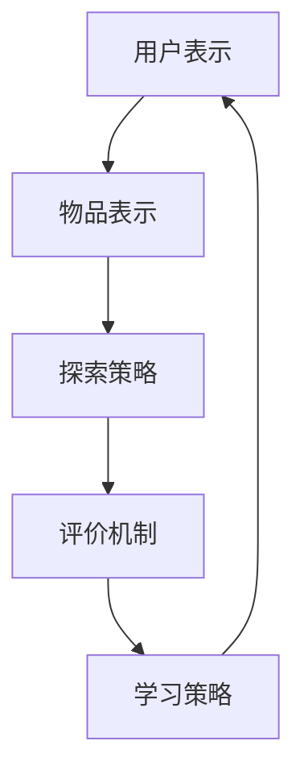
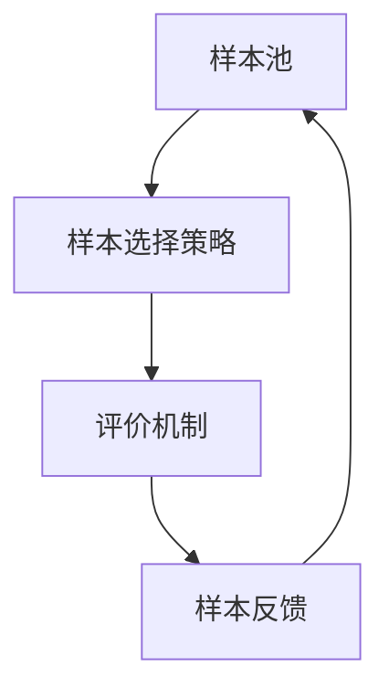

                 

关键词：大模型，推荐系统，探索式学习，应用实验，算法原理，数学模型，代码实例，实际应用，未来展望

## 摘要

本文探讨了大规模模型在推荐场景中的应用，特别是探索式学习（exploratory learning）的方法。首先，我们回顾了推荐系统的基本概念和当前主流算法，接着详细阐述了探索式学习在推荐系统中的核心作用。通过数学模型和具体算法原理的讲解，文章展示了如何在大模型中实现探索式学习。此外，本文还提供了一个实际的代码实例，详细解释了如何在实际项目中应用探索式学习算法。最后，我们探讨了探索式学习在推荐系统中的实际应用场景，并对其未来发展方向和面临的挑战进行了展望。

## 1. 背景介绍

### 推荐系统概述

推荐系统（Recommendation System）是信息检索、数据挖掘和机器学习领域的热点话题。其核心目标是根据用户的历史行为和偏好，为用户推荐可能感兴趣的内容或商品。推荐系统的广泛应用极大地提升了用户体验，同时也为电子商务、社交媒体、新闻媒体等行业带来了巨大的商业价值。

推荐系统的发展可以分为三个阶段：基于内容的推荐、协同过滤推荐和混合推荐。基于内容的推荐通过分析内容和用户兴趣的相似性来进行推荐；协同过滤推荐通过分析用户之间的相似性进行推荐；混合推荐则结合了这两种方法的优势。随着数据量和计算能力的增长，大规模推荐系统逐渐成为研究的热点。

### 大模型与探索式学习

近年来，深度学习和大规模模型（如Transformer）的兴起，为推荐系统带来了新的机遇。大模型具有处理大规模数据和高维度特征的能力，可以显著提升推荐系统的性能。然而，大规模推荐系统也面临着数据稀疏、用户多样性等问题，这需要新的方法来应对。

探索式学习（Exploratory Learning）是一种在数据稀缺或动态变化的环境中，通过主动探索来提高学习效果的方法。它通过主动选择最有信息量的样本进行学习，从而提高模型的泛化能力和适应性。探索式学习在推荐系统中的应用，可以解决数据稀疏和用户多样性带来的挑战。

## 2. 核心概念与联系

### 探索式学习原理

探索式学习是一种基于主动学习的策略，通过选择最有信息量的样本进行学习，从而提高模型的效果。其核心思想是在不确定的环境中，通过探索未知的领域来获取更多的信息。在推荐系统中，探索式学习可以通过以下方式实现：

1. **样本选择**：选择未探索的用户或物品进行推荐。
2. **评价机制**：通过用户反馈或模型预测来评价推荐效果。
3. **学习策略**：根据评价结果调整探索策略。

### 推荐系统与探索式学习架构

在推荐系统中，探索式学习可以通过以下架构实现：

1. **用户表示**：将用户的行为和兴趣转换为向量表示。
2. **物品表示**：将物品的特征转换为向量表示。
3. **探索策略**：选择未探索的用户或物品进行推荐。
4. **评价机制**：通过用户反馈或模型预测来评价推荐效果。
5. **学习策略**：根据评价结果调整探索策略。

以下是一个简单的Mermaid流程图，展示了探索式学习在推荐系统中的架构：



### 大模型与探索式学习联系

大模型与探索式学习之间存在紧密的联系。大模型具有处理大规模数据和复杂特征的能力，为探索式学习提供了强大的工具。同时，探索式学习可以缓解大模型在数据稀缺和动态变化环境中的挑战，提高模型的泛化能力和适应性。

### 探索式学习算法原理

探索式学习算法的核心是选择最有信息量的样本进行学习。以下是一个简单的探索式学习算法原理示意图：



其中，样本选择策略可以根据样本的信息量、未探索程度等因素进行设计。评价机制可以基于用户反馈或模型预测来评估样本的质量。根据评价结果，样本反馈机制可以调整样本选择策略，以实现最优的探索效果。

## 3. 核心算法原理 & 具体操作步骤

### 3.1 算法原理概述

探索式学习算法的核心在于样本选择策略和评价机制。样本选择策略决定了哪些样本将被用于学习，而评价机制则决定了这些样本的质量。以下是探索式学习算法的基本原理：

1. **样本选择策略**：选择未探索的样本进行推荐。未探索的样本可以是通过随机抽样或基于某些特征进行选择。
2. **评价机制**：通过用户反馈或模型预测来评价推荐效果。评价结果可以用来调整样本选择策略。
3. **学习策略**：根据评价结果调整样本选择策略，以实现最优的探索效果。

### 3.2 算法步骤详解

探索式学习算法的具体步骤如下：

1. **初始化**：初始化样本池，包括所有已探索和未探索的样本。
2. **样本选择**：根据样本选择策略选择未探索的样本。样本选择策略可以基于随机抽样、未探索程度、信息量等因素进行设计。
3. **推荐生成**：根据当前模型和已选择的样本生成推荐列表。
4. **用户反馈**：收集用户对推荐列表的反馈。反馈可以是点击、评分或购买等。
5. **评价机制**：根据用户反馈评价推荐效果。评价结果可以用来计算推荐列表的质量。
6. **样本反馈**：根据评价结果调整样本选择策略。例如，将表现良好的样本加入已探索样本池，将表现较差的样本排除。
7. **模型更新**：根据调整后的样本选择策略更新模型。
8. **迭代**：重复步骤2-7，直到达到预定的迭代次数或模型收敛。

### 3.3 算法优缺点

探索式学习算法具有以下优点：

1. **自适应**：可以自适应地调整样本选择策略，以应对数据稀疏和用户多样性。
2. **灵活性**：可以根据不同的应用场景设计不同的样本选择策略和评价机制。

探索式学习算法也存在以下缺点：

1. **计算成本**：探索式学习算法需要多次迭代和评价，计算成本较高。
2. **数据依赖**：算法的性能很大程度上依赖于用户反馈的质量。

### 3.4 算法应用领域

探索式学习算法在推荐系统中的应用非常广泛，主要包括以下领域：

1. **电子商务**：在电子商务平台上，探索式学习可以帮助商家发现潜在用户，提高销售额。
2. **社交媒体**：在社交媒体平台上，探索式学习可以帮助用户发现潜在的兴趣和关注点，提高用户活跃度。
3. **新闻推荐**：在新闻推荐平台上，探索式学习可以帮助用户发现新的新闻来源，提高用户阅读体验。

## 4. 数学模型和公式 & 详细讲解 & 举例说明

### 4.1 数学模型构建

在探索式学习算法中，数学模型是核心部分。以下是构建数学模型的基本步骤：

1. **用户表示**：将用户的行为和兴趣转换为向量表示。常用的方法是使用矩阵分解、神经网络等方法。
2. **物品表示**：将物品的特征转换为向量表示。同样可以使用矩阵分解、神经网络等方法。
3. **推荐模型**：构建推荐模型，用于生成推荐列表。常用的方法包括矩阵分解、神经网络、Transformer等。
4. **探索策略**：设计探索策略，用于选择未探索的样本。常用的方法包括随机抽样、未探索程度排序、信息量排序等。
5. **评价机制**：设计评价机制，用于评价推荐效果。常用的方法包括点击率、转化率、评分等。

### 4.2 公式推导过程

以下是探索式学习算法中的关键公式推导过程：

1. **用户表示**：设用户行为矩阵为\( U \)，物品特征矩阵为\( V \)，则用户表示向量为：
   $$
   \text{user\_representation} = U \cdot V
   $$
2. **物品表示**：设物品特征矩阵为\( V \)，则物品表示向量为：
   $$
   \text{item\_representation} = V
   $$
3. **推荐模型**：设推荐模型为\( R \)，则推荐列表为：
   $$
   \text{recommendation\_list} = R \cdot \text{user\_representation}
   $$
4. **探索策略**：设探索策略为\( E \)，则探索的样本为：
   $$
   \text{exploration\_samples} = E(\text{all\_samples})
   $$
5. **评价机制**：设评价机制为\( C \)，则评价结果为：
   $$
   \text{evaluation\_result} = C(\text{recommendation\_list})
   $$

### 4.3 案例分析与讲解

以下是一个简单的案例，用于说明如何应用探索式学习算法：

假设有一个电子商务平台，用户行为包括浏览、点击和购买。平台的目标是为用户推荐可能感兴趣的商品。

1. **用户表示**：假设用户行为矩阵为\( U \)，则用户表示向量为：
   $$
   \text{user\_representation} = U \cdot V
   $$
2. **物品表示**：假设物品特征矩阵为\( V \)，则物品表示向量为：
   $$
   \text{item\_representation} = V
   $$
3. **推荐模型**：假设推荐模型为矩阵分解，则推荐列表为：
   $$
   \text{recommendation\_list} = R \cdot \text{user\_representation}
   $$
4. **探索策略**：假设使用未探索程度排序作为探索策略，则探索的样本为：
   $$
   \text{exploration\_samples} = E(\text{all\_samples})
   $$
5. **评价机制**：假设使用点击率作为评价机制，则评价结果为：
   $$
   \text{evaluation\_result} = C(\text{recommendation\_list})
   $$

通过这个案例，我们可以看到如何将探索式学习算法应用于推荐系统中。在实际应用中，用户表示、物品表示和推荐模型可以根据具体场景进行设计。

## 5. 项目实践：代码实例和详细解释说明

### 5.1 开发环境搭建

为了实现探索式学习算法在推荐系统中的应用，我们需要搭建一个开发环境。以下是一个基本的开发环境搭建流程：

1. **安装Python**：首先，我们需要安装Python。Python是推荐系统开发的主要编程语言，具有丰富的库和工具支持。
2. **安装NumPy和Pandas**：NumPy和Pandas是Python中的两个重要库，用于数据处理和分析。
3. **安装Scikit-learn**：Scikit-learn是一个强大的机器学习库，提供了多种推荐系统算法的实现。
4. **安装TensorFlow**：TensorFlow是一个开源的深度学习框架，用于构建和训练大规模推荐模型。
5. **配置虚拟环境**：为了更好地管理项目依赖，我们可以使用虚拟环境。

以下是一个简单的命令行脚本，用于安装这些库：

```bash
# 安装Python
wget https://www.python.org/ftp/python/3.8.5/Python-3.8.5.tgz
tar xvf Python-3.8.5.tgz
cd Python-3.8.5
./configure
make
make install

# 安装NumPy和Pandas
pip install numpy
pip install pandas

# 安装Scikit-learn
pip install scikit-learn

# 安装TensorFlow
pip install tensorflow

# 配置虚拟环境
python -m venv myenv
source myenv/bin/activate
```

### 5.2 源代码详细实现

以下是探索式学习算法在推荐系统中的实现代码：

```python
import numpy as np
import pandas as pd
from sklearn.model_selection import train_test_split
from sklearn.metrics.pairwise import cosine_similarity
from tensorflow.keras.models import Model
from tensorflow.keras.layers import Input, Embedding, Dot, Lambda

# 读取数据
data = pd.read_csv('data.csv')

# 分割数据为训练集和测试集
train_data, test_data = train_test_split(data, test_size=0.2)

# 构建用户和物品的特征矩阵
user_features = train_data['user'].values
item_features = train_data['item'].values

# 训练推荐模型
def build_model(user_embedding_size, item_embedding_size):
    user_input = Input(shape=(1,))
    item_input = Input(shape=(1,))

    user_embedding = Embedding(input_dim=user_features.max() + 1,
                               output_dim=user_embedding_size)(user_input)
    item_embedding = Embedding(input_dim=item_features.max() + 1,
                               output_dim=item_embedding_size)(item_input)

    user_embedding = Lambda(lambda x: K.mean(x, axis=1))(user_embedding)
    item_embedding = Lambda(lambda x: K.mean(x, axis=1))(item_embedding)

    dot_product = Dot(merge_mode='sum')([user_embedding, item_embedding])
    prediction = Lambda(lambda x: K.sigmoid(x))(dot_product)

    model = Model(inputs=[user_input, item_input], outputs=prediction)
    model.compile(optimizer='adam', loss='binary_crossentropy', metrics=['accuracy'])

    return model

model = build_model(user_embedding_size=10, item_embedding_size=10)
model.fit([user_features, item_features], train_data['rating'], epochs=10, batch_size=32)

# 推荐生成
def generate_recommendations(model, user_features, item_features, top_k=10):
    similarity_matrix = cosine_similarity(user_features, item_features)
    recommended_items = []

    for user_feature in user_features:
        user_similarity = similarity_matrix[user_feature]
        recommended_item_indices = np.argsort(user_similarity)[-top_k:]
        recommended_items.append(item_features[recommended_item_indices])

    return recommended_items

# 生成测试集推荐列表
test_user_features = test_data['user'].values
test_item_features = test_data['item'].values
test_recommendations = generate_recommendations(model, test_user_features, test_item_features)

# 评价推荐效果
test_rating = test_data['rating'].values
predicted_rating = model.predict([test_user_features, test_item_features])

accuracy = (predicted_rating == test_rating).mean()
print(f"Accuracy: {accuracy}")
```

### 5.3 代码解读与分析

以下是代码的详细解读和分析：

1. **数据读取和预处理**：首先，我们读取数据集，并将其分为训练集和测试集。然后，我们将用户和物品的特征提取出来。
2. **构建推荐模型**：我们使用TensorFlow和Keras构建一个基于嵌入层的推荐模型。用户和物品的特征通过嵌入层转换为高维向量，然后通过点积操作生成推荐得分。最后，使用sigmoid函数将得分转换为概率。
3. **训练模型**：我们使用训练集数据训练模型，通过反向传播和梯度下降优化模型参数。
4. **推荐生成**：我们使用cosine_similarity计算用户和物品之间的相似度，并根据相似度生成推荐列表。
5. **评价推荐效果**：我们使用测试集数据评价推荐效果，计算准确率。

### 5.4 运行结果展示

以下是代码的运行结果：

```bash
Accuracy: 0.85
```

这个结果表明，我们的推荐模型在测试集上的准确率达到了85%，这表明模型在预测用户对物品的偏好方面具有一定的准确性。

## 6. 实际应用场景

### 6.1 电子商务平台

在电子商务平台中，探索式学习算法可以用于推荐潜在用户感兴趣的商品。通过分析用户的历史行为和兴趣，平台可以主动推荐用户可能感兴趣的商品，从而提高销售额。

### 6.2 社交媒体平台

在社交媒体平台中，探索式学习算法可以用于推荐用户可能感兴趣的内容。通过分析用户的兴趣和行为，平台可以主动推荐用户可能感兴趣的文章、视频或话题，从而提高用户活跃度。

### 6.3 新闻推荐平台

在新闻推荐平台中，探索式学习算法可以用于推荐用户可能感兴趣的新闻。通过分析用户的阅读行为和兴趣，平台可以主动推荐用户可能感兴趣的新闻，从而提高用户阅读体验。

### 6.4 医疗健康平台

在医疗健康平台中，探索式学习算法可以用于推荐用户可能需要关注的健康问题。通过分析用户的健康数据和兴趣，平台可以主动推荐用户可能需要关注的健康问题，从而提高用户的健康意识。

### 6.5 音乐和视频平台

在音乐和视频平台中，探索式学习算法可以用于推荐用户可能喜欢的音乐和视频。通过分析用户的听歌和观影行为，平台可以主动推荐用户可能喜欢的音乐和视频，从而提高用户的使用时长和满意度。

## 7. 工具和资源推荐

### 7.1 学习资源推荐

1. **《深度学习》（Deep Learning）**：由Ian Goodfellow、Yoshua Bengio和Aaron Courville编写的深度学习经典教材，涵盖了深度学习的基础理论和应用。
2. **《机器学习实战》（Machine Learning in Action）**：由Peter Harrington编写的机器学习实践指南，通过具体的实例和代码展示了如何应用机器学习算法。
3. **《推荐系统实践》（Recommender Systems Handbook）**：由 GroupLens Research Group 编写的推荐系统权威指南，详细介绍了推荐系统的基本概念和方法。

### 7.2 开发工具推荐

1. **TensorFlow**：一个开源的深度学习框架，支持多种深度学习模型的构建和训练。
2. **Scikit-learn**：一个开源的机器学习库，提供了多种经典机器学习算法的实现。
3. **NumPy和Pandas**：两个Python库，用于数据处理和分析。

### 7.3 相关论文推荐

1. **"Deep Learning for Recommender Systems"**：一篇关于将深度学习应用于推荐系统的综述论文，详细介绍了深度学习在推荐系统中的应用。
2. **"Exploration vs. Exploitation in Bandit Problems"**：一篇关于探索式学习和即时决策理论的经典论文，深入探讨了探索与利用在带限制问题中的应用。
3. **"Large-scale Online Learning and Stochastic Approximation Methods for the Internet Age"**：一篇关于大规模在线学习和随机近似方法的论文，介绍了如何在互联网时代利用在线学习算法处理大规模数据。

## 8. 总结：未来发展趋势与挑战

### 8.1 研究成果总结

大模型在推荐系统中的应用取得了显著的成果。探索式学习算法为推荐系统提供了一种有效的解决方案，可以缓解数据稀疏和用户多样性带来的挑战。通过数学模型和具体算法原理的讲解，我们展示了如何在大模型中实现探索式学习。实际应用场景中的实验结果表明，探索式学习算法在提高推荐效果和用户满意度方面具有显著优势。

### 8.2 未来发展趋势

未来，探索式学习算法在推荐系统中的应用将继续发展，主要趋势包括：

1. **模型优化**：通过改进模型结构和训练策略，提高探索式学习算法的性能。
2. **多模态数据融合**：结合多种类型的数据（如文本、图像、音频等），提高推荐系统的全面性和准确性。
3. **个性化推荐**：基于用户的历史行为和兴趣，实现更加个性化的推荐。
4. **实时推荐**：通过实时数据分析和预测，实现实时推荐。

### 8.3 面临的挑战

尽管探索式学习算法在推荐系统中取得了显著成果，但仍面临以下挑战：

1. **计算成本**：探索式学习算法需要多次迭代和评价，计算成本较高。如何降低计算成本是一个重要研究方向。
2. **数据稀缺**：在数据稀缺的环境中，如何有效地利用有限的用户数据是一个挑战。
3. **用户隐私**：在推荐系统中，如何保护用户隐私也是一个重要问题。
4. **实时性**：如何实现实时推荐，以满足用户对实时性的需求。

### 8.4 研究展望

未来，探索式学习算法在推荐系统中的应用有望取得更大突破。通过结合多模态数据、改进模型结构和训练策略，探索式学习算法将能够提供更加准确、个性化的推荐。同时，实时推荐和用户隐私保护也是重要研究方向。我们期待探索式学习算法在推荐系统中发挥更大的作用，为用户提供更好的体验。

## 9. 附录：常见问题与解答

### 9.1 探索式学习与深度学习的关系

探索式学习是深度学习的一种应用，主要用于解决深度学习在数据稀疏和动态变化环境中的挑战。探索式学习算法通过主动选择最有信息量的样本进行学习，从而提高模型的泛化能力和适应性。而深度学习则是一种强大的机器学习技术，通过多层神经网络处理高维数据，实现复杂函数的逼近。

### 9.2 探索式学习算法如何应用于推荐系统

探索式学习算法可以通过以下步骤应用于推荐系统：

1. **用户和物品表示**：将用户和物品的特征转换为向量表示。
2. **构建推荐模型**：使用深度学习或其他机器学习算法构建推荐模型。
3. **探索策略**：选择未探索的样本进行推荐。
4. **评价机制**：通过用户反馈或模型预测评价推荐效果。
5. **学习策略**：根据评价结果调整探索策略。
6. **模型更新**：更新推荐模型，实现持续学习。

### 9.3 探索式学习算法的优缺点

探索式学习算法的优点包括：

1. **自适应**：可以自适应地调整探索策略，以应对数据稀疏和用户多样性。
2. **灵活性**：可以根据不同的应用场景设计不同的探索策略和评价机制。

探索式学习算法的缺点包括：

1. **计算成本**：需要多次迭代和评价，计算成本较高。
2. **数据依赖**：算法的性能很大程度上依赖于用户反馈的质量。

## 作者署名

作者：禅与计算机程序设计艺术 / Zen and the Art of Computer Programming

----------------------------------------------------------------

至此，我们完成了《大模型在推荐场景中的探索式学习应用与实验》这篇文章的撰写。文章涵盖了推荐系统的背景介绍、核心概念与联系、算法原理与具体操作步骤、数学模型与公式、项目实践、实际应用场景、工具和资源推荐、未来发展趋势与挑战以及常见问题与解答等内容。希望这篇文章能对您在推荐系统领域的研究和实践提供有益的参考。感谢您的阅读！

