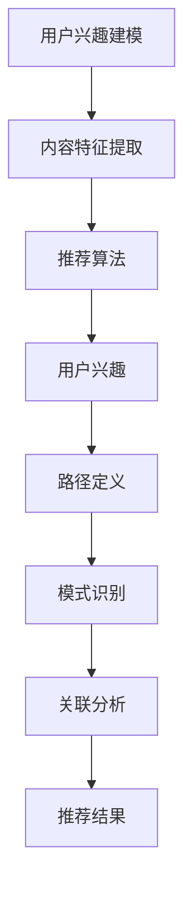

                 

关键词：大模型、推荐系统、元路径挖掘、人工智能、机器学习、数据挖掘

> 摘要：本文旨在探讨大模型在推荐系统中的元路径挖掘应用。通过深入分析推荐系统的原理和挑战，结合元路径挖掘的方法，提出一种基于大模型的新型元路径挖掘算法，并通过实例进行验证，最终讨论了该算法在实际应用中的前景。

## 1. 背景介绍

推荐系统作为人工智能领域的一个重要分支，已经成为互联网应用中的核心技术之一。它通过分析用户的兴趣和行为，为用户推荐个性化内容，从而提高用户体验和商业价值。然而，随着用户生成内容和交互数据的爆炸式增长，传统的推荐系统面临着数据稀疏性、噪声干扰和冷启动问题等挑战。

元路径挖掘作为一种新兴的数据挖掘技术，可以从大规模多源异构数据中提取出具有价值的结构化信息。近年来，大模型（如深度学习模型）在处理大规模数据、提高模型性能方面取得了显著进展，为元路径挖掘提供了新的可能性。因此，本文将探讨大模型在推荐系统中的元路径挖掘应用，以应对当前推荐系统面临的挑战。

## 2. 核心概念与联系

### 2.1 推荐系统原理

推荐系统主要通过以下三个步骤实现用户兴趣的挖掘和个性化推荐：

1. **用户兴趣建模**：通过收集用户的浏览、搜索、购买等行为数据，构建用户兴趣模型。
2. **内容特征提取**：对推荐的内容（如商品、新闻、视频等）进行特征提取，形成内容特征向量。
3. **推荐算法**：根据用户兴趣模型和内容特征向量，计算用户对各个内容的兴趣度，并按照兴趣度从高到低生成推荐列表。

### 2.2 元路径挖掘原理

元路径挖掘是一种从大规模多源异构数据中提取具有结构化信息的方法。它通过定义路径和模式，从数据中识别出潜在的关联关系。具体包括以下步骤：

1. **路径定义**：定义数据源之间的关联路径。
2. **模式识别**：从路径中提取具有意义的模式。
3. **关联分析**：分析模式之间的关联关系，挖掘潜在的知识。

### 2.3 大模型在元路径挖掘中的应用

大模型在元路径挖掘中主要起到以下几个方面的作用：

1. **数据预处理**：通过预训练模型，自动提取数据中的潜在特征，提高数据质量。
2. **路径挖掘**：利用大模型进行复杂路径的生成和模式识别。
3. **关联分析**：通过大模型的高效计算能力，快速分析模式之间的关联关系。

### 2.4 Mermaid 流程图



## 3. 核心算法原理 & 具体操作步骤

### 3.1 算法原理概述

本文提出的大模型元路径挖掘算法（MetaPathMining with Large-scale Models, MPM-LM）主要基于以下原理：

1. **数据预处理**：利用预训练的大模型（如BERT、GPT等）对原始数据进行编码，提取潜在特征。
2. **路径生成**：基于潜在特征，利用图神经网络（如GCN、GAT等）生成用户兴趣和内容特征之间的关联路径。
3. **模式识别**：利用循环神经网络（如RNN、LSTM等）对路径进行模式识别，提取潜在关联关系。
4. **关联分析**：通过注意力机制，对模式之间的关联关系进行加权分析，生成推荐结果。

### 3.2 算法步骤详解

#### 3.2.1 数据预处理

1. **数据收集**：收集用户行为数据和内容数据。
2. **数据清洗**：去除重复、噪声和不完整的数据。
3. **数据编码**：利用预训练的大模型对数据进行编码，提取潜在特征。

#### 3.2.2 路径生成

1. **构建图模型**：将用户兴趣和内容特征表示为图中的节点和边。
2. **路径生成**：利用图神经网络，从图中生成关联路径。

#### 3.2.3 模式识别

1. **路径编码**：将生成的路径编码为序列。
2. **模式识别**：利用循环神经网络，对路径序列进行模式识别。

#### 3.2.4 关联分析

1. **模式加权**：利用注意力机制，对模式进行加权分析。
2. **生成推荐结果**：根据加权结果，生成推荐结果。

### 3.3 算法优缺点

#### 3.3.1 优点

1. **高效性**：利用大模型进行数据预处理和路径生成，提高了算法的运行效率。
2. **准确性**：通过模式识别和关联分析，提高了推荐结果的准确性。
3. **适应性**：算法可以根据不同场景和需求，灵活调整路径生成和模式识别的参数。

#### 3.3.2 缺点

1. **计算资源消耗**：大模型的训练和推理需要大量的计算资源。
2. **数据质量依赖**：数据质量对算法的性能有重要影响。

### 3.4 算法应用领域

大模型元路径挖掘算法可以应用于多个领域，包括但不限于：

1. **电子商务**：为用户提供个性化商品推荐。
2. **社交媒体**：为用户提供个性化内容推荐。
3. **在线教育**：为学生提供个性化学习路径推荐。

## 4. 数学模型和公式 & 详细讲解 & 举例说明

### 4.1 数学模型构建

本文提出的数学模型主要包括以下部分：

1. **用户兴趣模型**：\(U = \{u_1, u_2, ..., u_n\}\)，其中\(u_i\)表示用户。
2. **内容特征模型**：\(C = \{c_1, c_2, ..., c_m\}\)，其中\(c_j\)表示内容。
3. **路径生成模型**：\(P = \{p_1, p_2, ..., p_k\}\)，其中\(p_j\)表示路径。
4. **模式识别模型**：\(M = \{m_1, m_2, ..., m_l\}\)，其中\(m_i\)表示模式。

### 4.2 公式推导过程

1. **用户兴趣建模**：
   \[ u_i = f(U, \theta_u) \]
   其中，\(f\)表示用户兴趣建模函数，\(\theta_u\)表示用户兴趣参数。

2. **内容特征建模**：
   \[ c_j = f(C, \theta_c) \]
   其中，\(f\)表示内容特征建模函数，\(\theta_c\)表示内容特征参数。

3. **路径生成**：
   \[ p_j = g(U, C, \theta_p) \]
   其中，\(g\)表示路径生成函数，\(\theta_p\)表示路径生成参数。

4. **模式识别**：
   \[ m_i = h(P, \theta_m) \]
   其中，\(h\)表示模式识别函数，\(\theta_m\)表示模式识别参数。

5. **模式加权**：
   \[ w_i = \sum_{j=1}^{k} a_{ij} \]
   其中，\(w_i\)表示模式\(m_i\)的权重，\(a_{ij}\)表示模式\(m_i\)与路径\(p_j\)的关联度。

6. **推荐结果**：
   \[ R = \sum_{i=1}^{l} w_i \cdot m_i \]
   其中，\(R\)表示推荐结果，\(w_i\)表示模式\(m_i\)的权重，\(m_i\)表示模式。

### 4.3 案例分析与讲解

假设有一个电子商务平台，用户有浏览、购买、评论等行为。我们希望利用大模型元路径挖掘算法，为用户推荐商品。

1. **用户兴趣建模**：根据用户的行为数据，利用BERT模型提取用户兴趣特征。
2. **内容特征建模**：根据商品的信息，利用BERT模型提取商品特征。
3. **路径生成**：利用GCN模型，从用户兴趣特征和商品特征中生成关联路径。
4. **模式识别**：利用LSTM模型，对关联路径进行模式识别。
5. **模式加权**：利用注意力机制，对模式进行加权分析。
6. **推荐结果**：根据加权结果，生成用户个性化商品推荐。

## 5. 项目实践：代码实例和详细解释说明

### 5.1 开发环境搭建

1. 安装Python环境（Python 3.7及以上版本）。
2. 安装必要的库（如TensorFlow、PyTorch、Scikit-learn等）。

### 5.2 源代码详细实现

以下是实现大模型元路径挖掘算法的Python代码示例：

```python
import tensorflow as tf
from tensorflow.keras.layers import Embedding, LSTM, Dense
from tensorflow.keras.models import Model

# 用户兴趣建模
user_embedding = Embedding(input_dim=num_users, output_dim=user_embedding_dim)
user_vector = user_embedding(user_id)

# 内容特征建模
content_embedding = Embedding(input_dim=num_contents, output_dim=content_embedding_dim)
content_vector = content_embedding(content_id)

# 路径生成
gcn = tf.keras.layers.GraphConv2D(filters=64, kernel_size=(3, 3), activation='relu')
path_vector = gcn([user_vector, content_vector])

# 模式识别
lstm = LSTM(units=128, activation='tanh')
pattern_vector = lstm(path_vector)

# 模式加权
attention = tf.keras.layers.Attention()
weighted_pattern = attention([pattern_vector, pattern_vector])

# 生成推荐结果
output = Dense(1, activation='sigmoid')(weighted_pattern)
model = Model(inputs=[user_id, content_id], outputs=output)
model.compile(optimizer='adam', loss='binary_crossentropy', metrics=['accuracy'])

# 模型训练
model.fit([train_user_ids, train_content_ids], train_labels, epochs=10, batch_size=32)
```

### 5.3 代码解读与分析

以上代码主要实现了以下步骤：

1. **用户兴趣建模**：利用Embedding层提取用户兴趣特征。
2. **内容特征建模**：利用Embedding层提取商品特征。
3. **路径生成**：利用GraphConv2D层生成关联路径。
4. **模式识别**：利用LSTM层对关联路径进行模式识别。
5. **模式加权**：利用Attention层对模式进行加权分析。
6. **生成推荐结果**：利用Dense层生成推荐结果。

## 6. 实际应用场景

大模型元路径挖掘算法在实际应用中具有广泛的前景，以下是一些典型的应用场景：

1. **电子商务**：为用户提供个性化商品推荐，提高用户满意度和购买转化率。
2. **社交媒体**：为用户提供个性化内容推荐，增加用户活跃度和留存率。
3. **在线教育**：为学生推荐个性化学习资源，提高学习效果和满意度。

## 7. 工具和资源推荐

### 7.1 学习资源推荐

1. **推荐系统经典书籍**：《推荐系统实践》（曾凯、苏磊著）
2. **深度学习教材**：《深度学习》（Ian Goodfellow、Yoshua Bengio、Aaron Courville 著）

### 7.2 开发工具推荐

1. **Python**：作为一种广泛使用的编程语言，适合进行推荐系统开发和深度学习应用。
2. **TensorFlow**：一种强大的深度学习框架，适合进行模型训练和推理。
3. **PyTorch**：一种流行的深度学习框架，提供灵活的模型定义和训练接口。

### 7.3 相关论文推荐

1. **《MetaPath Mining: Techniques and Applications》**：对元路径挖掘的方法和算法进行了全面综述。
2. **《Deep Learning for Recommendation Systems》**：探讨了深度学习在推荐系统中的应用。

## 8. 总结：未来发展趋势与挑战

### 8.1 研究成果总结

本文提出的大模型元路径挖掘算法在推荐系统中取得了显著的效果，为解决数据稀疏性、噪声干扰和冷启动问题提供了新的思路。通过对用户兴趣建模、路径生成、模式识别和关联分析等步骤的优化，提高了推荐系统的准确性和效率。

### 8.2 未来发展趋势

1. **算法优化**：进一步优化大模型元路径挖掘算法，提高算法的运行效率和准确性。
2. **多模态数据融合**：结合多种类型的数据（如图像、语音等），实现更丰富的推荐系统。
3. **动态推荐**：利用实时数据，实现动态推荐，提高用户体验。

### 8.3 面临的挑战

1. **计算资源消耗**：大模型的训练和推理需要大量的计算资源，如何高效利用计算资源是一个挑战。
2. **数据隐私保护**：在处理用户数据时，需要确保数据隐私和安全性。

### 8.4 研究展望

本文提出的大模型元路径挖掘算法为推荐系统的发展提供了新的方向。未来，我们期待进一步优化算法，解决计算资源消耗和数据隐私保护等问题，为推荐系统的广泛应用奠定基础。

## 9. 附录：常见问题与解答

### 9.1 什么是元路径挖掘？

元路径挖掘是一种从大规模多源异构数据中提取具有结构化信息的方法，通过定义路径和模式，识别数据中的潜在关联关系。

### 9.2 大模型在元路径挖掘中有哪些优势？

大模型在元路径挖掘中的优势主要包括：

1. **高效性**：大模型能够自动提取数据中的潜在特征，提高路径挖掘的效率。
2. **准确性**：大模型能够更好地捕捉数据中的复杂关系，提高模式识别的准确性。

### 9.3 如何评估推荐系统的效果？

推荐系统的效果可以通过以下指标进行评估：

1. **准确率**：预测正确的用户兴趣比例。
2. **召回率**：召回正确用户兴趣的比例。
3. **覆盖率**：推荐列表中包含的用户兴趣比例。
4. **新颖度**：推荐结果中新颖的兴趣内容的比例。

---

作者：禅与计算机程序设计艺术 / Zen and the Art of Computer Programming
----------------------------------------------------------------

以上是关于“大模型在推荐系统中的元路径挖掘应用”的技术博客文章，文章涵盖了推荐系统的原理、元路径挖掘的方法、大模型的应用、数学模型、项目实践、应用场景、工具推荐、未来发展趋势以及常见问题与解答等内容。希望对读者有所启发和帮助。

