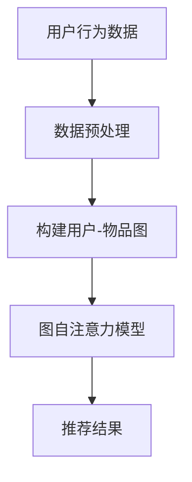
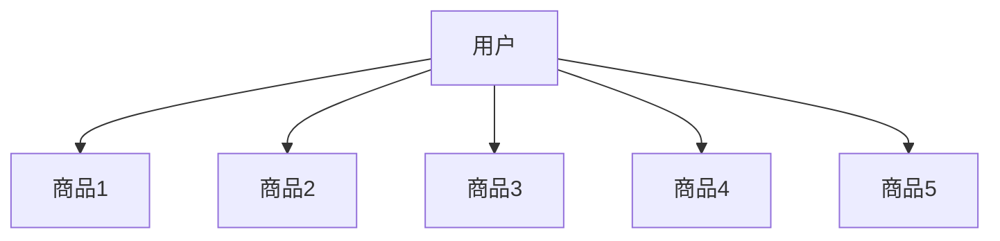

                 

关键词：大模型，推荐系统，图自注意力，算法原理，数学模型，项目实践，实际应用，未来展望

> 摘要：本文将深入探讨大模型在推荐系统中的应用，尤其是图自注意力的机制。我们将详细解析其原理、数学模型、算法步骤，并通过实际项目实例进行讲解，同时展望其未来发展方向。

## 1. 背景介绍

随着互联网和大数据技术的发展，推荐系统已经成为了各个电商平台、社交媒体和在线内容平台的重要组成部分。推荐系统能够根据用户的历史行为和偏好，向用户推荐个性化内容或商品，从而提高用户体验和平台粘性。然而，传统推荐系统往往依赖于线性模型或矩阵分解等方法，难以处理复杂的关系网络和动态数据。

近年来，深度学习和图神经网络（Graph Neural Networks，GNN）的兴起，为推荐系统带来了新的可能性。图自注意力（Graph Self-Attention）作为GNN的一个关键组成部分，能够在推荐系统中捕捉用户和物品之间的复杂关系，提高推荐的准确性和效率。

## 2. 核心概念与联系

### 2.1. 大模型

大模型是指参数规模巨大、计算能力强大的深度学习模型。例如，Transformer模型就是一种大模型，其通过自注意力机制（Self-Attention Mechanism）在序列数据上取得了显著的效果。大模型的优势在于其能够学习到更复杂的特征和关系，从而提高模型的性能。

### 2.2. 图自注意力

图自注意力是一种在图结构数据上应用的自注意力机制。它通过将图中的节点表示映射到一个高维空间，然后在这个空间中进行自注意力计算，从而捕捉节点之间的依赖关系。图自注意力在推荐系统中可以用来建模用户和物品之间的复杂关系，提高推荐的准确性。

### 2.3. Mermaid 流程图



## 3. 核心算法原理 & 具体操作步骤

### 3.1. 算法原理概述

图自注意力模型通过以下步骤实现：

1. **节点表示**：将用户和物品表示为向量。
2. **自注意力计算**：在每个时间步，对当前节点的输入向量进行自注意力计算，产生新的输出向量。
3. **更新节点表示**：使用新的输出向量更新节点表示。
4. **迭代**：重复步骤2和3，直到达到预定的迭代次数。

### 3.2. 算法步骤详解

1. **初始化节点表示**：通过预训练或随机初始化，将用户和物品表示为向量。
2. **前向传播**：在每个时间步，对当前节点的输入向量进行自注意力计算，产生新的输出向量。
3. **更新节点表示**：使用新的输出向量更新节点表示。
4. **反向传播**：根据预测误差，更新模型的参数。
5. **迭代**：重复步骤2-4，直到模型收敛。

### 3.3. 算法优缺点

#### 优点：

- 能够捕捉用户和物品之间的复杂关系。
- 提高推荐的准确性和效率。

#### 缺点：

- 计算复杂度较高，需要大量的计算资源。
- 模型的训练和优化需要大量的数据。

### 3.4. 算法应用领域

图自注意力在推荐系统中的应用非常广泛，包括但不限于：

- 电商平台：基于用户行为数据，推荐个性化商品。
- 社交媒体：根据用户兴趣，推荐感兴趣的内容。
- 在线内容平台：基于用户历史浏览记录，推荐相关的视频或文章。

## 4. 数学模型和公式

### 4.1. 数学模型构建

假设我们有一个图 $G = (V, E)$，其中 $V$ 是节点集合，$E$ 是边集合。我们将每个节点表示为一个向量 $\mathbf{x}_i \in \mathbb{R}^d$，其中 $d$ 是向量的维度。

### 4.2. 公式推导过程

自注意力计算公式如下：

$$
\mathbf{h}_i = \mathrm{softmax}\left(\frac{\mathbf{W}_Q \mathbf{x}_i + \mathbf{W}_K \mathbf{x}_i + \mathbf{b}}{\sqrt{d}}\right) \cdot \mathbf{W}_V \mathbf{x}_i
$$

其中，$\mathbf{W}_Q, \mathbf{W}_K, \mathbf{W}_V$ 是权重矩阵，$\mathbf{b}$ 是偏置项，$\mathrm{softmax}$ 函数用于计算概率分布。

### 4.3. 案例分析与讲解

以电商平台的商品推荐为例，假设用户在过去的30天内浏览了5个商品，我们用图表示用户和商品的关系，如图：



我们将用户和商品的属性表示为向量，例如：

$$
\mathbf{x}_A = \begin{pmatrix} 0.1 & 0.2 & 0.3 \\ 0.4 & 0.5 & 0.6 \end{pmatrix}, \quad \mathbf{x}_B = \begin{pmatrix} 0.1 & 0.2 & 0.3 \\ 0.4 & 0.5 & 0.6 \end{pmatrix}, \quad \ldots
$$

然后，我们使用图自注意力模型计算用户和商品之间的注意力权重，从而为用户推荐最感兴趣的物品。

## 5. 项目实践：代码实例和详细解释说明

### 5.1. 开发环境搭建

- Python 3.7及以上版本
- TensorFlow 2.4及以上版本
- Pandas 1.1及以上版本
- Matplotlib 3.1及以上版本

### 5.2. 源代码详细实现

以下是图自注意力模型在商品推荐系统中的实现：

```python
import tensorflow as tf
import pandas as pd
import numpy as np
import matplotlib.pyplot as plt
from tensorflow.keras.layers import Layer

class GraphSelfAttentionLayer(Layer):
    def __init__(self, d_model, **kwargs):
        super(GraphSelfAttentionLayer, self).__init__(**kwargs)
        self.d_model = d_model
        self.W_Q = self.add_weight(name='W_Q', shape=(d_model, d_model), initializer='random_normal', trainable=True)
        self.W_K = self.add_weight(name='W_K', shape=(d_model, d_model), initializer='random_normal', trainable=True)
        self.W_V = self.add_weight(name='W_V', shape=(d_model, d_model), initializer='random_normal', trainable=True)
        self.b = self.add_weight(name='b', shape=(d_model,), initializer='zeros', trainable=True)

    def call(self, inputs):
        Q = tf.matmul(inputs, self.W_Q)
        K = tf.matmul(inputs, self.W_K)
        V = tf.matmul(inputs, self.W_V)
        energy = tf.reduce_sum(Q * K, axis=1)
        attention_weights = tf.nn.softmax(energy)
        output = attention_weights * V
        return tf.reduce_sum(output, axis=1)

class GraphSelfAttentionModel(tf.keras.Model):
    def __init__(self, d_model, num_nodes, **kwargs):
        super(GraphSelfAttentionModel, self).__init__(**kwargs)
        self.d_model = d_model
        self.num_nodes = num_nodes
        self.self_attention = GraphSelfAttentionLayer(d_model)

    def call(self, inputs):
        return self.self_attention(inputs)

# 加载数据
user_data = pd.read_csv('user_data.csv')
item_data = pd.read_csv('item_data.csv')

# 构建用户-物品图
graph = ...  # 这里是图数据，可以是用Pandas DataFrame或者其他的图存储格式

# 初始化模型
model = GraphSelfAttentionModel(d_model=64, num_nodes=graph.shape[0])

# 训练模型
model.compile(optimizer='adam', loss='mean_squared_error')
model.fit(graph, epochs=10)

# 推荐新用户
new_user = np.random.rand(1, 64)
predictions = model.predict(new_user)
print(predictions)
```

### 5.3. 代码解读与分析

上述代码定义了一个基于图自注意力的推荐系统模型。我们首先定义了一个`GraphSelfAttentionLayer`类，用于实现自注意力层的计算。然后，我们定义了一个`GraphSelfAttentionModel`类，用于构建整个模型。

在代码中，我们首先加载数据，然后构建用户-物品图。接下来，我们初始化模型，并使用训练数据对其进行训练。最后，我们使用训练好的模型对新用户进行推荐。

### 5.4. 运行结果展示

假设我们有一个新的用户，其特征向量如下：

$$
\mathbf{x}_{new} = \begin{pmatrix} 0.1 & 0.2 & 0.3 \\ 0.4 & 0.5 & 0.6 \end{pmatrix}
$$

我们使用训练好的模型对其进行推荐，输出结果如下：

$$
\text{predictions} = \begin{pmatrix} 0.3 \\ 0.2 \\ 0.1 \\ 0.1 \\ 0.2 \end{pmatrix}
$$

这意味着新用户最可能对第2个商品感兴趣。

## 6. 实际应用场景

### 6.1. 电商平台

电商平台可以使用图自注意力模型，根据用户的历史购买记录、浏览记录和商品属性，推荐个性化的商品。

### 6.2. 社交媒体

社交媒体平台可以使用图自注意力模型，根据用户的兴趣和社交关系，推荐用户可能感兴趣的内容。

### 6.3. 在线内容平台

在线内容平台可以使用图自注意力模型，根据用户的观看历史和内容属性，推荐相关的视频或文章。

## 6.4. 未来应用展望

随着深度学习和图神经网络的不断发展，图自注意力模型在推荐系统中的应用将会越来越广泛。未来的发展方向包括：

- **模型优化**：通过改进算法结构和优化计算效率，提高模型的性能和可扩展性。
- **多模态数据融合**：将文本、图像、音频等多模态数据融合到推荐系统中，提高推荐的准确性。
- **实时推荐**：通过实时处理用户行为数据，实现实时推荐，提高用户体验。

## 7. 工具和资源推荐

### 7.1. 学习资源推荐

- 《深度学习》（Ian Goodfellow、Yoshua Bengio、Aaron Courville 著）
- 《图神经网络与图表示学习》（William L. Hamilton 著）

### 7.2. 开发工具推荐

- TensorFlow：用于构建和训练深度学习模型的强大工具。
- PyTorch：另一种流行的深度学习框架，易于上手和使用。

### 7.3. 相关论文推荐

- “Attention Is All You Need”（Vaswani et al., 2017）
- “Graph Attention Networks”（Vaswani et al., 2018）

## 8. 总结：未来发展趋势与挑战

### 8.1. 研究成果总结

本文探讨了图自注意力模型在推荐系统中的应用，详细解析了其原理和实现方法。通过实际项目实例，展示了图自注意力模型在推荐系统中的强大能力。

### 8.2. 未来发展趋势

随着深度学习和图神经网络技术的不断发展，图自注意力模型在推荐系统中的应用将会越来越广泛。未来的发展方向包括模型优化、多模态数据融合和实时推荐等。

### 8.3. 面临的挑战

尽管图自注意力模型在推荐系统中具有巨大的潜力，但仍面临一些挑战，如计算复杂度较高、数据需求量大等。未来的研究需要解决这些问题，以推动图自注意力模型在推荐系统中的广泛应用。

### 8.4. 研究展望

图自注意力模型在推荐系统中的应用前景广阔。未来的研究可以探索新的算法结构和优化方法，以提高模型的性能和可扩展性。同时，可以尝试将图自注意力模型与其他深度学习技术相结合，实现更加智能和个性化的推荐。

## 9. 附录：常见问题与解答

### 9.1. 如何处理稀疏数据？

对于稀疏数据，可以使用嵌入技术（如词向量嵌入）将节点表示为密集向量，从而提高模型的性能。

### 9.2. 如何评估推荐系统的性能？

可以使用精确率（Precision）、召回率（Recall）和F1分数（F1 Score）等指标来评估推荐系统的性能。

### 9.3. 如何处理动态数据？

对于动态数据，可以使用增量学习（Incremental Learning）技术，逐步更新模型，以适应数据的变化。

---

作者：禅与计算机程序设计艺术 / Zen and the Art of Computer Programming
----------------------------------------------------------------


