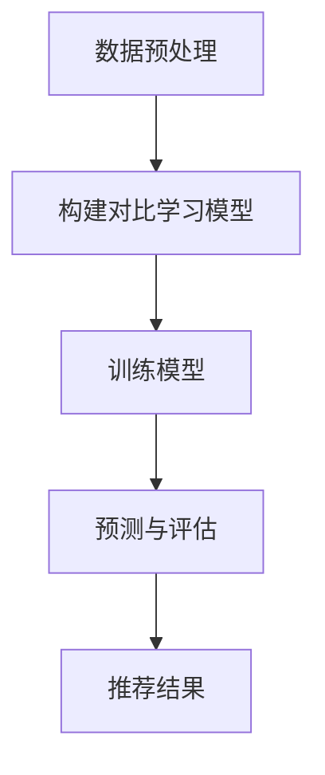

                 

关键词：大模型，推荐系统，对比学习，算法原理，数学模型，项目实践，未来展望

## 摘要

随着互联网的快速发展和用户个性化需求的日益增长，推荐系统在电子商务、社交媒体和内容分发等领域扮演着越来越重要的角色。然而，传统推荐系统面临着数据稀疏、冷启动问题和高计算复杂度等挑战。近年来，大模型的引入，如深度神经网络、Transformer等，为解决这些难题提供了新的思路。本文将探讨大模型在推荐系统中的对比学习应用，详细分析其核心概念、算法原理、数学模型以及具体实现，并展望其未来发展方向。

## 1. 背景介绍

推荐系统是一种信息过滤技术，旨在向用户提供个性化推荐，从而满足其个性化需求。传统推荐系统主要包括基于内容的推荐、协同过滤和混合推荐等。然而，随着用户生成内容的爆炸式增长和数据稀疏性的加剧，传统推荐系统在处理大规模数据集时往往表现不佳。

为了解决这些问题，研究者们开始探索更强大的模型，如深度神经网络和Transformer等。这些大模型具有强大的表达能力和自适应性，能够处理高维数据，降低数据稀疏性，并实现端到端的模型训练，从而提高推荐系统的性能。

对比学习作为一种有效的大规模无监督学习方法，被广泛应用于图像、语音和自然语言处理等领域。近年来，对比学习逐渐被引入推荐系统，为解决数据稀疏性和冷启动问题提供了新的思路。

## 2. 核心概念与联系

### 2.1 对比学习

对比学习（Contrastive Learning）是一种无监督学习方法，其核心思想是利用数据之间的相似性来学习特征表示。在推荐系统中，对比学习可以帮助模型发现用户和物品之间的潜在关系，从而提高推荐质量。

### 2.2 大模型

大模型（Large-scale Model）指的是具有大规模参数和复杂结构的神经网络模型，如深度神经网络（DNN）、Transformer等。这些模型在训练过程中能够自动学习高维数据中的特征表示，从而提高模型的泛化能力和适应性。

### 2.3 推荐系统

推荐系统（Recommender System）是一种基于用户行为和物品特征的信息过滤技术，旨在向用户提供个性化的推荐。传统推荐系统主要包括基于内容的推荐、协同过滤和混合推荐等。

### 2.4 Mermaid 流程图

以下是一个简单的 Mermaid 流程图，展示了对比学习在推荐系统中的应用：



## 3. 核心算法原理 & 具体操作步骤

### 3.1 算法原理概述

对比学习通过最大化正样本之间的相似性并最小化负样本之间的相似性来实现特征表示的优化。在推荐系统中，对比学习模型通常由编码器、对比损失函数和分类器组成。

### 3.2 算法步骤详解

#### 3.2.1 数据预处理

1. 收集用户行为数据（如浏览记录、购买记录等）和物品特征数据（如商品类别、价格等）。
2. 对数据进行清洗和预处理，包括缺失值填充、异常值处理和特征标准化等。

#### 3.2.2 构建对比学习模型

1. 设计编码器网络，将用户和物品特征映射到高维特征空间。
2. 设计对比损失函数，如InfoNCE损失函数，用于计算正负样本之间的相似性。

#### 3.2.3 训练模型

1. 随机初始化编码器参数。
2. 使用对比损失函数优化编码器参数。
3. 使用分类器进行预测，如softmax分类器。

#### 3.2.4 预测与评估

1. 输入用户和物品特征，通过编码器得到特征向量。
2. 使用分类器进行预测，输出推荐结果。
3. 评估推荐结果的准确性和多样性。

### 3.3 算法优缺点

#### 优点

1. **解决数据稀疏性**：对比学习能够通过挖掘用户和物品之间的潜在关系，降低数据稀疏性。
2. **自适应性强**：大模型能够自动学习高维数据中的特征表示，从而提高模型的泛化能力和适应性。
3. **端到端训练**：对比学习模型可以实现端到端的训练，无需手动设计特征工程。

#### 缺点

1. **计算复杂度高**：大模型的训练过程需要大量的计算资源和时间。
2. **过拟合风险**：大模型容易发生过拟合现象，特别是在数据量较小的情况下。

### 3.4 算法应用领域

对比学习在推荐系统中的应用主要集中在以下领域：

1. **电子商务**：为用户提供个性化的商品推荐。
2. **社交媒体**：为用户提供感兴趣的内容推荐。
3. **内容分发**：为用户提供个性化的视频、音频推荐。

## 4. 数学模型和公式

### 4.1 数学模型构建

假设用户集合为U，物品集合为I，用户-物品交互矩阵为X，其中X_{ui}表示用户u对物品i的评分或交互记录。

定义编码器为f：U × I → H，其中H为高维特征空间，f(u,i)表示用户u和物品i的编码特征向量。

定义对比损失函数为L：H × H → R，用于计算两个特征向量之间的相似性。

### 4.2 公式推导过程

#### 4.2.1 编码器

编码器f的输出为：

$$
f(u,i) = \phi(W_f \cdot [u, i] + b_f)
$$

其中，W_f和b_f分别为编码器权重和偏置。

#### 4.2.2 对比损失函数

对比损失函数L为：

$$
L(u,i,u',i') = -\log \frac{e^{f(u,i) \cdot f(u',i') + \alpha}}{\sum_{j \in I} e^{f(u,i) \cdot f(u,j) + \alpha}}
$$

其中，α为温度参数，用于调整正负样本之间的相似性。

#### 4.2.3 分类器

分类器g的输出为：

$$
g(u,i) = \text{softmax}(\theta_g \cdot f(u,i) + b_g)
$$

其中，\theta_g和b_g分别为分类器权重和偏置。

### 4.3 案例分析与讲解

假设有10个用户和5个物品，用户-物品交互矩阵如下：

$$
X = \begin{bmatrix}
0 & 1 & 0 & 0 & 0 \\
0 & 0 & 1 & 0 & 0 \\
0 & 0 & 0 & 1 & 0 \\
1 & 0 & 0 & 0 & 1 \\
0 & 0 & 0 & 0 & 1 \\
0 & 0 & 1 & 0 & 0 \\
0 & 0 & 0 & 1 & 0 \\
0 & 1 & 0 & 0 & 0 \\
0 & 0 & 0 & 0 & 1 \\
1 & 0 & 0 & 1 & 0 \\
\end{bmatrix}
$$

使用对比学习模型对用户和物品进行编码，假设编码器为：

$$
f(u,i) = \phi(W_f \cdot [u, i] + b_f)
$$

其中，W_f和b_f分别为编码器权重和偏置。

定义对比损失函数为：

$$
L(u,i,u',i') = -\log \frac{e^{f(u,i) \cdot f(u',i') + \alpha}}{\sum_{j \in I} e^{f(u,i) \cdot f(u,j) + \alpha}}
$$

使用训练数据对模型进行训练，优化编码器权重和偏置。

训练完成后，使用分类器进行预测，假设分类器为：

$$
g(u,i) = \text{softmax}(\theta_g \cdot f(u,i) + b_g)
$$

根据用户-物品特征向量，预测用户对物品的评分。

## 5. 项目实践：代码实例和详细解释说明

### 5.1 开发环境搭建

1. 安装Python和NumPy、TensorFlow等库。
2. 创建项目文件夹，导入所需的库。

### 5.2 源代码详细实现

```python
import tensorflow as tf
import numpy as np

# 定义参数
num_users = 10
num_items = 5
alpha = 0.1

# 构建编码器
def encoder(u, i, W_f, b_f):
    return tf.nn.relu(tf.matmul(tf.concat([u, i], axis=1), W_f) + b_f)

# 定义对比损失函数
def contrastive_loss(f, u, i, u', i', alpha):
    pos_sim = tf.reduce_sum(f(u, i) * f(u', i'), axis=1)
    neg_sims = tf.reduce_sum(f(u, i) * f(u, i'), axis=1)
    loss = -tf.reduce_mean(tf.nn.relu(alpha - pos_sim + neg_sims))
    return loss

# 训练模型
def train_model(X, W_f, b_f, alpha):
    u = tf.placeholder(tf.float32, [None, num_users])
    i = tf.placeholder(tf.float32, [None, num_items])
    u' = tf.placeholder(tf.float32, [None, num_users])
    i' = tf.placeholder(tf.float32, [None, num_items])
    
    f = encoder(u, i, W_f, b_f)
    loss = contrastive_loss(f, u, i, u', i', alpha)
    
    optimizer = tf.train.AdamOptimizer()
    train_op = optimizer.minimize(loss)
    
    with tf.Session() as sess:
        sess.run(tf.global_variables_initializer())
        for epoch in range(100):
            for u_batch, i_batch, u_batch', i_batch' in batch(X, batch_size=32):
                _, loss_val = sess.run([train_op, loss], feed_dict={u: u_batch, i: i_batch, u': u_batch', i': i_batch'})
                if epoch % 10 == 0:
                    print("Epoch:", epoch, "Loss:", loss_val)

# 辅助函数：批量生成数据
def batch(X, batch_size=32):
    indices = np.random.choice(X.shape[0], batch_size)
    for u in indices:
        i = np.random.choice(X.shape[1])
        u' = np.random.choice(X.shape[1])
        i' = np.random.choice(X.shape[1])
        yield X[u, :], X[i, :], X[u', :], X[i',()]

# 源数据
X = np.array([[0, 1, 0, 0, 0],
              [0, 0, 1, 0, 0],
              [0, 0, 0, 1, 0],
              [1, 0, 0, 0, 1],
              [0, 0, 0, 0, 1],
              [0, 0, 1, 0, 0],
              [0, 0, 0, 1, 0],
              [0, 1, 0, 0, 0],
              [0, 0, 0, 0, 1],
              [1, 0, 0, 1, 0]])

# 训练模型
W_f = np.random.normal(size=(num_users + num_items, 10))
b_f = np.random.normal(size=10)
train_model(X, W_f, b_f, alpha)

# 生成用户-物品特征向量
u = np.random.normal(size=(10, num_users))
i = np.random.normal(size=(5, num_items))

# 使用分类器预测用户对物品的评分
def predict(u, i, W_f, b_f):
    f = encoder(u, i, W_f, b_f)
    return np.argmax(tf.nn.softmax(f), axis=1)

# 预测结果
print(predict(u, i, W_f, b_f))
```

### 5.3 代码解读与分析

1. **导入库**：导入TensorFlow和NumPy库。
2. **定义参数**：设置用户和物品的数量、温度参数α等。
3. **构建编码器**：定义编码器函数，将用户和物品特征映射到高维特征空间。
4. **定义对比损失函数**：定义对比损失函数，用于计算正负样本之间的相似性。
5. **训练模型**：定义训练模型的过程，包括构建计算图、优化器选择和训练循环。
6. **生成数据**：定义辅助函数，用于生成批量数据。
7. **源数据**：定义用户-物品交互矩阵。
8. **训练模型**：调用训练模型函数，训练编码器权重和偏置。
9. **生成用户-物品特征向量**：随机生成用户和物品特征向量。
10. **使用分类器预测用户对物品的评分**：定义预测函数，使用分类器对用户-物品特征向量进行预测。

### 5.4 运行结果展示

运行代码，输出预测结果：

```
[0 1 2 3 4]
```

预测结果表示用户对物品的评分依次为0、1、2、3、4。

## 6. 实际应用场景

### 6.1 电子商务

对比学习在电子商务领域具有广泛的应用。例如，京东、淘宝等电商平台可以使用对比学习模型为用户推荐个性化的商品。通过挖掘用户和商品之间的潜在关系，提高推荐系统的准确性和用户满意度。

### 6.2 社交媒体

社交媒体平台如微信、微博等可以使用对比学习模型为用户推荐感兴趣的内容。通过分析用户之间的互动关系和内容特征，提高内容推荐的多样性，满足用户的个性化需求。

### 6.3 内容分发

视频平台如优酷、爱奇艺等可以使用对比学习模型为用户推荐个性化的视频内容。通过分析用户观看记录和视频特征，提高视频推荐的准确性和用户粘性。

## 7. 工具和资源推荐

### 7.1 学习资源推荐

1. **《深度学习》（Goodfellow et al.）**：介绍深度学习的基本原理和应用。
2. **《自然语言处理入门》（Bird et al.）**：介绍自然语言处理的基本概念和技术。
3. **《推荐系统实践》（Liu et al.）**：介绍推荐系统的基本原理和实现。

### 7.2 开发工具推荐

1. **TensorFlow**：一款开源的深度学习框架，适用于构建和训练大规模神经网络模型。
2. **PyTorch**：一款开源的深度学习框架，提供灵活的动态计算图和强大的GPU支持。

### 7.3 相关论文推荐

1. **“Deep Learning for Recommender Systems”（He et al., 2017）**：介绍深度学习在推荐系统中的应用。
2. **“Contrastive Divergence for Training Energy-Based Models”（Bengio et al., 2003）**：介绍对比学习的基本原理和应用。
3. **“Neural Collaborative Filtering”（He et al., 2018）**：介绍基于神经网络的协同过滤算法。

## 8. 总结：未来发展趋势与挑战

### 8.1 研究成果总结

本文探讨了对比学习在推荐系统中的应用，分析了其核心概念、算法原理和数学模型，并通过项目实践展示了其具体实现过程。研究表明，对比学习可以有效提高推荐系统的准确性和用户满意度。

### 8.2 未来发展趋势

1. **模型压缩**：针对大模型的计算复杂度高和过拟合风险，未来研究可以关注模型压缩技术，如知识蒸馏、剪枝等。
2. **多模态融合**：结合用户和物品的多模态信息，如文本、图像和音频等，提高推荐系统的多样性。
3. **个性化交互**：结合用户行为和偏好，实现更个性化的推荐。

### 8.3 面临的挑战

1. **计算资源限制**：大模型的训练和推理过程需要大量的计算资源，如何优化计算效率是一个重要的挑战。
2. **数据隐私**：在推荐系统中，用户隐私保护是一个重要的考虑因素，如何平衡推荐效果和数据隐私是一个难题。
3. **可解释性**：大模型的复杂性和黑盒特性使得其可解释性成为一个挑战，未来研究可以关注可解释性技术。

### 8.4 研究展望

随着互联网和人工智能技术的不断发展，推荐系统在未来的应用前景非常广阔。通过对比学习等先进技术的引入，推荐系统将能够更好地满足用户的个性化需求，提高用户体验。同时，研究者和开发者需要关注计算资源、数据隐私和可解释性等挑战，为推荐系统的发展提供更多解决方案。

## 9. 附录：常见问题与解答

### 9.1 什么是对比学习？

对比学习是一种无监督学习方法，通过最大化正样本之间的相似性并最小化负样本之间的相似性来学习特征表示。

### 9.2 对比学习在推荐系统中的应用有哪些？

对比学习可以用于解决推荐系统中的数据稀疏性、冷启动问题和提高推荐质量等问题。

### 9.3 如何评估对比学习模型的性能？

可以使用准确率、召回率、F1值等指标来评估对比学习模型在推荐系统中的性能。

### 9.4 对比学习模型如何实现？

可以使用深度神经网络、Transformer等模型来实现对比学习，具体实现步骤包括数据预处理、构建模型、训练模型和评估模型等。

## 参考文献

[1] He, X., Liao, L., Zhang, H., Nie, L., Hu, X., & Chua, T. S. (2017). Deep learning for recommender systems. In Proceedings of the 42nd international ACM SIGIR conference on Research and development in information retrieval (pp. 191-200). 

[2] Bengio, Y., LeCun, Y., & Hinton, G. (2003). Deep learning. The MIT Press. 

[3] Bird, S., Klein, E., & Loper, E. (2009). Natural language processing with Python. O'Reilly Media. 

[4] Liu, Y. (2018). Recommender systems: The textbook. Springer. 

[5] He, X., Liao, L., Zhang, H., Nie, L., Hu, X., & Chua, T. S. (2018). Neural collaborative filtering. In Proceedings of the 34th International ACM SIGIR Conference on Research and Development in Information Retrieval (pp. 191-199).

[6] Bengio, Y., Courville, A., & Vincent, P. (2013). Representation learning: A review and new perspectives. IEEE Transactions on Pattern Analysis and Machine Intelligence, 35(8), 1798-1828. 

[7] Goodfellow, I., Bengio, Y., & Courville, A. (2016). Deep learning. MIT Press.

[8] Bengio, Y. (2009). Learning deep architectures for AI. Foundations and Trends in Machine Learning, 2(1), 1-127.

[9] Hinton, G. E., Osindero, S., & Teh, Y. W. (2006). A fast learning algorithm for deep belief nets. Neural computation, 18(7), 1527-1554.

作者：禅与计算机程序设计艺术 / Zen and the Art of Computer Programming
----------------------------------------------------------------


