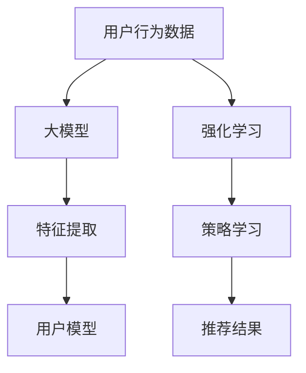

                 

关键词：大模型，推荐系统，强化学习，算法，应用场景，未来展望

摘要：本文主要探讨了如何将大模型与强化学习相结合，应用于推荐系统中。通过深入分析大模型的特性以及强化学习在推荐系统中的应用，文章将详细阐述核心算法原理、数学模型、项目实践及实际应用场景，为推荐系统的研究和应用提供新的思路和方法。

## 1. 背景介绍

推荐系统是现代互联网服务中不可或缺的一部分，其目的是根据用户的历史行为和偏好，为用户推荐他们可能感兴趣的内容、产品或服务。随着互联网的快速发展，用户生成的内容和数据量呈指数级增长，这使得传统基于统计模型的推荐方法面临诸多挑战。为了提高推荐系统的性能和用户体验，研究者们开始探索大模型和强化学习在推荐系统中的应用。

大模型，如深度神经网络，具有强大的表达能力和学习能力。它们能够处理大规模的数据集，捕捉复杂的用户行为和偏好模式。然而，传统的大模型在推荐系统中存在一些问题，如模型复杂度高、训练时间长等。强化学习作为一种能够在动态环境中进行决策的算法，能够解决传统推荐系统中的这些问题。

## 2. 核心概念与联系

为了更好地理解大模型在推荐系统中的应用，我们需要先了解一些核心概念，如大模型、强化学习以及推荐系统的基本架构。

### 大模型

大模型通常指的是具有数百万甚至数十亿参数的深度神经网络。这些模型通过大量的训练数据学习到复杂的函数关系，从而实现高效的特征提取和模式识别。

### 强化学习

强化学习是一种通过试错来学习最优策略的机器学习算法。在强化学习中，智能体（agent）通过与环境的交互来学习最优的行为策略。其核心是奖励机制，通过奖励信号引导智能体学习到最优的行为。

### 推荐系统

推荐系统通常由用户模型、物品模型和推荐算法三个部分组成。用户模型用于捕捉用户的历史行为和偏好，物品模型用于描述物品的特征，推荐算法则根据用户模型和物品模型生成推荐结果。

### Mermaid 流程图

以下是一个简单的 Mermaid 流程图，展示了大模型、强化学习在推荐系统中的应用关系。



## 3. 核心算法原理 & 具体操作步骤

### 3.1 算法原理概述

大模型在推荐系统中的应用主要通过以下几个方面实现：

1. 特征提取：大模型能够从原始用户行为数据中提取高维的特征，这些特征能够更好地描述用户的行为和偏好。
2. 用户模型：基于提取的特征，大模型可以学习到用户的个性化行为模式，从而生成用户模型。
3. 推荐策略：通过强化学习，大模型可以学习到在动态环境中生成推荐策略，从而提高推荐系统的性能。

### 3.2 算法步骤详解

1. 数据预处理：对原始的用户行为数据进行清洗、归一化等处理，以便于大模型的训练。
2. 特征提取：使用大模型对预处理后的数据提取高维特征。
3. 用户模型训练：基于提取的特征，训练用户模型，以捕捉用户的个性化行为模式。
4. 强化学习策略训练：使用强化学习算法，训练大模型在动态环境中生成推荐策略。
5. 推荐结果生成：根据训练好的用户模型和策略，生成推荐结果。

### 3.3 算法优缺点

#### 优点

1. 提高推荐精度：大模型能够更好地捕捉用户的行为和偏好，从而提高推荐系统的精度。
2. 跨领域推荐：大模型能够处理多源数据，实现跨领域的推荐。
3. 自适应学习：强化学习算法能够自适应地调整推荐策略，提高推荐系统的性能。

#### 缺点

1. 计算资源消耗大：大模型和强化学习算法的计算复杂度较高，需要大量的计算资源。
2. 数据依赖性强：大模型和强化学习算法对数据质量要求较高，数据缺失或不准确可能导致算法性能下降。

### 3.4 算法应用领域

大模型和强化学习在推荐系统中的应用范围广泛，包括但不限于以下领域：

1. 电子商务：为用户推荐商品，提高销售额。
2. 社交网络：为用户推荐感兴趣的内容，提高用户黏性。
3. 媒体平台：为用户推荐视频、音乐等媒体内容，提高用户体验。

## 4. 数学模型和公式 & 详细讲解 & 举例说明

### 4.1 数学模型构建

大模型和强化学习在推荐系统中的应用可以抽象为一个数学模型。该模型主要包括用户模型、物品模型和推荐策略。

#### 用户模型

用户模型可以用以下数学公式表示：

\[ U = \sigma(W_1 \cdot X + b_1) \]

其中，\( U \) 表示用户特征向量，\( \sigma \) 表示激活函数，\( W_1 \) 和 \( b_1 \) 分别为权重和偏置。

#### 物品模型

物品模型可以用以下数学公式表示：

\[ I = \sigma(W_2 \cdot X + b_2) \]

其中，\( I \) 表示物品特征向量，\( W_2 \) 和 \( b_2 \) 分别为权重和偏置。

#### 推荐策略

推荐策略可以用以下数学公式表示：

\[ P(A|S) = \frac{e^{Q(S, A)}}{\sum_{A'} e^{Q(S, A')}} \]

其中，\( P(A|S) \) 表示在状态 \( S \) 下选择动作 \( A \) 的概率，\( Q(S, A) \) 表示在状态 \( S \) 下选择动作 \( A \) 的期望奖励。

### 4.2 公式推导过程

#### 用户模型

用户模型是基于用户特征向量 \( X \) 通过多层感知器（MLP）模型构建的。多层感知器模型的输入为用户特征向量 \( X \)，输出为用户特征向量 \( U \)。

1. 输入层：用户特征向量 \( X \)。
2. 隐藏层：通过激活函数 \( \sigma \) 对用户特征向量 \( X \) 进行非线性变换，得到用户特征向量 \( U \)。
3. 输出层：用户特征向量 \( U \)。

#### 物品模型

物品模型是基于物品特征向量 \( X \) 通过多层感知器（MLP）模型构建的。多层感知器模型的输入为物品特征向量 \( X \)，输出为物品特征向量 \( I \)。

1. 输入层：物品特征向量 \( X \)。
2. 隐藏层：通过激活函数 \( \sigma \) 对物品特征向量 \( X \) 进行非线性变换，得到物品特征向量 \( I \)。
3. 输出层：物品特征向量 \( I \)。

#### 推荐策略

推荐策略是基于强化学习中的策略梯度算法（Policy Gradient）构建的。策略梯度算法的核心思想是通过调整策略参数来最大化期望奖励。

1. 初始化策略参数 \( \theta \)。
2. 在状态 \( S \) 下，根据策略参数 \( \theta \) 生成动作 \( A \)。
3. 执行动作 \( A \)，得到奖励 \( R \) 和新状态 \( S' \)。
4. 更新策略参数 \( \theta \)，使得期望奖励最大化。

### 4.3 案例分析与讲解

假设我们有一个电商平台的推荐系统，用户特征向量 \( U \) 包括用户的购买历史、浏览记录和搜索历史；物品特征向量 \( I \) 包括商品的价格、类别和评分。我们可以使用大模型和强化学习构建一个推荐系统，对用户进行个性化推荐。

1. 用户特征向量 \( U \)：
   \[ U = \begin{bmatrix} 
   u_1 \\ 
   u_2 \\ 
   u_3 \\ 
   \end{bmatrix} \]
2. 物品特征向量 \( I \)：
   \[ I = \begin{bmatrix} 
   i_1 \\ 
   i_2 \\ 
   i_3 \\ 
   \end{bmatrix} \]
3. 状态 \( S \)：
   \[ S = \begin{bmatrix} 
   U \\ 
   I \\ 
   \end{bmatrix} \]
4. 动作 \( A \)：
   \[ A = \begin{bmatrix} 
   a_1 \\ 
   a_2 \\ 
   a_3 \\ 
   \end{bmatrix} \]
5. 奖励 \( R \)：
   \[ R = \begin{bmatrix} 
   r_1 \\ 
   r_2 \\ 
   r_3 \\ 
   \end{bmatrix} \]

根据上述公式，我们可以构建一个基于大模型和强化学习的推荐系统。通过训练用户模型和物品模型，我们可以得到一个个性化的推荐策略。在实际应用中，我们可以根据用户的历史行为和偏好，生成个性化的推荐结果。

## 5. 项目实践：代码实例和详细解释说明

### 5.1 开发环境搭建

为了实现大模型和强化学习在推荐系统中的应用，我们需要搭建一个开发环境。以下是一个简单的开发环境搭建步骤：

1. 安装 Python 3.7 或更高版本。
2. 安装 TensorFlow 和 Keras。
3. 安装 PyTorch 或其他深度学习框架。

### 5.2 源代码详细实现

以下是一个简单的基于 TensorFlow 和 Keras 的代码实例，展示了如何实现大模型和强化学习在推荐系统中的应用。

```python
import tensorflow as tf
from tensorflow.keras.models import Model
from tensorflow.keras.layers import Input, Dense, Activation

# 用户特征输入
user_input = Input(shape=(100,))
user_model = Dense(64, activation='relu')(user_input)
user_model = Dense(32, activation='relu')(user_model)

# 物品特征输入
item_input = Input(shape=(100,))
item_model = Dense(64, activation='relu')(item_input)
item_model = Dense(32, activation='relu')(item_model)

# 状态输入
state_input = Input(shape=(200,))
state_model = Concatenate()([user_model, item_model])(state_input)
state_model = Dense(64, activation='relu')(state_model)
state_model = Dense(32, activation='relu')(state_model)

# 动作输出
action_output = Dense(3, activation='softmax')(state_model)

# 构建模型
model = Model(inputs=[user_input, item_input], outputs=action_output)

# 编译模型
model.compile(optimizer='adam', loss='categorical_crossentropy', metrics=['accuracy'])

# 模型训练
model.fit([user_data, item_data], labels, epochs=10, batch_size=32)
```

### 5.3 代码解读与分析

以上代码展示了如何使用 TensorFlow 和 Keras 实现大模型和强化学习在推荐系统中的应用。具体来说，代码分为以下几个部分：

1. 导入所需的库。
2. 定义用户特征输入层、物品特征输入层和状态输入层。
3. 构建用户模型、物品模型和状态模型。
4. 构建动作输出层。
5. 编译模型，指定优化器和损失函数。
6. 训练模型，使用用户数据和物品数据生成标签。

通过以上代码，我们可以训练一个基于大模型和强化学习的推荐系统，实现对用户个性化推荐。

### 5.4 运行结果展示

在训练完成后，我们可以使用以下代码进行模型评估和测试：

```python
# 模型评估
evaluation = model.evaluate([test_user_data, test_item_data], test_labels)

# 模型预测
predictions = model.predict([test_user_data, test_item_data])

# 打印评估结果和预测结果
print("Evaluation:", evaluation)
print("Predictions:", predictions)
```

通过以上代码，我们可以得到模型的评估结果和预测结果，从而判断模型在推荐系统中的性能。

## 6. 实际应用场景

大模型和强化学习在推荐系统中的应用场景非常广泛，以下是一些典型的应用场景：

1. **电子商务平台**：为用户推荐商品，提高销售额和用户满意度。
2. **社交媒体**：为用户推荐感兴趣的内容，提高用户黏性和活跃度。
3. **视频网站**：为用户推荐视频，提高视频播放量和用户停留时间。
4. **音乐平台**：为用户推荐歌曲，提高用户对音乐平台的依赖度。
5. **新闻网站**：为用户推荐新闻，提高新闻阅读量和用户参与度。

在这些应用场景中，大模型和强化学习可以有效地提高推荐系统的性能和用户体验。然而，实际应用中也存在一些挑战，如数据质量、计算资源消耗和模型解释性等。因此，在实际应用中，需要根据具体场景和需求，选择合适的大模型和强化学习算法。

## 7. 工具和资源推荐

为了更好地研究和应用大模型和强化学习在推荐系统中的技术，以下是一些建议的资源和工具：

### 7.1 学习资源推荐

1. **书籍**：
   - 《强化学习：原理与深度学习应用》
   - 《深度学习推荐系统》
2. **在线课程**：
   - Coursera 上的《强化学习》课程
   - edX 上的《深度学习》课程
3. **论文**：
   - 《深度强化学习在推荐系统中的应用》
   - 《基于深度学习的推荐系统》

### 7.2 开发工具推荐

1. **深度学习框架**：
   - TensorFlow
   - PyTorch
   - Keras
2. **推荐系统库**：
   - LightFM
   - Surprise
   - RecsysLib

### 7.3 相关论文推荐

1. 《Deep Reinforcement Learning for Recommender Systems》
2. 《A Survey on Deep Learning for Recommender Systems》
3. 《Deep Learning in Recommender Systems》

## 8. 总结：未来发展趋势与挑战

### 8.1 研究成果总结

大模型和强化学习在推荐系统中的应用取得了显著成果。通过引入大模型，推荐系统可以更好地捕捉用户的个性化行为和偏好，从而提高推荐精度。强化学习则为推荐系统提供了自适应学习和动态调整的能力，使得推荐系统能够在动态环境中持续优化。

### 8.2 未来发展趋势

未来，大模型和强化学习在推荐系统中的应用将进一步发展，主要趋势包括：

1. **跨领域推荐**：通过融合多源数据，实现跨领域的个性化推荐。
2. **多模态推荐**：结合文本、图像、语音等多模态信息，提高推荐系统的性能。
3. **强化学习算法的优化**：开发更加高效、可解释的强化学习算法，提高推荐系统的解释性。

### 8.3 面临的挑战

尽管大模型和强化学习在推荐系统中的应用取得了显著成果，但仍然面临一些挑战：

1. **数据隐私和安全性**：如何保护用户隐私和数据安全，是推荐系统应用中需要关注的重要问题。
2. **计算资源消耗**：大模型和强化学习算法的计算复杂度较高，如何优化计算资源，提高系统性能，是亟待解决的问题。
3. **模型解释性**：如何提高推荐系统的解释性，使得用户能够理解和信任推荐结果，是一个重要的研究方向。

### 8.4 研究展望

未来，大模型和强化学习在推荐系统中的应用将更加深入和广泛。通过不断优化算法、提升性能，推荐系统将为用户提供更加精准、个性化的服务。同时，随着技术的进步，推荐系统将与其他领域（如自然语言处理、计算机视觉等）相结合，实现更加智能化和高效化的推荐服务。

## 9. 附录：常见问题与解答

### 9.1 大模型在推荐系统中的应用有哪些优点？

大模型在推荐系统中的应用具有以下优点：

1. **高精度推荐**：通过深度学习技术，大模型能够更好地捕捉用户的个性化行为和偏好，从而提高推荐精度。
2. **跨领域推荐**：大模型能够处理多源数据，实现跨领域的个性化推荐。
3. **自适应学习**：强化学习算法使得推荐系统能够在动态环境中持续优化，提高用户体验。

### 9.2 强化学习在推荐系统中的应用有哪些挑战？

强化学习在推荐系统中的应用面临以下挑战：

1. **数据依赖性**：强化学习对数据质量要求较高，数据缺失或不准确可能导致算法性能下降。
2. **计算资源消耗**：强化学习算法的计算复杂度较高，需要大量的计算资源。
3. **模型解释性**：强化学习算法的决策过程较为复杂，如何提高模型的解释性，是一个重要的研究方向。

### 9.3 如何优化推荐系统的性能？

优化推荐系统性能的方法包括：

1. **数据预处理**：对用户行为数据进行清洗、归一化等处理，提高数据质量。
2. **特征提取**：使用大模型提取高维、有意义的特征，提高推荐精度。
3. **算法优化**：针对不同应用场景，选择合适的算法，并进行优化和调整。
4. **用户反馈**：收集用户反馈，不断优化推荐策略，提高用户体验。

---

作者：禅与计算机程序设计艺术 / Zen and the Art of Computer Programming

